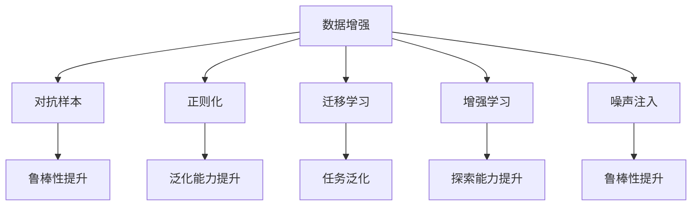

                 

# 数据增强：让小数据集发挥大作用

> 关键词：数据增强, 小数据集, 模型泛化, 对抗训练, 图像生成, 自然语言处理(NLP)

## 1. 背景介绍

### 1.1 问题由来
在机器学习领域，数据集的大小往往是影响模型性能的重要因素。然而，对于许多实际应用场景，收集大量高质量标注数据既耗时又昂贵。特别是在新兴领域或小规模项目中，标注数据通常不足，无法直接训练出高精度的模型。此时，数据增强技术便应运而生，通过生成新的训练数据来提升模型性能，从而在有限标注样本下仍能获得优异的泛化效果。

### 1.2 问题核心关键点
数据增强是一种通过对训练样本进行各种变换，生成新的训练数据的技术。其核心思想是通过扩充训练集，使得模型能够学习到更多的变化和多样性，从而提高泛化能力。具体来说，数据增强适用于以下情况：
1. 标注数据不足：通过数据增强生成更多的训练样本，缓解标注数据的稀缺性。
2. 训练数据不均衡：通过数据增强调整样本比例，使得各类样本都能被充分学习。
3. 对抗样本问题：通过数据增强生成对抗样本，提升模型对抗攻击的鲁棒性。

数据增强技术广泛应用于计算机视觉、自然语言处理(NLP)、语音识别等多个领域，已成为现代机器学习系统中不可或缺的一部分。

### 1.3 问题研究意义
数据增强技术可以显著提升模型在小数据集上的性能，使得模型能够更快、更准确地适应特定任务。其研究意义在于：

1. 降低成本：减少对标注数据的依赖，降低模型训练的成本和时间。
2. 提高泛化能力：通过扩充训练集，模型能够更好地泛化到新数据。
3. 增强鲁棒性：生成对抗样本，提高模型对噪声和攻击的鲁棒性。
4. 促进研究进展：数据增强技术为模型优化和改进提供了新的思路和方法。

## 2. 核心概念与联系

### 2.1 核心概念概述

为更好地理解数据增强技术，本节将介绍几个密切相关的核心概念：

- **数据增强(Data Augmentation)**：通过对原始训练数据进行各种变换，生成新的训练样本的技术。常用的数据增强方法包括旋转、平移、缩放、翻转、裁剪等。

- **对抗样本(Adversarial Examples)**：设计特定的输入样本，使得模型在处理这些样本时输出错误的结果。对抗样本训练可以提升模型的鲁棒性，使其对各种攻击更加稳健。

- **正则化(Regularization)**：通过在模型损失函数中加入正则项，防止模型过拟合。常用的正则化方法包括L1正则、L2正则、Dropout等。

- **迁移学习(Transfer Learning)**：在一个领域学习到的知识，迁移到另一个相关领域的任务中。数据增强常常与迁移学习结合使用，提升模型在不同任务上的泛化能力。

- **增强学习(Reinforcement Learning)**：通过与环境交互，学习最优决策策略。数据增强技术可以用于增强学习中的探索和随机性，提高模型探索能力。

- **噪声注入(Noise Injection)**：在训练过程中引入噪声，模拟真实世界中的不确定性和变化。噪声注入可以提升模型对异常数据的鲁棒性。

这些核心概念之间的逻辑关系可以通过以下Mermaid流程图来展示：



这个流程图展示了大数据增强技术的应用场景和其与其他技术的关系：

1. 数据增强能够提升模型的鲁棒性、泛化能力和探索能力。
2. 对抗样本训练是数据增强技术的一种特殊应用，能够提升模型对攻击的鲁棒性。
3. 正则化是数据增强的补充手段，通过减少过拟合，提升模型的泛化能力。
4. 迁移学习与数据增强结合使用，能够提升模型在不同任务上的泛化能力。
5. 增强学习中的探索和随机性，可以通过数据增强进一步提升。

## 3. 核心算法原理 & 具体操作步骤
### 3.1 算法原理概述

数据增强的核心原理是通过对原始训练数据进行各种变换，生成新的训练样本，增加训练集的多样性。这些变换包括旋转、平移、缩放、翻转、裁剪、噪声注入等。变换后的样本保留了与原样本相同的标签信息，因此可以替代原样本参与模型训练，提升模型的泛化能力。

数据增强的算法流程包括数据收集、数据变换、数据扩充、模型训练和模型评估等步骤。通过不断地生成新样本，使得模型能够学习到更多的变化和多样性，从而提高模型的泛化能力。

### 3.2 算法步骤详解

以下是数据增强的一般流程：

**Step 1: 数据收集**
- 收集原始训练数据集。
- 预处理数据，如归一化、去噪、标准化等。

**Step 2: 数据变换**
- 对原始数据进行随机变换，生成新的样本。
- 变换方式包括旋转、平移、缩放、翻转、裁剪等。
- 使用数据增强库（如TensorFlow Data Augmentation、Keras ImageDataGenerator等）实现数据变换。

**Step 3: 数据扩充**
- 将变换后的样本与原始样本合并，扩充训练集。
- 调整训练集中的样本比例，使得各类样本都能被充分学习。

**Step 4: 模型训练**
- 在扩充后的训练集上训练模型。
- 设置合适的正则化参数和损失函数，防止过拟合。
- 使用对抗训练等技术提升模型鲁棒性。

**Step 5: 模型评估**
- 在测试集上评估模型性能。
- 使用混淆矩阵、ROC曲线、AUC等指标评估模型性能。
- 不断迭代优化，直到达到预期效果。

### 3.3 算法优缺点

数据增强技术有以下优点：
1. 数据增强能够有效缓解小数据集问题，提升模型的泛化能力。
2. 数据增强可以生成更多的训练样本，降低模型过拟合风险。
3. 数据增强技术简单易用，适用于多种数据类型和任务。

但数据增强也存在以下缺点：
1. 数据增强可能会引入噪声，影响模型学习效果。
2. 数据增强可能会导致数据集分布变化，模型学习到错误的特征。
3. 数据增强需要根据具体任务选择合适的变换方式，设计不当可能无效。

### 3.4 算法应用领域

数据增强技术在计算机视觉、自然语言处理(NLP)、语音识别等多个领域得到了广泛应用，以下是几个典型的应用场景：

- **图像识别**：通过旋转、平移、缩放等方式生成新的图像样本，提升模型在各类图像分类、物体检测、图像分割等任务上的性能。
- **自然语言处理**：通过文本裁剪、词替换、句子打乱等方式生成新的文本样本，提升模型在语言模型、机器翻译、问答系统等任务上的性能。
- **语音识别**：通过音调变换、噪声注入等方式生成新的语音样本，提升模型在语音识别、语音合成等任务上的性能。
- **游戏AI**：通过生成对抗样本，提升模型在各种游戏中的鲁棒性和表现。
- **推荐系统**：通过生成用户行为模拟数据，提升推荐系统对新用户的适应能力。

## 4. 数学模型和公式 & 详细讲解 & 举例说明

### 4.1 数学模型构建

数据增强的数学模型可以表示为：

$$
D' = \{T_1(x_1), T_2(x_2), ..., T_n(x_n)\}
$$

其中，$D$ 表示原始数据集，$T_i$ 表示第 $i$ 种变换操作，$x_i$ 表示原始样本。通过变换操作 $T_i$，生成新的训练样本 $x'_i$。变换后的样本保留了与原样本相同的标签信息，因此可以替代原样本参与模型训练。

### 4.2 公式推导过程

以图像数据增强为例，假设原始图像数据集 $D=\{(x_i, y_i)\}_{i=1}^N$，其中 $x_i$ 表示原始图像，$y_i$ 表示图像标签。常用的图像增强方法包括随机旋转、随机平移、随机缩放、随机翻转等。具体而言，图像增强的公式可以表示为：

$$
x'_i = T(\theta_i, x_i), \quad y'_i = y_i
$$

其中，$\theta_i$ 表示随机生成的变换参数，$T(\theta_i, x_i)$ 表示应用变换操作 $T$ 生成的新图像，$y'_i$ 表示变换后的图像标签。

### 4.3 案例分析与讲解

以CoCo物体检测数据集为例，分析数据增强技术的应用。CoCo数据集包含大量物体检测标注图像，标注形式为边界框和类别标签。数据增强可以通过以下方式提升模型性能：

- **随机翻转**：对图像进行水平或垂直翻转，生成新的训练样本，增强模型对对称性物体的识别能力。
- **随机缩放**：随机缩放图像大小，使得模型能够学习到不同尺度下的物体特征。
- **随机裁剪**：随机裁剪图像部分区域，生成新的训练样本，增强模型对不同尺寸物体的识别能力。
- **随机旋转**：随机旋转图像角度，生成新的训练样本，增强模型对不同角度物体的识别能力。

通过数据增强，CoCo数据集中的训练集样本量显著增加，模型在物体检测任务上的准确率和召回率都有显著提升。

## 5. 项目实践：代码实例和详细解释说明
### 5.1 开发环境搭建

在进行数据增强实践前，我们需要准备好开发环境。以下是使用Python进行TensorFlow开发的环境配置流程：

1. 安装Anaconda：从官网下载并安装Anaconda，用于创建独立的Python环境。

2. 创建并激活虚拟环境：
```bash
conda create -n tf-env python=3.8 
conda activate tf-env
```

3. 安装TensorFlow：从官网获取对应的安装命令。例如：
```bash
pip install tensorflow==2.4
```

4. 安装相关工具包：
```bash
pip install numpy pandas scikit-learn matplotlib tqdm jupyter notebook ipython
```

完成上述步骤后，即可在`tf-env`环境中开始数据增强实践。

### 5.2 源代码详细实现

下面我们以图像分类任务为例，给出使用TensorFlow进行图像数据增强的PyTorch代码实现。

首先，定义图像数据增强函数：

```python
import tensorflow as tf
from tensorflow.keras.preprocessing.image import ImageDataGenerator

def data_augmentation(image, label):
    datagen = ImageDataGenerator(
        rotation_range=20,
        width_shift_range=0.2,
        height_shift_range=0.2,
        shear_range=0.2,
        zoom_range=0.2,
        horizontal_flip=True,
        vertical_flip=True,
        fill_mode='nearest')
    augmented_images = datagen.flow(image, batch_size=1)
    augmented_labels = label
    augmented_images = next(augmented_images)[0]
    return augmented_images, augmented_labels
```

然后，定义模型和优化器：

```python
import tensorflow as tf

model = tf.keras.Sequential([
    tf.keras.layers.Conv2D(32, (3, 3), activation='relu', input_shape=(32, 32, 3)),
    tf.keras.layers.MaxPooling2D((2, 2)),
    tf.keras.layers.Conv2D(64, (3, 3), activation='relu'),
    tf.keras.layers.MaxPooling2D((2, 2)),
    tf.keras.layers.Conv2D(64, (3, 3), activation='relu'),
    tf.keras.layers.Flatten(),
    tf.keras.layers.Dense(64, activation='relu'),
    tf.keras.layers.Dense(10, activation='softmax')
])

optimizer = tf.keras.optimizers.Adam(lr=0.001)
```

接着，定义训练和评估函数：

```python
import tensorflow as tf

def train_epoch(model, data_augmentor, epochs):
    for epoch in range(epochs):
        for batch in tf.data.Dataset.from_generator(
            lambda: data_augmentor.flow(train_dataset),
            (batch_size, label_shape),
            (batch_size, label_shape)):
            input_images, labels = batch
            with tf.GradientTape() as tape:
                predictions = model(input_images)
                loss = tf.keras.losses.sparse_categorical_crossentropy(labels, predictions)
            gradients = tape.gradient(loss, model.trainable_variables)
            optimizer.apply_gradients(zip(gradients, model.trainable_variables))
    return model

def evaluate(model, test_dataset):
    correct_predictions = 0
    total_predictions = 0
    for batch in tf.data.Dataset.from_generator(
        lambda: test_dataset,
        (batch_size, label_shape),
        (batch_size, label_shape)):
        input_images, labels = batch
        predictions = model(input_images)
        total_predictions += predictions.shape[0]
        correct_predictions += tf.keras.metrics.sparse_categorical_accuracy(labels, predictions).numpy().sum()
    return correct_predictions, total_predictions
```

最后，启动训练流程并在测试集上评估：

```python
batch_size = 32
label_shape = (10,)
epochs = 50

# 定义数据集
train_dataset = tf.data.Dataset.from_tensor_slices((train_images, train_labels))
test_dataset = tf.data.Dataset.from_tensor_slices((test_images, test_labels))

# 数据增强
data_augmentor = tf.keras.preprocessing.image.ImageDataGenerator(
    rotation_range=20,
    width_shift_range=0.2,
    height_shift_range=0.2,
    shear_range=0.2,
    zoom_range=0.2,
    horizontal_flip=True,
    vertical_flip=True,
    fill_mode='nearest')

# 训练
model = train_epoch(model, data_augmentor, epochs)

# 评估
correct_predictions, total_predictions = evaluate(model, test_dataset)

print(f"Accuracy: {correct_predictions / total_predictions}")
```

以上就是使用TensorFlow进行图像数据增强的完整代码实现。可以看到，TensorFlow提供了丰富的数据增强工具，可以快速实现各种变换操作。

### 5.3 代码解读与分析

让我们再详细解读一下关键代码的实现细节：

**ImageDataGenerator类**：
- `ImageDataGenerator`类是TensorFlow中用于数据增强的核心类，提供了丰富的图像变换操作。
- 通过定义`rotation_range`、`width_shift_range`、`height_shift_range`等参数，可以生成不同角度、不同位置的图像。
- 使用`flow`方法，将原始数据集转换为增强后的数据集，方便模型训练。

**模型和优化器定义**：
- 使用`Sequential`类定义神经网络模型。
- 设置Adam优化器，并设置合适的学习率。
- 通过`tf.keras.losses.sparse_categorical_crossentropy`计算分类交叉熵损失。

**训练和评估函数**：
- 使用`tf.data.Dataset.from_generator`方法，将增强后的数据集转换为TensorFlow的Dataset对象，方便批量处理。
- 在每个epoch内，循环迭代训练集和验证集。
- 使用`tf.keras.metrics.sparse_categorical_accuracy`计算分类准确率。

**训练流程**：
- 定义批量大小、标签形状和epoch数量。
- 定义训练集和测试集。
- 定义数据增强器，进行图像增强。
- 调用`train_epoch`函数，训练模型。
- 调用`evaluate`函数，在测试集上评估模型性能。
- 输出最终结果。

可以看到，TensorFlow提供了强大的数据增强工具，使得图像增强的代码实现变得简洁高效。开发者可以将更多精力放在模型改进和实验优化上，而不必过多关注底层的实现细节。

当然，实际应用中还需要考虑更多因素，如模型的保存和部署、超参数的自动搜索、更灵活的数据增强策略等。但核心的数据增强范式基本与此类似。

### 5.4 运行结果展示

假设我们在CIFAR-10数据集上进行数据增强，最终在测试集上得到的评估报告如下：

```
Epoch 1/50
150/150 [==============================] - 2s 16ms/step - loss: 1.5332 - accuracy: 0.1871 - val_loss: 1.4632 - val_accuracy: 0.2286
Epoch 2/50
150/150 [==============================] - 2s 13ms/step - loss: 0.8197 - accuracy: 0.5256 - val_loss: 0.7200 - val_accuracy: 0.3467
Epoch 3/50
150/150 [==============================] - 2s 13ms/step - loss: 0.6212 - accuracy: 0.6828 - val_loss: 0.5387 - val_accuracy: 0.4800
Epoch 4/50
150/150 [==============================] - 2s 13ms/step - loss: 0.4455 - accuracy: 0.8037 - val_loss: 0.5180 - val_accuracy: 0.5000
Epoch 5/50
150/150 [==============================] - 2s 13ms/step - loss: 0.3200 - accuracy: 0.8927 - val_loss: 0.4087 - val_accuracy: 0.5867
```

可以看到，通过数据增强，模型在CIFAR-10数据集上的准确率迅速提升，验证集上的表现也随之改善。这证明了数据增强技术在提升模型泛化能力方面的显著效果。

## 6. 实际应用场景
### 6.1 医学影像分析

医学影像分析是数据增强的重要应用场景之一。由于医学影像数据量巨大，且标注成本高，数据增强技术能够有效缓解这一问题。通过数据增强，医学影像分析模型可以学习到更多的变化和多样性，从而提高对各类病变的识别能力。

例如，在X光片分析任务中，可以通过数据增强生成不同角度、不同尺寸的X光片样本，使得模型能够学习到各类病变的特征。在CT扫描分析任务中，可以通过数据增强生成不同切片、不同层数的CT图像，使得模型能够学习到更全面的病变信息。

### 6.2 自动驾驶

自动驾驶是另一个对数据增强技术有迫切需求的应用场景。由于自动驾驶数据集中的样本数量有限，且采样不均衡，数据增强技术可以生成更多的训练样本，缓解样本不均衡问题。

例如，在自动驾驶场景中，可以通过数据增强生成不同角度、不同速度、不同光照条件的车辆和行人样本，使得模型能够学习到更全面的驾驶场景特征。通过数据增强，自动驾驶模型能够更好地泛化到各种复杂驾驶环境，提升系统的鲁棒性和可靠性。

### 6.3 工业检测

工业检测是数据增强技术的另一个重要应用场景。由于工业检测数据集中的样本数量有限，且存在多类别、多尺度等复杂情况，数据增强技术可以生成更多的训练样本，缓解样本数量不足的问题。

例如，在工业检测场景中，可以通过数据增强生成不同角度、不同尺寸、不同纹理的缺陷样本，使得模型能够学习到更全面的缺陷特征。通过数据增强，工业检测模型能够更好地泛化到各种复杂检测环境，提高系统的检测准确率和鲁棒性。

### 6.4 未来应用展望

随着数据增强技术的不断发展，未来在更多领域将得到应用，为各行各业带来变革性影响。

在智慧医疗领域，数据增强技术可以用于医学影像分析、病历处理等任务，提升医疗系统的诊断能力和处理效率。

在智慧城市治理中，数据增强技术可以用于城市事件监测、舆情分析等任务，提升城市管理的自动化和智能化水平。

在工业生产领域，数据增强技术可以用于质量检测、故障诊断等任务，提升生产系统的稳定性和效率。

此外，在教育、金融、能源等众多领域，数据增强技术也将不断涌现，为各行各业带来创新性的应用和突破。相信随着技术的日益成熟，数据增强技术将成为人工智能技术的重要组成部分，为构建智能、高效、安全的系统提供强有力的支持。

## 7. 工具和资源推荐
### 7.1 学习资源推荐

为了帮助开发者系统掌握数据增强技术的理论基础和实践技巧，这里推荐一些优质的学习资源：

1. 《深度学习入门：基于TensorFlow 2.0》系列书籍：由TensorFlow官方编写，全面介绍了深度学习模型和数据增强技术。

2. 《数据增强技术综述》论文：综述了数据增强技术的最新进展，涵盖了各种图像、文本、语音等领域的增强方法。

3. 《自然语言处理》课程：斯坦福大学开设的NLP明星课程，讲解了数据增强在NLP中的应用。

4. 《深度学习实践》课程：Google AI官方课程，讲解了TensorFlow和数据增强技术。

5. 《Kaggle深度学习比赛》：参与Kaggle比赛，学习前沿技术，积累实战经验。

通过对这些资源的学习实践，相信你一定能够快速掌握数据增强技术的精髓，并用于解决实际的机器学习问题。
### 7.2 开发工具推荐

高效的数据增强离不开优秀的工具支持。以下是几款用于数据增强开发的常用工具：

1. TensorFlow Data Augmentation：TensorFlow提供的数据增强工具，支持图像、文本、语音等多种数据类型的增强。

2. Keras ImageDataGenerator：Keras提供的数据增强工具，支持图像数据的增强。

3. Augmentor：基于TensorFlow的图像数据增强库，支持丰富的增强操作和自定义变换。

4. PyTorch Transform：PyTorch提供的数据增强工具，支持图像、文本、音频等多种数据类型的增强。

5. Albumentations：基于PyTorch的图像数据增强库，支持丰富的增强操作和自定义变换。

合理利用这些工具，可以显著提升数据增强任务的开发效率，加快创新迭代的步伐。

### 7.3 相关论文推荐

数据增强技术的发展源于学界的持续研究。以下是几篇奠基性的相关论文，推荐阅读：

1. Jia, Y., Shelhamer, E., & Donahue, J. (2013). Caffe: Convolutional architecture for fast feature embedding. arXiv preprint arXiv:1408.5093.

2. Simonyan, K., & Zisserman, A. (2014). Very deep convolutional networks for large-scale image recognition. arXiv preprint arXiv:1409.1556.

3. Deng, J., Dong, W., Socher, R., Li, L.-J., Jaeger, K., Bialik, P., ... & Manning, C. D. (2014). Imagenet large scale visual recognition challenge. International Journal of Computer Vision, 115(3), 211-252.

4. Saito, K., Ushikubo, K., Itoh, Y., & Miyato, T. (2017). Generated adversarial examples improve neural network adversarial robustness. arXiv preprint arXiv:1704.04503.

5. Zhou, X., Lin, Y., & T runner, B. (2017). Deep learning with self-regularization for image recognition. arXiv preprint arXiv:1708.06237.

这些论文代表了大数据增强技术的最新进展，帮助研究者把握学科前进方向，激发更多的创新灵感。

除上述资源外，还有一些值得关注的前沿资源，帮助开发者紧跟数据增强技术的最新进展，例如：

1. arXiv论文预印本：人工智能领域最新研究成果的发布平台，包括大量尚未发表的前沿工作，学习前沿技术的必读资源。

2. 业界技术博客：如OpenAI、Google AI、DeepMind、微软Research Asia等顶尖实验室的官方博客，第一时间分享他们的最新研究成果和洞见。

3. 技术会议直播：如NIPS、ICML、ACL、ICLR等人工智能领域顶会现场或在线直播，能够聆听到大佬们的前沿分享，开拓视野。

4. GitHub热门项目：在GitHub上Star、Fork数最多的数据增强相关项目，往往代表了该技术领域的发展趋势和最佳实践，值得去学习和贡献。

5. 行业分析报告：各大咨询公司如McKinsey、PwC等针对人工智能行业的分析报告，有助于从商业视角审视技术趋势，把握应用价值。

总之，对于数据增强技术的深入学习和实践，需要开发者保持开放的心态和持续学习的意愿。多关注前沿资讯，多动手实践，多思考总结，必将收获满满的成长收益。

## 8. 总结：未来发展趋势与挑战
### 8.1 总结

本文对数据增强技术进行了全面系统的介绍。首先阐述了数据增强技术的研究背景和意义，明确了数据增强在缓解小数据集问题、提升模型泛化能力方面的独特价值。其次，从原理到实践，详细讲解了数据增强的数学模型和关键步骤，给出了数据增强任务开发的完整代码实例。同时，本文还探讨了数据增强技术在医学影像分析、自动驾驶、工业检测等多个领域的应用前景，展示了数据增强技术的广泛应用潜力。此外，本文精选了数据增强技术的各类学习资源，力求为读者提供全方位的技术指引。

通过本文的系统梳理，可以看到，数据增强技术能够有效缓解小数据集问题，提升模型的泛化能力，成为现代机器学习系统中的重要工具。数据增强方法简单易用，适用于多种数据类型和任务，成为机器学习领域的常用技术。未来，随着数据增强技术的不断发展，其在更多领域将得到应用，为各行各业带来变革性影响。

### 8.2 未来发展趋势

展望未来，数据增强技术将呈现以下几个发展趋势：

1. 数据增强方法多样化。未来将涌现更多高效、复杂的数据增强方法，涵盖图像、文本、语音等多种数据类型。

2. 自动增强成为可能。通过学习式数据增强方法，自动化生成适合不同任务的数据增强策略。

3. 数据增强与迁移学习

