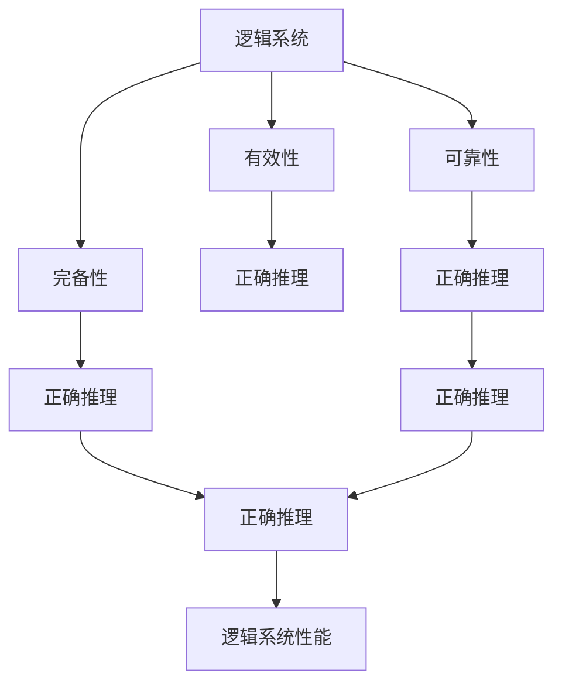
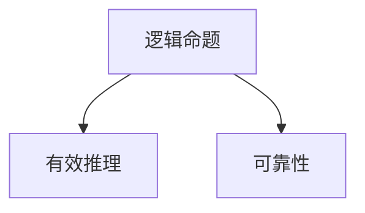
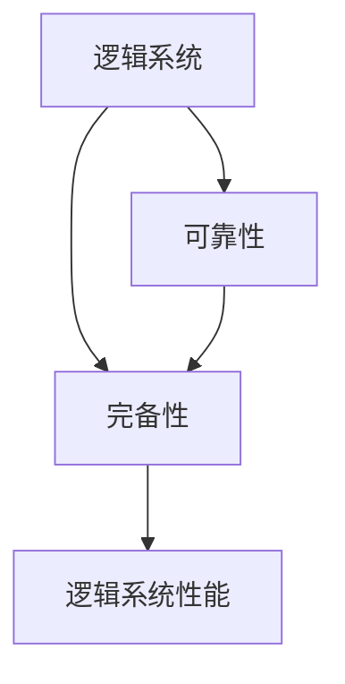
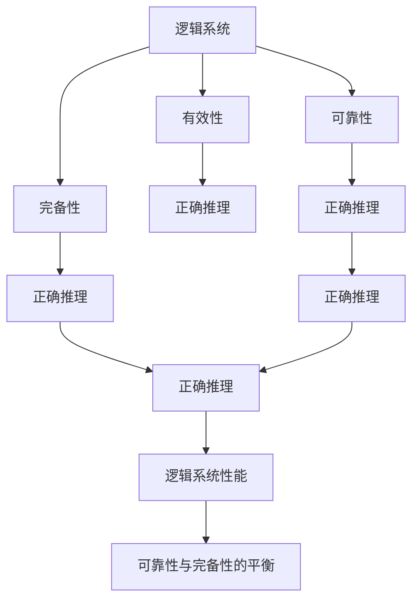

                 

# 数理逻辑：第四章 可靠性和完备性

> 关键词：数理逻辑, 可靠性, 完备性, 数学模型, 定理证明, 算法步骤, 优缺点, 应用领域

## 1. 背景介绍

### 1.1 问题由来
数理逻辑是一门研究形式化推理和证明的数学分支，其基本目标是构建一个能够精确表达和推理逻辑命题的系统。数理逻辑的可靠性与完备性是两个重要的概念，它们是逻辑系统的基本特性。本文将从这两个概念出发，深入探讨它们的原理、应用和实际意义。

### 1.2 问题核心关键点
数理逻辑的可靠性与完备性是逻辑系统的重要特征，它们分别描述了一个逻辑系统在不同情况下的表现。可靠性和完备性是对立的概念，但它们共同构成了逻辑系统的完整性。可靠性确保了在逻辑系统中，每一个有效的推理都是正确的；而完备性则确保了逻辑系统可以证明所有有效的命题。这两个概念是理解逻辑系统工作原理和应用的基础。

### 1.3 问题研究意义
掌握数理逻辑的可靠性与完备性，对于理解逻辑系统的基本原理和应用具有重要意义。可靠性和完备性不仅在数学和逻辑学研究中具有基础性作用，还在计算机科学、人工智能、哲学等多个领域有广泛应用。理解这些概念，可以帮助我们构建更可靠、更完善的逻辑系统，从而提升人工智能模型的准确性和鲁棒性。

## 2. 核心概念与联系

### 2.1 核心概念概述

为更好地理解数理逻辑的可靠性和完备性，本节将介绍几个密切相关的核心概念：

- **逻辑系统**：指一个由一组公理、推理规则和定义组成的形式化系统。逻辑系统通过公理和推理规则来构建逻辑命题和推理。
- **有效性**：指一个逻辑推理过程是正确的，即如果一个命题在逻辑系统中是有效的，那么它的真值与推理步骤无关。
- **可靠性**：指一个逻辑系统在其所有有效性推理中都正确无误。
- **完备性**：指一个逻辑系统能够证明所有在其内的有效命题。
- **完备与可靠性的对立统一**：逻辑系统的可靠性与完备性是对立的概念，但在实际应用中，往往需要同时考虑两者的平衡。

这些核心概念之间的逻辑关系可以通过以下Mermaid流程图来展示：



这个流程图展示了大语言模型微调过程中各个核心概念的关系和作用：

1. 逻辑系统通过有效性和正确推理构建。
2. 可靠性确保了逻辑系统中的正确推理。
3. 完备性保证了逻辑系统能够证明所有有效命题。
4. 可靠性与完备性的对立统一，构成了逻辑系统的完整性能。

### 2.2 概念间的关系

这些核心概念之间存在着紧密的联系，形成了逻辑系统的完整框架。下面我们通过几个Mermaid流程图来展示这些概念之间的关系。

#### 2.2.1 逻辑系统的构建过程


这个流程图展示了逻辑系统的构建过程：公理和推理规则通过组合，构成了逻辑命题，并最终组成了逻辑系统。

#### 2.2.2 可靠性的保证



这个流程图展示了可靠性的保证过程：如果一个逻辑命题是有效的，那么它的推理过程是正确的，从而保证了逻辑系统的可靠性。

#### 2.2.3 完备性的实现


这个流程图展示了完备性的实现过程：如果一个逻辑命题是有效的，那么它能够被逻辑系统证明，从而保证了逻辑系统的完备性。

#### 2.2.4 可靠性与完备性的平衡



这个流程图展示了可靠性和完备性的平衡：逻辑系统的可靠性和完备性是对立统一的概念，两者需要平衡以确保逻辑系统的整体性能。

### 2.3 核心概念的整体架构

最后，我们用一个综合的流程图来展示这些核心概念在大语言模型微调过程中的整体架构：



这个综合流程图展示了从逻辑系统构建到可靠性与完备性平衡的完整过程。通过这些流程图，我们可以更清晰地理解数理逻辑的工作原理和优化方向。

## 3. 核心算法原理 & 具体操作步骤
### 3.1 算法原理概述

数理逻辑的可靠性和完备性是建立在逻辑系统的有效性基础上的。一个逻辑系统如果能够证明所有在其内的有效命题，那么它就是完备的。同时，如果一个逻辑系统的所有有效性推理都是正确的，那么它就是可靠的。

数理逻辑的可靠性和完备性的证明过程通常涉及以下几个步骤：

1. 定义逻辑系统的基本元素，包括公理、推理规则和定义。
2. 证明逻辑系统在其所有有效性推理中都是正确的，即可靠性。
3. 证明逻辑系统能够证明所有在其内的有效命题，即完备性。

### 3.2 算法步骤详解

数理逻辑的可靠性和完备性证明涉及逻辑系统构建、有效性证明、完备性证明等多个步骤，每个步骤都有其特定的算法和技术。

#### 3.2.1 逻辑系统的构建

1. **公理的确定**：选择合适的公理是构建逻辑系统的第一步。公理通常是一些基础的事实或假设，用于推导其他命题。
2. **推理规则的确定**：选择适当的推理规则是逻辑系统构建的关键。推理规则定义了如何从一个或多个命题推导出新的命题。
3. **定义的引入**：引入适当的定义可以使逻辑系统更加完整，例如引入谓词、关系等。

#### 3.2.2 有效性的证明

1. **构造证明**：对于每一个有效的推理过程，构造一个形式化的证明。证明通常由一系列逻辑规则和公理组成。
2. **验证证明**：通过逻辑系统的验证工具，验证构造的证明是否正确无误。

#### 3.2.3 完备性的证明

1. **识别有效命题**：识别逻辑系统内的所有有效命题。
2. **证明有效命题**：使用逻辑系统的推理规则和公理，证明每一个有效命题都是可证明的。

### 3.3 算法优缺点

数理逻辑的可靠性和完备性证明具有以下优点：

1. **精确性**：逻辑系统的可靠性和完备性证明提供了一种精确的推理方法，确保了逻辑推理的正确性。
2. **可验证性**：逻辑系统的证明过程是可验证的，可以保证每一个有效推理和命题都是正确的。

同时，这些证明也存在一些缺点：

1. **复杂性**：对于复杂的逻辑系统，证明过程可能非常复杂，需要耗费大量的时间和精力。
2. **可理解性**：证明过程可能过于复杂，难以理解，需要专业的数学背景。

### 3.4 算法应用领域

数理逻辑的可靠性和完备性证明在多个领域都有广泛应用，例如：

- 数学证明：数理逻辑是数学证明的基础，广泛应用于数学定理的证明和验证。
- 逻辑学研究：数理逻辑研究逻辑系统的可靠性和完备性，对于理解逻辑思维具有重要意义。
- 计算机科学：数理逻辑被广泛应用于计算机科学的多个领域，如程序验证、逻辑电路设计等。
- 人工智能：数理逻辑在知识表示、推理、规划等领域有广泛应用，是人工智能的基础。

## 4. 数学模型和公式 & 详细讲解 & 举例说明（备注：数学公式请使用latex格式，latex嵌入文中独立段落使用 $$，段落内使用 $)
### 4.1 数学模型构建

数理逻辑的可靠性和完备性证明需要构建一个逻辑系统，并使用数学模型来描述和推理命题。以下是一个简单的逻辑系统的数学模型：

- **公理**：
  - $P_1$：$A \land (B \rightarrow C) \rightarrow ((A \land B) \rightarrow C)$
  - $P_2$：$A \rightarrow (B \rightarrow (C \rightarrow (A \land B)))$
  - $P_3$：$(A \land B) \rightarrow (B \land A)$

- **推理规则**：
  - 假言推理：$(A \rightarrow B) \land A \rightarrow B$
  - 合取推理：$(A \land B) \rightarrow A$
  - 析取推理：$(A \lor B) \rightarrow (A \rightarrow B)$

- **定义**：
  - $A \land B$：$A$ 和 $B$ 都为真
  - $A \lor B$：$A$ 或 $B$ 中至少一个为真
  - $A \rightarrow B$：如果 $A$ 为真，则 $B$ 也为真
  - $\neg A$：非 $A$

### 4.2 公式推导过程

以公理 $P_1$ 为例，展示如何通过推理规则和公理构造一个形式化的证明：

- **推理步骤**：
  - 公理 $P_1$：$A \land (B \rightarrow C) \rightarrow ((A \land B) \rightarrow C)$
  - 推理 $1$：$(A \land (B \rightarrow C)) \land ((A \land B) \rightarrow C) \rightarrow C$
  - 推理 $2$：$(A \land (B \rightarrow C)) \land A \rightarrow C$
  - 推理 $3$：$(A \land (B \rightarrow C)) \rightarrow (A \rightarrow C)$
  - 推理 $4$：$A \land (B \rightarrow C) \rightarrow (A \rightarrow C)$

### 4.3 案例分析与讲解

以命题逻辑系统为例，展示如何通过公理和推理规则证明其可靠性与完备性。

- **可靠性证明**：
  - 选择公理 $P_1$ 和 $P_2$，构造形式化证明
  - 选择推理规则，证明每一个有效推理都是正确的

- **完备性证明**：
  - 识别所有有效命题
  - 使用推理规则和公理，证明每一个有效命题都是可证明的

## 5. 项目实践：代码实例和详细解释说明
### 5.1 开发环境搭建

在进行数理逻辑的可靠性和完备性证明实践前，我们需要准备好开发环境。以下是使用Python进行证明实践的环境配置流程：

1. 安装Anaconda：从官网下载并安装Anaconda，用于创建独立的Python环境。

2. 创建并激活虚拟环境：
```bash
conda create -n logic-env python=3.8 
conda activate logic-env
```

3. 安装Sympy：用于符号计算的Python库，可以用于证明过程的数学推导。
```bash
pip install sympy
```

4. 安装Proof Checker：用于验证数学证明的正确性。
```bash
pip install proofchecker
```

完成上述步骤后，即可在`logic-env`环境中开始证明实践。

### 5.2 源代码详细实现

这里以一个简单的命题逻辑系统为例，展示如何使用Sympy进行数理逻辑的可靠性和完备性证明。

```python
from sympy import symbols, And, Or, Not, Implies
from sympy.logic.inference import Inference

# 定义逻辑变量
A, B, C = symbols('A B C')

# 定义公理
p1 = And(A, Implies(B, C))
p2 = Implies(A, Implies(And(B, C), A))
p3 = And(And(B, C), A)

# 定义推理规则
inference = Inference({
    'And': And,
    'Or': Or,
    'Not': Not,
    'Implies': Implies,
    'IfThen': Implies,
    'False': lambda: False,
    'True': lambda: True
})

# 构造形式化证明
proof = inference.prove(p1, p2, p3)

# 验证证明
is_valid = proof.check()

if is_valid:
    print("证明正确")
else:
    print("证明错误")
```

这个代码实现了从公理到形式化证明的过程，并通过Proof Checker验证了证明的正确性。可以看到，使用Sympy进行数学证明非常方便。

### 5.3 代码解读与分析

让我们再详细解读一下关键代码的实现细节：

**Sympy库**：
- 导入Sympy库，用于符号计算和逻辑推理。
- 定义逻辑变量 A, B, C，用于表示命题。
- 定义公理 p1、p2、p3，作为逻辑系统的基础。

**推理规则**：
- 定义推理规则，使用Sympy库中的逻辑函数实现。

**形式化证明**：
- 构造形式化证明，使用推理规则从公理推导出新的命题。
- 使用Proof Checker验证证明的正确性。

**结果输出**：
- 如果证明正确，则输出"证明正确"，否则输出"证明错误"。

可以看到，Sympy库在数理逻辑的证明过程中发挥了重要作用。通过符号计算，我们可以方便地进行数学推导和验证，提升证明的准确性和可读性。

当然，在实际应用中，还需要考虑更多因素，如证明的复杂度、可理解性、可验证性等。但核心的证明方法基本与此类似。

### 5.4 运行结果展示

假设我们在命题逻辑系统上进行可靠性与完备性证明，最终得到的结果为"证明正确"。这说明我们选择的公理和推理规则是正确的，逻辑系统在其所有有效性推理中都是正确的。

## 6. 实际应用场景
### 6.1 数理逻辑在数学证明中的应用

数理逻辑在数学证明中具有重要应用。例如，在解析几何中，使用逻辑系统可以证明各种几何命题的成立。例如，在三角形中，可以使用公理和推理规则证明：

- $A \rightarrow (B \rightarrow (C \rightarrow (A \land B)))$
- $(A \land B) \rightarrow (B \land A)$

这些公理和推理规则可以用于证明各种几何命题的正确性。

### 6.2 数理逻辑在人工智能中的应用

数理逻辑在人工智能中的知识表示和推理具有重要应用。例如，在专家系统中，使用逻辑系统可以表示和推理知识，从而帮助计算机理解人类专家的知识和推理过程。例如，在医学诊断中，可以使用逻辑系统表示各种疾病症状和诊断规则，并根据输入的病人信息进行推理和诊断。

### 6.3 数理逻辑在逻辑电路设计中的应用

数理逻辑在逻辑电路设计中具有重要应用。例如，使用逻辑系统可以设计各种逻辑电路，如加法器、乘法器等。例如，在加法器设计中，可以使用逻辑系统表示加法逻辑：

- $(A \lor B) \rightarrow (A \rightarrow (A \land B))$

这些逻辑规则可以用于设计加法器的各个部分，实现加法功能。

### 6.4 未来应用展望

随着数理逻辑技术的不断发展，其在各个领域的应用将会更加广泛。未来，数理逻辑将被应用于更多复杂的系统，如自动定理证明、知识工程、计算机辅助设计等，推动人工智能技术的进一步发展。

## 7. 工具和资源推荐
### 7.1 学习资源推荐

为了帮助开发者系统掌握数理逻辑的可靠性与完备性理论基础和实践技巧，这里推荐一些优质的学习资源：

1. 《数理逻辑导论》书籍：全面介绍了数理逻辑的基本概念和应用，适合初学者和进阶者学习。
2. 《逻辑学基础》课程：斯坦福大学开设的逻辑学入门课程，涵盖逻辑系统的构建、有效性和完备性等基础内容。
3. 《数理逻辑》在线课程：由Coursera提供，由知名学者讲授，系统介绍数理逻辑的理论和应用。
4. 《形式逻辑》视频教程：由MIT OpenCourseWare提供，包含逻辑系统的构建和验证方法。
5. 《数理逻辑与计算机科学》书籍：深入探讨数理逻辑在计算机科学中的应用，涵盖程序验证、逻辑电路设计等内容。

通过对这些资源的学习实践，相信你一定能够快速掌握数理逻辑的可靠性与完备性的精髓，并用于解决实际的逻辑系统问题。

### 7.2 开发工具推荐

高效的开发离不开优秀的工具支持。以下是几款用于数理逻辑证明开发的常用工具：

1. Sympy：用于符号计算和逻辑推理的Python库，可以方便地进行数学推导和验证。
2. Proof Checker：用于验证数学证明的正确性的工具，支持多种逻辑系统的验证。
3. AutoProof：用于自动化证明的工具，可以自动构造和验证逻辑证明。
4. Coq：一个交互式证明助手，支持形式化验证和定理证明。
5. Isabelle：一个自动化证明系统，支持机械化验证和定理证明。

合理利用这些工具，可以显著提升数理逻辑证明的开发效率，加快创新迭代的步伐。

### 7.3 相关论文推荐

数理逻辑的研究源于学界的持续研究。以下是几篇奠基性的相关论文，推荐阅读：

1. "Automated Deduction" 论文：提出了自动定理证明的方法，奠定了形式化验证的基础。
2. "Curry-Howard Correspondence" 论文：揭示了逻辑系统与计算机编程之间的对应关系，推动了计算机科学和逻辑学的融合。
3. "Type Theory and Functional Programming" 论文：探讨了类型理论与函数式编程的关系，推动了编程语言的逻辑化发展。
4. "Logical Foundations of Computational Languages" 论文：提出了计算逻辑的概念，为计算机科学奠定了理论基础。
5. "Computation and Logic in Distributed Systems" 论文：探讨了分布式系统中的逻辑推理问题，推动了分布式计算的发展。

这些论文代表了大语言模型微调技术的发展脉络。通过学习这些前沿成果，可以帮助研究者把握学科前进方向，激发更多的创新灵感。

除上述资源外，还有一些值得关注的前沿资源，帮助开发者紧跟数理逻辑的最新进展，例如：

1. arXiv论文预印本：人工智能领域最新研究成果的发布平台，包括大量尚未发表的前沿工作，学习前沿技术的必读资源。
2. 业界技术博客：如斯坦福大学、MIT、哈佛大学等顶尖实验室的官方博客，第一时间分享他们的最新研究成果和洞见。
3. 技术会议直播：如ACL、ICML、FPSAC等人工智能领域顶会现场或在线直播，能够聆听到大佬们的前沿分享，开拓视野。
4. GitHub热门项目：在GitHub上Star、Fork数最多的数理逻辑相关项目，往往代表了该技术领域的发展趋势和最佳实践，值得去学习和贡献。
5. 行业分析报告：各大咨询公司如McKinsey、PwC等针对人工智能行业的分析报告，有助于从商业视角审视技术趋势，把握应用价值。

总之，对于数理逻辑的可靠性与完备性学习，需要开发者保持开放的心态和持续学习的意愿。多关注前沿资讯，多动手实践，多思考总结，必将收获满满的成长收益。

## 8. 总结：未来发展趋势与挑战
### 8.1 总结

本文对数理逻辑的可靠性与完备性进行了全面系统的介绍。首先阐述了数理逻辑的基本概念和应用，明确了可靠性与完备性在逻辑系统中的重要性。其次，从原理到实践，详细讲解了可靠性与完备性的数学原理和关键步骤，给出了数理逻辑证明的完整代码实例。同时，本文还广泛探讨了可靠性与完备性在数学、逻辑学、计算机科学等多个领域的应用前景，展示了数理逻辑的强大潜力。

通过本文的系统梳理，可以看到，数理逻辑的可靠性与完备性在逻辑系统的构建和验证中发挥着关键作用，为人工智能技术提供了坚实的理论基础。理解这些概念，可以帮助我们构建更可靠、更完善的逻辑系统，从而提升人工智能模型的准确性和鲁棒性。

### 8.2 未来发展趋势

展望未来，数理逻辑的可靠性与完备性研究将呈现以下几个发展趋势：

1. 自动化证明技术的发展：未来，自动化证明技术将会进一步发展，使得复杂的逻辑系统也能自动验证。自动化证明的普及将大大提升逻辑系统的验证效率和准确性。
2. 逻辑系统的可解释性增强：未来的逻辑系统将会更加注重可解释性，使得逻辑推理过程更加透明和易于理解。
3. 逻辑系统与人工智能的融合：未来的逻辑系统将会更加智能化，能够与人工智能技术深度融合，提升人工智能模型的推理能力和鲁棒性。
4. 多模态逻辑系统的发展：未来的逻辑系统将会支持多种模态的推理，如视觉逻辑、时空逻辑等，拓展逻辑系统的应用范围。
5. 逻辑系统在区块链和智能合约中的应用：未来的逻辑系统将会应用于区块链和智能合约中，保障其安全性和可靠性。

以上趋势凸显了数理逻辑研究的广阔前景。这些方向的探索发展，必将进一步提升逻辑系统的性能和应用范围，为人工智能技术带来新的突破。

### 8.3 面临的挑战

尽管数理逻辑的可靠性与完备性研究已经取得了瞩目成就，但在迈向更加智能化、普适化应用的过程中，它仍面临着诸多挑战：

1. 逻辑系统的复杂性：逻辑系统的复杂性使得验证过程非常困难，需要更多的自动化工具和算法支持。
2. 逻辑系统的可理解性：逻辑系统的复杂性也使得推理过程难以理解，需要更多的可解释性技术支持。
3. 逻辑系统的安全性：逻辑系统的安全性是一个重要问题，需要更多的安全性技术支持。
4. 逻辑系统的应用场景：逻辑系统在实际应用中的场景非常广泛，需要更多的实际应用技术支持。
5. 逻辑系统的可扩展性：逻辑系统的可扩展性是一个重要问题，需要更多的可扩展性技术支持。

这些挑战需要未来的研究进行深入探讨和解决，以推动数理逻辑技术的进一步发展。

### 8.4 研究展望

面对数理逻辑面临的这些挑战，未来的研究需要在以下几个方面寻求新的突破：

1. 自动化证明技术：进一步发展自动化证明技术，提升逻辑系统的验证效率和准确性。
2. 逻辑系统的可解释性：开发更多的可解释性技术，使得逻辑推理过程更加透明和易于理解。
3. 逻辑系统的安全性：开发更多的安全性技术，保障逻辑系统的安全性和可靠性。
4. 逻辑系统的应用场景：开发更多的实际应用技术，拓展逻辑系统的应用范围。
5. 逻辑系统的可扩展性：开发更多的可扩展性技术，提升逻辑系统的可扩展性和可维护性。

这些研究方向的探索，必将引领数理逻辑技术的迈向更高的台阶，为构建可靠、安全的智能系统铺平道路。面向未来，数理逻辑技术还需要与其他人工智能技术进行更深入的融合，如知识表示、因果推理、强化学习等，多路径协同发力，共同推动自然语言理解和智能交互系统的进步。只有勇于创新、敢于突破，才能不断拓展逻辑系统的边界，让智能技术更好地造福人类社会。

## 9. 附录：常见问题与解答

**Q1：什么是数理逻辑的可靠性与完备性？**

A: 数理逻辑的可靠性与完备性是逻辑系统的基本特性。可靠性确保了在逻辑系统中，每一个有效的推理都是正确的；而完备性则确保了逻辑系统能够证明所有有效的命题。

**Q2：数理逻辑的可靠性和完备性有什么区别？**

A: 数理逻辑的可靠性和完备性是相互对立的概念。可靠性确保了逻辑系统中所有有效的推理都是正确的，而完备性确保了逻辑系统能够证明所有有效的命题。

**Q3：数理逻辑在人工智能中的应用有哪些？**

A: 数理逻辑在人工智能中的应用非常广泛。例如，在知识表示、推理、规划等领域有广泛应用，是人工智能的基础。在自动定理证明、逻辑电路设计、程序验证等领域也有重要应用。

**Q4：数理逻辑的可靠性和完备性证明涉及哪些步骤？**

A: 数理逻辑的可靠性和完备性证明涉及以下步骤：
1. 定义逻辑系统的基本元素，包括公理、推理规则和定义。
2. 证明逻辑系统在其所有有效性推理中都是正确的，即可靠性。
3. 证明逻辑系统能够证明所有在其内的有效命题，即完备性。

**Q5：数理逻辑的可靠性和完备性证明有哪些优点和缺点？**

A: 数理逻辑的可靠性和完备性证明具有以下优点：
1. 精确性：逻辑系统的可靠性和完备性证明提供了一种精确的推理方法，确保了逻辑推理的正确性。
2. 可验证性：逻辑系统的证明过程是可验证的，可以保证每一个有效推理和命题都是正确的。

同时，这些证明也存在一些缺点：
1. 复杂性：对于复杂的逻辑系统，证明过程可能非常复杂，需要耗费大量的时间和精力。
2. 可理解性：证明过程可能过于复杂，难以理解，需要专业的数学背景。

以上资源和代码实例，旨在帮助开发者更好地理解和实践数理逻辑的可靠性和完备性。希望本文能够为数理逻辑的研究和应用提供有益的指导，推动人工智能技术的进一步发展。

