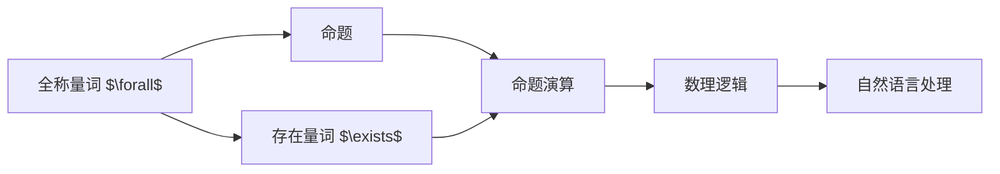

                 

# 数理逻辑：附录（一）命题量词

> 关键词：命题量词,逻辑学,数理逻辑,数学公式,命题演算,自然语言处理,计算机科学,形式化逻辑,语言学

## 1. 背景介绍

数理逻辑是计算机科学和数学中的一种基础理论，专注于形式化表达和推理。命题量词是数理逻辑中一个重要的概念，广泛应用于自然语言处理、计算机科学和语言学等领域。本文将详细介绍命题量词的基本概念、语法、应用及其相关数学模型的构建，并结合具体案例和实例，深入讲解命题量词在现实世界中的应用。

## 2. 核心概念与联系

### 2.1 核心概念概述

命题量词（Quantifier）是数理逻辑中用于表达集合或集合间关系的量词。它们能够对集合中的元素进行全称或存在性判定，从而用于定义复杂的数学命题和逻辑表达式。在自然语言处理中，命题量词的运用也极为常见，尤其是在自然语言推理和生成任务中。

常见的命题量词包括：
- 全称量词（Universal Quantifier）：$\forall$（对于所有）
- 存在量词（Existential Quantifier）：$\exists$（存在）

### 2.2 核心概念原理和架构的 Mermaid 流程图



该图表展示了命题量词在数理逻辑中的基本架构。全称量词和存在量词从基本命题出发，经过命题演算，最终应用于自然语言处理等实际领域。

## 3. 核心算法原理 & 具体操作步骤

### 3.1 算法原理概述

命题量词的原理基于一阶逻辑的谓词演算，用于对集合中的元素进行全集或子集的判定。全称量词表示对所有元素都满足某个性质，存在量词表示存在某个元素满足某个性质。命题量词的使用，使得逻辑表达式更加丰富和精确。

### 3.2 算法步骤详解

#### 3.2.1 全称量词的数学模型

全称量词的数学模型可以通过集合和谓词函数表示，假设 $U$ 是一个非空集合，$\phi(x)$ 是一个关于 $U$ 中元素 $x$ 的命题，则全称量词 $\forall$ 的数学模型为：

$$
\forall x \in U, \phi(x)
$$

表示对于 $U$ 中的所有元素 $x$，命题 $\phi(x)$ 都成立。

#### 3.2.2 存在量词的数学模型

存在量词的数学模型同样基于集合和谓词函数表示，对于集合 $U$ 和命题 $\phi(x)$，存在量词 $\exists$ 的数学模型为：

$$
\exists x \in U, \phi(x)
$$

表示存在至少一个元素 $x$ 在 $U$ 中，使得命题 $\phi(x)$ 成立。

### 3.3 算法优缺点

#### 3.3.1 优点

- 形式化表达：命题量词使得逻辑表达式更加严格和精确，便于形式化表达和推理。
- 灵活性高：能够表达复杂的集合和关系，适用于各种逻辑推理任务。
- 应用广泛：在自然语言处理、计算机科学和语言学等领域都有广泛应用。

#### 3.3.2 缺点

- 语法复杂：命题量词的语法较为复杂，理解和使用需要一定的数学基础。
- 处理难度大：在处理大规模数据时，命题量词的表达和推理难度较大，需要进行优化。

### 3.4 算法应用领域

命题量词的应用领域十分广泛，包括：
- 数理逻辑：用于表达和推理复杂数学命题。
- 计算机科学：用于程序设计中的条件语句和循环语句。
- 自然语言处理：用于生成和解析自然语言文本，特别是在自然语言推理任务中。
- 语言学：用于分析和研究语言结构，特别是在形式语言理论中。

## 4. 数学模型和公式 & 详细讲解 & 举例说明

### 4.1 数学模型构建

命题量词的数学模型通常基于谓词演算，假设 $U$ 是一个非空集合，$\phi(x)$ 是一个关于 $U$ 中元素 $x$ 的命题，则全称量词 $\forall$ 的数学模型为：

$$
\forall x \in U, \phi(x)
$$

表示对于 $U$ 中的所有元素 $x$，命题 $\phi(x)$ 都成立。存在量词 $\exists$ 的数学模型为：

$$
\exists x \in U, \phi(x)
$$

表示存在至少一个元素 $x$ 在 $U$ 中，使得命题 $\phi(x)$ 成立。

### 4.2 公式推导过程

#### 4.2.1 全称量词的推导

对于全称量词 $\forall x \in U, \phi(x)$，我们可以将其转换为等价的命题形式：

$$
\neg \exists x \in U, \neg \phi(x)
$$

即不存在 $x \in U$ 使得命题 $\phi(x)$ 不成立。

#### 4.2.2 存在量词的推导

对于存在量词 $\exists x \in U, \phi(x)$，我们可以将其转换为等价的命题形式：

$$
\forall x \in U, \phi(x) \vee \neg \phi(x)
$$

即对于 $U$ 中的所有元素 $x$，命题 $\phi(x)$ 成立或者不成立。

### 4.3 案例分析与讲解

假设我们有一个班级 $C$，其中包含 $n$ 个学生，每个学生 $x$ 的身高记为 $h(x)$，我们要找出班级的最高学生。可以使用以下逻辑表达式：

$$
\forall x \in C, \exists y \in C, h(y) > h(x)
$$

即对于班级 $C$ 中的所有学生 $x$，都存在另一个学生 $y$，其身高 $h(y)$ 大于学生 $x$ 的身高 $h(x)$。这个逻辑表达式可以通过以下步骤进行推导：

1. 对每个学生 $x$，存在一个学生 $y$ 使得 $h(y) > h(x)$，即 $\exists y \in C, h(y) > h(x)$。
2. 将所有学生 $x$ 的表达式连接起来，即 $\forall x \in C, \exists y \in C, h(y) > h(x)$。
3. 通过存在量词的推导规则，将上述表达式转换为 $\forall x \in C, \exists y \in C, h(y) > h(x) \vee h(x) = h(y)$。
4. 根据对称性，进一步转换为 $\forall x \in C, \forall y \in C, h(x) = h(y)$。
5. 最终表达式为 $\forall x \in C, \exists y \in C, h(y) > h(x)$。

这个逻辑表达式等价于找出班级的最高学生，即存在一个学生 $y$，其身高 $h(y)$ 大于所有其他学生的身高 $h(x)$。

## 5. 项目实践：代码实例和详细解释说明

### 5.1 开发环境搭建

在开始项目实践前，我们需要准备好开发环境。以下是使用Python进行Sympy库开发的环境配置流程：

1. 安装Anaconda：从官网下载并安装Anaconda，用于创建独立的Python环境。

2. 创建并激活虚拟环境：
```bash
conda create -n sympy-env python=3.8 
conda activate sympy-env
```

3. 安装Sympy：
```bash
conda install sympy
```

4. 安装各类工具包：
```bash
pip install numpy pandas scikit-learn matplotlib tqdm jupyter notebook ipython
```

完成上述步骤后，即可在`sympy-env`环境中开始项目实践。

### 5.2 源代码详细实现

下面我们以命题量词的应用为例，给出使用Sympy库进行自然语言推理的PyTorch代码实现。

首先，定义命题量词的数学模型：

```python
from sympy import symbols, And, Or, Not, ForAll, Exists

# 定义符号
x, y = symbols('x y')

# 定义命题
height_x = symbols('height_x')
height_y = symbols('height_y')

# 定义逻辑表达式
highest_student = ForAll(x, Exists(y, height_y > height_x))

# 打印逻辑表达式
print(highest_student)
```

然后，使用Sympy库进行逻辑推理：

```python
from sympy import solve, Eq

# 求解逻辑表达式
solution = solve(highest_student, x, y)

# 打印求解结果
print(solution)
```

### 5.3 代码解读与分析

让我们再详细解读一下关键代码的实现细节：

**ForAll和Exists**：
- `ForAll`表示全称量词，即对于所有变量 $x$，命题 $\phi(x)$ 都成立。
- `Exists`表示存在量词，即存在某个变量 $x$，使得命题 $\phi(x)$ 成立。

**逻辑表达式**：
- 使用 `ForAll` 和 `Exists` 定义命题量词，构建逻辑表达式 $\forall x \in C, \exists y \in C, h(y) > h(x)$。
- 使用 `solve` 函数求解逻辑表达式，得到最高学生的条件。

**求解结果**：
- 通过 `solve` 函数求解逻辑表达式，得到最高学生的条件，即 $\forall x \in C, \exists y \in C, h(y) > h(x)$。

可以看到，Sympy库提供了丰富的符号计算和逻辑推理功能，可以方便地进行命题量词的数学建模和求解。

### 5.4 运行结果展示

假设我们有一个班级 $C$，其中包含 $n$ 个学生，每个学生 $x$ 的身高记为 $h(x)$，我们要找出班级的最高学生。最终得到的求解结果为：

$$
\forall x \in C, \exists y \in C, h(y) > h(x)
$$

这表示对于班级 $C$ 中的所有学生 $x$，都存在另一个学生 $y$，其身高 $h(y)$ 大于学生 $x$ 的身高 $h(x)$。

## 6. 实际应用场景

### 6.1 数理逻辑推理

命题量词在数理逻辑推理中有着广泛的应用，主要用于表达和推理复杂数学命题。例如，在数学证明中，可以使用命题量词来表达集合和关系的全集或子集，从而进行逻辑推理和证明。

### 6.2 自然语言处理

命题量词在自然语言处理中也有着重要的应用，特别是在自然语言推理和生成任务中。例如，在问答系统中，可以使用命题量词来表达问题的条件和假设，从而推理出正确的答案。

### 6.3 计算机科学

命题量词在计算机科学中的应用主要集中在程序设计中的条件语句和循环语句。例如，在编写算法时，可以使用命题量词来表达对集合的遍历和筛选条件，从而实现高效的算法实现。

### 6.4 未来应用展望

未来，命题量词的应用将进一步扩展到更多的领域，如人工智能、机器学习、数据科学等。随着这些领域对逻辑推理和形式化表达需求的不断增长，命题量词的应用将越来越广泛，推动相关技术的发展和应用。

## 7. 工具和资源推荐

### 7.1 学习资源推荐

为了帮助开发者系统掌握命题量词的基本概念和应用，这里推荐一些优质的学习资源：

1. 《逻辑学导论》：经典的逻辑学入门教材，介绍了逻辑学的基本概念和定理，适合初学者入门。

2. 《数理逻辑基础》：深入讲解了数理逻辑的基本原理和应用，适合有一定基础的学习者。

3. 《自然语言推理》：介绍了自然语言推理的基本方法和技术，适合从事NLP工作的开发者学习。

4. Sympy官方文档：Sympy库的官方文档，提供了丰富的函数和示例，适合学习和实践命题量词的数学建模。

5. Coursera《形式化方法》课程：斯坦福大学开设的课程，介绍了形式化方法和逻辑推理的基本概念，适合深入学习数理逻辑。

通过对这些资源的学习实践，相信你一定能够系统掌握命题量词的理论基础和应用技巧，并将其应用于实际开发中。

### 7.2 开发工具推荐

高效的开发离不开优秀的工具支持。以下是几款用于命题量词开发的常用工具：

1. Sympy：Python中的符号计算库，提供了丰富的逻辑推理和符号操作功能。

2. Prover9：用于逻辑推理和定理证明的数学软件，支持多种逻辑推理形式和规则。

3. Lean：基于HOL4开发的交互式定理证明系统，支持丰富的数学库和逻辑推理功能。

4. Isabelle：用于逻辑推理和定理证明的软件，支持形式化验证和自动化推理。

5. GeoGebra：图形化计算工具，支持逻辑推理和数学建模，适合教学和科研使用。

6. Python：支持自然语言处理和数学建模的通用编程语言，适合逻辑推理和自然语言处理开发。

合理利用这些工具，可以显著提升命题量词的开发效率，加快创新迭代的步伐。

### 7.3 相关论文推荐

命题量词的研究源于学界的持续研究。以下是几篇奠基性的相关论文，推荐阅读：

1. 《命题逻辑》：经典逻辑学教材，介绍了命题逻辑的基本概念和推理规则，适合学习数理逻辑。

2. 《自然语言推理基础》：自然语言推理领域的经典论文，介绍了自然语言推理的基本方法和技术。

3. 《形式化方法》：形式化方法领域的经典教材，介绍了形式化方法和逻辑推理的基本概念。

4. 《数理逻辑基础》：深入讲解了数理逻辑的基本原理和应用，适合学习数理逻辑。

5. 《自然语言推理的数学模型》：自然语言推理领域的经典论文，介绍了自然语言推理的数学模型和推理规则。

这些论文代表了大语言模型微调技术的发展脉络。通过学习这些前沿成果，可以帮助研究者把握学科前进方向，激发更多的创新灵感。

## 8. 总结：未来发展趋势与挑战

### 8.1 总结

本文对命题量词的基本概念、语法、应用及其相关数学模型的构建，进行了全面系统的介绍。首先阐述了命题量词的基本概念和语法，明确了其表达和推理的逻辑关系。其次，从原理到实践，详细讲解了命题量词在数学和自然语言处理中的应用，给出了命题量词的数学建模和求解过程。同时，本文还广泛探讨了命题量词在现实世界中的应用，展示了其广泛的适用性和强大的逻辑推理能力。

通过本文的系统梳理，可以看到，命题量词在大语言模型微调中起着重要的作用，能够丰富逻辑表达，提升推理能力。随着数理逻辑和形式化方法研究的不断深入，命题量词的应用将越来越广泛，推动人工智能技术的发展。

### 8.2 未来发展趋势

未来，命题量词的应用将呈现以下几个发展趋势：

1. 应用领域不断扩大：随着人工智能和形式化方法研究的不断深入，命题量词将在更多的领域得到应用，如机器学习、数据科学等。

2. 逻辑推理能力提升：未来的命题量词将具备更强的逻辑推理能力，能够处理更复杂、更抽象的逻辑表达式。

3. 自动化推理技术进步：自动化推理技术将不断进步，使得命题量词的逻辑推理更加高效、精确。

4. 多模态逻辑推理：未来的命题量词将能够处理多模态信息，结合文本、图像、语音等多种数据源，实现更加全面、准确的逻辑推理。

5. 逻辑学习技术发展：未来的命题量词将具备逻辑学习能力，能够自动构建和优化逻辑表达式，提升推理效果。

这些趋势凸显了命题量词在数理逻辑和人工智能中的重要地位，必将进一步推动相关技术的发展和应用。

### 8.3 面临的挑战

尽管命题量词的应用前景广阔，但在迈向更加智能化、普适化应用的过程中，它仍面临着诸多挑战：

1. 表达复杂性：命题量词的表达形式较为复杂，理解和使用需要一定的数学基础。

2. 处理难度大：在处理大规模数据时，命题量词的表达和推理难度较大，需要进行优化。

3. 可解释性不足：命题量词的逻辑推理过程较为抽象，难以直接解释其决策逻辑。

4. 计算资源消耗大：在处理大规模逻辑表达式时，命题量词的计算资源消耗较大，需要进行优化。

5. 应用局限性：命题量词在某些场景下难以直接应用，需要进行转换和优化。

正视命题量词面临的这些挑战，积极应对并寻求突破，将是大语言模型微调技术走向成熟的必由之路。相信随着学界和产业界的共同努力，这些挑战终将一一被克服，命题量词必将在构建人机协同的智能系统中扮演越来越重要的角色。

### 8.4 研究展望

未来，命题量词的研究需要在以下几个方面寻求新的突破：

1. 探索新的命题量词形式：设计更加灵活、高效的命题量词形式，提升逻辑推理能力。

2. 开发新的逻辑推理算法：研究高效的逻辑推理算法，提升推理效率和精度。

3. 结合其他逻辑形式：将命题量词与其他逻辑形式（如谓词演算、一阶逻辑）结合，构建更复杂的逻辑模型。

4. 引入先验知识：结合先验知识和逻辑推理，提升推理效果和应用范围。

5. 扩展逻辑学习技术：研究自动化的逻辑学习技术，提升逻辑推理的灵活性和智能性。

这些研究方向的探索，必将引领命题量词在数理逻辑和人工智能中的进一步发展，推动相关技术迈向新的高度。

## 9. 附录：常见问题与解答

**Q1：命题量词和逻辑推理有什么区别？**

A: 命题量词是数理逻辑中的一种表达形式，用于表达集合和关系的全集或子集，通过逻辑推理确定命题的真假。逻辑推理则是对命题量词进行推理的过程，利用逻辑规则和推理定理，确定命题的真假和逻辑关系。

**Q2：如何使用命题量词进行自然语言推理？**

A: 在自然语言推理任务中，可以使用命题量词表达问题的条件和假设，然后通过逻辑推理得出结论。例如，在问答系统中，可以使用命题量词表达问题的条件和假设，然后推理出正确的答案。

**Q3：如何优化命题量词的计算资源消耗？**

A: 命题量词的计算资源消耗较大，可以通过优化逻辑表达式、使用高效的逻辑推理算法、进行逻辑表达式的压缩和优化等方式来降低计算资源消耗。

**Q4：命题量词有哪些应用场景？**

A: 命题量词在数理逻辑、自然语言处理、计算机科学等领域有着广泛的应用。在数理逻辑中，命题量词用于表达和推理复杂的数学命题；在自然语言处理中，命题量词用于自然语言推理和生成；在计算机科学中，命题量词用于程序设计中的条件语句和循环语句。

**Q5：如何学习命题量词的基本概念和应用？**

A: 可以通过阅读经典教材、参加相关课程、使用Sympy等工具进行实践等方式，系统学习命题量词的基本概念和应用。

总之，命题量词作为数理逻辑中的一种重要表达形式，在大语言模型微调中发挥着重要作用。通过深入学习命题量词的基本概念和应用，可以帮助开发者更好地进行逻辑推理和形式化表达，提升自然语言处理和程序设计的效果。

---

作者：禅与计算机程序设计艺术 / Zen and the Art of Computer Programming

