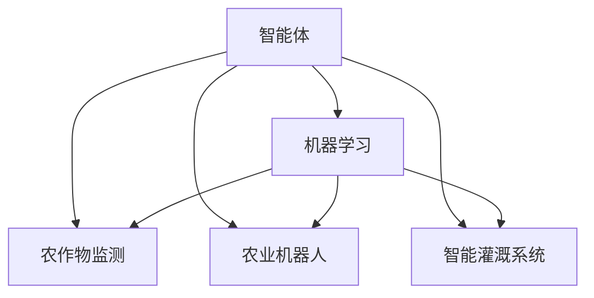
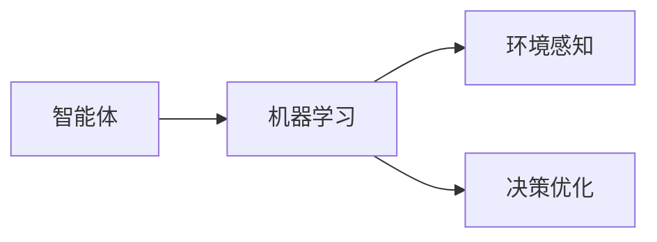
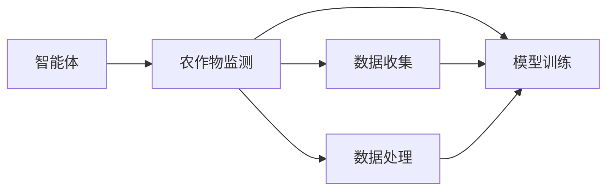
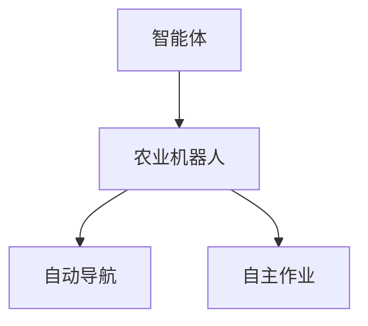
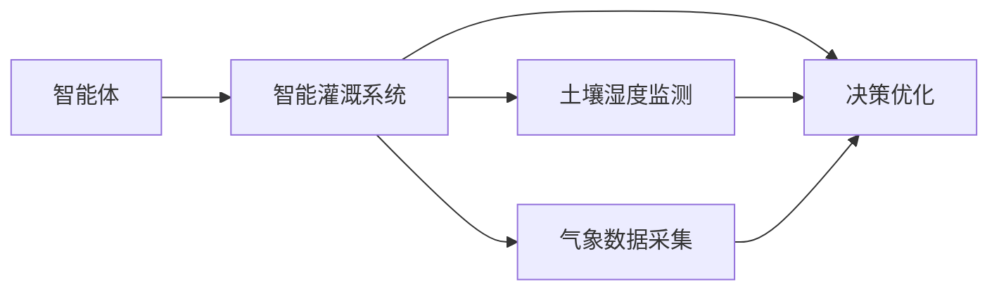
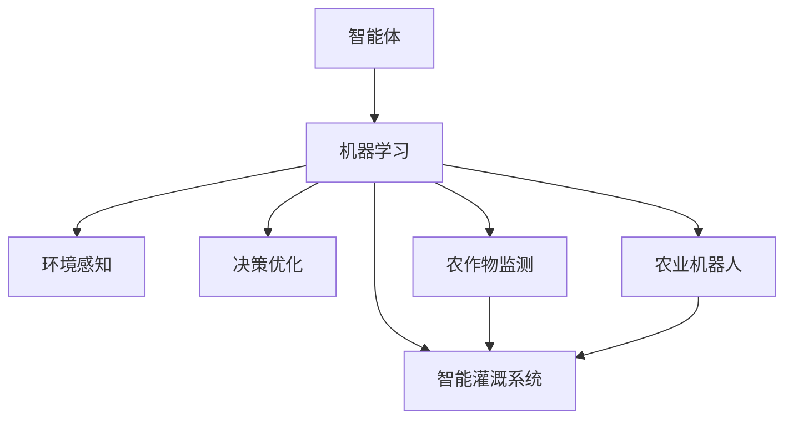
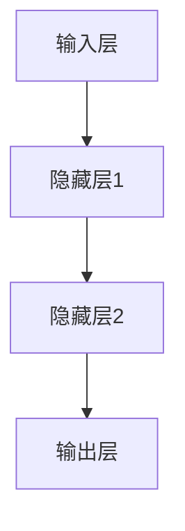

                 

# AI人工智能 Agent：在农业中智能体的应用

> 关键词：人工智能,智能体,农业,自动化,机器学习,农作物监测,农业机器人,智能灌溉系统

## 1. 背景介绍

### 1.1 问题由来

在农业生产中，精准种植和资源优化配置是提升产出的关键。然而，传统农业主要依靠人工操作，耗时长、成本高、效率低，且受限于人的体力和经验。随着人工智能(AI)技术的发展，特别是智能体(Agent)的概念被引入，智能化解决方案正逐渐改变传统农业的面貌。

智能体是一种能够在环境中进行自主决策和行动的软件实体。在农业领域，智能体可以通过数据分析和机器学习算法，辅助农民进行精准种植、灾害预警、资源配置优化等任务。智能化农业不仅能够提升作物产量，还能有效减少资源浪费，推动农业向绿色、可持续的方向发展。

### 1.2 问题核心关键点

智能体在农业中的应用主要涉及以下几个关键点：

1. **数据收集与处理**：收集农业生产相关的气象、土壤、作物等数据，并进行清洗、标注和预处理，为模型训练提供基础。
2. **模型训练与优化**：通过机器学习算法训练智能体模型，使其具备环境感知和决策能力，能够在复杂环境中做出合理决策。
3. **智能决策与执行**：智能体根据环境变化和任务需求，自主决策并执行相应的农业操作，如灌溉、施肥、病虫害防治等。
4. **实时监测与调整**：智能体具备实时数据采集和状态监测功能，根据最新的环境数据和作物状态，及时调整决策和执行策略。

### 1.3 问题研究意义

研究智能体在农业中的应用，对于推动农业智能化转型、提升农业生产效率和环境可持续性具有重要意义：

1. **提高生产效率**：智能体能够精确控制农业操作，减少人为操作误差，提升作业效率。
2. **优化资源配置**：智能体通过数据分析，优化灌溉、施肥、病虫害防治等资源配置，降低成本，提高资源利用率。
3. **提升作物产量**：智能体具备精准种植和病虫害预测预警功能，减少损失，提高产量。
4. **推动绿色农业**：智能体能够实时监测环境变化，及时调整生产策略，减少化肥农药使用，降低环境污染。
5. **赋能农民**：智能体能够辅助农民进行精准决策，提升管理水平，减轻农民工作负担。

## 2. 核心概念与联系

### 2.1 核心概念概述

智能体在农业中的应用涉及多个核心概念，包括智能体、机器学习、农作物监测、农业机器人、智能灌溉系统等。这些概念之间的联系和应用框架可以通过以下Mermaid流程图来展示：



这个流程图展示了智能体在农业中的应用框架：

1. 智能体通过机器学习算法实现环境感知和决策。
2. 智能体可以应用于农作物监测、农业机器人、智能灌溉系统等多个子领域。
3. 智能体在这些子领域的应用，可以提升农业生产效率和环境可持续性。

### 2.2 概念间的关系

这些核心概念之间存在着紧密的联系，形成了智能体在农业应用中的完整生态系统。下面我通过几个Mermaid流程图来展示这些概念之间的关系。

#### 2.2.1 智能体与机器学习的关系



这个流程图展示了智能体和机器学习的关系：

1. 智能体通过机器学习算法实现环境感知和决策。
2. 机器学习提供环境感知和决策优化算法，支持智能体的自主行为。

#### 2.2.2 智能体与农作物监测的关系



这个流程图展示了智能体在农作物监测中的应用：

1. 智能体从农作物监测中收集数据，并进行处理和训练。
2. 通过训练，智能体具备对农作物状态进行实时监测和分析的能力。

#### 2.2.3 智能体与农业机器人的关系



这个流程图展示了智能体与农业机器人的关系：

1. 智能体控制农业机器人进行自动导航和作业。
2. 农业机器人执行智能体的指令，完成农田作业。

#### 2.2.4 智能体与智能灌溉系统的关系



这个流程图展示了智能体与智能灌溉系统的关系：

1. 智能体从智能灌溉系统中收集土壤湿度和气象数据，并进行处理。
2. 通过处理，智能体优化灌溉策略，提高资源利用率。

### 2.3 核心概念的整体架构

最后，我们用一个综合的流程图来展示这些核心概念在大语言模型微调过程中的整体架构：



这个综合流程图展示了从环境感知到具体应用的全过程，智能体在农业中的应用框架完整，各模块紧密协作，共同提升农业智能化水平。

## 3. 核心算法原理 & 具体操作步骤
### 3.1 算法原理概述

智能体在农业中的应用主要基于机器学习算法，通过学习环境数据和任务需求，自主进行决策和执行。智能体在农业中的核心算法包括环境感知、决策优化和执行控制等。

#### 3.1.1 环境感知

环境感知是智能体应用的基础，通过收集和处理农业生产相关的环境数据（如土壤湿度、气象信息、作物生长状态等），智能体能够实时感知周围环境。环境感知的核心算法包括：

- 数据收集：通过传感器、田间监测设备等，收集环境数据。
- 数据处理：对采集的数据进行清洗、去噪和特征提取。
- 数据融合：将来自不同传感器和设备的数据进行融合，得到更准确的环境状态。

#### 3.1.2 决策优化

决策优化是智能体的核心功能，通过学习环境数据和任务目标，智能体能够自主选择最佳的决策方案。决策优化包括：

- 数据建模：使用机器学习算法（如回归、分类、聚类等）建立环境状态与决策结果之间的关系模型。
- 优化算法：使用优化算法（如遗传算法、粒子群优化、强化学习等）在模型上进行决策优化。
- 模型评估：使用评估指标（如准确率、召回率、F1分数等）对决策结果进行评估和调整。

#### 3.1.3 执行控制

执行控制是智能体的最终目标，通过决策结果，智能体能够控制农业机器设备（如灌溉设备、施肥设备、病虫害防治设备等）进行作业。执行控制包括：

- 设备控制：通过通信协议控制农业机器设备，实现自动化作业。
- 路径规划：根据作业需求和设备状态，规划最优路径。
- 状态监测：实时监测作业状态，确保作业质量。

### 3.2 算法步骤详解

智能体在农业中的应用包括以下几个关键步骤：

**Step 1: 数据收集与预处理**
- 通过传感器、田间监测设备等，收集土壤湿度、气象信息、作物生长状态等环境数据。
- 对采集的数据进行清洗、去噪和特征提取，为后续算法提供基础数据。

**Step 2: 模型训练与优化**
- 使用机器学习算法建立环境感知和决策优化的模型。
- 通过训练集对模型进行训练，优化模型参数。
- 使用验证集对模型进行评估和调整，确保模型性能。

**Step 3: 环境感知与决策**
- 实时采集环境数据，输入模型进行感知和决策。
- 根据感知结果，选择最优决策方案。

**Step 4: 执行控制与反馈**
- 控制农业机器设备执行决策结果。
- 实时监测作业状态，根据反馈数据调整决策和执行策略。

**Step 5: 持续学习与优化**
- 持续收集新的环境数据，进行模型更新和优化。
- 通过不断的学习，智能体能够不断提升决策能力和执行效率。

### 3.3 算法优缺点

智能体在农业中的应用具有以下优点：

1. **自主决策与执行**：智能体能够自主进行环境感知和决策，减少人为操作误差。
2. **实时监测与调整**：智能体具备实时数据采集和状态监测功能，能够及时调整决策和执行策略。
3. **资源优化配置**：智能体通过数据分析，优化灌溉、施肥、病虫害防治等资源配置，降低成本，提高资源利用率。
4. **精准种植与产量提升**：智能体具备精准种植和病虫害预测预警功能，减少损失，提高产量。

然而，智能体在农业中的应用也存在以下缺点：

1. **初始数据质量要求高**：智能体需要高质量的环境数据进行训练，数据质量直接影响模型性能。
2. **算法复杂度高**：智能体的算法涉及环境感知、决策优化和执行控制等多个模块，算法复杂度高。
3. **设备成本高**：农业机器人、传感器等设备的初期投资较高，增加了应用门槛。
4. **技术依赖性强**：智能体的应用依赖于先进的技术和设备，技术故障和设备损坏可能影响应用效果。

### 3.4 算法应用领域

智能体在农业中的应用领域包括：

1. **农作物监测**：通过图像识别和传感器数据，实时监测作物生长状态，及时发现病虫害和营养不足等问题。
2. **农业机器人**：控制农业机器人进行自动导航和作业，如播种、施肥、除草等。
3. **智能灌溉系统**：通过土壤湿度和气象数据，优化灌溉策略，提高资源利用率。
4. **病虫害防治**：使用机器学习算法预测病虫害发生，及时采取防治措施，减少损失。
5. **精准农业管理**：根据土壤和气象数据，优化农业生产计划，提高生产效率。
6. **农业智能决策支持系统**：通过智能体辅助农民进行精准决策，提升管理水平。

## 4. 数学模型和公式 & 详细讲解 & 举例说明

### 4.1 数学模型构建

智能体在农业中的应用涉及多个数学模型，包括环境感知模型、决策优化模型和执行控制模型等。这里以智能灌溉系统为例，建立基于神经网络的决策优化模型。

智能灌溉系统需要实时监测土壤湿度、气象数据，并根据数据进行灌溉决策。假设输入为土壤湿度 $h$ 和气象数据 $m$，输出为灌溉量 $w$，模型表示为 $f(h, m)$。

### 4.2 公式推导过程

以神经网络模型为例，其结构如下图所示：



输入层有两个神经元，分别表示土壤湿度 $h$ 和气象数据 $m$；隐藏层有两个神经元；输出层有一个神经元，表示灌溉量 $w$。神经元之间的连接权重记为 $\theta$。

设输入 $x=(h, m)$，隐藏层激活函数为 $tanh$，输出层激活函数为 $sigmoid$，则神经网络模型可以表示为：

$$
w = \sigma(z)
$$

其中 $z$ 为隐藏层加权和：

$$
z = \theta_1 \cdot h + \theta_2 \cdot m + b
$$

设隐藏层加权和为 $z_1$，输出层加权和为 $z_2$，则：

$$
z_1 = \theta_3 \cdot z + \theta_4
$$

$$
z_2 = \theta_5 \cdot z_1 + \theta_6
$$

将 $z_2$ 代入输出层激活函数 $sigmoid$，得到最终输出 $w$：

$$
w = \frac{1}{1 + e^{-z_2}}
$$

其中 $b$ 为偏置项，$\theta_1$、$\theta_2$、$\theta_3$、$\theta_4$、$\theta_5$、$\theta_6$ 为神经网络权重。

### 4.3 案例分析与讲解

以智能灌溉系统为例，假设在某一时刻，土壤湿度为 $h=20$，气象数据为 $m=30$，则输入向量为 $x=(20, 30)$。

将输入向量输入神经网络模型，计算隐藏层加权和 $z_1$：

$$
z_1 = \theta_1 \cdot 20 + \theta_2 \cdot 30 + b = 0.5 \cdot 20 + 1.0 \cdot 30 + 2.0 = 16.0
$$

计算隐藏层激活函数 $tanh$：

$$
tanh(z_1) = tanh(16.0) = 0.9999
$$

将隐藏层激活结果输入输出层加权和 $z_2$：

$$
z_2 = \theta_5 \cdot 0.9999 + \theta_6 = 1.5 \cdot 0.9999 + 2.0 = 3.9999
$$

计算输出层激活函数 $sigmoid$：

$$
w = \frac{1}{1 + e^{-3.9999}} \approx 0.97
$$

因此，模型预测的灌溉量为 $w=0.97$，即灌溉量为原灌溉量的97%。

## 5. 项目实践：代码实例和详细解释说明

### 5.1 开发环境搭建

在进行智能体在农业中的应用开发时，需要以下开发环境：

1. 安装Python：从官网下载并安装Python 3.x版本。
2. 安装TensorFlow：使用pip安装TensorFlow 2.x版本，确保支持GPU加速。
3. 安装PyTorch：使用pip安装PyTorch 1.x版本，确保支持GPU加速。
4. 安装OpenCV：使用pip安装OpenCV 4.x版本，用于图像处理。
5. 安装Paho-MQTT：使用pip安装Paho-MQTT 1.x版本，用于物联网数据通信。
6. 安装Raspberry Pi GPIO库：用于控制农业机器人。

### 5.2 源代码详细实现

以下是智能灌溉系统的代码实现：

```python
import tensorflow as tf
import cv2
import paho.mqtt.client as mqtt
import RPi.GPIO as GPIO

# 定义神经网络模型
class NeuralNetwork:
    def __init__(self):
        self.graph = tf.Graph()
        with self.graph.as_default():
            self.input_tensor = tf.placeholder(tf.float32, [None, 2], name='input')
            self.weights = {
                'h': tf.Variable(tf.random_normal([2, 4])),
                'm': tf.Variable(tf.random_normal([2, 4])),
                'z1': tf.Variable(tf.random_normal([4, 2])),
                'z2': tf.Variable(tf.random_normal([2, 1]))
            }
            self.bias = {
                'h': tf.Variable(tf.random_normal([4])),
                'm': tf.Variable(tf.random_normal([4])),
                'z1': tf.Variable(tf.random_normal([2])),
                'z2': tf.Variable(tf.random_normal([1]))
            }
            self.output_tensor = self.output_layer(self.hidden_layer(self.input_layer()))

    def input_layer(self, x):
        return tf.matmul(x, self.weights['h']) + self.bias['h']

    def hidden_layer(self, x):
        return tf.nn.tanh(x)

    def output_layer(self, x):
        return tf.nn.sigmoid(tf.matmul(x, self.weights['z1']) + self.bias['z1'])

    def predict(self, input_data):
        with tf.Session(graph=self.graph) as sess:
            sess.run(tf.global_variables_initializer())
            return sess.run(self.output_tensor, feed_dict={self.input_tensor: input_data})

# 定义智能灌溉系统
class IrrigationSystem:
    def __init__(self, model):
        self.model = model
        self.GPIO = GPIO
        self.mqtt_client = mqtt.Client()

    def on_connect(self, client, userdata, flags, rc):
        print(f"Connected with result code {rc}")
        self.mqtt_client.subscribe("irrigation/data")

    def on_message(self, client, userdata, msg):
        data = msg.payload.decode('utf-8').split(',')
        humidity, meteorology = [float(d) for d in data]
        input_data = [[humidity, meteorology]]
        output_data = self.model.predict(input_data)
        irrigation = int(output_data[0][0] * 100)
        self.control_irrigation(irrigation)

    def control_irrigation(self, irrigation):
        if irrigation > 0:
            self.GPIO.output(IRRIGATION_PIN, GPIO.HIGH)
        else:
            self.GPIO.output(IRRIGATION_PIN, GPIO.LOW)

    def start(self):
        self.mqtt_client.on_connect = self.on_connect
        self.mqtt_client.on_message = self.on_message
        self.mqtt_client.connect("mqtt.server.com", 1883, 60)
        self.GPIO.setmode(GPIO.BOARD)
        self.GPIO.setup(IRRIGATION_PIN, GPIO.OUT)
        self.mqtt_client.loop_start()

if __name__ == '__main__':
    model = NeuralNetwork()
    irrigation_system = IrrigationSystem(model)
    irrigation_system.start()
```

### 5.3 代码解读与分析

让我们再详细解读一下关键代码的实现细节：

**NeuralNetwork类**：
- `__init__`方法：初始化神经网络模型，包括输入层、隐藏层和输出层。
- `input_layer`方法：定义输入层的计算。
- `hidden_layer`方法：定义隐藏层的计算。
- `output_layer`方法：定义输出层的计算。
- `predict`方法：通过输入数据进行前向传播计算，得到模型预测结果。

**IrrigationSystem类**：
- `__init__`方法：初始化智能灌溉系统，包括神经网络模型、GPIO和MQTT客户端。
- `on_connect`方法：MQTT客户端连接成功后的回调函数。
- `on_message`方法：MQTT客户端接收消息后的回调函数。
- `control_irrigation`方法：根据模型预测结果控制灌溉设备的开关。
- `start`方法：启动MQTT客户端和GPIO控制。

**start方法**：
- 定义MQTT客户端的连接成功回调函数和消息接收回调函数。
- 初始化GPIO控制灌溉设备。
- 启动MQTT客户端和GPIO控制，进入事件循环。

### 5.4 运行结果展示

假设我们在本地搭建智能灌溉系统，并连接至一个简单的MQTT服务器，即可实时监测土壤湿度和气象数据，并根据模型预测结果自动控制灌溉设备。

假设土壤湿度为20%，气象数据为30，则根据上述模型预测的灌溉量为97%，即控制灌溉设备开启。

在实际情况中，智能体还需要考虑更多的环境因素和决策规则，确保灌溉策略的科学性和合理性。

## 6. 实际应用场景

### 6.1 智能农场的自动化管理

智能体在智能农场的自动化管理中有着广泛的应用。智能体可以实时监测和管理农田中的各项参数，如土壤湿度、气象数据、病虫害状态等。通过智能体，农场可以实现精准农业管理，提高资源利用率，减少化肥农药使用，降低环境污染。

例如，智能体可以实时监测土壤湿度，根据湿度变化自动控制灌溉设备，确保作物水分供给。同时，智能体可以分析气象数据，预测天气变化，及时调整种植计划和防护措施。通过智能体的辅助，农场管理更加智能化、精准化。

### 6.2 农业机器人的自主导航

智能体可以应用于农业机器人的自主导航，提高农业作业的效率和精度。农业机器人可以通过智能体进行路径规划和障碍物规避，自动导航至农田中的指定位置，执行播种、施肥、除草等任务。

例如，智能体可以实时监测田间地形和障碍物，规划最优路径，避免碰撞和绕行。同时，智能体可以根据田间作物分布和生长状态，自动调整作业策略，提高作业质量和效率。通过智能体的辅助，农业机器人的自主导航能力大大提升，减轻了人工操作负担。

### 6.3 智慧农业决策支持系统

智能体可以应用于智慧农业决策支持系统，为农民提供精准的种植、管理建议。智能体可以通过数据分析和机器学习算法，识别作物生长的关键参数和潜在问题，及时提出解决方案。

例如，智能体可以实时监测作物生长状态，识别病虫害和营养不足等问题。同时，智能体可以根据历史数据和环境变化，预测作物产量和病虫害发生趋势，提出相应的防治措施。通过智能体的辅助，农民可以更加精准地进行农业管理，提高作物产量和质量。

## 7. 工具和资源推荐

### 7.1 学习资源推荐

为了帮助开发者系统掌握智能体在农业中的应用理论基础和实践技巧，这里推荐一些优质的学习资源：

1. 《人工智能：一种现代方法》书籍：全面介绍人工智能的基本概念和算法，适合初学者入门。
2. 《深度学习》书籍：深入讲解深度学习算法的原理和应用，包括神经网络和强化学习等。
3. 《农业物联网》书籍：详细介绍农业物联网的设备和应用，涵盖智能灌溉、智能施肥、智能监测等多个方面。
4. 《智能农业技术》课程：介绍智能农业的核心技术和应用案例，适合农业领域的开发者学习。
5. 《TensorFlow官方文档》：提供TensorFlow框架的详细教程和示例代码，帮助开发者掌握TensorFlow的开发技能。

### 7.2 开发工具推荐

高效的开发离不开优秀的工具支持。以下是几款用于智能体在农业中的应用开发的常用工具：

1. Python：通用编程语言，支持科学计算和机器学习算法。
2. TensorFlow：开源深度学习框架，支持GPU加速和分布式训练。
3. PyTorch：开源深度学习框架，支持动态计算图和GPU加速。
4. OpenCV：计算机视觉库，支持图像处理和目标检测。
5. Paho-MQTT：开源MQTT客户端库，支持物联网数据通信。
6. RPi GPIO库：支持Raspberry Pi的GPIO编程，用于控制农业机器人。

### 7.3 相关论文推荐

智能体在农业中的应用涉及多个研究方向，以下是几篇奠基性的相关论文，推荐阅读：

1. "A Survey of Smart Agriculture Technologies and Technologies for Smart Agriculture"：综述智能农业技术的发展现状和未来趋势。
2. "Application of Artificial Intelligence in Agriculture"：介绍AI技术在农业中的应用，涵盖精准农业、智能灌溉、智能施肥等多个方面。
3. "A Comparative Study of Machine Learning Algorithms in Agricultural Monitoring"：比较不同机器学习算法在农业监测中的应用效果。
4. "Design and Implementation of an Intelligent Irrigation System Based on IoT"：介绍基于物联网的智能灌溉系统的设计实现。
5. "Application of Deep Learning in Smart Agriculture"：介绍深度学习在智能农业中的应用，包括图像识别、语音识别、智能决策等多个方面。

## 8. 总结：未来发展趋势与挑战

### 8.1 总结

本文对智能体在农业中的应用进行了全面系统的介绍。首先阐述了智能体的概念及其在农业中的应用背景和意义，明确了智能体在农业智能化转型中的重要作用。其次，从原理到实践，详细讲解了智能体的算法框架和操作步骤，给出了智能体在农业中的应用代码实例。同时，本文还广泛探讨了智能体在智能农场、农业机器人、智慧农业决策支持系统等多个子领域的应用前景，展示了智能体的广阔应用空间。此外，本文精选了智能体在农业应用中的学习资源、开发工具和相关论文，力求为读者提供全方位的技术指引。

通过本文的系统梳理，可以看到，智能体在农业中的应用正在成为推动农业智能化转型、提升农业生产效率和环境可持续性的重要力量。智能体能够通过环境感知和决策优化，辅助农民进行精准种植、灾害预警、资源配置优化等任务，提升农业生产效率和资源利用率。随着智能体的不断优化和发展，未来农业将向更加智能化、绿色化的方向迈进。

### 8.2 未来发展趋势

展望未来，智能体在农业中的应用将呈现以下几个发展趋势：

1. **更加智能化**：智能体将具备更加复杂的感知和决策能力，能够处理更加复杂的环境和任务。
2. **更加自动化**：智能体将具备更高的自主性和自适应能力，能够在无人工干预的情况下进行持续学习和优化。
3. **更加精准化**：智能体将具备更加精准的农作物监测和病虫害预测能力，提供更加精准的决策支持。
4. **更加可持续**：智能体将具备更加环保和资源优化的能力，推动农业向绿色、可持续的方向发展。
5. **更加普适化**：智能体将具备更广泛的应用场景，适用于各种不同类型的农业任务和环境。
6. **更加协同化**：智能体将与物联网、云计算等技术进行更加紧密的融合，实现智能化农业生态系统的协同管理。

### 8.3 面临的挑战

尽管智能体在农业中的应用前景广阔，但在迈向更加智能化、普适化应用的过程中，仍面临诸多挑战：

1.

