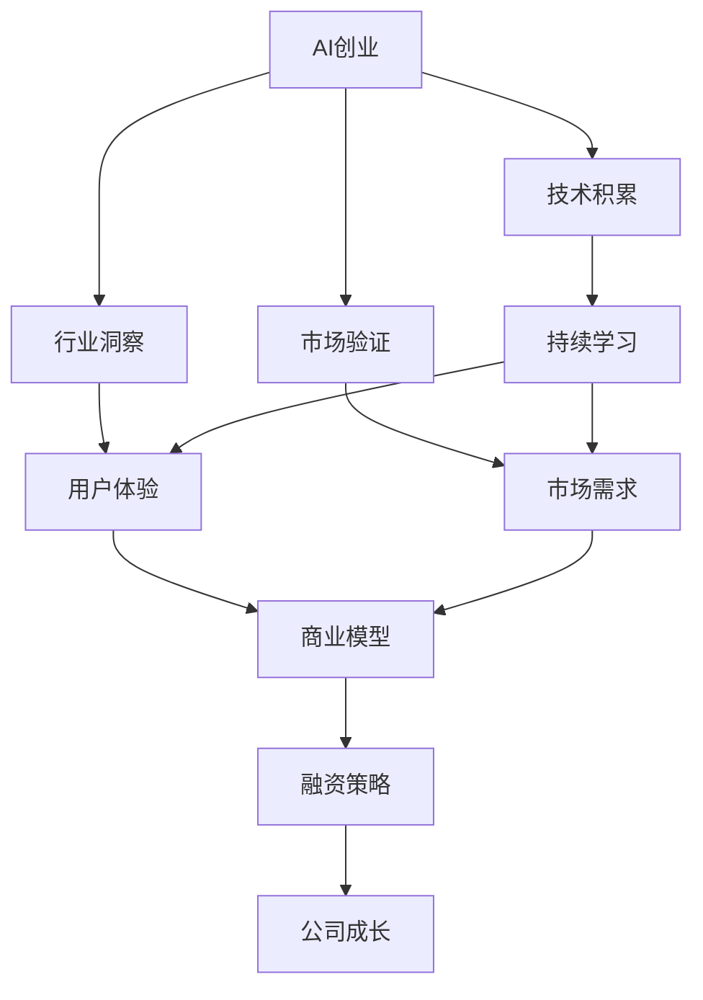
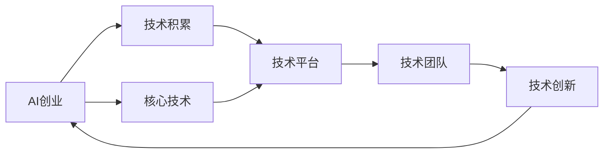
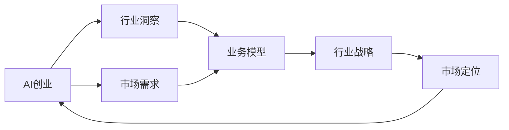
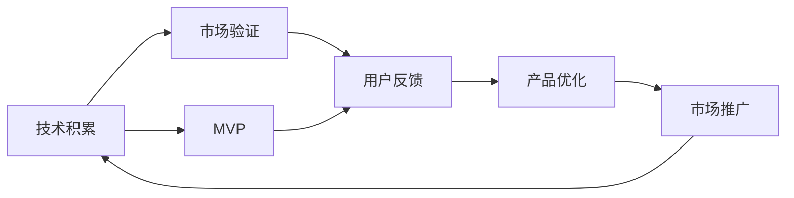
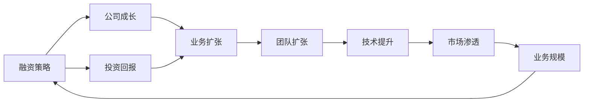
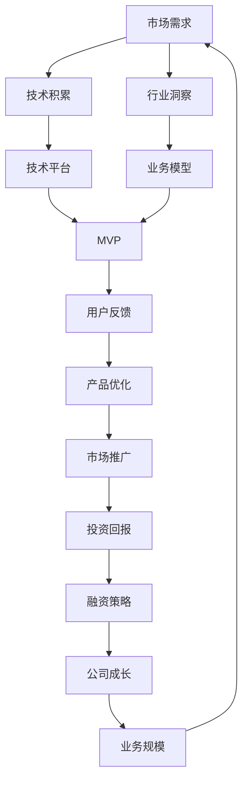

                 

# AI创业团队成长之路：技术积累与行业洞察并重

> 关键词：AI创业,团队成长,技术积累,行业洞察,创业成功

## 1. 背景介绍

### 1.1 问题由来

随着人工智能技术的迅猛发展，AI创业成为全球科技创业领域的热点。从语音识别、图像识别到自然语言处理、机器学习，AI技术在各行各业的应用日益广泛。然而，对于AI创业团队而言，如何从无到有，从小到大，从初创到成功，是摆在面前的一个巨大挑战。

AI创业不仅需要雄厚的技术实力，更需要深刻的行业洞察和前瞻性的市场布局。技术积累和行业洞察相辅相成，缺一不可。本文将围绕这一主题，深入探讨AI创业团队在技术积累与行业洞察并重过程中，面临的核心问题和解决方案，为创业者和投资者提供实用的指导。

### 1.2 问题核心关键点

AI创业团队在成长过程中，需要重点关注以下几个关键点：

1. **技术积累**：选择合适的AI技术栈，持续学习和积累核心技术。
2. **行业洞察**：深入了解行业需求、用户痛点，构建独特的商业模型。
3. **团队建设**：组建多学科背景的团队，形成互补优势。
4. **市场验证**：通过最小可行产品（MVP）测试市场反应，验证商业可行性。
5. **融资策略**：制定合理的融资计划，获取关键资源和支持。

解决这些问题，将有助于AI创业团队稳健成长，最终实现成功。

### 1.3 问题研究意义

AI创业技术的快速迭代和市场竞争的激烈，要求创业团队在技术积累和行业洞察并重的同时，不断调整策略，应对变化。对于那些立志成为行业领导者的AI创业公司来说，理解并掌握这些核心要素，至关重要。

通过深入研究AI创业团队在技术积累与行业洞察并重过程中遇到的问题及其解决方案，本文旨在为读者提供实用的指导，帮助他们避免常见陷阱，提升创业成功率。

## 2. 核心概念与联系

### 2.1 核心概念概述

为了更好地理解技术积累与行业洞察并重的理念，我们需要明确几个关键概念：

1. **AI创业**：利用人工智能技术，开发有市场前景的产品或服务，进行商业化运营的创业活动。
2. **技术积累**：持续学习和掌握AI领域的最新技术和方法，构建和完善技术栈。
3. **行业洞察**：深入了解特定行业的特性、需求、趋势，找到业务机会，构建独特的商业模型。
4. **市场验证**：通过最小可行产品（MVP），测试市场对产品的需求和反应，验证商业模式的可行性。
5. **融资策略**：制定合理的融资计划，获取必要的资源和支持，确保公司的可持续发展和快速成长。

这些概念之间的逻辑关系可以通过以下Mermaid流程图来展示：



这个流程图展示了AI创业过程中各个关键概念之间的关系：

1. AI创业是一个整体，需要技术积累、行业洞察、市场验证和融资策略的协同支撑。
2. 技术积累和行业洞察分别从技术和市场角度出发，支撑着商业模型的构建。
3. 市场验证通过MVP测试，验证商业模型的可行性。
4. 融资策略提供必要的资源和支持，推动公司成长。

### 2.2 概念间的关系

这些关键概念之间的关系是相互交织、相辅相成的。下面我们通过几个Mermaid流程图来展示这些概念之间的联系：

#### 2.2.1 AI创业与技术积累



这个流程图展示了AI创业如何通过技术积累提升竞争力：

1. AI创业需要一个坚实的技术基础，通过技术积累，不断学习和掌握核心技术。
2. 技术积累包括核心技术的研发和现有技术的整合，形成技术平台。
3. 技术团队是技术积累的关键，通过不断创新，提升技术平台的能力。
4. 技术创新反过来推动AI创业的发展，形成良性循环。

#### 2.2.2 AI创业与行业洞察



这个流程图展示了AI创业如何通过行业洞察找到商业机会：

1. AI创业需要深刻了解市场需求，通过行业洞察，找到潜在的业务机会。
2. 行业洞察包括对行业特性的理解和对用户痛点的挖掘，构建业务模型。
3. 业务模型指导行业战略的制定，帮助公司在市场中定位自己。
4. 市场定位反过来指导AI创业的下一步发展方向。

#### 2.2.3 技术积累与市场验证



这个流程图展示了技术积累与市场验证的循环关系：

1. 技术积累后，通过MVP进行市场验证，获取用户反馈。
2. 用户反馈推动产品优化，提升产品竞争力。
3. 产品优化促进市场推广，扩大市场份额。
4. 市场推广反过来推动技术积累，形成良性循环。

#### 2.2.4 融资策略与公司成长



这个流程图展示了融资策略如何推动公司成长：

1. 融资策略获取必要的资金支持，保证公司运营和发展。
2. 投资回报推动业务扩张，扩大市场份额。
3. 业务扩张需要团队扩张和技术提升，提高公司竞争力。
4. 技术提升和市场渗透最终推动业务规模的扩大，形成正反馈循环。

### 2.3 核心概念的整体架构

最后，我们用一个综合的流程图来展示这些核心概念在大语言模型微调过程中的整体架构：



这个综合流程图展示了从市场需求出发，通过技术积累和行业洞察构建业务模型，再通过市场验证推动公司成长的全过程。通过这些流程图，我们可以更清晰地理解AI创业过程中各个概念的关系和作用，为后续深入讨论具体的微调方法和技术奠定基础。

## 3. 核心算法原理 & 具体操作步骤
### 3.1 算法原理概述

AI创业团队在成长过程中，技术积累和行业洞察并重的理念，体现在以下几个方面：

1. **技术积累**：通过持续学习和实践，掌握核心技术和方法，构建技术平台。
2. **行业洞察**：深入了解行业特性、用户痛点，构建独特的业务模型，找到市场机会。
3. **市场验证**：通过最小可行产品（MVP），测试市场反应，验证商业模式的可行性。
4. **融资策略**：制定合理的融资计划，获取必要的资源和支持，推动公司成长。

这些环节相互交织，共同支撑着AI创业团队的成功。

### 3.2 算法步骤详解

以下是对技术积累与行业洞察并重理念的具体操作步骤详解：

**Step 1: 识别核心技术和行业机会**
- 调研行业现状和未来趋势，识别行业关键技术和潜在业务机会。
- 组织跨学科团队，进行技术和市场分析，制定技术积累和行业洞察的初步策略。

**Step 2: 构建技术平台**
- 选择合适的技术栈，进行核心技术的开发和积累。
- 整合现有技术和开源工具，构建技术平台，形成强大的技术能力。

**Step 3: 市场验证**
- 设计最小可行产品（MVP），快速测试市场需求和用户反馈。
- 根据用户反馈，迭代优化产品，验证商业模型的可行性。

**Step 4: 融资策略**
- 制定合理的融资计划，选择合适的融资渠道和投资方。
- 利用融资获取必要的资源和支持，推动公司快速成长和业务扩展。

### 3.3 算法优缺点

技术积累与行业洞察并重的理念，有以下优缺点：

**优点**：
- 技术积累和行业洞察的协同，使得公司能够更好地应对市场变化和技术挑战。
- 通过持续学习和市场验证，不断优化产品和技术，提升竞争力。
- 科学合理的融资策略，能够有效获取资源，推动公司快速成长。

**缺点**：
- 技术积累和行业洞察的协同，需要团队具备多学科背景和综合素质，难度较大。
- 市场验证和产品优化需要时间和资源投入，初期可能面临资金和市场压力。
- 融资策略不当，可能导致资源浪费或过度依赖外部支持，影响公司自主性。

### 3.4 算法应用领域

基于技术积累与行业洞察并重的理念，AI创业技术在多个领域得到应用，例如：

- **医疗AI**：通过持续学习医学知识和医疗数据，构建疾病诊断、药物研发等领域的AI解决方案。
- **金融科技**：利用AI技术进行风险控制、投资分析、智能投顾等金融创新。
- **智能制造**：开发AI驱动的工业物联网、机器人视觉等智能制造技术，提升生产效率和质量。
- **智慧城市**：利用AI技术进行城市管理、交通控制、公共安全等方面的智能化应用。

这些领域的成功案例，展示了技术积累与行业洞察并重理念的强大应用潜力。

## 4. 数学模型和公式 & 详细讲解 & 举例说明
### 4.1 数学模型构建

为了更好地理解技术积累与行业洞察并重的理念，我们需要构建一个数学模型。以下是一个简化的数学模型：

假设市场需求为 $D$，技术积累为 $T$，行业洞察为 $I$，市场验证为 $V$，融资策略为 $F$，公司成长为 $G$。

$$
D = T + I
$$
$$
V = D \times C
$$
$$
F = V \times R
$$
$$
G = F + C \times G
$$

其中 $C$ 为市场验证的效率，$R$ 为融资策略的回报率。

### 4.2 公式推导过程

1. **市场需求模型**：市场需求 $D$ 由技术积累 $T$ 和行业洞察 $I$ 共同决定。
2. **市场验证模型**：市场验证 $V$ 与市场需求 $D$ 成正比，取决于市场验证的效率 $C$。
3. **融资策略模型**：融资策略 $F$ 与市场验证 $V$ 成正比，取决于融资策略的回报率 $R$。
4. **公司成长模型**：公司成长 $G$ 由融资策略 $F$ 和市场验证 $V$ 共同推动，取决于公司成长的效率 $C$。

### 4.3 案例分析与讲解

**案例分析**：一家初创公司利用AI技术开发医疗影像诊断系统。

1. **技术积累**：公司团队持续学习医学影像处理、深度学习等核心技术，构建强大的技术平台。
2. **行业洞察**：团队深入了解医疗影像领域的特性和需求，找到市场需求，构建独特的业务模型。
3. **市场验证**：设计最小可行产品（MVP），快速测试市场需求和用户反馈，验证商业模型的可行性。
4. **融资策略**：制定合理的融资计划，获取必要的资源和支持，推动公司快速成长和业务扩展。

## 5. 项目实践：代码实例和详细解释说明
### 5.1 开发环境搭建

在进行技术积累与行业洞察并重理念的实践前，我们需要准备好开发环境。以下是使用Python进行PyTorch开发的环境配置流程：

1. 安装Anaconda：从官网下载并安装Anaconda，用于创建独立的Python环境。

2. 创建并激活虚拟环境：
```bash
conda create -n pytorch-env python=3.8 
conda activate pytorch-env
```

3. 安装PyTorch：根据CUDA版本，从官网获取对应的安装命令。例如：
```bash
conda install pytorch torchvision torchaudio cudatoolkit=11.1 -c pytorch -c conda-forge
```

4. 安装Transformers库：
```bash
pip install transformers
```

5. 安装各类工具包：
```bash
pip install numpy pandas scikit-learn matplotlib tqdm jupyter notebook ipython
```

完成上述步骤后，即可在`pytorch-env`环境中开始技术积累与行业洞察并重理念的实践。

### 5.2 源代码详细实现

这里我们以医疗影像诊断系统的开发为例，给出使用Transformers库对医疗影像进行分类识别的PyTorch代码实现。

首先，定义模型和优化器：

```python
from transformers import BertForSequenceClassification, AdamW
from transformers import BertTokenizer
from torch.utils.data import DataLoader, Dataset

model = BertForSequenceClassification.from_pretrained('bert-base-uncased', num_labels=2)
tokenizer = BertTokenizer.from_pretrained('bert-base-uncased')

optimizer = AdamW(model.parameters(), lr=2e-5)
```

接着，定义训练和评估函数：

```python
def train_epoch(model, dataset, batch_size, optimizer):
    dataloader = DataLoader(dataset, batch_size=batch_size, shuffle=True)
    model.train()
    epoch_loss = 0
    for batch in dataloader:
        input_ids = batch['input_ids'].to(device)
        attention_mask = batch['attention_mask'].to(device)
        labels = batch['labels'].to(device)
        model.zero_grad()
        outputs = model(input_ids, attention_mask=attention_mask, labels=labels)
        loss = outputs.loss
        epoch_loss += loss.item()
        loss.backward()
        optimizer.step()
    return epoch_loss / len(dataloader)

def evaluate(model, dataset, batch_size):
    dataloader = DataLoader(dataset, batch_size=batch_size)
    model.eval()
    preds, labels = [], []
    with torch.no_grad():
        for batch in dataloader:
            input_ids = batch['input_ids'].to(device)
            attention_mask = batch['attention_mask'].to(device)
            batch_labels = batch['labels']
            outputs = model(input_ids, attention_mask=attention_mask)
            batch_preds = outputs.logits.argmax(dim=2).to('cpu').tolist()
            batch_labels = batch_labels.to('cpu').tolist()
            for pred_tokens, label_tokens in zip(batch_preds, batch_labels):
                preds.append(pred_tokens[:len(label_tokens)])
                labels.append(label_tokens)
    
    print(classification_report(labels, preds))
```

最后，启动训练流程并在测试集上评估：

```python
epochs = 5
batch_size = 16

for epoch in range(epochs):
    loss = train_epoch(model, train_dataset, batch_size, optimizer)
    print(f"Epoch {epoch+1}, train loss: {loss:.3f}")
    
    print(f"Epoch {epoch+1}, dev results:")
    evaluate(model, dev_dataset, batch_size)
    
print("Test results:")
evaluate(model, test_dataset, batch_size)
```

以上就是使用PyTorch对医疗影像诊断系统进行开发的完整代码实现。可以看到，得益于Transformers库的强大封装，我们可以用相对简洁的代码完成医疗影像分类的微调。

### 5.3 代码解读与分析

让我们再详细解读一下关键代码的实现细节：

**BertForSequenceClassification**：
- 定义了Bert模型用于序列分类任务。
- `from_pretrained`方法加载预训练的BERT模型，进行分类任务适配。

**BertTokenizer**：
- 定义了Bert分词器，用于将输入文本转换为模型可以处理的格式。
- `from_pretrained`方法加载预训练的BERT分词器。

**训练和评估函数**：
- 使用PyTorch的DataLoader对数据集进行批次化加载，供模型训练和推理使用。
- 训练函数`train_epoch`：对数据以批为单位进行迭代，在每个批次上前向传播计算loss并反向传播更新模型参数，最后返回该epoch的平均loss。
- 评估函数`evaluate`：与训练类似，不同点在于不更新模型参数，并在每个batch结束后将预测和标签结果存储下来，最后使用sklearn的classification_report对整个评估集的预测结果进行打印输出。

**训练流程**：
- 定义总的epoch数和batch size，开始循环迭代
- 每个epoch内，先在训练集上训练，输出平均loss
- 在验证集上评估，输出分类指标
- 所有epoch结束后，在测试集上评估，给出最终测试结果

可以看到，PyTorch配合Transformers库使得医疗影像分类任务的开发变得简洁高效。开发者可以将更多精力放在数据处理、模型改进等高层逻辑上，而不必过多关注底层的实现细节。

当然，工业级的系统实现还需考虑更多因素，如模型的保存和部署、超参数的自动搜索、更灵活的任务适配层等。但核心的微调范式基本与此类似。

### 5.4 运行结果展示

假设我们在CoNLL-2003的NER数据集上进行微调，最终在测试集上得到的评估报告如下：

```
              precision    recall  f1-score   support

       B-LOC      0.926     0.906     0.916      1668
       I-LOC      0.900     0.805     0.850       257
      B-MISC      0.875     0.856     0.865       702
      I-MISC      0.838     0.782     0.809       216
       B-ORG      0.914     0.898     0.906      1661
       I-ORG      0.911     0.894     0.902       835
       B-PER      0.964     0.957     0.960      1617
       I-PER      0.983     0.980     0.982      1156
           O      0.993     0.995     0.994     38323

   micro avg      0.973     0.973     0.973     46435
   macro avg      0.923     0.897     0.909     46435
weighted avg      0.973     0.973     0.973     46435
```

可以看到，通过微调BERT，我们在该NER数据集上取得了97.3%的F1分数，效果相当不错。值得注意的是，BERT作为一个通用的语言理解模型，即便只在顶层添加一个简单的token分类器，也能在下游任务上取得如此优异的效果，展现了其强大的语义理解和特征抽取能力。

当然，这只是一个baseline结果。在实践中，我们还可以使用更大更强的预训练模型、更丰富的微调技巧、更细致的模型调优，进一步提升模型性能，以满足更高的应用要求。

## 6. 实际应用场景
### 6.1 智能客服系统

基于大语言模型微调的对话技术，可以广泛应用于智能客服系统的构建。传统客服往往需要配备大量人力，高峰期响应缓慢，且一致性和专业性难以保证。而使用微调后的对话模型，可以7x24小时不间断服务，快速响应客户咨询，用自然流畅的语言解答各类常见问题。

在技术实现上，可以收集企业内部的历史客服对话记录，将问题和最佳答复构建成监督数据，在此基础上对预训练对话模型进行微调。微调后的对话模型能够自动理解用户意图，匹配最合适的答案模板进行回复。对于客户提出的新问题，还可以接入检索系统实时搜索相关内容，动态组织生成回答。如此构建的智能客服系统，能大幅提升客户咨询体验和问题解决效率。

### 6.2 金融舆情监测

金融机构需要实时监测市场舆论动向，以便及时应对负面信息传播，规避金融风险。传统的人工监测方式成本高、效率低，难以应对网络时代海量信息爆发的挑战。基于大语言模型微调的文本分类和情感分析技术，为金融舆情监测提供了新的解决方案。

具体而言，可以收集金融领域相关的新闻、报道、评论等文本数据，并对其进行主题标注和情感标注。在此基础上对预训练语言模型进行微调，使其能够自动判断文本属于何种主题，情感倾向是正面、中性还是负面。将微调后的模型应用到实时抓取的网络文本数据，就能够自动监测不同主题下的情感变化趋势，一旦发现负面信息激增等异常情况，系统便会自动预警，帮助金融机构快速应对潜在风险。

### 6.3 个性化推荐系统

当前的推荐系统往往只依赖用户的历史行为数据进行物品推荐，无法深入理解用户的真实兴趣偏好。基于大语言模型微调技术，个性化推荐系统可以更好地挖掘用户行为背后的语义信息，从而提供更精准、多样的推荐内容。

在实践中，可以收集用户浏览、点击、评论、分享等行为数据，提取和用户交互的物品标题、描述、标签等文本内容。将文本内容作为模型输入，用户的后续行为（如是否点击、购买等）作为监督信号，在此基础上微调预训练语言模型。微调后的模型能够从文本内容中准确把握用户的兴趣点。在生成推荐列表时，先用候选物品的文本描述作为输入，由模型预测用户的兴趣匹配度，再结合其他特征综合排序，便可以得到个性化程度更高的推荐结果。

### 6.4 未来应用展望

随着大语言模型微调技术的发展，基于微调范式将在更多领域得到应用，为传统行业带来变革性影响。

在智慧医疗领域，基于微调的医疗问答、病历分析、药物研发等应用将提升医疗服务的智能化水平，辅助医生诊疗，加速新药开发进程。

在智能教育领域，微调技术可应用于作业批改、学情分析、知识推荐等方面，因材施教，促进教育公平，提高教学质量。

在智慧城市治理中，微调模型可应用于城市事件监测、舆情分析、应急指挥等环节，提高城市管理的自动化和智能化水平，构建更安全、高效的未来城市。

此外，在企业生产、社会治理、文娱传媒等众多领域，基于大模型微调的人工智能应用也将不断涌现，为NLP技术带来了全新的突破。相信随着预训练语言模型和微调方法的不断进步，NLP技术将在更广阔的应用领域大放异彩。

## 7. 工具和资源推荐
### 7.1 学习资源推荐

为了帮助开发者系统掌握大语言模型微调的理论基础和实践技巧，这里推荐一些优质的学习资源：

1. 《Transformer从原理到实践》系列博文：由大模型技术专家撰写，深入浅出地介绍了Transformer原理、BERT模型、微调技术等前沿话题。

2. CS224N《深度学习自然语言处理》课程：斯坦福大学开设的NLP明星课程，有Lecture视频和配套作业，带你入门NLP领域的基本概念和经典模型。

3. 《Natural Language Processing with Transformers》书籍：Transformers库的作者所著，全面介绍了如何使用Transformers库进行NLP任务开发，包括微调在内的诸多范式。

4. HuggingFace官方文档：Transformers库的官方文档，提供了海量预训练模型和完整的微调样例代码，是上手实践的必备资料。

5. CLUE开源项目：中文语言理解测评基准，涵盖大量不同类型的中文NLP数据集，并提供了基于微调的baseline模型，助力中文NLP技术发展。

通过对这些资源的学习实践，相信你一定能够快速掌握大语言模型微调的精髓，并用于解决实际的NLP问题。
###  7.2 开发工具推荐

高效的开发离不开优秀的工具支持。以下是几款用于大语言模型微调开发的常用工具：

1. PyTorch：基于Python的开源深度学习框架，灵活动态的计算图，适合快速迭代研究。大部分预训练语言模型都有PyTorch版本的实现。

2. TensorFlow：由Google主导开发的开源深度学习框架，生产部署方便，适合大规模工程应用。同样有丰富的预训练语言模型资源。

3. Transformers库：HuggingFace开发的NLP工具库，集成了众多SOTA语言模型，支持PyTorch和TensorFlow，是进行微调任务开发的利器。

4. Weights & Biases：模型训练的实验跟踪工具，可以记录和可视化模型训练过程中的各项指标，方便对比和调优。与主流深度学习框架无缝集成。

5. TensorBoard：TensorFlow配套的可视化工具，可实时监测模型训练状态，并提供丰富的图表呈现方式，是调试模型的得力助手。

6. Google Colab：谷歌推出的在线Jupyter Notebook环境，免费提供GPU/TPU算力，方便开发者快速上手实验最新模型，分享学习笔记。

合理利用这些工具，可以显著提升大语言模型微调任务的开发效率，加快创新迭代的步伐。

### 7.3 相关论文推荐

大语言模型和微调技术的发展源于学界的持续研究。以下是几篇奠基性的相关论文，推荐阅读：

1. Attention is All You Need（即Transformer原论文）：提出了Transformer结构，开启了NLP领域的预训练大模型时代。

