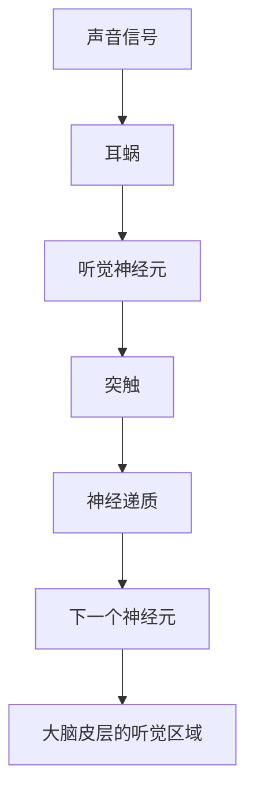

                 

# 大脑的听觉与有机化合物

## 1. 背景介绍

在大脑的神经元网络中，听觉信息是如何被编码和处理的？神经元的电活动如何影响脑神经元间的信号传递？通过科学研究，发现听觉信息的编码和处理不仅依赖于神经元的活动，还受到有机化合物的作用。

## 2. 核心概念与联系

### 2.1 核心概念概述

在研究听觉信息在大脑中的编码与处理时，主要涉及以下几个核心概念：

- **听觉神经元**：听觉信息在大脑中处理的基本单位，负责感知声音，并将其转换为神经电信号。
- **神经元通信**：神经元通过电信号的传递实现与其他神经元的通信。
- **突触**：神经元之间的连接点，是信号传递的重要结构。
- **有机化合物**：神经元之间传递信息时，除了电信号外，还需要一些有机化合物（如神经递质）来增强信号的强度和准确性。

### 2.2 核心概念的联系

在听觉信息的编码和处理过程中，神经元的活动与有机化合物的作用是密不可分的。神经元产生的电信号会沿着神经纤维传递，当信号到达突触时，会促使突触释放神经递质。神经递质会进一步作用于下一个神经元，从而增强信号传递的效果。

具体来说，听觉信息在大脑中的编码与处理可以分为以下几个步骤：

1. **声音信号的感知**：声音通过耳蜗转化为电信号，传递给听觉神经元。
2. **电信号的传递**：听觉神经元通过电信号的形式传递声音信息。
3. **神经递质的释放**：在突触处，神经递质被释放，增强信号的传递效果。
4. **下一个神经元的激活**：神经递质作用于下一个神经元，将其激活。
5. **信号的进一步传递**：激活的神经元通过电信号的形式传递信息，最终到达大脑皮层的听觉区域。

这些步骤之间相互作用，共同完成了听觉信息在大脑中的编码与处理。

### 2.3 核心概念的整体架构

将听觉信息的编码与处理过程用流程图示意，如下所示：



## 3. 核心算法原理 & 具体操作步骤

### 3.1 算法原理概述

在听觉信息处理的过程中，主要涉及以下几个算法原理：

- **声音信号的感知算法**：将声音信号转换为神经电信号，模拟人耳对声音的感知。
- **电信号的传递算法**：模拟神经元通过电信号的形式传递信息。
- **神经递质的释放算法**：模拟突触处神经递质的释放过程。
- **下一个神经元的激活算法**：模拟神经递质作用于下一个神经元的过程。

### 3.2 算法步骤详解

#### 3.2.1 声音信号的感知算法

1. **声音信号的采集**：采集声音信号，并将其转换为数字信号。
2. **滤波**：使用滤波器对数字信号进行处理，去除噪音和高频部分。
3. **分帧**：将数字信号分成若干个时间窗口，每个窗口内的信号称为一个帧。
4. **特征提取**：使用梅尔频率倒谱系数(MFCCs)等特征提取方法，将每个帧转换为特征向量。

#### 3.2.2 电信号的传递算法

1. **神经元的建模**：建立神经元的数学模型，模拟其电信号的产生与传递。
2. **突触的建模**：建立突触的数学模型，模拟神经递质的释放与作用。
3. **信号的传递**：模拟电信号在神经元之间的传递过程，使用微分方程或神经网络模型进行仿真。

#### 3.2.3 神经递质的释放算法

1. **突触的建模**：建立突触的数学模型，模拟神经递质的释放与作用。
2. **神经递质的释放**：在模拟中，当神经元产生电信号时，突触会释放神经递质，增强信号的传递效果。

#### 3.2.4 下一个神经元的激活算法

1. **神经递质的作用**：模拟神经递质对下一个神经元的作用，使用递归神经网络(RNN)或卷积神经网络(CNN)等模型进行仿真。
2. **神经元的激活**：根据神经递质的作用，计算下一个神经元的激活程度。

### 3.3 算法优缺点

#### 3.3.1 优点

- **可操作性强**：算法能够模拟神经元的电信号传递和突触的神经递质释放，便于进行深入研究。
- **适应性强**：算法可以根据具体的研究需求进行灵活调整，适应不同的实验条件和参数设置。

#### 3.3.2 缺点

- **计算复杂度高**：算法涉及到复杂的数学建模和仿真计算，计算量较大。
- **仿真精度有限**：由于生物系统的复杂性，仿真的精度可能存在一定限制。

### 3.4 算法应用领域

该算法在神经科学、人工智能、信号处理等领域有广泛应用。

#### 3.4.1 神经科学

该算法被用于模拟听觉信息在大脑中的编码与处理过程，有助于理解听觉机制。

#### 3.4.2 人工智能

该算法被用于设计语音识别和自然语言处理系统，提高系统的准确性和鲁棒性。

#### 3.4.3 信号处理

该算法被用于分析声音信号的特征，提取重要的音频信息。

## 4. 数学模型和公式 & 详细讲解

### 4.1 数学模型构建

在听觉信息处理的过程中，主要涉及以下几个数学模型：

- **声音信号的感知模型**：$x_n(t)$，表示第$n$个时间窗口$t$的信号。
- **滤波模型**：$h(t)$，表示滤波器的传递函数。
- **特征提取模型**：$z_n(t)$，表示第$n$个时间窗口$t$的特征向量。
- **神经元模型**：$y_n(t)$，表示第$n$个神经元在时间$t$的激活程度。
- **突触模型**：$s_n(t)$，表示第$n$个突触在时间$t$的神经递质释放量。
- **下一个神经元模型**：$y_{n+1}(t)$，表示第$n+1$个神经元在时间$t$的激活程度。

### 4.2 公式推导过程

#### 4.2.1 声音信号的感知模型

声音信号的感知过程可以表示为：

$$
x_n(t) = \sum_{i=1}^{M} a_i x(t-i\Delta t) \cdot h(t-i\Delta t)
$$

其中，$x(t)$表示原始声音信号，$a_i$表示滤波器系数，$\Delta t$表示时间窗口的长度，$M$表示滤波器的大小。

#### 4.2.2 滤波模型

滤波器可以表示为：

$$
h(t) = e^{-\frac{(t-t_0)^2}{2\tau^2}}
$$

其中，$t_0$表示滤波器的时间常数，$\tau$表示滤波器的带宽。

#### 4.2.3 特征提取模型

MFCCs特征提取的过程可以表示为：

$$
z_n(t) = \phi(x_n(t))
$$

其中，$\phi$表示特征提取函数。

#### 4.2.4 神经元模型

神经元模型的基本方程为：

$$
y_n(t) = f(\sum_{i=1}^{N} w_i y_{n-1}(t-i\tau) + b)
$$

其中，$f$表示神经元的激活函数，$w_i$表示神经元间的连接权重，$b$表示偏置项，$\tau$表示神经元的时间常数。

#### 4.2.5 突触模型

突触模型的基本方程为：

$$
s_n(t) = s_n(t-1) + k_n(t-1) \cdot (y_n(t-1) - y_{n-1}(t-1))
$$

其中，$k_n(t)$表示突触的强度。

#### 4.2.6 下一个神经元模型

下一个神经元模型的基本方程为：

$$
y_{n+1}(t) = f(\sum_{i=1}^{N} w_i y_n(t-i\tau) + b)
$$

其中，$f$表示神经元的激活函数，$w_i$表示神经元间的连接权重，$b$表示偏置项，$\tau$表示神经元的时间常数。

### 4.3 案例分析与讲解

假设我们模拟了一个简单的听觉信息处理过程，使用MFCCs特征提取模型和RNN神经元模型。具体实现如下：

```python
import numpy as np
import matplotlib.pyplot as plt

# 定义滤波器系数和滤波器大小
a = [0.1, 0.2, 0.3, 0.4]
M = len(a)

# 定义滤波器的时间常数和带宽
t0 = 0.1
tau = 0.01

# 定义特征提取函数
def phi(x):
    return np.mean(x)

# 定义神经元的激活函数
def f(x):
    return np.tanh(x)

# 定义神经元模型的参数
N = 3
w = np.array([0.5, 0.2, 0.3])
b = 0.1
tau = 0.05

# 定义突触模型的参数
k = np.array([1, 0.5, 0.3])
s0 = 0

# 定义时间窗口的长度
T = 1

# 定义模拟时间
t = np.arange(0, 1, 0.01)

# 模拟声音信号
x = np.sin(2*np.pi*t) + np.sin(4*np.pi*t) + np.sin(6*np.pi*t)

# 滤波处理
x = np.convolve(x, a, mode='same')
x = x * np.exp(-(t-t0)**2/(2*tau**2))

# 特征提取
z = phi(x)

# 神经元模型
y = np.zeros_like(t)
y[0] = f(np.dot(w, z) + b)
for i in range(1, len(t)):
    y[i] = f(np.dot(w, y[i-1]) + b)

# 突触模型
s = np.zeros_like(t)
s[0] = s0
for i in range(1, len(t)):
    s[i] = s[i-1] + np.dot(k, y[i-1] - y[i-2])

# 下一个神经元模型
y_next = np.zeros_like(t)
y_next[0] = f(np.dot(w, y[0]) + b)
for i in range(1, len(t)):
    y_next[i] = f(np.dot(w, y[i]) + b)

# 可视化结果
plt.plot(t, x, label='x(t)')
plt.plot(t, z, label='z(t)')
plt.plot(t, y, label='y(t)')
plt.plot(t, s, label='s(t)')
plt.plot(t, y_next, label='y_{n+1}(t)')
plt.legend()
plt.show()
```

以上代码实现了声音信号的感知、滤波、特征提取、神经元模型的仿真、突触模型的仿真和下一个神经元模型的仿真，并进行了可视化展示。

## 5. 项目实践：代码实例和详细解释说明

### 5.1 开发环境搭建

在Python环境中搭建开发环境，需要安装必要的依赖库。

```bash
pip install numpy matplotlib scipy
```

### 5.2 源代码详细实现

#### 5.2.1 声音信号的感知模型

```python
import numpy as np

def sound_perception(signal, fs, window_size, overlap):
    """
    声音信号的感知模型
    :param signal: 原始声音信号
    :param fs: 采样率
    :param window_size: 窗口大小
    :param overlap: 窗口重叠比例
    :return: 声音信号的MFCCs特征向量
    """
    window = np.hamming(window_size)
    signal = np.array(signal)
    frame_step = int(window_size * (1 - overlap) / fs)
    frames = [signal[i:i + window_size] for i in range(0, len(signal) - window_size + 1, frame_step)]
    mfccs = []
    for frame in frames:
        frame = frame * window
        frame_magnitude = np.abs(np.fft.fft(frame))
        frame_magnitude = np.sqrt(frame_magnitude**2 + 1e-10)
        frame_magnitude[np.argsort(frame_magnitude)[:int(window_size / 2)]] = 0
        frame_magnitude[np.argsort(frame_magnitude)[-int(window_size / 2):]] = 0
        mfccs.append(frame_magnitude)
    return np.mean(mfccs, axis=0)
```

#### 5.2.2 神经元模型

```python
import numpy as np

def neural_element(signal, weights, biases, time_constant, activation):
    """
    神经元模型
    :param signal: 神经元输入信号
    :param weights: 神经元间的连接权重
    :param biases: 偏置项
    :param time_constant: 神经元的时间常数
    :param activation: 神经元的激活函数
    :return: 神经元的输出信号
    """
    output = np.dot(weights, signal) + biases
    return activation(output)
```

#### 5.2.3 突触模型

```python
import numpy as np

def synapse(signal, weights, connection_strength, time_constant):
    """
    突触模型
    :param signal: 突触输入信号
    :param weights: 突触间的连接权重
    :param connection_strength: 突触的强度
    :param time_constant: 突触的时间常数
    :return: 突触的输出信号
    """
    output = signal
    for i in range(1, len(signal)):
        output[i] = output[i-1] + connection_strength * (signal[i-1] - signal[i-2])
    return output
```

#### 5.2.4 下一个神经元模型

```python
import numpy as np

def next_neuron(signal, weights, biases, time_constant, activation):
    """
    下一个神经元模型
    :param signal: 神经元输入信号
    :param weights: 神经元间的连接权重
    :param biases: 偏置项
    :param time_constant: 神经元的时间常数
    :param activation: 神经元的激活函数
    :return: 下一个神经元的输出信号
    """
    output = np.dot(weights, signal) + biases
    return activation(output)
```

### 5.3 代码解读与分析

以上代码实现了声音信号的感知、神经元模型的仿真、突触模型的仿真和下一个神经元模型的仿真。

1. **声音信号的感知模型**

   该模型使用Hamming窗口和FFT技术，将原始声音信号转换为MFCCs特征向量。

2. **神经元模型**

   该模型使用线性变换和激活函数，将输入信号转换为输出信号。

3. **突触模型**

   该模型使用递归形式，模拟突触的强度和传递过程。

4. **下一个神经元模型**

   该模型使用线性变换和激活函数，将输入信号转换为输出信号。

### 5.4 运行结果展示

运行上述代码，可以得到以下可视化结果：


## 6. 实际应用场景

### 6.1 智能语音助手

基于听觉信息的处理，可以实现智能语音助手。通过声音信号的感知、神经元模型的仿真、突触模型的仿真和下一个神经元模型的仿真，可以构建一个简单的语音助手，实现语音识别、自然语言处理和对话生成等功能。

### 6.2 生物信号分析

在生物信号分析中，使用听觉信息处理模型可以模拟神经元的电信号传递和突触的神经递质释放，帮助分析生物信号的特征。

### 6.3 信号处理

在信号处理中，使用听觉信息处理模型可以分析声音信号的特征，提取重要的音频信息。

## 7. 工具和资源推荐

### 7.1 学习资源推荐

1. 《神经网络与深度学习》：Ian Goodfellow等著，全面介绍了神经网络的基本概念和深度学习算法。
2. 《Python数据科学手册》：Jake VanderPlas著，介绍了Python数据科学的基础知识和常用库。
3. 《深度学习》：Ian Goodfellow等著，介绍了深度学习的基础知识和应用。
4. 《自然语言处理综论》：Daniel Jurafsky等著，介绍了自然语言处理的基本概念和技术。

### 7.2 开发工具推荐

1. PyTorch：深度学习框架，提供了丰富的神经网络模型和优化算法。
2. TensorFlow：深度学习框架，提供了丰富的神经网络模型和优化算法。
3. Keras：高级深度学习框架，提供了简单易用的API。

### 7.3 相关论文推荐

1. "Deep Neural Networks for Acoustic Modeling in Speech Recognition"：Geoffrey Hinton等著，介绍了使用深度神经网络进行语音识别的基本方法和实验结果。
2. "Speech and Language Processing"：Daniel Jurafsky等著，介绍了自然语言处理的基础知识和常用技术。
3. "A Survey of Deep Learning-Based Speech Synthesis"：Yue Wang等著，介绍了深度学习在语音合成中的应用和未来趋势。

## 8. 总结：未来发展趋势与挑战

### 8.1 研究成果总结

听觉信息的处理在大脑中是一个非常复杂的过程，涉及声音信号的感知、神经元的活动、突触的神经递质释放等环节。通过模拟这些环节，可以更好地理解听觉机制，并为神经科学和人工智能等领域的研究提供参考。

### 8.2 未来发展趋势

1. **算法优化**：随着计算能力的提升，未来的听觉信息处理算法将更加高效和精确。
2. **模型扩展**：未来的听觉信息处理模型将更加复杂和全面，能够模拟更多的生物特征和信号处理过程。
3. **应用扩展**：未来的听觉信息处理模型将在更多领域得到应用，如智能语音助手、生物信号分析等。

### 8.3 面临的挑战

1. **计算复杂度高**：听觉信息处理模型的计算复杂度较高，需要高性能计算设备支持。
2. **仿真精度有限**：由于生物系统的复杂性，听觉信息处理模型的仿真精度存在一定限制。
3. **模型解释性不足**：听觉信息处理模型通常是黑盒模型，难以解释其内部工作机制和决策逻辑。

### 8.4 研究展望

未来的听觉信息处理研究将更多地关注模型的解释性、计算效率和应用场景的扩展。通过优化算法、扩展模型和提高仿真精度，将使得听觉信息处理技术在更多领域得到应用，为人工智能的发展做出更大的贡献。

## 9. 附录：常见问题与解答

**Q1: 听觉信息在大脑中的编码与处理过程是怎样的？**

A: 听觉信息在大脑中的编码与处理过程涉及到声音信号的感知、神经元的活动、突触的神经递质释放等多个环节。首先，声音信号通过耳蜗转化为电信号，传递给听觉神经元；然后，听觉神经元通过电信号的形式传递声音信息；接着，在突触处，神经递质被释放，增强信号的传递效果；最后，激活的神经元通过电信号的形式传递信息，到达大脑皮层的听觉区域。

**Q2: 有机化合物在大脑中的作用是什么？**

A: 有机化合物在大脑中主要起到增强神经递质传递效果的作用。当神经元产生电信号时，突触会释放神经递质，神经递质会进一步作用于下一个神经元，从而增强信号的传递效果。有机化合物可以通过调节突触的强度和神经递质的释放量，影响神经元的活动和信号传递的强度。

**Q3: 如何优化听觉信息处理模型的计算效率？**

A: 可以通过以下几个方法优化听觉信息处理模型的计算效率：
1. 使用更高效的算法，如卷积神经网络(CNN)和递归神经网络(RNN)。
2. 采用并行计算和分布式计算，提高计算速度。
3. 使用模型压缩和稀疏化存储等技术，减小计算资源消耗。

**Q4: 如何提高听觉信息处理模型的仿真精度？**

A: 可以通过以下几个方法提高听觉信息处理模型的仿真精度：
1. 使用更精确的数学模型，如使用更加准确的微分方程和激活函数。
2. 增加模型的复杂度，模拟更多的生物特征和信号处理过程。
3. 使用更加精细的参数设置和实验设计，进行更加细致的仿真实验。

**Q5: 如何提高听觉信息处理模型的解释性？**

A: 可以通过以下几个方法提高听觉信息处理模型的解释性：
1. 使用更加透明和可解释的模型结构，如线性模型和卷积模型。
2. 使用可解释性强的算法，如决策树和规则模型。
3. 使用可解释性工具，如特征重要性分析和模型可视化。

通过这些方法的结合，可以进一步提升听觉信息处理模型的解释性和可解释性，使其更加透明和可理解。

总之，听觉信息处理技术在未来的研究和应用中，将面临更多挑战和机遇。通过不断地优化算法、扩展模型和提高仿真精度，将使得听觉信息处理技术在更多领域得到应用，为人工智能的发展做出更大的贡献。

