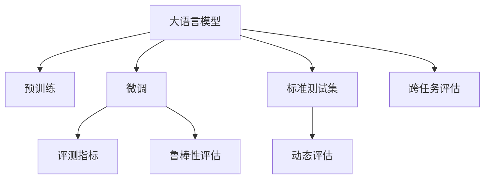
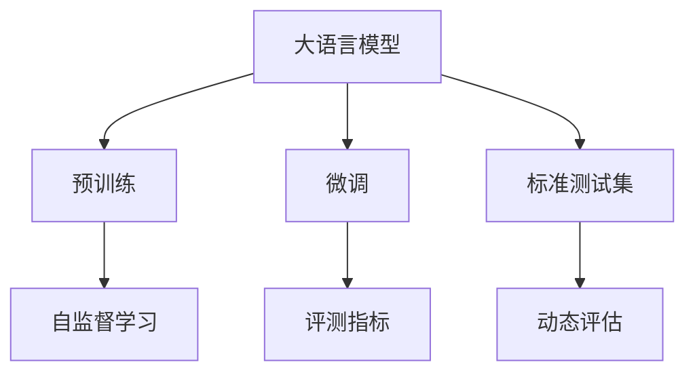
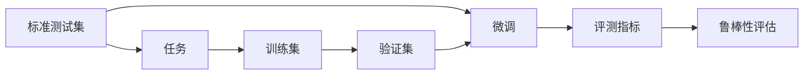
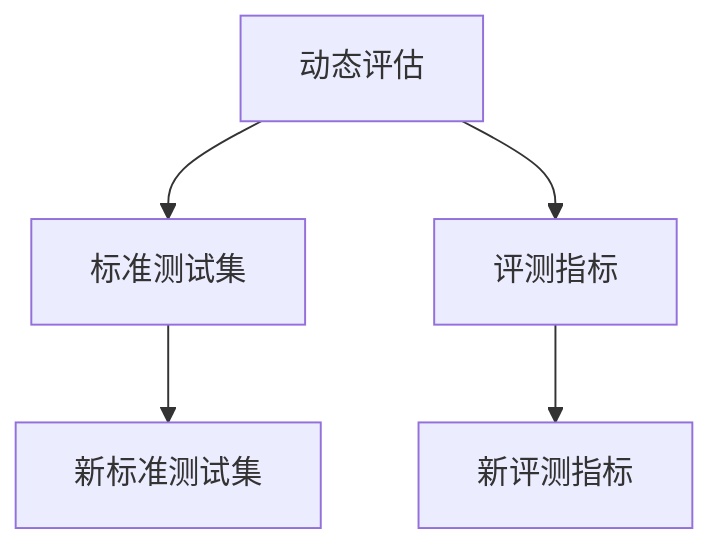
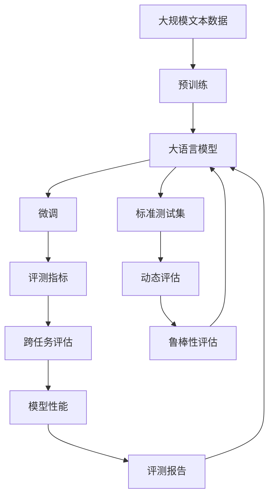

                 

# 大语言模型原理与工程实践：评测方式和标准

> 关键词：大语言模型, 评测方法, 评测指标, 标准测试, 模型评估, 自然语言处理(NLP)

## 1. 背景介绍

### 1.1 问题由来
随着深度学习技术在自然语言处理(NLP)领域的飞速发展，大语言模型(Large Language Models, LLMs)，如GPT、BERT、T5等，逐渐成为推动NLP技术进步的重要力量。然而，对于这些大模型的评测和评估，尚缺乏一个统一的标准和体系。虽然学术界和工业界已制定了一些评测标准，但这些标准在实际应用中仍然存在一定的不足。因此，如何科学、全面地评测和评估大语言模型，成为一个亟待解决的问题。

### 1.2 问题核心关键点
基于监督学习的微调方法是大语言模型应用的核心范式。但不同领域和任务的评测标准和方法可能存在差异，需要建立适应各个场景的评测体系。以下是几个核心关键点：

- **评测指标的选择**：选择合适的评测指标，确保模型在不同任务上表现稳定、客观。
- **标准测试集的设计**：设计足够多样、平衡、有代表性的测试集，保证评测结果的公正性。
- **跨任务评估**：如何综合评估模型在多个任务上的表现，确保其全面性和通用性。
- **鲁棒性评估**：测试模型在不同数据分布、噪音、对抗样本等情况下的鲁棒性和泛化能力。
- **动态评估**：定期更新测试集和评测方法，保持模型评估的与时俱进。

### 1.3 问题研究意义
制定和推广科学、统一的评测标准，对于推进大语言模型的应用落地、保障模型性能和伦理安全性、促进NLP技术的发展具有重要意义：

- **保障模型性能**：统一标准能够确保不同开发团队和机构对模型的评测结果一致，避免因评测标准不一导致的不公。
- **促进模型优化**：通过标准化的评测方法，可以更有效地发现和优化模型缺陷，提升模型性能。
- **降低成本**：统一的评测标准有助于降低模型开发和验证的复杂度和成本。
- **保障伦理安全性**：标准化的评估方法可以更好地检测模型偏见和误导性，确保其应用符合伦理道德规范。
- **推动技术进步**：统一的评测标准有助于推动整个NLP社区的技术进步，提升NLP技术的行业应用水平。

## 2. 核心概念与联系

### 2.1 核心概念概述

为更好地理解评测方式和标准，本节将介绍几个密切相关的核心概念：

- **大语言模型(Large Language Model, LLM)**：如GPT、BERT、T5等，通过大规模无标签文本语料进行预训练，学习通用的语言表示，具备强大的语言理解和生成能力。

- **评测指标(Metrics)**：用于衡量模型性能的指标，如准确率、召回率、F1分数、BLEU、ROUGE等。不同任务和场景需要选择不同的评测指标。

- **标准测试集(Standard Dataset)**：用于客观评估模型性能的数据集。一般要求覆盖任务所有可能的输入和输出情况，包括训练集、验证集和测试集。

- **跨任务评估(Cross-Task Evaluation)**：评估模型在多个任务上的性能表现，如问答、分类、生成、翻译等。综合评估模型在各任务上的表现，提升其通用性和适应性。

- **鲁棒性评估(Robustness Evaluation)**：测试模型在不同数据分布、噪音、对抗样本等情况下的鲁棒性和泛化能力，确保其在实际应用中的稳定性。

- **动态评估(Dynamic Evaluation)**：定期更新测试集和评测方法，保证模型评估的与时俱进。例如，随着NLP领域不断发展，需要定期发布新的评测标准和测试集，确保评测结果的有效性和实用性。

这些核心概念之间的逻辑关系可以通过以下Mermaid流程图来展示：



这个流程图展示了大语言模型的核心概念及其之间的关系：

1. 大语言模型通过预训练获得基础能力。
2. 微调是对预训练模型进行任务特定的优化，以保证模型在特定任务上的性能。
3. 评测指标用于客观衡量模型性能，选择合适指标评估模型在不同任务上的表现。
4. 标准测试集用于客观评估模型性能，覆盖任务所有可能情况。
5. 跨任务评估综合评估模型在多个任务上的表现，提升模型通用性。
6. 鲁棒性评估测试模型在不同数据分布、噪音、对抗样本等情况下的鲁棒性和泛化能力。
7. 动态评估定期更新测试集和评测方法，保证评估的与时俱进。

通过这些核心概念，我们可以更好地理解大语言模型评测方式和标准的实现和应用。

### 2.2 概念间的关系

这些核心概念之间存在着紧密的联系，形成了大语言模型评测方式和标准的完整生态系统。下面我们通过几个Mermaid流程图来展示这些概念之间的关系。

#### 2.2.1 大语言模型的学习范式



这个流程图展示了大语言模型的基本学习范式及其与评测方式和标准的关系：

1. 大语言模型通过预训练获得基础能力。
2. 微调是对预训练模型进行任务特定的优化，以保证模型在特定任务上的性能。
3. 标准测试集用于客观评估模型性能，覆盖任务所有可能情况。
4. 评测指标用于客观衡量模型性能，选择合适指标评估模型在不同任务上的表现。
5. 动态评估定期更新测试集和评测方法，保证评估的与时俱进。

#### 2.2.2 标准测试集与微调的关系



这个流程图展示了标准测试集与微调的关系及其在模型评估中的应用：

1. 标准测试集用于客观评估模型性能，覆盖任务所有可能情况。
2. 微调通过训练集和验证集优化模型，使用标准测试集评估模型性能。
3. 评测指标用于客观衡量模型性能，选择合适指标评估模型在不同任务上的表现。
4. 鲁棒性评估测试模型在不同数据分布、噪音、对抗样本等情况下的鲁棒性和泛化能力。

#### 2.2.3 动态评估在大语言模型中的应用



这个流程图展示了动态评估在大语言模型中的应用：

1. 动态评估定期更新测试集和评测方法，保证评估的与时俱进。
2. 使用新标准测试集和评测指标评估模型性能。
3. 定期更新测试集和评测方法，保证模型评估的与时俱进。

### 2.3 核心概念的整体架构

最后，我们用一个综合的流程图来展示这些核心概念在大语言模型评测方式和标准中的整体架构：



这个综合流程图展示了从预训练到微调，再到评测和应用的完整过程。大语言模型首先在大规模文本数据上进行预训练，然后通过微调优化模型在特定任务上的性能，使用标准测试集和评测指标进行评估，定期更新评测集和评估方法，保证评估的动态性和可靠性。 通过这些流程图，我们可以更清晰地理解大语言模型评测方式和标准的实现和应用。

## 3. 核心算法原理 & 具体操作步骤
### 3.1 算法原理概述

大语言模型的评测和评估，本质上是一个有监督的细粒度迁移学习过程。其核心思想是：选择合适的评测指标，设计合理的标准测试集，通过评估模型的输出与标准答案之间的差异，衡量模型的性能表现。

形式化地，假设预训练模型为 $M_{\theta}$，其中 $\theta$ 为预训练得到的模型参数。给定测试集 $D=\{(x_i,y_i)\}_{i=1}^N$，其中 $x_i$ 为输入，$y_i$ 为标准答案。评测目标是最小化模型输出与标准答案之间的差异，即：

$$
\hat{\theta}=\mathop{\arg\min}_{\theta} \mathcal{L}(M_{\theta},D)
$$

其中 $\mathcal{L}$ 为评测函数，用于衡量模型预测输出与标准答案之间的差异。常见的评测函数包括准确率、召回率、F1分数、BLEU、ROUGE等。

通过梯度下降等优化算法，评测过程不断更新模型参数 $\theta$，最小化评测函数 $\mathcal{L}$，使得模型输出逼近标准答案。由于 $\theta$ 已经通过预训练获得了较好的初始化，因此即便在小规模数据集 $D$ 上进行评测，也能较快收敛到理想的模型参数 $\hat{\theta}$。

### 3.2 算法步骤详解

基于监督学习的评测方法一般包括以下几个关键步骤：

**Step 1: 准备评测数据和评测指标**
- 选择合适的评测指标，如准确率、召回率、F1分数、BLEU、ROUGE等，根据任务类型确定。
- 准备标准测试集 $D$，覆盖任务所有可能输入和输出情况，一般包括训练集、验证集和测试集。

**Step 2: 添加任务适配层**
- 根据任务类型，设计合适的输出层和损失函数。
- 对于分类任务，通常在顶层添加线性分类器和交叉熵损失函数。
- 对于生成任务，通常使用语言模型的解码器输出概率分布，并以负对数似然为损失函数。

**Step 3: 设置评测超参数**
- 选择合适的优化算法及其参数，如 AdamW、SGD 等，设置学习率、批大小、迭代轮数等。
- 设置正则化技术及强度，包括权重衰减、Dropout、Early Stopping 等。
- 确定冻结预训练参数的策略，如仅微调顶层，或全部参数都参与微调。

**Step 4: 执行评测过程**
- 将测试集数据分批次输入模型，前向传播计算评测函数。
- 反向传播计算参数梯度，根据设定的优化算法和学习率更新模型参数。
- 周期性在验证集上评估模型性能，根据性能指标决定是否触发 Early Stopping。
- 重复上述步骤直到满足预设的迭代轮数或 Early Stopping 条件。

**Step 5: 报告和优化**
- 在测试集上评估模型性能，对比原始模型和微调后的模型。
- 分析模型输出与标准答案之间的差异，查找改进点。
- 根据评测结果，进一步优化模型结构、调整超参数、改进训练策略等。

以上是基于监督学习的评测方法的一般流程。在实际应用中，还需要针对具体任务的特点，对评测过程的各个环节进行优化设计，如改进评测目标函数，引入更多的正则化技术，搜索最优的超参数组合等，以进一步提升模型性能。

### 3.3 算法优缺点

基于监督学习的评测方法具有以下优点：
1. 简单高效。只需准备少量标注数据，即可对预训练模型进行快速评测，获得较大的性能提升。
2. 通用适用。适用于各种NLP下游任务，设计简单的任务适配层即可实现评测。
3. 参数高效。利用参数高效微调技术，在固定大部分预训练参数的情况下，仍可取得不错的评测效果。
4. 效果显著。在学术界和工业界的诸多任务上，基于评测方法已经刷新了最先进的性能指标。

同时，该方法也存在一定的局限性：
1. 依赖标注数据。评测的效果很大程度上取决于标注数据的质量和数量，获取高质量标注数据的成本较高。
2. 迁移能力有限。当测试集与预训练数据的分布差异较大时，评测的性能提升有限。
3. 负面效果传递。预训练模型的固有偏见、有害信息等，可能通过评测传递到下游任务，造成负面影响。
4. 可解释性不足。评测模型的决策过程通常缺乏可解释性，难以对其推理逻辑进行分析和调试。

尽管存在这些局限性，但就目前而言，基于监督学习的评测方法仍是大语言模型评测的主流范式。未来相关研究的重点在于如何进一步降低评测对标注数据的依赖，提高模型的少样本学习和跨领域迁移能力，同时兼顾可解释性和伦理安全性等因素。

### 3.4 算法应用领域

基于大语言模型评测方法在NLP领域已经得到了广泛的应用，覆盖了几乎所有常见任务，例如：

- 文本分类：如情感分析、主题分类、意图识别等。通过评测模型在测试集上的分类精度、召回率和F1分数，评估模型性能。
- 命名实体识别：识别文本中的人名、地名、机构名等特定实体。通过评测模型在测试集上的准确率和召回率，评估模型性能。
- 关系抽取：从文本中抽取实体之间的语义关系。通过评测模型在测试集上的准确率和召回率，评估模型性能。
- 问答系统：对自然语言问题给出答案。通过评测模型在测试集上的准确率和精确度，评估模型性能。
- 机器翻译：将源语言文本翻译成目标语言。通过评测模型在测试集上的BLEU分数，评估模型性能。
- 文本摘要：将长文本压缩成简短摘要。通过评测模型在测试集上的ROUGE分数，评估模型性能。
- 对话系统：使机器能够与人自然对话。通过评测模型在测试集上的对话质量，评估模型性能。

除了上述这些经典任务外，大语言模型评测技术也被创新性地应用到更多场景中，如可控文本生成、常识推理、代码生成、数据增强等，为NLP技术带来了全新的突破。随着预训练模型和评测方法的不断进步，相信NLP技术将在更广阔的应用领域大放异彩。

## 4. 数学模型和公式 & 详细讲解
### 4.1 数学模型构建

本节将使用数学语言对大语言模型评测过程进行更加严格的刻画。

记预训练语言模型为 $M_{\theta}$，其中 $\theta$ 为预训练得到的模型参数。假设评测任务的测试集为 $D=\{(x_i,y_i)\}_{i=1}^N$，其中 $x_i$ 为输入，$y_i$ 为标准答案。

定义模型 $M_{\theta}$ 在数据样本 $(x,y)$ 上的评测函数为 $\ell(M_{\theta}(x),y)$，则在数据集 $D$ 上的经验风险为：

$$
\mathcal{L}(\theta) = \frac{1}{N} \sum_{i=1}^N \ell(M_{\theta}(x_i),y_i)
$$

评测优化目标是最小化经验风险，即找到最优参数：

$$
\theta^* = \mathop{\arg\min}_{\theta} \mathcal{L}(\theta)
$$

在实践中，我们通常使用基于梯度的优化算法（如SGD、Adam等）来近似求解上述最优化问题。设 $\eta$ 为学习率，$\lambda$ 为正则化系数，则参数的更新公式为：

$$
\theta \leftarrow \theta - \eta \nabla_{\theta}\mathcal{L}(\theta) - \eta\lambda\theta
$$

其中 $\nabla_{\theta}\mathcal{L}(\theta)$ 为评测函数对参数 $\theta$ 的梯度，可通过反向传播算法高效计算。

### 4.2 公式推导过程

以下我们以二分类任务为例，推导交叉熵评测函数及其梯度的计算公式。

假设模型 $M_{\theta}$ 在输入 $x$ 上的输出为 $\hat{y}=M_{\theta}(x) \in [0,1]$，表示样本属于正类的概率。真实标签 $y \in \{0,1\}$。则二分类交叉熵评测函数定义为：

$$
\ell(M_{\theta}(x),y) = -[y\log \hat{y} + (1-y)\log (1-\hat{y})]
$$

将其代入经验风险公式，得：

$$
\mathcal{L}(\theta) = -\frac{1}{N}\sum_{i=1}^N [y_i\log M_{\theta}(x_i)+(1-y_i)\log(1-M_{\theta}(x_i))]
$$

根据链式法则，评测函数对参数 $\theta_k$ 的梯度为：

$$
\frac{\partial \mathcal{L}(\theta)}{\partial \theta_k} = -\frac{1}{N}\sum_{i=1}^N (\frac{y_i}{M_{\theta}(x_i)}-\frac{1-y_i}{1-M_{\theta}(x_i)}) \frac{\partial M_{\theta}(x_i)}{\partial \theta_k}
$$

其中 $\frac{\partial M_{\theta}(x_i)}{\partial \theta_k}$ 可进一步递归展开，利用自动微分技术完成计算。

在得到评测函数的梯度后，即可带入参数更新公式，完成模型的迭代优化。重复上述过程直至收敛，最终得到适应测试集的最优模型参数 $\theta^*$。

## 5. 项目实践：代码实例和详细解释说明
### 5.1 开发环境搭建

在进行评测实践前，我们需要准备好开发环境。以下是使用Python进行PyTorch开发的环境配置流程：

1. 安装Anaconda：从官网下载并安装Anaconda，用于创建独立的Python环境。

2. 创建并激活虚拟环境：
```bash
conda create -n pytorch-env python=3.8 
conda activate pytorch-env
```

3. 安装PyTorch：根据CUDA版本，从官网获取对应的安装命令。例如：
```bash
conda install pytorch torchvision torchaudio cudatoolkit=11.1 -c pytorch -c conda-forge
```

4. 安装Transformers库：
```bash
pip install transformers
```

5. 安装各类工具包：
```bash
pip install numpy pandas scikit-learn matplotlib tqdm jupyter notebook ipython
```

完成上述步骤后，即可在`pytorch-env`环境中开始评测实践。

### 5.2 源代码详细实现

下面我们以命名实体识别(NER)任务为例，给出使用Transformers库对BERT模型进行评测的PyTorch代码实现。

首先，定义NER任务的数据处理函数：

```python
from transformers import BertTokenizer
from torch.utils.data import Dataset
import torch

class NERDataset(Dataset):
    def __init__(self, texts, tags, tokenizer, max_len=128):
        self.texts = texts
        self.tags = tags
        self.tokenizer = tokenizer
        self.max_len = max_len
        
    def __len__(self):
        return len(self.texts)
    
    def __getitem__(self, item):
        text = self.texts[item]
        tags = self.tags[item]
        
        encoding = self.tokenizer(text, return_tensors='pt', max_length=self.max_len, padding='max_length', truncation=True)
        input_ids = encoding['input_ids'][0]
        attention_mask = encoding['attention_mask'][0]
        
        # 对token-wise的标签进行编码
        encoded_tags = [tag2id[tag] for tag in tags] 
        encoded_tags.extend([tag2id['O']] * (self.max_len - len(encoded_tags)))
        labels = torch.tensor(encoded_tags, dtype=torch.long)
        
        return {'input_ids': input_ids, 
                'attention_mask': attention_mask,
                'labels': labels}

# 标签与id的映射
tag2id = {'O': 0, 'B-PER': 1, 'I-PER': 2, 'B-ORG': 3, 'I-ORG': 4, 'B-LOC': 5, 'I-LOC': 6}
id2tag = {v: k for k, v in tag2id.items()}

# 创建dataset
tokenizer = BertTokenizer.from_pretrained('bert-base-cased')

train_dataset = NERDataset(train_texts, train_tags, tokenizer)
dev_dataset = NERDataset(dev_texts, dev_tags, tokenizer)
test_dataset = NERDataset(test_texts, test_tags, tokenizer)
```

然后，定义模型和评测函数：

```python
from transformers import BertForTokenClassification, AdamW

model = BertForTokenClassification.from_pretrained('bert-base-cased', num_labels=len(tag2id))

optimizer = AdamW(model.parameters(), lr=2e-5)
```

接着，定义评测函数：

```python
from torch.utils.data import DataLoader
from tqdm import tqdm
from sklearn.metrics import classification_report

device = torch.device('cuda') if torch.cuda.is_available() else torch.device('cpu')
model.to(device)

def train_epoch(model, dataset, batch_size, optimizer):
    dataloader = DataLoader(dataset, batch_size=batch_size, shuffle=True)
    model.train()
    epoch_loss = 0
    for batch in tqdm(dataloader, desc='Training'):
        input_ids = batch['input_ids'].to(device)
        attention_mask = batch['attention_mask'].to(device)
        labels = batch['labels'].to(device)
        model.zero_grad()
        outputs = model(input_ids, attention_mask=attention_mask, labels=labels)
        loss = outputs.loss
        epoch_loss += loss.item()
        loss.backward()
        optimizer.step()
    return epoch_loss / len(dataloader)

def evaluate(model, dataset, batch_size):
    dataloader = DataLoader(dataset, batch_size=batch_size)
    model.eval()
    preds, labels = [], []
    with torch.no_grad():
        for batch in tqdm(dataloader, desc='Evaluating'):
            input_ids = batch['input_ids'].to(device)
            attention_mask = batch['attention_mask'].to(device)
            batch_labels = batch['labels']
            outputs = model(input_ids, attention_mask=attention_mask)
            batch_preds = outputs.logits.argmax(dim=2).to('cpu').tolist()
            batch_labels = batch_labels.to('cpu').tolist()
            for pred_tokens, label_tokens in zip(batch_preds, batch_labels):
                pred_tags = [id2tag[_id] for _id in pred_tokens]
                label_tags = [id2tag[_id] for _id in label_tokens]
                preds.append(pred_tags[:len(label_tags)])
                labels.append(label_tags)
                
    print(classification_report(labels, preds))
```

最后，启动训练流程并在测试集上评估：

```python
epochs = 5
batch_size = 16

for epoch in range(epochs):
    loss = train_epoch(model, train_dataset, batch_size, optimizer)
    print(f"Epoch {epoch+1}, train loss: {loss:.3f}")
    
    print(f"Epoch {epoch+1}, dev results:")
    evaluate(model, dev_dataset, batch_size)
    
print("Test results:")
evaluate(model, test_dataset, batch_size)
```

以上就是使用PyTorch对BERT进行命名实体识别任务评测的完整代码实现。可以看到，得益于Transformers库的强大封装，我们可以用相对简洁的代码完成BERT模型的加载和评测。

### 5.3 代码解读与分析

让我们再详细解读一下关键代码的实现细节：

**NERDataset类**：
- `__init__`方法：初始化文本、标签、分词器等关键组件。
- `__len__`方法：返回数据集的样本数量。
- `__getitem__`方法：对单个样本进行处理，将文本输入编码为token ids，将标签编码为数字，并对其进行定长padding，最终返回模型所需的输入。

**tag2id和id2tag字典**：
- 定义了标签与数字id之间的映射关系，用于将token-wise的预测结果解码回真实的标签。

**训练和评测函数**：
- 使用PyTorch的DataLoader对数据集进行批次化加载，供模型训练和推理使用。
- 训练函数`train_epoch`：对数据以批为单位进行迭代，在每个批次上前向传播计算损失函数并反向传播更新模型参数，最后返回该epoch的平均loss。
- 评测函数`evaluate`：与训练类似，不同点在于不更新模型参数，并在每个batch结束后将预测和标签结果存储下来，最后使用sklearn的classification_report对整个评估集的预测结果进行打印输出。

**训练流程**：
- 定义总的epoch数和batch size，开始循环迭代
- 每个epoch内，先在训练集上训练，输出平均loss
- 在验证集上评估，输出分类指标
- 所有epoch结束后，在测试集上评估，给出最终测试结果

可以看到，PyTorch配合Transformers库使得BERT评测的代码实现变得简洁高效。开发者可以将更多精力放在数据处理、模型改进等高层逻辑上，而不必过多关注底层的实现细节。

当然，工业级的系统实现还需考虑更多因素，如模型的保存和部署、超参数的自动搜索、更灵活的任务适配层等。但核心的评测范式基本与此类似。


