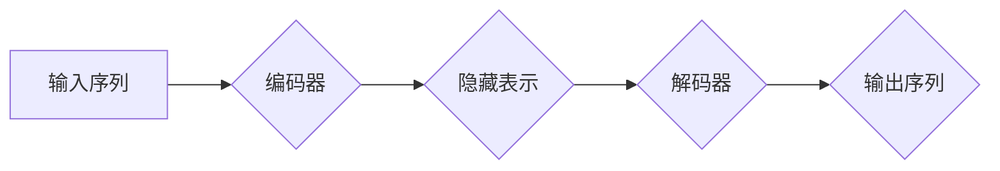

## Transformer大模型实战 整合编码器和解码器

> 关键词：Transformer, 编码器, 解码器, 自注意力机制,  BERT, GPT, 自然语言处理, 深度学习

## 1. 背景介绍

近年来，深度学习在自然语言处理 (NLP) 领域取得了突破性进展，其中 Transformer 架构扮演着至关重要的角色。Transformer 摒弃了传统的循环神经网络 (RNN) 结构，引入了自注意力机制，能够有效捕捉长距离依赖关系，从而在机器翻译、文本摘要、问答系统等任务上取得了显著的性能提升。

BERT 和 GPT 等基于 Transformer 的大模型更是展现了其强大的能力，在各种 NLP 任务上取得了领先的成绩。然而，对于初学者来说，理解 Transformer 的核心原理和架构设计仍然存在一定的难度。

本文将深入探讨 Transformer 大模型的实战应用，重点介绍编码器和解码器的集成，并通过代码实例和实际应用场景，帮助读者更好地理解 Transformer 的工作机制，并掌握其应用技巧。

## 2. 核心概念与联系

Transformer 的核心思想是利用自注意力机制来捕捉文本序列中的长距离依赖关系。它由编码器和解码器两部分组成，编码器负责将输入序列映射到一个隐藏表示，解码器则根据编码器的输出生成目标序列。

**2.1  编码器**

编码器由多个相同的 Transformer 块堆叠而成，每个 Transformer 块包含以下组件：

* **多头自注意力层 (Multi-Head Self-Attention):**  该层能够同时关注输入序列中的多个位置，并学习不同位置之间的关系。
* **前馈神经网络 (Feed-Forward Network):**  该层对每个位置的隐藏表示进行非线性变换，进一步提取语义信息。
* **残差连接 (Residual Connection):**  该机制将输入和输出相加，缓解梯度消失问题。
* **层归一化 (Layer Normalization):**  该机制对每个 Transformer 块的输出进行归一化，提高训练稳定性。

**2.2  解码器**

解码器与编码器结构相似，但也有一些关键区别：

* **masked multi-head self-attention:**  该层在解码过程中使用掩码，防止解码器对未来位置的信息进行预测。
* **encoder-decoder attention:**  该层允许解码器关注编码器的输出，从而获取上下文信息。

**2.3  Mermaid 流程图**



## 3. 核心算法原理 & 具体操作步骤

### 3.1  算法原理概述

Transformer 的核心算法是自注意力机制，它能够学习输入序列中不同位置之间的关系，并赋予每个位置不同的权重。

自注意力机制的计算过程可以概括为以下步骤：

1.  **查询 (Query)、键 (Key) 和值 (Value) 矩阵:** 将输入序列映射到三个不同的矩阵，分别代表查询、键和值。
2.  **注意力分数计算:** 计算每个查询与所有键之间的相似度，得到注意力分数。
3.  **注意力权重计算:** 将注意力分数进行归一化，得到注意力权重。
4.  **加权求和:** 使用注意力权重对值矩阵进行加权求和，得到最终的输出。

### 3.2  算法步骤详解

1.  **输入序列:** 将输入序列中的每个单词转换为词向量。
2.  **查询、键和值矩阵:** 使用线性变换将词向量分别映射到查询、键和值矩阵。
3.  **注意力分数计算:** 计算每个查询与所有键之间的点积，作为注意力分数。
4.  **注意力权重计算:** 使用 softmax 函数将注意力分数归一化，得到注意力权重。
5.  **加权求和:** 使用注意力权重对值矩阵进行加权求和，得到最终的输出。

### 3.3  算法优缺点

**优点:**

*   能够有效捕捉长距离依赖关系。
*   并行计算能力强，训练速度快。
*   在各种 NLP 任务上取得了显著的性能提升。

**缺点:**

*   参数量大，计算资源需求高。
*   训练数据量大，需要大量的数据进行训练。

### 3.4  算法应用领域

*   机器翻译
*   文本摘要
*   问答系统
*   文本生成
*   情感分析

## 4. 数学模型和公式 & 详细讲解 & 举例说明

### 4.1  数学模型构建

Transformer 的数学模型可以概括为以下公式：

*   **自注意力机制:**

$$
Attention(Q, K, V) = softmax(\frac{QK^T}{\sqrt{d_k}})V
$$

其中：

*   $Q$：查询矩阵
*   $K$：键矩阵
*   $V$：值矩阵
*   $d_k$：键向量的维度
*   $softmax$：softmax 函数

*   **前馈神经网络:**

$$
FFN(x) = \max(0, W_1x + b_1)W_2x + b_2
$$

其中：

*   $x$：输入向量
*   $W_1$、$W_2$：权重矩阵
*   $b_1$、$b_2$：偏置向量

### 4.2  公式推导过程

自注意力机制的公式推导过程如下：

1.  **计算查询与键之间的点积:**

$$
score(q_i, k_j) = q_i^T k_j
$$

2.  **对点积进行归一化:**

$$
attention(q_i, k_j) = \frac{exp(score(q_i, k_j))}{\sum_{l=1}^{n} exp(score(q_i, k_l))}
$$

3.  **对值矩阵进行加权求和:**

$$
output(q_i) = \sum_{j=1}^{n} attention(q_i, k_j) v_j
$$

### 4.3  案例分析与讲解

假设我们有一个句子 "The cat sat on the mat"，将其转换为词向量后，每个词向量都代表一个查询向量、键向量和值向量。

当计算 "cat" 与其他词之间的注意力分数时，"sat" 和 "on" 的注意力分数会相对较高，因为它们与 "cat" 在语义上更相关。

最终的输出向量将包含 "cat" 与其他词之间的关系信息，从而更好地理解句子的语义。

## 5. 项目实践：代码实例和详细解释说明

### 5.1  开发环境搭建

*   Python 3.6+
*   PyTorch 或 TensorFlow
*   Numpy
*   Transformers 库

### 5.2  源代码详细实现

```python
from transformers import BertTokenizer, BertModel

# 加载预训练模型和词典
tokenizer = BertTokenizer.from_pretrained('bert-base-uncased')
model = BertModel.from_pretrained('bert-base-uncased')

# 输入文本
text = "The cat sat on the mat."

# 将文本转换为输入序列
input_ids = tokenizer.encode(text, add_special_tokens=True)

# 将输入序列传递给模型
outputs = model(input_ids)

# 获取隐藏表示
hidden_states = outputs.last_hidden_state

# 打印隐藏表示
print(hidden_states)
```

### 5.3  代码解读与分析

*   首先，我们加载预训练的 BERT 模型和词典。
*   然后，我们将输入文本转换为输入序列，并添加特殊的开始和结束标记。
*   将输入序列传递给模型，得到模型的输出。
*   最后，我们获取模型的隐藏表示，并打印出来。

### 5.4  运行结果展示

运行代码后，会输出一个隐藏表示矩阵，每个元素代表句子中每个词的语义信息。

## 6. 实际应用场景

Transformer 大模型在各种实际应用场景中发挥着重要作用，例如：

*   **机器翻译:**  Transformer 模型能够准确地捕捉语言之间的语义关系，从而实现高质量的机器翻译。
*   **文本摘要:**  Transformer 模型能够识别文本中的关键信息，并生成简洁准确的文本摘要。
*   **问答系统:**  Transformer 模型能够理解用户的问题，并从文本库中找到最相关的答案。
*   **文本生成:**  Transformer 模型能够根据给定的提示生成流畅自然的文本，例如故事、诗歌、代码等。

### 6.4  未来应用展望

随着 Transformer 模型的不断发展，其应用场景将会更加广泛，例如：

*   **对话系统:**  Transformer 模型能够构建更自然、更智能的对话系统。
*   **代码生成:**  Transformer 模型能够根据自然语言描述生成代码。
*   **多模态理解:**  Transformer 模型能够融合文本、图像、音频等多模态信息，实现更深入的理解。

## 7. 工具和资源推荐

### 7.1  学习资源推荐

*   **论文:**  "Attention Is All You Need"
*   **博客:**  Jay Alammar's Blog
*   **课程:**  Stanford CS224N

### 7.2  开发工具推荐

*   **PyTorch:**  https://pytorch.org/
*   **TensorFlow:**  https://www.tensorflow.org/
*   **Transformers 库:**  https://huggingface.co/transformers/

### 7.3  相关论文推荐

*   BERT: Pre-training of Deep Bidirectional Transformers for Language Understanding
*   GPT: Generative Pre-trained Transformer
*   T5: Text-to-Text Transfer Transformer

## 8. 总结：未来发展趋势与挑战

### 8.1  研究成果总结

Transformer 架构的提出，标志着深度学习在 NLP 领域的重大突破。自注意力机制的引入，使得模型能够有效捕捉长距离依赖关系，在各种 NLP 任务上取得了显著的性能提升。

### 8.2  未来发展趋势

*   **模型规模的进一步扩大:**  更大的模型参数量能够带来更好的性能，但同时也带来了更高的计算成本。
*   **模型效率的提升:**  研究更轻量级的 Transformer 模型，降低计算资源需求。
*   **多模态理解:**  融合文本、图像、音频等多模态信息，实现更深入的理解。

### 8.3  面临的挑战

*   **数据获取和标注:**  训练大型 Transformer 模型需要大量的训练数据，数据获取和标注成本较高。
*   **计算资源:**  训练大型 Transformer 模型需要大量的计算资源，成本较高。
*   **可解释性:**  Transformer 模型的内部机制较为复杂，难以解释其决策过程。

### 8.4  研究展望

未来，Transformer 模型的研究将继续朝着更强大、更高效、更可解释的方向发展。

## 9. 附录：常见问题与解答

*   **Transformer 和 RNN 的区别:**  Transformer 不依赖于循环结构，能够并行计算，训练速度快，而 RNN 存在梯度消失问题，训练速度慢。
*   **自注意力机制的原理:**  自注意力机制能够学习输入序列中不同位置之间的关系，并赋予每个位置不同的权重。
*   **Transformer 模型的应用场景:**  Transformer 模型在机器翻译、文本摘要、问答系统、文本生成等各种 NLP 任务上都有广泛的应用。


作者：禅与计算机程序设计艺术 / Zen and the Art of Computer Programming 
