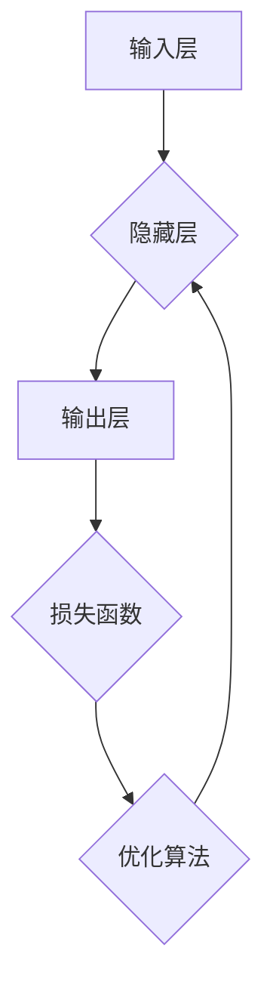

## 一切皆是映射：构建第一个深度学习模型

> 关键词：深度学习、神经网络、感知机、反向传播、激活函数、损失函数、优化算法

### 1. 背景介绍

深度学习作为机器学习领域最前沿的技术之一，近年来取得了令人瞩目的成就，在图像识别、自然语言处理、语音识别等领域展现出强大的应用潜力。然而，对于初学者来说，深度学习的原理和实现过程可能显得较为复杂。本文将以构建第一个深度学习模型为目标，带领读者逐步深入理解深度学习的核心概念和算法，并通过代码实例演示模型的训练和应用。

### 2. 核心概念与联系

深度学习的核心思想是利用多层神经网络来模拟人类大脑的学习过程。每个神经元接收来自其他神经元的输入信号，并通过权重进行加权求和，然后经过激活函数处理，输出到下一层神经元。通过不断调整神经网络的权重，模型能够学习数据中的复杂模式和关系。

**2.1 神经网络结构**

一个典型的深度学习模型由以下几个部分组成：

* **输入层:**接收原始数据，每个神经元代表一个特征。
* **隐藏层:**多个神经元层，用于提取数据的特征表示。
* **输出层:**输出模型的预测结果。

**2.2 激活函数**

激活函数的作用是引入非线性，使神经网络能够学习更复杂的模式。常见的激活函数包括 sigmoid、ReLU、tanh 等。

**2.3 损失函数**

损失函数用于衡量模型预测结果与真实值的差距。常见的损失函数包括均方误差、交叉熵等。

**2.4 优化算法**

优化算法用于更新神经网络的权重，使损失函数最小化。常见的优化算法包括梯度下降、Adam 等。

**2.5 流程图**



### 3. 核心算法原理 & 具体操作步骤

**3.1 算法原理概述**

深度学习模型的训练过程本质上是一个优化问题，目标是找到最优的权重，使得模型的预测结果与真实值之间的差距最小。

**3.2 算法步骤详解**

1. **初始化权重:**随机初始化神经网络的权重。
2. **前向传播:**将输入数据通过神经网络传递，计算输出结果。
3. **计算损失:**使用损失函数计算模型预测结果与真实值之间的差距。
4. **反向传播:**根据损失函数的梯度，反向传播误差信息，更新神经网络的权重。
5. **迭代训练:**重复步骤2-4，直到损失函数收敛。

**3.3 算法优缺点**

**优点:**

* 能够学习复杂的数据模式。
* 性能优于传统机器学习算法。

**缺点:**

* 训练时间长，需要大量数据和计算资源。
* 模型解释性差，难以理解模型的决策过程。

**3.4 算法应用领域**

* 图像识别
* 自然语言处理
* 语音识别
* 机器翻译
* 药物发现

### 4. 数学模型和公式 & 详细讲解 & 举例说明

**4.1 数学模型构建**

神经网络可以看作是一个多层感知机，每个神经元接收多个输入信号，并通过加权求和和激活函数处理，输出到下一层神经元。

**4.2 公式推导过程**

* **加权求和:**

$$z = \sum_{i=1}^{n} w_i x_i + b$$

其中，$z$ 是神经元的输入，$w_i$ 是第 $i$ 个输入信号的权重，$x_i$ 是第 $i$ 个输入信号的值，$b$ 是偏置项。

* **激活函数:**

$$a = f(z)$$

其中，$a$ 是神经元的输出，$f(z)$ 是激活函数。

* **损失函数:**

$$L = \frac{1}{N} \sum_{i=1}^{N} loss(y_i, \hat{y}_i)$$

其中，$L$ 是损失函数的值，$N$ 是样本数量，$y_i$ 是第 $i$ 个样本的真实值，$\hat{y}_i$ 是模型预测的第 $i$ 个样本的值。

* **梯度下降:**

$$\theta = \theta - \alpha \nabla L(\theta)$$

其中，$\theta$ 是模型参数，$\alpha$ 是学习率，$\nabla L(\theta)$ 是损失函数对参数的梯度。

**4.3 案例分析与讲解**

假设我们有一个简单的二分类问题，目标是判断图像是否包含猫。我们可以使用一个深度学习模型，包含输入层、隐藏层和输出层。

* 输入层接收图像的像素值。
* 隐藏层提取图像的特征。
* 输出层输出预测结果，即图像是否包含猫。

我们可以使用交叉熵损失函数和梯度下降算法来训练模型。

### 5. 项目实践：代码实例和详细解释说明

**5.1 开发环境搭建**

* Python 3.x
* TensorFlow 或 PyTorch

**5.2 源代码详细实现**

```python
import tensorflow as tf

# 定义模型
model = tf.keras.models.Sequential([
    tf.keras.layers.Flatten(input_shape=(28, 28)),
    tf.keras.layers.Dense(128, activation='relu'),
    tf.keras.layers.Dense(10, activation='softmax')
])

# 编译模型
model.compile(optimizer='adam',
              loss='sparse_categorical_crossentropy',
              metrics=['accuracy'])

# 训练模型
model.fit(x_train, y_train, epochs=10)

# 评估模型
loss, accuracy = model.evaluate(x_test, y_test)
print('Loss:', loss)
print('Accuracy:', accuracy)
```

**5.3 代码解读与分析**

* `tf.keras.models.Sequential`: 创建一个顺序模型，层级结构清晰。
* `tf.keras.layers.Flatten`: 将二维图像数据转换为一维向量。
* `tf.keras.layers.Dense`: 全连接层，每个神经元连接到上一层所有神经元。
* `activation='relu'`: 使用ReLU激活函数。
* `optimizer='adam'`: 使用Adam优化算法。
* `loss='sparse_categorical_crossentropy'`: 使用交叉熵损失函数。
* `metrics=['accuracy']`: 使用准确率作为评估指标。
* `model.fit`: 训练模型。
* `model.evaluate`: 评估模型。

**5.4 运行结果展示**

训练完成后，我们可以使用测试数据评估模型的性能。

### 6. 实际应用场景

深度学习模型在各个领域都有广泛的应用，例如：

* **图像识别:** 人脸识别、物体检测、图像分类。
* **自然语言处理:** 机器翻译、文本摘要、情感分析。
* **语音识别:** 语音转文本、语音助手。
* **推荐系统:** 商品推荐、内容推荐。

### 6.4 未来应用展望

随着深度学习技术的不断发展，未来将有更多新的应用场景出现，例如：

* **自动驾驶:** 深度学习可以用于感知周围环境、规划路径、控制车辆。
* **医疗诊断:** 深度学习可以用于辅助医生诊断疾病、预测患者风险。
* **药物研发:** 深度学习可以用于加速药物研发过程，发现新的药物靶点。

### 7. 工具和资源推荐

**7.1 学习资源推荐**

* **书籍:**
    * 深度学习
    * 深度学习实战
* **在线课程:**
    * Coursera 深度学习课程
    * Udacity 深度学习工程师 Nanodegree

**7.2 开发工具推荐**

* **TensorFlow:** 开源深度学习框架。
* **PyTorch:** 开源深度学习框架。
* **Keras:** 高级深度学习API，可以运行在TensorFlow或Theano之上。

**7.3 相关论文推荐**

* **AlexNet:** ImageNet Classification with Deep Convolutional Neural Networks
* **VGGNet:** Very Deep Convolutional Networks for Large-Scale Image Recognition
* **ResNet:** Deep Residual Learning for Image Recognition

### 8. 总结：未来发展趋势与挑战

**8.1 研究成果总结**

深度学习取得了令人瞩目的成就，在图像识别、自然语言处理等领域取得了突破性进展。

**8.2 未来发展趋势**

* **模型更深、更复杂:** 研究更深层次、更复杂的深度学习模型。
* **数据更丰富、更多样:** 利用更多数据类型和数据源来训练模型。
* **模型解释性更强:** 研究更易于理解和解释的深度学习模型。

**8.3 面临的挑战**

* **数据获取和标注:** 深度学习模型需要大量数据进行训练，数据获取和标注成本高昂。
* **计算资源:** 训练深度学习模型需要大量的计算资源，成本高昂。
* **模型安全性:** 深度学习模型容易受到攻击，需要保证模型的安全性。

**8.4 研究展望**

未来，深度学习将继续发展，在更多领域发挥重要作用。我们需要不断探索新的算法、新的模型、新的应用场景，并解决深度学习面临的挑战，推动深度学习技术向更安全、更可靠、更可解释的方向发展。

### 9. 附录：常见问题与解答

* **什么是深度学习？**

深度学习是一种机器学习的子领域，它利用多层神经网络来学习数据中的复杂模式和关系。

* **深度学习的优势是什么？**

深度学习能够学习复杂的数据模式，性能优于传统机器学习算法。

* **深度学习的应用场景有哪些？**

深度学习在图像识别、自然语言处理、语音识别、机器翻译等领域都有广泛的应用。

* **如何学习深度学习？**

可以阅读相关书籍、参加在线课程、学习开源深度学习框架。

* **深度学习的未来发展趋势是什么？**

模型更深、更复杂；数据更丰富、更多样；模型解释性更强。


作者：禅与计算机程序设计艺术 / Zen and the Art of Computer Programming 
