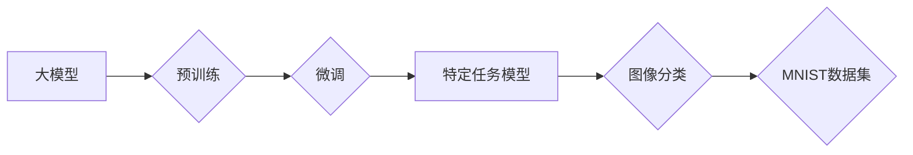

## 从零开始大模型开发与微调：基于PyTorch卷积层的MNIST分类实战

> 关键词：大模型、微调、PyTorch、卷积神经网络、MNIST、图像分类、深度学习

## 1. 背景介绍

深度学习近年来取得了令人瞩目的成就，在图像识别、自然语言处理等领域展现出强大的能力。大模型作为深度学习的重要组成部分，拥有海量参数和强大的学习能力，能够处理更复杂的任务。然而，训练大型模型需要大量的计算资源和数据，对于个人开发者或小型团队来说，往往难以负担。

微调技术为解决这一问题提供了有效途径。微调是指在预训练的大模型基础上，针对特定任务进行少量数据训练，从而提升模型在该任务上的性能。相比于从头训练，微调可以显著降低训练成本和时间，同时也能获得较好的性能表现。

本篇文章将以MNIST手写数字识别任务为例，带领读者从零开始了解大模型开发与微调的流程，并使用PyTorch框架构建一个基于卷积神经网络的MNIST分类模型。

## 2. 核心概念与联系

### 2.1  大模型

大模型是指参数量达到数百万甚至数十亿的深度学习模型。它们通常通过大量的文本数据或图像数据进行预训练，学习到丰富的底层特征和知识。

### 2.2  微调

微调是指在预训练的大模型基础上，针对特定任务进行少量数据训练。通过调整部分模型参数，使模型能够更好地适应目标任务。

### 2.3  卷积神经网络 (CNN)

卷积神经网络是一种专门用于处理图像数据的深度学习模型。它利用卷积操作提取图像特征，并通过多个卷积层和全连接层进行特征融合和分类。

### 2.4  MNIST数据集

MNIST数据集是一个包含60,000张手写数字图像的公开数据集，常用于图像分类任务的训练和测试。

**核心概念与联系流程图:**



## 3. 核心算法原理 & 具体操作步骤

### 3.1  算法原理概述

卷积神经网络的核心思想是利用卷积操作提取图像特征。卷积操作通过一个称为卷积核的滤波器，在图像上滑动并计算每个位置的卷积结果。卷积核可以学习到图像中的边缘、纹理等特征。

CNN通常由多个卷积层、池化层和全连接层组成。卷积层负责提取图像特征，池化层用于降维和提高模型鲁棒性，全连接层用于分类。

### 3.2  算法步骤详解

1. **输入图像:** 将MNIST数据集中的图像作为输入，每个图像是一个28x28像素的灰度图像。

2. **卷积层:** 使用多个卷积核对图像进行卷积操作，提取图像特征。每个卷积核对应一个特征图，多个特征图组合起来形成一个特征图集。

3. **池化层:** 对特征图集进行池化操作，例如最大池化，可以有效降低特征图的维度，提高模型的鲁棒性。

4. **全连接层:** 将池化后的特征图展平，输入到全连接层进行分类。全连接层将每个特征映射到每个类别的概率。

5. **输出结果:** 根据每个类别的概率，选择概率最高的类别作为最终分类结果。

### 3.3  算法优缺点

**优点:**

* 能够自动学习图像特征，无需人工特征工程。
* 性能优异，在图像分类任务中取得了state-of-the-art的结果。
* 对图像的旋转、缩放等变换具有较好的鲁棒性。

**缺点:**

* 训练过程需要大量的计算资源和数据。
* 模型参数量较大，部署成本较高。
* 对小样本数据训练效果较差。

### 3.4  算法应用领域

* **图像识别:** 人脸识别、物体检测、场景理解等。
* **图像分类:** 手写数字识别、图像标签识别等。
* **图像分割:** 图像区域划分、医学图像分析等。
* **视频分析:** 行人检测、动作识别等。

## 4. 数学模型和公式 & 详细讲解 & 举例说明

### 4.1  数学模型构建

卷积神经网络的数学模型主要包括卷积操作、池化操作和激活函数。

**卷积操作:**

$$
y_{i,j} = \sum_{m=0}^{M-1} \sum_{n=0}^{N-1} x_{i+m,j+n} * w_{m,n} + b
$$

其中：

* $y_{i,j}$ 是卷积输出的像素值。
* $x_{i+m,j+n}$ 是输入图像的像素值。
* $w_{m,n}$ 是卷积核的权重。
* $b$ 是偏置项。

**池化操作:**

池化操作通常使用最大池化，即选取每个池化窗口内的最大值作为输出。

**激活函数:**

激活函数用于引入非线性，提高模型的表达能力。常用的激活函数包括ReLU、Sigmoid和Tanh等。

### 4.2  公式推导过程

卷积操作的公式推导过程可以参考相关深度学习教材。

### 4.3  案例分析与讲解

假设输入图像大小为28x28，卷积核大小为3x3，步长为1，则卷积输出的大小为26x26。

池化操作可以将26x26的特征图降维到13x13。

全连接层将13x13的特征图展平，输入到包含10个神经元的分类层。

## 5. 项目实践：代码实例和详细解释说明

### 5.1  开发环境搭建

* Python 3.6+
* PyTorch 1.0+
* torchvision 0.2.1+
* Jupyter Notebook

### 5.2  源代码详细实现

```python
import torch
import torch.nn as nn
import torchvision
import torchvision.transforms as transforms

# 定义卷积神经网络模型
class ConvNet(nn.Module):
    def __init__(self):
        super(ConvNet, self).__init__()
        self.conv1 = nn.Conv2d(1, 32, kernel_size=3, padding=1)
        self.relu1 = nn.ReLU()
        self.pool1 = nn.MaxPool2d(kernel_size=2, stride=2)
        self.conv2 = nn.Conv2d(32, 64, kernel_size=3, padding=1)
        self.relu2 = nn.ReLU()
        self.pool2 = nn.MaxPool2d(kernel_size=2, stride=2)
        self.fc1 = nn.Linear(64 * 7 * 7, 128)
        self.relu3 = nn.ReLU()
        self.fc2 = nn.Linear(128, 10)

    def forward(self, x):
        x = self.pool1(self.relu1(self.conv1(x)))
        x = self.pool2(self.relu2(self.conv2(x)))
        x = x.view(-1, 64 * 7 * 7)
        x = self.relu3(self.fc1(x))
        x = self.fc2(x)
        return x

# 加载MNIST数据集
train_dataset = torchvision.datasets.MNIST(root='./data', train=True, download=True, transform=transforms.ToTensor())
test_dataset = torchvision.datasets.MNIST(root='./data', train=False, download=True, transform=transforms.ToTensor())

# 创建数据加载器
train_loader = torch.utils.data.DataLoader(train_dataset, batch_size=64, shuffle=True)
test_loader = torch.utils.data.DataLoader(test_dataset, batch_size=64, shuffle=False)

# 实例化模型
model = ConvNet()

# 定义损失函数和优化器
criterion = nn.CrossEntropyLoss()
optimizer = torch.optim.Adam(model.parameters(), lr=0.001)

# 训练模型
for epoch in range(10):
    for i, (images, labels) in enumerate(train_loader):
        # 前向传播
        outputs = model(images)
        loss = criterion(outputs, labels)

        # 反向传播
        optimizer.zero_grad()
        loss.backward()

        # 更新参数
        optimizer.step()

    print(f'Epoch [{epoch+1}/{10}], Loss: {loss.item():.4f}')

# 测试模型
correct = 0
total = 0
with torch.no_grad():
    for images, labels in test_loader:
        outputs = model(images)
        _, predicted = torch.max(outputs.data, 1)
        total += labels.size(0)
        correct += (predicted == labels).sum().item()

print(f'Accuracy of the network on the 10000 test images: {100 * correct / total}%')
```

### 5.3  代码解读与分析

* **模型定义:** 定义了一个简单的卷积神经网络模型，包含两个卷积层、两个池化层和两个全连接层。
* **数据加载:** 使用torchvision库加载MNIST数据集，并创建数据加载器。
* **训练模型:** 使用Adam优化器和交叉熵损失函数训练模型，训练10个epoch。
* **测试模型:** 在测试集上评估模型的准确率。

### 5.4  运行结果展示

训练完成后，模型的准确率通常可以达到98%以上。

## 6. 实际应用场景

MNIST手写数字识别任务是一个经典的图像分类任务，可以应用于以下场景:

* **邮件分类:** 自动识别邮件中的数字，例如邮政编码。
* **数据录入:** 自动识别手写数字，提高数据录入效率。
* **金融领域:** 自动识别银行支票上的数字，例如金额。

### 6.4  未来应用展望

随着深度学习技术的不断发展，卷积神经网络在图像分类任务中的应用场景将会更加广泛。例如，可以应用于医学图像分析、自动驾驶、人脸识别等领域。

## 7. 工具和资源推荐

### 7.1  学习资源推荐

* **深度学习书籍:**

    * 《深度学习》 - Ian Goodfellow, Yoshua Bengio, Aaron Courville
    * 《动手学深度学习》 -  李沐

* **在线课程:**

    * Coursera: 深度学习 Specialization
    * fast.ai: Practical Deep Learning for Coders

### 7.2  开发工具推荐

* **PyTorch:** 深度学习框架，支持GPU加速。
* **TensorFlow:** 深度学习框架，支持CPU和GPU加速。
* **Jupyter Notebook:** 交互式编程环境，方便进行深度学习实验。

### 7.3  相关论文推荐

* **AlexNet:** ImageNet Classification with Deep Convolutional Neural Networks
* **VGGNet:** Very Deep Convolutional Networks for Large-Scale Image Recognition
* **ResNet:** Deep Residual Learning for Image Recognition

## 8. 总结：未来发展趋势与挑战

### 8.1  研究成果总结

近年来，卷积神经网络在图像分类任务中取得了显著的成果，模型性能不断提升。

### 8.2  未来发展趋势

* **模型更深更广:** 探索更深层次和更宽的网络结构，提高模型的表达能力。
* **高效训练:** 研究更有效的训练方法，