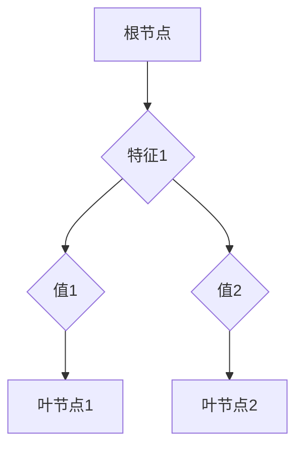

## 决策树 原理与代码实例讲解

> 关键词：决策树、机器学习、分类、回归、ID3、C4.5、CART、代码实例、Python

## 1. 背景介绍

决策树作为一种经典的机器学习算法，因其易于理解、解释和实现而广受应用。它是一种树形结构，用于将数据分类或回归。决策树通过一系列的判断节点和分支，最终将数据映射到一个类别或一个数值。

决策树算法在各个领域都有广泛的应用，例如：

* **医疗诊断:** 根据患者的症状和病史，预测疾病类型。
* **金融风险评估:** 根据客户的信用记录和财务状况，评估贷款风险。
* **市场营销:** 根据客户的购买行为和偏好，预测潜在客户。
* **图像识别:** 根据图像特征，识别物体类别。

## 2. 核心概念与联系

决策树的核心概念包括：

* **节点:** 代表一个特征或属性。
* **分支:** 代表一个特征或属性的取值。
* **叶节点:** 代表一个类别或一个数值。
* **路径:** 从根节点到叶节点的一条分支序列。

决策树的构建过程可以看作是一个递归的过程，从根节点开始，根据特征选择最优的分裂方式，将数据划分为不同的子集，然后对每个子集重复上述过程，直到达到停止条件。

**Mermaid 流程图**



## 3. 核心算法原理 & 具体操作步骤

### 3.1  算法原理概述

决策树算法的核心是选择最优的特征和分裂方式，以最大程度地划分数据。常用的选择特征的标准包括：

* **信息增益:** 衡量特征划分数据后，信息熵的减少程度。
* **基尼系数:** 衡量数据集中不同类别样本的不纯度。
* **Gini impurity:**  衡量数据集中不同类别样本的不纯度。

### 3.2  算法步骤详解

1. **选择初始节点:** 通常选择所有数据作为初始节点。
2. **选择最优特征:** 使用信息增益、基尼系数等标准，选择最优特征进行划分。
3. **划分数据:** 根据最优特征的取值，将数据划分为不同的子集。
4. **递归构建子树:** 对每个子集重复步骤2和步骤3，直到达到停止条件。
5. **生成叶节点:** 当子集中的数据属于同一类别或达到最大深度时，生成叶节点。

### 3.3  算法优缺点

**优点:**

* **易于理解和解释:** 决策树的结构清晰直观，易于理解决策过程。
* **可解释性强:** 可以通过决策树的结构，直观地了解特征对预测结果的影响。
* **实现简单:** 决策树算法的实现相对简单，可以使用多种编程语言实现。
* **处理非线性数据:** 决策树可以处理非线性数据，并能发现数据中的复杂关系。

**缺点:**

* **过拟合:** 决策树容易过拟合训练数据，导致泛化能力差。
* **数据依赖性强:** 决策树的性能依赖于数据的质量和特征选择。
* **稳定性差:** 决策树对数据中的噪声和异常值敏感。

### 3.4  算法应用领域

决策树算法广泛应用于以下领域：

* **分类:** 识别邮件是否为垃圾邮件、预测客户是否会流失等。
* **回归:** 预测房价、股票价格等。
* **异常检测:** 识别网络攻击、信用卡欺诈等。
* **推荐系统:** 推荐商品、电影等。

## 4. 数学模型和公式 & 详细讲解 & 举例说明

### 4.1  数学模型构建

决策树算法的数学模型主要基于信息论和概率论。

**信息熵:**

$$
H(S) = - \sum_{i=1}^{k} p_i \log_2 p_i
$$

其中：

* $S$ 是数据集。
* $k$ 是数据集中的类别数。
* $p_i$ 是类别 $i$ 的概率。

**信息增益:**

$$
Gain(S, A) = H(S) - \sum_{v \in V} \frac{|S_v|}{|S|} H(S_v)
$$

其中：

* $A$ 是特征。
* $V$ 是特征 $A$ 的取值集合。
* $S_v$ 是特征 $A$ 取值为 $v$ 的子集。

**基尼系数:**

$$
Gini(S) = 1 - \sum_{i=1}^{k} p_i^2
$$

### 4.2  公式推导过程

信息增益和基尼系数的推导过程基于信息论和概率论的基本原理。

* **信息熵:** 信息熵度量了数据集的不确定性。熵值越大，不确定性越大。
* **信息增益:** 信息增益度量了特征 $A$ 对数据集 $S$ 的信息贡献。信息增益越大，特征 $A$ 对数据集 $S$ 的划分效果越好。
* **基尼系数:** 基尼系数度量了数据集的不纯度。基尼系数越小，数据集越纯净。

### 4.3  案例分析与讲解

假设我们有一个数据集，包含以下特征和类别：

* **特征:** 年龄、收入、学历
* **类别:** 是否购买产品

我们可以使用信息增益或基尼系数来选择最优特征进行划分。例如，如果信息增益最高的特征是收入，那么我们可以将数据划分为收入高和收入低的两个子集。

## 5. 项目实践：代码实例和详细解释说明

### 5.1  开发环境搭建

* Python 3.x
* scikit-learn 库

### 5.2  源代码详细实现

```python
from sklearn.tree import DecisionTreeClassifier
from sklearn.model_selection import train_test_split
from sklearn.metrics import accuracy_score

# 加载数据
#...

# 将数据划分为训练集和测试集
X_train, X_test, y_train, y_test = train_test_split(X, y, test_size=0.2, random_state=42)

# 创建决策树模型
model = DecisionTreeClassifier()

# 训练模型
model.fit(X_train, y_train)

# 预测测试集结果
y_pred = model.predict(X_test)

# 计算准确率
accuracy = accuracy_score(y_test, y_pred)
print(f"准确率: {accuracy}")

# 可视化决策树
#...
```

### 5.3  代码解读与分析

* `DecisionTreeClassifier()` 创建决策树分类模型。
* `train_test_split()` 将数据划分为训练集和测试集。
* `fit()` 训练模型。
* `predict()` 预测测试集结果。
* `accuracy_score()` 计算准确率。

### 5.4  运行结果展示

运行代码后，会输出模型的准确率。

## 6. 实际应用场景

决策树算法在各个领域都有广泛的应用场景，例如：

* **医疗诊断:** 根据患者的症状和病史，预测疾病类型。
* **金融风险评估:** 根据客户的信用记录和财务状况，评估贷款风险。
* **市场营销:** 根据客户的购买行为和偏好，预测潜在客户。
* **图像识别:** 根据图像特征，识别物体类别。

## 7. 工具和资源推荐

### 7.1  学习资源推荐

* **书籍:**
    * "The Elements of Statistical Learning" by Trevor Hastie, Robert Tibshirani, and Jerome Friedman
    * "Introduction to Machine Learning" by Ethem Alpaydin
* **在线课程:**
    * Coursera: Machine Learning by Andrew Ng
    * edX: Introduction to Machine Learning

### 7.2  开发工具推荐

* **Python:** 
    * scikit-learn
    * pandas
    * matplotlib
* **R:**
    * rpart
    * party

### 7.3  相关论文推荐

* "ID3: A System for Simulating the Acquisition of Knowledge" by J. Ross Quinlan
* "C4.5: Programs for Machine Learning" by J. Ross Quinlan
* "CART: Classification and Regression Trees" by Leo Breiman, Jerome Friedman, Charles Olshen, and Richard Stone

## 8. 总结：未来发展趋势与挑战

### 8.1  研究成果总结

决策树算法在机器学习领域取得了显著的成果，并被广泛应用于各个领域。

### 8.2  未来发展趋势

* **集成学习:** 将多个决策树模型组合起来，提高模型的性能。
* **深度学习:** 将决策树与深度学习模型结合起来，探索新的应用场景。
* **可解释性:** 研究如何提高决策树的可解释性，使其更易于理解和应用。

### 8.3  面临的挑战

* **过拟合:** 决策树容易过拟合训练数据，需要采用正则化技术来解决。
* **数据依赖性强:** 决策树的性能依赖于数据的质量和特征选择。
* **稳定性差:** 决策树对数据中的噪声和异常值敏感。

### 8.4  研究展望

未来，决策树算法的研究将继续朝着提高性能、增强可解释性和拓展应用场景的方向发展。


## 9. 附录：常见问题与解答

* **如何选择最优特征？**

可以使用信息增益、基尼系数等标准来选择最优特征。

* **如何防止过拟合？**

可以使用正则化技术、剪枝算法等方法来防止过拟合。

* **如何解释决策树的决策过程？**

可以通过决策树的结构，直观地了解特征对预测结果的影响。

作者：禅与计算机程序设计艺术 / Zen and the Art of Computer Programming 


