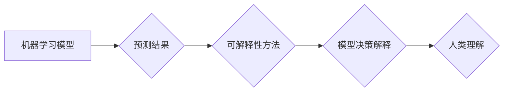

## 可解释性 (Explainability)

> 关键词：机器学习，深度学习，可解释模型，特征重要性，局部解释，全局解释，偏见检测，信任，透明度

## 1. 背景介绍

在机器学习和深度学习的蓬勃发展中，模型的预测能力取得了令人瞩目的成就。然而，随着模型复杂度的增加，其内部决策过程变得越来越难以理解。这导致一个关键问题：我们如何理解模型是如何做出预测的？

可解释性 (Explainability) 旨在解决这一问题，它关注的是使机器学习模型的决策过程更加透明和可理解。可解释性对于机器学习的广泛应用至关重要，因为它可以帮助我们：

* **建立信任:** 当我们能够理解模型的决策逻辑时，我们更容易信任其预测结果。
* **发现偏见:** 可解释性方法可以帮助我们识别模型中的潜在偏见，从而促进公平和公正的决策。
* **改进模型:** 通过分析模型的解释结果，我们可以更好地理解模型的局限性，并进行改进。
* **满足监管要求:** 在某些领域，例如医疗保健和金融，法律法规可能要求提供模型决策的解释。

## 2. 核心概念与联系

可解释性是一个广泛的概念，涵盖了许多不同的技术和方法。

**2.1. 全局解释 vs 局部解释**

* **全局解释:** 试图解释整个模型的决策逻辑，例如识别哪些特征对模型预测最重要。
* **局部解释:** 试图解释单个预测是如何产生的，例如解释模型如何根据特定输入数据做出特定预测。

**2.2. 模型类型**

* **可解释模型:** 这些模型本身就具有可解释性，例如线性回归和决策树。
* **不可解释模型:** 这些模型的决策过程难以理解，例如深度神经网络。

**2.3. 解释方法**

* **特征重要性:** 识别哪些特征对模型预测最重要。
* **决策边界分析:** 分析模型如何将数据点分类。
* **模型反演:** 通过反向传播算法，分析模型参数如何影响预测结果。
* **可视化技术:** 使用图表和图形来直观地展示模型的决策过程。

**2.4. Mermaid 流程图**



## 3. 核心算法原理 & 具体操作步骤

### 3.1  算法原理概述

特征重要性分析是可解释性中的一种常见方法，它试图识别哪些特征对模型预测最重要。

### 3.2  算法步骤详解

1. **选择特征重要性算法:** 常见的算法包括：
    * **Permutation Importance:** 对每个特征进行随机置换，观察模型性能的变化。
    * **SHAP (SHapley Additive exPlanations):** 基于博弈论的算法，为每个特征分配一个贡献值。
    * **LIME (Local Interpretable Model-agnostic Explanations):** 在每个预测点附近构建一个简单的可解释模型，解释模型的局部决策。
2. **训练机器学习模型:** 使用训练数据训练机器学习模型。
3. **计算特征重要性:** 使用选择的算法计算每个特征的重要性得分。
4. **排序特征重要性:** 将特征按照重要性得分排序。

### 3.3  算法优缺点

**优点:**

* 能够识别哪些特征对模型预测最重要。
* 适用于各种类型的机器学习模型。

**缺点:**

* 无法解释模型的决策逻辑。
* 特征重要性得分可能受到模型复杂度的影响。

### 3.4  算法应用领域

* **医疗诊断:** 识别哪些病理特征对疾病诊断最重要。
* **金融风险评估:** 识别哪些财务指标对客户信用风险评估最重要。
* **广告推荐:** 识别哪些用户特征对广告点击率预测最重要。

## 4. 数学模型和公式 & 详细讲解 & 举例说明

### 4.1  数学模型构建

**Permutation Importance:**

假设模型的预测性能可以用准确率 $Accuracy$ 来衡量。对于每个特征 $f_i$，我们进行以下操作：

1. 将特征 $f_i$ 的值进行随机置换。
2. 重新训练模型。
3. 计算重新训练模型的准确率 $Accuracy_{perm(f_i)}$。

特征 $f_i$ 的重要性得分 $Importance(f_i)$ 可以定义为：

$$Importance(f_i) = 1 - \frac{Accuracy_{perm(f_i)}}{Accuracy}$$

**SHAP:**

SHAP 基于博弈论的 Shapley 值，它为每个特征分配一个贡献值，表示该特征对模型预测的贡献。

### 4.2  公式推导过程

SHAP 值的计算公式比较复杂，涉及到特征组合的计算和分配。

### 4.3  案例分析与讲解

假设我们有一个简单的线性回归模型，用于预测房价。模型的输入特征包括房屋面积、房间数量和地理位置。

使用 Permutation Importance 算法，我们可以计算每个特征对模型预测准确率的影响。如果房屋面积的置换导致准确率下降较大，则说明房屋面积对模型预测非常重要。

使用 SHAP 算法，我们可以计算每个特征对单个预测的贡献值。例如，对于某一特定的房屋，SHAP 值可以告诉我们房屋面积、房间数量和地理位置分别对该房屋的预测价格贡献了多少。

## 5. 项目实践：代码实例和详细解释说明

### 5.1  开发环境搭建

* Python 3.6+
* scikit-learn
* SHAP
* LIME

### 5.2  源代码详细实现

```python
import pandas as pd
from sklearn.linear_model import LinearRegression
from sklearn.model_selection import train_test_split
import shap

# 加载数据
data = pd.read_csv('housing.csv')

# 选择特征和目标变量
X = data[['area', 'rooms', 'location']]
y = data['price']

# 训练模型
model = LinearRegression()
model.fit(X, y)

# 使用 SHAP 算法进行解释
explainer = shap.Explainer(model)
shap_values = explainer(X)

# 可视化 SHAP 值
shap.summary_plot(shap_values, X)
```

### 5.3  代码解读与分析

* 首先，我们加载数据并选择特征和目标变量。
* 然后，我们训练一个线性回归模型。
* 使用 SHAP 算法创建解释器，并计算每个样本的 SHAP 值。
* 最后，我们使用 `shap.summary_plot()` 函数可视化 SHAP 值，展示每个特征对模型预测的贡献。

### 5.4  运行结果展示

运行代码后，会生成一个图表，展示每个特征对模型预测的贡献。

## 6. 实际应用场景

可解释性在许多领域都有广泛的应用，例如：

* **医疗保健:** 解释医疗诊断模型的决策，帮助医生更好地理解模型的预测结果。
* **金融:** 解释信用评分模型的决策，帮助银行更好地评估客户的信用风险。
* **法律:** 解释法律判决模型的决策，帮助法官更好地理解模型的推理过程。

### 6.4  未来应用展望

随着机器学习技术的不断发展，可解释性将变得越来越重要。未来，我们可能会看到以下趋势：

* **更强大的可解释性方法:** 开发出更强大、更准确的解释方法，能够更好地解释复杂模型的决策过程。
* **可解释性模型的推广:** 将可解释性融入到更多机器学习模型中，使得模型更加透明和可信赖。
* **可解释性在法律和监管中的应用:** 可解释性将被用于满足法律法规对模型透明度的要求。

## 7. 工具和资源推荐

### 7.1  学习资源推荐

* **书籍:**
    * "Interpretable Machine Learning" by Christoph Molnar
    * "The Master Algorithm" by Pedro Domingos
* **在线课程:**
    * Coursera: "Machine Learning" by Andrew Ng
    * edX: "Artificial Intelligence" by Columbia University

### 7.2  开发工具推荐

* **SHAP:** https://github.com/slundberg/shap
* **LIME:** https://github.com/marcotcr/lime

### 7.3  相关论文推荐

* "SHAP: A Unified Approach to Interpreting Model Predictions" by Lundberg and Lee (2017)
* "Local Interpretable Model-agnostic Explanations" by Ribeiro, Singh, and Guestrin (2016)

## 8. 总结：未来发展趋势与挑战

### 8.1  研究成果总结

可解释性研究取得了显著进展，开发出许多有效的解释方法。这些方法能够帮助我们更好地理解机器学习模型的决策过程，提高模型的信任度和可应用性。

### 8.2  未来发展趋势

未来，可解释性研究将继续朝着以下方向发展：

* **更强大的解释方法:** 开发出能够解释更复杂模型的解释方法。
* **自动化解释:** 自动生成模型解释报告，减少人工干预。
* **交互式解释:** 开发出交互式解释工具，允许用户探索模型的决策过程。

### 8.3  面临的挑战

可解释性研究还面临着一些挑战：

* **解释的准确性和完整性:** 确保解释方法能够准确地反映模型的决策过程。
* **解释的可理解性:** 使解释结果易于理解，并为非技术人员提供解释。
* **解释的效率:** 提高解释方法的效率，使其能够应用于大型模型。

### 8.4  研究展望

可解释性研究是一个充满挑战和机遇的领域。随着机器学习技术的不断发展，可解释性将变得越来越重要，并推动机器学习技术的更广泛应用。


## 9. 附录：常见问题与解答

**Q1: 为什么需要可解释性？**

**A1:** 因为机器学习模型的决策过程往往是复杂的，难以理解。可解释性可以帮助我们理解模型的决策逻辑，提高模型的信任度和可应用性。

**Q2: 哪些方法可以用于实现可解释性？**

**A2:** 常见的可解释性方法包括特征重要性分析、决策边界分析、模型反演和可视化技术。

**Q3: 如何选择合适的可解释性方法？**

**A3:** 选择合适的可解释性方法取决于具体的应用场景和模型类型。例如，对于线性回归模型，特征重要性分析是一个简单有效的解释方法。而对于深度神经网络，则需要使用更复杂的解释方法，例如 LIME 或 SHAP。


作者：禅与计算机程序设计艺术 / Zen and the Art of Computer Programming 
