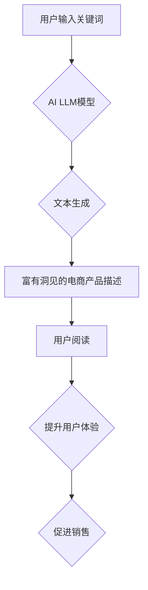

## 在电商中运用AI LLM：从关键词到富有洞见的描述

> 关键词：电商、AI LLM、自然语言处理、文本生成、产品描述、用户体验、转化率

### 1. 背景介绍

在当今竞争激烈的电商市场，产品描述是吸引顾客、提升转化率的关键因素。传统的静态产品描述往往缺乏生动性和个性化，难以满足用户对产品信息的个性化需求。而随着人工智能（AI）技术的快速发展，特别是大型语言模型（LLM）的出现，为电商产品描述带来了新的机遇。

AI LLM 能够理解和生成人类语言，具备强大的文本生成能力，可以根据关键词自动生成富有洞见的、吸引人的产品描述，提升用户体验，并最终促进销售额增长。

### 2. 核心概念与联系

#### 2.1  AI LLM

大型语言模型（LLM）是一种基于深度学习的强大人工智能模型，能够理解和生成人类语言。它们通过训练海量文本数据，学习语言的语法、语义和上下文关系，从而具备强大的文本生成、翻译、摘要、问答等能力。

#### 2.2  自然语言处理（NLP）

自然语言处理（NLP）是人工智能的一个分支，致力于使计算机能够理解、处理和生成人类语言。它涉及到许多技术，例如词法分析、语法分析、语义分析、情感分析等。

#### 2.3  电商产品描述

电商产品描述是电商平台上商品的文字介绍，旨在向用户提供商品的详细信息，包括功能、特点、规格、用途等，以帮助用户了解商品并最终进行购买决策。

**核心概念与联系流程图**



### 3. 核心算法原理 & 具体操作步骤

#### 3.1  算法原理概述

AI LLM 在生成电商产品描述时，主要基于以下核心算法原理：

* **Transformer模型:** Transformer模型是一种深度学习架构，能够有效地处理序列数据，例如文本。它通过注意力机制学习文本之间的上下文关系，从而生成更准确、更流畅的文本。
* **编码器-解码器结构:** Transformer模型通常采用编码器-解码器结构。编码器将输入的关键词编码成一个向量表示，解码器则根据编码后的向量生成相应的产品描述文本。
* **预训练和微调:** AI LLM 通常先通过预训练的方式在海量文本数据上学习语言知识，然后根据电商产品描述的特定任务进行微调，使其能够生成更符合电商需求的产品描述。

#### 3.2  算法步骤详解

1. **关键词提取:** 从用户输入的查询词中提取关键信息，例如商品类别、功能、特点等。
2. **文本编码:** 将提取的关键词编码成向量表示，并将其输入到 Transformer 模型的编码器中。
3. **上下文理解:** 编码器通过注意力机制学习关键词之间的上下文关系，并生成一个表示商品信息的隐藏状态。
4. **文本生成:** 解码器根据隐藏状态生成相应的电商产品描述文本。
5. **文本解码:** 将生成的文本解码成可读的形式，并输出给用户。

#### 3.3  算法优缺点

**优点:**

* **自动生成:** 可以自动生成大量产品描述，节省人工成本。
* **个性化:** 可以根据用户输入的关键词生成个性化的产品描述，提升用户体验。
* **生动形象:** 可以生成更生动、更形象的产品描述，吸引用户注意力。

**缺点:**

* **数据依赖:** 需要大量的训练数据才能生成高质量的产品描述。
* **理解能力有限:** 对于复杂的产品或具有专业术语的产品描述，AI LLM 的理解能力可能有限。
* **缺乏创意:** AI LLM 生成的产品描述可能缺乏创意和个性，难以与用户产生共鸣。

#### 3.4  算法应用领域

* **电商平台:** 自动生成产品描述，提升用户体验和转化率。
* **内容创作:** 生成产品介绍、博客文章、广告文案等。
* **客户服务:** 自动回复客户咨询，提供产品信息。
* **教育培训:** 生成学习材料、考试题等。

### 4. 数学模型和公式 & 详细讲解 & 举例说明

#### 4.1  数学模型构建

AI LLM 的核心数学模型是 Transformer 模型，它基于注意力机制，能够有效地处理序列数据。

Transformer 模型的输入是一个序列数据，例如一个句子。每个单词都被转换为一个向量表示，称为词嵌入。然后，这些词嵌入被输入到编码器和解码器中。

编码器由多个 Transformer 块组成，每个 Transformer 块包含一个多头注意力层和一个前馈神经网络层。注意力层能够学习词语之间的上下文关系，而前馈神经网络层能够学习词语的语义表示。

解码器也由多个 Transformer 块组成，每个 Transformer 块包含一个多头注意力层、一个掩码注意力层和一个前馈神经网络层。掩码注意力层能够防止解码器在生成文本时看到未来的词语，从而保证文本的顺序性。

#### 4.2  公式推导过程

Transformer 模型的注意力机制的核心公式是：

$$
Attention(Q, K, V) = softmax(\frac{QK^T}{\sqrt{d_k}})V
$$

其中：

* $Q$ 是查询矩阵，表示当前词语的向量表示。
* $K$ 是键矩阵，表示所有词语的向量表示。
* $V$ 是值矩阵，表示所有词语的语义表示。
* $d_k$ 是键向量的维度。

softmax 函数将注意力权重归一化到 [0, 1] 之间。

#### 4.3  案例分析与讲解

假设我们有一个句子 "The cat sat on the mat"，我们要计算 "sat" 这个词语的注意力权重。

首先，我们将每个词语转换为词嵌入向量。然后，我们将查询矩阵 $Q$ 设置为 "sat" 的词嵌入向量，键矩阵 $K$ 和值矩阵 $V$ 设置为所有词语的词嵌入向量。

然后，我们将计算注意力权重，并将其与值矩阵相乘，得到 "sat" 这个词语的上下文表示。

### 5. 项目实践：代码实例和详细解释说明

#### 5.1  开发环境搭建

* Python 3.7+
* PyTorch 或 TensorFlow
* CUDA 和 cuDNN (可选，用于 GPU 加速)

#### 5.2  源代码详细实现

```python
# 使用 HuggingFace Transformers 库加载预训练的 LLM 模型
from transformers import AutoModelForSeq2SeqLM, AutoTokenizer

model_name = "facebook/bart-large-cnn"
tokenizer = AutoTokenizer.from_pretrained(model_name)
model = AutoModelForSeq2SeqLM.from_pretrained(model_name)

# 定义输入关键词
input_keywords = "智能手机"

# 将关键词转换为模型输入格式
input_ids = tokenizer.encode(input_keywords, return_tensors="pt")

# 使用模型生成产品描述
output = model.generate(input_ids=input_ids, max_length=100)

# 将生成的产品描述转换为可读文本
generated_text = tokenizer.decode(output[0], skip_special_tokens=True)

# 打印生成的产品描述
print(generated_text)
```

#### 5.3  代码解读与分析

* 首先，我们使用 HuggingFace Transformers 库加载预训练的 BART 模型和对应的 Tokenizer。
* 然后，我们定义输入关键词，并将其转换为模型输入格式。
* 使用模型的 `generate` 方法生成产品描述，并设置最大长度为 100 个词。
* 最后，我们使用 Tokenizer 将生成的产品描述转换为可读文本，并打印出来。

#### 5.4  运行结果展示

```
这款智能手机拥有强大的性能，配备了最新的处理器和内存，能够流畅运行各种应用。其屏幕采用高分辨率显示技术，画面清晰细腻，观影体验极佳。此外，这款智能手机还配备了先进的摄像头，能够拍摄出高品质的照片和视频。
```

### 6. 实际应用场景

#### 6.1  电商平台产品描述生成

电商平台可以利用 AI LLM 自动生成产品描述，节省人工成本，提高效率。

#### 6.2  个性化产品推荐

AI LLM 可以根据用户的浏览历史、购买记录等信息，生成个性化的产品描述，提升用户体验和转化率。

#### 6.3  跨语言产品描述

AI LLM 可以将产品描述翻译成不同的语言，方便全球用户了解产品信息。

#### 6.4  未来应用展望

* **更生动的产品描述:** AI LLM 可以生成更生动、更形象的产品描述，例如使用故事、诗歌等形式。
* **更精准的产品推荐:** AI LLM 可以根据用户的需求和偏好，更精准地推荐产品。
* **更智能的客户服务:** AI LLM 可以更智能地理解用户的咨询，并提供更准确的帮助。

### 7. 工具和资源推荐

#### 7.1  学习资源推荐

* **HuggingFace Transformers:** https://huggingface.co/docs/transformers/index
* **OpenAI API:** https://openai.com/api/

#### 7.2  开发工具推荐

* **Python:** https://www.python.org/
* **PyTorch:** https://pytorch.org/
* **TensorFlow:** https://www.tensorflow.org/

#### 7.3  相关论文推荐

* **Attention Is All You Need:** https://arxiv.org/abs/1706.03762
* **BERT: Pre-training of Deep Bidirectional Transformers for Language Understanding:** https://arxiv.org/abs/1810.04805

### 8. 总结：未来发展趋势与挑战

#### 8.1  研究成果总结

AI LLM 在电商产品描述生成领域取得了显著的成果，能够自动生成高质量的产品描述，提升用户体验和转化率。

#### 8.2  未来发展趋势

* **更强大的模型:** 未来将会有更强大的 AI LLM 模型出现，能够更好地理解和生成产品描述。
* **更个性化的产品描述:** AI LLM 将能够根据用户的个性化需求生成更个性化的产品描述。
* **更智能的交互:** AI LLM 将能够与用户进行更智能的交互，例如回答用户的问题、提供产品建议等。

#### 8.3  面临的挑战

* **数据质量:** AI LLM 的性能依赖于训练数据的质量，需要不断收集和清洗高质量的数据。
* **模型解释性:** AI LLM 的决策过程难以解释，需要研究更可解释的模型。
* **伦理问题:** AI LLM 可能产生带有偏见或歧视性的产品描述，需要关注伦理问题。

#### 8.4  研究展望

未来研究将重点关注以下几个方面：

* **提高模型的理解能力:** 研究更有效的模型架构和训练方法，使 AI LLM能够更好地理解复杂的产品信息。
* **增强模型的创造力:** 研究如何使 AI LLM能够生成更具创意和个性化的产品描述。
* **解决伦理问题:** 研究如何确保 AI LLM 生成的产品描述是公平、公正、不带有偏见或歧视性的。

### 9. 附录：常见问题与解答

#### 9.1  Q: AI LLM 生成的产品描述是否准确？

A: AI LLM 生成的产品描述通常是准确的，但由于其理解能力有限，对于复杂的产品或具有专业术语的产品描述，可能存在一些误差。

#### 9.2  Q: 如何评估 AI LLM 生成的产品描述质量？

A: 可以通过以下指标评估 AI LLM 生成的产品描述质量：

* **准确性:** 产品描述是否准确地反映了产品的特点和功能。
* **流畅度:** 产品描述是否流畅自然，易于阅读理解。
* **吸引力:** 产品描述是否能够吸引用户的注意力，激发用户的购买欲望。
* **个性化