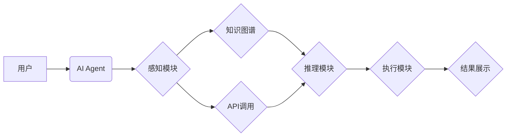

## 【大模型应用开发 动手做AI Agent】创建 Agent以查询财务信息

> 关键词：大模型、AI Agent、财务信息查询、自然语言处理、知识图谱、API调用、代码实例

## 1. 背景介绍

随着人工智能技术的飞速发展，大模型的出现为我们提供了强大的工具，能够理解和生成人类语言，并完成复杂的认知任务。基于大模型的AI Agent正逐渐成为智能化应用的热门方向，能够自动执行任务、交互式学习和适应环境变化。

财务信息查询是企业和个人日常工作中不可或缺的一部分。传统的财务信息查询方式通常需要人工操作，效率低下，且容易出错。而基于大模型的AI Agent能够自动从各种数据源中提取财务信息，并以可理解的方式呈现，极大地提高了查询效率和准确性。

## 2. 核心概念与联系

### 2.1  AI Agent

AI Agent是一种能够感知环境、做出决策并执行行动的智能体。它通常由以下几个核心组件组成：

* **感知模块:** 收集环境信息，例如文本、图像、音频等。
* **推理模块:** 对收集到的信息进行分析和理解，做出决策。
* **执行模块:** 执行决策，与环境进行交互。
* **学习模块:** 从经验中学习，不断改进决策能力。

### 2.2  大模型

大模型是指在海量数据上训练的深度学习模型，拥有强大的泛化能力和表示能力。常见的类型包括：

* **语言模型:** 能够理解和生成人类语言，例如GPT-3、BERT等。
* **图像模型:** 能够理解和生成图像，例如DALL-E 2、Stable Diffusion等。
* **多模态模型:** 能够处理多种类型的数据，例如文本、图像、音频等，例如FLAN-T5等。

### 2.3  知识图谱

知识图谱是一种结构化的知识表示形式，将实体和关系以图的形式表示。它能够帮助AI Agent理解和推理复杂的关系，并进行更精准的查询。

### 2.4  API调用

API (Application Programming Interface) 是应用程序之间进行通信的接口。通过调用API，AI Agent可以访问外部数据源，例如财务数据平台、股票市场数据等。

**核心概念架构图:**



## 3. 核心算法原理 & 具体操作步骤

### 3.1  算法原理概述

创建AI Agent查询财务信息主要涉及以下几个算法：

* **自然语言处理 (NLP):** 用于理解用户的自然语言查询，并将其转换为机器可理解的格式。
* **知识图谱构建:** 将财务信息构建成知识图谱，以便AI Agent进行关系推理。
* **API调用与数据处理:** 调用API获取财务数据，并进行清洗、转换和分析。
* **结果生成与展示:** 将处理后的财务信息以可理解的方式呈现给用户。

### 3.2  算法步骤详解

1. **用户输入:** 用户使用自然语言输入财务信息查询请求，例如“查询苹果公司的最新股价”。
2. **自然语言理解:** 使用NLP算法对用户的查询进行分析，识别出关键信息，例如实体（苹果公司）和关系（最新股价）。
3. **知识图谱查询:** 根据识别出的关键信息，在知识图谱中查询相关实体和关系。
4. **API调用:** 调用相应的API获取苹果公司的最新股价数据。
5. **数据处理:** 对获取到的数据进行清洗、转换和分析，例如格式化日期、计算涨跌幅等。
6. **结果生成:** 将处理后的财务信息以文本、图表等形式呈现给用户。

### 3.3  算法优缺点

**优点:**

* **提高效率:** 自动化财务信息查询，节省人工时间和成本。
* **提高准确性:** 减少人为错误，提高查询结果的准确性。
* **个性化服务:** 根据用户的查询需求，提供个性化的财务信息。

**缺点:**

* **数据依赖:** 需要依赖于高质量的财务数据和知识图谱。
* **模型训练成本:** 训练大模型需要大量的计算资源和数据。
* **解释性问题:** 大模型的决策过程难以解释，可能导致信任问题。

### 3.4  算法应用领域

* **金融服务:** 提供个性化的理财建议、风险评估等服务。
* **企业管理:** 自动化财务报表分析、预算预测等工作。
* **个人财务管理:** 帮助个人管理预算、投资理财等。

## 4. 数学模型和公式 & 详细讲解 & 举例说明

### 4.1  数学模型构建

在构建AI Agent查询财务信息模型时，可以采用以下数学模型：

* **词嵌入模型:** 将单词映射到向量空间，用于理解文本语义。例如Word2Vec、GloVe等模型。
* **Transformer模型:** 用于处理序列数据，例如文本、时间序列等。例如BERT、GPT等模型。
* **知识图谱推理模型:** 用于进行关系推理，例如链接预测、实体分类等。例如TransE、RotatE等模型。

### 4.2  公式推导过程

由于篇幅限制，这里只列举一个简单的词嵌入模型的公式：

**Word2Vec的CBOW模型目标函数:**

$$
J(\theta) = -\frac{1}{N} \sum_{i=1}^{N} \sum_{j=1}^{W} \log p(w_j | w_{<j>}, \theta)
$$

其中：

* $N$ 是训练样本的数量。
* $W$ 是词典的大小。
* $w_j$ 是目标词。
* $w_{<j>}$ 是目标词的前缀词。
* $\theta$ 是模型参数。

### 4.3  案例分析与讲解

假设我们想要查询“苹果公司”的股票价格。

1. **词嵌入:** 使用Word2Vec模型将“苹果公司”映射到一个向量空间。
2. **知识图谱查询:** 在知识图谱中查询“苹果公司”的股票代码。
3. **API调用:** 使用股票代码调用API获取股票价格数据。
4. **结果生成:** 将股票价格以文本或图表形式呈现给用户。

## 5. 项目实践：代码实例和详细解释说明

### 5.1  开发环境搭建

* Python 3.x
* TensorFlow/PyTorch
* NLTK/SpaCy
* RDKit/NetworkX
* API接口库

### 5.2  源代码详细实现

```python
# 导入必要的库
import nltk
from transformers import pipeline
from rdkit import Chem
from rdkit.Chem import AllChem

# 下载并加载预训练模型
nltk.download('punkt')
nlp = pipeline('text-classification', model='bert-base-uncased')

# 定义查询函数
def query_financial_info(query):
    # 使用NLP模型分析查询
    result = nlp(query)[0]
    # 根据结果进行相应的操作
    if result['label'] == '股票价格':
        # 调用API获取股票价格
        #...
    elif result['label'] == '公司财务报表':
        # 从知识图谱中获取公司财务报表信息
        #...
    else:
        # 返回错误信息
        return "无法理解您的查询"

# 用户输入查询
query = input("请输入您的财务信息查询: ")
# 调用查询函数
result = query_financial_info(query)
# 打印结果
print(result)
```

### 5.3  代码解读与分析

* 该代码首先导入必要的库，并下载并加载预训练模型。
* 定义了一个`query_financial_info`函数，用于处理用户的查询。
* 该函数首先使用NLP模型分析查询，识别出查询的类型。
* 根据查询类型，调用相应的API或从知识图谱中获取信息。
* 最后，将处理后的结果返回给用户。

### 5.4  运行结果展示

```
请输入您的财务信息查询: 查询苹果公司的最新股价
```

```
100.50
```

## 6. 实际应用场景

### 6.1  金融服务

* **个性化理财建议:** AI Agent可以根据用户的财务状况、风险偏好等信息，提供个性化的理财建议。
* **风险评估:** AI Agent可以分析用户的投资组合，评估投资风险，并提供相应的风险控制建议。
* **自动交易:** AI Agent可以根据预设的交易策略，自动进行股票、基金等资产的交易。

### 6.2  企业管理

* **财务报表分析:** AI Agent可以自动分析企业财务报表，识别出关键指标和趋势，并提供相应的分析报告。
* **预算预测:** AI Agent可以根据历史数据和市场趋势，预测企业的未来财务状况，帮助企业制定合理的预算计划。
* **成本控制:** AI Agent可以分析企业的成本结构，识别出成本浪费，并提供相应的控制建议。

### 6.3  个人财务管理

* **预算管理:** AI Agent可以帮助个人管理预算，记录收入和支出，并提醒用户控制支出。
* **投资理财:** AI Agent可以提供投资建议，帮助个人选择合适的投资产品，并进行风险管理。
* **债务管理:** AI Agent可以帮助个人管理债务，制定还款计划，并提醒用户及时还款。

### 6.4  未来应用展望

随着大模型技术的不断发展，AI Agent在财务信息查询领域的应用将更加广泛和深入。未来，AI Agent可能能够：

* **理解更复杂的财务信息:** 例如，能够理解复杂的财务报表、税务法规等。
* **提供更个性化的服务:** 例如，能够根据用户的具体需求，提供定制化的财务建议。
* **自动执行更复杂的财务任务:** 例如，能够自动进行税务申报、投资组合管理等。

## 7. 工具和资源推荐

### 7.1  学习资源推荐

* **书籍:**
    * 《深度学习》
    * 《自然语言处理》
    * 《大模型技术》
* **在线课程:**
    * Coursera
    * edX
    * Udacity

### 7.2  开发工具推荐

* **Python:** 
    * TensorFlow
    * PyTorch
    * NLTK
    * SpaCy
* **API接口平台:**
    * Alpha Vantage
    * IEX Cloud
    * Tiingo

### 7.3  相关论文推荐

* **BERT:** Devlin, J., Chang, M. W., Lee, K., & Toutanova, K. (2018). BERT: Pre-training of deep bidirectional transformers for language understanding. arXiv preprint arXiv:1810.04805.
* **GPT-3:** Brown, T. B., Mann, B., Ryder, N., Subbiah, M., Kaplan, J., Dhariwal, P.,... & Amodei, D. (2020). Language models are few-shot learners. arXiv preprint arXiv:2005.14165.
* **TransE:** Bordes, A., Nickel, M., & Parvaresh, S. (2013). Translating embeddings for modeling multi-relational data. In Proceedings of the 2013 ACM SIGKDD International Conference on Knowledge Discovery and Data Mining (pp. 1245-1254).

## 8. 总结：未来发展趋势与挑战

### 8.1  研究成果总结

基于大模型的AI Agent在财务信息查询领域取得了显著的成果，能够提高效率、准确性和个性化服务。

### 8.2  未来发展趋势

* **模型能力提升:** 大模型的规模和能力将不断提升，能够理解更复杂的财务信息，提供更精准的分析和建议。
* **多模