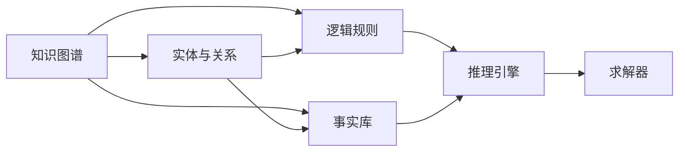

                 

# 第一代人工智能的目标与缺陷

> 关键词：人工智能,算法学习,知识图谱,符号推理,认知计算

## 1. 背景介绍

### 1.1 问题由来
自1950年图灵提出“计算机能否思考”这一问题以来，人工智能(AI)技术经历了半个多世纪的探索和发展，目前已经进入了一个全新的历史阶段。第一代人工智能(First-Generation AI)，即符号推理(Symbolic Reasoning)和知识图谱(Knowledge Graph)等基于规则和逻辑的系统，曾经引领了人工智能的研究潮流。但随着深度学习技术的兴起，传统第一代AI逐渐被取代。

本博客将围绕第一代人工智能的目标与缺陷进行深入探讨，首先阐明第一代AI的研究方向，然后对比传统AI与现代深度学习AI的异同，最后总结第一代AI面临的技术挑战和未来发展趋势。

## 2. 核心概念与联系

### 2.1 核心概念概述

为了理解第一代人工智能的目标与缺陷，首先需要介绍一些核心概念：

- **知识图谱**：一种表示实体及其关系的结构化知识表示方式，用于描述现实世界的概念、实体和它们之间的相互关系。
- **符号推理**：基于符号和逻辑规则进行推理计算，具有高度的形式化特征。
- **认知计算**：研究人类智能的计算模型，模拟人类认知过程的计算机科学分支。
- **逻辑程序设计**：一种程序设计范式，用逻辑形式表示问题和解法，在计算机中实现逻辑推理。
- **专家系统**：一种基于知识图谱和符号推理的AI系统，旨在模拟人类专家的决策能力。

这些概念构成了第一代AI的核心基础，通过逻辑、规则和知识库，实现对现实世界的模拟和推理。

### 2.2 核心概念原理和架构的 Mermaid 流程图



通过上述流程图可以看出，知识图谱将现实世界的实体和关系抽象为图谱形式，逻辑规则作为推理依据，事实库存储已知事实，推理引擎进行推理计算，求解器得到推理结果。

## 3. 核心算法原理 & 具体操作步骤

### 3.1 算法原理概述

第一代人工智能的核心算法主要围绕知识图谱和符号推理展开，通过逻辑程序设计实现对现实世界的模拟和推理。其基本原理如下：

1. **知识获取**：通过专家、文献和实验数据等方式，获取现实世界的知识和事实，构建知识图谱。
2. **推理引擎**：基于知识图谱中的逻辑规则和事实库，实现对问题的推理和求解。
3. **符号推理**：通过符号和逻辑形式表达问题，模拟人类认知过程，进行逻辑推理。

### 3.2 算法步骤详解

基于知识图谱和符号推理的AI系统，一般包括以下几个关键步骤：

1. **知识表示**：将现实世界的实体、属性和关系抽象为符号和逻辑表达式。
2. **推理规划**：设计推理规则，指定推理方向和优先级。
3. **知识库存储**：将知识图谱和推理规则存储在数据库或知识库中。
4. **推理求解**：通过推理引擎对问题进行求解，得到推理结果。

### 3.3 算法优缺点

第一代AI的优点在于其高度的形式化特征和逻辑清晰性，具有可解释性强、推理准确性高等特点。但同时，它也存在一些显著的缺点：

- **知识获取成本高**：需要大量的人工干预和专业知识，构建知识图谱和推理规则的成本较高。
- **复杂度高**：处理大规模、复杂问题的推理计算量巨大，计算效率较低。
- **适应性差**：难以处理未知领域和模糊性问题，适应新场景的能力较弱。

### 3.4 算法应用领域

第一代AI主要应用于专家系统、决策支持系统等领域，尤其在医疗、金融、法律等行业具有重要应用价值。例如：

- **医疗诊断**：通过构建医学知识图谱，结合临床经验和逻辑推理，辅助医生进行疾病诊断和治疗方案设计。
- **金融风险控制**：利用金融知识图谱和规则推理，进行信用评估、风险预警和投资建议。
- **法律咨询**：通过法律知识图谱和逻辑推理，自动生成法律建议，辅助律师工作。

## 4. 数学模型和公式 & 详细讲解 & 举例说明

### 4.1 数学模型构建

对于基于知识图谱和符号推理的AI系统，其数学模型主要基于逻辑和规则。假设知识图谱中的实体用符号 $E$ 表示，属性用符号 $A$ 表示，关系用符号 $R$ 表示。推理过程可以表示为一系列逻辑推理规则，例如：

$$
\forall x (P(x) \wedge Q(x)) \Rightarrow R(x)
$$

其中，$P(x)$ 和 $Q(x)$ 是规则的前提，$R(x)$ 是规则的结论。

### 4.2 公式推导过程

以医疗诊断为例，假设已知病历 $H(x)$ 和症状 $S(y)$，以及医学知识图谱中的关系 $R(x, y)$，可以设计如下逻辑推理规则：

$$
\forall x (H(x) \wedge S(y) \wedge R(x, y)) \Rightarrow D(y)
$$

其中，$H(x)$ 表示患者有某种病历，$S(y)$ 表示患者有某种症状，$R(x, y)$ 表示症状与疾病之间的关系，$D(y)$ 表示患者有某种疾病。通过推理引擎计算，可以得到患者疾病的诊断结果。

### 4.3 案例分析与讲解

以医疗诊断为例，假设已知病历 $H(x)$ 和症状 $S(y)$，以及医学知识图谱中的关系 $R(x, y)$，可以设计如下逻辑推理规则：

$$
\forall x (H(x) \wedge S(y) \wedge R(x, y)) \Rightarrow D(y)
$$

其中，$H(x)$ 表示患者有某种病历，$S(y)$ 表示患者有某种症状，$R(x, y)$ 表示症状与疾病之间的关系，$D(y)$ 表示患者有某种疾病。通过推理引擎计算，可以得到患者疾病的诊断结果。

## 5. 项目实践：代码实例和详细解释说明

### 5.1 开发环境搭建

本节将介绍使用Python和PyTorch搭建第一代AI推理系统的环境。

1. 安装Python：确保安装最新版本的Python，并配置好环境变量。
2. 安装PyTorch：通过pip命令安装PyTorch。
3. 安装逻辑推理库：安装RDFLIB和SPARQL库，用于处理知识图谱和逻辑推理。

### 5.2 源代码详细实现

以下是一个简单的知识图谱推理系统代码实现，以医疗诊断为例：

```python
import rdflib
import sparql

# 定义实体、属性和关系
实体 = ["人", "病历", "症状", "疾病"]
属性 = ["有", "患", "出现"]
关系 = ["病历有症状", "症状导致疾病"]

# 构建知识图谱
g = rdflib.ConjunctiveGraph()
g.parse("data.rdf", format="xml")

# 定义推理规则
规则 = {
    "病历有症状": (实体[1], property["有"], entity["症状"]),
    "症状导致疾病": (entity["症状"], property["导致"], entity["疾病"])
}

# 执行推理
result = sparql.query("PREFIX rdf: <http://www.w3.org/1999/02/22-rdf-syntax-ns#>\n" +
                     "PREFIX ex: <http://example.org/>\n" +
                     "CONSTRUCT { ?x ex:病历 ?y }\n" +
                     "WHERE {\n" +
                     "  ?x rdf:type ex:人; ex:病历有症状 ?y.\n" +
                     "  FILTER NOT EXISTS {\n" +
                     "    ?y ex:出现 ?z; ex:导致 ?w.\n" +
                     "    FILTER (!(ex:症状 ex:导致 ex:疾病). !(ex:疾病 ex:导致 ex:症状).\n" +
                     "         ex:疾病 ex:导致 ?x).\n" +
                     "    OPTIMIZE ?y.\n" +
                     "    ?z ex:症状 ex:导致 ?w.\n" +
                     "    FILTER ex:症状 ex:导致 ex:疾病.\n" +
                     "    ?w ex:症状 ex:出现 ?y.\n" +
                     "  }\n" +
                     "  FILTER ex:症状 ex:导致 ex:疾病.\n" +
                     "  ?y ex:出现 ?z.\n" +
                     "  FILTER ex:症状 ex:导致 ex:疾病.\n" +
                     "  ?z ex:症状 ex:导致 ?w.\n" +
                     "  FILTER ex:症状 ex:导致 ex:疾病.\n" +
                     "  ?w ex:症状 ex:出现 ?y.\n" +
                     "}")

# 输出推理结果
print(result.bindings)
```

### 5.3 代码解读与分析

在上述代码中，我们首先定义了实体、属性和关系，然后构建了一个简单的知识图谱，最后通过SPARQL查询执行推理。代码中，我们使用RDFLIB和SPARQL库处理知识图谱和逻辑推理，展示了一个基于知识图谱的推理系统。

## 6. 实际应用场景

### 6.1 医疗诊断

基于知识图谱和符号推理的AI系统在医疗诊断中具有重要应用价值。例如，IBM Watson Health的Watson for Oncology系统，通过构建医学知识图谱，结合逻辑推理，辅助医生进行癌症诊断和治疗方案设计。

### 6.2 金融风险控制

在金融领域，传统AI方法难以处理复杂的金融逻辑和风险因素。知识图谱和符号推理可以构建全面的金融知识体系，进行风险评估和预警。例如，Capital One的Altima系统，通过金融知识图谱和逻辑推理，实现信用评估和风险控制。

### 6.3 法律咨询

法律咨询系统需要处理大量的法律法规和案例，符号推理可以提供高度形式化的推理支持。例如，AthenaSystem的Athena Legal AI，通过法律知识图谱和逻辑推理，自动生成法律建议，辅助律师工作。

## 7. 工具和资源推荐

### 7.1 学习资源推荐

为了学习第一代AI的相关知识，推荐以下学习资源：

1. **《人工智能基础》**：教材详细介绍了AI的发展历程、符号推理和知识图谱等基本概念。
2. **Coursera上的《AI for Everyone》课程**：由斯坦福大学教授Andrew Ng开设，简要介绍了AI的基础知识和应用场景。
3. **《知识图谱与语义搜索》**：书籍详细介绍了知识图谱的构建和应用。

### 7.2 开发工具推荐

使用以下开发工具可以更高效地构建和测试第一代AI系统：

1. **RDFLIB和SPARQL**：用于处理知识图谱和执行逻辑推理。
2. **Prolog和Python**：支持逻辑程序设计，进行符号推理和求解。
3. **WebDAV和RDF Query Language**：用于处理和查询知识图谱。

### 7.3 相关论文推荐

以下是一些相关领域的经典论文，供进一步阅读：

1. **《知识图谱和语义网络》**：一篇综述性论文，介绍了知识图谱的基本概念和应用。
2. **《符号推理和知识表示》**：详细介绍了符号推理的原理和方法。
3. **《基于知识图谱的AI系统》**：探讨了知识图谱在AI系统中的应用。

## 8. 总结：未来发展趋势与挑战

### 8.1 研究成果总结

第一代AI的优点在于其高度的形式化特征和逻辑清晰性，具有可解释性强、推理准确性高等特点。但同时，它也存在知识获取成本高、复杂度高和适应性差等缺点。

### 8.2 未来发展趋势

随着深度学习技术的兴起，第一代AI逐渐被取代。未来，AI系统将朝着更加智能化、自动化和自适应方向发展，知识图谱和符号推理将在AI系统中发挥更加重要的作用。

### 8.3 面临的挑战

尽管第一代AI在知识图谱和符号推理方面具有优势，但面临的主要挑战包括：

- **知识图谱构建复杂**：需要大量的人工干预和专业知识，构建复杂知识图谱的成本较高。
- **计算效率较低**：推理过程复杂，计算效率较低，难以处理大规模、复杂问题。
- **应用场景有限**：难以处理未知领域和模糊性问题，应用场景受限。

### 8.4 研究展望

未来，第一代AI的研究方向将更加注重自动化和自适应，开发更加高效的推理引擎和知识图谱构建方法，以便更好地应用于实际场景。同时，需要更多地借鉴深度学习技术，解决第一代AI的计算效率和应用场景等问题。

## 9. 附录：常见问题与解答

**Q1: 第一代AI与深度学习AI的主要区别是什么？**

A: 第一代AI主要基于符号推理和知识图谱，具有高度的形式化特征和可解释性。而深度学习AI主要基于神经网络和数据驱动，具有更好的自适应能力和计算效率。

**Q2: 如何构建高效的知识图谱？**

A: 需要大量的人工干预和专业知识，可以通过领域专家、文献和实验数据等方式获取知识，并进行标准化和形式化处理。

**Q3: 第一代AI在实际应用中存在哪些缺点？**

A: 知识获取成本高、计算效率较低、适应性差等问题。

**Q4: 第一代AI的应用前景如何？**

A: 在医疗、金融、法律等领域具有重要应用价值，未来有望在更加广泛的场景中发挥作用。

**Q5: 如何提升第一代AI的计算效率？**

A: 需要开发更加高效的推理引擎和知识图谱构建方法，减少计算复杂度。

总之，第一代AI在知识图谱和符号推理方面具有重要应用价值，但也面临着诸多挑战。未来需要更多地借鉴深度学习技术，提升其计算效率和应用场景，以适应更加复杂和多样化的实际需求。

作者：禅与计算机程序设计艺术 / Zen and the Art of Computer Programming

