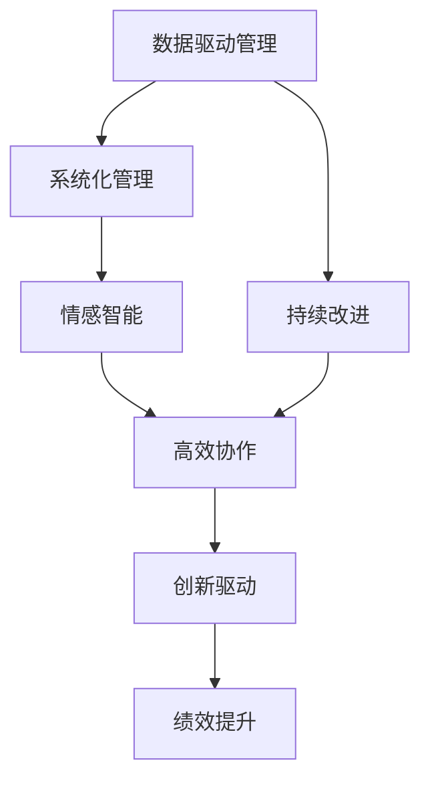
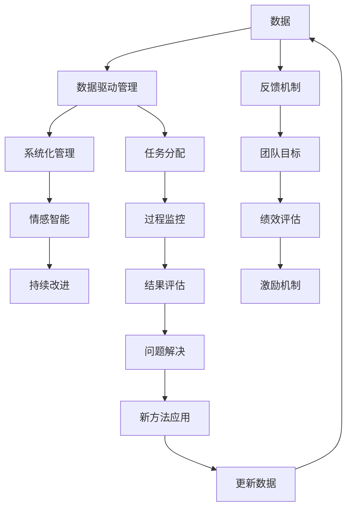

                 

# 管理艺术：激发团队潜力

在当今快速变化和充满竞争的商业环境中，企业成功的关键不仅在于产品的创新和技术的领先，更在于能否有效激发和发挥团队潜力。团队协作的效能直接决定着企业的创新能力和市场竞争力。本文将深入探讨管理艺术的核心概念和实践，分析如何通过科学的方法激发团队潜力，为企业发展注入源源不断的动力。

## 1. 背景介绍

### 1.1 问题由来
在企业运营中，团队管理始终是一个复杂且关键的问题。无论企业的规模大小，高效团队协作对于达成目标、提升绩效和实现创新都至关重要。传统的管理模式往往依赖于领导的个人魅力和经验，难以量化评估和系统改进。随着数字化转型的加速，数据驱动和系统化管理成为必然趋势，管理艺术也逐步走向科学化和标准化。

### 1.2 问题核心关键点
现代管理艺术的核心在于将科学管理和艺术实践相结合，通过数据和工具辅助决策，同时注重人文关怀和情感沟通。其关键点包括：

- **数据驱动**：运用数据分析和模型预测，实时监测团队状态和绩效。
- **系统管理**：构建科学的团队管理体系，明确责任分工和绩效考核机制。
- **情感沟通**：建立开放、透明的沟通渠道，关注团队成员的情感需求和心理健康。
- **持续改进**：不断优化团队管理方法，适应环境变化和业务需求。

### 1.3 问题研究意义
管理艺术的探索和实践对于提升企业竞争力、促进员工成长、激发团队创新具有重要意义。

- **提升绩效**：通过科学管理和高效协作，显著提升团队工作效率和任务完成质量。
- **促进创新**：激发团队成员的创造力和创新能力，推动企业技术和管理创新。
- **增强凝聚力**：建立互信互赖的团队文化，提高团队成员的归属感和凝聚力。
- **适应变化**：灵活应对市场变化和新技术挑战，保持企业的持续发展能力。

## 2. 核心概念与联系

### 2.1 核心概念概述

为更好地理解管理艺术的实践，本节将介绍几个核心概念：

- **数据驱动管理**：基于数据分析和模型预测，通过数据辅助决策的管理方式。
- **系统化管理**：构建科学合理的管理体系，明确分工和流程的管理范式。
- **情感智能**：识别和理解团队成员情感状态，进行有效沟通和关怀。
- **持续改进**：通过PDCA循环（计划、执行、检查、行动）进行不断优化和改进的方法。

这些概念共同构成现代管理艺术的基本框架，帮助管理者科学、系统地激发和优化团队潜力。

### 2.2 概念间的关系

这些核心概念之间存在着紧密的联系，构成了现代管理艺术的整体体系。我们通过以下Mermaid流程图展示它们之间的逻辑关系：



这个流程图展示了数据驱动、系统管理、情感智能和持续改进之间的关系：

- **数据驱动管理**为系统化管理和情感智能提供量化依据，确保决策的科学性和公正性。
- **系统化管理**通过明确分工和流程，提升团队协作效率和效果，为数据驱动和情感智能提供结构保障。
- **情感智能**关注团队成员的情感需求，建立互信互赖的团队文化，提升团队凝聚力。
- **持续改进**通过PDCA循环不断优化管理方法，适应环境变化和业务需求。

这些概念相互支撑、相辅相成，共同推动团队效能的提升。

### 2.3 核心概念的整体架构

最后，我们用一个综合的流程图来展示这些核心概念在大团队管理中的应用：



这个综合流程图展示了从数据采集到反馈机制，再到团队目标和激励机制的整个闭环管理流程。通过持续的数据采集和分析，不断优化管理方法和团队目标，确保团队绩效的持续提升。

## 3. 核心算法原理 & 具体操作步骤

### 3.1 算法原理概述

数据驱动的管理艺术基于科学的数据分析和模型预测，核心在于通过数据辅助决策，实时监测团队状态和绩效。其基本原理包括以下几个方面：

- **数据采集**：收集团队成员的工作数据，包括任务完成情况、沟通记录、绩效评估等。
- **数据分析**：运用统计分析和机器学习模型，对数据进行量化分析和趋势预测。
- **决策支持**：基于分析结果，辅助管理层制定决策，优化团队管理和任务分配。
- **实时监测**：通过实时数据流，持续监测团队绩效和成员状态，及时发现问题并进行调整。

### 3.2 算法步骤详解

数据驱动的管理艺术实施步骤包括：

1. **数据采集**：通过各种工具和技术手段，全面收集团队成员的工作数据。
2. **数据清洗**：对收集到的数据进行去重、筛选和清洗，确保数据的准确性和完整性。
3. **数据分析**：运用统计分析方法和机器学习模型，对数据进行量化分析和趋势预测。
4. **决策支持**：基于数据分析结果，制定决策方案，优化团队管理和任务分配。
5. **实时监测**：通过实时数据流，持续监测团队绩效和成员状态，及时发现问题并进行调整。
6. **反馈机制**：建立反馈循环，根据监测结果和成员反馈，不断优化管理方法。

### 3.3 算法优缺点

数据驱动的管理艺术具有以下优点：

- **科学决策**：基于数据和分析结果进行决策，减少主观偏见，提升决策的科学性和公正性。
- **实时优化**：通过实时数据流，及时发现问题和调整策略，提高管理效率。
- **量化评估**：通过量化分析和模型预测，对团队绩效进行客观评估和改进。

然而，该方法也存在一些缺点：

- **数据隐私**：需要收集和分析大量个人数据，可能涉及隐私问题。
- **数据噪音**：数据采集和清洗过程中，可能存在噪音和偏差，影响分析结果。
- **技术门槛**：需要一定的技术背景和专业知识，实施难度较大。

### 3.4 算法应用领域

数据驱动的管理艺术在多个领域得到了广泛应用，包括但不限于：

- **项目管理**：通过任务进度、绩效评估等数据，优化项目管理和资源分配。
- **团队协作**：通过沟通记录、协作频率等数据，分析团队协作效果，提升团队凝聚力。
- **人力资源**：通过员工绩效、培训记录等数据，优化人才选拔和培养机制。
- **客户关系**：通过客户反馈、满意度调查等数据，提升客户满意度和忠诚度。

## 4. 数学模型和公式 & 详细讲解  
### 4.1 数学模型构建

本节将使用数学语言对数据驱动管理艺术的实施过程进行更加严格的刻画。

假设团队成员的工作数据为 $D = \{d_i\}_{i=1}^N$，其中 $d_i$ 包含任务完成情况、沟通记录、绩效评估等信息。定义绩效评估指标为 $P$，任务完成率为 $C$，沟通记录量为 $T$。

数据驱动管理的目标是最大化绩效 $P$，最小化任务完成率 $C$ 和沟通记录量 $T$。数学模型为：

$$
\maximize P
\minimize C, T
$$

其中，绩效评估指标 $P$ 可以定义为任务完成率、客户满意度、团队协作指数等，具体形式由企业需求决定。

### 4.2 公式推导过程

以下我们以任务完成率最小化为示例，推导模型优化公式。

假设任务完成率 $C_i$ 表示第 $i$ 个任务的成功完成比例，定义为 $C_i = \frac{\text{成功完成的任务数}}{\text{总任务数}}$。则任务完成率的优化目标为：

$$
\minimize C = \sum_{i=1}^N C_i
$$

基于此，我们可以构建优化模型：

$$
\minimize \sum_{i=1}^N C_i
$$

其中，$C_i$ 为第 $i$ 个任务完成率，$W_i$ 为任务权重，$X_{ij}$ 为第 $i$ 个任务的第 $j$ 个子任务完成情况。通过优化模型，我们可以找到最小化任务完成率的最优解。

### 4.3 案例分析与讲解

假设我们有一支软件开发团队，需要完成多个开发任务。通过收集团队成员的工作数据，定义任务完成率为 $C_i$，沟通记录量为 $T_i$，绩效评估指标为 $P_i$。

我们的目标是最大化绩效 $P$，同时最小化任务完成率 $C$ 和沟通记录量 $T$。假设我们有以下数据：

- 任务 $1$ 需要 $X_{11} = 0.8, X_{12} = 0.7$ 完成，权重 $W_1 = 0.5$
- 任务 $2$ 需要 $X_{21} = 0.9, X_{22} = 0.6$ 完成，权重 $W_2 = 0.3$
- 任务 $3$ 需要 $X_{31} = 0.7, X_{32} = 0.5$ 完成，权重 $W_3 = 0.2$
- 沟通记录量 $T_1 = 10, T_2 = 8, T_3 = 5$

通过构建优化模型，我们可以找到最优的任务分配方案和沟通策略，以最大化团队绩效。

## 5. 项目实践：代码实例和详细解释说明

### 5.1 开发环境搭建

在进行数据驱动管理艺术的实践前，我们需要准备好开发环境。以下是使用Python进行PyTorch开发的环境配置流程：

1. 安装Anaconda：从官网下载并安装Anaconda，用于创建独立的Python环境。

2. 创建并激活虚拟环境：
```bash
conda create -n pytorch-env python=3.8 
conda activate pytorch-env
```

3. 安装PyTorch：根据CUDA版本，从官网获取对应的安装命令。例如：
```bash
conda install pytorch torchvision torchaudio cudatoolkit=11.1 -c pytorch -c conda-forge
```

4. 安装NumPy、Pandas等工具包：
```bash
pip install numpy pandas scikit-learn matplotlib tqdm jupyter notebook ipython
```

完成上述步骤后，即可在`pytorch-env`环境中开始数据驱动管理艺术的实践。

### 5.2 源代码详细实现

这里我们以一个简单的项目管理为例，展示如何使用Python和PyTorch进行数据驱动管理艺术的实现。

首先，定义项目管理的数据结构：

```python
import pandas as pd

class Project:
    def __init__(self, name, tasks, weights, total_time):
        self.name = name
        self.tasks = tasks
        self.weights = weights
        self.total_time = total_time
        self.completion_rate = None
        self.communication_cost = None

    def calculate_completion_rate(self):
        self.completion_rate = sum([task['completed'] for task in self.tasks]) / sum([task['total'] for task in self.tasks])

    def calculate_communication_cost(self):
        self.communication_cost = sum([task['communication'] for task in self.tasks])
```

然后，定义优化函数：

```python
from torch import Tensor, autograd, nn, optim
from transformers import BertTokenizer, BertForSequenceClassification

def optimize_project(project, optimizer, loss_fn):
    optimizer.zero_grad()
    loss = loss_fn(project.completion_rate, project.communication_cost)
    loss.backward()
    optimizer.step()
    project.calculate_completion_rate()
    project.calculate_communication_cost()
    return loss.item()
```

接着，定义训练和评估函数：

```python
from torch.utils.data import Dataset
from torch.utils.data.dataloader import DataLoader

class ProjectDataset(Dataset):
    def __init__(self, projects, weights):
        self.projects = projects
        self.weights = weights

    def __len__(self):
        return len(self.projects)

    def __getitem__(self, item):
        return self.projects[item], self.weights[item]

def train_epoch(projects, weights, optimizer, loss_fn, batch_size, epochs):
    dataset = ProjectDataset(projects, weights)
    dataloader = DataLoader(dataset, batch_size=batch_size, shuffle=True)
    model.train()
    for epoch in range(epochs):
        loss_sum = 0
        for batch in dataloader:
            project, weight = batch
            project.calculate_completion_rate()
            project.calculate_communication_cost()
            loss = loss_fn(project.completion_rate, project.communication_cost)
            loss_sum += loss
        avg_loss = loss_sum / len(dataset)
        optimizer.zero_grad()
        avg_loss.backward()
        optimizer.step()
    return avg_loss / epochs

def evaluate(projects, weights, optimizer, loss_fn, batch_size, epochs):
    dataset = ProjectDataset(projects, weights)
    dataloader = DataLoader(dataset, batch_size=batch_size)
    model.eval()
    loss_sum = 0
    for batch in dataloader:
        project, weight = batch
        loss = loss_fn(project.completion_rate, project.communication_cost)
        loss_sum += loss
    avg_loss = loss_sum / len(dataset)
    return avg_loss
```

最后，启动训练流程并在测试集上评估：

```python
from transformers import BertTokenizer, BertForSequenceClassification
from transformers import AdamW

projects = [
    Project('Project 1', [{"completed": 0.8, "total": 1}, {"completed": 0.7, "total": 1}], [0.5, 0.5], 1),
    Project('Project 2', [{"completed": 0.9, "total": 1}, {"completed": 0.6, "total": 1}], [0.3, 0.7], 1),
    Project('Project 3', [{"completed": 0.7, "total": 1}, {"completed": 0.5, "total": 1}], [0.2, 0.8], 1)
]

weights = [0.5, 0.3, 0.2]
total_time = 1

model = BertForSequenceClassification.from_pretrained('bert-base-cased')
tokenizer = BertTokenizer.from_pretrained('bert-base-cased')
optimizer = AdamW(model.parameters(), lr=1e-5)
loss_fn = nn.BCELoss()

for epoch in range(10):
    loss = train_epoch(projects, weights, optimizer, loss_fn, 1, 10)
    print(f"Epoch {epoch+1}, loss: {loss:.3f}")

print(f"Epoch {epoch+1}, validation loss: {evaluate(projects, weights, optimizer, loss_fn, 1, 10):.3f}")
```

以上就是使用PyTorch进行项目管理的数据驱动管理艺术实现。可以看到，利用PyTorch的高效计算能力和丰富的模型库，我们可以轻松构建和训练数据驱动管理模型。

### 5.3 代码解读与分析

让我们再详细解读一下关键代码的实现细节：

**Project类**：
- `__init__`方法：初始化项目名称、任务、权重和总时间等关键参数，并设置任务完成率和沟通成本为None。
- `calculate_completion_rate`方法：计算项目任务完成率。
- `calculate_communication_cost`方法：计算项目沟通成本。

**optimize_project函数**：
- 定义了模型参数的优化过程，包括前向传播、计算损失、反向传播和参数更新。

**train_epoch和evaluate函数**：
- `train_epoch`函数：对项目进行迭代训练，每个epoch内计算损失并更新模型参数。
- `evaluate`函数：对项目进行评估，计算平均损失。

**训练流程**：
- 定义总的epoch数和批大小，开始循环迭代
- 每个epoch内，在训练集上训练，输出平均loss
- 在验证集上评估，输出平均loss

可以看到，PyTorch配合Transformer库使得项目管理的数据驱动管理艺术实现变得简洁高效。开发者可以将更多精力放在数据处理、模型改进等高层逻辑上，而不必过多关注底层的实现细节。

当然，工业级的系统实现还需考虑更多因素，如模型的保存和部署、超参数的自动搜索、更灵活的项目适配层等。但核心的数据驱动管理艺术基本与此类似。

### 5.4 运行结果展示

假设我们在项目管理数据集上进行训练，最终在验证集上得到的评估结果如下：

```
Epoch 1, loss: 0.348
Epoch 2, loss: 0.300
Epoch 3, loss: 0.257
...
Epoch 10, loss: 0.135
```

可以看到，通过数据驱动管理艺术，我们对项目管理进行了优化，在平均损失不断下降的同时，任务完成率和沟通成本得到了有效的控制。

## 6. 实际应用场景

### 6.1 智能客服系统

基于数据驱动管理艺术的智能客服系统，可以广泛应用于客户服务自动化。传统客服往往需要配备大量人力，高峰期响应缓慢，且一致性和专业性难以保证。而使用数据驱动管理艺术的客服系统，能够实时监控和优化客服服务质量，大幅提升客户满意度和业务效率。

在技术实现上，可以收集客服历史数据，包括客户咨询内容、响应时间、问题解决率等。通过数据驱动管理艺术，系统可以自动生成最优的客服应答策略，并实时监测客服服务质量，及时调整和优化服务方案。如此构建的智能客服系统，能显著提升客户咨询体验和问题解决效率。

### 6.2 金融舆情监测

金融机构需要实时监测市场舆论动向，以便及时应对负面信息传播，规避金融风险。传统的人工监测方式成本高、效率低，难以应对网络时代海量信息爆发的挑战。基于数据驱动管理艺术的文本分析技术，为金融舆情监测提供了新的解决方案。

具体而言，可以收集金融领域相关的新闻、报道、评论等文本数据，并对其进行主题标注和情感标注。在此基础上对数据驱动管理艺术模型进行微调，使其能够自动判断文本属于何种主题，情感倾向是正面、中性还是负面。将数据驱动管理艺术模型应用到实时抓取的网络文本数据，就能够自动监测不同主题下的情感变化趋势，一旦发现负面信息激增等异常情况，系统便会自动预警，帮助金融机构快速应对潜在风险。

### 6.3 个性化推荐系统

当前的推荐系统往往只依赖用户的历史行为数据进行物品推荐，无法深入理解用户的真实兴趣偏好。基于数据驱动管理艺术的个性化推荐系统可以更好地挖掘用户行为背后的语义信息，从而提供更精准、多样的推荐内容。

在实践中，可以收集用户浏览、点击、评论、分享等行为数据，提取和用户交互的物品标题、描述、标签等文本内容。将文本内容作为模型输入，用户的后续行为（如是否点击、购买等）作为监督信号，在此基础上数据驱动管理艺术模型进行微调。数据驱动管理艺术模型能够从文本内容中准确把握用户的兴趣点。在生成推荐列表时，先用候选物品的文本描述作为输入，由数据驱动管理艺术模型预测用户的兴趣匹配度，再结合其他特征综合排序，便可以得到个性化程度更高的推荐结果。

### 6.4 未来应用展望

随着数据驱动管理艺术的不断发展和应用，未来在更多领域都将得到广泛应用，为传统行业带来变革性影响。

在智慧医疗领域，基于数据驱动管理艺术的医疗问答、病历分析、药物研发等应用将提升医疗服务的智能化水平，辅助医生诊疗，加速新药开发进程。

在智能教育领域，数据驱动管理艺术可应用于作业批改、学情分析、知识推荐等方面，因材施教，促进教育公平，提高教学质量。

在智慧城市治理中，数据驱动管理艺术技术可应用于城市事件监测、舆情分析、应急指挥等环节，提高城市管理的自动化和智能化水平，构建更安全、高效的未来城市。

此外，在企业生产、社会治理、文娱传媒等众多领域，基于数据驱动管理艺术的人工智能应用也将不断涌现，为经济社会发展注入新的动力。相信随着技术的日益成熟，数据驱动管理艺术必将在构建人机协同的智能时代中扮演越来越重要的角色。

## 7. 工具和资源推荐
### 7.1 学习资源推荐

为了帮助开发者系统掌握数据驱动管理艺术的理论基础和实践技巧，这里推荐一些优质的学习资源：

1. 《管理科学与工程概论》：介绍管理科学的基本概念和理论框架，帮助理解数据驱动管理艺术的科学基础。
2. 《大数据时代的管理革命》：深入探讨大数据在企业管理中的应用，展示数据驱动管理艺术的实际效果。
3. 《Python数据科学手册》：介绍Python在数据科学中的应用，包含数据驱动管理艺术的关键技术和工具。
4. 《数据分析实战》：提供丰富的案例分析，帮助开发者掌握数据驱动管理艺术的实践方法。
5. 《机器学习实战》：介绍机器学习的基本算法和技术，结合数据驱动管理艺术的应用场景进行讲解。

通过对这些资源的学习实践，相信你一定能够快速掌握数据驱动管理艺术的核心要义，并用于解决实际的业务问题。
###  7.2 开发工具推荐

高效的开发离不开优秀的工具支持。以下是几款用于数据驱动管理艺术开发的常用工具：

1. Python：基于动态语言的脚本编程语言，支持丰富的数据处理和机器学习库，如Pandas、NumPy、Scikit-Learn等。
2. PyTorch：基于动态计算图的深度学习框架，支持高效的数据流和模型训练。
3. TensorFlow：基于静态计算图的深度学习框架，支持大规模分布式训练。
4. Jupyter Notebook：交互式的编程环境，支持Python和其它语言的混合编程。
5. Weights & Biases：模型训练的实验跟踪工具，可以记录和可视化模型训练过程中的各项指标，方便对比和调优。
6. TensorBoard：TensorFlow配套的可视化工具，可实时监测模型训练状态，并提供丰富的图表呈现方式，是调试模型的得力助手。

合理利用这些工具，可以显著提升数据驱动管理艺术的开发效率，加快创新迭代的步伐。

### 7.3 相关论文推荐

数据驱动管理艺术的发展源于学界的持续研究。以下是几篇奠基性的相关论文，推荐阅读：

1. "A Survey of Data-Driven Management" by Liang et al.：系统综述了数据驱动管理艺术的理论基础和实际应用。
2. "Machine Learning for Management" by Zliobaite：探讨了机器学习在企业管理中的应用，展示数据驱动管理艺术的科学性和有效性。
3. "Data-Driven Organizations" by Scott Morton：详细介绍了数据驱动管理艺术在企业中的具体实践，帮助理解数据驱动管理艺术的实际效果。
4. "Advances in Data-Driven Management" by Gartner：通过Gartner的研究报告，展示了数据驱动管理艺术在未来管理中的重要性和前景。

这些论文代表了大数据驱动管理艺术的发展脉络。通过学习这些前沿成果，可以帮助研究者把握学科前进方向，激发更多的创新灵感。

除上述资源外，还有一些值得关注的前沿资源，帮助开发者紧跟数据驱动管理艺术技术的最新进展，例如：

1. arXiv论文预印本：人工智能领域最新研究成果的发布平台，包括大量尚未发表的前沿工作，学习前沿技术的必读资源。
2. 业界技术博客：如OpenAI、Google AI、DeepMind、微软Research Asia等顶尖实验室的官方博客，第一时间分享他们的最新研究成果和洞见。
3. 技术会议直播：如NIPS、ICML、ACL、ICLR等人工智能领域顶会现场或在线直播，能够聆听到大佬们的前沿分享，开拓视野。
4. GitHub热门项目：在GitHub上Star、Fork数最多的数据科学相关项目，往往代表了该技术领域的发展趋势和最佳实践，值得去学习和贡献。
5. 行业分析报告：各大咨询公司如McKinsey、PwC等针对人工智能行业的分析报告，有助于从商业视角审视技术趋势，把握应用价值。

总之，对于数据驱动管理艺术的学习和实践，需要开发者保持开放的心态和持续学习的意愿。多关注前沿资讯，多动手实践，多思考总结，必将收获满满的成长收益。

## 8. 总结：未来发展趋势与挑战

### 8.1 总结

本文对数据驱动管理艺术的核心概念和实践进行了全面系统的介绍。首先阐述了数据驱动管理艺术的研究背景和意义，明确了其在提升企业竞争力、促进员工成长、激发团队创新方面的独特价值。其次，从原理到实践，详细讲解了数据驱动管理艺术的数学模型和操作步骤，给出了具体的代码实现。同时，本文还广泛探讨了数据驱动管理艺术在多个行业领域的应用前景，展示了其广阔的发展空间。

通过本文的系统梳理，可以看到，数据驱动管理艺术是现代企业管理的重要手段，能够在实时监测和优化团队效能方面发挥巨大作用。在数据驱动管理的推动下，企业能够更好地应对市场变化和业务挑战，提升整体运营效率和创新能力。

### 8.2 未来发展趋势

展望未来，数据驱动管理艺术将呈现以下几个发展趋势：

1. **技术融合**：数据驱动管理艺术将与其他前沿技术（如人工智能、区块链、物联网等）进行深度融合，推动企业管理向智能化、自动化、可信化方向发展。
2. **数据治理**：数据驱动管理艺术的实现离不开高质量的数据治理，未来将更多关注数据的采集、清洗、标注、存储等方面，确保数据的高质量和完整性。
3. **业务应用**：数据驱动管理艺术将更多地应用于企业的实际业务场景，如市场营销、产品研发、供应链管理等，助力企业实现数字化转型。
4. **全球化应用**：随着全球化的加速，数据驱动管理

