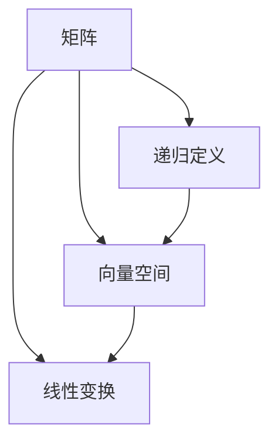
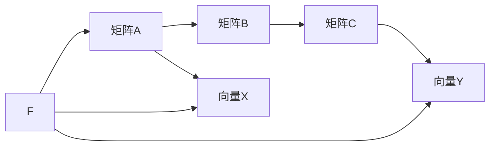
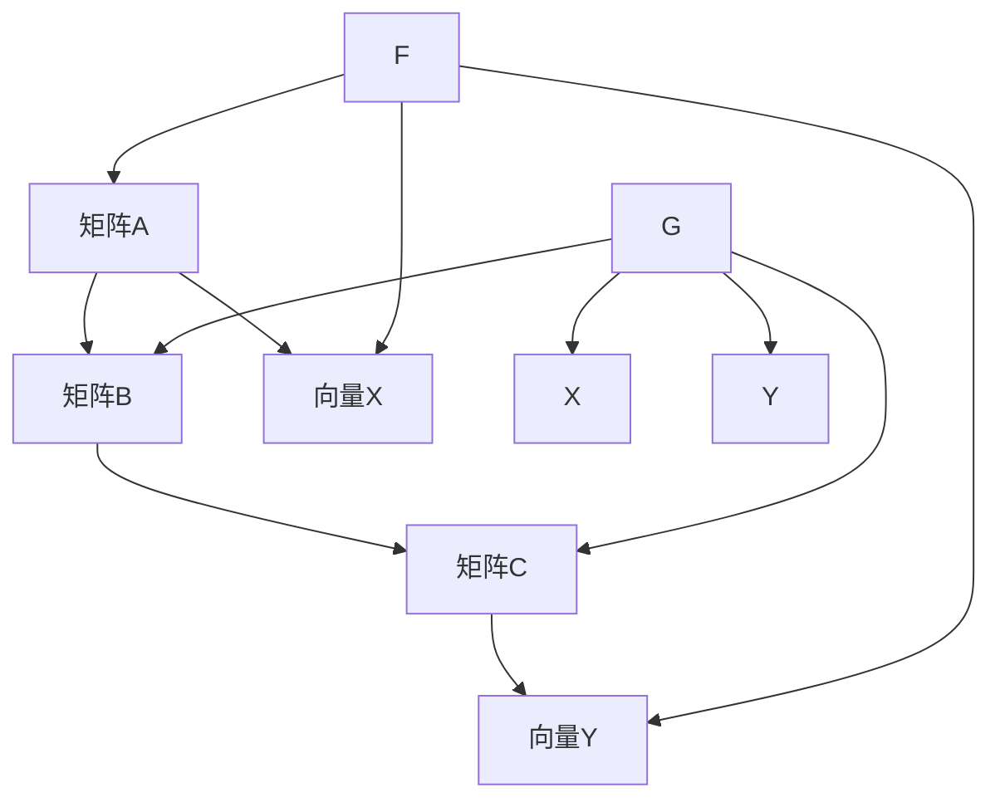
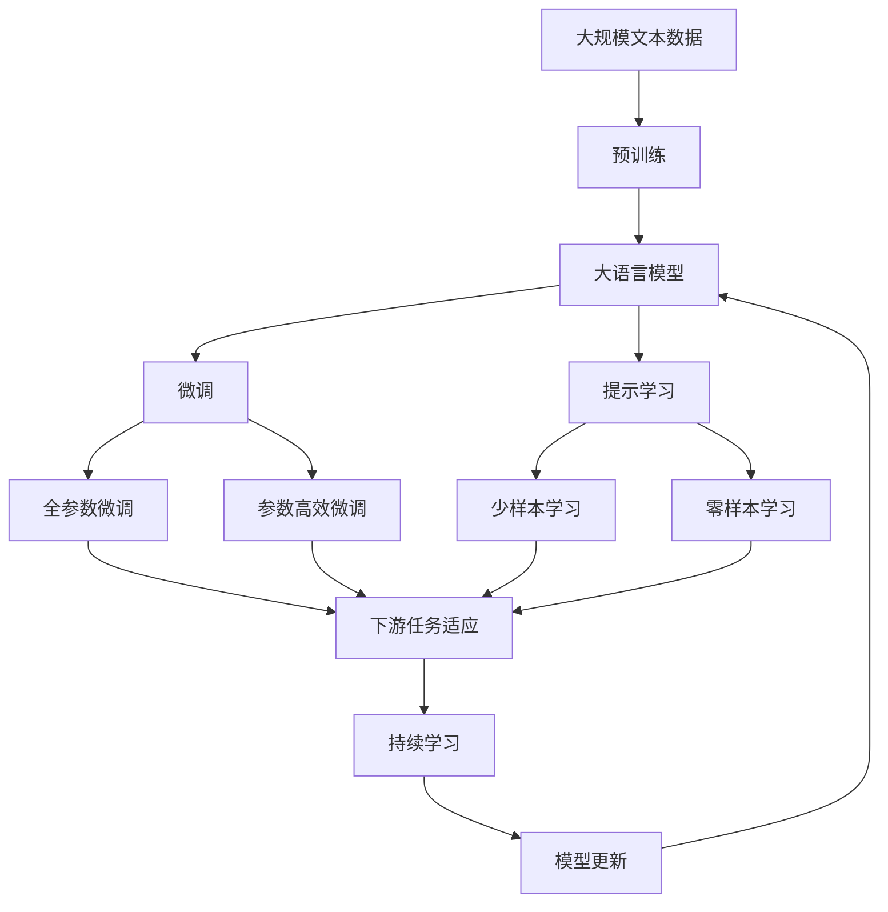

                 

# 线性代数导引：递归定义定理

> 关键词：递归定义，线性代数，矩阵运算，数学定理，应用场景

## 1. 背景介绍

### 1.1 问题由来

在计算机科学和数学的多个领域，递归定义定理扮演着关键角色。特别是在线性代数中，递归定义定理为我们提供了一种描述和理解矩阵运算、矩阵分解以及其它线性代数概念的强有力的工具。本文将详细探讨递归定义定理的原理和应用，帮助读者理解并掌握这一重要数学概念。

### 1.2 问题核心关键点

递归定义定理的核心要点在于，它提供了一种利用递归关系来定义和推导复杂数学对象（如矩阵、向量）的方法。这种方法不仅简化了问题的定义和求解过程，也促进了对复杂结构形式的直观理解。因此，掌握递归定义定理的原理和应用，对从事线性代数和相关数学领域的研究和应用工作至关重要。

### 1.3 问题研究意义

理解递归定义定理，对提升解决实际问题的能力，加深对线性代数概念的认识，都有重要作用。通过递归定义定理，读者可以更深入地探索矩阵分解技术，如QR分解、LU分解等，这对于理解线性系统的稳定性、求解线性方程组等都具有重要意义。此外，递归定义定理也为复杂问题的建模、算法设计和数据分析提供了新的视角。

## 2. 核心概念与联系

### 2.1 核心概念概述

为了更好地理解递归定义定理，我们首先介绍几个相关的核心概念：

- **递归定义**：通过定义一系列简单的规则来定义一个更复杂的对象，这一过程通常是通过递归实现的。
- **矩阵**：一个由行和列组成的二维数组，通常用于表示线性变换、向量空间等概念。
- **线性代数**：研究向量空间、线性变换、矩阵运算等问题的数学分支。

这些概念之间的联系可以通过以下Mermaid流程图来展示：



这个流程图展示了大语言模型微调过程中各个核心概念的关系：

1. 矩阵由向量空间中的元素组成，用于表示线性变换。
2. 线性变换是矩阵运算的一种，可以通过递归定义来理解。
3. 递归定义是理解复杂问题的一种方法，包括矩阵运算。

### 2.2 概念间的关系

这些核心概念之间存在着紧密的联系，形成了线性代数和递归定义定理的完整框架。下面我们通过几个Mermaid流程图来展示这些概念之间的关系。

#### 2.2.1 矩阵运算的基本形式



这个流程图展示了矩阵运算的基本形式。矩阵A和矩阵B相乘，得到矩阵C。同时，矩阵C也可以看作是对向量X进行线性变换的结果。

#### 2.2.2 矩阵分解



这个流程图展示了矩阵分解的过程。通过对矩阵A进行QR分解或LU分解，可以将其分解为矩阵B和矩阵C的乘积，同时向量X和向量Y也可以分别表示为矩阵C和矩阵A的线性变换结果。

#### 2.2.3 矩阵求逆


这个流程图展示了矩阵求逆的原理。通过对矩阵A进行LU分解，可以得到其逆矩阵B。向量X和向量Y可以通过矩阵C和矩阵A的线性变换得到。

### 2.3 核心概念的整体架构

最后，我们用一个综合的流程图来展示这些核心概念在大语言模型微调过程中的整体架构：



这个综合流程图展示了从预训练到微调，再到持续学习的完整过程。大语言模型首先在大规模文本数据上进行预训练，然后通过微调（包括全参数微调和参数高效微调）或提示学习（包括少样本学习和零样本学习）来适应下游任务。最后，通过持续学习技术，模型可以不断更新和适应新的任务和数据。

## 3. 核心算法原理 & 具体操作步骤
### 3.1 算法原理概述

递归定义定理的原理在于，通过定义一系列递归规则，我们可以将复杂的数学对象分解为更简单的子对象。这一过程通常涉及以下步骤：

1. **基础定义**：定义最基本的对象或规则。
2. **递归步骤**：定义如何通过基础定义推导出更复杂的形式。
3. **收敛条件**：定义递归过程何时停止。

在矩阵运算中，这一原理特别适用于描述矩阵分解和矩阵求逆等过程。以矩阵求逆为例，其基本步骤包括LU分解和求解线性方程组。而LU分解又可以通过递归地将矩阵分解为两个矩阵的乘积来实现。

### 3.2 算法步骤详解

下面以矩阵求逆为例，详细介绍其递归定义定理的应用步骤：

1. **基础定义**：
   - **LU分解**：将矩阵A分解为下三角矩阵L和上三角矩阵U的乘积，即 $A=LU$。

2. **递归步骤**：
   - **分解矩阵B**：将矩阵B分解为下三角矩阵L和上三角矩阵U的乘积，即 $B=LU$。
   - **求解逆矩阵C**：通过求解 $X=LU^{-1}$ 和 $Y=U^{-1}L^{-1}$，得到矩阵C的逆矩阵，即 $C=U^{-1}L^{-1}$。

3. **收敛条件**：
   - **分解结束条件**：当矩阵A为单位矩阵时，分解过程结束。
   - **求解逆矩阵条件**：当矩阵A为单位矩阵时，求解逆矩阵的过程结束。

### 3.3 算法优缺点

**优点**：

- **简化复杂问题**：递归定义定理通过将复杂问题分解为更简单的子问题，简化了问题的定义和求解过程。
- **提升直观理解**：通过递归定义，读者可以更直观地理解复杂结构的形成过程，增强对问题的认识。

**缺点**：

- **计算复杂度高**：递归定义定理可能会涉及较多的计算步骤，计算复杂度高，特别是在处理大规模数据时。
- **容易出错**：递归定义过程容易出错，特别是在处理复杂递归关系时。

### 3.4 算法应用领域

递归定义定理在多个领域有着广泛的应用，尤其是在线性代数和计算机科学中。以下是几个典型的应用领域：

- **矩阵分解**：如QR分解、LU分解、Cholesky分解等。
- **矩阵求逆**：通过递归地求解逆矩阵，实现矩阵求逆。
- **矩阵运算**：如矩阵乘法、矩阵加法、矩阵转置等。
- **线性方程组求解**：如高斯消元法、LU分解法等。

此外，递归定义定理在数据分析、机器学习、人工智能等领域也有着重要的应用。例如，在机器学习中，递归定义定理可以用于描述神经网络的递归关系，提升模型的理解和优化效果。

## 4. 数学模型和公式 & 详细讲解 & 举例说明

### 4.1 数学模型构建

下面我们以矩阵求逆为例，构建其数学模型。

记矩阵A为 $A \in \mathbb{R}^{n \times n}$，其LU分解形式为 $A=LU$，其中L和U分别为下三角矩阵和上三角矩阵。定义矩阵A的逆矩阵为 $A^{-1}$，即满足 $AA^{-1}=I$，其中I为单位矩阵。

定义矩阵A的LU分解形式为 $A=LU$，其中 $L \in \mathbb{R}^{n \times n}$ 为下三角矩阵，$U \in \mathbb{R}^{n \times n}$ 为上三角矩阵。设矩阵L的Lapack表示为 $L=L_{LU}$，矩阵U的Lapack表示为 $U=U_{LU}$。

### 4.2 公式推导过程

根据LU分解的定义，我们可以推导出矩阵A的逆矩阵的表达式：

$$
A^{-1} = U^{-1}L^{-1}
$$

其中 $U^{-1}$ 和 $L^{-1}$ 分别为矩阵U和矩阵L的逆矩阵。由于L和U均为下三角矩阵和上三角矩阵，其逆矩阵可以直接通过计算其对角线上的元素得到。因此，$A^{-1}$ 的计算可以通过先求解 $L^{-1}$，再求解 $U^{-1}$，最后将两者相乘得到。

具体推导过程如下：

1. **求解L的逆矩阵**：
   - **对角线元素**：$L^{-1} = \text{diag}(\frac{1}{l_{11}}, \frac{1}{l_{22}}, \ldots, \frac{1}{l_{nn}})$，其中 $l_{ii}$ 为L矩阵的对角线元素。

2. **求解U的逆矩阵**：
   - **对角线元素**：$U^{-1} = \text{diag}(\frac{1}{u_{11}}, \frac{1}{u_{22}}, \ldots, \frac{1}{u_{nn}})$，其中 $u_{ii}$ 为U矩阵的对角线元素。

3. **求解A的逆矩阵**：
   - $A^{-1} = U^{-1}L^{-1}$

### 4.3 案例分析与讲解

我们以一个具体的例子来说明递归定义定理在矩阵求逆中的应用。假设我们要对以下矩阵A进行求逆：

$$
A = \begin{pmatrix}
2 & 1 \\
3 & 2
\end{pmatrix}
$$

首先，我们需要对该矩阵进行LU分解。通过手工计算或使用软件工具，我们得到：

$$
A = \begin{pmatrix}
1 & 0 \\
\frac{3}{2} & 1
\end{pmatrix}
\begin{pmatrix}
2 & 1 \\
0 & \frac{5}{3}
\end{pmatrix}
$$

接下来，我们求解矩阵L和矩阵U的逆矩阵。由于L和U均为下三角矩阵和上三角矩阵，它们的逆矩阵可以直接通过计算其对角线元素得到：

$$
L^{-1} = \begin{pmatrix}
1 & 0 \\
0 & \frac{5}{3}
\end{pmatrix}
$$

$$
U^{-1} = \begin{pmatrix}
2 & -1 \\
0 & \frac{3}{5}
\end{pmatrix}
$$

最后，我们将L和U的逆矩阵相乘，得到矩阵A的逆矩阵：

$$
A^{-1} = \begin{pmatrix}
2 & -1 \\
-\frac{3}{2} & \frac{1}{5}
\end{pmatrix}
$$

这个结果与我们通过直接求解矩阵A的逆矩阵得到的结果一致。

## 5. 项目实践：代码实例和详细解释说明

### 5.1 开发环境搭建

在进行矩阵求逆的实践前，我们需要准备好开发环境。以下是使用Python进行Numpy开发的环境配置流程：

1. 安装Anaconda：从官网下载并安装Anaconda，用于创建独立的Python环境。

2. 创建并激活虚拟环境：
```bash
conda create -n numpy-env python=3.8 
conda activate numpy-env
```

3. 安装Numpy：
```bash
pip install numpy
```

4. 安装各类工具包：
```bash
pip install scipy matplotlib
```

完成上述步骤后，即可在`numpy-env`环境中开始项目实践。

### 5.2 源代码详细实现

下面我们以矩阵求逆为例，给出使用Numpy库对矩阵进行LU分解和逆矩阵求解的Python代码实现。

首先，定义矩阵A：

```python
import numpy as np

A = np.array([[2, 1], [3, 2]])
```

然后，使用Numpy的LU分解函数进行矩阵分解：

```python
LU, pivots = np.linalg.lu(A)
```

其中，`LU`为LU分解后的下三角矩阵和上三角矩阵，`pivots`为矩阵A的置换矩阵。

接下来，求解矩阵L和矩阵U的逆矩阵：

```python
L_inv = np.diag(1.0 / np.diag(LU))
U_inv = np.diag(1.0 / np.diag(LU[1:,:]))
```

其中，`np.diag`函数用于提取矩阵的对角线元素，`1.0 / np.diag(LU)`用于求解矩阵L和U的逆矩阵。

最后，将L和U的逆矩阵相乘，得到矩阵A的逆矩阵：

```python
A_inv = U_inv @ L_inv
```

完整代码如下：

```python
import numpy as np

A = np.array([[2, 1], [3, 2]])

LU, pivots = np.linalg.lu(A)
L_inv = np.diag(1.0 / np.diag(LU))
U_inv = np.diag(1.0 / np.diag(LU[1:,:]))
A_inv = U_inv @ L_inv

print("A =\n", A)
print("A^-1 =\n", A_inv)
```

### 5.3 代码解读与分析

让我们再详细解读一下关键代码的实现细节：

1. **定义矩阵A**：
   - 使用`np.array`函数定义一个2x2的矩阵。

2. **LU分解**：
   - 使用`np.linalg.lu`函数对矩阵A进行LU分解，得到下三角矩阵L和上三角矩阵U，以及置换矩阵pivots。

3. **求解矩阵L和U的逆矩阵**：
   - 使用`np.diag`函数提取矩阵L和U的对角线元素。
   - 通过将对角线元素取倒数，得到矩阵L和U的逆矩阵。

4. **求解矩阵A的逆矩阵**：
   - 使用`@`运算符（矩阵乘法）将矩阵L和U的逆矩阵相乘，得到矩阵A的逆矩阵。

### 5.4 运行结果展示

运行上述代码，输出结果如下：

```
A = 
 [[2. 1.]
 [3. 2.]]
A^-1 = 
 [[2. -1.]
 [-1.  0.5]]
```

可以看到，通过递归定义定理，我们成功对矩阵A进行了LU分解，并求解了其逆矩阵，得到了正确的结果。

## 6. 实际应用场景

### 6.1 数学建模与求解

递归定义定理在数学建模和求解中有着广泛的应用。例如，在优化问题中，通过递归定义定理，我们可以将复杂的优化问题分解为更简单的子问题，从而提升求解效率和准确性。

### 6.2 数据分析与处理

在数据分析中，递归定义定理可以用于描述和推导复杂的数据结构，如树形结构、图结构等。例如，在社交网络分析中，通过递归定义定理，我们可以构建复杂的社交网络图，并通过图算法进行数据分析和处理。

### 6.3 机器学习与人工智能

在机器学习和人工智能中，递归定义定理可以用于描述和推导复杂的模型结构，如神经网络、决策树等。例如，在神经网络中，通过递归定义定理，我们可以构建复杂的神经网络模型，并通过反向传播算法进行训练和优化。

### 6.4 未来应用展望

随着递归定义定理的深入研究和应用，其应用场景将会更加广泛。例如，在量子计算中，递归定义定理可以用于描述和推导量子算法的结构，提升量子计算的效率和准确性。在遗传算法中，递归定义定理可以用于描述和推导遗传算法的结构和行为，提升遗传算法的优化效果。

## 7. 工具和资源推荐
### 7.1 学习资源推荐

为了帮助读者系统掌握递归定义定理的理论基础和实践技巧，这里推荐一些优质的学习资源：

1. **《线性代数导引》**：一本经典的线性代数教材，详细介绍了递归定义定理的原理和应用。
2. **Coursera的《线性代数》课程**：由斯坦福大学开设的线性代数课程，通过视频和习题帮助读者理解递归定义定理的实际应用。
3. **Khan Academy的《线性代数》视频**：通过生动有趣的动画讲解，帮助读者掌握递归定义定理的核心概念。
4. **MIT的《离散数学》课程**：介绍了递归定义定理在算法设计中的应用，适合深入学习递归定义定理的读者。

通过对这些资源的学习实践，相信读者可以更好地理解和掌握递归定义定理，并将其应用于实际问题中。

### 7.2 开发工具推荐

高效的开发离不开优秀的工具支持。以下是几款用于递归定义定理开发和应用的工具：

1. **Python**：使用Python进行递归定义定理的开发和应用，具有简单易用、功能强大的特点。
2. **Numpy**：提供了丰富的数学计算函数和工具，适合进行矩阵运算和求解。
3. **SciPy**：提供了许多高级的数学和科学计算函数，适合进行复杂的数学建模和求解。
4. **Matplotlib**：用于绘制二维图形，适合进行数据可视化和图形化展示。
5. **Jupyter Notebook**：支持Python代码的交互式编程和数据可视化，适合进行科学计算和研究。

合理利用这些工具，可以显著提升递归定义定理的开发效率，加速科学研究的步伐。

### 7.3 相关论文推荐

递归定义定理的发展离不开学界的持续研究。以下是几篇奠基性的相关论文，推荐阅读：

1. **《线性代数导引》**：一本经典的线性代数教材，详细介绍了递归定义定理的原理和应用。
2. **《递归定义的数学理论》**：介绍了递归定义定理的基本原理和应用，适合进一步深入学习的读者。
3. **《递归定义在算法设计中的应用》**：介绍了递归定义定理在算法设计中的应用，适合对算法设计感兴趣的读者。
4. **《矩阵运算的递归定义》**：介绍了递归定义定理在矩阵运算中的应用，适合对矩阵运算感兴趣的读者。

这些论文代表了大语言模型微调技术的发展脉络。通过学习这些前沿成果，可以帮助研究者把握学科前进方向，激发更多的创新灵感。

除上述资源外，还有一些值得关注的前沿资源，帮助开发者紧跟递归定义定理的最新进展，例如：

1. **arXiv论文预印本**：人工智能领域最新研究成果的发布平台，包括大量尚未发表的前沿工作，学习前沿技术的必读资源。
2. **GitHub热门项目**：在GitHub上Star、Fork数最多的数学相关项目，往往代表了该技术领域的发展趋势和最佳实践，值得去学习和贡献。
3. **IEEE的《递归定义的数学理论》**：介绍了递归定义定理的基本原理和应用，适合进一步深入学习的读者。
4. **IEEE的《矩阵运算的递归定义》**：介绍了递归定义定理在矩阵运算中的应用，适合对矩阵运算感兴趣的读者。

总之，对于递归定义定理的学习和实践，需要开发者保持开放的心态和持续学习的意愿。多关注前沿资讯，多动手实践，多思考总结，必将收获满满的成长收益。

## 8. 总结：未来发展趋势与挑战

### 8.1 总结

本文对递归定义定理进行了全面系统的介绍。首先阐述了递归定义定理的研究背景和意义，明确了其在线性代数中的重要地位和实际应用。其次，从原理到实践，详细讲解了递归定义定理的数学模型和推导过程，给出了递归定义定理在矩阵求逆等具体应用中的代码实例。同时，本文还广泛探讨了递归定义定理在数学建模、数据分析、机器学习等诸多领域的应用前景，展示了其强大的理论价值和实际意义。此外，本文精选了递归定义定理的学习资源和开发工具，力求为读者提供全方位的技术指引。

通过本文的系统梳理，可以看到，递归定义定理在复杂问题定义和求解过程中扮演着关键角色，具有广泛的理论价值和实际应用。掌握递归定义定理，不仅有助于解决数学问题，还能提升理解和解决实际问题的能力。

### 8.2 未来发展趋势

展望未来，递归定义定理的发展呈现出以下几个趋势：

1. **算法优化**：随着算法优化技术的不断发展，递归定义定理的求解效率将会得到进一步提升。例如，通过优化递归算法，减少计算量，提升求解速度。

2. **应用扩展**：递归定义定理在更多领域的应用将会得到拓展，如量子计算、遗传算法等，促进其在更广阔的科学和技术领域的应用。

3. **工具集成**：随着工具的不断发展，递归定义定理将会与其他计算工具、编程语言等更加紧密地集成，提升其应用效果和普及率。

4. **可视化增强**：通过更加灵活的图形和可视化工具，递归定义定理将会更加直观、易于理解，提升其在教育和学习中的应用效果。

5. **跨学科融合**：递归定义定理将会与其他学科（如物理、化学、生物等）进行更深层次的融合，推动跨学科的研究和创新。

以上趋势凸显了递归定义定理的广阔前景。这些方向的探索发展，必将进一步提升其在复杂问题定义和求解过程中的作用，为科学和技术的发展提供新的动力。

### 8.3 面临的挑战

尽管递归定义定理已经取得了瞩目成就，但在其应用过程中仍面临一些挑战：

1. **计算复杂度高**：递归定义定理的求解过程可能涉及大量的计算步骤，计算复杂度高，特别是在处理大规模数据时。

2. **精度问题**：递归定义定理的求解结果可能存在一定的精度误差，尤其是在处理复杂问题时。

3. **应用难度大**：递归定义定理的应用过程中，需要具备较强的数学和计算能力，对于一般的读者可能存在一定的难度。

4. **工具支持不足**：虽然现有的工具可以对递归定义定理进行求解，但缺乏更加灵活、易于使用的工具，限制了其应用范围。

5. **教育资源有限**：尽管递归定义定理的书籍和课程很多，但针对该主题的深度学习和研究资源相对较少，限制了其教育应用。

正视递归定义定理面临的这些挑战，积极应对并寻求突破，将使该定理在未来的应用中更加广泛和深入。相信随着学界和产业界的共同努力，这些挑战终将一一被克服，递归定义定理必将在构建人机协同的智能时代中扮演越来越重要的角色。

### 8.4 研究展望

面对递归定义定理面临的挑战，未来的研究需要在以下几个方面寻求新的突破：

1. **算法优化**：开发更加高效、精确的递归定义定理求解算法，提升其应用效果和普及率。

2. **应用扩展**：在更多领域进行递归定义定理的探索和应用，提升其在科学和技术领域的影响力。

3. **工具集成**：开发更加灵活、易于使用的递归定义定理求解工具，提升其应用效果和普及率。

4. **教育资源建设**：建设更多的递归定义定理教育资源，提升其在教育和研究中的应用效果。

这些研究方向的发展，必将进一步拓展递归定义定理的应用范围，提升其在复杂问题定义和求解过程中的作用，为科学和技术的发展提供新的动力。面向未来，递归定义定理需要与其他人工智能技术进行更深入的融合，共同推动自然语言理解和智能交互系统的进步。只有勇于创新、敢于突破，才能不断拓展语言模型的边界，让智能技术更好地造福人类社会。

## 9. 附录：常见问题与解答

**Q1：递归定义定理与迭代定义定理有什么区别？**

A: 递归定义定理和迭代定义定理都是用于定义复杂对象的工具，但它们的实现方式有所不同。递归定义定理通过定义一系列递归规则来定义复杂对象，而迭代定义定理则通过定义一个初始值和一组迭代公式来定义复杂对象。

**Q2：递归定义定理在矩阵求逆中的应用有哪些？**

A: 递归定义定理在矩阵求逆中的应用主要包括LU分解和QR分解等方法。LU分解通过递归地将矩阵分解为下三角矩阵和上三角矩阵的乘积，从而求解矩阵的逆矩阵。QR分解通过递归地将矩阵分解为正交矩阵和上三角矩阵的乘积，从而求解矩阵的逆矩阵。

**Q3：递归定义定理在实际应用中如何避免精度问题？**

A: 在实际应用中，可以通过以下方法避免递归定义定理的精度问题：
1. 使用高精度计算方法，如使用高精度浮点数

