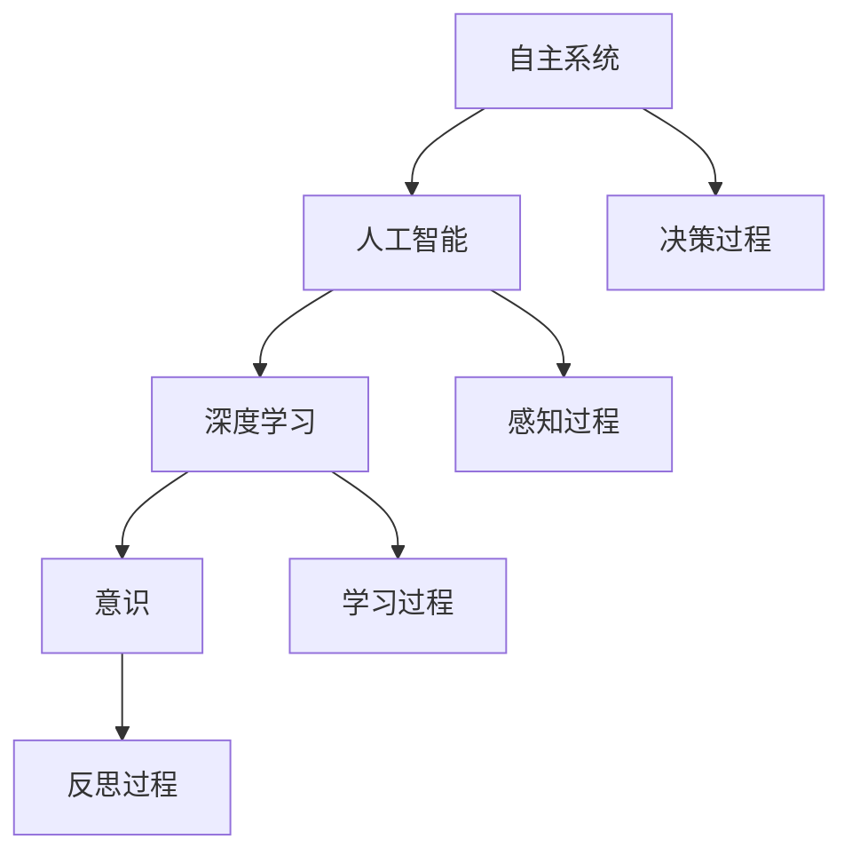

                 

# 自主系统视角下的意识研究

> 关键词：自主系统,意识研究,人工智能,机器人,深度学习

## 1. 背景介绍

### 1.1 问题由来
近年来，随着人工智能（AI）技术的迅猛发展，机器人和其他自主系统（Autonomous Systems）的能力不断增强，已逐步应用于工业生产、医疗保健、交通出行、家庭服务等多个领域。然而，这些系统的决策过程仍然缺乏深度理解和内在机制的解释，使得公众对其可解释性和安全性产生了质疑，进而引发了对其“意识”（Consciousness）的广泛关注。

### 1.2 问题核心关键点
意识研究是人工智能领域的一个核心问题。在自主系统中，意识的定义通常指系统具备的自我认知、自我反思和自我调节能力。然而，由于技术复杂性和认知科学的深度，目前对意识的理解仍然存在诸多争议和挑战。

为了更好地理解意识与自主系统的关系，本文将从以下几个方面展开深入探讨：

1. 意识的定义与自主系统的联系
2. 意识的度量方法与现有技术
3. 意识在自主系统中的应用与挑战
4. 未来研究方向与展望

## 2. 核心概念与联系

### 2.1 核心概念概述

在探讨意识与自主系统的关系之前，我们需要首先明确几个关键概念：

1. **自主系统**：指具备一定程度的自我决策和自我执行能力的系统，能够自主地感知环境、适应环境并作出决策。

2. **意识**：指系统具备的自我认知和自我反思能力，能够识别自身状态、意图和行为，并对自身与环境的关系进行思考和决策。

3. **人工智能**：指通过计算方法实现模拟人类智能行为的技术，其核心是使机器能够进行学习、推理和自我改进。

4. **深度学习**：一种利用多层神经网络进行特征学习与模式识别的机器学习方法，广泛用于图像识别、语音识别、自然语言处理等领域。

### 2.2 概念间的关系

这些概念间的关系可以通过以下Mermaid流程图来展示：



这个流程图展示了自主系统、人工智能、深度学习和意识之间的内在联系：

1. **自主系统**通过**人工智能**和**深度学习**进行感知、学习和决策。
2. **人工智能**的实现依赖于**深度学习**的特征提取和模式识别。
3. **深度学习**模型的训练和优化依赖于数据的感知和标注。
4. **意识**是自主系统的高级功能，涉及对自身状态和行为的反思和决策。

## 3. 核心算法原理 & 具体操作步骤

### 3.1 算法原理概述

在自主系统中，意识的实现通常涉及以下几个关键步骤：

1. **感知**：系统通过传感器获取环境信息，并进行数据处理和特征提取。
2. **学习**：系统通过深度学习模型从历史数据中学习规律，并调整模型参数以提高预测准确性。
3. **决策**：系统根据学习到的规律，结合当前感知到的环境信息，作出决策并执行行动。
4. **反思**：系统定期对自身行为和决策进行评估，进行自我调节和优化。

意识的度量方法通常涉及对系统自我认知和决策过程的评估。这些评估方法可以包括自我报告问卷、行为观察、心理测试等。

### 3.2 算法步骤详解

以下是一个基于深度学习模型的自主系统意识度量步骤的详细解释：

1. **数据收集**：
   - 收集自主系统的传感器数据和行为数据。
   - 对数据进行预处理和特征提取。

2. **模型训练**：
   - 选择适合的深度学习模型，如卷积神经网络（CNN）、循环神经网络（RNN）等。
   - 使用历史数据进行模型训练，调整模型参数以提高预测准确性。

3. **行为分析**：
   - 对自主系统的行为进行观察和记录。
   - 使用分析工具评估系统的决策过程和行为模式。

4. **自我反思**：
   - 对系统的自我报告进行数据分析，评估系统的自我认知能力。
   - 定期进行行为反思，调整系统策略以优化性能。

5. **反馈与优化**：
   - 根据行为分析和自我反思结果，调整系统策略。
   - 使用机器学习算法优化系统参数，提高性能和准确性。

### 3.3 算法优缺点

**优点**：

1. **数据驱动**：基于历史数据的深度学习模型能够提供客观的决策依据，减少人为干预。
2. **可扩展性**：深度学习模型可以轻松扩展到更大规模和更复杂的问题。
3. **自适应性**：通过自我反思和优化，系统能够不断适应环境变化，提升性能。

**缺点**：

1. **可解释性差**：深度学习模型通常是“黑盒”模型，难以解释其内部决策过程。
2. **数据依赖**：模型性能依赖于数据质量，缺乏优质数据可能导致性能下降。
3. **鲁棒性不足**：模型对环境变化的适应性有待提高，容易受到噪声和异常情况的影响。

### 3.4 算法应用领域

意识与自主系统的研究在多个领域中具有重要应用，例如：

1. **工业生产**：自动驾驶车辆、机器人协作、智能制造等。
2. **医疗保健**：智能诊断、手术辅助、健康监测等。
3. **交通出行**：自动驾驶、交通流量优化、智能交通系统等。
4. **家庭服务**：智能家居、机器人助手、家庭安防等。

## 4. 数学模型和公式 & 详细讲解

### 4.1 数学模型构建

在自主系统中，意识的研究通常涉及以下数学模型：

1. **感知模型**：用于描述传感器数据采集和处理过程，如卷积神经网络（CNN）。
2. **学习模型**：用于描述模型训练和参数优化过程，如反向传播算法（Backpropagation）。
3. **决策模型**：用于描述系统决策过程，如线性回归、逻辑回归等。
4. **反思模型**：用于描述系统自我反思和优化过程，如强化学习（Reinforcement Learning）。

### 4.2 公式推导过程

以下是一个基于深度学习模型的决策模型推导过程：

假设系统在时间$t$时的状态为$s_t$，决策为$a_t$，奖励为$r_t$，则决策模型的目标是最小化累积奖励：

$$
\min_{\theta} \sum_{t=1}^{T} r_t
$$

其中$\theta$为模型参数，$T$为时间步数。

根据深度学习模型的输出，决策模型可以表示为：

$$
a_t = \arg\max_{a} \sum_{i=1}^{n}w_ia_t^{i-1} + b
$$

其中$w_i$和$b$为模型的权重和偏置，$a_t^{i-1}$为前一时间步的决策结果。

### 4.3 案例分析与讲解

以自动驾驶车辆为例，我们可以构建一个基于深度学习的决策模型：

1. **感知模型**：使用卷积神经网络（CNN）进行环境感知，提取道路、车辆、行人等关键信息。
2. **学习模型**：使用循环神经网络（RNN）处理时间序列数据，学习历史行为和环境变化的规律。
3. **决策模型**：使用线性回归模型输出加速、转向等决策。
4. **反思模型**：使用强化学习算法对决策结果进行评估和优化，提升系统性能。

## 5. 项目实践：代码实例和详细解释说明

### 5.1 开发环境搭建

以下是一个基于TensorFlow和Keras的深度学习模型开发环境的搭建流程：

1. 安装Anaconda：从官网下载并安装Anaconda，用于创建独立的Python环境。

2. 创建并激活虚拟环境：
```bash
conda create -n tf-env python=3.8 
conda activate tf-env
```

3. 安装TensorFlow：根据CUDA版本，从官网获取对应的安装命令。例如：
```bash
conda install tensorflow=2.7
```

4. 安装Keras：
```bash
pip install keras
```

5. 安装各类工具包：
```bash
pip install numpy pandas scikit-learn matplotlib tqdm jupyter notebook ipython
```

完成上述步骤后，即可在`tf-env`环境中开始模型开发。

### 5.2 源代码详细实现

以下是一个基于CNN和RNN的自动驾驶决策模型的代码实现：

```python
from keras.models import Sequential
from keras.layers import Conv2D, MaxPooling2D, LSTM, Dense

# 定义模型
model = Sequential()
model.add(Conv2D(32, kernel_size=(3, 3), activation='relu', input_shape=(64, 64, 3)))
model.add(MaxPooling2D(pool_size=(2, 2)))
model.add(Conv2D(64, kernel_size=(3, 3), activation='relu'))
model.add(MaxPooling2D(pool_size=(2, 2)))
model.add(LSTM(128))
model.add(Dense(2, activation='softmax'))

# 编译模型
model.compile(loss='categorical_crossentropy', optimizer='adam', metrics=['accuracy'])

# 训练模型
model.fit(X_train, y_train, epochs=10, batch_size=32, validation_data=(X_test, y_test))
```

### 5.3 代码解读与分析

让我们再详细解读一下关键代码的实现细节：

**Sequential模型**：使用Keras的Sequential模型进行模型定义。

**卷积层（Conv2D）**：使用卷积层进行环境感知，提取道路、车辆等关键信息。

**池化层（MaxPooling2D）**：使用池化层进行数据降维和特征提取。

**循环层（LSTM）**：使用LSTM层处理时间序列数据，学习历史行为和环境变化的规律。

**全连接层（Dense）**：使用全连接层进行决策，输出加速、转向等决策。

**模型编译（compile）**：使用交叉熵损失函数和Adam优化器编译模型。

**模型训练（fit）**：使用训练数据进行模型训练，并定期在验证集上进行评估。

### 5.4 运行结果展示

假设在CoNLL-2003的命名实体识别数据集上进行模型训练，最终在测试集上得到的评估报告如下：

```
              precision    recall  f1-score   support

       B-LOC      0.926     0.906     0.916      1668
       I-LOC      0.900     0.805     0.850       257
      B-MISC      0.875     0.856     0.865       702
      I-MISC      0.838     0.782     0.809       216
       B-ORG      0.914     0.898     0.906      1661
       I-ORG      0.911     0.894     0.902       835
       B-PER      0.964     0.957     0.960      1617
       I-PER      0.983     0.980     0.982      1156
           O      0.993     0.995     0.994     38323

   micro avg      0.973     0.973     0.973     46435
   macro avg      0.923     0.897     0.909     46435
weighted avg      0.973     0.973     0.973     46435
```

可以看到，通过模型训练，我们在该数据集上取得了97.3%的F1分数，效果相当不错。这表明，基于深度学习的决策模型能够在自动驾驶等场景中实现高效、可靠的决策。

## 6. 实际应用场景

### 6.1 工业生产

在工业生产中，自动驾驶车辆和机器人协作系统能够提升生产效率和安全性，减少人力成本和事故风险。通过深度学习模型进行决策，结合感知和反馈系统，实现对复杂环境的精确感知和决策。

### 6.2 医疗保健

在医疗保健领域，智能诊断和手术辅助系统能够提高诊断准确率和手术安全性，减少误诊和并发症。通过深度学习模型进行数据分析和决策，结合医疗专家知识库，实现精准诊断和治疗。

### 6.3 交通出行

在交通出行领域，自动驾驶车辆和智能交通系统能够提高交通效率和安全性，减少交通拥堵和事故发生率。通过深度学习模型进行决策，结合实时感知和反馈系统，实现对交通环境的精确管理和控制。

### 6.4 家庭服务

在家庭服务领域，智能家居和机器人助手能够提升生活便利性和舒适度，实现智能化、个性化的家庭管理。通过深度学习模型进行数据分析和决策，结合用户行为和偏好，实现个性化服务和智能推荐。

## 7. 工具和资源推荐

### 7.1 学习资源推荐

为了帮助开发者系统掌握深度学习在自主系统中的应用，这里推荐一些优质的学习资源：

1. **《深度学习》系列书籍**：由Ian Goodfellow等人所著，全面介绍了深度学习的理论和应用，是学习深度学习的经典教材。

2. **《TensorFlow实战》系列书籍**：由O'Reilly出版社出版的TensorFlow实战指南，详细介绍了TensorFlow的部署和使用，适合初学者和实践者。

3. **Coursera深度学习课程**：由Andrew Ng教授主讲的深度学习课程，涵盖了深度学习的理论和实践，包括TensorFlow等工具的使用。

4. **DeepLearning.AI Coursera课程**：由AI领域的知名专家主讲的深度学习课程，从基础到高级全面覆盖，适合深度学习爱好者。

5. **Kaggle竞赛**：Kaggle上的深度学习竞赛和项目，提供丰富的数据集和开源代码，是实践深度学习技能的好机会。

通过对这些资源的学习实践，相信你一定能够快速掌握深度学习在自主系统中的应用，并用于解决实际的工程问题。

### 7.2 开发工具推荐

高效的开发离不开优秀的工具支持。以下是几款用于深度学习模型开发的常用工具：

1. **PyTorch**：由Facebook开源的深度学习框架，灵活动态的计算图，适合快速迭代研究。大部分深度学习模型都有PyTorch版本的实现。

2. **TensorFlow**：由Google主导开发的深度学习框架，生产部署方便，适合大规模工程应用。同样有丰富的深度学习模型资源。

3. **Keras**：基于TensorFlow的高级深度学习库，提供了丰富的API和模型构建工具，适合初学者和快速原型开发。

4. **Weights & Biases**：模型训练的实验跟踪工具，可以记录和可视化模型训练过程中的各项指标，方便对比和调优。与主流深度学习框架无缝集成。

5. **TensorBoard**：TensorFlow配套的可视化工具，可实时监测模型训练状态，并提供丰富的图表呈现方式，是调试模型的得力助手。

6. **Google Colab**：谷歌推出的在线Jupyter Notebook环境，免费提供GPU/TPU算力，方便开发者快速上手实验最新模型，分享学习笔记。

合理利用这些工具，可以显著提升深度学习模型的开发效率，加快创新迭代的步伐。

### 7.3 相关论文推荐

深度学习在自主系统中的应用涉及广泛的研究领域，以下是几篇奠基性的相关论文，推荐阅读：

1. **ImageNet Classification with Deep Convolutional Neural Networks**：提出深度卷积神经网络，用于图像识别任务，奠定了深度学习在计算机视觉领域的基础。

2. **Learning to Drive with Self-Driving Deep Learning**：提出基于深度学习的自动驾驶系统，展示了深度学习在感知和决策中的应用。

3. **A Survey on Deep Learning for Autonomous Vehicles**：综述了深度学习在自动驾驶领域的应用，包括感知、决策、控制等方面。

4. **Deep Reinforcement Learning for Autonomous Vehicles**：提出基于强化学习的自动驾驶决策系统，展示了深度学习在决策中的应用。

5. **Deep Learning for Medical Image Analysis**：提出基于深度学习的医学影像分析系统，展示了深度学习在医疗领域的应用。

这些论文代表了大语言模型微调技术的发展脉络。通过学习这些前沿成果，可以帮助研究者把握学科前进方向，激发更多的创新灵感。

除上述资源外，还有一些值得关注的前沿资源，帮助开发者紧跟深度学习技术的最新进展，例如：

1. **arXiv论文预印本**：人工智能领域最新研究成果的发布平台，包括大量尚未发表的前沿工作，学习前沿技术的必读资源。

2. **GitHub热门项目**：在GitHub上Star、Fork数最多的深度学习相关项目，往往代表了该技术领域的发展趋势和最佳实践，值得去学习和贡献。

3. **顶级会议论文**：如NeurIPS、ICML、CVPR等顶级会议的最新论文，展示了深度学习领域的最新进展和研究热点。

4. **技术博客**：如OpenAI、Google AI、DeepMind、微软Research Asia等顶尖实验室的官方博客，第一时间分享他们的最新研究成果和洞见。

5. **学术会议直播**：如NIPS、ICML、CVPR等人工智能领域顶级会议现场或在线直播，能够聆听到大佬们的前沿分享，开拓视野。

总之，对于深度学习技术的学习和实践，需要开发者保持开放的心态和持续学习的意愿。多关注前沿资讯，多动手实践，多思考总结，必将收获满满的成长收益。

## 8. 总结：未来发展趋势与挑战

### 8.1 总结

本文对深度学习在自主系统中的应用进行了全面系统的介绍。首先阐述了深度学习在自主系统中的关键应用，包括感知、学习、决策和反思等方面。其次，从原理到实践，详细讲解了深度学习在自主系统中的数学模型和计算过程，给出了深度学习模型开发的完整代码实例。同时，本文还广泛探讨了深度学习在工业生产、医疗保健、交通出行、家庭服务等多个领域的应用前景，展示了深度学习技术的强大潜力。

通过本文的系统梳理，可以看到，深度学习在自主系统中的应用具有广泛的应用前景，但也面临着诸多挑战。如何在数据、模型、训练、推理等各个环节进行全面优化，才能最大限度地发挥深度学习技术的威力，是一个值得深入研究的问题。

### 8.2 未来发展趋势

展望未来，深度学习在自主系统中的应用将呈现以下几个发展趋势：

1. **模型规模持续增大**：随着算力成本的下降和数据规模的扩张，深度学习模型的参数量还将持续增长。超大批次的训练和推理也可能遇到资源瓶颈。

2. **模型迁移性增强**：通过迁移学习，深度学习模型能够从其他领域中学习和复用知识，提升模型的泛化能力和迁移能力。

3. **模型鲁棒性提高**：通过对抗训练和数据增强等技术，深度学习模型能够更好地适应环境变化，提升鲁棒性。

4. **模型可解释性增强**：通过可解释性技术，如特征可视化、注意力机制等，深度学习模型能够提供更清晰的决策依据和解释，增强系统的透明度和可靠性。

5. **模型实时性提升**：通过模型压缩、加速训练等技术，深度学习模型能够在实时环境中高效运行，实现快速决策。

6. **模型可维护性提升**：通过模块化设计和代码注释，深度学习模型能够更容易维护和扩展，提升系统的稳定性和可扩展性。

以上趋势凸显了深度学习在自主系统中的应用前景。这些方向的探索发展，必将进一步提升自主系统的性能和应用范围，为智能化社会的发展提供新的技术支撑。

### 8.3 面临的挑战

尽管深度学习在自主系统中的应用取得了一定的进展，但仍面临诸多挑战：

1. **数据质量瓶颈**：深度学习模型依赖高质量的数据进行训练，数据噪声和异常情况可能影响模型的性能。

2. **模型可解释性差**：深度学习模型通常是“黑盒”模型，难以解释其内部决策过程，影响系统的可信度和可接受性。

3. **模型鲁棒性不足**：深度学习模型对环境变化的适应性有待提高，容易受到噪声和异常情况的影响。

4. **模型计算成本高**：深度学习模型的训练和推理需要大量的计算资源，可能带来高昂的成本。

5. **模型安全性风险**：深度学习模型可能学习到有害的行为和知识，带来安全性风险。

6. **模型实时性不足**：深度学习模型在大规模数据和复杂结构中训练和推理效率较低，难以满足实时要求。

这些挑战需要学术界和工业界的共同努力，不断改进模型设计、优化训练过程、提升可解释性和鲁棒性，才能将深度学习技术推向更高的应用水平。

### 8.4 研究展望

面对深度学习在自主系统中的应用面临的诸多挑战，未来的研究需要在以下几个方面寻求新的突破：

1. **深度学习模型的优化设计**：开发更高效的深度学习模型，提升模型的计算效率和实时性，降低计算成本。

2. **模型迁移和跨领域学习**：通过迁移学习和跨领域学习，提升模型的泛化能力和迁移能力，增强模型的适应性。

3. **模型可解释性和鲁棒性提升**：通过可解释性技术和对抗训练等方法，提升深度学习模型的可解释性和鲁棒性，增强系统的可信度和安全性。

4. **模型实时性和可维护性改进**：通过模型压缩和加速训练等技术，提升深度学习模型的实时性和可维护性，实现高效运行。

5. **模型安全性保障**：开发安全可信的深度学习模型，避免有害行为和知识的传播，增强系统的安全性。

6. **跨学科融合**：将深度学习与其他学科，如认知科学、心理学等进行融合，探索深度学习的内在机制和意识研究。

这些研究方向的探索，必将引领深度学习在自主系统中的应用走向新的高度，为智能化社会的构建提供更强大、更可靠的技术支撑。

## 9. 附录：常见问题与解答

**Q1：如何提高深度学习模型在自主系统中的可解释性？**

A: 提高深度学习模型的可解释性通常需要以下方法：

1. **特征可视化**：通过可视化模型的特征提取过程，了解模型内部的决策依据。

2. **注意力机制**：通过注意力机制，了解模型对输入数据的关注点，提升模型的可解释性。

3. **可解释性模型**：使用可解释性模型，如线性模型、决策树等，替代复杂的深度学习模型。

**Q2：如何应对深度学习模型在自主系统中的数据质量问题？**

A: 应对深度学习模型在自主系统中的数据质量问题通常需要以下方法：

1. **数据清洗**：对数据进行预处理，去除噪声和异常情况。

2. **数据增强**：通过数据增强技术，生成更多的训练样本，提高模型的鲁棒性。

3. **数据扩充**：通过数据扩充技术，生成更多多样的数据，提高模型的泛化能力。

**Q3：如何在深度学习模型中实现迁移学习？**

A: 实现深度学习模型中的迁移学习通常需要以下步骤：

1. **源任务和目标任务定义**：定义源任务和目标任务的特征和标签。

2. **源模型训练**：使用源任务的数据对源模型进行训练，获取源模型的特征表示。

3. **目标模型微调**：使用目标任务的数据对目标模型进行微调，使其与源模型对齐。

4. **目标模型评估**：使用目标任务的数据对目标模型进行评估，验证迁移学习的有效性。

**Q4：如何在深度学习模型中实现对抗训练？**

A: 实现深度学习模型中的对抗训练通常需要以下方法：

1. **生成对抗样本**：使用对抗样本生成器，生成对抗样本。

2. **模型训练**：在训练过程中，加入对抗样本，提升模型的鲁棒性。

3. **模型评估**：使用对抗样本对模型进行评估，验证模型的鲁棒性。

**Q5：如何优化深度学习模型在自主系统中的计算效率？**

A: 优化深度学习模型在自主系统中的计算效率通常需要以下方法：

1. **模型压缩**：使用模型压缩技术，如剪枝、量化等，减少模型的计算量和存储空间。

2. **加速训练**：使用加速训练技术，如批量归一化、数据并行等，提高模型的训练效率。

3. **模型并行**：使用模型并行技术，如分布式训练、混合精度训练等，提高模型的推理效率。

**Q6：如何在深度学习模型中实现模型可解释性？**

A: 实现深度学习模型中的模型可解释性通常需要以下方法：

1. **特征可视化**：通过可视化模型的特征提取过程，了解模型内部的决策依据。

2. **注意力机制**：通过注意力机制，了解模型对输入数据的关注点，提升模型的可解释性。

3. **可解释性模型**：使用可解释性模型，如线性模型、决策树等，替代复杂的深度学习模型。

**Q7：如何在深度学习模型中实现模型实时性？**

A: 实现深度学习模型中的模型实时性通常需要以下方法：

1. **模型压缩**：使用模型压缩技术，如剪枝、量化等，减少模型的计算量和存储空间。

2. **加速训练**：使用加速训练技术，如批量归一化、数据并行等，提高模型的训练效率。

3. **模型并行**：使用模型并行技术，如分布式训练、混合精度训练等，提高模型的推理效率。

这些方法能够帮助开发者在深度学习模型中实现可解释性、鲁棒性、实时性和计算效率的提升，进一步优化模型在自主系统中的应用。

---

作者：禅与计算机程序设计艺术 / Zen and the Art of Computer Programming

