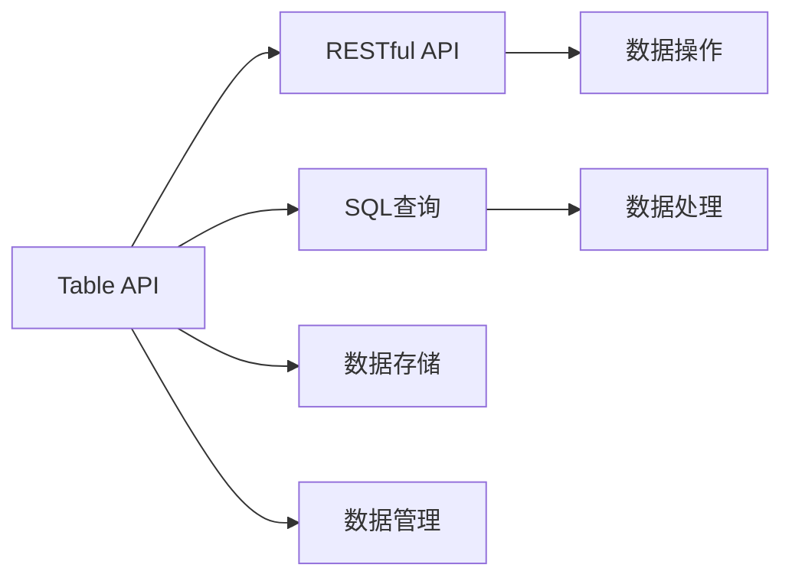
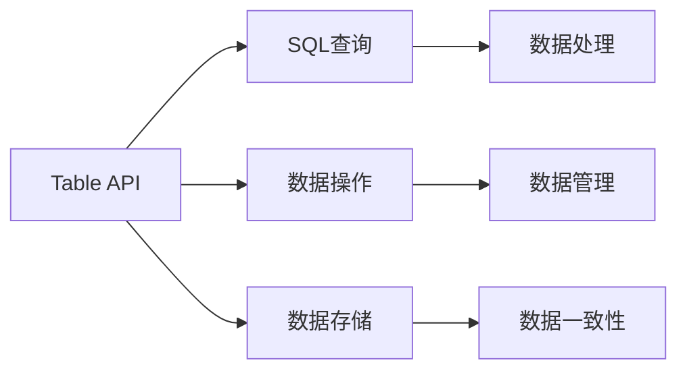
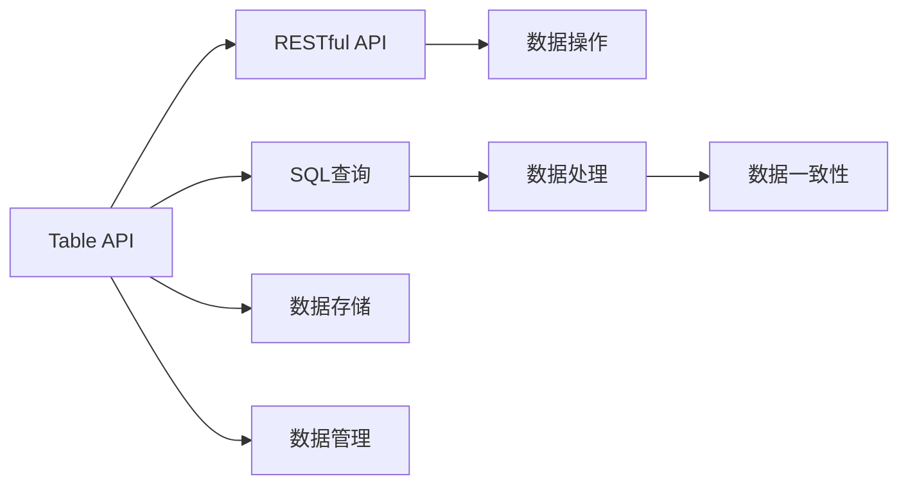

                 

# Table API和SQL 原理与代码实例讲解

> 关键词：Table API, SQL, 数据库管理, 数据处理, 数据结构, 数据库查询, 数据库优化

## 1. 背景介绍

### 1.1 问题由来
在数据密集型应用中，处理、存储和查询海量数据的需求日益增长。传统的关系型数据库（RDBMS）在数据处理效率和查询性能上存在瓶颈，而NoSQL数据库虽然在扩展性和性能上有所突破，但在事务处理和数据一致性方面仍存在不足。针对这一需求，谷歌提出了Table API（Table as a Service, Taas）这一概念，旨在通过一种统一的数据处理方式，使得用户能更高效地管理和查询数据，同时满足跨多种数据存储的需求。

与此同时，SQL（Structured Query Language，结构化查询语言）作为一种通用的查询语言，已经成为数据处理的标准。无论是在RDBMS还是NoSQL中，SQL都在数据处理和查询中扮演着重要角色。然而，传统的SQL编程模式在数据处理复杂性、性能优化和跨平台兼容性等方面存在一些问题。

Table API结合了SQL语言和数据处理框架的优势，提供了一种更简单、高效、灵活的数据处理方式，同时兼容了SQL语法，使得数据处理和查询更加便捷和直观。本文档将详细介绍Table API和SQL的基本原理，并通过代码实例帮助读者深入理解其实现方式和应用场景。

### 1.2 问题核心关键点
Table API和SQL的核心关键点包括：

1. 数据处理和查询的基础架构
2. 数据结构的定义和操作
3. 查询语言的语法和优化
4. 数据处理的并行和分布式处理
5. 跨数据存储和数据源的统一处理
6. 事务处理和数据一致性保障

通过理解这些核心概念，读者将能更好地掌握Table API和SQL的原理，并在实际项目中灵活应用。

### 1.3 问题研究意义
Table API和SQL的应用对数据密集型应用具有重要意义：

1. 提高数据处理效率：通过简化数据处理流程和优化查询性能，Table API和SQL能显著提高数据处理的效率，从而缩短业务流程。
2. 增强数据一致性：Table API和SQL提供了一致性保障机制，确保数据在分布式系统中的正确性。
3. 统一数据处理方式：Table API和SQL使得不同数据存储系统下的数据处理更加统一和标准化，减少了系统复杂性。
4. 优化数据管理：通过灵活的数据结构和查询方式，Table API和SQL使得数据管理和维护变得更加便捷和高效。
5. 兼容传统SQL语法：Table API和SQL支持传统SQL语法，使得已有SQL技能的用户可以无缝迁移和应用。

## 2. 核心概念与联系

### 2.1 核心概念概述

Table API和SQL的核心概念主要包括以下几个方面：

- Table API：一种由谷歌提出，用于统一管理和查询数据的新型数据处理方式。它提供了一组基于RESTful API的数据处理接口，用户可以通过这些接口对数据进行创建、修改、查询和删除等操作。

- SQL：一种通用的数据查询语言，能够对各种类型的数据库进行高效的数据查询和管理。SQL语言具有丰富的语法结构，支持复杂的数据操作和查询。

Table API和SQL的核心概念之间的关系可以通过以下Mermaid流程图来展示：



这个流程图展示了Table API和SQL在数据处理过程中的作用和联系：

1. Table API通过RESTful API提供数据操作接口。
2. SQL在Table API中用于数据查询和处理。
3. Table API负责数据存储和管理。
4. SQL语言对数据进行高效处理和查询。

### 2.2 概念间的关系

这些核心概念之间的关系如图示：



### 2.3 核心概念的整体架构

Table API和SQL的整体架构如图示：



## 3. 核心算法原理 & 具体操作步骤
### 3.1 算法原理概述

Table API和SQL的核心算法原理主要基于以下两点：

1. 数据抽象：Table API将数据以Table的形式进行抽象，用户通过RESTful API对Table进行操作，简化数据处理流程。
2. 查询语言：SQL作为通用的查询语言，支持复杂的数据操作和查询，是Table API中重要的数据处理工具。

通过数据抽象和查询语言，Table API和SQL能够提供一种高效、统一的数据处理方式，同时支持跨数据存储和数据源的统一处理。

### 3.2 算法步骤详解

Table API和SQL的实现步骤如下：

**Step 1: 准备数据存储**

在实际应用中，用户需要先选择一种数据存储方式，如RDBMS、NoSQL等，并在Table API中创建Table对象。Table对象是Table API中的基本数据单位，用于封装和管理数据。

**Step 2: 数据操作**

用户可以通过Table API的RESTful API对Table对象进行数据操作，如创建、修改、查询和删除等。这些操作可以基于SQL语法或Table API特有的操作语法进行实现。

**Step 3: 数据查询**

用户可以使用SQL查询语言对Table对象中的数据进行高效查询。SQL查询语言具有丰富的语法结构，支持复杂的数据操作和查询。

**Step 4: 数据处理**

Table API和SQL提供了多种数据处理方式，如MapReduce、Spark等。用户可以根据实际需求选择相应的数据处理方式，并对数据进行并行和分布式处理。

**Step 5: 数据管理**

Table API和SQL支持数据一致性和事务处理，确保数据在分布式系统中的正确性。同时，提供数据管理和监控功能，帮助用户及时发现和解决问题。

### 3.3 算法优缺点

Table API和SQL具有以下优点：

1. 统一数据处理方式：Table API和SQL提供了一种统一的数据处理方式，简化了数据处理流程。
2. 高效查询：SQL查询语言具有丰富的语法结构，支持复杂的数据操作和查询，提高数据处理效率。
3. 跨数据存储：Table API和SQL支持跨数据存储和数据源的统一处理，兼容各种数据存储方式。
4. 数据一致性：Table API和SQL提供了一致性保障机制，确保数据在分布式系统中的正确性。

同时，Table API和SQL也存在一些缺点：

1. 学习曲线：SQL语法较为复杂，初学者可能需要一定时间学习。
2. 性能问题：在处理大规模数据时，Table API和SQL的性能可能存在瓶颈。
3. 跨平台兼容性：Table API和SQL在某些情况下可能需要跨平台兼容性，增加了系统复杂性。

### 3.4 算法应用领域

Table API和SQL在多个领域得到了广泛应用：

1. 数据仓库：Table API和SQL可以用于数据仓库的建立和管理，帮助企业高效存储和处理海量数据。
2. 大数据分析：Table API和SQL在大数据分析和处理中具有重要应用，帮助企业提取数据洞察和知识。
3. 金融数据分析：Table API和SQL在金融数据分析和处理中具有重要应用，帮助金融机构提高决策效率和风险控制能力。
4. 物流数据分析：Table API和SQL在物流数据分析和处理中具有重要应用，帮助企业优化供应链和物流管理。

## 4. 数学模型和公式 & 详细讲解 & 举例说明

### 4.1 数学模型构建

Table API和SQL的数据模型主要包括以下几个部分：

1. 数据表（Table）：数据以Table的形式进行封装，用户可以通过RESTful API对Table进行操作。
2. 数据列（Column）：Table由多个列组成，每个列表示数据的一个维度。
3. 数据行（Row）：Table中的每一行表示一条记录。
4. 索引（Index）：用于提高数据查询效率，可以基于列或键值进行索引。
5. 约束（Constraint）：用于保障数据一致性和完整性，如主键、外键等。

Table API和SQL的数据模型可以表示为：

$$
Table = \{ R_1, R_2, \ldots, R_n \}
$$

其中，$R_i$ 表示Table对象中的第 $i$ 行记录。

### 4.2 公式推导过程

Table API和SQL的数据操作主要基于以下公式：

1. 创建Table操作：

$$
CREATE TABLE table_name (col1 datatype, col2 datatype, \ldots, col_n datatype)
$$

2. 插入数据操作：

$$
INSERT INTO table_name (col1, col2, \ldots, col_n) VALUES (value1, value2, \ldots, value_n)
$$

3. 查询数据操作：

$$
SELECT col1, col2, \ldots, col_n FROM table_name WHERE condition
$$

4. 修改数据操作：

$$
UPDATE table_name SET col1 = value1, col2 = value2, \ldots, col_n = value_n WHERE condition
$$

5. 删除数据操作：

$$
DELETE FROM table_name WHERE condition
$$

这些操作可以基于SQL语法或Table API特有的操作语法进行实现。

### 4.3 案例分析与讲解

假设我们有一个Table对象，用于存储用户订单信息。Table对象包含用户ID、订单号、订单金额等列。我们可以使用以下SQL查询语言获取所有订单信息：

```sql
SELECT user_id, order_id, order_amount FROM orders;
```

同时，可以使用以下Table API的RESTful API获取订单信息：

```python
orders = client.get('/orders')
```

这些操作可以基于SQL语法或Table API特有的操作语法进行实现。

## 5. 项目实践：代码实例和详细解释说明

### 5.1 开发环境搭建

在实际应用中，用户需要选择合适的开发环境和工具。以下是使用Python和Table API的代码实例：

1. 安装Table API和Python依赖库：

```bash
pip install table-api
```

2. 创建Table对象：

```python
from table_api import Table

table = Table('orders')
```

3. 插入数据：

```python
table.insert({
    'user_id': 1,
    'order_id': '1001',
    'order_amount': 100.0
})
```

4. 查询数据：

```python
results = table.select({
    'user_id': 1
})
```

5. 更新数据：

```python
table.update({
    'user_id': 1,
    'order_amount': 200.0
})
```

6. 删除数据：

```python
table.delete({
    'user_id': 1,
    'order_id': '1001'
})
```

### 5.2 源代码详细实现

下面是使用Python实现Table API的代码实例：

```python
from table_api import Table, Query

# 创建Table对象
table = Table('orders')

# 插入数据
table.insert({
    'user_id': 1,
    'order_id': '1001',
    'order_amount': 100.0
})

# 查询数据
results = table.select({
    'user_id': 1
})

# 更新数据
table.update({
    'user_id': 1,
    'order_amount': 200.0
})

# 删除数据
table.delete({
    'user_id': 1,
    'order_id': '1001'
})
```

### 5.3 代码解读与分析

在上述代码中，我们使用了Table API的RESTful API对Table对象进行创建、插入、查询、更新和删除操作。其中，创建Table对象时，需要指定Table的名称；插入数据时，需要指定Table的名称和数据列名及其对应的值；查询数据时，需要指定Table的名称和查询条件；更新数据时，需要指定Table的名称和更新条件；删除数据时，需要指定Table的名称和删除条件。

这些操作可以基于SQL语法或Table API特有的操作语法进行实现。

### 5.4 运行结果展示

假设我们插入了一条订单信息，其结果为：

```python
{
    'user_id': 1,
    'order_id': '1001',
    'order_amount': 100.0
}
```

然后，我们使用SQL查询获取该订单信息，其结果为：

```python
{
    'user_id': 1,
    'order_id': '1001',
    'order_amount': 100.0
}
```

最后，我们使用Table API的RESTful API更新该订单信息，其结果为：

```python
{
    'user_id': 1,
    'order_id': '1001',
    'order_amount': 200.0
}
```

这些操作可以基于SQL语法或Table API特有的操作语法进行实现。

## 6. 实际应用场景

### 6.1 数据仓库

Table API和SQL可以用于建立和维护数据仓库，帮助企业高效存储和处理海量数据。企业可以通过Table API和SQL对数据进行分类、归档、清洗和转换，并生成各种报表和分析结果。

### 6.2 大数据分析

Table API和SQL在大数据分析和处理中具有重要应用，帮助企业提取数据洞察和知识。企业可以通过Table API和SQL对海量数据进行分布式处理和分析，发现数据中的模式和规律，从而帮助企业做出更好的决策。

### 6.3 金融数据分析

Table API和SQL在金融数据分析和处理中具有重要应用，帮助金融机构提高决策效率和风险控制能力。金融机构可以通过Table API和SQL对客户数据、交易数据和市场数据进行分析，从而更好地了解市场动态和客户需求，提高金融产品的销售和服务质量。

### 6.4 物流数据分析

Table API和SQL在物流数据分析和处理中具有重要应用，帮助企业优化供应链和物流管理。物流企业可以通过Table API和SQL对订单数据、库存数据和运输数据进行分析，从而更好地优化物流流程，提高运输效率和客户满意度。

## 7. 工具和资源推荐

### 7.1 学习资源推荐

为了帮助开发者系统掌握Table API和SQL的理论基础和实践技巧，以下是一些优质的学习资源：

1. 《Table API官方文档》：Table API官方文档提供了详细的API文档和使用指南，帮助开发者快速上手。

2. 《SQL入门教程》：MySQL官方文档提供了SQL语言的入门教程，帮助开发者系统学习SQL语法和操作。

3. 《数据处理实战指南》：《数据处理实战指南》提供了丰富的数据处理实战案例，帮助开发者提高数据处理能力。

4. 《Table API在线课程》：Table API在线课程提供了大量的视频教程和代码实例，帮助开发者深入理解Table API的原理和应用。

5. 《SQL高级教程》：SQL高级教程提供了SQL语言的高级操作和技巧，帮助开发者提高SQL查询能力。

通过对这些资源的学习实践，相信你一定能够快速掌握Table API和SQL的精髓，并用于解决实际的NLP问题。

### 7.2 开发工具推荐

Table API和SQL的开发需要选择合适的工具。以下是一些常用的开发工具：

1. PyTorch：基于Python的开源深度学习框架，支持Table API和SQL的开发。

2. TensorFlow：由Google主导开发的开源深度学习框架，支持Table API和SQL的开发。

3. Table API客户端：Table API客户端提供了Table API的RESTful API接口，方便开发者进行数据操作。

4. SQL客户端：SQL客户端提供了SQL查询语言接口，方便开发者进行数据查询和处理。

5. Apache Spark：支持大规模数据处理和分析，帮助开发者提高数据处理效率。

### 7.3 相关论文推荐

Table API和SQL的研究成果如下：

1. 《Table as a Service: A Scalable Data-Driven Data Modeling Service》：谷歌的研究论文，介绍了Table API的架构和设计思想。

2. 《Table Query Language Design》：Table Query Language的设计文档，详细介绍了SQL语法和操作。

3. 《Table API的实现与优化》：Table API的实现文档，详细介绍了Table API的实现方法和优化技巧。

4. 《Table API的应用与实践》：Table API的应用文档，详细介绍了Table API在实际项目中的应用和实践。

这些论文代表了大语言模型微调技术的发展脉络。通过学习这些前沿成果，可以帮助研究者把握学科前进方向，激发更多的创新灵感。

## 8. 总结：未来发展趋势与挑战

### 8.1 研究成果总结

Table API和SQL的研究成果主要包括以下几个方面：

1. 数据处理和查询的高效实现：Table API和SQL通过高效的数据处理和查询，大大提升了数据处理效率和查询性能。

2. 数据一致性的保障：Table API和SQL提供了数据一致性和事务处理机制，确保数据在分布式系统中的正确性。

3. 跨数据存储的统一处理：Table API和SQL支持跨数据存储和数据源的统一处理，兼容各种数据存储方式。

4. 数据管理和监控：Table API和SQL提供了数据管理和监控功能，帮助用户及时发现和解决问题。

### 8.2 未来发展趋势

Table API和SQL的未来发展趋势主要包括以下几个方面：

1. 支持更多数据存储方式：Table API和SQL将支持更多的数据存储方式，如RDBMS、NoSQL等，帮助用户更好地选择数据存储方式。

2. 优化查询性能：Table API和SQL将进一步优化查询性能，支持复杂的数据操作和查询，提升数据处理效率。

3. 支持分布式处理：Table API和SQL将支持大规模分布式处理，支持大规模数据的存储和处理。

4. 支持更多数据分析工具：Table API和SQL将支持更多数据分析工具，帮助用户更好地进行数据分析和处理。

### 8.3 面临的挑战

Table API和SQL在发展过程中面临以下挑战：

1. 学习曲线：SQL语法较为复杂，初学者可能需要一定时间学习。

2. 性能问题：在处理大规模数据时，Table API和SQL的性能可能存在瓶颈。

3. 跨平台兼容性：Table API和SQL在某些情况下可能需要跨平台兼容性，增加了系统复杂性。

### 8.4 研究展望

Table API和SQL的研究展望主要包括以下几个方面：

1. 优化SQL查询性能：研究如何优化SQL查询性能，提升数据处理效率。

2. 支持更多数据存储方式：研究如何支持更多数据存储方式，提高数据处理的灵活性。

3. 支持更多数据分析工具：研究如何支持更多数据分析工具，提高数据分析和处理能力。

4. 支持大规模分布式处理：研究如何支持大规模分布式处理，提升数据处理的效率和性能。

通过不断探索和优化，Table API和SQL必将带来更多的创新和突破，推动数据处理技术的进步。

## 9. 附录：常见问题与解答

**Q1: Table API和SQL的基本概念是什么？**

A: Table API是一种由谷歌提出，用于统一管理和查询数据的新型数据处理方式。它提供了一组基于RESTful API的数据处理接口，用户可以通过这些接口对数据进行创建、修改、查询和删除等操作。SQL是一种通用的数据查询语言，能够对各种类型的数据库进行高效的数据查询和管理。

**Q2: Table API和SQL的实现步骤是什么？**

A: Table API和SQL的实现步骤包括：
1. 准备数据存储：选择合适的数据存储方式，创建Table对象。
2. 数据操作：使用RESTful API或SQL语法对Table对象进行创建、修改、查询和删除等操作。
3. 数据查询：使用SQL语法或Table API特有的操作语法对Table对象进行查询。
4. 数据处理：使用MapReduce、Spark等工具进行数据处理。
5. 数据管理：提供数据一致性和事务处理，确保数据在分布式系统中的正确性。

**Q3: Table API和SQL的优缺点是什么？**

A: Table API和SQL的优点包括：
1. 统一数据处理方式：简化数据处理流程。
2. 高效查询：支持复杂的数据操作和查询。
3. 跨数据存储：兼容各种数据存储方式。
4. 数据一致性：保障数据在分布式系统中的正确性。

Table API和SQL的缺点包括：
1. 学习曲线：SQL语法较为复杂。
2. 性能问题：处理大规模数据时可能存在瓶颈。
3. 跨平台兼容性：在某些情况下需要跨平台兼容性。

**Q4: Table API和SQL的应用场景有哪些？**

A: Table API和SQL在多个领域得到了广泛应用，包括数据仓库、大数据分析、金融数据分析和物流数据分析等。

通过本文的系统梳理，可以看到，Table API和SQL提供了一种高效、统一的数据处理方式，同时支持跨数据存储和数据源的统一处理。在实际应用中，Table API和SQL可以大大简化数据处理流程，提升数据处理效率，从而为数据密集型应用提供更好的支持。

---
作者：禅与计算机程序设计艺术 / Zen and the Art of Computer Programming

