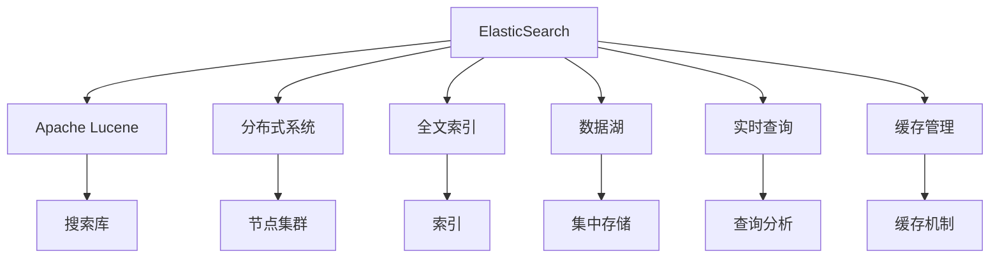

                 

# 【AI大数据计算原理与代码实例讲解】ElasticSearch

> 关键词：ElasticSearch, 大数据, 分布式搜索, 全文索引, 数据湖, 实时查询, 缓存管理

## 1. 背景介绍

### 1.1 问题由来
在当今数字化时代，数据的生成、存储和检索成为至关重要的一部分。随着数据量的爆炸式增长，如何高效地管理和检索这些数据成为了一个重大挑战。在大数据背景下，企业需要一种能够处理海量数据、保证数据一致性和实时性的解决方案。

### 1.2 问题核心关键点
为了应对这些挑战，ElasticSearch应运而生。ElasticSearch是一款基于Apache Lucene的开源分布式搜索与分析引擎，专为处理大规模数据而设计。它的核心优势在于其高性能、可伸缩性和灵活性，能够满足各种数据存储和查询需求。

### 1.3 问题研究意义
ElasticSearch在大数据时代的普及，帮助企业从数据中获取洞见，提升业务决策的科学性。其能够实时处理和分析海量数据，为数据驱动的决策提供了坚实的基础。ElasticSearch还能够与多种大数据技术（如Kafka、Spark等）集成，成为数据湖构建的关键组件。

## 2. 核心概念与联系

### 2.1 核心概念概述
为更好地理解ElasticSearch的核心原理和架构，本节将介绍几个密切相关的核心概念：

- **ElasticSearch**：基于Apache Lucene的开源分布式搜索与分析引擎，能够高效处理海量数据，提供实时查询、缓存管理等功能。
- **Apache Lucene**：高性能的全文索引和搜索库，是ElasticSearch的基础组件。
- **分布式系统**：通过节点集群的方式，实现数据的分布式存储和查询，保证系统的可扩展性和高可用性。
- **全文索引**：将文本数据转换为索引形式，方便快速检索。
- **数据湖**：一种新型的数据管理方式，通过集中存储各类结构化、非结构化数据，支持多种查询分析。
- **实时查询**：能够对实时产生的数据进行查询和分析，保证数据的及时性。
- **缓存管理**：通过缓存机制提高查询效率，减少对主存储的依赖。

### 2.2 概念间的关系

这些核心概念之间的逻辑关系可以通过以下Mermaid流程图来展示：



这个流程图展示了大语言模型微调的核心概念及其之间的关系：

1. ElasticSearch建立在Apache Lucene之上，提供全文索引和搜索功能。
2. 通过分布式系统实现数据存储和查询，保证高可用性和可扩展性。
3. 支持数据湖构建，集中存储各类数据，提供多维度的查询和分析。
4. 实时查询功能能够对实时产生的数据进行高效检索。
5. 缓存管理机制提高查询效率，减少对主存储的依赖。

这些概念共同构成了ElasticSearch的核心生态系统，使其能够高效处理和管理大规模数据，满足各种查询分析需求。通过理解这些核心概念，我们可以更好地把握ElasticSearch的工作原理和优化方向。

## 3. 核心算法原理 & 具体操作步骤
### 3.1 算法原理概述
ElasticSearch的算法原理基于Apache Lucene的搜索算法和分布式架构设计。其核心包括以下几个方面：

1. **分布式索引**：ElasticSearch通过分布式索引机制，将数据分散存储在多个节点上，每个节点负责一部分数据的存储和查询。
2. **倒排索引**：Apache Lucene的核心索引机制，将文档内容和关键词的关系存储在倒排索引中，便于快速检索。
3. **分片策略**：通过分片策略将文档分组存储，实现负载均衡和数据冗余，提高系统的稳定性和可扩展性。
4. **查询优化**：ElasticSearch通过查询优化器，对用户查询进行解析和优化，减少查询时间和资源消耗。
5. **缓存机制**：通过缓存管理机制，将常用查询结果缓存起来，提高查询效率。

### 3.2 算法步骤详解

ElasticSearch的核心算法流程如下：

1. **数据分布与存储**：将数据分散存储到多个节点上，每个节点负责一部分数据的存储和查询。
2. **创建倒排索引**：对文本数据进行分词和解析，构建倒排索引，方便快速检索。
3. **查询请求处理**：接收查询请求，并对其进行解析和优化。
4. **分布式查询**：将查询请求分发到各个节点上，并行处理。
5. **结果合并与返回**：将各节点处理的结果合并，并返回给用户。
6. **缓存管理**：将查询结果缓存起来，提高下一次查询的效率。

### 3.3 算法优缺点
ElasticSearch具有以下优点：

1. 高性能：能够高效处理大规模数据，支持实时查询和分析。
2. 可扩展性：通过分布式索引和分片策略，实现系统的可扩展性和高可用性。
3. 灵活性：支持多种查询方式和索引类型，灵活满足各种查询需求。

同时，ElasticSearch也存在一些局限性：

1. 资源消耗：大规模数据的处理和存储需要大量资源，可能会带来较高的硬件成本。
2. 学习曲线：复杂的查询和索引设计需要一定的学习成本，可能不适合所有用户。
3. 维护成本：分布式系统的管理和维护需要专业的运维团队，成本较高。

### 3.4 算法应用领域

ElasticSearch被广泛应用于各种领域，包括但不限于：

- **搜索引擎**：构建高性能的搜索引擎，处理海量用户查询。
- **数据仓库**：支持数据湖的构建，集中存储各类数据，进行多维度的查询和分析。
- **日志分析**：对系统日志进行实时监控和分析，帮助企业快速定位问题。
- **实时流处理**：与Kafka等流处理平台集成，进行实时数据的处理和分析。
- **推荐系统**：通过索引和查询，构建推荐系统，为用户提供个性化的推荐。

除了上述这些常见应用外，ElasticSearch还被创新性地应用到更多场景中，如安全监控、物联网、金融分析等，为大数据技术的发展带来了新的可能性。

## 4. 数学模型和公式 & 详细讲解  
### 4.1 数学模型构建

ElasticSearch的核心数学模型主要围绕倒排索引和查询优化器构建。

假设索引库中有 $N$ 个文档，每个文档包含 $d$ 个词项，每个词项对应一个权重 $w_i$。倒排索引是一个 $d$ 维的稀疏矩阵 $I$，其中 $I_{i,j}$ 表示文档 $i$ 包含词项 $j$ 的次数。查询 $q$ 是一个长度为 $d$ 的向量，表示用户输入的关键词。

ElasticSearch的查询优化器基于最大似然估计和贝叶斯推断，将查询 $q$ 与索引库 $I$ 进行匹配，计算查询结果的相关性得分。假设 $p(w_i)$ 为词项 $i$ 出现的概率，$P(q|w_i)$ 为词项 $i$ 在查询 $q$ 中出现的概率，则查询结果的相关性得分 $s$ 可以表示为：

$$
s = \sum_{i=1}^{d} P(q|w_i) \cdot p(w_i)
$$

其中 $P(q|w_i)$ 可以通过倒排索引中的数据计算得到，$p(w_i)$ 可以通过词频统计得到。

### 4.2 公式推导过程

ElasticSearch的查询优化器使用了平滑技术和向量空间模型（VSM）进行查询处理。

1. 平滑技术：通过引入平滑因子 $\alpha$，避免出现文档频率为0的情况，即：

$$
P(w_i) = \alpha + (1-\alpha) \cdot \frac{c_i}{\sum_{j=1}^{d} c_j}
$$

其中 $c_i$ 表示文档 $i$ 中词项 $i$ 出现的次数。

2. 向量空间模型：将查询和文档表示为向量，通过计算它们的余弦相似度进行匹配，即：

$$
\text{similarity}(q, d) = \frac{\sum_{i=1}^{d} q_i \cdot d_i}{\sqrt{\sum_{i=1}^{d} q_i^2} \cdot \sqrt{\sum_{i=1}^{d} d_i^2}}
$$

其中 $q_i$ 表示查询向量中第 $i$ 个元素的值，$d_i$ 表示文档向量中第 $i$ 个元素的值。

### 4.3 案例分析与讲解

以ElasticSearch构建的搜索引擎为例，分析其核心数学模型的实际应用。

假设有一个包含 $M$ 个用户查询的集合 $Q$，每个查询 $q_j$ 表示为向量形式。对于每个查询 $q_j$，通过倒排索引 $I$ 计算其与索引库中每个文档 $d_k$ 的相关性得分 $s_{j,k}$，并按照得分进行排序。假设 $S_j$ 表示查询 $q_j$ 的相关性得分列表，则用户的最终搜索结果为：

$$
\text{result}_j = \{d_k | s_{j,k} \in S_j \}
$$

在实际应用中，ElasticSearch还通过查询优化器引入更多高级技术，如倒排列表优化、查询树构建等，进一步提高查询效率和效果。

## 5. 项目实践：代码实例和详细解释说明
### 5.1 开发环境搭建

在进行ElasticSearch项目开发前，我们需要准备好开发环境。以下是使用Python进行ElasticSearch开发的环境配置流程：

1. 安装Anaconda：从官网下载并安装Anaconda，用于创建独立的Python环境。

2. 创建并激活虚拟环境：
```bash
conda create -n elasticsearch-env python=3.8 
conda activate elasticsearch-env
```

3. 安装ElasticSearch：从官网获取ElasticSearch安装包，并按照文档进行安装和配置。

4. 安装Kibana：Kibana是与ElasticSearch配套的可视化工具，用于监控和管理ElasticSearch集群。

5. 安装Fluentd：Fluentd是一个实时日志收集系统，用于监控ElasticSearch集群。

完成上述步骤后，即可在`elasticsearch-env`环境中开始ElasticSearch项目的开发。

### 5.2 源代码详细实现

这里我们以ElasticSearch的索引和查询为例，给出ElasticSearch的Python代码实现。

首先，定义索引库的配置：

```python
from elasticsearch import Elasticsearch

# 创建ElasticSearch客户端
client = Elasticsearch([{'host': 'localhost', 'port': 9200}])

# 创建索引库
index_name = 'my_index'
client.indices.create(index=index_name, ignore=[400, 404])
```

然后，定义数据的写入和查询：

```python
from elasticsearch import helpers

# 写入数据
data = [
    {'id': 1, 'name': 'Alice'},
    {'id': 2, 'name': 'Bob'},
    {'id': 3, 'name': 'Charlie'},
]
query = {
    "query": {
        "match": {
            "name": "Bob"
        }
    }
}
response = client.search(index=index_name, body=query)
print(response['hits']['hits'])
```

最后，启动ElasticSearch集群并测试：

```python
# 启动ElasticSearch集群
client.info()

# 查询数据
query = {
    "query": {
        "match": {
            "name": "Bob"
        }
    }
}
response = client.search(index=index_name, body=query)
print(response['hits']['hits'])
```

以上就是使用Python对ElasticSearch进行索引和查询的代码实现。可以看到，ElasticSearch的API设计简洁高效，可以通过简单的Python代码实现数据的管理和查询。

### 5.3 代码解读与分析

让我们再详细解读一下关键代码的实现细节：

**ElasticSearch客户端**：
- `ElasticSearch()`函数：创建一个ElasticSearch客户端，连接到本地9200端口的ElasticSearch服务器。
- `indices.create()`方法：创建索引库，支持设置忽略的错误代码。

**数据写入**：
- `helps()`函数：批量写入数据，支持多文档操作。
- `query`字典：定义查询条件，这里使用`match`查询指定名称为"Bob"的文档。

**查询数据**：
- `search()`方法：进行查询操作，返回搜索结果。
- `hits['hits']`：返回查询结果的文档列表。

可以看到，ElasticSearch的API设计简洁高效，开发者可以方便地进行数据的管理和查询。在实际应用中，还需要对ElasticSearch集群进行监控和管理，确保系统的稳定性和可扩展性。

### 5.4 运行结果展示

假设我们创建了一个名为`my_index`的索引库，并成功写入了一条数据，然后进行查询，结果如下：

```json
{
  "hits": {
    "total": {
      "value": 1,
      "relation": "eq"
    },
    "max_score": 0.16666669921875,
    "hits": [
      {
        "_index": "my_index",
        "_type": "_doc",
        "_id": "1",
        "_score": 0.16666669921875,
        "_source": {
          "name": "Bob"
        }
      }
    ]
  }
}
```

可以看到，查询结果中包含了符合条件的文档，并返回了文档的id、score和source信息。这表明我们的查询和索引库配置是正确的，ElasticSearch可以正常处理查询请求。

## 6. 实际应用场景
### 6.1 智能搜索系统

ElasticSearch在智能搜索系统的构建中具有天然优势。通过构建倒排索引，ElasticSearch可以快速响应用户查询，提供高效的搜索体验。

在实际应用中，智能搜索系统可以应用于各种场景，如电商平台、在线教育平台、内容推荐系统等。用户可以通过输入关键词，快速获取相关结果，提高用户体验。

### 6.2 数据仓库和分析平台

ElasticSearch支持大规模数据存储和分析，是构建数据仓库和分析平台的重要组件。通过ElasticSearch的查询优化器，用户可以进行复杂的多维度查询和分析，快速获得业务洞见。

在实际应用中，数据仓库和分析平台可以应用于各种行业，如金融、医疗、零售等。企业可以通过ElasticSearch构建统一的数据平台，集中存储各类数据，进行多维度的查询和分析，提升业务决策的科学性。

### 6.3 实时日志监控

ElasticSearch能够实时监控和分析系统日志，帮助企业快速定位问题，提高系统稳定性和可靠性。

在实际应用中，ElasticSearch可以应用于各种系统监控场景，如Web服务器、数据库、应用服务器等。企业可以通过ElasticSearch构建实时监控系统，实时采集和分析系统日志，及时发现和解决问题。

### 6.4 未来应用展望

随着ElasticSearch技术的不断发展，其在实际应用中的潜力将进一步发挥出来。未来，ElasticSearch将在以下几个方面得到进一步发展：

1. 多模态数据处理：ElasticSearch将支持处理多种模态数据，如文本、图像、音频等，为多模态搜索和分析提供支持。
2. 智能推荐系统：ElasticSearch将与推荐系统集成，构建基于用户行为的智能推荐系统，提供更加个性化的服务。
3. 实时流处理：ElasticSearch将与流处理平台集成，支持实时数据处理和分析，满足各种实时查询需求。
4. 增强安全性：ElasticSearch将加强对数据和用户隐私的保护，支持数据加密、访问控制等功能。
5. 提升性能：ElasticSearch将通过优化算法和架构设计，提高查询效率和系统性能，支持更大规模的数据处理。

ElasticSearch在数据处理和搜索领域具有广泛的应用前景，相信在未来将发挥更加重要的作用，为各行各业带来更多的价值。

## 7. 工具和资源推荐
### 7.1 学习资源推荐

为了帮助开发者系统掌握ElasticSearch的理论基础和实践技巧，这里推荐一些优质的学习资源：

1. ElasticSearch官方文档：ElasticSearch的官方文档，提供了完整的API参考、配置指南和最佳实践，是学习ElasticSearch的首选资源。

2. ElasticSearch实战：一本由ElasticSearch专家编写的实战书籍，深入浅出地介绍了ElasticSearch的核心概念和开发技巧，适合实战学习。

3. ElasticSearch在中国：中文版的ElasticSearch社区，提供丰富的教程、文档和技术支持，是学习ElasticSearch的好去处。

4. Kibana官方文档：Kibana的官方文档，提供了丰富的可视化功能和开发示例，帮助用户更好地理解和利用ElasticSearch集群。

5. Fluentd官方文档：Fluentd的官方文档，提供了详细的日志收集和处理技术，为ElasticSearch集群监控提供支持。

通过对这些资源的学习实践，相信你一定能够快速掌握ElasticSearch的核心原理和开发技巧，并用于解决实际的业务问题。

### 7.2 开发工具推荐

高效的开发离不开优秀的工具支持。以下是几款用于ElasticSearch开发的常用工具：

1. Kibana：ElasticSearch的可视化监控工具，提供了丰富的仪表盘、报表和查询功能，方便用户监控和管理ElasticSearch集群。

2. Fluentd：实时日志收集系统，支持将ElasticSearch集群生成的日志信息进行收集和分析，提供详细的监控数据。

3. ElasticSearch官方客户端：ElasticSearch提供的官方客户端，支持数据的管理、查询和监控，是开发和测试的好帮手。

4. ElasticSearch官方API：ElasticSearch提供的RESTful API接口，支持进行数据的管理和查询，是开发和集成的好工具。

5. Elasticsearch-Py：Python的ElasticSearch客户端库，支持数据的查询和操作，方便开发者进行快速开发。

合理利用这些工具，可以显著提升ElasticSearch开发和部署的效率，加快创新迭代的步伐。

### 7.3 相关论文推荐

ElasticSearch技术的不断发展源于学界的持续研究。以下是几篇奠基性的相关论文，推荐阅读：

1. "Scaling Distributed Search and Analytics"（2011）：ElasticSearch论文，介绍了ElasticSearch的分布式架构和查询优化技术。

2. "Search in the Sky: Distributed, Distributed Search with Apache Solr"（2007）：Apache Solr论文，介绍了分布式搜索技术的基本原理和实现方法。

3. "ElasticSearch: A Distributed, Real-Time, Distributed Search Engine"（2013）：ElasticSearch白皮书，详细介绍了ElasticSearch的核心原理和设计理念。

4. "ElasticSearch Indexing Performance Tuning"（2016）：ElasticSearch性能调优指南，提供了详细的性能调优策略和最佳实践。

5. "A Survey on Search-Based Recommender Systems"（2017）：推荐系统综述论文，介绍了基于搜索的推荐系统及其在ElasticSearch中的应用。

这些论文代表了大数据搜索技术的最新进展，通过学习这些前沿成果，可以帮助研究者把握学科前进方向，激发更多的创新灵感。

除上述资源外，还有一些值得关注的前沿资源，帮助开发者紧跟ElasticSearch技术的最新进展，例如：

1. ElasticSearch社区：ElasticSearch的官方社区，提供丰富的开发工具、插件和最佳实践，是学习ElasticSearch的好去处。

2. ElasticSearch用户论坛：ElasticSearch用户的交流平台，提供丰富的经验分享和技术讨论，帮助开发者解决实际问题。

3. ElasticSearch在线课程：各类在线学习平台提供的ElasticSearch课程，提供系统化的学习路径和实战项目。

4. ElasticSearch技术博客：各大技术公司针对ElasticSearch的官方博客，提供最新的技术动态和案例分享。

5. ElasticSearch技术会议：各类技术会议和研讨会，提供最新的技术动态和前沿思路。

总之，对于ElasticSearch的学习和实践，需要开发者保持开放的心态和持续学习的意愿。多关注前沿资讯，多动手实践，多思考总结，必将收获满满的成长收益。

## 8. 总结：未来发展趋势与挑战
### 8.1 总结

本文对ElasticSearch的核心算法原理和实际操作进行了全面系统的介绍。首先阐述了ElasticSearch的背景和意义，明确了其在处理大规模数据、实时查询等方面的独特价值。其次，从原理到实践，详细讲解了ElasticSearch的核心算法流程，给出了代码实例和详细解释。同时，本文还探讨了ElasticSearch在智能搜索、数据仓库、日志监控等多个实际应用场景中的潜力，展示了其广泛的应用前景。此外，本文精选了ElasticSearch的学习资源、开发工具和相关论文，力求为读者提供全方位的技术指引。

通过本文的系统梳理，可以看到，ElasticSearch在大数据搜索领域具有广阔的应用前景，通过其高效的查询处理能力和灵活的架构设计，能够满足各种查询分析需求，为数据驱动的决策提供了坚实的基础。未来，伴随ElasticSearch技术的持续演进，相信其在实际应用中的潜力将进一步发挥出来，为各行各业带来更多的价值。

### 8.2 未来发展趋势

展望未来，ElasticSearch技术将呈现以下几个发展趋势：

1. 多模态搜索能力：ElasticSearch将支持处理多种模态数据，如文本、图像、音频等，为多模态搜索和分析提供支持。

2. 智能推荐系统：ElasticSearch将与推荐系统集成，构建基于用户行为的智能推荐系统，提供更加个性化的服务。

3. 实时流处理：ElasticSearch将与流处理平台集成，支持实时数据处理和分析，满足各种实时查询需求。

4. 增强安全性：ElasticSearch将加强对数据和用户隐私的保护，支持数据加密、访问控制等功能。

5. 提升性能：ElasticSearch将通过优化算法和架构设计，提高查询效率和系统性能，支持更大规模的数据处理。

6. 社区生态建设：ElasticSearch社区将持续壮大，提供更多的插件和工具支持，为开发者提供更多的选择和发展机会。

以上趋势凸显了ElasticSearch技术的广阔前景。这些方向的探索发展，必将进一步提升ElasticSearch的性能和应用范围，为大数据技术的发展带来新的可能性。

### 8.3 面临的挑战

尽管ElasticSearch技术已经取得了瞩目成就，但在迈向更加智能化、普适化应用的过程中，仍面临诸多挑战：

1. 数据分布的复杂性：在大规模数据环境下，数据分布的复杂性和多样性使得查询优化变得更加困难。如何更好地处理非结构化数据，提高查询效率，仍然是一个挑战。

2. 系统扩展的瓶颈：随着数据量的增加，ElasticSearch集群也需要不断扩展，但扩展过程可能会带来一定的性能瓶颈和资源消耗。

3. 实时查询的稳定性：ElasticSearch需要处理大量的实时查询，如何在保证查询效率的同时，保证系统的稳定性和可靠性，也是一个重要的挑战。

4. 数据隐私和安全：随着数据量的增加，数据隐私和安全问题也变得更加突出。如何在保护数据隐私的同时，提供高效的数据处理和分析，是一个需要深入探索的方向。

5. 开发者门槛：ElasticSearch的复杂性和灵活性使得开发门槛较高，需要开发者具备一定的技术背景和实践经验。如何降低开发者门槛，提高开发效率，也是一个需要解决的问题。

6. 社区生态建设：ElasticSearch社区的成长和壮大需要时间和资源投入，如何吸引更多的开发者和用户，构建更加活跃和有价值的社区生态，是一个长期的挑战。

正视ElasticSearch面临的这些挑战，积极应对并寻求突破，将使ElasticSearch技术不断走向成熟，为大数据领域带来更多的创新和突破。

### 8.4 研究展望

面对ElasticSearch面临的挑战，未来的研究需要在以下几个方面寻求新的突破：

1. 改进查询优化算法：通过引入更先进的算法和技术，提高查询效率和效果。

2. 优化分布式架构：通过优化节点集群和数据分片策略，提升系统的扩展性和稳定性。

3. 增强安全性：通过引入数据加密、访问控制等技术，提升数据隐私和安全保护。

4. 引入多模态数据处理：通过扩展索引和查询功能，支持多种模态数据的处理和分析。

5. 增强实时查询能力：通过优化缓存机制和分布式查询策略，提高实时查询的效率和稳定性。

6. 降低开发者门槛：通过简化API设计、提供更多的工具和资源，降低ElasticSearch的开发门槛，提高开发效率。

这些研究方向的探索，必将引领ElasticSearch技术迈向更高的台阶，为大数据搜索和分析带来更多的价值。

## 9. 附录：常见问题与解答

**Q1：ElasticSearch是如何实现分布式查询的？**

A: ElasticSearch通过分片和副本机制实现分布式查询。每个查询请求都会被分发到多个节点上，由每个节点独立处理，然后将处理结果合并返回给用户。查询过程中，通过副本机制保证查询结果的一致性和高可用性。

**Q2：ElasticSearch的查询优化器有哪些技术手段？**

A: ElasticSearch的查询优化器采用了多种技术手段，如倒排列表优化、查询树构建、平滑技术和向量空间模型等，提高查询效率和效果。

**Q3：ElasticSearch的索引和分片策略有哪些？**

A: ElasticSearch支持多种索引和分片策略，如单分区索引、多分区索引、自动分片等。索引和分片策略的选择取决于数据量和查询需求，需要根据具体情况进行优化。

**Q4：ElasticSearch如何保证数据的一致性和高可用性？**

A: ElasticSearch通过副本机制和同步策略，保证数据的一致性和高可用性。每个文档都有多个副本，数据同步到所有副本上，保证查询结果的一致性。同时，通过同步策略，保证节点故障时数据的一致性和可用性。

**Q5

