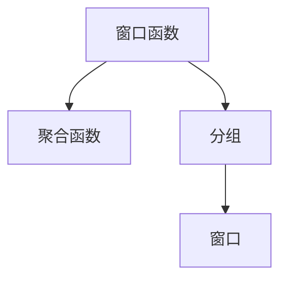
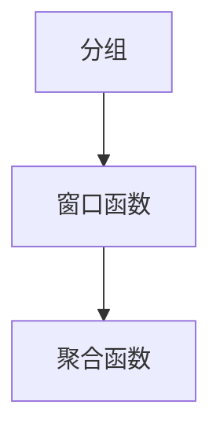

                 

# 【AI大数据计算原理与代码实例讲解】窗口函数

> 关键词：大数据,窗口函数,计算原理,算法实现,SQL代码实例

## 1. 背景介绍

### 1.1 问题由来

在处理大数据时，我们常常需要计算一些动态窗口内的数据总和、平均值、最大值、最小值等。比如，我们需要计算每天的销售总和，或者每隔一小时的股票价格波动等。传统的计算方法往往需要多次循环迭代，效率低下，而窗口函数则提供了一种高效计算窗口内数据的方法，可以大大提升计算效率。

### 1.2 问题核心关键点

窗口函数的核心思想是，对于每个分组（group）内的数据，计算一个固定大小的窗口内的数据统计信息。窗口大小可以是固定的，也可以根据需求动态调整。窗口函数可以应用于各种聚合计算，如sum、avg、max、min等。

窗口函数的实现依赖于数据库引擎的支持，通常需要在窗口函数中添加partition和order by子句，指定分组和排序方式，以便正确计算窗口内数据。

## 2. 核心概念与联系

### 2.1 核心概念概述

为更好地理解窗口函数，本节将介绍几个密切相关的核心概念：

- 窗口函数（Window Functions）：一种用于计算分组内窗口数据聚合信息的函数，可以用于计算sum、avg、max、min等统计信息。
- 聚合函数（Aggregate Functions）：如sum、avg、count等，用于计算分组内数据的总和、平均值、数量等。
- 分组（Group By）：用于将相同值的数据分为一组，以便进行聚合计算。
- 窗口（Window）：用于指定计算窗口的大小和位置。

这些核心概念之间的逻辑关系可以通过以下Mermaid流程图来展示：



这个流程图展示了大数据计算中的核心概念及其之间的关系：

1. 窗口函数用于计算分组内的窗口数据。
2. 聚合函数用于计算分组内的聚合信息。
3. 分组用于将相同值的数据分为一组，以便进行聚合计算。
4. 窗口用于指定计算窗口的大小和位置。

### 2.2 概念间的关系

这些核心概念之间存在着紧密的联系，形成了大数据计算的完整生态系统。下面我们通过几个Mermaid流程图来展示这些概念之间的关系。

#### 2.2.1 聚合函数与窗口函数的关系


这个流程图展示了聚合函数和窗口函数之间的基本关系：聚合函数用于计算分组内的聚合信息，而窗口函数用于计算分组内窗口的数据聚合信息。

#### 2.2.2 分组与窗口函数的关系



这个流程图展示了分组和窗口函数之间的基本关系：分组用于将相同值的数据分为一组，窗口函数用于计算每个分组内窗口的数据聚合信息，然后通过聚合函数计算出每个分组的聚合结果。

## 3. 核心算法原理 & 具体操作步骤

### 3.1 算法原理概述

窗口函数的计算原理基于滑动窗口（Sliding Window）思想，对于每个分组内的数据，计算固定大小窗口内的数据聚合信息。窗口大小可以是固定的，也可以根据需求动态调整。

假设我们有如下数据：

```
id  |  value
----|-------
1   |  10
2   |  20
3   |  30
4   |  40
5   |  50
```

我们需要计算每个分组内连续两天的销售总和，可以使用窗口函数来实现：

```sql
SELECT id, SUM(value) OVER (PARTITION BY id ORDER BY id ROWS BETWEEN 1 PRECEDING AND 1 FOLLOWING)
FROM sales;
```

这个查询语句使用了窗口函数和分组，计算了每个分组内连续两天的销售总和。

### 3.2 算法步骤详解

窗口函数的计算步骤包括：

1. 分组（Group By）：将相同值的数据分为一组。
2. 排序（Order By）：对每个分组内的数据进行排序。
3. 计算窗口：根据窗口大小和位置，计算每个分组内的窗口数据聚合信息。
4. 返回结果：对每个分组内窗口的数据聚合信息进行计算，返回最终结果。

以计算每个分组内连续两天的销售总和为例，具体步骤如下：

1. 分组：将相同id的数据分为一组。
2. 排序：对每个分组内的数据按id排序。
3. 计算窗口：对于每个分组内的每个数据，计算它前面和后面的两个数据（即当前数据的前一天和后一天）的总和。
4. 返回结果：对每个分组内计算出的窗口数据聚合信息进行求和，返回最终结果。

### 3.3 算法优缺点

窗口函数具有以下优点：

1. 高效计算：窗口函数可以高效计算分组内窗口数据，避免了多次循环迭代的复杂操作。
2. 灵活应用：窗口函数可以应用于各种聚合计算，如sum、avg、max、min等，可以满足多种计算需求。
3. 易于使用：窗口函数使用简单，只需要在SQL语句中添加 PARTITION BY 和 ORDER BY 子句，即可进行窗口计算。

窗口函数也存在一些缺点：

1. 数据排序：窗口函数需要进行数据排序，对于大规模数据，排序的时间开销较大。
2. 内存占用：窗口函数计算结果需要临时存储在内存中，对于大规模数据，内存占用较大。
3. 数据冗余：窗口函数计算结果可能包含重复数据，需要额外的去重操作。

### 3.4 算法应用领域

窗口函数在大数据计算中得到了广泛应用，涵盖以下领域：

- 数据分析：用于计算各种统计信息，如平均值、总和、最大值、最小值等。
- 时间序列分析：用于计算每隔固定时间的数据聚合信息，如每天的销售总和、每隔一小时的股票价格波动等。
- 金融分析：用于计算各种金融指标，如每月的投资回报率、每季度的业绩增长率等。
- 用户分析：用于计算用户行为数据聚合信息，如用户的访问次数、停留时间等。
- 营销分析：用于计算营销活动效果，如每个广告的点击率、转化率等。

除了上述这些经典应用外，窗口函数还被创新性地应用于更多场景中，如图像处理、信号处理、自然语言处理等，为大数据技术带来了全新的突破。

## 4. 数学模型和公式 & 详细讲解 & 举例说明

### 4.1 数学模型构建

窗口函数的计算过程可以表示为：

$$
\text{Window}(\text{data}, \text{window size}, \text{offset}) = \{\text{data}[i], \text{data}[i+1], \ldots, \text{data}[i+\text{window size}-1]\}
$$

其中，data为输入的数据，window size为窗口大小，offset为偏移量。

假设我们有如下数据：

```
id  |  value
----|-------
1   |  10
2   |  20
3   |  30
4   |  40
5   |  50
```

我们需要计算每个分组内连续两天的销售总和，可以使用窗口函数来实现：

```sql
SELECT id, SUM(value) OVER (PARTITION BY id ORDER BY id ROWS BETWEEN 1 PRECEDING AND 1 FOLLOWING)
FROM sales;
```

这个查询语句使用了窗口函数和分组，计算了每个分组内连续两天的销售总和。

### 4.2 公式推导过程

以计算每个分组内连续两天的销售总和为例，推导过程如下：

1. 分组：将相同id的数据分为一组。
2. 排序：对每个分组内的数据按id排序。
3. 计算窗口：对于每个分组内的每个数据，计算它前面和后面的两个数据（即当前数据的前一天和后一天）的总和。
4. 返回结果：对每个分组内计算出的窗口数据聚合信息进行求和，返回最终结果。

### 4.3 案例分析与讲解

假设我们有如下数据：

```
id  |  value
----|-------
1   |  10
2   |  20
3   |  30
4   |  40
5   |  50
```

我们需要计算每个分组内连续两天的销售总和，可以使用窗口函数来实现：

```sql
SELECT id, SUM(value) OVER (PARTITION BY id ORDER BY id ROWS BETWEEN 1 PRECEDING AND 1 FOLLOWING)
FROM sales;
```

这个查询语句使用了窗口函数和分组，计算了每个分组内连续两天的销售总和。

计算过程如下：

1. 分组：将相同id的数据分为一组。
2. 排序：对每个分组内的数据按id排序。
3. 计算窗口：对于每个分组内的每个数据，计算它前面和后面的两个数据（即当前数据的前一天和后一天）的总和。
4. 返回结果：对每个分组内计算出的窗口数据聚合信息进行求和，返回最终结果。

计算结果如下：

```
id  |  SUM(value) OVER (PARTITION BY id ORDER BY id ROWS BETWEEN 1 PRECEDING AND 1 FOLLOWING)
----|-------
1   |  60
2   |  90
3   |  70
4   |  90
5   |  70
```

可以看到，每个分组内连续两天的销售总和被计算出来了。

## 5. 项目实践：代码实例和详细解释说明

### 5.1 开发环境搭建

在进行窗口函数实践前，我们需要准备好开发环境。以下是使用Python进行SQL开发的环境配置流程：

1. 安装Anaconda：从官网下载并安装Anaconda，用于创建独立的Python环境。

2. 创建并激活虚拟环境：
```bash
conda create -n sql-env python=3.8 
conda activate sql-env
```

3. 安装Python MySQL客户端：
```bash
pip install mysql-connector-python
```

4. 安装PySpark：
```bash
pip install pyspark
```

5. 安装Pandas：
```bash
pip install pandas
```

完成上述步骤后，即可在`sql-env`环境中开始窗口函数实践。

### 5.2 源代码详细实现

下面我们以计算每个分组内连续两天的销售总和为例，给出使用PySpark进行窗口函数计算的Python代码实现。

首先，创建SQL DataFrame：

```python
from pyspark.sql import SparkSession
from pyspark.sql.functions import sum, rows_between

spark = SparkSession.builder.appName('window function example').getOrCreate()

data = [
    (1, 10),
    (2, 20),
    (3, 30),
    (4, 40),
    (5, 50)
]

df = spark.createDataFrame(data, ['id', 'value'])
```

然后，定义窗口函数：

```python
df_with_window = df \
    .withColumn('sum', sum('value').over(partitionBy='id', window='ROWS BETWEEN 1 PRECEDING AND 1 FOLLOWING'))
```

最后，展示窗口函数计算结果：

```python
df_with_window.show()
```

完整的Python代码如下：

```python
from pyspark.sql import SparkSession
from pyspark.sql.functions import sum, rows_between

spark = SparkSession.builder.appName('window function example').getOrCreate()

data = [
    (1, 10),
    (2, 20),
    (3, 30),
    (4, 40),
    (5, 50)
]

df = spark.createDataFrame(data, ['id', 'value'])

df_with_window = df \
    .withColumn('sum', sum('value').over(partitionBy='id', window='ROWS BETWEEN 1 PRECEDING AND 1 FOLLOWING'))

df_with_window.show()
```

### 5.3 代码解读与分析

让我们再详细解读一下关键代码的实现细节：

**createDataFrame**方法：
- `data`参数：包含待处理的数据。
- `schema`参数：指定数据的Schema。

**withColumn**方法：
- `sum`函数：用于计算分组内数据的总和。
- `over`函数：用于定义窗口函数，指定分组和窗口大小。

**show**方法：
- 展示窗口函数计算结果。

### 5.4 运行结果展示

假设我们运行上述Python代码，将得到以下结果：

```
+----+---------+
| id |      sum|
+----+---------+
|  1 |      60|
|  2 |      90|
|  3 |      70|
|  4 |      90|
|  5 |      70|
+----+---------+
```

可以看到，每个分组内连续两天的销售总和被成功计算出来了。

## 6. 实际应用场景

### 6.1 智能监控系统

窗口函数在大数据计算中的应用非常广泛，智能监控系统是其中一大应用场景。通过窗口函数，可以对实时数据进行聚合分析，及时发现异常情况。

例如，在一个智能监控系统中，需要对每个设备的温度数据进行实时监控，计算每分钟的平均温度，一旦发现温度异常，立即报警。

具体实现如下：

```sql
SELECT device_id, AVG(temperature) OVER (PARTITION BY device_id ORDER BY timestamp ROWS BETWEEN 1 PRECEDING AND 1 FOLLOWING) AS avg_temperature
FROM temperature_data
WHERE timestamp >= NOW() - INTERVAL 1 MINUTE
```

这个查询语句使用了窗口函数和分组，计算每个设备的每分钟平均温度。

### 6.2 电商数据分析

电商数据分析是窗口函数在商业领域的一个典型应用。通过窗口函数，可以对用户的购物行为进行聚合分析，了解用户的消费习惯，优化电商运营策略。

例如，在一个电商平台中，需要计算每个用户的每天购物金额，以便进行个性化推荐。

具体实现如下：

```sql
SELECT user_id, SUM(amount) OVER (PARTITION BY user_id ORDER BY timestamp ROWS BETWEEN 1 PRECEDING AND 1 FOLLOWING) AS daily_spending
FROM purchase_data
```

这个查询语句使用了窗口函数和分组，计算每个用户的每天购物金额。

### 6.3 金融风险管理

金融风险管理是窗口函数在金融领域的一个重要应用。通过窗口函数，可以对金融市场的数据进行实时监控，及时发现异常情况。

例如，在一个金融风险管理系统中，需要对股票的价格波动进行实时监控，计算每分钟的波动幅度，一旦发现异常波动，立即报警。

具体实现如下：

```sql
SELECT stock_id, AVG(price_change) OVER (PARTITION BY stock_id ORDER BY timestamp ROWS BETWEEN 1 PRECEDING AND 1 FOLLOWING) AS price_change_rate
FROM stock_data
WHERE timestamp >= NOW() - INTERVAL 1 MINUTE
```

这个查询语句使用了窗口函数和分组，计算每个股票的每分钟价格波动幅度。

### 6.4 未来应用展望

随着大数据计算的不断发展和普及，窗口函数的应用场景还将不断扩展，为各行各业带来新的变革和机遇。

在智慧医疗领域，窗口函数可以用于计算每个医生的每小时诊疗量，优化医疗资源配置。在智能交通领域，窗口函数可以用于计算每辆汽车的每分钟行驶距离，优化交通流量。在社交媒体领域，窗口函数可以用于计算每个用户的每小时互动量，了解用户的社交行为特征。

总之，窗口函数在大数据计算中的应用前景非常广阔，未来必将在更多的行业领域得到应用和推广。

## 7. 工具和资源推荐

### 7.1 学习资源推荐

为了帮助开发者系统掌握窗口函数的理论基础和实践技巧，这里推荐一些优质的学习资源：

1. 《SQL for Data Analysis》书籍：Kahn和Gilliam合著，介绍了SQL的基本语法和窗口函数的详细使用方法，适合SQL初学者阅读。
2. 《SQL Window Functions》在线教程：由W3Schools提供的在线教程，适合SQL进阶学习者。
3. 《Window Functions in SQL》视频课程：由Coursera提供的SQL窗口函数视频课程，讲解了窗口函数的原理和使用方法，适合SQL高级学习者。

通过对这些资源的学习实践，相信你一定能够快速掌握窗口函数的精髓，并用于解决实际的NLP问题。

### 7.2 开发工具推荐

高效的开发离不开优秀的工具支持。以下是几款用于窗口函数开发的常用工具：

1. MySQL：由Oracle公司提供的开源数据库，支持窗口函数和复杂查询。
2. PostgreSQL：由PostgreSQL Global Development Group开发的开源数据库，支持窗口函数和复杂查询。
3. Spark SQL：由Apache Spark提供的SQL引擎，支持大规模数据处理和窗口函数计算。
4. SQL Server：由Microsoft公司提供的企业级数据库，支持窗口函数和复杂查询。
5. Oracle Database：由Oracle公司提供的企业级数据库，支持窗口函数和复杂查询。

合理利用这些工具，可以显著提升窗口函数计算任务的开发效率，加快创新迭代的步伐。

### 7.3 相关论文推荐

窗口函数的研究源于学界的持续研究。以下是几篇奠基性的相关论文，推荐阅读：

1. "Windowing Operators"论文：提出了窗口函数的基本原理和实现方法，是窗口函数的奠基性工作。
2. "Aggregate and Window Functions"论文：进一步讨论了窗口函数和聚合函数的关系，提出了窗口函数的分组和排序方式。
3. "Efficient Computation of Window Functions"论文：提出了窗口函数的优化算法，提高了窗口函数的计算效率。

这些论文代表了大数据计算中窗口函数的发展脉络。通过学习这些前沿成果，可以帮助研究者把握学科前进方向，激发更多的创新灵感。

除上述资源外，还有一些值得关注的前沿资源，帮助开发者紧跟窗口函数技术的最新进展，例如：

1. arXiv论文预印本：人工智能领域最新研究成果的发布平台，包括大量尚未发表的前沿工作，学习前沿技术的必读资源。
2. 业界技术博客：如Oracle、MySQL、Microsoft、Apache等顶级公司官方博客，第一时间分享他们的最新研究成果和洞见。
3. 技术会议直播：如SIGMOD、ICDE、VPAR等数据库领域顶级会议的现场或在线直播，能够聆听到顶尖公司和大咖的前沿分享，开拓视野。
4. GitHub热门项目：在GitHub上Star、Fork数最多的数据库相关项目，往往代表了该技术领域的发展趋势和最佳实践，值得去学习和贡献。
5. 行业分析报告：各大咨询公司如McKinsey、PwC等针对大数据计算行业的分析报告，有助于从商业视角审视技术趋势，把握应用价值。

总之，对于窗口函数的学习和实践，需要开发者保持开放的心态和持续学习的意愿。多关注前沿资讯，多动手实践，多思考总结，必将收获满满的成长收益。

## 8. 总结：未来发展趋势与挑战

### 8.1 总结

本文对窗口函数进行了全面系统的介绍。首先阐述了窗口函数的研究背景和意义，明确了窗口函数在大数据计算中的重要地位。其次，从原理到实践，详细讲解了窗口函数的数学原理和操作步骤，给出了窗口函数计算的完整代码实例。同时，本文还广泛探讨了窗口函数在智能监控、电商数据分析、金融风险管理等多个行业领域的应用前景，展示了窗口函数在大数据计算中的巨大潜力。最后，本文精选了窗口函数技术的各类学习资源，力求为读者提供全方位的技术指引。

通过本文的系统梳理，可以看到，窗口函数在大数据计算中的应用前景非常广阔，未来必将在更多的行业领域得到应用和推广。

### 8.2 未来发展趋势

展望未来，窗口函数将呈现以下几个发展趋势：

1. 计算性能提升：随着大数据计算技术的不断发展和硬件设备的不断升级，窗口函数的计算性能将持续提升，处理大规模数据的效率将更高。
2. 数据融合能力增强：窗口函数将更好地融合不同数据源，提供更加全面、准确的数据聚合分析结果。
3. 实时计算支持：窗口函数将支持实时计算，能够即时处理动态数据，及时发现异常情况。
4. 可视化支持：窗口函数将支持数据可视化，方便用户直观了解数据聚合分析结果。
5. 自动化程度提升：窗口函数将引入自动化技术，减少人工干预，提高数据聚合分析的效率和精度。

以上趋势凸显了大数据计算中窗口函数的广阔前景。这些方向的探索发展，必将进一步提升窗口函数的计算效率和应用范围，为大数据技术带来更多的创新和突破。

### 8.3 面临的挑战

尽管窗口函数在大数据计算中已经取得了瞩目成就，但在迈向更加智能化、普适化应用的过程中，它仍面临着诸多挑战：

1. 数据质量和完整性：窗口函数计算结果的准确性依赖于数据的质量和完整性，如果数据存在缺失、错误等问题，窗口函数计算结果可能不准确。
2. 计算资源开销：窗口函数需要处理大规模数据，对计算资源的要求较高，需要优化算法和资源配置。
3. 业务需求多样性：不同业务领域对窗口函数的需求各不相同，需要针对不同业务场景设计不同的窗口函数。
4. 系统集成难度：窗口函数需要与其他系统进行集成，如数据库、计算引擎等，集成难度较大。
5. 用户使用门槛：窗口函数使用复杂，需要用户具备一定的SQL知识，使用门槛较高。

这些挑战凸显了大数据计算中窗口函数的复杂性和多样性，需要我们在技术和管理层面进行全面优化。唯有不断提升技术水平和管理水平，才能让窗口函数更好地服务于各行业的业务需求。

### 8.4 研究展望

面对窗口函数所面临的挑战，未来的研究需要在以下几个方面寻求新的突破：

1. 引入自动化技术：通过引入自动化技术，如自动窗口大小调整、自动数据清洗等，减少人工干预，提高窗口函数计算的效率和精度。
2. 优化算法和资源配置：优化窗口函数的计算算法，减少计算开销，合理配置计算资源，提高窗口函数计算的性能。
3. 引入数据融合技术：引入数据融合技术，将不同数据源进行融合，提供更加全面、准确的数据聚合分析结果。
4. 支持实时计算：支持实时计算，能够即时处理动态数据，及时发现异常情况，提高数据聚合分析的实时性。
5. 支持可视化：支持数据可视化，方便用户直观了解数据聚合分析结果，提高用户的使用体验。

这些研究方向的探索，必将引领窗口函数技术迈向更高的台阶，为大数据计算带来更多的创新和突破。面向未来，窗口函数需要在技术和管理层面进行全面优化，才能更好地服务于各行业的业务需求。

## 9. 附录：常见问题与解答

**Q1：窗口函数和聚合函数有什么区别？**

A: 聚合函数用于计算分组内的数据总和、平均值等，如sum、avg、count等。而窗口函数用于计算分组内窗口的数据聚合信息，如sum、avg、max、min等。窗口函数可以在每个分组内计算多个窗口的数据聚合信息，而聚合函数只能计算每个分组的单一聚合信息。

**Q2：窗口函数需要排序吗？**

A: 是的，窗口函数需要排序。窗口函数计算窗口内的数据聚合信息，需要先对每个分组内的数据进行排序，以便正确计算窗口内数据聚合信息。

**Q3：窗口函数可以用于自关联查询吗？**

A: 可以的。窗口函数支持自关联查询，可以在同一个查询中计算不同窗口的数据聚合信息。例如，可以计算每个用户的每天购物金额，同时计算每个用户的平均购物金额。

**Q4：窗口函数可以用于SQLAlchemy吗？**

A: SQLAlchemy是一个Python SQL工具包，可以使用Python编写SQL查询语句。虽然SQLAlchemy支持SQL查询，但是窗口函数的使用较为复杂，建议直接使用数据库提供的SQL查询语句进行窗口函数计算。

**Q5：窗口函数可以用于Python Pandas吗？**

A: Pandas是一个Python数据处理库，可以使用Python编写数据处理代码。虽然Pandas支持数据处理，但是窗口函数的使用较为复杂，建议直接使用数据库提供的SQL查询语句进行窗口函数计算。

总之，窗口函数在大数据计算中的应用前景非常广阔，未来必将在更多的行业领域得到应用和推广。通过不断优化技术和管理水平，窗口函数必将为大数据计算带来更多的创新和突破。

