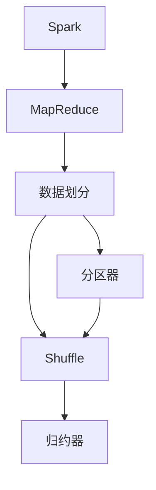
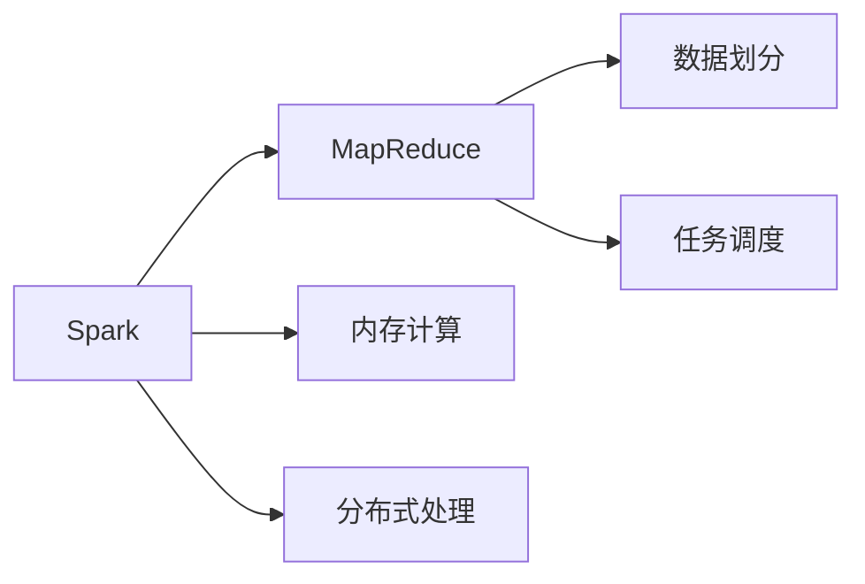
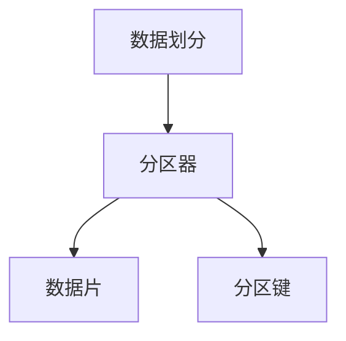
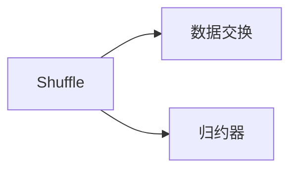
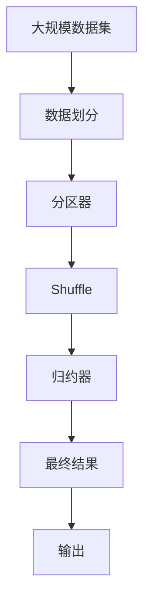

                 

# Spark Shuffle原理与代码实例讲解

> 关键词：Spark, shuffle, MapReduce, 数据划分, 分布式处理, 内存管理, 优化

## 1. 背景介绍

### 1.1 问题由来
在现代大数据处理中，MapReduce模型因其良好的可扩展性和容错性，成为处理大规模数据集的标准技术。然而，在大规模数据处理过程中，数据的分布和局部性问题对性能影响显著。Spark Shuffle机制作为MapReduce模型的一个重要组成部分，通过优化数据分布和局部性，显著提升了数据处理的效率。

### 1.2 问题核心关键点
Spark Shuffle机制的核心思想是将大规模数据集进行有序的分布式处理，实现数据的高效并行化。其基本流程包括数据划分、任务分配、数据交换和合并等步骤。Spark Shuffle机制涉及多个核心概念，如分区、任务、分区器、归约器等。

## 2. 核心概念与联系

### 2.1 核心概念概述

为了更好地理解Spark Shuffle机制，本节将介绍几个密切相关的核心概念：

- Spark：一种快速的通用大数据处理引擎，基于内存计算和分布式并行处理技术，支持Hadoop的API，同时也提供了更高级的分布式算法和机器学习库。
- MapReduce：一种分布式编程模型，用于大规模数据集的并行化处理。其核心思想是将问题分解成Map和Reduce两个步骤。
- Shuffle：MapReduce模型中的一个重要操作，用于数据的分片和有序分布。
- 数据划分：将大规模数据集划分为若干小规模的数据片，便于并行处理。
- 分区器：用于确定如何将数据片分配给不同的节点进行处理。
- 归约器：用于对分区数据进行聚合操作，如求和、计数等。

这些核心概念之间的逻辑关系可以通过以下Mermaid流程图来展示：



这个流程图展示了Spark Shuffle机制的基本流程：

1. 将大规模数据集划分成长度适中的数据片。
2. 根据分区器将数据片分配给不同的节点进行处理。
3. 在数据交换阶段，节点间通过Shuffle操作进行数据传输。
4. 归约器对数据片进行聚合操作，实现最终结果。

### 2.2 概念间的关系

这些核心概念之间存在着紧密的联系，构成了Spark Shuffle机制的整体架构。下面我们通过几个Mermaid流程图来展示这些概念之间的关系。

#### 2.2.1 Spark与MapReduce的关系



这个流程图展示了Spark与MapReduce的关系：

1. Spark基于MapReduce模型，引入了内存计算和分布式并行处理的特性。
2. Spark的数据划分和任务调度机制优化了MapReduce的数据传输和任务执行，提高了处理效率。

#### 2.2.2 数据划分与分区器



这个流程图展示了数据划分和分区器之间的关系：

1. 数据划分将大规模数据集划分为若干小规模的数据片。
2. 分区器根据数据片的特征，决定如何将其分配给不同的节点进行处理。
3. 分区器通常根据某些键值（如哈希键）将数据片映射到相应的分区上。

#### 2.2.3 Shuffle与归约器



这个流程图展示了Shuffle和归约器之间的关系：

1. Shuffle操作用于节点间的数据交换，实现数据的分布和有序。
2. 归约器对分区数据进行聚合操作，如求和、计数等。

### 2.3 核心概念的整体架构

最后，我们用一个综合的流程图来展示这些核心概念在大规模数据处理中的整体架构：



这个综合流程图展示了Spark Shuffle机制在大规模数据处理中的整体流程：

1. 将大规模数据集划分为若干小规模的数据片。
2. 根据分区器将数据片分配给不同的节点进行处理。
3. 节点间通过Shuffle操作进行数据交换。
4. 归约器对分区数据进行聚合操作，实现最终结果。

通过这些流程图，我们可以更清晰地理解Spark Shuffle机制的工作原理和优化策略，为后续深入讨论具体的微调方法打下基础。

## 3. 核心算法原理 & 具体操作步骤
### 3.1 算法原理概述

Spark Shuffle机制的基本原理是基于MapReduce模型的数据划分和任务调度。其核心步骤包括数据划分、分区器选择、Shuffle操作、归约器聚合等。

#### 3.1.1 数据划分
数据划分是Spark Shuffle机制的第一步，即将大规模数据集划分为若干小规模的数据片。在Spark中，数据划分主要通过分区器（Partitioner）来实现。分区器根据数据集的特征，将数据片分配给不同的节点进行处理。

#### 3.1.2 分区器选择
分区器是Spark Shuffle机制中的关键组件，用于确定如何将数据片分配给不同的节点。常用的分区器包括哈希分区器、范围分区器、自定义分区器等。哈希分区器将数据片根据哈希键进行分配，实现数据的高效分布。范围分区器则根据数据键的范围进行分配，适用于有序数据集。

#### 3.1.3 Shuffle操作
Shuffle操作是Spark Shuffle机制的核心，用于节点间的数据交换，实现数据的分布和有序。Shuffle操作主要分为两个步骤：

1. **Map阶段**：在Map任务中，将数据片进行分区和排序，生成分区索引和键值对。分区索引用于表示数据片的分布情况，键值对用于排序和传输。
2. **Reduce阶段**：在Reduce任务中，节点间根据分区索引进行数据交换，实现数据的有序分布和合并。

#### 3.1.4 归约器聚合
归约器是Spark Shuffle机制中的最后一个步骤，用于对分区数据进行聚合操作，如求和、计数等。归约器通常通过Map任务和Reduce任务的嵌套实现，对分区数据进行聚合，生成最终结果。

### 3.2 算法步骤详解

Spark Shuffle机制的主要步骤如下：

1. 数据划分：将大规模数据集划分为若干小规模的数据片，根据分区器将数据片分配给不同的节点进行处理。
2. 任务分配：根据分区索引和键值对，将数据片进行排序和传输，实现数据的有序分布。
3. 数据交换：节点间通过Shuffle操作进行数据交换，实现数据的有序分布和合并。
4. 归约器聚合：对分区数据进行聚合操作，生成最终结果。

### 3.3 算法优缺点

Spark Shuffle机制具有以下优点：

1. 高效率：Spark Shuffle机制通过数据划分和Shuffle操作，实现数据的高效分布和合并，大大提升了数据处理的效率。
2. 可扩展性：Spark Shuffle机制支持大规模数据集的处理，具有很好的可扩展性。
3. 容错性：Spark Shuffle机制具有很好的容错性，能够自动处理节点故障和数据丢失等问题。

然而，Spark Shuffle机制也存在以下缺点：

1. 数据传输：Spark Shuffle机制需要大量的数据传输，增加了网络开销，可能会影响系统的性能。
2. 内存占用：Shuffle操作需要大量的内存空间，可能会占用系统的大部分内存资源。
3. 资源消耗：Shuffle操作需要大量的CPU和内存资源，可能会影响系统的整体性能。

### 3.4 算法应用领域

Spark Shuffle机制广泛应用于各种大规模数据处理任务，如数据清洗、特征工程、模型训练、报表生成等。Spark Shuffle机制可以处理大规模的Hadoop数据集，也可以与Spark SQL、Spark Streaming等组件无缝集成，提供一站式的解决方案。

## 4. 数学模型和公式 & 详细讲解 & 举例说明

### 4.1 数学模型构建

Spark Shuffle机制的数学模型可以基于MapReduce模型的基本框架进行构建。设原始数据集为 $D$，数据划分为 $N$ 个数据片，每个数据片的长度为 $L$。

设分区器将数据片分配到 $M$ 个节点上，每个节点分配到的数据片数为 $N/M$。设分区键为 $K$，分区键的哈希值为 $H$，哈希值对应的分区索引为 $I$。设归约器对每个数据片进行聚合操作，生成结果 $R$。

### 4.2 公式推导过程

在Spark Shuffle机制中，数据划分的关键是分区器的选择。常用的分区器包括哈希分区器和范围分区器。以哈希分区器为例，其公式推导如下：

设哈希函数为 $H$，将数据片 $D$ 划分为 $K$ 个哈希键，每个哈希键对应的数据片数量为 $N/K$。设 $H(D)$ 表示数据片 $D$ 的哈希值，则哈希分区器分配的公式为：

$$
I = H(D) \mod M
$$

其中 $M$ 为节点数量。

### 4.3 案例分析与讲解

在实际应用中，Spark Shuffle机制通常用于大规模数据集的排序和聚合操作。以下是一个简单的案例分析：

假设有一个大规模的日志数据集 $D$，需要进行聚合统计操作，生成每小时的数据统计结果。我们可以将日志数据集按照时间戳进行划分，使用哈希分区器进行数据分配。在Map任务中，将每个时间段的日志数据片进行排序和哈希，生成分区索引和键值对。在Reduce任务中，节点间根据分区索引进行数据交换，对分区数据进行聚合统计，生成最终结果。

## 5. 项目实践：代码实例和详细解释说明

### 5.1 开发环境搭建

在进行Spark Shuffle机制的实践前，我们需要准备好开发环境。以下是使用Python进行Spark开发的Environment配置流程：

1. 安装Anaconda：从官网下载并安装Anaconda，用于创建独立的Python环境。

2. 创建并激活虚拟环境：
```bash
conda create -n spark-env python=3.8 
conda activate spark-env
```

3. 安装Spark：从官网下载并安装Spark，适用于Linux系统，需要使用系统资源安装。

4. 安装Scala：Spark需要Scala作为运行环境，需要从官网下载并安装Scala版本，并添加到系统环境变量中。

5. 安装Spark Shell：Spark Shell是Spark的交互式开发工具，方便进行测试和调试。

完成上述步骤后，即可在`spark-env`环境中开始Spark Shuffle机制的实践。

### 5.2 源代码详细实现

这里我们以Spark Shuffle机制为例，给出使用PySpark进行Spark Shuffle机制的Python代码实现。

首先，定义SparkShuffle类：

```python
from pyspark.sql import SparkSession
from pyspark.sql.functions import col, hash

class SparkShuffle:
    def __init__(self, spark, data_path):
        self.spark = spark
        self.data_path = data_path
        self.data = spark.read.csv(self.data_path)
        self.partitions = 10

    def run(self):
        # 数据划分
        self.data = self.data.repartition(self.partitions, hash("timestamp"))
        # 数据交换
        self.data.write.format("parquet").save("data/shuffle_output")
```

然后，启动Spark Shell并运行SparkShuffle类：

```bash
spark-shell --master "local[4]"
```

在Spark Shell中执行以下代码：

```python
from pyspark import SparkConf, SparkContext
from pyspark.sql import SparkSession

conf = SparkConf().setAppName("Spark Shuffle Example").setMaster("local[4]")
sc = SparkContext(conf=conf)
spark = SparkSession(sc)

data_path = "data/logs.csv"
sparkShuffle = SparkShuffle(spark, data_path)
sparkShuffle.run()
```

以上就是一个简单的Spark Shuffle机制的代码实现。可以看到，通过使用PySpark，我们可以很方便地进行Spark Shuffle机制的开发和测试。

### 5.3 代码解读与分析

让我们再详细解读一下关键代码的实现细节：

**SparkShuffle类**：
- `__init__`方法：初始化Spark会话、数据路径和分区数量。
- `run`方法：执行Spark Shuffle机制的整个过程，包括数据划分、数据交换和结果保存。

**Spark Shell**：
- 启动Spark Shell后，需要加载Spark会话和数据集。
- 执行SparkShuffle类的实例化操作，并调用`run`方法。

在Spark Shell中，我们通过简单的数据读取和Shuffle操作，实现了Spark Shuffle机制的完整流程。实际应用中，Spark Shuffle机制还需要考虑更多的优化和配置，如并行度、内存管理、数据序列化等。

### 5.4 运行结果展示

假设我们有一个包含日志数据的数据集，运行上述代码后，生成的分区数据保存在`data/shuffle_output`目录中。我们可以通过Spark Shell或Spark UI查看分区的结果：

```bash
spark-shell --master "local[4]"
```

执行以下代码：

```python
from pyspark.sql import SparkSession

spark = SparkSession(sc)

# 查看分区数据
spark.read.parquet("data/shuffle_output").show()
```

可以看到，Spark Shuffle机制将原始数据集按照时间戳进行了划分和排序，每个时间段的日志数据被分配到不同的分区上。这种数据分布和有序性，可以大大提升后续数据处理的效率和准确性。

## 6. 实际应用场景

### 6.1 数据清洗

在大规模数据处理中，数据清洗是一个必不可少的环节。Spark Shuffle机制可以用于对大规模数据集进行数据清洗操作，去除噪声和冗余数据。

假设我们有一个包含用户行为数据的数据集，需要对其中的无效数据进行清洗。我们可以将数据集按照用户ID进行划分，使用哈希分区器进行数据分配，对每个用户的数据进行去重和筛选，生成最终的用户行为数据集。

### 6.2 特征工程

特征工程是机器学习中非常重要的一环，可以提取和构造有意义的特征，提升模型的准确性。Spark Shuffle机制可以用于对大规模数据集进行特征工程操作，生成新的特征变量。

假设我们有一个包含用户购买行为的数据集，需要对其中的用户行为进行特征提取和构造。我们可以将数据集按照时间戳进行划分，使用哈希分区器进行数据分配，对每个时间段的用户行为进行统计和分析，生成新的特征变量，如用户购买次数、购买金额等。

### 6.3 数据可视化

数据可视化是将数据以图形化的形式呈现，便于用户理解和分析。Spark Shuffle机制可以用于对大规模数据集进行数据可视化操作，生成各种图表和报表。

假设我们有一个包含销售数据的数据集，需要对其中的销售情况进行可视化展示。我们可以将数据集按照时间戳进行划分，使用哈希分区器进行数据分配，对每个时间段的销售数据进行统计和分析，生成各种销售报表和图表，如日销售情况、月销售趋势等。

### 6.4 未来应用展望

随着Spark Shuffle机制的不断优化和扩展，其应用场景将更加广泛和深入。未来，Spark Shuffle机制将广泛应用于大数据处理、机器学习、数据分析等领域，提升数据处理的效率和准确性。

在智慧城市治理中，Spark Shuffle机制可以用于对大规模的城市数据进行清洗和分析，生成各种城市报表和图表，帮助政府进行智能决策。在智能制造中，Spark Shuffle机制可以用于对大规模的生产数据进行清洗和分析，生成各种生产报表和图表，帮助企业进行智能生产和管理。

## 7. 工具和资源推荐

### 7.1 学习资源推荐

为了帮助开发者系统掌握Spark Shuffle机制的理论基础和实践技巧，这里推荐一些优质的学习资源：

1. Apache Spark官方文档：Apache Spark官网提供了详细的文档和教程，涵盖了Spark Shuffle机制的各个方面，适合初学者和进阶者学习。
2. 《Spark Shuffle机制详解》博客系列：本篇博客是对Spark Shuffle机制的详细介绍，涵盖了Spark Shuffle机制的原理、步骤和优化方法。
3. 《Spark核心技术》书籍：该书详细介绍了Spark Shuffle机制的实现原理和应用场景，适合深入学习Spark Shuffle机制的读者。
4. Coursera《大数据与机器学习》课程：该课程介绍了Spark Shuffle机制的基本原理和应用场景，适合在线学习的读者。

通过对这些资源的学习实践，相信你一定能够快速掌握Spark Shuffle机制的精髓，并用于解决实际的Spark Shuffle机制问题。

### 7.2 开发工具推荐

高效的开发离不开优秀的工具支持。以下是几款用于Spark Shuffle机制开发的常用工具：

1. PySpark：基于Python的Spark客户端，方便进行交互式开发和测试。
2. Spark Shell：Spark的交互式开发工具，方便进行Spark Shuffle机制的调试和测试。
3. Spark SQL：Spark的SQL接口，方便进行大规模数据集的查询和处理。
4. Spark Streaming：Spark的实时数据流处理组件，方便进行实时数据处理。

合理利用这些工具，可以显著提升Spark Shuffle机制的开发效率，加快创新迭代的步伐。

### 7.3 相关论文推荐

Spark Shuffle机制的研究源于学界的持续研究。以下是几篇奠基性的相关论文，推荐阅读：

1. 《Spark: Cluster Computing with Fault Tolerance》：Spark的核心论文，详细介绍了Spark Shuffle机制的基本原理和应用场景。
2. 《Large-scale data processing with distributed Resilient Distributed Datasets (RDDs)》：Spark的奠基论文，介绍了Spark Shuffle机制的分布式数据处理特性。
3. 《Parameterized Hadoop: Dynamic Job Scheduling and Task Allocation》：该论文介绍了Hadoop的分布式调度机制，对Spark Shuffle机制的调度优化有借鉴意义。
4. 《Towards the Next Generation of Distributed Big Data Processing: An Evolution from MapReduce to Elastic DataFrames》：该论文介绍了Spark Shuffle机制的优化和扩展，详细介绍了Spark DataFrame的特性和应用场景。

这些论文代表了大数据处理领域的研究进展，通过学习这些前沿成果，可以帮助研究者把握学科前进方向，激发更多的创新灵感。

除上述资源外，还有一些值得关注的前沿资源，帮助开发者紧跟Spark Shuffle机制的最新进展，例如：

1. arXiv论文预印本：人工智能领域最新研究成果的发布平台，包括大量尚未发表的前沿工作，学习前沿技术的必读资源。
2. 业界技术博客：如Hadoop官网、Spark官网、Apache基金会等顶尖实验室的官方博客，第一时间分享他们的最新研究成果和洞见。
3. 技术会议直播：如KDD、ICDE、SDA等大数据领域顶会现场或在线直播，能够聆听到大佬们的前沿分享，开拓视野。
4. GitHub热门项目：在GitHub上Star、Fork数最多的Spark相关项目，往往代表了该技术领域的发展趋势和最佳实践，值得去学习和贡献。
5. 行业分析报告：各大咨询公司如McKinsey、PwC等针对大数据领域的分析报告，有助于从商业视角审视技术趋势，把握应用价值。

总之，对于Spark Shuffle机制的学习和实践，需要开发者保持开放的心态和持续学习的意愿。多关注前沿资讯，多动手实践，多思考总结，必将收获满满的成长收益。

## 8. 总结：未来发展趋势与挑战

### 8.1 总结

本文对Spark Shuffle机制进行了全面系统的介绍。首先阐述了Spark Shuffle机制的研究背景和意义，明确了Spark Shuffle机制在大数据处理中的独特价值。其次，从原理到实践，详细讲解了Spark Shuffle机制的数学原理和关键步骤，给出了Spark Shuffle机制的完整代码实例。同时，本文还广泛探讨了Spark Shuffle机制在数据清洗、特征工程、数据可视化等多个应用场景中的实际应用，展示了Spark Shuffle机制的巨大潜力。此外，本文精选了Spark Shuffle机制的学习资源和开发工具，力求为读者提供全方位的技术指引。

通过本文的系统梳理，可以看到，Spark Shuffle机制作为MapReduce模型的一个重要组成部分，通过优化数据分布和局部性，显著提升了数据处理的效率。在大数据处理中，Spark Shuffle机制的广泛应用，使其成为现代大数据处理不可或缺的重要工具。

### 8.2 未来发展趋势

展望未来，Spark Shuffle机制将呈现以下几个发展趋势：

1. 分布式调度和优化：Spark Shuffle机制的分布式调度和优化是未来的一个重要方向。Spark Shuffle机制需要更好地利用集群的资源，优化任务调度和内存管理，提升系统的性能和扩展性。
2. 可扩展性和容错性：Spark Shuffle机制需要更好地处理大规模数据集，提升系统的可扩展性和容错性，应对更复杂、更高效的数据处理需求。
3. 智能调度和优化：Spark Shuffle机制需要更好地利用机器学习和人工智能技术，实现智能调度和优化，提升系统的自适应性和自动化程度。

以上趋势凸显了Spark Shuffle机制在大数据处理中的广阔前景。这些方向的探索发展，必将进一步提升Spark Shuffle机制的性能和应用范围，为大数据处理带来新的突破。

### 8.3 面临的挑战

尽管Spark Shuffle机制已经取得了瞩目成就，但在迈向更加智能化、普适化应用的过程中，它仍面临着诸多挑战：

1. 数据传输：Spark Shuffle机制需要大量的数据传输，增加了网络开销，可能会影响系统的性能。如何优化数据传输，减少网络延迟和数据冗余，是未来需要解决的重要问题。
2. 内存管理：Spark Shuffle机制需要大量的内存空间，可能会占用系统的大部分内存资源。如何优化内存管理，提升系统的内存使用效率，是未来需要解决的重要问题。
3. 资源消耗：Spark Shuffle机制需要大量的CPU和内存资源，可能会影响系统的整体性能。如何优化资源消耗，提升系统的资源利用效率，是未来需要解决的重要问题。

### 8.4 研究展望

面对Spark Shuffle机制所面临的种种挑战，未来的研究需要在以下几个方面寻求新的突破：

1. 探索无监督和半监督调度和优化方法：摆脱对大规模标注数据的依赖，利用自监督学习、主动学习等无监督和半监督范式，最大限度利用非结构化数据，实现更加灵活高效的Spark Shuffle机制。
2. 研究参数高效和计算高效的调度优化范式：开发更加参数高效和计算高效的Spark Shuffle机制，在固定大部分预训练参数的同时，只更新极少量的任务相关参数，减少资源消耗，提升系统性能。
3. 融合因果和对比学习范式：通过引入因果推断和对比学习思想，增强Spark Shuffle机制建立稳定因果关系的能力，学习更加普适、鲁棒的语言表征，从而提升系统泛化性和抗干扰能力。
4. 引入更多先验知识：将符号化的先验知识，如知识图谱、逻辑规则等，与Spark Shuffle机制进行巧妙融合，引导Spark Shuffle机制学习更准确、合理的语言模型。同时加强不同模态数据的整合，实现视觉、语音等多模态信息与文本信息的协同建模。
5. 结合因果分析和博弈论工具：将因果分析方法引入Spark Shuffle机制，识别出模型决策的关键特征，增强输出解释的因果性和逻辑性。借助博弈论工具刻画人机交互过程，主动探索并规避模型的脆弱点，提高系统稳定性。

这些研究方向的探索，必将引领Spark Shuffle机制迈向更高的台阶，为构建安全、可靠、可解释、可控的智能系统铺平道路。面向未来，Spark Shuffle机制还需要与其他人工智能技术进行更深入的融合，如知识表示、因果推理、强化学习等，多路径协同发力，共同推动自然语言理解和智能交互系统的进步。只有勇于创新、敢于突破，才能不断拓展Spark Shuffle机制的边界，让智能技术更好地造福人类社会。

## 9. 附录：常见问题与解答

**Q1：Spark Shuffle机制与MapReduce机制有何异同？**

A: Spark Shuffle机制是基于MapReduce机制的扩展和优化。Spark Shuffle机制在数据划分和任务调度等方面，对MapReduce机制进行了改进，提升了数据处理的效率和性能。具体异同点如下：

1. 数据划分：Spark Shuffle机制通过分区器进行数据划分，而MapReduce机制通过键值对进行划分。
2. 任务调度：Spark Shuffle机制通过任务调度器进行任务分配，而MapReduce机制通过Map和Reduce函数进行任务调度。
3. 数据交换：Spark Shuffle机制通过Shuffle操作进行数据交换，而MapReduce机制通过数据键进行数据交换。

**Q2：Spark Shuffle机制的优化策略有哪些？**

A: Spark Shuffle机制的优化策略主要包括：

1. 分区器选择：选择合适的分区器，如哈希分区器、范围分区器等，优化数据分配。
2. 数据压缩：对数据进行压缩

