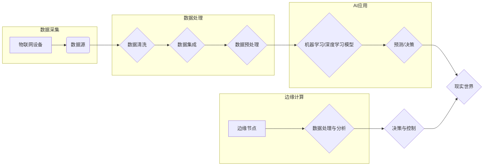

# 一切皆是映射：AI在智慧城市构建中的作用

> 关键词：人工智能，智慧城市，映射，数据驱动，边缘计算，机器学习，深度学习，物联网

## 1. 背景介绍

随着城市化进程的加快，智慧城市已成为全球范围内的重要发展方向。智慧城市旨在通过信息技术的创新应用，实现城市管理的精细化、服务的人性化、交通的便捷化、环境的可持续化。人工智能（AI）作为信息技术的核心驱动力，其在智慧城市建设中的地位日益凸显。本文将探讨AI在智慧城市构建中的作用，强调“映射”这一核心概念，并分析其原理、应用和未来发展趋势。

### 1.1 问题的由来

智慧城市的建设是一个复杂的系统工程，涉及城市规划、基础设施建设、公共管理、环境保护、居民生活等多个方面。传统的城市管理方式往往依赖于人工经验和定性分析，难以满足快速变化的城市需求。AI技术的引入，使得城市管理者能够从海量数据中提取有价值的信息，实现决策的智能化和自动化。

### 1.2 研究现状

目前，AI在智慧城市中的应用已呈现出以下趋势：

- 数据驱动：智慧城市的基础是大量数据的收集、存储、分析和利用。AI技术能够帮助城市管理者从数据中挖掘洞察，为决策提供支持。
- 边缘计算：随着物联网（IoT）设备的普及，数据采集点不断增多，边缘计算技术使得数据处理和分析能够在数据源头的边缘进行，降低延迟，提高效率。
- 机器学习与深度学习：AI模型在图像识别、语音识别、自然语言处理等领域取得了显著进展，为智慧城市提供了强大的技术支撑。
- 智能化应用：AI技术已广泛应用于智慧交通、智慧安防、智慧环境、智慧医疗等众多领域，提升了城市管理的智能化水平。

### 1.3 研究意义

研究AI在智慧城市构建中的作用，对于推动城市化进程、提升城市管理效率、改善居民生活质量具有重要意义：

- 促进城市可持续发展：AI技术能够优化资源配置，提高能源利用效率，降低环境污染，实现城市的可持续发展。
- 提升城市治理能力：AI技术能够辅助城市管理者进行决策，提高城市管理水平和公共服务的质量。
- 改善居民生活质量：AI技术能够提供更加便捷、高效、个性化的服务，提升居民的生活品质。

### 1.4 本文结构

本文将围绕以下内容展开：

- 核心概念与联系：阐述AI在智慧城市建设中的核心概念，并分析其原理和架构。
- 核心算法原理与步骤：介绍AI在智慧城市建设中常用的算法原理和具体操作步骤。
- 数学模型与公式：讲解AI模型背后的数学模型和公式，并举例说明。
- 项目实践：展示AI在智慧城市建设中的实际应用案例和代码实现。
- 实际应用场景：分析AI在智慧交通、智慧安防、智慧环境等领域的应用。
- 未来应用展望：探讨AI在智慧城市建设中的未来发展趋势和挑战。
- 工具和资源推荐：推荐学习AI和智慧城市相关资源。
- 总结与展望：总结研究成果，展望未来发展趋势。

## 2. 核心概念与联系

### 2.1 核心概念

- **人工智能（AI）**：指由人制造出来的系统所表现出的智能行为，包括机器学习、深度学习、知识表示、推理等。
- **智慧城市**：通过信息技术的创新应用，实现城市管理的精细化、服务的人性化、交通的便捷化、环境的可持续化。
- **映射**：在AI技术中，映射是指将现实世界的问题转化为计算机可以处理的问题，或将计算机处理的结果映射回现实世界。
- **数据驱动**：以数据为基础，通过数据分析、挖掘和挖掘，为城市管理和决策提供支持。
- **边缘计算**：在数据源头的边缘进行数据处理和分析，降低延迟，提高效率。
- **机器学习**：一种使计算机系统能够从数据中学习并做出决策的技术。
- **深度学习**：一种利用多层神经网络进行特征学习和模式识别的技术。
- **物联网（IoT）**：通过传感器、网络和智能设备实现物体之间的互联互通。

### 2.2 核心概念原理和架构的 Mermaid 流程图



该流程图展示了AI在智慧城市建设中的核心概念和架构。物联网设备采集数据，经过数据清洗、集成和预处理后，输入到机器学习或深度学习模型中进行预测或决策。预测或决策结果映射回现实世界，同时，边缘计算在数据源头的边缘进行数据处理和分析，进一步优化决策过程。

## 3. 核心算法原理 & 具体操作步骤

### 3.1 算法原理概述

AI在智慧城市建设中涉及多种算法，以下列举几种常见的算法及其原理：

- **机器学习**：通过学习数据中的规律，对新的数据进行预测或分类。常见的机器学习算法包括线性回归、逻辑回归、支持向量机、决策树、随机森林等。
- **深度学习**：一种利用多层神经网络进行特征学习和模式识别的技术。常见的深度学习算法包括卷积神经网络（CNN）、循环神经网络（RNN）、长短期记忆网络（LSTM）、Transformer等。
- **聚类算法**：将相似的数据点分组，如K-means、层次聚类等。
- **关联规则挖掘**：发现数据之间的关联关系，如Apriori算法等。

### 3.2 算法步骤详解

以下是机器学习算法在智慧城市应用中的具体步骤：

1. **数据收集**：从各种传感器、数据库、网络等渠道收集数据。
2. **数据清洗**：去除噪声、缺失值、异常值等。
3. **数据集成**：将来自不同来源的数据整合到一个数据集中。
4. **数据预处理**：对数据进行归一化、标准化等处理，提高数据质量。
5. **特征提取**：从数据中提取有意义的特征，用于模型训练。
6. **模型训练**：使用训练数据训练模型，如使用线性回归模型进行预测。
7. **模型评估**：使用测试数据评估模型性能，如计算预测准确率、召回率等指标。
8. **模型应用**：将训练好的模型应用于新的数据，如预测未来趋势。

### 3.3 算法优缺点

以下是几种常见算法的优缺点：

- **机器学习**：
  - 优点：算法简单、易于实现、可解释性强。
  - 缺点：需要大量标注数据、容易过拟合、泛化能力有限。
- **深度学习**：
  - 优点：能够自动提取特征、模型性能优异、泛化能力强。
  - 缺点：模型复杂度高、参数众多、训练时间较长、可解释性差。

### 3.4 算法应用领域

AI算法在智慧城市建设中应用于以下领域：

- **智慧交通**：交通流量预测、交通事故预警、停车管理、公共交通优化等。
- **智慧安防**：视频监控、人脸识别、异常行为检测、安全预警等。
- **智慧环境**：空气质量监测、水质监测、森林火灾预警、城市排水管理等。
- **智慧医疗**：疾病预测、健康咨询、医疗影像分析、远程医疗等。

## 4. 数学模型和公式 & 详细讲解 & 举例说明

### 4.1 数学模型构建

以下是一些AI算法中常用的数学模型和公式：

- **线性回归**：假设 $y = \theta_0 + \theta_1x_1 + \theta_2x_2 + ... + \theta_nx_n$，其中 $y$ 是因变量，$x_1, x_2, ..., x_n$ 是自变量，$\theta_0, \theta_1, ..., \theta_n$ 是模型参数。

- **逻辑回归**：假设 $P(y=1) = \frac{1}{1 + e^{-(\theta_0 + \theta_1x_1 + \theta_2x_2 + ... + \theta_nx_n)}}$，其中 $P(y=1)$ 是因变量为1的概率。

- **卷积神经网络（CNN）**：假设 $h^{(k)}_{ij} = f(W^{(k)}_{ij} \cdot a^{(k-1)}_{ij} + b^{(k)})$，其中 $h^{(k)}_{ij}$ 是第 $k$ 层第 $i$ 个神经元在第 $j$ 个位置的计算结果，$W^{(k)}_{ij}$ 是连接权重，$a^{(k-1)}_{ij}$ 是上一层的输入，$b^{(k)}$ 是偏置项，$f$ 是激活函数。

### 4.2 公式推导过程

以下以线性回归为例，讲解公式推导过程：

假设我们有 $N$ 个样本，每个样本包含 $n$ 个特征和对应的标签 $y$。则线性回归的损失函数为：

$$
L(\theta) = \frac{1}{2N} \sum_{i=1}^{N} (y_i - \theta_0 - \theta_1x_{1i} - \theta_2x_{2i} - ... - \theta_nx_{ni})^2
$$

其中 $\theta_0, \theta_1, ..., \theta_n$ 是模型参数。

为了最小化损失函数，对 $\theta$ 进行梯度下降：

$$
\theta = \theta - \alpha \nabla_{\theta}L(\theta)
$$

其中 $\alpha$ 是学习率。

计算梯度：

$$
\nabla_{\theta}L(\theta) = \frac{1}{N} \sum_{i=1}^{N} [y_i - (\theta_0 + \theta_1x_{1i} + \theta_2x_{2i} + ... + \theta_nx_{ni})]
$$

将梯度带入梯度下降公式，得到：

$$
\theta_0 = \theta_0 - \alpha \frac{1}{N} \sum_{i=1}^{N} [y_i - (\theta_0 + \theta_1x_{1i} + \theta_2x_{2i} + ... + \theta_nx_{ni})]
$$

同理，可以计算出其他参数的更新公式。

### 4.3 案例分析与讲解

以下以城市交通流量预测为例，演示如何使用Python进行线性回归模型训练。

```python
import numpy as np
from sklearn.linear_model import LinearRegression
from sklearn.model_selection import train_test_split
from sklearn.metrics import mean_squared_error

# 假设已有交通流量数据，包括日期、天气、节假日、道路状况等特征和对应的流量值
data = np.array([[1, 2, 3, 4, 5], [1, 2, 3, 4, 6], [1, 2, 3, 4, 7], ...])
labels = np.array([100, 120, 150, ...])

# 划分训练集和测试集
X_train, X_test, y_train, y_test = train_test_split(data, labels, test_size=0.2, random_state=42)

# 创建线性回归模型
model = LinearRegression()

# 训练模型
model.fit(X_train, y_train)

# 预测测试集流量
predictions = model.predict(X_test)

# 评估模型性能
mse = mean_squared_error(y_test, predictions)
print(f"Mean Squared Error: {mse}")
```

通过上述代码，我们可以使用线性回归模型预测城市交通流量。在实际应用中，需要根据具体情况进行特征选择、参数优化等操作，以提高模型的预测精度。

## 5. 项目实践：代码实例和详细解释说明

### 5.1 开发环境搭建

为了进行AI在智慧城市构建中的项目实践，我们需要搭建以下开发环境：

1. 安装Python 3.x版本。
2. 安装Anaconda或Miniconda，用于创建虚拟环境。
3. 安装以下Python库：
   - NumPy：用于科学计算。
   - Pandas：用于数据处理。
   - Scikit-learn：用于机器学习算法实现。
   - Matplotlib：用于数据可视化。
   - OpenCV：用于图像处理。

### 5.2 源代码详细实现

以下是一个基于Python和Scikit-learn实现的智慧城市交通流量预测项目示例：

```python
# 导入所需的库
import numpy as np
import pandas as pd
from sklearn.linear_model import LinearRegression
from sklearn.model_selection import train_test_split
from sklearn.metrics import mean_squared_error

# 加载数据
data = pd.read_csv('traffic_data.csv')

# 数据预处理
# ...

# 划分特征和标签
X = data.drop('flow', axis=1)
y = data['flow']

# 划分训练集和测试集
X_train, X_test, y_train, y_test = train_test_split(X, y, test_size=0.2, random_state=42)

# 创建线性回归模型
model = LinearRegression()

# 训练模型
model.fit(X_train, y_train)

# 预测测试集流量
predictions = model.predict(X_test)

# 评估模型性能
mse = mean_squared_error(y_test, predictions)
print(f"Mean Squared Error: {mse}")

# 可视化预测结果
import matplotlib.pyplot as plt

plt.scatter(y_test, predictions)
plt.xlabel('Actual Flow')
plt.ylabel('Predicted Flow')
plt.title('Traffic Flow Prediction')
plt.show()
```

### 5.3 代码解读与分析

上述代码展示了如何使用Python和Scikit-learn实现智慧城市交通流量预测项目。首先，导入所需的库，并加载数据。接着，进行数据预处理，包括特征选择、缺失值处理等。然后，划分训练集和测试集，创建线性回归模型，并训练模型。最后，使用模型预测测试集流量，并评估模型性能。

### 5.4 运行结果展示

运行上述代码后，将输出均方误差（Mean Squared Error, MSE）指标，用于评估模型预测的准确性。同时，可视化预测结果，直观地展示实际流量和预测流量的分布情况。

## 6. 实际应用场景

### 6.1 智慧交通

AI技术在智慧交通领域的应用主要包括：

- **交通流量预测**：根据历史交通数据、天气、节假日等因素，预测未来交通流量，为交通管理和调度提供支持。
- **交通事故预警**：通过视频监控和人脸识别技术，实时监测道路状况，预警潜在交通事故。
- **停车管理**：利用图像识别技术，实现智能停车管理系统，提高停车效率。
- **公共交通优化**：根据实时交通数据和乘客需求，优化公共交通路线和班次，提高服务效率。

### 6.2 智慧安防

AI技术在智慧安防领域的应用主要包括：

- **视频监控**：通过视频监控和人脸识别技术，实现实时监控、异常行为检测、安全预警等功能。
- **入侵检测**：利用传感器和图像识别技术，实现入侵检测和报警。
- **公众安全**：通过数据分析，识别潜在的安全风险，为城市安全提供预警。

### 6.3 智慧环境

AI技术在智慧环境领域的应用主要包括：

- **空气质量监测**：利用传感器和数据分析技术，实时监测空气质量，预警污染事件。
- **水质监测**：利用传感器和数据分析技术，实时监测水质，预警水污染事件。
- **森林火灾预警**：利用遥感图像和数据分析技术，实现森林火灾预警。
- **城市排水管理**：利用传感器和数据分析技术，实时监测城市排水状况，预警排水系统故障。

### 6.4 智慧医疗

AI技术在智慧医疗领域的应用主要包括：

- **疾病预测**：利用医疗数据，预测疾病发生风险，为早期干预提供支持。
- **健康咨询**：利用自然语言处理技术，提供智能健康咨询服务。
- **医疗影像分析**：利用深度学习技术，对医疗影像进行分析，辅助医生进行诊断。
- **远程医疗**：利用视频通信和数据分析技术，实现远程医疗服务。

## 7. 工具和资源推荐

### 7.1 学习资源推荐

为了深入学习AI和智慧城市相关技术，以下推荐一些学习资源：

- **书籍**：
  - 《Python机器学习》
  - 《深度学习》
  - 《人工智能：一种现代的方法》
  - 《智慧城市：构建未来城市的新范式》
- **在线课程**：
  - Coursera上的《机器学习》
  - edX上的《深度学习》
  - Udacity上的《智能城市》
- **开源项目**：
  - TensorFlow
  - PyTorch
  - scikit-learn

### 7.2 开发工具推荐

以下是一些常用的AI和智慧城市建设开发工具：

- **编程语言**：Python
- **开发环境**：Anaconda、Jupyter Notebook
- **机器学习框架**：TensorFlow、PyTorch、scikit-learn
- **数据可视化**：Matplotlib、Seaborn
- **数据库**：MySQL、MongoDB
- **云计算平台**：AWS、Azure、阿里云

### 7.3 相关论文推荐

以下是一些与AI和智慧城市相关的论文推荐：

- **《人工智能：一种现代的方法》**
- **《深度学习》**
- **《智慧城市：构建未来城市的新范式》**
- **《基于人工智能的智慧城市建设》**

## 8. 总结：未来发展趋势与挑战

### 8.1 研究成果总结

本文从“映射”这一核心概念出发，探讨了AI在智慧城市构建中的作用。通过分析AI技术的原理、应用和未来发展趋势，展示了AI技术在智慧城市建设中的巨大潜力。同时，也指出了AI技术在智慧城市建设中面临的挑战，如数据安全、隐私保护、算法偏见等。

### 8.2 未来发展趋势

未来，AI在智慧城市建设中将呈现以下发展趋势：

- **数据驱动**：智慧城市建设将进一步依赖数据驱动，通过数据分析和挖掘，为城市管理和决策提供支持。
- **边缘计算**：边缘计算技术将得到广泛应用，实现数据处理和决策的实时性、高效性。
- **AI与IoT融合**：AI与IoT技术的深度融合，将推动智慧城市建设向更加智能、智能化的方向发展。
- **跨学科融合**：AI技术将与其他学科如城市规划、建筑设计、社会学等深度融合，为智慧城市建设提供更加全面、系统的解决方案。

### 8.3 面临的挑战

AI在智慧城市建设中面临的挑战主要包括：

- **数据安全与隐私保护**：智慧城市建设涉及大量个人隐私数据，如何确保数据安全、保护个人隐私是重要挑战。
- **算法偏见**：AI算法可能存在偏见，导致不公平的决策结果，需要加强算法研究和监管。
- **技术标准与规范**：AI技术在智慧城市建设中的应用需要统一的技术标准与规范，以确保系统的互操作性、兼容性。
- **人才培养**：AI技术在智慧城市建设中的应用需要大量专业人才，人才培养是重要挑战。

### 8.4 研究展望

为了应对AI在智慧城市建设中面临的挑战，未来需要在以下方面进行深入研究：

- **数据安全与隐私保护**：研究数据加密、匿名化、隐私保护等技术，确保数据安全和隐私。
- **算法公平与可解释性**：研究公平性、可解释性、透明度等方面的算法，减少算法偏见，提高模型可信度。
- **跨学科融合**：加强AI与城市规划、建筑设计、社会学等学科的交叉研究，为智慧城市建设提供更加全面、系统的解决方案。
- **技术标准与规范**：制定AI技术在智慧城市建设中的技术标准与规范，确保系统的互操作性、兼容性。

## 9. 附录：常见问题与解答

**Q1：AI技术在智慧城市建设中面临哪些挑战？**

A1：AI技术在智慧城市建设中面临的挑战主要包括数据安全与隐私保护、算法偏见、技术标准与规范、人才培养等方面。

**Q2：如何确保AI技术在智慧城市建设中的数据安全和隐私保护？**

A2：为确保数据安全和隐私保护，可以采取以下措施：
- 采用数据加密、匿名化、差分隐私等技术，降低数据泄露风险。
- 建立数据安全管理制度，加强数据安全监管。
- 提高公众对数据安全和隐私保护的意识，加强宣传教育。

**Q3：如何减少AI算法的偏见？**

A3：减少AI算法偏见可以从以下几个方面入手：
- 收集多样化的训练数据，避免数据偏差。
- 采用公平性算法，降低算法偏见。
- 加强算法研究和监管，提高算法透明度。

**Q4：如何推动AI技术在智慧城市建设中的标准化和规范化？**

A4：推动AI技术在智慧城市建设中的标准化和规范化，需要以下措施：
- 制定AI技术在智慧城市建设中的技术标准与规范。
- 加强标准制定机构的协作与沟通。
- 提高公众对AI技术标准与规范的认识。

**Q5：如何培养AI技术在智慧城市建设中所需的人才？**

A5：培养AI技术在智慧城市建设中所需的人才可以从以下几个方面入手：
- 加强AI和智慧城市相关学科的教育和培训。
- 鼓励企业和研究机构开展人才培训项目。
- 建立人才评价体系，鼓励人才创新和发展。

---

作者：禅与计算机程序设计艺术 / Zen and the Art of Computer Programming