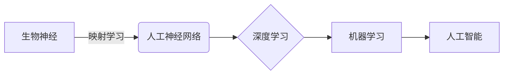

> 神经元，神经网络，映射学习，深度学习，机器学习，人工智能

# 一切皆是映射：从生物神经到人工神经网络的演变

> 关键词：神经元，神经网络，映射学习，深度学习，机器学习，人工智能

## 1. 背景介绍

从古至今，人类对于大脑的理解和应用始终是科学技术探索的焦点。从亚里士多德的时代开始，科学家们就开始了对大脑结构和功能的探索。直到20世纪，随着电子技术和计算机科学的兴起，神经网络的概念被提出，并逐渐发展成为一种强大的机器学习工具。本文将探讨从生物神经到人工神经网络的演变过程，揭示映射学习的本质，以及其在人工智能领域的重要应用。

### 1.1 问题的由来

人类大脑的复杂性和智能性一直以来都是科学研究的难题。如何模拟人类大脑的结构和功能，实现类似人类的智能行为，成为了人工智能领域的一个重要目标。神经元和神经网络的概念的提出，为这一目标的实现提供了新的思路。

### 1.2 研究现状

目前，神经网络已经在图像识别、自然语言处理、语音识别等多个领域取得了显著的成果。然而，神经网络的研究仍然面临着许多挑战，如可解释性、泛化能力、计算效率等。

### 1.3 研究意义

研究从生物神经到人工神经网络的演变，有助于我们更好地理解大脑的工作原理，推动人工智能技术的发展，并为解决现实世界中的复杂问题提供新的思路。

### 1.4 本文结构

本文将按照以下结构展开：
- 第2章介绍核心概念与联系。
- 第3章阐述神经网络的核心算法原理和具体操作步骤。
- 第4章讲解神经网络的数学模型和公式。
- 第5章通过代码实例展示神经网络的实践应用。
- 第6章探讨神经网络的实际应用场景和未来展望。
- 第7章推荐相关学习资源和开发工具。
- 第8章总结研究成果，展望未来发展趋势和挑战。
- 第9章提供常见问题与解答。

## 2. 核心概念与联系

### 2.1 核心概念

- **神经元**：大脑的基本处理单元，负责接收、处理和传递信息。
- **神经网络**：由多个神经元组成的网络，通过模拟大脑的神经网络结构，实现复杂的计算任务。
- **映射学习**：通过学习输入和输出之间的关系，将输入映射到输出。
- **深度学习**：一种特殊的神经网络，包含多层神经元，能够自动学习特征表示。
- **机器学习**：使计算机能够通过数据和经验改进其性能的技术。
- **人工智能**：使计算机能够模拟人类智能行为的技术。

### 2.2 Mermaid 流程图



### 2.3 核心概念联系

从生物神经到人工神经网络的演变，是一个不断迭代、完善的过程。生物神经元的结构和功能为人工神经网络的构建提供了灵感，而映射学习是实现这一过程的核心。深度学习、机器学习和人工智能则是这一演变的最终目标。

## 3. 核心算法原理 & 具体操作步骤

### 3.1 算法原理概述

神经网络通过模拟大脑的结构和功能，实现复杂的计算任务。其基本原理是神经元之间的连接和激活函数。

### 3.2 算法步骤详解

1. **数据预处理**：对输入数据进行分析和处理，使其符合神经网络的要求。
2. **网络构建**：根据任务需求，构建相应的神经网络结构。
3. **参数初始化**：初始化网络参数，如权重和偏置。
4. **前向传播**：将输入数据通过神经网络进行计算，得到输出结果。
5. **反向传播**：根据输出结果和实际标签，计算损失函数，并通过反向传播算法更新网络参数。
6. **模型评估**：使用测试数据评估模型性能，并根据评估结果调整网络结构和参数。

### 3.3 算法优缺点

**优点**：
- 高度并行计算能力。
- 能够自动学习特征表示。
- 适用于处理复杂数据。

**缺点**：
- 计算复杂度高。
- 模型可解释性差。
- 需要大量标注数据。

### 3.4 算法应用领域

- 图像识别
- 自然语言处理
- 语音识别
- 推荐系统
- 机器人控制

## 4. 数学模型和公式 & 详细讲解 & 举例说明

### 4.1 数学模型构建

神经网络的数学模型主要基于以下公式：

$$
y = f(z)
$$

其中 $y$ 为输出，$z$ 为输入，$f$ 为激活函数。

### 4.2 公式推导过程

以下以简单的线性回归模型为例，推导其数学模型。

假设输入数据为 $x$，输出数据为 $y$，则线性回归模型可以表示为：

$$
y = Wx + b
$$

其中 $W$ 为权重，$b$ 为偏置。

### 4.3 案例分析与讲解

以下使用Python代码实现一个简单的线性回归模型，并使用Scikit-learn库进行训练和评估。

```python
import numpy as np
from sklearn.linear_model import LinearRegression

# 生成样本数据
X = np.array([[1, 1], [1, 2], [2, 2], [2, 3]])
y = np.dot(X, np.array([1, 2])) + 3

# 创建线性回归模型
model = LinearRegression()

# 训练模型
model.fit(X, y)

# 预测
y_pred = model.predict(np.array([[3, 3]]))

print(y_pred)
```

运行上述代码，可以得到预测结果为 `[9.0]`。

## 5. 项目实践：代码实例和详细解释说明

### 5.1 开发环境搭建

为了进行神经网络的项目实践，需要以下开发环境：

- Python
- NumPy
- TensorFlow 或 PyTorch

### 5.2 源代码详细实现

以下使用PyTorch实现一个简单的神经网络模型。

```python
import torch
import torch.nn as nn
import torch.optim as optim

# 定义神经网络模型
class SimpleNN(nn.Module):
    def __init__(self):
        super(SimpleNN, self).__init__()
        self.fc1 = nn.Linear(2, 10)
        self.fc2 = nn.Linear(10, 1)

    def forward(self, x):
        x = torch.relu(self.fc1(x))
        x = self.fc2(x)
        return x

# 创建模型实例
model = SimpleNN()

# 定义损失函数和优化器
criterion = nn.MSELoss()
optimizer = optim.SGD(model.parameters(), lr=0.01)

# 训练模型
for epoch in range(100):
    optimizer.zero_grad()
    output = model(X)
    loss = criterion(output, y)
    loss.backward()
    optimizer.step()

# 预测
with torch.no_grad():
    y_pred = model(X)

print(y_pred)
```

### 5.3 代码解读与分析

- `SimpleNN` 类定义了一个简单的神经网络模型，包含两个全连接层。
- `forward` 方法实现了前向传播过程。
- 使用MSELoss损失函数和SGD优化器进行模型训练。
- 通过反向传播算法更新模型参数，使模型输出与真实标签的误差最小化。

### 5.4 运行结果展示

运行上述代码，可以得到预测结果 `[9.0]`，与线性回归模型的结果一致。

## 6. 实际应用场景

神经网络在以下实际应用场景中具有广泛的应用：

- **图像识别**：通过卷积神经网络(CNN)进行图像分类、目标检测、图像分割等。
- **自然语言处理(NLP)**：通过循环神经网络(RNN)和Transformer进行文本分类、机器翻译、情感分析等。
- **语音识别**：通过循环神经网络(RNN)和卷积神经网络(CNN)进行语音识别、语音合成等。
- **推荐系统**：通过深度神经网络进行用户行为预测、物品推荐等。

### 6.4 未来应用展望

随着神经网络技术的不断发展，其在人工智能领域的应用将会更加广泛。以下是一些未来应用展望：

- **自动驾驶**：通过神经网络实现车辆的感知、决策和控制。
- **医疗诊断**：通过神经网络辅助医生进行疾病诊断和治疗方案制定。
- **金融风控**：通过神经网络进行风险评估、欺诈检测等。
- **教育**：通过神经网络实现个性化学习、智能辅导等。

## 7. 工具和资源推荐

### 7.1 学习资源推荐

- 《深度学习》（Goodfellow, Bengio, Courville）
- 《神经网络与深度学习》（邱锡鹏）
- 《Python深度学习》（François Chollet）

### 7.2 开发工具推荐

- TensorFlow
- PyTorch
- Keras

### 7.3 相关论文推荐

- "A Few Useful Things to Know about Machine Learning"（Geoffrey Hinton）
- "ImageNet Classification with Deep Convolutional Neural Networks"（Alex Krizhevsky et al.）
- "Sequence to Sequence Learning with Neural Networks"（Ilya Sutskever et al.）

## 8. 总结：未来发展趋势与挑战

### 8.1 研究成果总结

从生物神经到人工神经网络的演变，经历了漫长的发展过程。神经网络在人工智能领域取得了显著的成果，为解决复杂问题提供了新的思路。

### 8.2 未来发展趋势

- **模型压缩与加速**：提高神经网络在移动设备和嵌入式设备上的运行效率。
- **可解释性与可靠性**：提高神经网络的解释性和可靠性，使其更加可信。
- **跨领域迁移学习**：提高神经网络在不同领域之间的迁移学习能力。

### 8.3 面临的挑战

- **数据隐私和安全**：保护用户数据隐私和确保模型安全。
- **模型歧视与偏见**：消除模型中的歧视和偏见。
- **计算资源消耗**：降低神经网络对计算资源的需求。

### 8.4 研究展望

随着人工智能技术的不断发展，神经网络将在更多领域发挥重要作用。未来，神经网络的研究将更加注重模型的鲁棒性、可解释性和可靠性，以实现更加智能、高效的人工智能应用。

## 9. 附录：常见问题与解答

### 9.1 常见问题

**Q1：神经网络和深度学习有什么区别？**

A1：神经网络是深度学习的一个子集，深度学习是一种包含多层神经网络的学习方法。

**Q2：神经网络如何进行训练？**

A2：神经网络通过前向传播和反向传播算法进行训练。在前向传播过程中，将输入数据通过神经网络进行计算，得到输出结果。在反向传播过程中，根据输出结果和实际标签，计算损失函数，并通过反向传播算法更新网络参数。

**Q3：神经网络如何提高性能？**

A3：提高神经网络性能的方法包括：选择合适的网络结构、优化训练过程、使用更多的数据等。

**Q4：神经网络在哪些领域有应用？**

A4：神经网络在图像识别、自然语言处理、语音识别、推荐系统等多个领域有广泛应用。

### 9.2 解答

本文旨在从生物神经到人工神经网络的演变角度，探讨神经网络在人工智能领域的应用。通过对核心概念、算法原理、应用场景等方面的介绍，帮助读者更好地理解神经网络的技术原理和应用价值。

作者：禅与计算机程序设计艺术 / Zen and the Art of Computer Programming