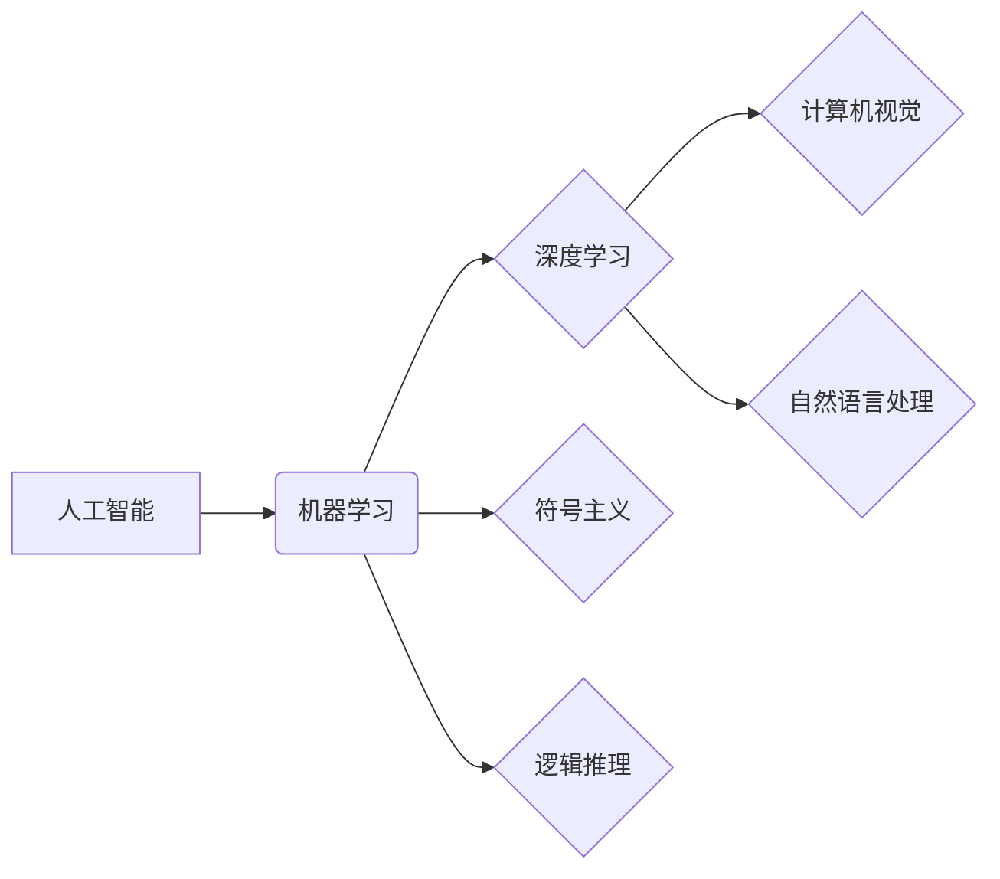

# 从图灵奖看AI算法的进步

> 关键词：图灵奖，人工智能，算法进步，机器学习，深度学习，计算机视觉，自然语言处理，认知科学

## 1. 背景介绍

自图灵奖设立以来，它一直被视为计算机科学领域的最高荣誉，它见证了计算机科学和人工智能（AI）领域的辉煌成就。本文将探讨图灵奖在AI算法领域的进步，从早期的符号主义和逻辑推理，到现代的机器学习和深度学习，展现AI算法如何不断突破边界，推动人类文明进步。

## 2. 核心概念与联系

### 2.1 核心概念

**人工智能（Artificial Intelligence, AI）**：指使机器能够模拟、延伸和扩展人类智能的理论、方法、技术及应用。

**算法（Algorithm）**：解决特定问题的一系列明确的步骤。

**机器学习（Machine Learning, ML）**：一种使计算机系统能够利用数据来自我学习和改进的方法。

**深度学习（Deep Learning, DL）**：机器学习的一个子领域，通过构建深层的神经网络来学习数据中的复杂模式。

**计算机视觉（Computer Vision, CV）**：使计算机能够从图像和视频中提取和理解视觉信息的技术。

**自然语言处理（Natural Language Processing, NLP）**：使计算机能够理解、解释和生成人类语言的技术。

### 2.2 核心概念原理和架构的 Mermaid 流程图



## 3. 核心算法原理 & 具体操作步骤

### 3.1 算法原理概述

图灵奖得主在AI算法领域做出了许多开创性的贡献，以下是一些核心算法原理的概述：

- **符号主义**：以约翰·麦卡锡（John McCarthy）和艾伦·纽厄尔（Alan Newell）为代表，强调符号处理和逻辑推理。

- **逻辑推理**：以艾伦·图灵（Alan Turing）和约翰·罗素（John Russell）为代表，研究形式语言和逻辑推理。

- **机器学习**：以阿兰·图灵（Alan Turing）和克雷格·文特斯（Craig Venter）为代表，探索使用数据来自我学习和改进。

- **深度学习**：以杰弗里·辛顿（Geoffrey Hinton）、杨立昆（Yann LeCun）和叶良辰（Yoshua Bengio）为代表，通过构建深层的神经网络来学习数据中的复杂模式。

### 3.2 算法步骤详解

以下是深度学习算法的步骤详解：

1. **数据收集**：收集大量标注数据用于训练模型。

2. **数据预处理**：对数据进行清洗、归一化等处理，以提高模型的性能。

3. **模型选择**：选择合适的深度学习模型，如卷积神经网络（CNN）、循环神经网络（RNN）或变换器（Transformer）。

4. **模型训练**：使用标注数据训练模型，通过反向传播算法优化模型参数。

5. **模型评估**：使用测试数据评估模型的性能，调整模型参数以获得最佳效果。

6. **模型部署**：将训练好的模型部署到实际应用中。

### 3.3 算法优缺点

- **优点**：深度学习算法能够处理大规模数据，学习到复杂的特征，并在图像识别、自然语言处理等领域取得了显著成果。

- **缺点**：深度学习算法需要大量的训练数据和计算资源，且模型的解释性较差。

### 3.4 算法应用领域

深度学习算法在以下领域得到了广泛应用：

- **计算机视觉**：图像识别、物体检测、图像分割等。

- **自然语言处理**：文本分类、机器翻译、语音识别等。

- **语音识别**：语音到文本转换、语音合成等。

- **医疗诊断**：疾病诊断、药物发现等。

## 4. 数学模型和公式 & 详细讲解 & 举例说明

### 4.1 数学模型构建

深度学习算法的核心是神经网络，以下是一个简单的神经网络模型：

$$
y = f(W \cdot x + b)
$$

其中，$y$ 是输出，$x$ 是输入，$W$ 是权重，$b$ 是偏置，$f$ 是激活函数。

### 4.2 公式推导过程

以下是梯度下降算法的推导过程：

$$
W_{new} = W_{old} - \eta \cdot \frac{\partial L}{\partial W}
$$

其中，$L$ 是损失函数，$\eta$ 是学习率。

### 4.3 案例分析与讲解

以下是一个使用深度学习进行图像识别的案例：

- 数据集：使用MNIST手写数字数据集进行训练和测试。
- 模型：使用卷积神经网络（CNN）进行图像识别。
- 训练：使用反向传播算法训练模型。
- 测试：使用测试集评估模型的性能。

## 5. 项目实践：代码实例和详细解释说明

### 5.1 开发环境搭建

- 安装Python和TensorFlow或PyTorch。
- 下载MNIST手写数字数据集。

### 5.2 源代码详细实现

```python
import tensorflow as tf
from tensorflow.keras import datasets, layers, models

# 加载数据
(train_images, train_labels), (test_images, test_labels) = datasets.mnist.load_data()

# 数据预处理
train_images = train_images.reshape((60000, 28, 28, 1))
test_images = test_images.reshape((10000, 28, 28, 1))

# 归一化
train_images = train_images.astype('float32') / 255
test_images = test_images.astype('float32') / 255

# 构建模型
model = models.Sequential()
model.add(layers.Conv2D(32, (3, 3), activation='relu', input_shape=(28, 28, 1)))
model.add(layers.MaxPooling2D((2, 2)))
model.add(layers.Conv2D(64, (3, 3), activation='relu'))
model.add(layers.MaxPooling2D((2, 2)))
model.add(layers.Conv2D(64, (3, 3), activation='relu'))

# 添加全连接层
model.add(layers.Flatten())
model.add(layers.Dense(64, activation='relu'))
model.add(layers.Dense(10))

# 编译模型
model.compile(optimizer='adam',
              loss=tf.keras.losses.SparseCategoricalCrossentropy(from_logits=True),
              metrics=['accuracy'])

# 训练模型
model.fit(train_images, train_labels, epochs=5, batch_size=64)

# 测试模型
test_loss, test_acc = model.evaluate(test_images,  test_labels, verbose=2)
```

### 5.3 代码解读与分析

以上代码使用TensorFlow的Keras接口构建了一个简单的CNN模型，用于识别MNIST手写数字数据集。代码中首先加载数据并对其进行预处理，然后构建模型并编译，接着训练模型，最后测试模型性能。

## 6. 实际应用场景

### 6.4 未来应用展望

随着AI算法的不断进步，未来AI将在以下领域发挥更大的作用：

- **医疗健康**：辅助医生进行疾病诊断、药物研发等。
- **智能制造**：提高生产效率，降低生产成本。
- **智慧城市**：实现交通管理、能源管理等。
- **教育**：提供个性化教学，提高学习效率。

## 7. 工具和资源推荐

### 7.1 学习资源推荐

- 《深度学习》（Ian Goodfellow、Yoshua Bengio和Aaron Courville著）
- 《神经网络与深度学习》（邱锡鹏著）
- Coursera上的《机器学习》课程（吴恩达教授）

### 7.2 开发工具推荐

- TensorFlow
- PyTorch
- Keras

### 7.3 相关论文推荐

- Krizhevsky, A., Sutskever, I., & Hinton, G. E. (2012). ImageNet classification with deep convolutional neural networks. In Advances in neural information processing systems (pp. 1097-1105).
- LeCun, Y., Bottou, L., Bengio, Y., & Haffner, P. (1998). Gradient-based learning applied to document recognition. Proceedings of the IEEE, 86(11), 2278-2324.

## 8. 总结：未来发展趋势与挑战

### 8.1 研究成果总结

图灵奖得主在AI算法领域做出了许多开创性的贡献，推动了AI技术的快速发展。

### 8.2 未来发展趋势

- AI算法将更加智能化、自动化。
- AI算法将更加泛化，适用于更多领域。
- AI算法将更加高效，降低计算成本。

### 8.3 面临的挑战

- 数据隐私和安全问题。
- AI算法的可解释性问题。
- AI算法的伦理和道德问题。

### 8.4 研究展望

未来，AI算法将在以下方面取得突破：

- 新型AI算法的发明。
- AI算法的应用推广。
- AI算法与人类智能的融合。

## 9. 附录：常见问题与解答

**Q1：什么是图灵奖？**

A：图灵奖是计算机科学领域的最高荣誉，由英国计算机科学家艾伦·图灵设立，旨在奖励对计算机科学领域做出杰出贡献的个人。

**Q2：什么是深度学习？**

A：深度学习是机器学习的一个子领域，通过构建深层的神经网络来学习数据中的复杂模式。

**Q3：深度学习有哪些应用领域？**

A：深度学习在计算机视觉、自然语言处理、语音识别等领域得到了广泛应用。

**Q4：什么是机器学习？**

A：机器学习是一种使计算机系统能够利用数据来自我学习和改进的方法。

**Q5：什么是人工智能？**

A：人工智能（Artificial Intelligence, AI）指使机器能够模拟、延伸和扩展人类智能的理论、方法、技术及应用。

作者：禅与计算机程序设计艺术 / Zen and the Art of Computer Programming