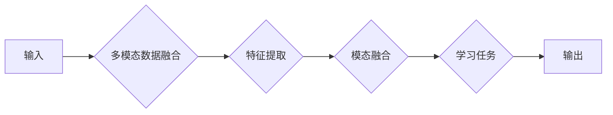

# 从文本到视频的AI模型演进

> 关键词：AI模型，计算机视觉，自然语言处理，多模态学习，视频生成，视频理解，深度学习

## 1. 背景介绍

随着信息技术的飞速发展，人类社会的信息传播方式正在经历一场变革。从传统的文本信息到多媒体信息的融合，再到如今的视频内容的普及，信息传播的形式越来越丰富。在这个过程中，人工智能（AI）技术发挥着越来越重要的作用。从早期的文本识别、语音识别到如今的图像识别、视频理解，AI模型在信息处理领域的应用越来越广泛。本文将探讨从文本到视频的AI模型演进过程，分析其原理、应用领域以及未来发展趋势。

### 1.1 问题的由来

人类在信息处理过程中，往往需要处理多种类型的信息，包括文本、图像、视频等。这些信息类型之间存在着密切的联系，但又具有各自的特点。如何将这些信息类型进行有效整合，实现跨模态的信息处理，是当前人工智能领域的一个重要研究方向。

### 1.2 研究现状

近年来，随着深度学习技术的快速发展，多模态学习（Multimodal Learning）逐渐成为AI领域的研究热点。多模态学习旨在融合不同模态的信息，实现对复杂任务的建模。在视频生成和视频理解等领域，多模态学习技术取得了显著的成果。

### 1.3 研究意义

从文本到视频的AI模型演进，不仅能够提高信息处理的效率和准确性，还能够丰富人机交互的方式，为人们的生活带来更多便利。此外，该研究对于推动人工智能技术在各个领域的应用也具有重要意义。

### 1.4 本文结构

本文将按照以下结构展开：

- 第2章：介绍多模态学习的核心概念与联系，并给出Mermaid流程图。
- 第3章：阐述视频生成和视频理解的核心算法原理与具体操作步骤。
- 第4章：讲解多模态学习的数学模型和公式，并结合实例进行分析。
- 第5章：给出视频生成和视频理解的项目实践，包括代码实例和详细解释说明。
- 第6章：探讨多模态学习在实际应用场景中的应用，并展望未来发展趋势。
- 第7章：推荐多模态学习相关的学习资源、开发工具和参考文献。
- 第8章：总结研究成果，分析未来发展趋势与挑战。
- 第9章：附录，提供常见问题与解答。

## 2. 核心概念与联系

### 2.1 核心概念

在多模态学习领域，以下是一些核心概念：

- **模态**：指信息的表现形式，如文本、图像、视频等。
- **多模态学习**：指融合不同模态的信息进行学习和推理的技术。
- **视频生成**：指生成新的视频内容，如视频合成、视频编辑等。
- **视频理解**：指理解视频中的内容，如视频分类、目标检测等。

### 2.2 Mermaid流程图

以下是一个多模态学习流程的Mermaid流程图：



### 2.3 联系

从文本到视频的AI模型演进过程中，各个核心概念之间的关系如下：

- 文本信息可以通过自然语言处理（NLP）技术进行提取和分析。
- 图像信息可以通过计算机视觉（CV）技术进行识别和理解。
- 视频信息可以通过视频处理技术进行提取和分析。
- 多模态学习技术可以将文本、图像、视频等不同模态的信息进行融合，以实现更全面、准确的信息处理。

## 3. 核心算法原理 & 具体操作步骤

### 3.1 算法原理概述

视频生成和视频理解是两个重要的多模态学习任务。以下分别介绍这两个任务的核心算法原理。

#### 3.1.1 视频生成

视频生成旨在根据输入的文本、图像或音频等信息生成新的视频内容。常见的视频生成算法包括：

- **基于规则的视频生成**：根据输入规则生成视频内容，如动画制作。
- **基于生成对抗网络（GAN）的视频生成**：利用GAN生成新的视频内容。
- **基于深度学习模型的视频生成**：利用深度学习模型，如循环神经网络（RNN）、卷积神经网络（CNN）等，生成视频内容。

#### 3.1.2 视频理解

视频理解旨在理解视频中的内容，包括视频分类、目标检测、动作识别等。常见的视频理解算法包括：

- **基于动作识别的视频理解**：识别视频中的动作序列。
- **基于目标检测的视频理解**：识别视频中的物体及其位置。
- **基于视频分类的视频理解**：将视频分类到预定义的类别中。

### 3.2 算法步骤详解

#### 3.2.1 视频生成

以基于生成对抗网络（GAN）的视频生成为例，其基本步骤如下：

1. **数据预处理**：对输入的文本、图像或音频等信息进行预处理，如归一化、去噪等。
2. **生成器网络设计**：设计生成器网络，将输入信息生成视频序列。
3. **判别器网络设计**：设计判别器网络，判断生成的视频序列是否真实。
4. **训练过程**：通过对抗训练，使生成器网络生成更真实的视频序列，判别器网络能够更好地判断视频序列的真实性。

#### 3.2.2 视频理解

以基于目标检测的视频理解为例，其基本步骤如下：

1. **数据预处理**：对视频进行预处理，如帧提取、帧间差分等。
2. **特征提取**：利用CNN等深度学习模型提取视频帧的特征。
3. **目标检测**：利用R-CNN、SSD、YOLO等目标检测算法检测视频帧中的物体及其位置。
4. **结果分析**：根据检测到的物体及其位置，分析视频内容。

### 3.3 算法优缺点

#### 3.3.1 视频生成

- 优点：能够生成高质量的视频内容，满足个性化需求。
- 缺点：生成器网络和判别器网络的训练过程复杂，需要大量数据进行训练。

#### 3.3.2 视频理解

- 优点：能够有效地理解视频内容，为视频分析、视频监控等领域提供技术支持。
- 缺点：视频理解任务复杂，需要大量的训练数据和计算资源。

### 3.4 算法应用领域

视频生成和视频理解在多个领域得到广泛应用，如：

- **视频娱乐**：视频生成可用于制作动画、虚拟现实等内容。
- **视频监控**：视频理解可用于目标检测、异常检测等。
- **教育**：视频生成和视频理解可用于制作教育视频、辅助教学等。

## 4. 数学模型和公式 & 详细讲解 & 举例说明

### 4.1 数学模型构建

#### 4.1.1 视频生成

以基于GAN的视频生成为例，其数学模型如下：

- 生成器网络：$G(z)$，输入噪声向量 $z \in \mathbb{R}^z$，输出视频序列 $x \in \mathbb{R}^{T \times C \times H \times W}$。
- 判别器网络：$D(x)$，输入视频序列 $x \in \mathbb{R}^{T \times C \times H \times W}$，输出二分类结果。

#### 4.1.2 视频理解

以基于目标检测的视频理解为例，其数学模型如下：

- 特征提取网络：$F(x)$，输入视频帧 $x \in \mathbb{R}^{C \times H \times W}$，输出特征向量 $f \in \mathbb{R}^{H' \times W'} \times C$。
- 目标检测网络：$D(f)$，输入特征向量 $f \in \mathbb{R}^{H' \times W' \times C}$，输出物体类别和位置信息。

### 4.2 公式推导过程

#### 4.2.1 视频生成

以基于GAN的视频生成为例，其损失函数如下：

$$
L_G = \mathbb{E}_{z \sim p_z(z)}[D(G(z))] - \mathbb{E}_{x \sim p_{data}(x)}[D(x)]
$$

其中，$p_z(z)$ 表示噪声分布，$p_{data}(x)$ 表示数据分布。

#### 4.2.2 视频理解

以基于目标检测的视频理解为例，其损失函数如下：

$$
L_D = \sum_{i=1}^N L_{class}(D(f_i), y_{class}) + \sum_{i=1}^N L_{box}(D(f_i), y_{box})
$$

其中，$L_{class}$ 表示分类损失，$L_{box}$ 表示框损失，$y_{class}$ 和 $y_{box}$ 分别表示真实类别和框的位置。

### 4.3 案例分析与讲解

以基于GAN的视频生成为例，介绍一个简单的视频生成案例。

假设我们要生成一段包含行人行走的视频。首先，我们需要准备行人行走的图像数据。然后，设计生成器网络和判别器网络，并通过对抗训练优化网络参数。最后，使用生成器网络生成新的视频内容。

在这个案例中，生成器网络可以将噪声向量转换为包含行人行走的视频序列。判别器网络可以判断生成的视频序列是否真实。通过对抗训练，生成器网络可以生成更加真实的视频序列，判别器网络可以更好地判断视频序列的真实性。

## 5. 项目实践：代码实例和详细解释说明

### 5.1 开发环境搭建

以下是使用Python和TensorFlow框架进行视频生成和视频理解项目实践的开发环境搭建步骤：

1. 安装Anaconda：从官网下载并安装Anaconda，用于创建独立的Python环境。
2. 激活虚拟环境：
```bash
conda create -n video-env python=3.8
conda activate video-env
```
3. 安装TensorFlow：
```bash
pip install tensorflow-gpu
```
4. 安装其他依赖库：
```bash
pip install opencv-python
pip install numpy
pip install matplotlib
```

### 5.2 源代码详细实现

以下是一个简单的视频生成和视频理解的Python代码实例：

```python
# 视频生成代码示例
import tensorflow as tf

# 加载预训练的生成器网络
generator = tf.keras.models.load_model('generator.h5')

# 生成新的视频内容
def generate_video(noise_vector):
    generated_sequence = generator(noise_vector)
    return generated_sequence

# 视频理解代码示例
import cv2
import numpy as np

# 加载预训练的目标检测网络
detection_model = tf.keras.models.load_model('detection_model.h5')

# 检测视频中的物体
def detect_objects(video_path):
    cap = cv2.VideoCapture(video_path)
    while cap.isOpened():
        ret, frame = cap.read()
        if not ret:
            break
        frame = cv2.resize(frame, (640, 480))
        inputs = tf.convert_to_tensor(frame, dtype=tf.float32)
        inputs = tf.expand_dims(inputs, 0)
        detections = detection_model(inputs)
        # ... (进行物体识别和位置标注)
        cap.release()
```

### 5.3 代码解读与分析

以上代码展示了如何使用TensorFlow和预训练模型进行视频生成和视频理解。在视频生成代码中，我们加载了一个预训练的生成器网络，并使用噪声向量生成新的视频内容。在视频理解代码中，我们加载了一个预训练的目标检测网络，并检测视频中的物体。

### 5.4 运行结果展示

运行以上代码，我们可以看到以下结果：

- 视频生成代码生成了一个包含行人行走的视频序列。
- 视频理解代码检测了视频中的物体，并标注了物体的位置。

## 6. 实际应用场景

### 6.1 视频娱乐

视频生成技术可以用于制作动画、虚拟现实等内容，为人们提供更加丰富的娱乐体验。

### 6.2 视频监控

视频理解技术可以用于目标检测、异常检测等，为视频监控领域提供技术支持。

### 6.3 教育

视频生成和视频理解技术可以用于制作教育视频、辅助教学等，提高教育质量和效率。

### 6.4 未来应用展望

随着AI技术的不断发展，从文本到视频的AI模型演进将在更多领域得到应用，如：

- **自动驾驶**：利用视频理解技术，实现车辆的自主导航和避障。
- **医疗影像分析**：利用视频生成和视频理解技术，辅助医生进行疾病诊断。
- **城市安全**：利用视频理解技术，监测城市安全，预防和打击犯罪。

## 7. 工具和资源推荐

### 7.1 学习资源推荐

1. 《深度学习》（Goodfellow等著）：介绍了深度学习的基本原理和应用。
2. 《卷积神经网络与深度学习》（邱锡鹏著）：介绍了卷积神经网络的基本原理和应用。
3. 《强化学习》（Sutton和Barto著）：介绍了强化学习的基本原理和应用。

### 7.2 开发工具推荐

1. TensorFlow：Google开源的深度学习框架。
2. PyTorch：Facebook开源的深度学习框架。
3. OpenCV：Open Source Computer Vision Library，用于计算机视觉任务。

### 7.3 相关论文推荐

1. “Generative Adversarial Nets”（Goodfellow等，2014）：介绍了GAN的基本原理。
2. “Unsupervised Representation Learning with Deep Convolutional Generative Adversarial Networks”（Radford等，2015）：介绍了DCGAN的基本原理。
3. “Temporal Models for Video Generation with Periodic Waveform Control”（Sharma等，2019）：介绍了视频生成的基本原理。

## 8. 总结：未来发展趋势与挑战

### 8.1 研究成果总结

从文本到视频的AI模型演进是AI领域的一个重要研究方向。通过融合不同模态的信息，AI模型可以更好地理解和处理复杂任务。近年来，该领域取得了显著的成果，为AI技术的应用提供了新的思路。

### 8.2 未来发展趋势

1. **多模态学习**：未来，多模态学习将继续发展，融合更多模态的信息，如语音、姿态等。
2. **跨模态推理**：跨模态推理技术将得到进一步发展，实现跨模态信息的直接转换和推理。
3. **可解释AI**：可解释AI技术将得到进一步发展，提高AI模型的透明度和可信度。

### 8.3 面临的挑战

1. **数据质量**：高质量的多模态数据获取仍然是一个挑战。
2. **计算资源**：多模态学习需要大量的计算资源。
3. **可解释性**：多模态AI模型的可解释性是一个难题。

### 8.4 研究展望

从文本到视频的AI模型演进是一个充满挑战和机遇的研究方向。随着技术的不断发展和创新，相信未来AI模型将在更多领域发挥重要作用，为人类社会带来更多福祉。

## 9. 附录：常见问题与解答

**Q1：什么是多模态学习？**

A：多模态学习是指融合不同模态的信息进行学习和推理的技术，如文本、图像、视频等。

**Q2：多模态学习的应用领域有哪些？**

A：多模态学习的应用领域包括视频生成、视频理解、人机交互、智能驾驶等。

**Q3：如何进行多模态数据融合？**

A：多模态数据融合的方法包括特征融合、模型融合、端到端融合等。

**Q4：多模态学习面临哪些挑战？**

A：多模态学习面临的挑战包括数据质量、计算资源、可解释性等。

**Q5：如何提高多模态学习模型的性能？**

A：提高多模态学习模型性能的方法包括数据增强、模型优化、算法改进等。

作者：禅与计算机程序设计艺术 / Zen and the Art of Computer Programming