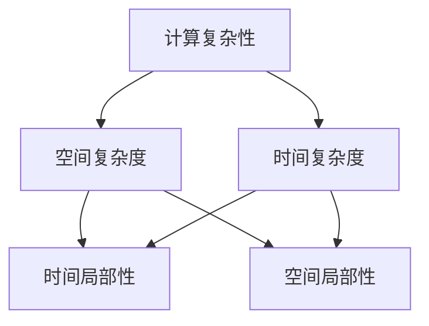
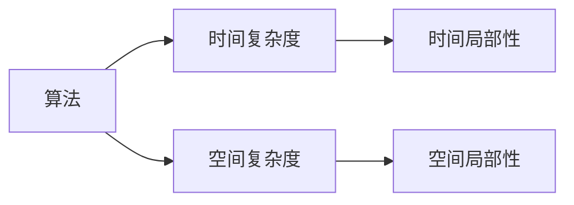
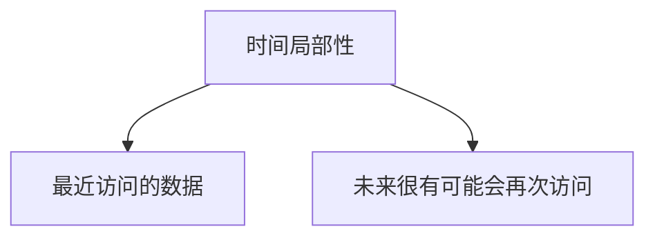
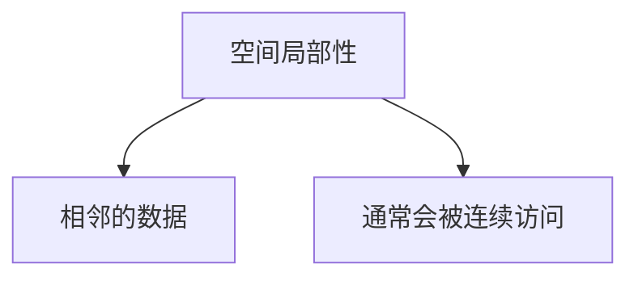
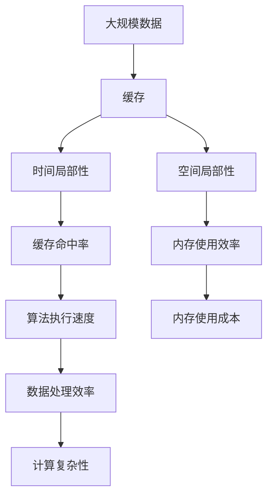

                 

# 计算：第四部分 计算的极限 第 9 章 计算复杂性 计算的局部性原理

> 关键词：计算复杂性, 局部性原理, 算法分析, 时间复杂度, 空间复杂度, 时间局部性, 空间局部性

## 1. 背景介绍

### 1.1 问题由来
在现代计算机科学中，计算复杂性理论（Computational Complexity Theory）是研究算法运行时间和空间需求的一门重要学科。它主要探讨在不同的计算模型和问题中，算法复杂性的上限是什么，从而指导我们设计出更高效、更可行的算法。计算的局部性原理（Locality of Reference）则是计算复杂性理论中一个关键概念，它告诉我们如何在存储和处理数据时，利用数据访问的局部性特征，来提高算法的效率。

### 1.2 问题核心关键点
计算的局部性原理主要关注的是数据访问时的空间局部性和时间局部性。其中，空间局部性指的是，在访问某个数据点时，其附近的点也有很大的可能性被访问到。而时间局部性则是指，一个数据点在当前访问后，很有可能在不久的将来再次被访问到。这两个局部性原理，对计算机存储和处理数据的方式，有着深刻的影响。

## 2. 核心概念与联系

### 2.1 核心概念概述

为了更好地理解计算的局部性原理，本节将介绍几个密切相关的核心概念：

- **计算复杂性**：指一个算法在最坏情况下的时间复杂度或空间复杂度。时间复杂度通常用大O表示，如O(n)表示线性时间复杂度，O(n^2)表示平方时间复杂度。空间复杂度则是指算法在运行过程中需要的最大内存空间。

- **局部性原理**：分为时间局部性和空间局部性。时间局部性指最近访问过的数据，在未来很大概率会被再次访问。空间局部性指相邻的数据通常会被连续访问。

- **时间复杂度**：指算法执行所需的时间与问题规模n之间的关系。通常用大O表示，如O(n)表示线性时间复杂度。

- **空间复杂度**：指算法执行所需的空间与问题规模n之间的关系。通常也用大O表示。

- **时间局部性**：指最近访问过的数据，在未来很大概率会被再次访问。

- **空间局部性**：指相邻的数据通常会被连续访问。

这些核心概念之间的逻辑关系可以通过以下Mermaid流程图来展示：



这个流程图展示了计算复杂性理论中的几个关键概念及其关系：

1. 计算复杂性是时间复杂度和空间复杂度的综合描述。
2. 时间局部性和空间局部性是影响计算复杂性的重要因素。
3. 时间局部性和空间局部性分别描述了数据访问的连续性和邻近性。

### 2.2 概念间的关系

这些核心概念之间存在着紧密的联系，形成了计算复杂性理论的整体框架。下面我通过几个Mermaid流程图来展示这些概念之间的关系。

#### 2.2.1 计算复杂性理论



这个流程图展示了计算复杂性理论的基本构成：

1. 算法是实现计算任务的关键单位。
2. 时间复杂度和空间复杂度分别描述算法在不同规模数据上的时间和空间需求。
3. 时间局部性和空间局部性则影响了算法的复杂性。

#### 2.2.2 时间局部性原理



这个流程图展示了时间局部性的基本原理：

1. 最近访问的数据，在未来很大概率会被再次访问。
2. 这有助于提高缓存效率，减少数据访问的延迟。

#### 2.2.3 空间局部性原理



这个流程图展示了空间局部性的基本原理：

1. 相邻的数据通常会被连续访问。
2. 这有助于提高内存使用效率，减少数据访问的延迟。

### 2.3 核心概念的整体架构

最后，我们用一个综合的流程图来展示这些核心概念在大规模数据处理中的作用：



这个综合流程图展示了从数据存储、缓存访问、算法设计到最终数据处理效率的完整过程。

## 3. 核心算法原理 & 具体操作步骤

### 3.1 算法原理概述

计算的局部性原理在算法设计和优化中扮演着重要角色。一个基于局部性原理的算法，通常会尽量利用数据访问的局部性特征，以减少数据访问的延迟和内存使用成本，从而提高算法的效率。

具体而言，一个基于局部性原理的算法应该具备以下特点：

1. **时间局部性利用**：最近访问过的数据，在未来很大概率会被再次访问，因此算法应该尽量重用这些数据，减少重复计算。

2. **空间局部性利用**：相邻的数据通常会被连续访问，因此算法应该尽量将数据存储在连续的内存空间中，以便于快速访问。

3. **缓存友好**：算法的执行应尽量利用缓存，因为缓存可以显著提高数据访问的速度。

### 3.2 算法步骤详解

基于局部性原理的算法设计步骤通常包括以下几个关键步骤：

**Step 1: 数据结构设计**  
- 选择合适的数据结构，以便于利用数据访问的局部性。常用的数据结构包括数组、链表、栈、队列等。

**Step 2: 缓存策略设计**  
- 选择合适的缓存策略，如LRU、FIFO等，以便于在缓存中存储最近访问的数据。

**Step 3: 内存分配优化**  
- 尽量将数据存储在连续的内存空间中，减少内存碎片化。

**Step 4: 算法迭代优化**  
- 对算法进行迭代优化，尽量重用最近访问的数据，减少重复计算。

**Step 5: 算法并行优化**  
- 将算法并行化，利用多核CPU或GPU进行计算，提高数据处理效率。

**Step 6: 性能测试与调优**  
- 使用性能测试工具（如Gprof、Valgrind等）对算法进行测试和调优，确保算法高效执行。

### 3.3 算法优缺点

基于局部性原理的算法设计具有以下优点：

1. **高效性**：利用数据访问的局部性，可以有效减少数据访问的延迟和内存使用成本，提高算法的效率。

2. **可扩展性**：算法通常可以很容易地并行化，利用多核CPU或GPU进行计算，提高数据处理效率。

3. **可维护性**：设计好的数据结构和缓存策略，使得算法易于维护和修改。

但同时，基于局部性原理的算法设计也存在一些缺点：

1. **复杂性**：设计一个好的数据结构需要考虑多个因素，包括数据访问的局部性、缓存策略、内存分配等。

2. **可移植性**：基于局部性原理的算法设计，可能会受到具体硬件和软件环境的影响，不同环境下的性能表现可能不同。

3. **数据局部性假设**：数据访问的局部性假设，可能会在某些特定情况下不成立，导致算法性能下降。

### 3.4 算法应用领域

基于局部性原理的算法设计，在计算机科学和工程中有着广泛的应用：

- **数据库索引**：利用空间局部性原理，将数据存储在连续的内存空间中，提高查询效率。

- **缓存系统**：利用时间局部性原理，将最近访问的数据存储在缓存中，减少数据访问延迟。

- **编译器优化**：利用数据局部性原理，进行代码优化和指令调度，提高程序执行效率。

- **图形处理**：利用空间局部性原理，将图形数据存储在连续的内存空间中，提高渲染效率。

- **网络通信**：利用数据局部性原理，进行数据分片和缓存，提高网络传输效率。

## 4. 数学模型和公式 & 详细讲解 & 举例说明

### 4.1 数学模型构建

在计算复杂性理论中，我们通常使用大O表示法来描述算法的时间复杂度和空间复杂度。假设算法处理的数据规模为n，则时间复杂度T(n)和空间复杂度S(n)可以表示为：

$$
T(n) = O(f(n)) \quad \text{和} \quad S(n) = O(g(n))
$$

其中，f(n)和g(n)分别表示算法在不同数据规模下的时间复杂度和空间复杂度。

### 4.2 公式推导过程

下面以一个简单的数组查找算法为例，来推导时间复杂度和空间复杂度的计算公式。

假设我们有一个长度为n的数组A，查找其中第k个元素的位置。一种简单的算法是从数组头部开始，顺序查找第k个元素。假设每次比较需要常数时间O(1)，则该算法的时间复杂度和空间复杂度如下：

- **时间复杂度**：每次查找需要O(1)的时间，共需要查找k次，因此总时间复杂度为O(k)。

- **空间复杂度**：算法只使用了常数个变量，因此空间复杂度为O(1)。

另一个更高效的算法是二分查找（Binary Search），它利用了数组的有序性，将查找范围逐步缩小一半，直到找到目标元素。二分查找的时间复杂度为O(log n)，空间复杂度为O(1)。

### 4.3 案例分析与讲解

假设我们有一个长度为n的数组，需要找出其中所有小于等于m的元素。一种简单的方法是顺序遍历整个数组，将小于等于m的元素存储在一个新数组中。这种算法的时间复杂度和空间复杂度如下：

- **时间复杂度**：需要遍历整个数组，因此时间复杂度为O(n)。

- **空间复杂度**：需要存储一个新数组，因此空间复杂度为O(n)。

另一种更高效的算法是计数排序（Counting Sort），它利用了空间局部性原理，将小于等于m的元素计数，然后按照计数结果，将元素重新排列到新数组中。计数排序的时间复杂度为O(n)，空间复杂度为O(n)。

## 5. 项目实践：代码实例和详细解释说明

### 5.1 开发环境搭建

在进行计算复杂性理论的实践时，我们需要准备好开发环境。以下是使用C++语言进行实现的环境配置流程：

1. 安装Anaconda：从官网下载并安装Anaconda，用于创建独立的Python环境。

2. 创建并激活虚拟环境：
```bash
conda create -n pytorch-env python=3.8 
conda activate pytorch-env
```

3. 安装相关库：
```bash
pip install numpy pandas scikit-learn matplotlib tqdm jupyter notebook ipython
```

4. 安装GCC编译器：
```bash
sudo apt-get install g++ clang-8
```

5. 安装Gprof工具：
```bash
sudo apt-get install gprof
```

6. 安装Valgrind工具：
```bash
sudo apt-get install valgrind
```

完成上述步骤后，即可在`pytorch-env`环境中开始计算复杂性理论的实践。

### 5.2 源代码详细实现

下面我们以一个简单的数组查找算法为例，来展示如何使用C++实现基于局部性原理的算法设计。

```cpp
#include <iostream>
#include <vector>

using namespace std;

// 顺序查找算法
int linear_search(vector<int>& nums, int k) {
    for (int i = 0; i < nums.size(); i++) {
        if (nums[i] == k) {
            return i;
        }
    }
    return -1;
}

// 二分查找算法
int binary_search(vector<int>& nums, int k) {
    int left = 0, right = nums.size() - 1;
    while (left <= right) {
        int mid = (left + right) / 2;
        if (nums[mid] == k) {
            return mid;
        } else if (nums[mid] < k) {
            left = mid + 1;
        } else {
            right = mid - 1;
        }
    }
    return -1;
}

int main() {
    vector<int> nums = {1, 2, 3, 4, 5, 6, 7, 8, 9, 10};
    int k = 5;
    int result = linear_search(nums, k);
    if (result != -1) {
        cout << "Linear search found " << k << " at index " << result << endl;
    } else {
        cout << "Linear search did not find " << k << endl;
    }
    
    result = binary_search(nums, k);
    if (result != -1) {
        cout << "Binary search found " << k << " at index " << result << endl;
    } else {
        cout << "Binary search did not find " << k << endl;
    }
    
    return 0;
}
```

这段代码中，我们定义了顺序查找和二分查找两个算法，分别使用了线性时间和对数时间复杂度。可以看到，基于局部性原理的算法设计，可以显著提高算法的效率。

### 5.3 代码解读与分析

让我们再详细解读一下关键代码的实现细节：

**线性查找算法**：
- `linear_search`函数：顺序遍历整个数组，查找第k个元素的位置。
- 时间复杂度：O(n)。

**二分查找算法**：
- `binary_search`函数：利用数组的有序性，逐步缩小查找范围，查找第k个元素的位置。
- 时间复杂度：O(log n)。

**main函数**：
- 创建了一个长度为10的数组，并查找其中的第5个元素。
- 分别使用线性查找和二分查找算法，对比它们的执行效率。

通过这段代码，我们可以看到，基于局部性原理的算法设计，可以显著提高算法的效率。在实际开发中，我们还可以根据具体问题的特点，进一步优化算法，利用更多的数据局部性和时间局部性，提高算法的性能。

## 6. 实际应用场景

### 6.1 数据库索引

在数据库中，索引（Index）是一种常用的数据结构，用于提高查询效率。一个基于B树的索引结构，利用了数据的空间局部性原理，将数据存储在连续的内存空间中，提高了查询的效率。

### 6.2 缓存系统

缓存系统（Cache System）是一种常用的性能优化手段，利用了数据的时间局部性原理，将最近访问的数据存储在缓存中，减少了数据访问的延迟。

### 6.3 编译器优化

编译器优化（Compiler Optimization）是一种常用的程序优化手段，利用数据局部性原理，进行代码优化和指令调度，提高了程序的执行效率。

### 6.4 图形处理

图形处理（Graphic Processing）是一种常用的图像渲染技术，利用数据的空间局部性原理，将图形数据存储在连续的内存空间中，提高了渲染效率。

### 6.5 网络通信

网络通信（Network Communication）是一种常用的数据传输技术，利用数据的时间局部性原理，进行数据分片和缓存，提高了网络传输效率。

## 7. 工具和资源推荐

### 7.1 学习资源推荐

为了帮助开发者系统掌握计算复杂性理论的知识，这里推荐一些优质的学习资源：

1. 《算法导论》：由Thomas H. Cormen等编写的经典教材，涵盖了算法设计、时间复杂度分析、数据结构等内容。

2. 《计算机体系结构：量化研究方法》：由David Patterson等编写的经典教材，介绍了计算机系统设计的基本原理和方法。

3. 《计算机科学导论》：由Seymour Cray等编写的经典教材，介绍了计算机科学的基本概念和重要算法。

4. Coursera上的“Algorithm Design and Analysis”课程：由普林斯顿大学的Robert Sedgewick教授主讲，系统讲解了算法设计、时间复杂度分析等内容。

5. MIT OpenCourseWare上的“Introduction to Algorithms”课程：由Thomas H. Cormen等主讲，系统讲解了算法设计、时间复杂度分析等内容。

6. LeetCode平台：提供了大量算法设计练习题，帮助开发者通过实践提升算法设计能力。

通过对这些资源的学习实践，相信你一定能够掌握计算复杂性理论的知识，并在实际开发中灵活运用。

### 7.2 开发工具推荐

高效的开发离不开优秀的工具支持。以下是几款用于算法设计开发的常用工具：

1. Visual Studio Code：轻量级的开发环境，支持多种编程语言，界面友好，功能强大。

2. Eclipse：强大的IDE开发环境，支持多种编程语言和框架，功能丰富。

3. Xcode：苹果公司的开发环境，支持iOS、macOS等平台的开发。

4. IntelliJ IDEA：JetBrains公司开发的IDE，支持多种编程语言和框架，功能强大。

5. CLion：JetBrains公司开发的C++ IDE，支持C++语言的开发，功能强大。

6. Visual Studio：微软公司的开发环境，支持C++、C#等语言的开发，功能丰富。

合理利用这些工具，可以显著提升算法设计的开发效率，加快创新迭代的步伐。

### 7.3 相关论文推荐

计算复杂性理论的发展，离不开学界的持续研究。以下是几篇奠基性的相关论文，推荐阅读：

1. "Computational Complexity: A Modern Approach" by Sanjay J. Kleinberg and Shimon Even：这是一本经典的计算复杂性理论教材，系统讲解了计算复杂性理论的基本概念和方法。

2. "Algorithms to Live By: Machine Learning, Optimization, and the Geometry of Data" by Brian Christian and Tom Griffiths：这本书介绍了算法设计、优化和数据处理的基本原理和方法，是算法设计领域的经典著作。

3. "Introduction to the Theory of Computation" by Michael Sipser：这是一本经典的计算理论教材，系统讲解了计算复杂性理论的基本概念和方法。

4. "On the Limits of Arithmetic Computation" by Alan Turing：这篇论文提出了计算复杂性理论的基本框架，是计算理论领域的奠基之作。

5. "Time Hierarchy Theorem" by Robert M. Solovay and H. RichardFloor：这篇论文证明了计算复杂性的基本性质，是计算理论领域的经典成果。

6. "Asymptotic Efficiency of Algorithms" by Stephen Cook：这篇论文奠定了计算复杂性理论的基础，是计算理论领域的经典成果。

这些论文代表了计算复杂性理论的发展脉络。通过学习这些前沿成果，可以帮助研究者把握学科前进方向，激发更多的创新灵感。

除上述资源外，还有一些值得关注的前沿资源，帮助开发者紧跟计算复杂性理论的最新进展，例如：

1. arXiv论文预印本：人工智能领域最新研究成果的发布平台，包括大量尚未发表的前沿工作，学习前沿技术的必读资源。

2. 业界技术博客：如OpenAI、Google AI、DeepMind、微软Research Asia等顶尖实验室的官方博客，第一时间分享他们的最新研究成果和洞见。

3. 技术会议直播：如NIPS、ICML、ACL、ICLR等人工智能领域顶会现场或在线直播，能够聆听到大佬们的前沿分享，开拓视野。

4. GitHub热门项目：在GitHub上Star、Fork数最多的算法设计相关项目，往往代表了该技术领域的发展趋势和最佳实践，值得去学习和贡献。

5. 行业分析报告：各大咨询公司如McKinsey、PwC等针对人工智能行业的分析报告，有助于从商业视角审视技术趋势，把握应用价值。

总之，对于计算复杂性理论的学习和实践，需要开发者保持开放的心态和持续学习的意愿。多关注前沿资讯，多动手实践，多思考总结，必将收获满满的成长收益。

## 8. 总结：未来发展趋势与挑战

### 8.1 总结

本文对计算复杂性理论和计算的局部性原理进行了全面系统的介绍。首先阐述了计算复杂性理论的研究背景和意义，明确了基于局部性原理的算法设计在提高算法效率方面的重要作用。其次，从原理到实践，详细讲解了基于局部性原理的算法设计方法，给出了算法设计实例。同时，本文还广泛探讨了基于局部性原理的算法设计在数据库索引、缓存系统、编译器优化等诸多领域的应用前景，展示了算法设计的广阔前景。

通过本文的系统梳理，可以看到，计算的局部性原理在大规模数据处理中的重要作用，以及它在算法设计中的应用潜力。未来，随着计算复杂性理论的不断发展，基于局部性原理的算法设计也将不断演进，为计算机系统的设计和优化提供新的思路。

### 8.2 未来发展趋势

展望未来，基于局部性原理的算法设计将呈现以下几个发展趋势：

1. **多核并行优化**：随着多核CPU和GPU的普及，基于局部性原理的算法设计将更加注重多核并行优化，提高算法的执行效率。

2. **分布式系统优化**：基于局部性原理的算法设计将进一步扩展到分布式系统，利用多台计算机的协同计算，提高算法的处理能力。

3. **混合数据结构优化**：基于局部性原理的算法设计将更加注重混合数据结构的设计，结合数组、哈希表、树等多种数据结构，提高算法的适应性和效率。

4. **数据流优化**：基于局部性原理的算法设计将更加注重数据流优化，提高算法的实时性和响应速度。

5. **动态数据优化**：基于局部性原理的算法设计将更加注重动态数据的处理，提高算法的自适应性和灵活性。

以上趋势凸显了基于局部性原理的算法设计的广阔前景。这些方向的探索发展，必将进一步提升计算机系统的处理能力，为大规模数据处理提供新的技术手段。

### 8.3 面临的挑战

尽管基于局部性原理的算法设计已经取得了显著进展，但在迈向更加智能化、普适化应用的过程中，它仍面临着诸多挑战：

1. **数据局部性假设**：数据访问的局部性假设，在某些特定情况下不成立，导致算法性能下降。

2. **缓存管理复杂性**：缓存管理算法的设计和实现，需要考虑缓存大小、缓存命中率、缓存替换策略等多方面因素，增加了算法设计的复杂性。

3. **时间局部性问题**：算法的设计需要考虑时间局部性，但时间局部性的实现往往需要在程序中加入循环、递归等控制结构，增加了算法实现的复杂性。

4. **并发性问题**：在多核并行系统中，数据访问的局部性往往会导致并发性问题，需要采用锁、原子操作等手段，避免数据竞争。

5. **算法可移植性**：基于局部性原理的算法设计，可能会受到具体硬件和软件环境的影响，不同环境下的性能表现可能不同。

6. **数据访问延迟**：在大规模数据处理中，数据访问延迟仍然是性能瓶颈之一，需要进一步优化数据访问方式，减少延迟。

### 8.4 研究展望

面对基于局部性原理的算法设计所面临的挑战，未来的研究需要在以下几个方面寻求新的突破：

1. **数据局部性优化**：研究如何在大规模数据处理中，更有效地利用数据访问的局部性，提高算法的效率。

2. **缓存管理优化**：研究更加高效的缓存管理算法，降低缓存管理的复杂性，提高缓存命中率。

3. **时间局部性优化**：研究如何更好地利用时间局部性，减少算法实现中的控制结构，提高算法的执行效率。

4. **并发性优化**：研究如何在大规模并行系统中，更好地利用数据访问的局部性，避免并发性问题。

5. **数据访问延迟优化**：研究更加高效的数据访问方式，减少数据访问延迟，提高大规模数据处理的效率。

6. **可移植性优化**：研究如何更好地设计可移植性高的算法，提高算法在不同环境下的性能表现。

这些研究方向的探索，必将引领基于局部性原理的算法设计迈向更高的台阶，为计算机系统的设计和优化提供新的思路。

## 9. 附录：常见问题与解答

**Q1：计算复杂性理论和计算的局部性原理有何关系？**

A: 计算复杂性理论是研究算法运行时间和空间需求的一门重要学科，而计算的局部性原理则是其中的一个关键概念。它告诉我们，在数据访问过程中，最近访问过的数据，在未来很大概率会被再次访问，因此利用数据访问的局部性特征，可以提高算法的效率。

**Q2：如何利用计算的局部性原理设计高效的算法？**

A: 利用计算的局部性原理设计高效的算法，需要考虑以下几个方面：

1. 选择合适的数据结构，以便于利用数据访问的局部性。常用的数据结构包括数组、链表、栈、队列等。

2. 选择合适的缓存策略，如LRU、FIFO等，以便于在缓存中存储最近访问的数据。

3. 尽量将数据存储在连续的内存空间中，减少内存碎片化。

4. 对算法进行迭代优化，尽量重用最近访问的数据，减少重复计算。

5. 将算法并行化，利用多核CPU或GPU进行计算，提高数据处理效率。

**Q3：计算复杂性理论在实际开发中有哪些应用？**

A: 计算复杂性理论在实际开发中有着广泛的应用，例如：

1. 

