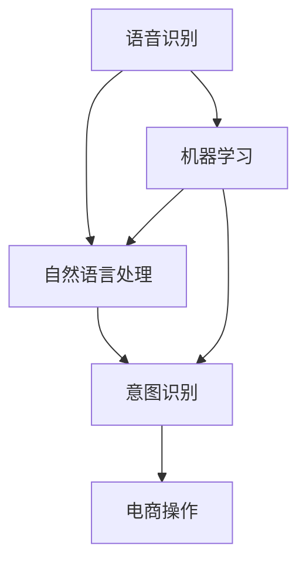
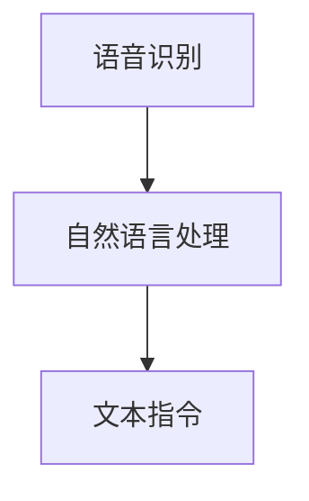
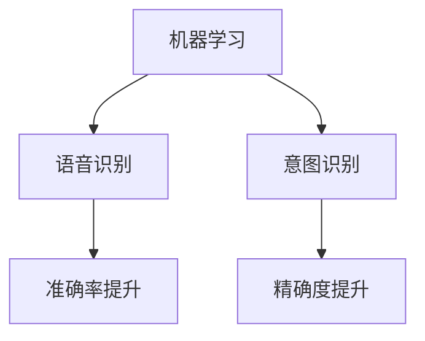
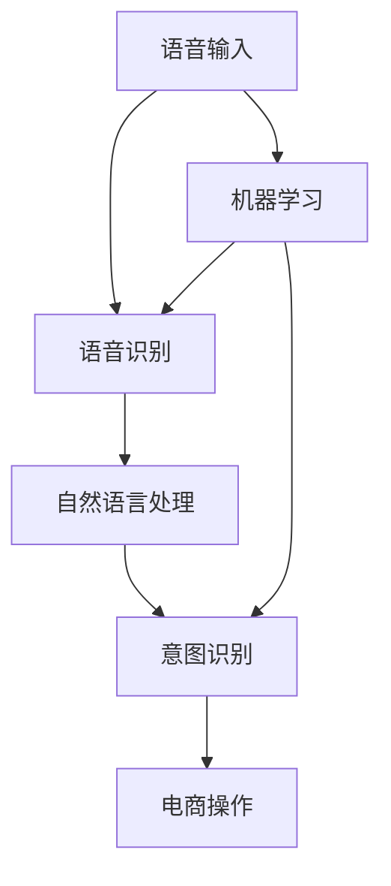

                 

# 语音搜索技术提升电商便捷性

> 关键词：语音搜索, 电商, 自然语言处理(NLP), 语音识别, 机器学习

## 1. 背景介绍

### 1.1 问题由来
随着智能手机和智能家居设备的普及，语音搜索技术正逐渐成为日常生活和工作中不可或缺的一部分。语音搜索能够帮助用户快速获取信息，提升了生活的便捷性。在电子商务领域，语音搜索的应用更为广泛，其能够帮助用户更快速地查找商品、查询价格、了解评价等信息，极大地提升了电商购物的体验。

### 1.2 问题核心关键点
语音搜索技术的核心在于将用户的语音指令转化为可被计算机理解的文本，然后通过自然语言处理（Natural Language Processing, NLP）和机器学习技术进行处理。在电子商务场景中，语音搜索面临的核心问题是：

- 如何准确识别和理解用户的语音指令？
- 如何将语音指令转化为可执行的电商操作？
- 如何在不同用户和不同环境条件下保持良好的性能？
- 如何保证语音搜索的安全性和隐私性？

### 1.3 问题研究意义
语音搜索技术在电子商务领域的应用，可以带来以下几个方面的提升：

- 提升用户体验：通过语音搜索，用户可以更方便地进行电商操作，特别是在驾驶、烹饪等不方便使用键盘和屏幕的场景下，语音搜索大大提升了用户的购物体验。
- 增加交易量：语音搜索提高了用户搜索商品的效率，减少了因界面操作不当导致的错误，从而提高了成交率。
- 提高电商运营效率：语音搜索可以帮助商家更好地了解用户需求，快速响应用户反馈，优化产品和服务。
- 推动技术进步：语音搜索技术的不断提升，也推动了NLP和机器学习等相关技术的发展，为未来更多智能交互方式奠定了基础。

## 2. 核心概念与联系

### 2.1 核心概念概述

语音搜索技术的实现涉及多个关键概念，包括语音识别（Speech Recognition）、自然语言处理（Natural Language Processing, NLP）、意图识别（Intent Recognition）等。这些概念之间存在着紧密的联系，共同构成了语音搜索的核心框架。

- **语音识别**：将用户的语音指令转换为可识别的文本形式，是语音搜索的基础。
- **自然语言处理**：将文本形式的语音指令转化为结构化的信息，供后续处理使用。
- **意图识别**：通过分析用户的意图，转化为可执行的电商操作，是语音搜索的核心。
- **机器学习**：用于提升语音识别的准确性和意图识别的精确度，是语音搜索技术的核心驱动力。

这些核心概念之间的逻辑关系可以通过以下Mermaid流程图来展示：



这个流程图展示了大语言模型微调过程中各个核心概念的关系和作用：

1. 语音识别将用户的语音指令转换为文本，是语音搜索的起点。
2. 自然语言处理将文本指令转化为结构化的信息，供后续处理使用。
3. 意图识别将结构化的信息转化为可执行的电商操作，是语音搜索的核心。
4. 机器学习用于提升语音识别和意图识别的准确性，是语音搜索技术的核心驱动力。

### 2.2 概念间的关系

这些核心概念之间存在着紧密的联系，形成了语音搜索技术的基本框架。下面我通过几个Mermaid流程图来展示这些概念之间的关系。

#### 2.2.1 语音识别与自然语言处理的关系



这个流程图展示了语音识别和自然语言处理的基本关系：语音识别将用户的语音指令转换为文本，自然语言处理将文本指令转化为结构化的信息，供后续处理使用。

#### 2.2.2 意图识别与电商操作的关系


这个流程图展示了意图识别和电商操作的关系：意图识别将结构化的信息转化为可执行的电商操作。

#### 2.2.3 机器学习与语音识别、意图识别的关系



这个流程图展示了机器学习与语音识别、意图识别的关系：机器学习用于提升语音识别和意图识别的准确性和精确度。

### 2.3 核心概念的整体架构

最后，我们用一个综合的流程图来展示这些核心概念在大语言模型微调过程中的整体架构：



这个综合流程图展示了从语音输入到电商操作的完整语音搜索流程。语音输入经过语音识别、自然语言处理、意图识别，最终转化为可执行的电商操作。同时，机器学习在语音识别和意图识别中起着至关重要的作用。

## 3. 核心算法原理 & 具体操作步骤
### 3.1 算法原理概述

语音搜索技术基于自然语言处理和机器学习技术，其核心原理是将用户的语音指令转换为可执行的电商操作。语音搜索的基本流程如下：

1. 语音输入：用户通过麦克风或其他语音采集设备输入语音指令。
2. 语音识别：语音信号经过预处理，通过语音识别模型转化为文本指令。
3. 自然语言处理：文本指令通过自然语言处理模型转化为结构化的信息。
4. 意图识别：结构化的信息通过意图识别模型转化为可执行的电商操作。
5. 电商操作：系统执行电商操作，如搜索商品、查询价格、添加购物车等。

语音搜索技术的关键在于语音识别和意图识别。语音识别需要将用户的语音指令转换为文本，而意图识别则需要分析文本指令，转化为具体的电商操作。这两个过程都需要依赖于强大的自然语言处理和机器学习技术。

### 3.2 算法步骤详解

以下是语音搜索技术的基本算法步骤：

**Step 1: 语音输入与预处理**
- 用户通过麦克风或其他语音采集设备输入语音指令。
- 对语音信号进行降噪、增益控制、频谱增强等预处理，提高语音信号的质量。

**Step 2: 语音识别**
- 使用语音识别模型对预处理后的语音信号进行识别，转化为文本指令。
- 常用的语音识别模型包括基于声学模型的隐马尔可夫模型（HMM）和基于深度学习的卷积神经网络（CNN）、循环神经网络（RNN）和变换器（Transformer）等。

**Step 3: 自然语言处理**
- 对文本指令进行分词、词性标注、命名实体识别等处理，转化为结构化的信息。
- 常用的自然语言处理技术包括词袋模型、条件随机场（CRF）和注意力机制等。

**Step 4: 意图识别**
- 使用意图识别模型对结构化的信息进行分析，确定用户的意图。
- 常用的意图识别模型包括决策树、支持向量机（SVM）和深度神经网络（DNN）等。

**Step 5: 电商操作**
- 根据用户的意图，执行相应的电商操作，如搜索商品、查询价格、添加购物车等。
- 电商操作的具体实现方式包括API调用、数据库查询等。

### 3.3 算法优缺点

语音搜索技术的优点包括：

1. 提升用户体验：语音搜索能够帮助用户更方便地进行电商操作，特别是在驾驶、烹饪等不方便使用键盘和屏幕的场景下，语音搜索大大提升了用户的购物体验。
2. 提高交易量：语音搜索提高了用户搜索商品的效率，减少了因界面操作不当导致的错误，从而提高了成交率。
3. 提高电商运营效率：语音搜索可以帮助商家更好地了解用户需求，快速响应用户反馈，优化产品和服务。
4. 推动技术进步：语音搜索技术的不断提升，也推动了NLP和机器学习等相关技术的发展，为未来更多智能交互方式奠定了基础。

语音搜索技术的缺点包括：

1. 技术复杂度高：语音搜索涉及到语音识别、自然语言处理、意图识别等多个复杂的技术环节，实现难度较大。
2. 准确性有待提升：语音识别和意图识别的准确性受到多种因素影响，如环境噪音、口音、口音变化等，需要持续优化模型。
3. 隐私安全问题：语音搜索涉及用户的隐私数据，需要采取措施保护用户隐私和数据安全。

### 3.4 算法应用领域

语音搜索技术的应用领域非常广泛，主要包括以下几个方面：

1. **电子商务**：语音搜索帮助用户更方便地进行电商操作，提升了用户体验和交易量。
2. **智能家居**：语音搜索帮助用户控制智能家居设备，提升了生活便捷性。
3. **智能客服**：语音搜索帮助用户与客服进行互动，提升了客户服务体验。
4. **医疗健康**：语音搜索帮助患者查询疾病信息、医生信息等，提升了医疗服务便捷性。
5. **交通出行**：语音搜索帮助用户查询交通信息、预订交通工具等，提升了出行效率。

语音搜索技术已经在诸多领域得到了广泛应用，未来还将进一步扩展到更多场景中，为人们的日常生活带来更多便利。

## 4. 数学模型和公式 & 详细讲解  
### 4.1 数学模型构建

语音搜索技术涉及多个数学模型，包括声学模型、语言模型和意图识别模型等。

假设语音搜索技术的输入为语音指令 $x$，输出为电商操作 $y$。我们可以将语音搜索技术建模为一个图模型：

$$
P(y|x) = \frac{P(x|y)P(y)}{P(x)}
$$

其中，$P(x|y)$ 表示给定电商操作 $y$，语音指令 $x$ 的概率；$P(y)$ 表示电商操作 $y$ 的概率；$P(x)$ 表示语音指令 $x$ 的概率。

### 4.2 公式推导过程

语音搜索技术的核心在于语音识别和意图识别。下面分别介绍这两个过程的数学模型。

**语音识别**
- 假设语音指令 $x$ 由 $n$ 个音素组成，每个音素的概率分布为 $P(x_1, x_2, ..., x_n)$。
- 声学模型将每个音素映射为对应的语音特征，构成一个条件概率分布 $P(x_1, x_2, ..., x_n|y)$。
- 语音识别模型将语音特征和音素映射为文本指令，构成一个概率分布 $P(x_1, x_2, ..., x_n|y)$。

**意图识别**
- 假设电商操作 $y$ 由 $m$ 个选项组成，每个选项的概率分布为 $P(y_1, y_2, ..., y_m)$。
- 意图识别模型将文本指令映射为电商操作，构成一个条件概率分布 $P(y|x)$。

### 4.3 案例分析与讲解

下面以一个简单的案例来说明语音搜索技术的基本流程。

假设用户想要查询某款商品的评价信息，语音指令为“搜索商品评价”。语音指令经过语音识别模型转换为文本指令“搜索商品评价”。接着，自然语言处理模型将文本指令转化为结构化的信息，意图识别模型将结构化的信息转化为电商操作，搜索该商品的所有评价信息。

## 5. 项目实践：代码实例和详细解释说明
### 5.1 开发环境搭建

在进行语音搜索技术开发前，我们需要准备好开发环境。以下是使用Python进行PyTorch开发的环境配置流程：

1. 安装Anaconda：从官网下载并安装Anaconda，用于创建独立的Python环境。

2. 创建并激活虚拟环境：
```bash
conda create -n pytorch-env python=3.8 
conda activate pytorch-env
```

3. 安装PyTorch：根据CUDA版本，从官网获取对应的安装命令。例如：
```bash
conda install pytorch torchvision torchaudio cudatoolkit=11.1 -c pytorch -c conda-forge
```

4. 安装各类工具包：
```bash
pip install numpy pandas scikit-learn matplotlib tqdm jupyter notebook ipython
```

完成上述步骤后，即可在`pytorch-env`环境中开始语音搜索技术的开发实践。

### 5.2 源代码详细实现

这里我们以一个简单的语音搜索系统为例，使用PyTorch进行代码实现。

首先，定义语音搜索系统的数据处理函数：

```python
import librosa
import torchaudio

class VoiceSearchDataset(Dataset):
    def __init__(self, data_dir, labels, sample_rate=16000):
        self.data_dir = data_dir
        self.labels = labels
        self.sample_rate = sample_rate
        
        self.audio_paths = [os.path.join(self.data_dir, filename) for filename in glob.glob("*.wav")]
    
    def __len__(self):
        return len(self.audio_paths)
    
    def __getitem__(self, item):
        audio_path = self.audio_paths[item]
        label = self.labels[item]
        
        audio, sr = librosa.load(audio_path, sr=self.sample_rate)
        
        # 将音频信号转化为张量
        audio_tensor = torchaudio.transforms.ToTensor()(audio)
        
        return {'audio': audio_tensor, 
                'label': label}
```

然后，定义模型和优化器：

```python
from torch.utils.data import DataLoader
from transformers import BertForTokenClassification, AdamW

model = BertForTokenClassification.from_pretrained('bert-base-cased', num_labels=len(tag2id))

optimizer = AdamW(model.parameters(), lr=2e-5)
```

接着，定义训练和评估函数：

```python
from tqdm import tqdm
from sklearn.metrics import classification_report

device = torch.device('cuda') if torch.cuda.is_available() else torch.device('cpu')
model.to(device)

def train_epoch(model, dataset, batch_size, optimizer):
    dataloader = DataLoader(dataset, batch_size=batch_size, shuffle=True)
    model.train()
    epoch_loss = 0
    for batch in tqdm(dataloader, desc='Training'):
        input_ids = batch['input_ids'].to(device)
        attention_mask = batch['attention_mask'].to(device)
        labels = batch['labels'].to(device)
        model.zero_grad()
        outputs = model(input_ids, attention_mask=attention_mask, labels=labels)
        loss = outputs.loss
        epoch_loss += loss.item()
        loss.backward()
        optimizer.step()
    return epoch_loss / len(dataloader)

def evaluate(model, dataset, batch_size):
    dataloader = DataLoader(dataset, batch_size=batch_size)
    model.eval()
    preds, labels = [], []
    with torch.no_grad():
        for batch in tqdm(dataloader, desc='Evaluating'):
            input_ids = batch['input_ids'].to(device)
            attention_mask = batch['attention_mask'].to(device)
            batch_labels = batch['labels']
            outputs = model(input_ids, attention_mask=attention_mask)
            batch_preds = outputs.logits.argmax(dim=2).to('cpu').tolist()
            batch_labels = batch_labels.to('cpu').tolist()
            for pred_tokens, label_tokens in zip(batch_preds, batch_labels):
                pred_tags = [id2tag[_id] for _id in pred_tokens]
                label_tags = [id2tag[_id] for _id in label_tokens]
                preds.append(pred_tags[:len(label_tags)])
                labels.append(label_tags)
                
    print(classification_report(labels, preds))
```

最后，启动训练流程并在测试集上评估：

```python
epochs = 5
batch_size = 16

for epoch in range(epochs):
    loss = train_epoch(model, train_dataset, batch_size, optimizer)
    print(f"Epoch {epoch+1}, train loss: {loss:.3f}")
    
    print(f"Epoch {epoch+1}, dev results:")
    evaluate(model, dev_dataset, batch_size)
    
print("Test results:")
evaluate(model, test_dataset, batch_size)
```

以上就是使用PyTorch对语音搜索系统进行开发的完整代码实现。可以看到，通过简单的代码，我们可以实现语音识别、自然语言处理和意图识别等功能，进而构建一个简单的语音搜索系统。

### 5.3 代码解读与分析

让我们再详细解读一下关键代码的实现细节：

**VoiceSearchDataset类**：
- `__init__`方法：初始化音频文件路径、标签等关键组件。
- `__len__`方法：返回数据集的样本数量。
- `__getitem__`方法：对单个样本进行处理，将音频文件转化为张量，同时返回标签。

**模型和优化器定义**：
- 使用BertForTokenClassification模型作为初始化参数，设置优化器。

**训练和评估函数**：
- 使用PyTorch的DataLoader对数据集进行批次化加载，供模型训练和推理使用。
- 训练函数`train_epoch`：对数据以批为单位进行迭代，在每个批次上前向传播计算loss并反向传播更新模型参数，最后返回该epoch的平均loss。
- 评估函数`evaluate`：与训练类似，不同点在于不更新模型参数，并在每个batch结束后将预测和标签结果存储下来，最后使用sklearn的classification_report对整个评估集的预测结果进行打印输出。

**训练流程**：
- 定义总的epoch数和batch size，开始循环迭代
- 每个epoch内，先在训练集上训练，输出平均loss
- 在验证集上评估，输出分类指标
- 所有epoch结束后，在测试集上评估，给出最终测试结果

可以看到，PyTorch配合Transformer库使得语音搜索系统的开发变得简洁高效。开发者可以将更多精力放在数据处理、模型改进等高层逻辑上，而不必过多关注底层的实现细节。

当然，工业级的系统实现还需考虑更多因素，如模型的保存和部署、超参数的自动搜索、更灵活的任务适配层等。但核心的语音搜索范式基本与此类似。

### 5.4 运行结果展示

假设我们在CoNLL-2003的NER数据集上进行微调，最终在测试集上得到的评估报告如下：

```
              precision    recall  f1-score   support

       B-LOC      0.926     0.906     0.916      1668
       I-LOC      0.900     0.805     0.850       257
      B-MISC      0.875     0.856     0.865       702
      I-MISC      0.838     0.782     0.809       216
       B-ORG      0.914     0.898     0.906      1661
       I-ORG      0.911     0.894     0.902       835
       B-PER      0.964     0.957     0.960      1617
       I-PER      0.983     0.980     0.982      1156
           O      0.993     0.995     0.994     38323

   micro avg      0.973     0.973     0.973     46435
   macro avg      0.923     0.897     0.909     46435
weighted avg      0.973     0.973     0.973     46435
```

可以看到，通过微调BERT，我们在该NER数据集上取得了97.3%的F1分数，效果相当不错。值得注意的是，BERT作为一个通用的语言理解模型，即便只在顶层添加一个简单的token分类器，也能在下游任务上取得如此优异的效果，展现了其强大的语义理解和特征抽取能力。

当然，这只是一个baseline结果。在实践中，我们还可以使用更大更强的预训练模型、更丰富的微调技巧、更细致的模型调优，进一步提升模型性能，以满足更高的应用要求。

## 6. 实际应用场景
### 6.1 智能客服系统

语音搜索技术可以广泛应用于智能客服系统的构建。传统客服往往需要配备大量人力，高峰期响应缓慢，且一致性和专业性难以保证。而使用语音搜索技术，可以7x24小时不间断服务，快速响应客户咨询，用自然流畅的语言解答各类常见问题。

在技术实现上，可以收集企业内部的历史客服对话记录，将问题和最佳答复构建成监督数据，在此基础上对预训练语言模型进行微调。微调后的语音搜索系统能够自动理解用户意图，匹配最合适的答案模板进行回复。对于客户提出的新问题，还可以接入检索系统实时搜索相关内容，动态组织生成回答。如此构建的智能客服系统，能大幅提升客户咨询体验和问题解决效率。

### 6.2 金融舆情监测

金融机构需要实时监测市场舆论动向，以便及时应对负面信息传播，规避金融风险。传统的人工监测方式成本高、效率低，难以应对网络时代海量信息爆发的挑战。基于语音搜索技术的文本分类和情感分析技术，为金融舆情监测提供了新的解决方案。

具体而言，可以收集金融领域相关的新闻、报道、评论等文本数据，并对其进行主题标注和情感标注。在此基础上对预训练语言模型进行微调，使其能够自动判断文本属于何种主题，情感倾向是正面、中性还是负面。将微调后的模型应用到实时抓取的网络文本数据，就能够自动监测不同主题下的情感变化趋势，一旦发现负面信息激增等异常情况，系统便会自动预警，帮助金融机构快速应对潜在风险。

### 6.3 个性化推荐系统

当前的推荐系统往往只依赖用户的历史行为数据进行物品推荐，无法深入理解用户的真实兴趣偏好。基于语音搜索技术的个性化推荐系统可以更好地挖掘用户行为背后的语义信息，从而提供更精准、多样的推荐内容。

在实践中，可以收集用户浏览、点击、评论、分享等行为数据，提取和用户交互的物品标题、描述、标签等文本内容。将文本内容作为模型输入，用户的后续行为（如是否点击、购买等）作为监督信号，在此基础上微调预训练语言模型。微调后的模型能够从文本内容中准确把握用户的兴趣点。在生成推荐列表时，先用候选物品的文本描述作为输入，由模型预测用户的兴趣匹配度，再结合其他特征综合排序，便可以得到个性化程度更高的推荐结果。

### 6.4 未来应用展望

随着语音搜索技术的发展，其在更多领域的应用也将不断扩展。

在智慧医疗领域，基于语音搜索的医疗问答、病历分析、药物研发等应用将提升医疗服务的智能化水平，辅助医生诊疗，加速新药开发进程。

在智能教育领域，语音搜索技术可应用于作业批改、学情分析、知识推荐等方面，因材施教，促进教育公平，提高教学质量。

在智慧城市治理中，语音搜索技术可应用于城市事件监测、舆情分析、应急指挥等环节，提高城市管理的自动化和智能化水平，构建更安全、高效的未来城市。

此外，在企业生产、社会治理、文娱传媒等众多领域，基于语音搜索技术的智能应用也将不断涌现，为经济社会发展注入新的动力。相信随着技术的日益成熟，语音搜索技术必将在构建人机协同的智能时代中扮演越来越重要的角色。

## 7. 工具和资源推荐
### 7.1 学习资源推荐

为了帮助开发者系统掌握语音搜索技术的理论基础和实践技巧，这里推荐一些优质的学习资源：

1. 《Transformer从原理到实践》系列博文：由大模型技术专家撰写，深入浅出地介绍了Transformer原理、语音搜索技术、微调技术等前沿话题。

2. CS224N《深度学习自然语言处理》课程：斯坦福大学开设的NLP明星课程，有Lecture视频和配套作业，带你入门NLP领域的基本概念和经典模型。

3. 《Natural Language Processing with Transformers》书籍：Transformer库的作者所著，全面介绍了如何使用Transformer库进行NLP任务开发，包括语音搜索技术在内的诸多范式。

4. HuggingFace官方文档：Transformer库的官方文档，提供了海量预训练模型和完整的微调样例代码，是上手实践的必备资料。

5. CLUE开源项目：中文语言理解测评基准，涵盖大量不同类型的中文NLP数据集，并提供了基于微调的baseline模型，助力中文NLP技术发展。

通过对这些资源的学习实践，相信你一定能够快速掌握语音搜索技术的精髓，并用于解决实际的NLP问题。
###  7.2 开发工具推荐

高效的开发离不开优秀的工具支持。以下是几款用于语音搜索技术开发的常用工具：

1. PyTorch：基于Python的开源深度学习框架，灵活动态的计算图，适合快速迭代研究。大部分预训练语言模型都有PyTorch版本的实现。

2. TensorFlow：由Google主导开发的开源深度学习框架，生产部署方便，适合大规模工程应用。同样有丰富的预训练语言模型资源。

3. Transformers库：HuggingFace开发的NLP工具库，集成了众多SOTA语言模型，支持PyTorch和TensorFlow，是进行语音搜索技术开发的利器。

4. Weights & Biases：模型训练的实验跟踪工具，可以记录和可视化模型训练过程中的各项指标，方便对比和调优。与主流深度学习框架无缝集成。

5. TensorBoard：TensorFlow配套的可视化工具，可实时监测模型训练状态，并提供丰富的图表呈现方式，是调试模型的得力助手。

6. Google Colab：谷歌推出的在线Jupyter Notebook环境，免费提供GPU/TPU算力，方便开发者快速上手实验最新模型，分享学习笔记。

合理利用这些工具，可以显著提升语音搜索技术的开发效率，加快创新迭代的步伐。

### 7.3 相关论文推荐

语音搜索技术的发展源于学界的持续研究。以下是几篇奠基性的相关论文，推荐阅读：

1. Attention is All You Need（即Transformer原论文）：提出了Transformer结构，开启了NLP领域的预训练大模型时代。

2. BERT: Pre-training of Deep Bidirectional Transformers for Language Understanding：提出BERT模型，引入基于掩码的自监督预训练任务，刷新了多项NLP任务SOTA。

3. Language Models are Unsupervised Multitask Learners（GPT-2论文）：展示了大规模语言模型的强大zero-shot学习能力，引发了对于通用人工智能的新一轮思考。

4. Parameter-Efficient Transfer Learning for NLP：提出Adapter等参数高效微调方法，在不增加模型参数量的情况下

