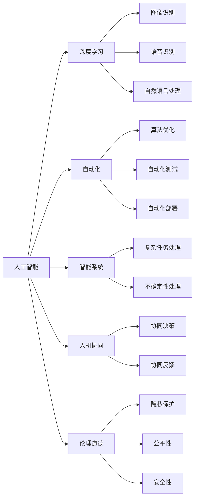
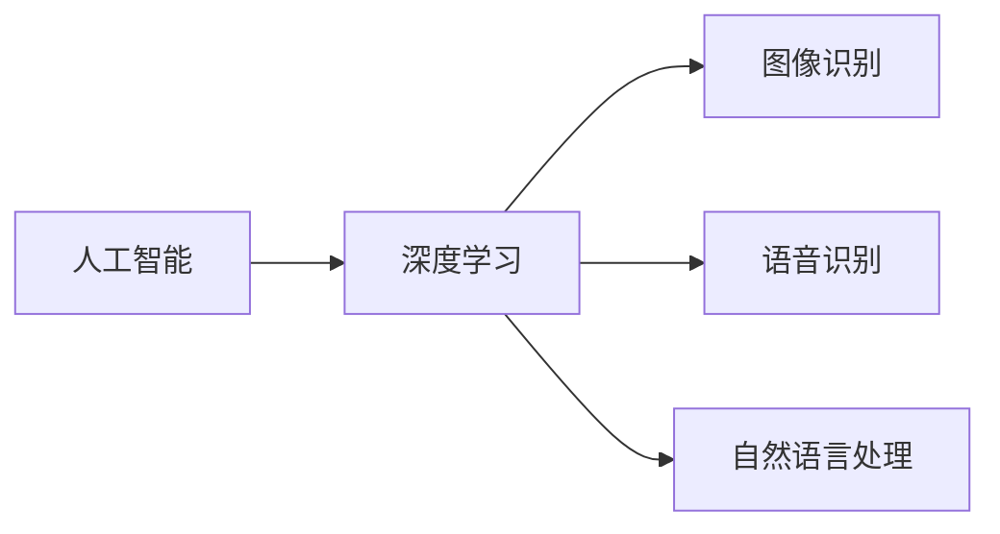
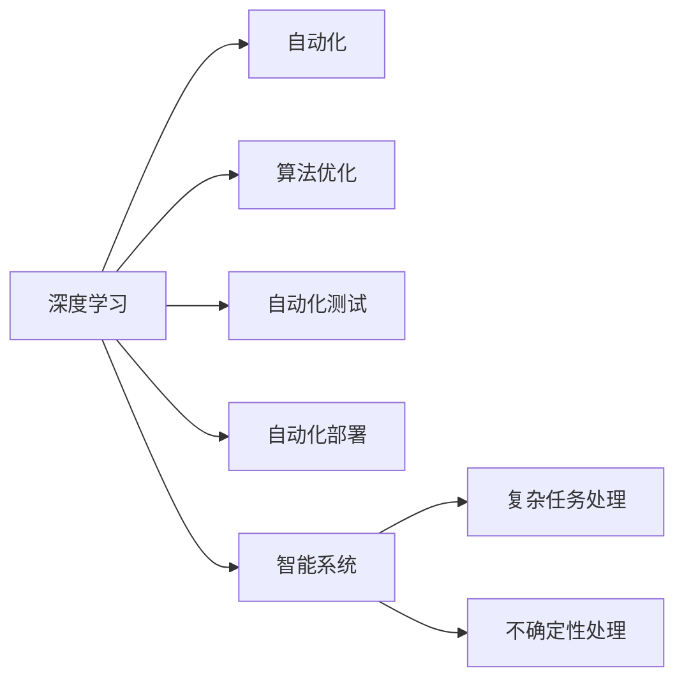
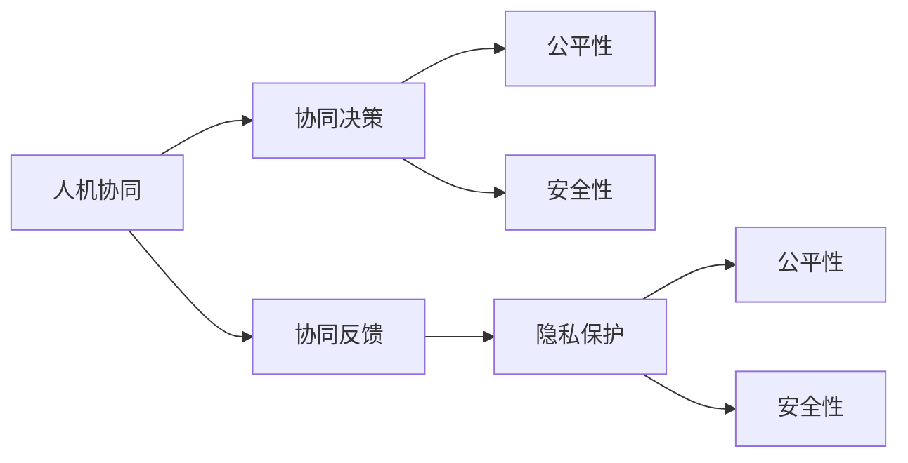
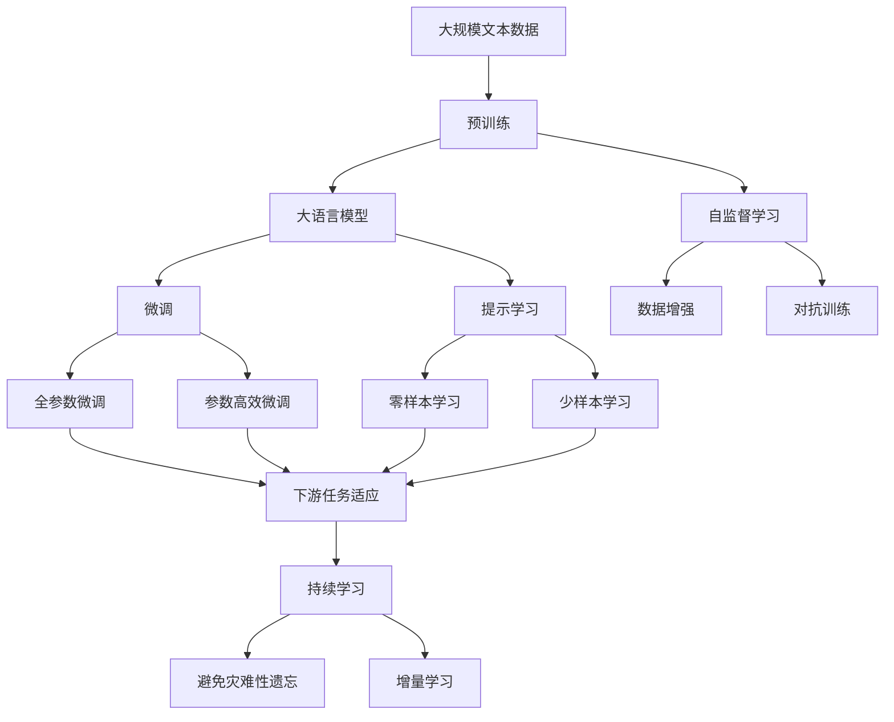

                 

# 软件 2.0 的哲学思考：人工智能的本质

> 关键词：
- 人工智能
- 软件 2.0
- 深度学习
- 自动化
- 智能系统
- 人机协同
- 哲学思考

## 1. 背景介绍

### 1.1 问题由来

进入21世纪以来，人工智能（AI）技术取得了显著进展，尤其是在深度学习和机器学习领域。深度学习模型如卷积神经网络（CNN）和递归神经网络（RNN）在图像识别、语音识别和自然语言处理（NLP）等任务上取得了突破性的成果。这些技术的应用已经渗透到各个行业，改变了人们的生活和工作方式。

然而，随着AI技术的不断演进，人们对其本质和未来发展方向的思考也在逐渐深入。传统的观点将AI视为一种工具，而新视角则将AI视为一个“生命体”，具备自主学习和自我进化能力。这种转变促使人们重新思考AI与人类社会的关系，以及对软件系统设计的新需求。

### 1.2 问题核心关键点

在软件工程领域，“软件 2.0”是指一种新型的软件开发范式，强调以数据为中心，通过机器学习和人工智能技术，自动生成和优化代码。它与传统软件工程的“软件 1.0”（以程序员为主导，通过编写代码实现特定功能）有很大不同。

软件 2.0的核心关键点包括：
- 数据驱动：软件开发过程围绕数据展开，通过数据分析和机器学习自动生成代码。
- 自适应：系统能够根据环境变化和用户需求进行自我调整和优化。
- 自动化：自动化的过程减少了人类工作量，提升了开发效率和系统性能。
- 智能系统：系统具备智能推理、自我学习和适应能力，能够处理复杂任务和不确定性。
- 哲学思考：在技术实现中融入哲学思考，探讨人机协同、伦理道德等深刻问题。

软件 2.0的核心理念是将AI技术应用于软件开发，实现更高层次的自动化和智能化，从而提升系统性能和用户体验。同时，这一范式也为AI技术的应用提供了新的视角，促使人们在技术实现和应用过程中深入思考其本质和伦理道德问题。

### 1.3 问题研究意义

研究软件 2.0的哲学思考和人工智能的本质，对于推动AI技术的广泛应用和深入发展具有重要意义：

1. **推动技术进步**：通过哲学思考，深入理解AI技术的本质和局限，能够引导技术发展的正确方向，避免误入歧途。
2. **提升用户体验**：AI技术能够提供更加个性化、智能化的解决方案，提升用户的使用体验和满意度。
3. **优化资源配置**：通过数据驱动和自动化，实现资源的有效利用和优化配置，提高开发效率和系统性能。
4. **促进跨领域融合**：软件 2.0的哲学思考能够促进AI技术与更多领域的融合，推动跨学科研究和应用。
5. **引导伦理道德**：深入思考AI技术的伦理道德问题，推动建立更加公平、透明和可解释的AI系统。

## 2. 核心概念与联系

### 2.1 核心概念概述

软件 2.0的哲学思考涉及多个核心概念，这些概念之间相互联系，共同构成了AI技术的应用基础：

- **人工智能（AI）**：通过机器学习、深度学习等技术，使计算机具备类人智能，能够进行自主学习和决策。
- **深度学习**：一种基于神经网络的机器学习技术，能够处理大规模数据，并在图像识别、语音识别、自然语言处理等领域取得显著成果。
- **自动化**：通过算法和工具实现自动化，减少人工干预，提升效率和准确性。
- **智能系统**：具备自主学习、推理和决策能力的软件系统，能够处理复杂任务和不确定性。
- **人机协同**：在软件系统中，人与机器互相协作，共同完成任务。
- **伦理道德**：在AI技术应用中，需要考虑伦理道德问题，如隐私保护、公平性、安全性等。

这些核心概念之间的逻辑关系可以通过以下Mermaid流程图来展示：



这个流程图展示了大语言模型微调过程中各个核心概念之间的关系：

1. 人工智能通过深度学习等技术实现类人智能。
2. 深度学习在图像识别、语音识别和自然语言处理等领域取得突破。
3. 自动化通过算法和工具提升效率和准确性。
4. 智能系统具备自主学习、推理和决策能力。
5. 人机协同提升系统的协作效率和用户体验。
6. 伦理道德确保系统的公平性、隐私保护和安全性。

### 2.2 概念间的关系

这些核心概念之间存在着紧密的联系，形成了软件 2.0的完整生态系统。下面我们通过几个Mermaid流程图来展示这些概念之间的关系。

#### 2.2.1 人工智能与深度学习的关系



这个流程图展示了人工智能与深度学习的关系：

1. 人工智能通过深度学习等技术实现类人智能。
2. 深度学习在图像识别、语音识别和自然语言处理等领域取得突破。

#### 2.2.2 深度学习与自动化、智能系统的关系



这个流程图展示了深度学习与自动化、智能系统的关系：

1. 深度学习通过算法优化、自动化测试和自动化部署等技术提升系统性能。
2. 智能系统具备复杂任务处理和不确定性处理能力。

#### 2.2.3 人机协同与伦理道德的关系



这个流程图展示了人机协同与伦理道德的关系：

1. 人机协同通过协同决策和协同反馈提升用户体验和系统性能。
2. 伦理道德确保系统的公平性、隐私保护和安全性。

### 2.3 核心概念的整体架构

最后，我们用一个综合的流程图来展示这些核心概念在大语言模型微调过程中的整体架构：



这个综合流程图展示了从预训练到微调，再到持续学习的完整过程。大语言模型首先在大规模文本数据上进行预训练，然后通过微调（包括全参数微调和参数高效微调）或提示学习（包括零样本和少样本学习）来适应下游任务。最后，通过持续学习技术，模型可以不断更新和适应新的任务和数据。

## 3. 核心算法原理 & 具体操作步骤
### 3.1 算法原理概述

基于深度学习的软件 2.0的哲学思考，本质上是一种自动化、智能化的软件开发范式。其核心思想是：将AI技术应用于软件开发过程，通过数据驱动和自动化，实现系统的自我优化和升级。

形式化地，假设预训练模型为 $M_{\theta}$，其中 $\theta$ 为预训练得到的模型参数。给定下游任务 $T$ 的标注数据集 $D=\{(x_i,y_i)\}_{i=1}^N$，软件 2.0的目标是找到新的模型参数 $\hat{\theta}$，使得：

$$
\hat{\theta}=\mathop{\arg\min}_{\theta} \mathcal{L}(M_{\theta},D)
$$

其中 $\mathcal{L}$ 为针对任务 $T$ 设计的损失函数，用于衡量模型预测输出与真实标签之间的差异。常见的损失函数包括交叉熵损失、均方误差损失等。

通过梯度下降等优化算法，软件 2.0过程不断更新模型参数 $\theta$，最小化损失函数 $\mathcal{L}$，使得模型输出逼近真实标签。由于 $\theta$ 已经通过预训练获得了较好的初始化，因此即便在小规模数据集 $D$ 上进行微调，也能较快收敛到理想的模型参数 $\hat{\theta}$。

### 3.2 算法步骤详解

基于深度学习的软件 2.0的哲学思考，一般包括以下几个关键步骤：

**Step 1: 准备预训练模型和数据集**
- 选择合适的深度学习模型 $M_{\theta}$ 作为初始化参数，如CNN、RNN、Transformer等。
- 准备下游任务 $T$ 的标注数据集 $D$，划分为训练集、验证集和测试集。一般要求标注数据与预训练数据的分布不要差异过大。

**Step 2: 添加任务适配层**
- 根据任务类型，在预训练模型顶层设计合适的输出层和损失函数。
- 对于分类任务，通常在顶层添加线性分类器和交叉熵损失函数。
- 对于生成任务，通常使用语言模型的解码器输出概率分布，并以负对数似然为损失函数。

**Step 3: 设置微调超参数**
- 选择合适的优化算法及其参数，如Adam、SGD等，设置学习率、批大小、迭代轮数等。
- 设置正则化技术及强度，包括权重衰减、Dropout、Early Stopping等。
- 确定冻结预训练参数的策略，如仅微调顶层，或全部参数都参与微调。

**Step 4: 执行梯度训练**
- 将训练集数据分批次输入模型，前向传播计算损失函数。
- 反向传播计算参数梯度，根据设定的优化算法和学习率更新模型参数。
- 周期性在验证集上评估模型性能，根据性能指标决定是否触发 Early Stopping。
- 重复上述步骤直到满足预设的迭代轮数或 Early Stopping 条件。

**Step 5: 测试和部署**
- 在测试集上评估微调后模型 $M_{\hat{\theta}}$ 的性能，对比微调前后的精度提升。
- 使用微调后的模型对新样本进行推理预测，集成到实际的应用系统中。
- 持续收集新的数据，定期重新微调模型，以适应数据分布的变化。

以上是基于深度学习的软件 2.0的哲学思考的一般流程。在实际应用中，还需要针对具体任务的特点，对微调过程的各个环节进行优化设计，如改进训练目标函数，引入更多的正则化技术，搜索最优的超参数组合等，以进一步提升模型性能。

### 3.3 算法优缺点

基于深度学习的软件 2.0的哲学思考方法具有以下优点：

1. **简单高效**：只需准备少量标注数据，即可对预训练模型进行快速适配，获得较大的性能提升。
2. **通用适用**：适用于各种NLP下游任务，包括分类、匹配、生成等，设计简单的任务适配层即可实现微调。
3. **参数高效**：利用参数高效微调技术，在固定大部分预训练参数的情况下，仍可取得不错的提升。
4. **效果显著**：在学术界和工业界的诸多任务上，基于微调的方法已经刷新了最先进的性能指标。

同时，该方法也存在一定的局限性：

1. **依赖标注数据**：微调的效果很大程度上取决于标注数据的质量和数量，获取高质量标注数据的成本较高。
2. **迁移能力有限**：当目标任务与预训练数据的分布差异较大时，微调的性能提升有限。
3. **负面效果传递**：预训练模型的固有偏见、有害信息等，可能通过微调传递到下游任务，造成负面影响。
4. **可解释性不足**：微调模型的决策过程通常缺乏可解释性，难以对其推理逻辑进行分析和调试。

尽管存在这些局限性，但就目前而言，基于深度学习的微调方法仍是大语言模型应用的最主流范式。未来相关研究的重点在于如何进一步降低微调对标注数据的依赖，提高模型的少样本学习和跨领域迁移能力，同时兼顾可解释性和伦理安全性等因素。

### 3.4 算法应用领域

基于深度学习的软件 2.0的哲学思考方法，已经在自然语言处理（NLP）、计算机视觉（CV）、语音识别等领域得到了广泛的应用，覆盖了几乎所有常见任务，例如：

- 文本分类：如情感分析、主题分类、意图识别等。通过微调使模型学习文本-标签映射。
- 命名实体识别：识别文本中的人名、地名、机构名等特定实体。通过微调使模型掌握实体边界和类型。
- 关系抽取：从文本中抽取实体之间的语义关系。通过微调使模型学习实体-关系三元组。
- 问答系统：对自然语言问题给出答案。将问题-答案对作为微调数据，训练模型学习匹配答案。
- 机器翻译：将源语言文本翻译成目标语言。通过微调使模型学习语言-语言映射。
- 文本摘要：将长文本压缩成简短摘要。将文章-摘要对作为微调数据，使模型学习抓取要点。
- 对话系统：使机器能够与人自然对话。将多轮对话历史作为上下文，微调模型进行回复生成。

除了上述这些经典任务外，软件 2.0的哲学思考还被创新性地应用到更多场景中，如可控文本生成、常识推理、代码生成、数据增强等，为深度学习技术带来了全新的突破。随着深度学习模型和软件 2.0方法的不断进步，相信深度学习技术将在更广阔的应用领域大放异彩。

## 4. 数学模型和公式 & 详细讲解

### 4.1 数学模型构建

本节将使用数学语言对基于深度学习的软件 2.0的哲学思考过程进行更加严格的刻画。

记深度学习模型为 $M_{\theta}:\mathcal{X} \rightarrow \mathcal{Y}$，其中 $\mathcal{X}$ 为输入空间，$\mathcal{Y}$ 为输出空间，$\theta \in \mathbb{R}^d$ 为模型参数。假设微调任务的训练集为 $D=\{(x_i,y_i)\}_{i=1}^N, x_i \in \mathcal{X}, y_i \in \mathcal{Y}$。

定义模型 $M_{\theta}$ 在数据样本 $(x,y)$ 上的损失函数为 $\ell(M_{\theta}(x),y)$，则在数据集 $D$ 上的经验风险为：

$$
\mathcal{L}(\theta) = \frac{1}{N} \sum_{i=1}^N \ell(M_{\theta}(x_i),y_i)
$$

微调的优化目标是最小化经验风险，即找到最优参数：

$$
\theta^* = \mathop{\arg\min}_{\theta} \mathcal{L}(\theta)
$$

在实践中，我们通常使用基于梯度的优化算法（如Adam、SGD等）来近似求解上述最优化问题。设 $\eta$ 为学习率，$\lambda$ 为正则化系数，则参数的更新公式为：

$$
\theta \leftarrow \theta - \eta \nabla_{\theta}\mathcal{L}(\theta) - \eta\lambda\theta
$$

其中 $\nabla_{\theta}\mathcal{L}(\theta)$ 为损失函数对参数 $\theta$ 的梯度，可通过反向传播算法高效计算。

### 4.2 公式推导过程

以下我们以二分类任务为例，推导交叉熵损失函数及其梯度的计算公式。

假设模型 $M_{\theta}$ 在输入 $x$ 上的输出为 $\hat{y}=M_{\theta}(x) \in [0,1]$，表示样本属于正类的概率。真实标签 $y \in \{0,1\}$。则二分类交叉熵损失函数定义为：

$$
\ell(M_{\theta}(x),y) = -[y\log \hat{y} + (1-y)\log (1-\hat{y})]
$$

将其代入经验风险公式，得：

$$
\mathcal{L}(\theta) = -\frac{1}{N}\sum_{i=1}^N [y_i\log M_{\theta}(x_i)+(1-y_i)\log(1-M_{\theta}(x_i))]
$$

根据链式法则，损失函数对参数 $\theta_k$ 的梯度为：

$$
\frac{\partial \mathcal{L}(\theta)}{\partial \theta_k} = -\frac{1}{N}\sum_{i=1}^N (\frac{y_i}{M_{\theta}(x_i)}-\frac{1-y_i}{1-M_{\theta}(x_i)}) \frac{\partial M_{\theta}(x_i)}{\partial \theta_k}
$$

其中 $\frac{\partial M_{\theta}(x_i)}{\partial \theta_k}$ 可进一步递归展开，利用自动微分技术完成计算。

在得到损失函数的梯度后，即可带入参数更新公式，完成模型的迭代优化。重复上述过程直至收敛，最终得到适应下游任务的最优模型参数 $\theta^*$。

## 5. 项目实践：代码实例和详细解释说明
### 5.1 开发环境搭建

在进行软件 2.0的哲学思考实践前，我们需要准备好开发环境。以下是使用Python进行TensorFlow开发的环境配置流程：

1. 安装Anaconda：从官网下载并安装Anaconda，用于创建独立的Python环境。

2. 创建并激活虚拟环境：
```bash
conda create -n tf-env python=3.8 
conda activate tf-env
```

3. 安装TensorFlow：根据CUDA版本，从官网获取对应的安装命令。例如：
```bash
conda install tensorflow==2.7
```

4. 安装各类工具包：
```bash
pip install numpy pandas scikit-learn matplotlib tqdm jupyter notebook ipython
```

完成上述步骤后，即可在`tf-env`环境中开始软件 2.0的哲学思考实践。

### 5.2 源代码详细实现

这里我们以命名实体识别(NER)任务为例，给出使用TensorFlow对BERT模型进行微调的代码实现。

首先，定义NER任务的数据处理函数：

```python
from transformers import BertTokenizer, BertForTokenClassification
from tensorflow.keras.preprocessing.sequence import pad_sequences
import tensorflow as tf

class NERDataset(tf.data.Dataset):
    def __init__(self, texts, tags, tokenizer, max_len=128):
        self.texts = texts
        self.tags = tags
        self.tokenizer = tokenizer
        self.max_len = max_len
        
    def __len__(self):
        return len(self.texts)
    
    def __getitem__(self, item):
        text = self.texts[item]
        tags = self.tags[item]
        
        encoding = self.tokenizer(text, return_tensors='tf', max_length=self.max_len, padding='max_length', truncation=True)
        input_ids = encoding['input_ids']
        attention_mask = encoding['attention_mask']
        labels = [tag2id[tag] for tag in tags] + [tag2id['O']] * (self.max_len - len(tags))
        
        return {'input_ids': input_ids,
                'attention_mask': attention_mask,
                'labels': tf.constant(labels, dtype=tf.int32)}
```

然后，定义模型和优化器：

```python
from transformers import BertForTokenClassification, AdamW

model = BertForTokenClassification.from_pretrained('bert-base-cased', num_labels=len(tag2id))

optimizer = AdamW(model.parameters(), lr=2e-5)
```

接着，定义训练和评估函数：

```python
batch_size = 16
device = tf.device('cuda') if tf.cuda.is_available() else tf.device('cpu')
model.to(device)

def train_epoch(model, dataset, batch_size, optimizer):
    dataloader = tf.data.Dataset.from_generator(lambda: dataset,
                                              output_signature={'input_ids': tf.TensorSpec(shape=[None, None], dtype=tf.int32),
                                                              'attention_mask': tf.TensorSpec(shape=[None, None], dtype=tf.int32),
                                                              'labels': tf.TensorSpec(shape=[None], dtype=tf.int32)})
    dataloader = dataloader.shuffle(buffer_size=1024).batch(batch_size).prefetch(tf.data.experimental.AUTOTUNE)
    
    model.train()
    epoch_loss = 0
    for batch in dataloader:
        input_ids = batch['input_ids'].to(device)
        attention_mask = batch['attention_mask'].to(device)
        labels = batch['labels'].to(device)
        model.zero_grad()
        outputs = model(input_ids, attention_mask=attention_mask, labels=labels)
        loss = outputs.loss
        epoch_loss += loss.numpy()
        loss.backward()
        optimizer.step()
    return epoch_loss / len(dataloader)

def evaluate(model, dataset, batch_size):
    dataloader = tf.data.Dataset.from_generator(lambda: dataset,
                                              output_signature={'input_ids': tf.TensorSpec(shape=[None, None], dtype=tf.int32),
                                                              'attention_mask': tf.TensorSpec(shape=[None, None], dtype=tf.int32),
                                                              'labels': tf.TensorSpec(shape=[None], dtype=tf.int32)})
    dataloader = dataloader.shuffle(buffer_size=1024).batch(batch_size).prefetch(tf.data.experimental.AUTOTUNE)
    
    model.eval()
    preds, labels = [], []
    with tf.GradientTape() as tape:
        for batch in dataloader:
            input_ids = batch['input_ids'].to(device)
            attention_mask = batch['attention_mask'].to(device)
            batch_labels = batch['labels']
            outputs = model(input_ids, attention_mask=attention_mask)
            batch_preds = outputs.logits.argmax(axis=2).numpy().tolist()
            batch_labels = batch_labels.numpy().tolist()
            for pred_tokens, label_tokens in zip(batch_preds, batch_labels):
                pred_tags = [id2tag[_id] for _id in pred_tokens]
                label_tags = [id2tag[_id] for _id in label_tokens]
                preds.append(pred_tags[:len(label_tokens)])
                labels.append(label_tags)
                
    print(classification_report(labels, preds))
```

最后，启动训练流程并在测试集上评估：

```python
epochs = 5
batch_size = 16

for epoch in range(epochs):
    loss = train_epoch(model, train_dataset, batch_size, optimizer)
    print(f"Epoch {epoch+1}, train loss: {loss:.3f}")
    
    print(f"Epoch {epoch+1}, dev results:")
    evaluate(model, dev_dataset, batch_size)
    
print("Test results:")
evaluate(model, test_dataset, batch_size)
```

以上就是使用TensorFlow对BERT进行命名实体识别任务微调的完整代码实现。可以看到，得益于TensorFlow的强大封装，我们可以用相对简洁的代码完成BERT模型的加载和微调。

### 5.3 代码解读与分析

让我们再详细解读一下关键代码的实现细节：

**NERDataset类**：
- `__init__`方法：初始化文本、标签、分词器等关键组件。
- `__len__`方法：返回数据集的样本数量。
- `__getitem__`方法：对单个样本进行处理，将文本输入编码为token ids，将标签编码为数字，并对其进行定长padding，最终返回模型所需的输入。

**tag2id和id2tag字典**：
- 定义了标签与数字id之间的映射关系，用于将token-wise的预测结果解码回真实的标签。

**训练和评估函数**：
- 使用TensorFlow的DataLoader对数据集进行批次化加载，供模型训练和推理使用。
- 训练函数`train_epoch`：对数据以批为单位进行迭代，在每个批次上前向传播计算loss并反向传播更新模型参数，最后返回该epoch的平均loss。
- 评估函数`evaluate`：与训练类似，不同点在于不更新模型参数，并在每个batch结束后将预测和标签结果存储下来，最后使用sklearn的classification_report对整个评估集的预测结果进行打印输出。

**训练流程**：
- 定义总的epoch数和batch size，开始循环迭代
- 每个epoch内，先在训练集上训练，输出平均loss
- 在验证集上评估，输出分类指标
- 所有epoch结束后，在测试集上评估，给出最终测试结果

可以看到，TensorFlow配合Transformer库使得BERT微调的代码实现变得简洁高效。开发者可以将更多精力放在数据处理、模型改进等高层逻辑上，而不必过多关注底层的实现细节。

当然，工业级的系统实现还需考虑更多因素，如模型的保存和部署、超参数的自动搜索、更灵活

