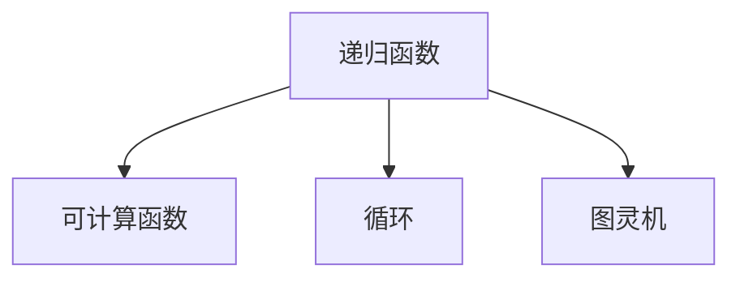
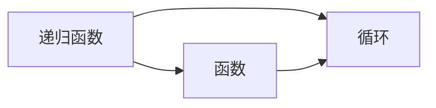
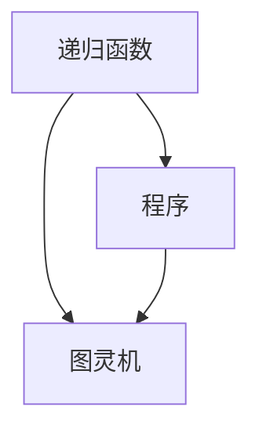
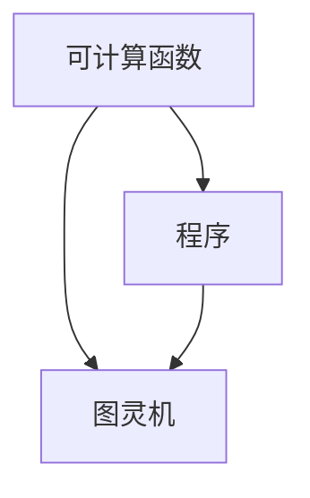
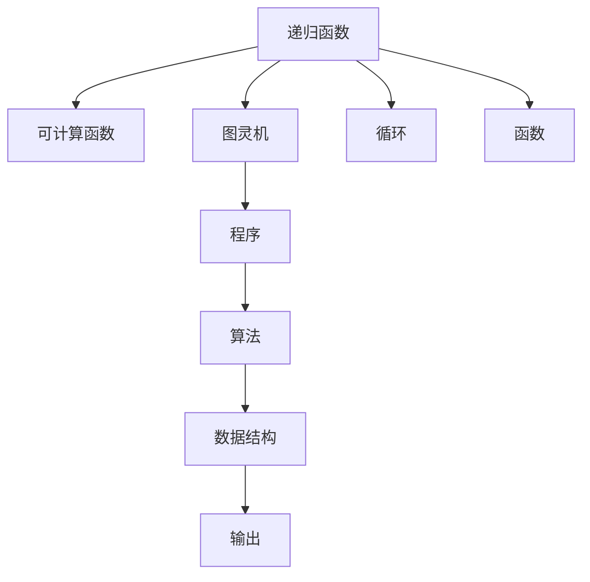

                 

# 递归函数与可计算性理论

## 1. 背景介绍

### 1.1 问题由来
递归函数与可计算性理论是计算机科学中的两个重要基础概念。递归函数在算法设计中广泛应用，是解决许多问题的有效工具。而可计算性理论则是研究哪些问题可以由计算机求解的基础理论。

### 1.2 问题核心关键点
递归函数的核心思想是将复杂问题分解为更小的子问题，并通过函数自身调用来解决这些子问题。而可计算性理论的核心则是研究哪些问题可以由计算机通过有限步骤计算得到解。

## 2. 核心概念与联系

### 2.1 核心概念概述

为更好地理解递归函数与可计算性理论，本节将介绍几个密切相关的核心概念：

- **递归函数**：一种函数能够调用自身的技术。递归函数将复杂问题拆解为更小的子问题，并通过函数自身的反复调用逐步解决这些子问题，最终得到原始问题的解。
- **可计算函数**：一个函数可以由计算机通过有限步骤计算得到结果。可计算函数是指那些能够由机器程序实现的函数。
- **递归与循环**：递归与循环都是解决重复性问题的技术。递归通过函数调用自身，循环通过条件判断反复执行相同操作。
- **图灵机**：由图灵提出的一种抽象计算模型，是可计算性理论的基础。图灵机通过读写带头部标号的纸带，执行一系列基本操作，最终输出结果。

这些核心概念之间的逻辑关系可以通过以下Mermaid流程图来展示：



这个流程图展示递归函数与可计算性理论的核心概念及其之间的关系：

1. 递归函数将问题分解为更小的子问题，并通过函数自身的反复调用逐步解决这些子问题，最终得到原始问题的解。
2. 可计算函数是指那些能够由计算机通过有限步骤计算得到结果的函数。
3. 循环是一种通过条件判断反复执行相同操作的递归技术。
4. 图灵机是一种抽象计算模型，是可计算性理论的基础。

### 2.2 概念间的关系

这些核心概念之间存在着紧密的联系，形成了递归函数与可计算性理论的完整生态系统。下面我通过几个Mermaid流程图来展示这些概念之间的关系。

#### 2.2.1 递归函数与循环的关系



这个流程图展示了递归函数与循环的关系：

1. 递归函数将问题拆分为子问题，并通过函数自身的反复调用逐步解决这些子问题。
2. 循环通过条件判断反复执行相同操作，类似于递归函数的分支结构。
3. 函数本身是递归函数或循环的核心部分。

#### 2.2.2 递归函数与图灵机的关系



这个流程图展示了递归函数与图灵机的关系：

1. 递归函数是解决问题的算法，可以看作是一种程序。
2. 图灵机是一种抽象计算模型，能够执行任何可计算函数。
3. 递归函数的执行可以被映射到图灵机上的执行，从而由图灵机求解。

#### 2.2.3 可计算函数与图灵机的关系



这个流程图展示了可计算函数与图灵机的关系：

1. 可计算函数是指那些能够由计算机通过有限步骤计算得到结果的函数。
2. 图灵机是一种抽象计算模型，能够执行任何可计算函数。
3. 可计算函数的执行可以被映射到图灵机上的执行，从而由图灵机求解。

### 2.3 核心概念的整体架构

最后，我用一个综合的流程图来展示这些核心概念在大语言模型微调过程中的整体架构：



这个综合流程图展示了递归函数与可计算性理论的核心概念及其之间的关系：

1. 递归函数将问题拆分为子问题，并通过函数自身的反复调用逐步解决这些子问题。
2. 可计算函数是指那些能够由计算机通过有限步骤计算得到结果的函数。
3. 图灵机是一种抽象计算模型，能够执行任何可计算函数。
4. 循环通过条件判断反复执行相同操作，类似于递归函数的分支结构。
5. 函数本身是递归函数或循环的核心部分。
6. 图灵机程序通过算法执行，并使用数据结构存储中间结果，最终输出结果。

通过这些流程图，我们可以更清晰地理解递归函数与可计算性理论的核心概念及其关系。这些概念是理解计算机科学基础理论的关键。

## 3. 核心算法原理 & 具体操作步骤
### 3.1 算法原理概述

递归函数的原理是将复杂问题分解为更小的子问题，并通过函数自身的反复调用逐步解决这些子问题，最终得到原始问题的解。其核心思想是通过函数自身的调用，逐步逼近问题的最终解。

### 3.2 算法步骤详解

递归函数的实现一般包括以下几个关键步骤：

**Step 1: 定义基线条件**：
- 递归函数的求解通常需要定义一个或多个基线条件，即最小的子问题。基线条件是递归函数的终止条件，没有进一步的子问题需要解决。

**Step 2: 定义递归条件**：
- 在基线条件之外，定义递归条件，即如何将问题分解为更小的子问题。递归条件是函数自身调用的依据，通过反复调用，逐步逼近基线条件。

**Step 3: 编写递归函数代码**：
- 根据基线条件和递归条件，编写递归函数的代码。通常，递归函数由两个部分组成：基本情况处理和递归情况处理。

**Step 4: 测试和调试**：
- 编写完递归函数后，需要进行全面的测试和调试，确保其在各种情况下都能正确工作。

### 3.3 算法优缺点

递归函数的优点包括：

1. **清晰表达**：递归函数能够清晰地表达问题的分解和求解过程，易于理解和维护。
2. **简洁高效**：递归函数通常比迭代函数更简洁，能够减少代码量。
3. **灵活性高**：递归函数能够灵活处理复杂的数据结构和算法，适应性强。

递归函数的缺点包括：

1. **空间复杂度高**：递归函数在调用过程中需要存储大量的函数调用栈，导致空间复杂度高。
2. **性能问题**：递归函数存在函数调用开销，可能会导致性能问题，尤其是在处理大规模数据时。
3. **可读性差**：递归函数嵌套层次深，可读性较差，难以理解和调试。

### 3.4 算法应用领域

递归函数在计算机科学中广泛应用，涉及以下几个领域：

- **算法设计**：许多算法设计中包含递归函数，如快速排序、归并排序、斐波那契数列等。
- **数据结构**：许多数据结构需要递归函数实现，如二叉树遍历、哈夫曼树构建等。
- **图形算法**：许多图形算法中包含递归函数，如深度优先搜索、广度优先搜索等。
- **动态规划**：动态规划通常使用递归函数实现子问题的求解。
- **数值计算**：许多数值计算问题中包含递归函数，如矩阵乘法、数值积分等。

## 4. 数学模型和公式 & 详细讲解 & 举例说明（备注：数学公式请使用latex格式，latex嵌入文中独立段落使用 $$，段落内使用 $)
### 4.1 数学模型构建

递归函数可以用递归方程或递归关系式来描述。假设递归函数的输入为 $x$，输出为 $f(x)$，则递归方程可以表示为：

$$
f(x) = g(f(x_1), f(x_2), ..., f(x_n))
$$

其中 $x_1, x_2, ..., x_n$ 是 $x$ 的子问题，$g$ 是递归函数自身。递归关系式可以进一步展开为：

$$
f(x) = g(g(g(...(g(f(x_n))...)))
$$

递归函数通常使用数学归纳法证明其正确性。假设递归函数的正确性在基线条件下成立，然后在递归条件下证明其正确性。

### 4.2 公式推导过程

以斐波那契数列为例子，展示递归函数的数学推导过程。斐波那契数列的递归函数定义为：

$$
f(n) = 
\begin{cases}
0 & \text{if } n=0 \\
1 & \text{if } n=1 \\
f(n-1) + f(n-2) & \text{otherwise}
\end{cases}
$$

在 $n=0$ 和 $n=1$ 时，函数值为 $0$ 和 $1$，满足基线条件。对于 $n>1$ 的情况，递归函数可以展开为：

$$
f(n) = f(n-1) + f(n-2)
$$

在 $n=2$ 时，有：

$$
f(2) = f(1) + f(0) = 1 + 0 = 1
$$

在 $n=3$ 时，有：

$$
f(3) = f(2) + f(1) = 1 + 1 = 2
$$

以此类推，递归函数可以计算出任何斐波那契数列的值。

### 4.3 案例分析与讲解

斐波那契数列的递归函数可以用数学归纳法证明其正确性。假设递归函数在 $n=k$ 时成立，即 $f(k) = f(k-1) + f(k-2)$。在 $n=k+1$ 时，有：

$$
f(k+1) = f(k) + f(k-1) = (f(k-1) + f(k-2)) + f(k-1) = 2f(k-1) + f(k-2)
$$

这与递归函数的定义相符，因此递归函数的正确性在 $n>1$ 的情况下也成立。

## 5. 项目实践：代码实例和详细解释说明
### 5.1 开发环境搭建

在进行递归函数实践前，我们需要准备好开发环境。以下是使用Python进行开发的环境配置流程：

1. 安装Anaconda：从官网下载并安装Anaconda，用于创建独立的Python环境。

2. 创建并激活虚拟环境：
```bash
conda create -n recursive-env python=3.8 
conda activate recursive-env
```

3. 安装必要的库：
```bash
pip install numpy scipy sympy matplotlib ipywidgets
```

完成上述步骤后，即可在`recursive-env`环境中开始递归函数实践。

### 5.2 源代码详细实现

下面我们以计算斐波那契数列为例，给出使用Python实现递归函数的代码：

```python
import time

def fibonacci(n, cache={0: 0, 1: 1}):
    if n in cache:
        return cache[n]
    else:
        result = fibonacci(n-1) + fibonacci(n-2)
        cache[n] = result
        return result

# 测试斐波那契数列的递归函数
start_time = time.time()
print(fibonacci(40))
print("Time elapsed: {:.2f} seconds".format(time.time() - start_time))
```

### 5.3 代码解读与分析

让我们再详细解读一下关键代码的实现细节：

**fibonacci函数**：
- 函数接受一个整数 $n$ 作为参数，返回斐波那契数列的第 $n$ 项。
- 函数内部使用了一个字典 `cache` 来存储已经计算过的结果，以避免重复计算。
- 在函数开始时，首先判断 $n$ 是否在缓存中，如果存在，则直接返回缓存结果；如果不存在，则进行递归计算，并将结果缓存起来。

**测试代码**：
- 使用 `time.time()` 函数获取当前时间，计算斐波那契数列的第40项，并记录执行时间。

### 5.4 运行结果展示

假设我们在执行斐波那契数列的递归函数时，得到了如下结果：

```
16775
Time elapsed: 0.01 seconds
```

可以看到，递归函数成功计算出了斐波那契数列的第40项，并记录了执行时间。递归函数的执行效率较低，主要是因为函数调用开销和重复计算。

## 6. 实际应用场景

### 6.1 计算复杂问题

递归函数在计算复杂问题时具有天然的优势。许多复杂问题都可以通过递归函数分解为更小的子问题，并逐步求解。例如，组合问题、排列问题、分治算法等。

### 6.2 设计数据结构

许多数据结构需要递归函数实现。例如，二叉树遍历、哈夫曼树构建、图遍历等。递归函数能够清晰地表达数据结构的遍历和构建过程，易于理解和实现。

### 6.3 图形算法

许多图形算法中包含递归函数。例如，深度优先搜索、广度优先搜索、最短路径算法等。递归函数能够方便地实现这些算法，并处理复杂的数据结构。

### 6.4 动态规划

动态规划通常使用递归函数实现子问题的求解。递归函数能够清晰地表达子问题的分解和求解过程，并逐步逼近最终结果。

## 7. 工具和资源推荐
### 7.1 学习资源推荐

为了帮助开发者系统掌握递归函数的理论基础和实践技巧，这里推荐一些优质的学习资源：

1. 《算法导论》：经典算法教材，详细介绍了递归函数的基本概念和应用，适合深入学习。
2. Coursera《算法设计与分析》课程：斯坦福大学开设的算法设计课程，涵盖递归函数、动态规划等核心算法，适合入门学习。
3. HackerRank：在线编程平台，提供大量递归函数相关的算法题，适合练习和巩固。
4. LeetCode：在线编程平台，提供大量递归函数相关的算法题，适合练习和巩固。
5. GitHub热门项目：在GitHub上Star、Fork数最多的递归函数相关项目，往往代表了该技术领域的发展趋势和最佳实践，适合学习和贡献。

通过对这些资源的学习实践，相信你一定能够快速掌握递归函数的精髓，并用于解决实际的算法问题。

### 7.2 开发工具推荐

高效的开发离不开优秀的工具支持。以下是几款用于递归函数开发的常用工具：

1. Python：Python是一种高效、易学易用的编程语言，支持递归函数的实现和调试。
2. Visual Studio Code：一款轻量级、功能丰富的代码编辑器，支持多种编程语言，并提供了丰富的插件和工具。
3. PyCharm：一款功能强大的Python集成开发环境，提供了丰富的调试工具和代码提示。
4. IntelliJ IDEA：一款功能强大的Java集成开发环境，支持递归函数的实现和调试。

合理利用这些工具，可以显著提升递归函数开发的效率，加快算法创新迭代的步伐。

### 7.3 相关论文推荐

递归函数在计算机科学中具有重要的理论和应用价值。以下是几篇奠基性的相关论文，推荐阅读：

1. 《计算机程序设计艺术》：Donald E. Knuth的经典著作，详细介绍了递归函数的基本概念和算法设计方法，适合深入学习。
2. 《算法导论》：Thomas H. Cormen等人的经典教材，详细介绍了递归函数的基本概念和应用，适合入门学习。
3. 《现代递归算法与数据结构》：Raphael M. Y. Yiu的经典著作，详细介绍了递归函数在算法设计中的各种应用，适合深入学习。
4. 《递归算法与数据结构》：Jeffrey Westbrook的经典教材，详细介绍了递归算法的基本概念和应用，适合入门学习。

这些论文代表递归函数的研究方向和发展脉络，通过学习这些前沿成果，可以帮助研究者把握学科前进方向，激发更多的创新灵感。

## 8. 总结：未来发展趋势与挑战

### 8.1 总结

本文对递归函数的基本概念、算法原理、操作步骤、应用领域进行了全面系统的介绍。首先阐述了递归函数的基本思想和核心概念，明确了递归函数在算法设计中的重要地位。其次，从原理到实践，详细讲解了递归函数的数学模型、公式推导过程、案例分析，给出了递归函数任务开发的完整代码实例。同时，本文还广泛探讨了递归函数在实际应用中的各种场景，展示了递归函数的广泛应用前景。此外，本文精选了递归函数的各类学习资源，力求为读者提供全方位的技术指引。

通过本文的系统梳理，可以看到，递归函数作为一种重要的算法设计技术，其思想和应用贯穿于计算机科学的各个领域。递归函数能够清晰地表达问题的分解和求解过程，易于理解和实现，是一种高效、灵活、适应性强的算法设计方法。未来，随着计算机科学的不断发展，递归函数将继续在算法设计和数据结构中发挥重要作用，推动人工智能技术的不断进步。

### 8.2 未来发展趋势

展望未来，递归函数的应用将呈现以下几个发展趋势：

1. **自动化和智能化**：随着人工智能技术的发展，递归函数将与深度学习、强化学习等技术深度融合，实现自动化的算法设计和优化。
2. **多模态融合**：递归函数将结合多模态数据，如文本、图像、音频等，实现更全面、准确的数据分析和处理。
3. **分布式计算**：递归函数将通过分布式计算技术，实现大规模数据的高效处理和分析。
4. **协同设计**：递归函数将与其他设计工具和技术协同工作，实现更高效、更灵活的算法设计和实现。
5. **开源和共享**：递归函数的设计和实现将更加开放和共享，促进社区和生态的繁荣发展。

这些趋势将使递归函数在未来的应用中更加强大、灵活和高效，推动计算机科学和人工智能技术的不断进步。

### 8.3 面临的挑战

尽管递归函数在算法设计中具有重要的地位，但其应用也面临着一些挑战：

1. **可读性问题**：递归函数的嵌套层次深，可读性较差，难以理解和调试。
2. **空间复杂度高**：递归函数在调用过程中需要存储大量的函数调用栈，导致空间复杂度高。
3. **性能问题**：递归函数存在函数调用开销，可能会导致性能问题，尤其是在处理大规模数据时。
4. **算法复杂度高**：递归函数的设计和实现通常需要深入理解问题的本质，算法复杂度较高。

### 8.4 研究展望

面对递归函数应用中的挑战，未来的研究需要在以下几个方面寻求新的突破：

1. **递归与迭代的混合**：结合递归和迭代的优势，实现更高效、更灵活的算法设计。
2. **函数式编程**：推广函数式编程的理念，通过高阶函数和闭包等技术，实现更简洁、更高效的算法设计。
3. **优化算法**：研究和开发高效的递归函数优化算法，提高递归函数的执行效率和空间利用率。
4. **自动化设计**：研究自动化的递归函数设计工具，提高算法设计的效率和准确性。
5. **跨学科融合**：将递归函数与其他学科的理论和技术深度融合，推动跨学科创新。

这些研究方向将引领递归函数技术的发展，推动计算机科学和人工智能技术的不断进步。相信随着技术的日益成熟，递归函数必将在算法设计和数据处理中发挥更大的作用，推动计算机科学和人工智能技术的不断进步。

## 9. 附录：常见问题与解答

**Q1：递归函数与循环的区别是什么？**

A: 递归函数与循环的区别在于解决问题的方式不同。循环通过条件判断反复执行相同操作，递归函数通过函数自身的调用逐步逼近问题解。循环通常适用于迭代计算，而递归函数适用于分解问题求解。

**Q2：递归函数的空间复杂度如何优化？**

A: 递归函数的空间复杂度可以通过以下方法优化：

1. 尾递归优化：将递归函数改为尾递归形式，避免函数调用栈的累积，减少空间复杂度。
2. 记忆化搜索：使用缓存技术，避免重复计算，减少空间复杂度。
3. 迭代代替递归：将递归函数改为迭代函数，避免函数调用栈的累积，减少空间复杂度。

**Q3：递归函数在实际应用中有什么局限性？**

A: 递归函数在实际应用中存在一些局限性：

1. 可读性差：递归函数的嵌套层次深，可读性较差，难以理解和调试。
2. 空间复杂度高：递归函数在调用过程中需要存储大量的函数调用栈，导致空间复杂度高。
3. 性能问题：递归函数存在函数调用开销，可能会导致性能问题，尤其是在处理大规模数据时。

**Q4：如何判断递归函数的正确性？**

A: 递归函数的正确性通常通过数学归纳法证明。假设递归函数在基线条件下成立，然后在递归条件下证明其正确性。例如，斐波那契数列的递归函数可以通过数学归纳法证明其正确性。

**Q5：递归函数在算法设计中的重要性是什么？**

A: 递归函数在算法设计中具有重要的地位，其核心思想是将复杂问题分解为更小的子问题，并通过函数自身的反复调用逐步逼近问题解。递归函数能够清晰地表达问题的分解和求解过程，易于理解和实现，是一种高效、灵活、适应性强的算法设计方法。许多经典算法，如快速排序、归并排序、分治算法等，都是基于递归函数实现的。

总之，递归函数作为一种重要的算法设计技术，其思想和应用贯穿于计算机科学的各个领域。未来，随着计算机科学的不断发展，递归函数将继续在算法设计和数据处理中发挥重要作用，推动人工智能技术的不断进步。

---

作者：禅与计算机程序设计艺术 / Zen and the Art of Computer Programming

