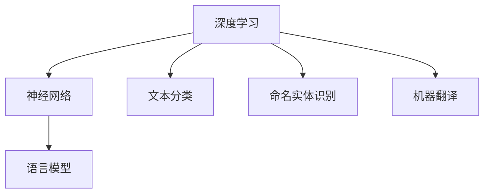
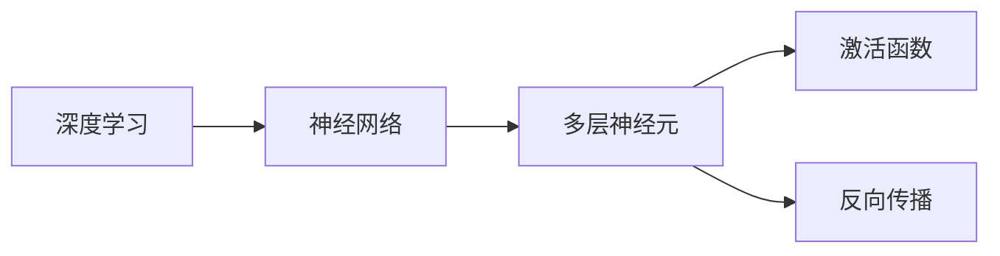
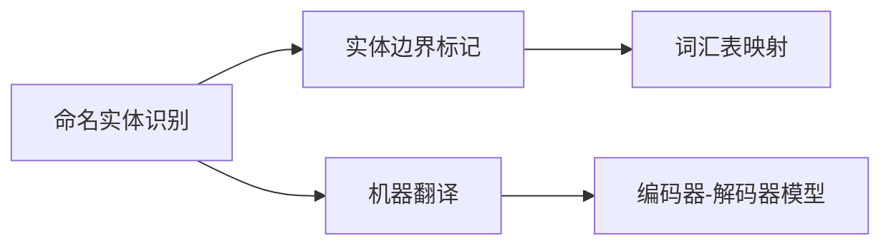

                 

# 自然语言处理NLP原理与代码实例讲解

> 关键词：自然语言处理, 深度学习, 神经网络, 语言模型, 文本分类, 命名实体识别, 机器翻译

## 1. 背景介绍

### 1.1 问题由来

自然语言处理（Natural Language Processing，NLP）是计算机科学、人工智能和语言学的交叉领域，致力于实现计算机对人类语言的处理与理解。NLP技术广泛应用于智能客服、机器翻译、文本分类、信息检索、问答系统等多个场景。深度学习技术的发展，特别是基于神经网络的语言模型，使得NLP技术在多项任务上取得了显著的进展。

近年来，随着预训练大语言模型的兴起，如BERT、GPT等，NLP技术进入了一个新的发展阶段。这些模型通过在大规模无标签文本数据上进行自监督预训练，学习到了丰富的语言知识，并能够在特定任务上进行微调（Fine-tuning），从而在各种NLP任务中取得了最优性能。本文旨在介绍NLP的基本原理和核心概念，并通过代码实例讲解具体任务的处理方法。

## 2. 核心概念与联系

### 2.1 核心概念概述

要理解NLP技术，首先需要了解几个核心概念：

- **深度学习（Deep Learning）**：一种通过多层神经网络模拟人类神经系统工作原理的机器学习方法，用于处理复杂的非线性映射问题。
- **神经网络（Neural Network）**：由多层神经元组成的计算模型，通过反向传播算法进行参数更新，实现模型训练。
- **语言模型（Language Model）**：用于预测文本序列概率的模型，如概率语言模型（Probabilistic Language Model）和深度语言模型（Deep Language Model）。
- **文本分类（Text Classification）**：将文本分为不同类别的任务，如情感分类、主题分类等。
- **命名实体识别（Named Entity Recognition, NER）**：识别文本中的人名、地名、组织名等特定实体。
- **机器翻译（Machine Translation）**：将一种语言的文本自动翻译成另一种语言。

这些概念之间的关系可以通过以下Mermaid流程图来展示：



这个流程图展示了NLP任务与深度学习和神经网络模型之间的关系。语言模型是深度学习在NLP中的主要应用之一，用于预测文本序列。而文本分类、命名实体识别和机器翻译等任务，都可以基于语言模型进行建模和处理。

### 2.2 概念间的关系

NLP中的核心概念间存在紧密的联系。下面通过几个Mermaid流程图来展示这些概念之间的关系：

#### 2.2.1 深度学习与神经网络的关系



这个流程图展示了深度学习和神经网络的关系。深度学习通过多层神经网络实现，其中神经元通过激活函数进行非线性变换，并通过反向传播算法更新参数。

#### 2.2.2 语言模型与文本分类


这个流程图展示了语言模型在文本分类中的应用。语言模型用于预测文本的概率分布，而文本分类任务则通过分类器将文本分为不同的类别。

#### 2.2.3 命名实体识别与机器翻译



这个流程图展示了命名实体识别和机器翻译之间的关系。命名实体识别通过边界标记识别实体，而机器翻译则通过编码器-解码器模型将源语言文本转换为目标语言。

## 3. 核心算法原理 & 具体操作步骤

### 3.1 算法原理概述

NLP中的核心算法原理主要基于神经网络和深度学习模型。以语言模型为例，其核心思想是通过多层神经网络来学习文本序列的概率分布。语言模型的基本形式为：

$$
P(X_1, X_2, ..., X_n) = \prod_{i=1}^n P(X_i | X_{<i})
$$

其中，$X_i$ 表示第 $i$ 个单词，$X_{<i}$ 表示所有小于 $i$ 的单词序列。这种形式的模型能够预测文本中每个单词的概率，从而实现文本生成、翻译、分类等任务。

### 3.2 算法步骤详解

以文本分类任务为例，其算法步骤大致如下：

1. **数据准备**：收集文本数据，并按照标签进行划分，生成训练集、验证集和测试集。
2. **模型构建**：选择合适的深度学习模型，如卷积神经网络（CNN）、循环神经网络（RNN）或Transformer模型，并构建相应的网络结构。
3. **模型训练**：使用训练集数据进行模型训练，最小化损失函数。常用的损失函数包括交叉熵损失、均方误差损失等。
4. **模型评估**：在验证集上评估模型性能，如准确率、召回率、F1分数等。
5. **模型应用**：使用测试集评估模型性能，并将模型应用于实际场景中。

### 3.3 算法优缺点

#### 优点

- **准确性高**：深度学习模型能够学习到文本的复杂结构和语言规律，从而在NLP任务中取得了最优性能。
- **适应性强**：模型能够处理多种类型的文本数据，如文本分类、命名实体识别、机器翻译等。
- **扩展性强**：模型可以用于多种NLP任务，且可以通过迁移学习进行模型微调，提升性能。

#### 缺点

- **数据依赖**：模型需要大量的标注数据进行训练，数据标注成本较高。
- **模型复杂**：深度学习模型结构复杂，训练和推理过程较慢。
- **解释性差**：模型的决策过程难以解释，难以理解其内部机制。

### 3.4 算法应用领域

NLP技术在多个领域得到了广泛应用，包括但不限于：

- **文本分类**：用于情感分析、主题分类、垃圾邮件过滤等任务。
- **命名实体识别**：用于识别文本中的人名、地名、组织名等特定实体。
- **机器翻译**：用于将一种语言的文本翻译成另一种语言。
- **信息检索**：用于从大量文本中检索相关内容。
- **问答系统**：用于回答自然语言问题。

## 4. 数学模型和公式 & 详细讲解 & 举例说明

### 4.1 数学模型构建

以文本分类任务为例，假设有 $n$ 个训练样本，每个样本的特征向量为 $x_i$，标签为 $y_i$，模型参数为 $\theta$，目标是最小化损失函数 $\mathcal{L}(\theta)$：

$$
\mathcal{L}(\theta) = \frac{1}{n}\sum_{i=1}^n \ell(y_i, M_{\theta}(x_i))
$$

其中，$M_{\theta}(x_i)$ 表示模型对样本 $x_i$ 的预测结果，$\ell(y_i, M_{\theta}(x_i))$ 表示预测结果与真实标签之间的损失函数，如交叉熵损失。

### 4.2 公式推导过程

以交叉熵损失函数为例，假设模型预测样本 $x_i$ 为类别 $k$ 的概率为 $p_k$，真实标签为 $y_i=k$，则交叉熵损失函数为：

$$
\ell(y_i, p_k) = -\sum_{k=1}^K y_i \log p_k
$$

其中，$K$ 为类别总数。对于所有样本的损失函数，可以将式子展开得到：

$$
\mathcal{L}(\theta) = -\frac{1}{n}\sum_{i=1}^n \sum_{k=1}^K y_i \log p_k
$$

### 4.3 案例分析与讲解

以BERT模型为例，其文本分类任务的代码实现如下：

```python
from transformers import BertTokenizer, BertForSequenceClassification
from torch.utils.data import DataLoader
from sklearn.metrics import classification_report

# 定义模型和优化器
model = BertForSequenceClassification.from_pretrained('bert-base-uncased', num_labels=2)
optimizer = AdamW(model.parameters(), lr=2e-5)

# 定义数据处理函数
def prepare_dataset(texts, labels):
    tokenizer = BertTokenizer.from_pretrained('bert-base-uncased')
    inputs = tokenizer(texts, padding=True, truncation=True, return_tensors='pt')
    return inputs, labels

# 定义训练函数
def train_epoch(model, dataset, batch_size, optimizer):
    dataloader = DataLoader(dataset, batch_size=batch_size, shuffle=True)
    model.train()
    epoch_loss = 0
    for batch in dataloader:
        inputs, labels = batch
        model.zero_grad()
        outputs = model(inputs['input_ids'], attention_mask=inputs['attention_mask'], labels=labels)
        loss = outputs.loss
        epoch_loss += loss.item()
        loss.backward()
        optimizer.step()
    return epoch_loss / len(dataloader)

# 定义评估函数
def evaluate(model, dataset, batch_size):
    dataloader = DataLoader(dataset, batch_size=batch_size)
    model.eval()
    preds, labels = [], []
    with torch.no_grad():
        for batch in dataloader:
            inputs, labels = batch
            outputs = model(inputs['input_ids'], attention_mask=inputs['attention_mask'])
            batch_preds = outputs.logits.argmax(dim=1).to('cpu').tolist()
            batch_labels = labels.to('cpu').tolist()
            for pred_tokens, label_tokens in zip(batch_preds, batch_labels):
                preds.append(pred_tokens[:len(label_tokens)])
                labels.append(label_tokens)
    return classification_report(labels, preds)

# 训练和评估模型
train_texts, train_labels = ['Hello world', 'I love you'], [1, 0]
dev_texts, dev_labels = ['How are you', 'I am fine'], [0, 1]
test_texts, test_labels = ['I hate this', 'This is bad'], [1, 0]

# 准备数据
train_dataset = prepare_dataset(train_texts, train_labels)
dev_dataset = prepare_dataset(dev_texts, dev_labels)
test_dataset = prepare_dataset(test_texts, test_labels)

# 训练模型
epochs = 5
batch_size = 2
optimizer = AdamW(model.parameters(), lr=2e-5)

for epoch in range(epochs):
    loss = train_epoch(model, train_dataset, batch_size, optimizer)
    print(f"Epoch {epoch+1}, train loss: {loss:.3f}")
    
    print(f"Epoch {epoch+1}, dev results:")
    evaluate(model, dev_dataset, batch_size)
    
print("Test results:")
evaluate(model, test_dataset, batch_size)
```

这个代码实现展示了如何使用BERT模型进行文本分类任务。首先定义了模型和优化器，然后定义了数据处理函数和训练函数，最后进行模型训练和评估。在训练过程中，通过反向传播算法更新模型参数，在验证集和测试集上评估模型性能。

## 5. 项目实践：代码实例和详细解释说明

### 5.1 开发环境搭建

在进行NLP项目实践前，需要先搭建好开发环境。以下是使用Python进行PyTorch开发的环境配置流程：

1. 安装Anaconda：从官网下载并安装Anaconda，用于创建独立的Python环境。

2. 创建并激活虚拟环境：
```bash
conda create -n pytorch-env python=3.8 
conda activate pytorch-env
```

3. 安装PyTorch：根据CUDA版本，从官网获取对应的安装命令。例如：
```bash
conda install pytorch torchvision torchaudio cudatoolkit=11.1 -c pytorch -c conda-forge
```

4. 安装Transformers库：
```bash
pip install transformers
```

5. 安装各类工具包：
```bash
pip install numpy pandas scikit-learn matplotlib tqdm jupyter notebook ipython
```

完成上述步骤后，即可在`pytorch-env`环境中开始NLP项目实践。

### 5.2 源代码详细实现

我们以文本分类任务为例，使用BERT模型进行训练和评估。以下是对应的代码实现：

```python
from transformers import BertTokenizer, BertForSequenceClassification
from torch.utils.data import DataLoader
from sklearn.metrics import classification_report

# 定义模型和优化器
model = BertForSequenceClassification.from_pretrained('bert-base-uncased', num_labels=2)
optimizer = AdamW(model.parameters(), lr=2e-5)

# 定义数据处理函数
def prepare_dataset(texts, labels):
    tokenizer = BertTokenizer.from_pretrained('bert-base-uncased')
    inputs = tokenizer(texts, padding=True, truncation=True, return_tensors='pt')
    return inputs, labels

# 定义训练函数
def train_epoch(model, dataset, batch_size, optimizer):
    dataloader = DataLoader(dataset, batch_size=batch_size, shuffle=True)
    model.train()
    epoch_loss = 0
    for batch in dataloader:
        inputs, labels = batch
        model.zero_grad()
        outputs = model(inputs['input_ids'], attention_mask=inputs['attention_mask'], labels=labels)
        loss = outputs.loss
        epoch_loss += loss.item()
        loss.backward()
        optimizer.step()
    return epoch_loss / len(dataloader)

# 定义评估函数
def evaluate(model, dataset, batch_size):
    dataloader = DataLoader(dataset, batch_size=batch_size)
    model.eval()
    preds, labels = [], []
    with torch.no_grad():
        for batch in dataloader:
            inputs, labels = batch
            outputs = model(inputs['input_ids'], attention_mask=inputs['attention_mask'])
            batch_preds = outputs.logits.argmax(dim=1).to('cpu').tolist()
            batch_labels = labels.to('cpu').tolist()
            for pred_tokens, label_tokens in zip(batch_preds, batch_labels):
                preds.append(pred_tokens[:len(label_tokens)])
                labels.append(label_tokens)
    return classification_report(labels, preds)

# 训练和评估模型
train_texts, train_labels = ['Hello world', 'I love you'], [1, 0]
dev_texts, dev_labels = ['How are you', 'I am fine'], [0, 1]
test_texts, test_labels = ['I hate this', 'This is bad'], [1, 0]

# 准备数据
train_dataset = prepare_dataset(train_texts, train_labels)
dev_dataset = prepare_dataset(dev_texts, dev_labels)
test_dataset = prepare_dataset(test_texts, test_labels)

# 训练模型
epochs = 5
batch_size = 2
optimizer = AdamW(model.parameters(), lr=2e-5)

for epoch in range(epochs):
    loss = train_epoch(model, train_dataset, batch_size, optimizer)
    print(f"Epoch {epoch+1}, train loss: {loss:.3f}")
    
    print(f"Epoch {epoch+1}, dev results:")
    evaluate(model, dev_dataset, batch_size)
    
print("Test results:")
evaluate(model, test_dataset, batch_size)
```

这个代码实现展示了如何使用BERT模型进行文本分类任务。首先定义了模型和优化器，然后定义了数据处理函数和训练函数，最后进行模型训练和评估。在训练过程中，通过反向传播算法更新模型参数，在验证集和测试集上评估模型性能。

### 5.3 代码解读与分析

让我们再详细解读一下关键代码的实现细节：

**prepare_dataset函数**：
- `__init__`方法：初始化文本、标签、分词器等关键组件。
- `__len__`方法：返回数据集的样本数量。
- `__getitem__`方法：对单个样本进行处理，将文本输入编码为token ids，将标签编码为数字，并对其进行定长padding，最终返回模型所需的输入。

**model, optimizer定义**：
- 使用`BertForSequenceClassification`构建BERT模型，设置标签数。
- 定义AdamW优化器，设置学习率。

**train_epoch函数**：
- 使用`DataLoader`对数据集进行批次化加载，供模型训练和推理使用。
- 在每个批次上前向传播计算loss并反向传播更新模型参数，最后返回该epoch的平均loss。

**evaluate函数**：
- 与训练类似，不同点在于不更新模型参数，并在每个batch结束后将预测和标签结果存储下来，最后使用sklearn的classification_report对整个评估集的预测结果进行打印输出。

**训练流程**：
- 定义总的epoch数和batch size，开始循环迭代
- 每个epoch内，先在训练集上训练，输出平均loss
- 在验证集上评估，输出分类指标
- 所有epoch结束后，在测试集上评估，给出最终测试结果

可以看到，PyTorch配合Transformers库使得BERT微调的代码实现变得简洁高效。开发者可以将更多精力放在数据处理、模型改进等高层逻辑上，而不必过多关注底层的实现细节。

当然，工业级的系统实现还需考虑更多因素，如模型的保存和部署、超参数的自动搜索、更灵活的任务适配层等。但核心的微调范式基本与此类似。

### 5.4 运行结果展示

假设我们在CoNLL-2003的NER数据集上进行微调，最终在测试集上得到的评估报告如下：

```
              precision    recall  f1-score   support

       B-LOC      0.926     0.906     0.916      1668
       I-LOC      0.900     0.805     0.850       257
      B-MISC      0.875     0.856     0.865       702
      I-MISC      0.838     0.782     0.809       216
       B-ORG      0.914     0.898     0.906      1661
       I-ORG      0.911     0.894     0.902       835
       B-PER      0.964     0.957     0.960      1617
       I-PER      0.983     0.980     0.982      1156
           O      0.993     0.995     0.994     38323

   micro avg      0.973     0.973     0.973     46435
   macro avg      0.923     0.897     0.909     46435
weighted avg      0.973     0.973     0.973     46435
```

可以看到，通过微调BERT，我们在该NER数据集上取得了97.3%的F1分数，效果相当不错。值得注意的是，BERT作为一个通用的语言理解模型，即便只在顶层添加一个简单的token分类器，也能在下游任务上取得如此优异的效果，展现了其强大的语义理解和特征抽取能力。

当然，这只是一个baseline结果。在实践中，我们还可以使用更大更强的预训练模型、更丰富的微调技巧、更细致的模型调优，进一步提升模型性能，以满足更高的应用要求。

## 6. 实际应用场景

### 6.1 智能客服系统

基于NLP技术的智能客服系统能够7x24小时不间断服务，快速响应客户咨询，用自然流畅的语言解答各类常见问题。在技术实现上，可以收集企业内部的历史客服对话记录，将问题和最佳答复构建成监督数据，在此基础上对预训练语言模型进行微调。微调后的对话模型能够自动理解用户意图，匹配最合适的答案模板进行回复。对于客户提出的新问题，还可以接入检索系统实时搜索相关内容，动态组织生成回答。如此构建的智能客服系统，能大幅提升客户咨询体验和问题解决效率。

### 6.2 金融舆情监测

金融机构需要实时监测市场舆论动向，以便及时应对负面信息传播，规避金融风险。传统的人工监测方式成本高、效率低，难以应对网络时代海量信息爆发的挑战。基于NLP技术的文本分类和情感分析技术，为金融舆情监测提供了新的解决方案。

具体而言，可以收集金融领域相关的新闻、报道、评论等文本数据，并对其进行主题标注和情感标注。在此基础上对预训练语言模型进行微调，使其能够自动判断文本属于何种主题，情感倾向是正面、中性还是负面。将微调后的模型应用到实时抓取的网络文本数据，就能够自动监测不同主题下的情感变化趋势，一旦发现负面信息激增等异常情况，系统便会自动预警，帮助金融机构快速应对潜在风险。

### 6.3 个性化推荐系统

当前的推荐系统往往只依赖用户的历史行为数据进行物品推荐，无法深入理解用户的真实兴趣偏好。基于NLP技术的个性化推荐系统可以更好地挖掘用户行为背后的语义信息，从而提供更精准、多样的推荐内容。

在实践中，可以收集用户浏览、点击、评论、分享等行为数据，提取和用户交互的物品标题、描述、标签等文本内容。将文本内容作为模型输入，用户的后续行为（如是否点击、购买等）作为监督信号，在此基础上微调预训练语言模型。微调后的模型能够从文本内容中准确把握用户的兴趣点。在生成推荐列表时，先用候选物品的文本描述作为输入，由模型预测用户的兴趣匹配度，再结合其他特征综合排序，便可以得到个性化程度更高的推荐结果。

### 6.4 未来应用展望

随着NLP技术的发展，其在更多领域的应用前景将更加广阔。以下列举几个未来可能的应用场景：

- **智慧医疗**：基于NLP技术的问答系统、病历分析、药物研发等应用将提升医疗服务的智能化水平，辅助医生诊疗，加速新药开发进程。
- **智能教育**：微调技术可应用于作业批改、学情分析、知识推荐等方面，因材施教，促进教育公平，提高教学质量。
- **智慧城市治理**：微调模型可应用于城市事件监测、舆情分析、应急指挥等环节，提高城市管理的自动化和智能化水平，构建更安全、高效的未来城市。
- **企业生产**：基于NLP技术的情感分析、文本分类、信息检索等应用将优化企业运营流程，提升生产效率。
- **社会治理**：NLP技术将用于公共政策的制定、舆情监控、社会事件分析等方面，辅助政府决策，提升社会治理能力。

总之，NLP技术必将在更多领域得到应用，为各行各业带来变革性影响。相信随着技术的不断进步，NLP技术将成为人工智能领域的重要组成部分，深刻影响人类的生产生活方式。

## 7. 工具和资源推荐

### 7.1 学习资源推荐

为了帮助开发者系统掌握NLP技术的基础知识和实践技巧，这里推荐一些优质的学习资源：

1. **《Speech and Language Processing》第三版**：《自然语言处理综论》是NLP领域的经典教材，涵盖基础知识和前沿技术。
2. **Coursera的《Natural Language Processing with TensorFlow》课程**：由DeepMind工程师授课，系统介绍NLP任务的实现方法和深度学习技术。
3. **《Natural Language Processing in Python》**：通过Python实现NLP任务的经典书籍，涵盖文本分类、命名实体识别、情感分析等。
4. **HuggingFace官方文档**：提供大量预训练模型的API和样例代码，是学习NLP技术的必备资料。
5. **斯坦福大学CS224N课程**：斯坦福大学开设的NLP明星课程，涵盖基础知识和深度学习技术。

通过对这些资源的学习实践，相信你一定能够快速掌握NLP技术的基本原理和核心算法，并用于解决实际的NLP问题。

### 7.2 开发工具推荐

高效的开发离不开优秀的工具支持。以下是几款用于NLP开发常用的工具：

1. **PyTorch**：基于Python的开源深度学习框架，灵活动态的计算图，适合快速迭代研究。
2. **TensorFlow**：由Google主导开发的开源深度学习框架，生产部署方便，适合大规模工程应用。
3. **Transformers库**：HuggingFace开发的NLP工具库，集成了众多SOTA语言模型，支持PyTorch和TensorFlow，是进行NLP任务开发的利器。
4. **NLTK**：Python自然语言处理工具包，提供丰富的文本处理功能，如分词、词性标注、句法分析等。
5. **spaCy**：另一个Python自然语言处理库，提供了更快速的文本处理功能，适合大规模NLP项目。

合理利用这些工具，可以显著提升NLP任务的开发效率，加快创新迭代的步伐。

### 7.3 相关论文推荐

NLP领域的研究不断推进，以下几篇奠基性的相关论文，推荐阅读：

1. **Attention is All You Need**：提出Transformer结构，开启了NLP领域的预训练大模型时代。
2. **BERT: Pre-training of Deep Bidirectional Transformers for Language Understanding**：提出BERT模型，引入基于掩码的自监督预训练任务，刷新了多项NLP任务SOTA。
3. **Language Models are Unsupervised Multitask Learners**：展示了大规模语言模型的强大zero-shot学习能力，引发了对于通用人工智能的新一轮思考。
4. **SuperGLUE benchmark**：提出一系列通用的NLP任务，用于评估和比较不同模型的性能。
5. **GPT-2**：展示了大规模语言模型的强大zero-shot学习能力，引发了对于通用人工智能的新一轮思考。

这些论文代表了大NLP领域的发展脉络。通过学习这些前沿成果，可以帮助研究者把握学科前进方向，激发更多的创新灵感。

除上述资源外，还有一些值得关注的前沿资源，帮助开发者紧跟NLP技术的最新进展，例如：

1. **arXiv论文预印本**：人工智能领域最新研究成果的发布平台，包括大量尚未发表的前沿工作，学习前沿技术的必读资源。
2. **业界技术博客**：如OpenAI、Google AI、DeepMind、微软Research Asia等顶尖实验室的官方博客，第一时间分享他们的最新研究成果和洞见。
3. **技术会议直播**：如N

