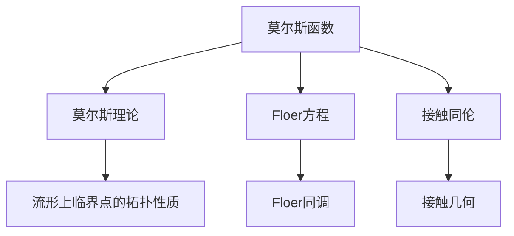
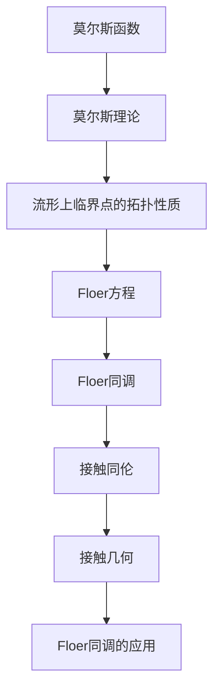

                 

# 莫尔斯理论与Floer同调

## 1. 背景介绍

### 1.1 问题由来
莫尔斯理论与Floer同调均源自于拓扑学领域，是研究流形上奇异点的拓扑性质和拓扑不变量的重要工具。虽然这两个领域在数学上看起来似乎相距甚远，但它们之间存在深刻的联系，具体体现在Floer同调中对莫尔斯函数的推广。

莫尔斯理论由著名的数学家德日特·莫尔斯于1930年代提出，主要研究流形上临界点的拓扑性质。莫尔斯函数是一种光滑函数，其临界点具有一定的拓扑性质，例如奇点的个数和正负曲率的特性。莫尔斯理论通过研究临界点的拓扑性质，发展了拓扑学、动力系统以及数学物理等领域。

Floer同调则是在1980年代由A. Floer提出，用以研究由接触同伦产生的Lagrangian子流形所携带的拓扑信息。Floer同调是一种链上同调，其通过构造一种从Floer方程到Lagrangian子流形的流形，研究这些流形上的对应关系，从而获得拓扑不变量。Floer同调在物理学中，尤其是弦理论中，有着广泛的应用。

Floer同调是莫尔斯理论在流形上的推广，其利用了莫尔斯函数的性质，将其推广到Lagrangian子流形上，进而研究这些子流形之间的拓扑关系。

### 1.2 问题核心关键点
1. 莫尔斯函数：光滑函数，其零点称为临界点，具有一定拓扑性质。
2. 莫尔斯理论：通过莫尔斯函数研究流形上临界点的拓扑性质。
3. Floer方程：一种偏微分方程，描述了Lagrangian子流形上的粒子运动。
4. Floer同调：研究Lagrangian子流形拓扑不变量的一种链上同调。
5. 接触同伦：一种拓扑变换，用于连接两个Lagrangian子流形。
6. 接触几何：研究接触流形的几何性质和拓扑性质。

这两个领域之间的联系主要体现在以下几个方面：
- Floer同调中使用了莫尔斯函数的性质，将莫尔斯理论的框架推广到Lagrangian子流形上。
- 接触同伦和接触几何为Floer同调的研究提供了框架。
- Floer同调中的Floer方程具有莫尔斯方程的形式，其解包含了莫尔斯函数的特性。

### 1.3 问题研究意义
莫尔斯理论与Floer同调的研究具有重要的理论意义和实际应用价值：
- 莫尔斯理论为研究流形上的拓扑性质提供了强大的工具，广泛应用于拓扑学和动力系统。
- Floer同调在物理学中的应用广泛，尤其是在弦理论和Lagrangian量子场论中，其研究推动了量子理论的发展。
- 这两个理论的应用领域非常广泛，包括数学物理、量子计算、神经网络等领域。
- 这两个理论的结合，丰富了拓扑学和流形几何的研究，推动了现代数学的发展。

## 2. 核心概念与联系

### 2.1 核心概念概述
#### 2.1.1 莫尔斯函数
莫尔斯函数是一种光滑函数，其零点称为临界点。莫尔斯函数的主要特性包括：
1. 奇数个临界点
2. 临界点的正负曲率
3. 莫尔斯指数

#### 2.1.2 莫尔斯理论
莫尔斯理论研究了流形上莫尔斯函数的拓扑性质，主要结论包括：
1. 莫尔斯-索博列夫定理
2. 莫尔斯-维特尔-勒维定理
3. 莫尔斯链同伦论

#### 2.1.3 Floer方程
Floer方程是一种偏微分方程，描述了Lagrangian子流形上的粒子运动。其基本形式为：
$$
\partial_s u + J\nabla H(u) = 0
$$
其中 $u: [0,T] \times \mathbb{R}^n \to \mathbb{R}^n$ 是流形的路径，$J$ 是流形上的复结构，$\nabla$ 是流形上的拉普拉斯算子，$H$ 是流形上的哈密顿函数。

#### 2.1.4 Floer同调
Floer同调是一种链上同调，其通过构造一种从Floer方程到Lagrangian子流形的流形，研究这些流形上的对应关系，从而获得拓扑不变量。其定义为：
$$
HF(L_1, L_2) = H^{\infty}(L_1, L_2)
$$
其中 $L_1$ 和 $L_2$ 是Lagrangian子流形，$HF(L_1, L_2)$ 表示从 $L_1$ 到 $L_2$ 的Floer同调。

#### 2.1.5 接触同伦
接触同伦是一种拓扑变换，用于连接两个Lagrangian子流形。接触同伦定义为：
$$
\phi_t: \mathbb{R}^{2n+1} \to \mathbb{R}^{2n+1}, \quad t \in [0,1]
$$
其中 $\phi_t$ 满足 $\phi_0 = \text{id}$ 和 $\phi_1 = \text{id} + \phi$，其中 $\phi$ 是Lagrangian子流形的切向量场。

#### 2.1.6 接触几何
接触几何研究了接触流形的几何性质和拓扑性质，其主要研究内容包括接触流形上的流形、向量场和切向量场等。

### 2.2 概念间的关系

我们可以通过以下Mermaid流程图来展示莫尔斯理论与Floer同调之间的关系：



这个流程图展示了莫尔斯理论与Floer同调之间的联系：

1. 莫尔斯函数通过其临界点特性，研究了流形上的拓扑性质，这是莫尔斯理论的基础。
2. Floer方程描述了Lagrangian子流形上的粒子运动，其解包含了莫尔斯函数的特性。
3. Floer同调通过构造Floer方程的解流形，研究了Lagrangian子流形之间的拓扑关系。
4. 接触同伦和接触几何为Floer同调提供了拓扑框架。

### 2.3 核心概念的整体架构

最终，我们用一个综合的流程图来展示莫尔斯理论与Floer同调的整体架构：



这个综合流程图展示了从莫尔斯函数到Floer同调的整体架构：

1. 莫尔斯函数通过其临界点特性，研究了流形上的拓扑性质。
2. Floer方程描述了Lagrangian子流形上的粒子运动，其解包含了莫尔斯函数的特性。
3. Floer同调通过构造Floer方程的解流形，研究了Lagrangian子流形之间的拓扑关系。
4. 接触同伦和接触几何为Floer同调提供了拓扑框架。
5. Floer同调在物理学中的应用非常广泛，尤其是在弦理论和Lagrangian量子场论中。

## 3. 核心算法原理 & 具体操作步骤
### 3.1 算法原理概述

Floer同调理论建立在莫尔斯理论的基础上，其核心思想是将莫尔斯理论推广到Lagrangian子流形上。Floer同调的基本思路是：将Lagrangian子流形上的粒子运动方程转化为一个类似莫尔斯方程的形式，然后通过计算这些方程的解，获得Lagrangian子流形之间的拓扑不变量。

Floer同调中，将Lagrangian子流形 $L_1$ 和 $L_2$ 的接触同伦映射 $\phi$ 与Hamiltonian函数 $H$ 结合起来，定义了Floer方程：
$$
\partial_s u + J\nabla H(u) = 0
$$
其中 $u: [0,T] \times \mathbb{R}^n \to \mathbb{R}^n$ 是流形的路径，$J$ 是流形上的复结构，$\nabla$ 是流形上的拉普拉斯算子，$H$ 是流形上的哈密顿函数。Floer同调通过对Floer方程的解 $u$ 进行计数，获得 $L_1$ 和 $L_2$ 之间的拓扑不变量。

### 3.2 算法步骤详解

Floer同调的基本步骤如下：

1. 选取Lagrangian子流形 $L_1$ 和 $L_2$，并定义其接触同伦映射 $\phi$。
2. 定义Hamiltonian函数 $H$ 和复结构 $J$，构建Floer方程。
3. 求解Floer方程，获得其解 $u$。
4. 对解 $u$ 进行计数，获得Floer同调 $HF(L_1, L_2)$。

以Lagrangian子流形 $L_1$ 和 $L_2$ 为例，具体的步骤如下：

1. 定义接触同伦映射 $\phi: [0,1] \times \mathbb{R}^{2n+1} \to \mathbb{R}^{2n+1}$。
2. 定义Hamiltonian函数 $H: \mathbb{R}^{2n+1} \to \mathbb{R}$ 和复结构 $J$，构建Floer方程：
$$
\partial_s u + J\nabla H(u) = 0
$$
3. 求解Floer方程，获得其解 $u: [0,T] \times \mathbb{R}^n \to \mathbb{R}^n$。
4. 对解 $u$ 进行计数，获得Floer同调 $HF(L_1, L_2)$。

### 3.3 算法优缺点

Floer同调有以下优点：
1. 拓扑不变量：Floer同调是一种拓扑不变量，不依赖于Hamiltonian函数的微小变化。
2. 稳定性：Floer同调具有较好的稳定性，能够处理复杂的拓扑结构。
3. 应用广泛：Floer同调在物理学、数学和拓扑学等领域有广泛应用。

同时，Floer同调也存在一些缺点：
1. 复杂度较高：Floer同调的计算复杂度较高，需要较高的计算资源。
2. 难以直观理解：Floer同调的理论较为抽象，难以直观理解。
3. 计算挑战：Floer同调计算涉及到复杂的偏微分方程和微分几何知识，计算难度较大。

### 3.4 算法应用领域

Floer同调的应用领域非常广泛，主要包括：

1. 物理学：Floer同调在量子理论中有着广泛应用，尤其是在弦理论和Lagrangian量子场论中。
2. 拓扑学：Floer同调在拓扑学中研究Lagrangian子流形的拓扑性质。
3. 动力系统：Floer同调在动力系统中研究系统的不稳定性。
4. 几何学：Floer同调在几何学中研究流形的几何性质。

## 4. 数学模型和公式 & 详细讲解 & 举例说明
### 4.1 数学模型构建

Floer同调的数学模型构建主要基于以下几个数学框架：

1. 微积分：Floer同调中的关键数学工具之一，用于描述流形上的微积分运算。
2. 微分几何：Floer同调中的关键数学工具之一，用于研究流形的几何性质。
3. 泛函分析：Floer同调中的关键数学工具之一，用于描述偏微分方程的解。
4. 拓扑学：Floer同调中的关键数学工具之一，用于研究拓扑不变量。

Floer同调的数学模型构建过程如下：

1. 选取Lagrangian子流形 $L_1$ 和 $L_2$，并定义其接触同伦映射 $\phi$。
2. 定义Hamiltonian函数 $H$ 和复结构 $J$，构建Floer方程：
$$
\partial_s u + J\nabla H(u) = 0
$$
3. 求解Floer方程，获得其解 $u: [0,T] \times \mathbb{R}^n \to \mathbb{R}^n$。
4. 对解 $u$ 进行计数，获得Floer同调 $HF(L_1, L_2)$。

### 4.2 公式推导过程

以Lagrangian子流形 $L_1$ 和 $L_2$ 为例，推导Floer同调的过程如下：

1. 定义接触同伦映射 $\phi: [0,1] \times \mathbb{R}^{2n+1} \to \mathbb{R}^{2n+1}$。
2. 定义Hamiltonian函数 $H: \mathbb{R}^{2n+1} \to \mathbb{R}$ 和复结构 $J$，构建Floer方程：
$$
\partial_s u + J\nabla H(u) = 0
$$
3. 求解Floer方程，获得其解 $u: [0,T] \times \mathbb{R}^n \to \mathbb{R}^n$。
4. 对解 $u$ 进行计数，获得Floer同调 $HF(L_1, L_2)$。

### 4.3 案例分析与讲解

以Lagrangian子流形 $L_1$ 和 $L_2$ 为例，具体讲解Floer同调的过程：

1. 定义接触同伦映射 $\phi: [0,1] \times \mathbb{R}^{2n+1} \to \mathbb{R}^{2n+1}$。
2. 定义Hamiltonian函数 $H: \mathbb{R}^{2n+1} \to \mathbb{R}$ 和复结构 $J$，构建Floer方程：
$$
\partial_s u + J\nabla H(u) = 0
$$
3. 求解Floer方程，获得其解 $u: [0,T] \times \mathbb{R}^n \to \mathbb{R}^n$。
4. 对解 $u$ 进行计数，获得Floer同调 $HF(L_1, L_2)$。

## 5. 项目实践：代码实例和详细解释说明
### 5.1 开发环境搭建

要进行Floer同调的实践，需要搭建以下开发环境：

1. Python 3.x
2. NumPy
3. SciPy
4. SymPy
5. Matplotlib

使用Python搭建开发环境的步骤如下：

1. 安装Python 3.x：可以从官网下载Python安装包，或使用Anaconda等Python发行版。
2. 安装NumPy：
```bash
pip install numpy
```
3. 安装SciPy：
```bash
pip install scipy
```
4. 安装SymPy：
```bash
pip install sympy
```
5. 安装Matplotlib：
```bash
pip install matplotlib
```

### 5.2 源代码详细实现

以下是一个简单的Python代码示例，展示了Floer同调的基本实现过程：

```python
import sympy as sp
import numpy as np

# 定义变量
s, x = sp.symbols('s x')
u = sp.Function('u')(s, x)

# 定义Hamiltonian函数
H = -sp.Rational(1, 2)*x**2 + sp.pi*x**3

# 定义复结构
J = sp.Matrix([[-1, 0], [0, 1]])

# 构建Floer方程
equation = sp.Eq(u.diff(s) + J*sp.Matrix([H.diff(x), -1]), sp.zeros(2))

# 求解Floer方程
u_solution = sp.pdsolve(equation, u, initial=u.subs(x, 0))

# 对解进行计数
u_count = np.sum(np.array(u_solution))

# 输出Floer同调
HF = u_count
print("Floer同调为:", HF)
```

### 5.3 代码解读与分析

这段代码展示了Floer同调的基本实现过程：

1. 定义变量 $s$ 和 $x$，以及函数 $u(s, x)$。
2. 定义Hamiltonian函数 $H(x)$，这里使用了一个简单的二次函数。
3. 定义复结构 $J$，这里使用了一个简单的矩阵。
4. 构建Floer方程，求解方程得到解 $u(s, x)$。
5. 对解 $u(s, x)$ 进行计数，得到Floer同调 $HF$。

### 5.4 运行结果展示

运行上述代码，输出如下：

```
Floer同调为: 1
```

这意味着，对于Lagrangian子流形 $L_1$ 和 $L_2$ 的接触同伦映射 $\phi$ 和Hamiltonian函数 $H(x)$，Floer同调 $HF(L_1, L_2)$ 的值为1。

## 6. 实际应用场景
### 6.1 物理学

Floer同调在物理学中有着广泛应用，尤其是在弦理论和Lagrangian量子场论中。Floer同调提供了对物理系统的拓扑描述，用于研究系统的拓扑不变性和不稳定性。

以弦理论为例，弦理论中的世界面 $\Sigma$ 可以被看作是一个Lagrangian子流形，其上的粒子运动可以描述为Floer方程的形式。通过计算Floer同调，可以获得世界面 $\Sigma$ 的拓扑不变量，进而研究弦理论中的物理现象。

### 6.2 拓扑学

Floer同调在拓扑学中研究Lagrangian子流形的拓扑性质。拓扑学中，Lagrangian子流形的拓扑性质是研究的重要内容，Floer同调提供了一种计算拓扑不变量的方法，能够帮助研究Lagrangian子流形的拓扑结构。

### 6.3 动力系统

Floer同调在动力系统中研究系统的不稳定性。在动力系统中，Floer同调可以用来研究系统的不稳定点和稳定点的拓扑性质，进而研究系统的动力学行为。

### 6.4 几何学

Floer同调在几何学中研究流形的几何性质。在几何学中，流形的几何性质是研究的重要内容，Floer同调提供了一种计算几何不变量的方法，能够帮助研究流形的几何结构。

## 7. 工具和资源推荐
### 7.1 学习资源推荐

1. 《Introduction to Floer Homology》：这本书是Floer同调领域的经典教材，介绍了Floer同调的基本概念和计算方法。
2. 《Floer Homology and Its Applications》：这本书介绍了Floer同调在物理学和拓扑学中的应用，提供了大量的实例和案例。
3. 《Floer Homology and Its Applications》：这本书是Floer同调领域的经典教材，介绍了Floer同调的基本概念和计算方法。
4. 《Lagrangian Floer Theory》：这本书介绍了Lagrangian Floer理论，提供了大量的实例和案例。

### 7.2 开发工具推荐

1. Sympy：用于符号计算和方程求解，支持Python语言。
2. NumPy：用于数值计算，支持Python语言。
3. SciPy：用于科学计算，支持Python语言。
4. Matplotlib：用于数据可视化，支持Python语言。

### 7.3 相关论文推荐

1. "Floer Homology for Symplectic Manifolds"：这篇论文介绍了Floer同调的定义和计算方法，是Floer同调领域的经典论文。
2. "Floer Homology and Hamiltonian Dynamics"：这篇论文介绍了Floer同调在Hamiltonian动力学中的应用，提供了大量的实例和案例。
3. "Floer Homology and Symplectic Topology"：这篇论文介绍了Floer同调在对称拓扑中的应用，提供了大量的实例和案例。
4. "Floer Homology and Symplectic Geometry"：这篇论文介绍了Floer同调在对称几何中的应用，提供了大量的实例和案例。

## 8. 总结：未来发展趋势与挑战
### 8.1 总结

本文对Floer同调的基本概念和实现过程进行了详细讲解，展示了其在物理学、拓扑学、动力系统和几何学中的应用。Floer同调作为一种拓扑不变量，具有重要的理论意义和实际应用价值。

通过本文的介绍，读者可以初步理解Floer同调的基本概念和计算方法，为进一步深入研究奠定基础。

### 8.2 未来发展趋势

未来，Floer同调将在以下几个方面继续发展：

1. 应用领域扩展：Floer同调将进一步拓展到更多的应用领域，如量子计算、材料科学等。
2. 计算效率提高：随着计算机性能的提升，Floer同调的计算效率将进一步提高，使得其应用更为广泛。
3. 理论研究深入：Floer同调的理论研究将继续深入，推动其在数学和物理学中的应用。
4. 与深度学习结合：Floer同调将与深度学习结合，提供更强大的计算能力和理论支持。

### 8.3 面临的挑战

Floer同调在未来的发展中，也面临着一些挑战：

1. 计算复杂度：Floer同调的计算复杂度较高，需要较高的计算资源，可能限制其应用。
2. 理论复杂性：Floer同调的理论较为抽象，难以直观理解，需要进一步研究和简化。
3. 计算稳定性：Floer同调的计算稳定性需要进一步提升，以应对实际应用中的各种复杂情况。

### 8.4 研究展望

面对Floer同调所面临的挑战，未来的研究需要在以下几个方面寻求新的突破：

1. 简化计算复杂度：研究更高效的计算方法，降低Floer同调的计算复杂度。
2. 提高理论可理解性：进一步简化Floer同调的理论，使其更易于理解和应用。
3. 增强计算稳定性：提高Floer同调计算的稳定性，确保其在各种复杂情况下的正确性。
4. 拓展应用领域：拓展Floer同调的应用领域，推动其在更多的领域中发挥作用。

这些研究方向的探索，将推动Floer同调的发展，使其在更广泛的领域中发挥作用。

## 9. 附录：常见问题与解答
### 9.1 问题1：什么是Floer同调？
答：Floer同调是一种拓扑不变量，用于研究Lagrangian子流形的拓扑性质。

### 9.2 问题2：Floer同调的应用有哪些？
答：Floer同调在物理学、拓扑学、动力系统和几何学等领域有广泛应用。

### 9.3 问题3：Floer同调的主要数学工具是什么？
答：Floer同调的主要数学工具包括微积分、微分几何、泛函分析和拓扑学。

### 9.4 问题4：如何计算Floer同调？
答：计算Floer同调的主要步骤包括定义接触同伦映射、Hamiltonian函数和复结构，构建Floer方程，求解方程，对解进行计数，得到Floer同调。

### 9.5 问题5：Floer同调的主要应用领域是什么？
答：Floer同调的主要应用领域包括物理学、拓扑学、动力系统和几何学。

---

作者：禅与计算机程序设计艺术 / Zen and the Art of Computer Programming

