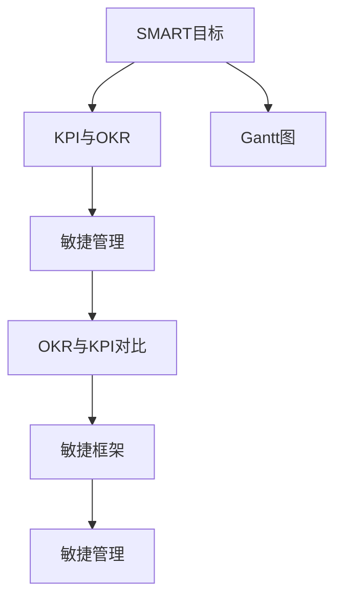
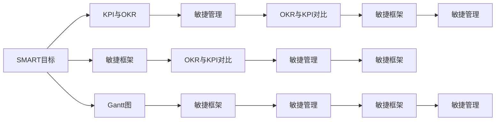

                 

# 行动体系对团队管理的重要性

## 1. 背景介绍

### 1.1 问题由来

在信息技术驱动的快速迭代和竞争激烈的当下，企业的成长高度依赖于团队能力的快速提升和高效协作。在实践中，团队管理面临着一系列挑战，如沟通效率低下、任务推进困难、协作能力不足等。这些问题不仅影响企业的敏捷性和创新能力，还制约了组织的绩效和可持续发展。

为了有效应对这些挑战，团队管理者开始重视行动体系的建设。行动体系旨在通过制定明确的行动计划、过程管理和效果评估，提升团队的工作效率和协作质量，实现组织的战略目标。

### 1.2 问题核心关键点

行动体系的核心在于通过一套明确的行动计划和过程管理，指导团队成员在明确的目标指引下，高效协同，将策略转化为可执行的行动。其核心要素包括：

- **目标设定**：明确团队目标和任务，确保团队成员对任务的重要性和紧迫性有共识。
- **行动计划**：制定详细的执行步骤和时间表，确保任务按时完成。
- **过程监控**：通过定期检查和反馈，及时调整行动方案，确保过程的稳定推进。
- **效果评估**：对任务的完成效果进行评估，总结经验教训，持续改进。

有效的行动体系能够显著提升团队的执行力、效率和创新能力，帮助企业在动态变化的市场环境中保持竞争优势。

## 2. 核心概念与联系

### 2.1 核心概念概述

行动体系主要包括以下几个关键概念：

- **SMART目标**：Specific, Measurable, Achievable, Relevant, Time-bound，即明确、可衡量、可实现、相关和有时限的目标。
- **KPI与OKR**：关键绩效指标(Key Performance Indicator)和目标与关键结果(Objective and Key Results)，用于衡量目标实现情况。
- **Gantt图和甘特图**：项目管理工具，用于可视化项目进度和时间表。
- **敏捷管理**：一种灵活的管理方法，强调快速响应变化、持续迭代和客户反馈。
- **OKR与KPI对比**：OKR更侧重于目标设定和过程管理，而KPI更侧重于结果评估。
- **敏捷框架**：如Scrum、Kanban等，提供了一套明确的流程和规范，指导团队高效协作。

这些概念相互联系，共同构成了行动体系的基本框架，帮助团队在复杂多变的环境中实现高效协作和目标达成。

### 2.2 概念间的关系

行动体系的各个概念通过逻辑关系紧密相连，形成了一套系统的管理方法论。以下通过几个Mermaid流程图来展示这些概念间的关系：



这个流程图展示了各个概念之间的关系：

1. **SMART目标**是行动体系的基础，指导其他管理工具和方法的使用。
2. **KPI与OKR**作为衡量目标实现情况的工具，与SMART目标紧密相关。
3. **Gantt图**作为项目管理工具，辅助SMART目标的实现。
4. **敏捷管理**强调过程管理，与KPI与OKR和Gantt图紧密联系。
5. **OKR与KPI对比**通过不同管理方法的比较，帮助团队选择更合适的管理工具。
6. **敏捷框架**提供了一套详细的流程和规范，辅助敏捷管理的实施。

### 2.3 核心概念的整体架构

最后，我们用一个综合的流程图来展示这些核心概念在大行动体系中的整体架构：



这个综合流程图展示了从目标设定到过程监控，再到效果评估的全过程，各个概念在大行动体系中的作用和联系。

## 3. 核心算法原理 & 具体操作步骤

### 3.1 算法原理概述

行动体系的构建和实施主要基于以下几个核心算法原理：

- **任务分解与细化**：将大目标分解为可执行的小任务，确保每个团队成员都明确自己的职责和任务。
- **进度追踪与调整**：通过定期检查和反馈，调整行动计划，确保任务按时完成。
- **效果评估与优化**：对任务完成效果进行评估，总结经验教训，持续改进。

### 3.2 算法步骤详解

以下是构建和实施行动体系的具体步骤：

1. **确定目标**：
   - 根据组织战略和团队定位，设定SMART目标。
   - 确定任务分解的细化标准，确保每个任务都有明确的职责和负责人员。

2. **制定计划**：
   - 使用Gantt图等项目管理工具，制定详细的行动计划和时间表。
   - 确定关键路径和里程碑，确保重要任务按时完成。

3. **执行与监控**：
   - 通过定期会议和进度报告，监控任务执行情况。
   - 使用敏捷管理框架，如Scrum或Kanban，灵活应对变化，确保过程稳定推进。

4. **效果评估**：
   - 根据KPI和OKR评估任务完成效果。
   - 分析问题和挑战，提出改进建议。
   - 总结经验教训，优化流程和工具，提升团队执行力。

### 3.3 算法优缺点

行动体系在提升团队管理效率和绩效方面具有显著优势：

**优点**：
- **提高效率**：通过明确的目标和详细的计划，团队成员能够更高效地完成任务。
- **增强协作**：使用敏捷管理框架，促进团队成员的协作和沟通。
- **灵活应对变化**：能够快速调整计划，适应动态变化的环境。

**缺点**：
- **资源消耗大**：需要投入大量的时间和人力进行目标设定和计划制定。
- **过程复杂**：需要复杂的监控和评估流程，对团队管理能力要求高。
- **灵活性受限**：严格的流程和规范可能导致灵活性不足，难以应对突发情况。

### 3.4 算法应用领域

行动体系在多个领域得到了广泛应用，以下是几个典型场景：

1. **软件开发**：使用敏捷框架，如Scrum或Kanban，帮助开发团队高效协作，快速迭代。
2. **项目管理**：通过Gantt图和敏捷管理框架，管理项目进度和任务分配，确保项目按时完成。
3. **市场营销**：设定SMART目标，使用OKR和KPI评估市场活动效果，提升市场推广效率。
4. **产品管理**：通过敏捷框架，快速响应市场需求变化，提升产品迭代速度。
5. **人力资源管理**：设定员工绩效目标，使用KPI和OKR评估员工表现，提升团队执行力。

## 4. 数学模型和公式 & 详细讲解 & 举例说明

### 4.1 数学模型构建

在行动体系中，我们可以通过数学模型来量化目标设定和任务管理。以下是一个简化的行动体系数学模型：

$$
\text{目标} = \sum_{i=1}^{n} \text{任务}_i \times \text{权重}_i
$$

其中，$n$ 表示任务数量，$\text{任务}_i$ 表示第 $i$ 个任务的完成情况，$\text{权重}_i$ 表示第 $i$ 个任务的重要性。

### 4.2 公式推导过程

设任务 $i$ 的完成度为 $x_i$，任务 $i$ 的重要性为 $w_i$，则目标实现情况 $T$ 的公式为：

$$
T = \sum_{i=1}^{n} x_i \times w_i
$$

为了最大化目标实现情况 $T$，我们需要求解每个任务的完成度 $x_i$，以满足 $T$ 的优化目标：

$$
\max_{x_i} T = \sum_{i=1}^{n} x_i \times w_i
$$

### 4.3 案例分析与讲解

假设某项目包含三个任务：任务 $1$ 的重要性为 $0.5$，任务 $2$ 的重要性为 $0.3$，任务 $3$ 的重要性为 $0.2$。项目总目标是 $1.0$。如果任务 $1$ 的完成度为 $0.8$，任务 $2$ 的完成度为 $0.7$，任务 $3$ 的完成度为 $0.6$，则目标实现情况 $T$ 的计算如下：

$$
T = 0.5 \times 0.8 + 0.3 \times 0.7 + 0.2 \times 0.6 = 0.9
$$

由于总目标为 $1.0$，项目当前距离目标的差距为 $0.1$。

## 5. 项目实践：代码实例和详细解释说明

### 5.1 开发环境搭建

在构建行动体系时，需要使用项目管理工具和协作平台。以下是Python和Flask框架下的开发环境搭建步骤：

1. **安装Python和Flask**：
   - 确保Python 3.6或更高版本已安装。
   - 使用pip安装Flask和相关的Web框架，如Jinja2。

2. **搭建Web应用**：
   - 创建Flask应用程序，编写视图函数和模板文件。
   - 使用SQLite或其他数据库管理工具，存储项目数据。

3. **部署Web应用**：
   - 将应用程序部署到云服务器，如AWS或GCP。
   - 配置DNS解析和SSL证书，确保应用安全。

### 5.2 源代码详细实现

以下是一个简化的Flask Web应用示例，用于管理任务和进度：

```python
from flask import Flask, render_template, request

app = Flask(__name__)

# 任务列表
tasks = [
    {"id": 1, "name": "任务1", "status": "未开始", "weight": 0.5},
    {"id": 2, "name": "任务2", "status": "进行中", "weight": 0.3},
    {"id": 3, "name": "任务3", "status": "已完成", "weight": 0.2}
]

@app.route('/', methods=['GET', 'POST'])
def index():
    if request.method == 'POST':
        task_id = request.form.get('task_id')
        task_status = request.form.get('status')
        task = None
        for task in tasks:
            if task['id'] == int(task_id):
                task['status'] = task_status
                break
        tasks = [task for task in tasks if task['id'] == int(task_id)]
        return render_template('index.html', tasks=tasks)
    else:
        return render_template('index.html', tasks=tasks)

if __name__ == '__main__':
    app.run(debug=True)
```

### 5.3 代码解读与分析

**代码分析**：
- **Flask框架**：使用Flask框架搭建Web应用，方便处理HTTP请求和渲染模板。
- **任务管理**：使用Python字典存储任务信息，包括任务ID、名称、状态和权重。
- **视图函数**：使用视图函数处理请求，更新任务状态。
- **模板渲染**：使用模板引擎渲染HTML页面，展示任务列表和表单。

**功能实现**：
- **任务列表展示**：通过Flask的路由机制，展示所有任务列表。
- **任务状态更新**：使用POST方法，接收表单提交的任务ID和状态，更新任务状态。
- **页面渲染**：使用HTML模板展示任务列表和表单，方便用户操作。

### 5.4 运行结果展示

假设运行上述代码，访问网站 `http://localhost:5000/`，将看到如下任务列表页面：

```html
<!DOCTYPE html>
<html>
<head>
    <title>任务管理</title>
</head>
<body>
    <h1>任务列表</h1>
    <form method="POST">
        <label for="task_id">任务ID：</label>
        <input type="number" id="task_id" name="task_id" required>
        <br>
        <label for="status">状态：</label>
        <select id="status" name="status" required>
            <option value="未开始">未开始</option>
            <option value="进行中">进行中</option>
            <option value="已完成">已完成</option>
        </select>
        <br>
        <button type="submit">更新状态</button>
    </form>
    <h2>任务列表</h2>
    <table>
        <tr>
            <th>ID</th>
            <th>名称</th>
            <th>状态</th>
            <th>权重</th>
        </tr>
        
            <tr>
                <td>{{ task['id'] }}</td>
                <td>{{ task['name'] }}</td>
                <td>{{ task['status'] }}</td>
                <td>{{ task['weight'] }}</td>
            </tr>
        
    </table>
</body>
</html>
```

假设用户更新了任务 $2$ 的状态为 "已完成"，则页面更新为：

```html
<!DOCTYPE html>
<html>
<head>
    <title>任务管理</title>
</head>
<body>
    <h1>任务列表</h1>
    <form method="POST">
        <label for="task_id">任务ID：</label>
        <input type="number" id="task_id" name="task_id" required>
        <br>
        <label for="status">状态：</label>
        <select id="status" name="status" required>
            <option value="未开始">未开始</option>
            <option value="进行中">进行中</option>
            <option value="已完成">已完成</option>
        </select>
        <br>
        <button type="submit">更新状态</button>
    </form>
    <h2>任务列表</h2>
    <table>
        <tr>
            <th>ID</th>
            <th>名称</th>
            <th>状态</th>
            <th>权重</th>
        </tr>
        <tr>
            <td>1</td>
            <td>任务1</td>
            <td>未开始</td>
            <td>0.5</td>
        </tr>
        <tr>
            <td>2</td>
            <td>任务2</td>
            <td>已完成</td>
            <td>0.3</td>
        </tr>
        <tr>
            <td>3</td>
            <td>任务3</td>
            <td>已完成</td>
            <td>0.2</td>
        </tr>
    </table>
</body>
</html>
```

## 6. 实际应用场景

### 6.1 软件开发

在软件开发中，敏捷框架如Scrum和Kanban提供了详细的流程规范，帮助团队高效协作。例如，使用Kanban看板管理任务，确保每个任务都在明确的状态下进行，避免任务遗漏和进度延误。通过每日站会（Daily Scrum），团队成员可以快速共享进展，识别和解决问题，确保项目按时交付。

### 6.2 项目管理

项目管理中使用Gantt图可视化项目进度和时间表，帮助团队成员明确任务和时间节点。通过敏捷管理框架，如Scrum，项目经理可以灵活调整计划，快速响应变化。使用OKR和KPI评估项目进展和团队绩效，及时调整策略，确保项目目标达成。

### 6.3 市场营销

市场营销团队设定SMART目标，使用OKR和KPI评估市场活动效果。通过数据驱动的决策，不断优化营销策略，提升市场推广效果。使用敏捷管理框架，灵活应对市场变化，确保市场活动按时执行。

### 6.4 产品管理

产品管理团队通过敏捷框架，快速响应市场需求变化，迭代产品功能。设定SMART目标，使用OKR和KPI评估产品功能迭代效果，确保产品按时上线。通过Gantt图和敏捷管理框架，管理产品迭代进度和任务分配。

## 7. 工具和资源推荐

### 7.1 学习资源推荐

为了帮助开发者系统掌握行动体系的理论基础和实践技巧，这里推荐一些优质的学习资源：

1. **《敏捷管理实践指南》**：介绍敏捷管理的基本概念、流程和最佳实践。
2. **《项目管理理论与实践》**：全面介绍项目管理的理论基础和实用技巧。
3. **《OKR与KPI：如何设定和管理目标》**：详细讲解OKR和KPI的设定和管理方法。
4. **《Scrum敏捷管理》**：讲解Scrum敏捷管理框架的原理和实践方法。
5. **《Kanban看板管理》**：介绍Kanban看板管理的原理和应用场景。

通过对这些资源的学习实践，相信你一定能够快速掌握行动体系的理论基础和实践技巧，并将其应用到实际项目中。

### 7.2 开发工具推荐

高效的开发离不开优秀的工具支持。以下是几款用于行动体系开发的常用工具：

1. **Trello和Asana**：项目管理工具，提供看板和列表视图，帮助团队管理任务和进度。
2. **Jira**：专业的项目管理工具，支持敏捷框架，提供详细的任务跟踪和报告功能。
3. **Gantt项目图表**：项目管理工具，用于可视化项目进度和时间表。
4. **Slack**：即时通讯工具，支持团队协作和信息共享。
5. **Zoom**：视频会议工具，支持远程团队协作和沟通。

合理利用这些工具，可以显著提升行动体系的构建和实施效率，加快创新迭代的步伐。

### 7.3 相关论文推荐

行动体系的构建和实施源于学界的持续研究。以下是几篇奠基性的相关论文，推荐阅读：

1. **《敏捷开发宣言》**：介绍敏捷开发的基本理念和核心价值观。
2. **《OKR管理：如何设定和管理目标》**：讲解OKR管理的原理和实践方法。
3. **《Kanban管理：一种灵活的项目管理方法》**：介绍Kanban管理的原理和应用场景。
4. **《Scrum敏捷管理》**：讲解Scrum敏捷管理框架的原理和实践方法。
5. **《项目管理理论与实践》**：全面介绍项目管理的理论基础和实用技巧。

这些论文代表了大行动体系的发展脉络。通过学习这些前沿成果，可以帮助研究者把握学科前进方向，激发更多的创新灵感。

除上述资源外，还有一些值得关注的前沿资源，帮助开发者紧跟行动体系技术的最新进展，例如：

1. **arXiv论文预印本**：人工智能领域最新研究成果的发布平台，包括大量尚未发表的前沿工作，学习前沿技术的必读资源。
2. **GitHub热门项目**：在GitHub上Star、Fork数最多的行动体系相关项目，往往代表了该技术领域的发展趋势和最佳实践，值得去学习和贡献。
3. **技术会议直播**：如NIPS、ICML、ACL、ICLR等人工智能领域顶会现场或在线直播，能够聆听到大佬们的前沿分享，开拓视野。

4. **企业应用案例**：阅读领先企业的行动体系建设案例，了解实践中的具体应用和优化方法，借鉴成功经验。

总之，对于行动体系的学习和实践，需要开发者保持开放的心态和持续学习的意愿。多关注前沿资讯，多动手实践，多思考总结，必将收获满满的成长收益。

## 8. 总结：未来发展趋势与挑战

### 8.1 总结

本文对行动体系构建和实施的基本原理和操作步骤进行了全面系统的介绍。首先阐述了行动体系在团队管理中的重要性和核心要素，明确了目标设定、行动计划、过程监控和效果评估等关键环节。其次，从原理到实践，详细讲解了行动体系的数学模型和操作步骤，给出了行动体系任务管理的完整代码实例。同时，本文还广泛探讨了行动体系在软件开发、项目管理、市场营销、产品管理等多个领域的应用前景，展示了行动体系在提高团队协作和项目管理效率方面的巨大潜力。此外，本文精选了行动体系的学习资源，力求为读者提供全方位的技术指引。

通过本文的系统梳理，可以看到，行动体系在提升团队管理效率和绩效方面具有显著优势。有效的行动体系能够显著提升团队的执行力、效率和创新能力，帮助企业在动态变化的市场环境中保持竞争优势。未来，伴随行动体系的不断发展，组织将能够更好地应对复杂多变的市场环境，实现快速响应和持续创新。

### 8.2 未来发展趋势

展望未来，行动体系的发展趋势主要包括以下几个方面：

1. **智能化管理**：结合人工智能和大数据技术，通过数据分析和机器学习，提升行动体系的管理效率和决策支持。
2. **自动化流程**：使用RPA（机器人流程自动化）和AI技术，自动化处理重复性任务，提升行动体系的执行效率。
3. **跨部门协作**：推动不同部门和团队之间的协作和沟通，提升整体协作效率。
4. **数字化转型**：利用数字化工具和平台，实现行动体系的数字化管理和数据化运营。
5. **客户导向**：将客户反馈和需求融入行动体系，提升客户满意度和市场竞争力。

这些发展趋势将进一步提升行动体系的管理效能，帮助企业在复杂多变的环境中保持竞争优势。

### 8.3 面临的挑战

尽管行动体系在提升团队管理效率和绩效方面具有显著优势，但在实施过程中仍面临诸多挑战：

1. **文化和习惯改变**：行动体系需要团队成员改变原有的工作习惯和文化，可能需要较长时间适应。
2. **技能和能力要求**：行动体系需要团队成员具备较高的管理能力和技术水平，对团队能力要求较高。
3. **灵活性不足**：严格的流程和规范可能导致灵活性不足，难以应对突发情况。
4. **资源消耗大**：需要投入大量的时间和人力进行目标设定和计划制定。

### 8.4 研究展望

面对行动体系面临的挑战，未来的研究需要在以下几个方面寻求新的突破：

1. **文化融合**：通过培训和引导，帮助团队成员逐步适应行动体系的要求，改变原有的工作习惯和文化。
2. **技能提升**：提供必要的培训和支持，提升团队成员的管理能力和技术水平，确保行动体系的顺利实施。
3. **灵活性增强**：灵活调整行动体系的流程和规范，确保其适应性更强，能应对突发情况。
4. **资源优化**：采用自动化和智能化手段，减少行动体系实施的时间和人力消耗，提高效率。

总之，行动体系需要从多个维度进行优化和改进，才能更好地应对复杂多变的市场环境，实现团队的快速响应和持续创新。只有在灵活性与规范性、效率与效果之间找到平衡，才能真正发挥行动体系的潜力，帮助组织在激烈的市场竞争中保持领先。

## 9. 附录：常见问题与解答

**Q1：如何评估行动体系的效果？**

A: 行动体系的效果评估可以从以下几个方面进行：
1. **任务完成度**：通过设定明确的目标和任务分解，评估每个任务的完成情况。
2. **团队协作**：通过定期会议和反馈，评估团队协作的效率和质量。
3. **项目进度**：通过Gantt图和敏捷框架，评估项目的进度和时间节点。
4. **绩效指标**：使用OKR和KPI评估团队和项目的绩效表现。

**Q2：如何克服文化和习惯改变带来的阻力？**

A: 文化和习惯改变是行动体系实施中的重要挑战。以下是一些克服阻力的策略：
1. **培训和引导**：通过培训和引导，帮助团队成员逐步适应行动体系的要求。
2. **示范效应**：通过领导和骨干成员的示范，带动整个团队的改变。
3. **激励机制**：建立合理的激励机制，激励团队成员积极参与行动体系的实施。
4. **逐步推进**：逐步引入行动体系，避免一下子改变原有文化和习惯。

**Q3：如何平衡灵活性和规范性？**

A: 平衡灵活性和规范性是行动体系实施中的关键问题。以下是一些平衡策略：
1. **灵活调整**：在确保整体流程和规范不变的前提下，灵活调整具体任务和进度。
2. **定期反馈**：通过定期反馈和调整，确保行动体系能够灵活应对变化。
3. **持续改进**：持续优化行动体系，确保其适应性和灵活性。

**Q4：如何降低行动体系实施的资源消耗？**

A: 降低行动体系实施的资源消耗需要从多个方面入手：
1. **自动化工具**：使用自动化工具，如RPA和AI技术，减少人工操作。
2. **标准化流程**：通过标准化流程和模板，减少重复性工作。
3. **智能化管理**：结合智能化管理工具，提升效率。

这些策略可以帮助降低行动体系实施的资源消耗，提高实施效率。

总之，行动体系在提升团队管理效率和绩效方面具有显著优势。通过对行动体系理论基础和实践技巧的系统学习和应用，团队管理者可以更好地应对复杂多变的市场环境，实现团队的快速响应和持续创新。

---

作者：禅与计算机程序设计艺术 / Zen and the Art of Computer Programming

