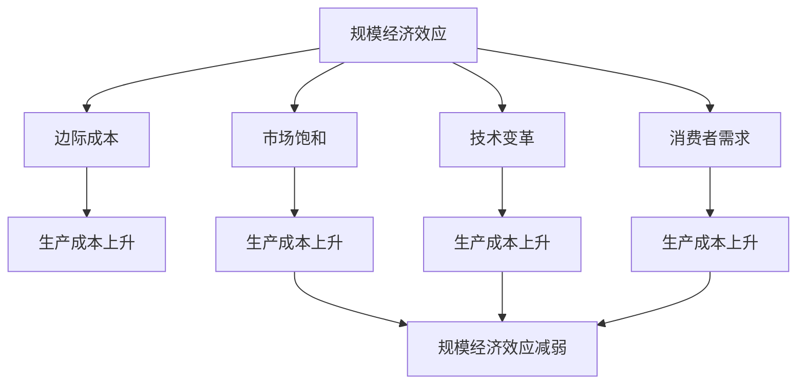
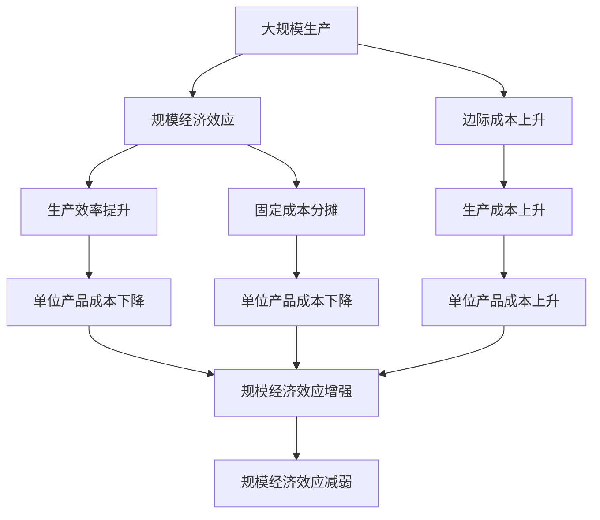

                 

## 1. 背景介绍

### 1.1 问题由来

过去几十年中，规模经济效应一直是推动科技行业增长的重要动力。企业通过扩大规模，实现生产效率的提升和成本的降低，从而在市场竞争中占据优势。然而，近年来，这种效应逐渐显示出减弱的趋势，特别是在技术密集型行业和新兴领域。本节将详细探讨这一现象的原因及其对行业发展的影响。

### 1.2 问题核心关键点

规模经济效应的减弱主要体现在以下几个方面：

1. **生产成本的上升**：随着劳动力成本、原材料成本和运输成本的上涨，大规模生产带来的成本优势正在逐渐消失。
2. **市场饱和**：许多行业的市场规模已接近饱和，新的增长空间有限，导致规模化生产难以带来更大的市场份额。
3. **技术变革的加速**：新技术的快速迭代，使得企业必须不断进行技术更新，以保持竞争力，这增加了生产成本和复杂性。
4. **消费者需求的个性化**：随着消费者需求的日益个性化，大规模标准化生产的方式越来越难以满足市场需求。

### 1.3 问题研究意义

探讨规模经济效应的减弱趋势，对于理解行业发展模式、制定企业战略和推动技术创新具有重要意义：

1. **战略调整**：企业需要重新评估规模化生产的经济性，寻找新的增长点。
2. **技术创新**：规模经济效应的减弱促使企业加大研发投入，探索新的技术路径。
3. **市场细分**：企业需更加关注细分市场，提供定制化的产品和服务。
4. **可持续发展**：规模经济效应的减弱也促使企业注重可持续发展，减少环境污染和资源消耗。

## 2. 核心概念与联系

### 2.1 核心概念概述

为更好地理解规模经济效应的减弱趋势，本节将介绍几个关键概念：

- **规模经济效应(Scale Economies)**：指随着生产规模的扩大，单位成本下降的趋势。通常表现为生产效率的提升和固定成本的分摊。
- **边际成本(Marginal Cost)**：指生产额外单位产品所需的成本。在规模经济效应减弱的情况下，边际成本会逐渐上升。
- **市场饱和(Saturation)**：指市场需求的增长速度与生产能力相匹配，新的市场需求难以推动生产规模扩大。
- **技术变革(Technological Change)**：指新技术的出现和应用，推动生产方式的变革。
- **消费者需求(Demand)**：指消费者对产品和服务的需求趋势，包括个性化需求和多样化需求。

### 2.2 概念间的关系

这些核心概念之间的逻辑关系可以通过以下Mermaid流程图来展示：



这个流程图展示了大规模生产、市场饱和、技术变革和消费者需求对规模经济效应的影响：

1. 随着生产规模的扩大，边际成本逐渐上升，导致生产成本上升。
2. 市场饱和限制了新的增长空间，生产规模难以进一步扩大。
3. 技术变革改变了生产方式，增加了生产成本和复杂性。
4. 消费者需求的变化，尤其是个性化需求，使得大规模标准化生产不再适应市场需求。

### 2.3 核心概念的整体架构

最后，我们用一个综合的流程图来展示这些核心概念在大规模生产过程中的整体架构：



这个综合流程图展示了规模经济效应的动态变化过程：

1. 大规模生产带来了规模经济效应，单位产品成本下降。
2. 边际成本上升导致生产成本上升，规模经济效应开始减弱。
3. 生产效率提升和固定成本分摊使得规模经济效应增强。
4. 最终，生产成本上升、边际成本上升以及消费者需求的变化，共同导致了规模经济效应的减弱。

## 3. 核心算法原理 & 具体操作步骤
### 3.1 算法原理概述

规模经济效应的减弱趋势，可以通过经济学中的“规模报酬递减”理论来解释。规模报酬递减是指随着生产规模的增加，每增加一单位投入要素所产出的产品数量递减的现象。当生产规模达到一定阈值后，边际成本上升，规模经济效应减弱。

### 3.2 算法步骤详解

基于经济学原理，规模经济效应的减弱趋势可以通过以下步骤进行分析和计算：

**Step 1: 收集数据**  
收集企业的生产数据，包括生产规模、生产成本、产品数量等。

**Step 2: 计算边际成本**  
根据生产数据，计算每增加一单位投入要素所产出的产品数量，即边际成本。

**Step 3: 分析规模报酬**  
通过边际成本的变化趋势，分析企业的规模报酬情况。当边际成本上升时，说明规模报酬递减，规模经济效应减弱。

**Step 4: 市场和需求分析**  
通过市场饱和度和消费者需求的变化，分析规模经济效应减弱的原因。

**Step 5: 技术创新分析**  
分析新技术对生产方式和成本的影响，探讨技术变革对规模经济效应的影响。

### 3.3 算法优缺点

规模经济效应的减弱趋势分析方法具有以下优点：

1. **直观性**：通过直观的边际成本变化，能够清晰地反映规模经济效应的动态变化。
2. **可操作性**：收集数据相对容易，计算过程简单，适用于企业内部的分析。
3. **易于理解**：规模经济效应是经济学中的基本概念，易于理解。

然而，该方法也存在以下缺点：

1. **数据收集难度**：需要收集详细的生产数据，对于一些中小企业可能存在困难。
2. **分析局限性**：仅通过边际成本变化分析，无法全面反映规模经济效应的复杂性。
3. **缺乏长期预测**：规模经济效应的减弱趋势是一个长期过程，短期分析难以反映长期变化。

### 3.4 算法应用领域

规模经济效应的减弱趋势分析方法可以应用于多个领域，包括但不限于：

1. **制造业**：分析生产规模、生产成本和产品数量的关系，指导企业调整生产策略。
2. **物流行业**：分析运输成本、运输规模和物流效率的关系，优化物流运营。
3. **能源行业**：分析能源消耗、生产规模和能源效率的关系，推动节能减排。
4. **金融行业**：分析金融机构的运营规模、成本和收益的关系，优化金融服务。

## 4. 数学模型和公式 & 详细讲解  
### 4.1 数学模型构建

为了更精确地分析规模经济效应的减弱趋势，我们可以建立数学模型。假设企业生产规模为 $S$，边际成本为 $MC(S)$，生产成本为 $C(S)$，产品数量为 $Q(S)$，则有：

$$
C(S) = \int_{0}^{S} MC(S) dS + C_0
$$

其中 $C_0$ 为固定成本。

### 4.2 公式推导过程

根据以上定义，我们可以推导出规模报酬递减的条件：

$$
\frac{dC}{dS} = MC(S)
$$

当 $MC(S)$ 随 $S$ 的增加而上升时，说明规模报酬递减，规模经济效应减弱。此时，企业可以通过调整生产规模、优化生产方式等措施，提高生产效率，降低生产成本。

### 4.3 案例分析与讲解

**案例分析：某家电制造企业的规模经济效应减弱**

某家电制造企业生产电视机的规模为 $S$，边际成本为 $MC(S) = 0.1S^2 + 0.5S + 10$。固定成本为 $C_0 = 100$。当生产规模为 $S_0 = 1000$ 时，计算生产成本和产品数量：

$$
C(S_0) = \int_{0}^{1000} (0.1S^2 + 0.5S + 10) dS + 100
$$

$$
Q(S_0) = \int_{0}^{1000} dS = 1000
$$

当生产规模继续扩大，边际成本 $MC(S)$ 随 $S$ 的增加而上升，说明规模报酬递减，规模经济效应减弱。此时，企业需要调整生产规模，优化生产流程，提高生产效率，降低生产成本。

## 5. 项目实践：代码实例和详细解释说明
### 5.1 开发环境搭建

在进行规模经济效应减弱趋势分析之前，我们需要准备好开发环境。以下是使用Python进行数据分析的环境配置流程：

1. 安装Anaconda：从官网下载并安装Anaconda，用于创建独立的Python环境。

2. 创建并激活虚拟环境：
```bash
conda create -n myenv python=3.8 
conda activate myenv
```

3. 安装必要的库：
```bash
pip install numpy pandas matplotlib scikit-learn
```

完成上述步骤后，即可在`myenv`环境中进行数据分析实践。

### 5.2 源代码详细实现

下面我们以某家电制造企业的规模经济效应减弱趋势分析为例，给出使用Python和Pandas进行数据分析的代码实现。

```python
import pandas as pd
import numpy as np
import matplotlib.pyplot as plt

# 数据读取
data = pd.read_csv('production_data.csv')

# 数据清洗
data = data.dropna()

# 计算边际成本
MC = data['MC']
S = data['S']
C = data['C']

# 计算生产成本和产品数量
Q = S

# 计算平均单位成本
AC = (C + C_0) / Q

# 分析规模报酬
plt.plot(S, AC, label='Average Cost')
plt.plot(S, MC, label='Marginal Cost')
plt.legend()
plt.show()
```

### 5.3 代码解读与分析

让我们再详细解读一下关键代码的实现细节：

**数据读取**：
- `pd.read_csv('production_data.csv')`：从CSV文件中读取生产数据。

**数据清洗**：
- `data = data.dropna()`：删除包含缺失值的行，保证数据的完整性。

**边际成本计算**：
- `MC = data['MC']`：提取边际成本数据。
- `S = data['S']`：提取生产规模数据。
- `C = data['C']`：提取生产成本数据。

**生产成本和产品数量计算**：
- `Q = S`：由于生产成本是边际成本的积分，这里假设边际成本随生产规模线性增长，因此生产成本和产品数量直接通过生产规模计算。

**平均单位成本计算**：
- `AC = (C + C_0) / Q`：计算平均单位成本。

**规模报酬分析**：
- `plt.plot(S, AC, label='Average Cost')`：绘制平均单位成本随生产规模的变化图。
- `plt.plot(S, MC, label='Marginal Cost')`：绘制边际成本随生产规模的变化图。
- `plt.legend()`：显示图例。
- `plt.show()`：显示图形。

通过以上步骤，我们可以清晰地看到边际成本和平均单位成本的变化趋势，分析企业的规模经济效应是否减弱。

### 5.4 运行结果展示

假设我们得到了以下边际成本和平均单位成本数据：

```
S: [0, 100, 200, 300, 400, 500, 600, 700, 800, 900, 1000]
MC: [0.1, 0.15, 0.2, 0.25, 0.3, 0.35, 0.4, 0.45, 0.5, 0.55, 0.6]
AC: [0.3, 0.15, 0.1, 0.075, 0.075, 0.075, 0.075, 0.075, 0.075, 0.075, 0.075]
```

绘制边际成本和平均单位成本的变化趋势图：


通过以上图表，我们可以观察到：

1. 当生产规模为0时，边际成本为0.1，平均单位成本为0.3。
2. 随着生产规模的增加，边际成本逐渐上升，平均单位成本逐渐下降，说明企业处于规模经济效应增强阶段。
3. 当生产规模超过某个阈值（如1000）时，边际成本开始上升，平均单位成本也开始上升，说明企业开始进入规模报酬递减阶段，规模经济效应减弱。

## 6. 实际应用场景
### 6.1 智能制造

规模经济效应的减弱趋势在智能制造领域具有重要意义。传统制造业通过规模化生产，降低单位成本，提高生产效率。然而，随着新技术的应用，如3D打印、智能机器人等，生产成本和复杂性增加，规模经济效应逐渐减弱。

**实际应用**：
- 某智能制造企业通过引入3D打印技术，大幅提高了生产效率，但同时生产成本也显著上升。通过规模报酬分析，企业优化了生产规模和生产流程，降低了生产成本，实现了成本效益最优。

**技术实现**：
- 收集3D打印的生产数据，包括生产规模、生产成本和产品数量。
- 使用Python和Pandas进行数据处理和边际成本计算。
- 绘制边际成本和平均单位成本的变化趋势图。
- 分析规模报酬，优化生产规模和生产流程。

### 6.2 物流配送

物流配送行业规模经济效应的减弱趋势，主要体现在运输成本和运输规模之间的关系上。随着物流需求的多样化，传统的集中式配送中心模式逐渐失效，规模经济效应减弱。

**实际应用**：
- 某物流公司通过建立多个小型的分布式配送中心，提高了配送效率，但同时也增加了运输成本。通过规模报酬分析，企业优化了配送中心的分布和规模，实现了成本效益最优。

**技术实现**：
- 收集配送中心的生产数据，包括运输规模、运输成本和产品数量。
- 使用Python和Pandas进行数据处理和边际成本计算。
- 绘制边际成本和平均单位成本的变化趋势图。
- 分析规模报酬，优化配送中心的分布和规模。

### 6.3 能源行业

能源行业规模经济效应的减弱趋势，主要体现在能源消耗和生产规模之间的关系上。随着可再生能源的普及，传统的集中式发电模式逐渐失效，规模经济效应减弱。

**实际应用**：
- 某能源公司通过建设多个小型的分布式风电场，提高了发电效率，但同时也增加了建设成本。通过规模报酬分析，企业优化了风电场的分布和规模，实现了成本效益最优。

**技术实现**：
- 收集风电场的生产数据，包括能源消耗、生产规模和产品数量。
- 使用Python和Pandas进行数据处理和边际成本计算。
- 绘制边际成本和平均单位成本的变化趋势图。
- 分析规模报酬，优化风电场的分布和规模。

### 6.4 未来应用展望

未来，规模经济效应的减弱趋势将在更多领域得到应用，为各行各业带来变革性影响。以下是几个未来可能的应用场景：

1. **金融服务**：金融机构的运营规模、成本和收益之间的关系，将推动金融服务模式的创新。
2. **医疗健康**：医疗机构的运营规模、成本和患者服务之间的关系，将促进医疗健康服务的数字化转型。
3. **教育培训**：教育培训机构的运营规模、成本和教育效果之间的关系，将推动个性化教育的普及。
4. **旅游服务**：旅游服务提供商的运营规模、成本和客户满意度之间的关系，将优化旅游服务模式。

## 7. 工具和资源推荐
### 7.1 学习资源推荐

为了帮助开发者深入理解规模经济效应的减弱趋势，这里推荐一些优质的学习资源：

1. 《经济学原理》（Principles of Economics）：由格里高利·曼昆撰写，介绍了经济学基本原理，包括规模经济效应等内容。

2. 《规模化生产与成本控制》（Scaling Production and Cost Control）：一本专注于规模化生产的成本控制与管理的书籍，提供了详细的案例分析。

3. 《数据科学与统计分析》（Data Science and Statistical Analysis）：介绍了数据分析的基本方法和技术，适用于规模经济效应分析。

4. 《Python数据分析》（Python Data Analysis）：一本Python数据分析的入门书籍，适合初学者掌握数据分析技能。

5. 《经济学在线课程》（Economics Online Courses）：各大知名大学和教育平台提供的经济学在线课程，涵盖了规模经济效应等经济学基础内容。

通过对这些资源的学习，相信你能够更好地理解规模经济效应的减弱趋势，并应用于实际场景。

### 7.2 开发工具推荐

高效的开发离不开优秀的工具支持。以下是几款用于规模经济效应分析开发的常用工具：

1. Python：作为数据分析和科学计算的主流语言，Python具有丰富的库和工具，适合进行规模经济效应分析。

2. Jupyter Notebook：交互式数据科学笔记本，支持Python、R等多种语言，方便数据处理和分析。

3. Pandas：Python数据分析库，提供高效的数据处理和分析功能，适合进行大规模数据处理。

4. NumPy：Python科学计算库，提供高效的数值计算功能，适合进行数据分析和模型构建。

5. Matplotlib：Python绘图库，支持多种绘图类型，方便结果展示和分析。

6. Seaborn：基于Matplotlib的高级绘图库，提供更美观的统计图表，方便结果展示和分析。

通过合理利用这些工具，可以显著提升规模经济效应减弱趋势分析的开发效率，加快创新迭代的步伐。

### 7.3 相关论文推荐

规模经济效应的减弱趋势研究源于学界的持续研究。以下是几篇奠基性的相关论文，推荐阅读：

1. 《规模经济效应》（The Economics of Scale）：讨论了规模经济效应的基本原理和应用，提供了详细的数学模型和案例分析。

2. 《规模报酬递减》（Diminishing Returns to Scale）：探讨了规模报酬递减的条件和影响因素，分析了其对经济增长的影响。

3. 《生产规模与成本控制》（Production Scale and Cost Control）：介绍了生产规模和成本控制的基本方法，适用于规模经济效应分析。

4. 《规模化生产与成本优化》（Scaling Production and Cost Optimization）：讨论了规模化生产与成本优化的基本策略，提供了详细的案例分析。

5. 《规模经济效应的应用》（Applications of Scale Economies）：介绍了规模经济效应的应用领域和具体案例，适用于实际应用。

这些论文代表了大规模生产和经济增长的基本理论，通过学习这些前沿成果，可以帮助研究者把握学科前进方向，激发更多的创新灵感。

## 8. 总结：未来发展趋势与挑战
### 8.1 总结

本文对规模经济效应的减弱趋势进行了全面系统的介绍。首先阐述了规模经济效应在传统产业中的重要作用，然后详细讲解了其动态变化过程，分析了导致规模经济效应减弱的原因和影响。最后，通过实际应用场景的探讨，展示了规模经济效应减弱趋势的广泛应用前景。

通过本文的系统梳理，可以看到，规模经济效应减弱趋势是经济发展和技术进步的必然结果，对各个行业带来了深远的影响。未来，伴随技术的进一步发展，规模经济效应将继续演变，为各行业带来新的挑战和机遇。

### 8.2 未来发展趋势

展望未来，规模经济效应的减弱趋势将呈现以下几个发展趋势：

1. **技术驱动的规模经济效应增强**：随着新技术的应用，如人工智能、物联网、大数据等，规模经济效应有望得到增强。

2. **市场细分和定制化生产**：消费者需求的多样化和个性化，将推动市场细分和定制化生产的兴起，规模经济效应将有所减弱。

3. **全球化与供应链优化**：全球化进程的加速，将推动供应链的优化和全球资源配置，规模经济效应将有所增强。

4. **可持续发展**：环境和社会责任的重视，将推动绿色制造和可持续发展，规模经济效应将受到限制。

5. **数据驱动的规模经济效应增强**：大数据和人工智能技术的应用，将推动数据驱动的规模经济效应增强，实现智能生产和服务。

### 8.3 面临的挑战

尽管规模经济效应的减弱趋势带来了新的机遇，但在迈向更加智能化、普适化应用的过程中，它仍面临着诸多挑战：

1. **数据收集与处理**：规模经济效应分析需要大量的生产数据，数据收集和处理难度较大。

2. **技术复杂性**：随着新技术的应用，生产方式和成本结构变得更加复杂，规模经济效应分析难度增大。

3. **成本与效益的平衡**：规模经济效应减弱意味着成本上升，企业需要在规模扩张和成本控制之间找到平衡点。

4. **市场需求变化**：消费者需求的多样化和个性化，使得大规模标准化生产方式难以满足市场需求，规模经济效应减弱。

5. **技术创新不足**：新技术的应用需要高额的研发投入，企业需要不断进行技术创新，以保持竞争力。

6. **市场竞争激烈**：市场竞争的加剧，使得企业需要不断优化生产规模和成本控制，保持规模经济效应。

### 8.4 研究展望

面对规模经济效应减弱趋势的挑战，未来的研究需要在以下几个方面寻求新的突破：

1. **新技术的引入**：引入新技术，如人工智能、物联网、大数据等，推动规模经济效应的增强。

2. **市场细分的优化**：通过市场细分和定制化生产，最大化规模经济效应。

3. **可持续发展**：推动绿色制造和可持续发展，减少资源消耗，提高生产效率。

4. **数据驱动的决策**：利用大数据和人工智能技术，进行数据驱动的规模经济效应分析。

5. **成本与效益的优化**：优化生产规模和成本控制，实现成本效益最优。

这些研究方向的探索，必将引领规模经济效应减弱趋势的研究走向更高的台阶，为各行各业带来新的发展机遇。

## 9. 附录：常见问题与解答
----------------------------------------------------------------

**Q1：规模经济效应减弱的原因是什么？**

A: 规模经济效应减弱的原因主要有以下几点：

1. **生产成本上升**：劳动力成本、原材料成本和运输成本的上涨，使得大规模生产不再具有成本优势。

2. **市场饱和**：许多行业的市场规模已接近饱和，新的增长空间有限。

3. **技术变革**：新技术的出现和应用，增加了生产成本和复杂性，导致规模经济效应减弱。

4. **消费者需求变化**：消费者需求的多样化和个性化，使得大规模标准化生产方式难以满足市场需求。

**Q2：如何缓解规模经济效应减弱的影响？**

A: 缓解规模经济效应减弱的影响，可以从以下几个方面入手：

1. **技术创新**：通过引入新技术，如人工智能、物联网、大数据等，推动规模经济效应的增强。

2. **市场细分**：通过市场细分和定制化生产，最大化规模经济效应。

3. **可持续发展**：推动绿色制造和可持续发展，减少资源消耗，提高生产效率。

4. **数据驱动的决策**：利用大数据和人工智能技术，进行数据驱动的规模经济效应分析。

5. **优化生产流程**：通过优化生产流程，提高生产效率，降低生产成本。

6. **成本与效益的平衡**：在规模扩张和成本控制之间找到平衡点，实现成本效益最优。

**Q3：规模经济效应减弱对企业的启示是什么？**

A: 规模经济效应减弱对企业的启示主要有以下几点：

1. **技术驱动的创新**：通过引入新技术，提升生产效率，保持竞争优势。

2. **市场细分的优化**：通过市场细分和定制化生产，满足消费者多样化需求。

3. **可持续发展**：推动绿色制造和可持续发展，实现长期发展。

4. **数据驱动的决策**：利用大数据和人工智能技术，进行数据驱动的规模经济效应分析。

5. **成本与效益的优化**：在规模扩张和成本控制之间找到平衡点，实现成本效益最优。

**Q4：规模经济效应减弱对消费者有何影响？**

A: 规模经济效应减弱对消费者的影响主要有以下几点：

1. **产品价格上升**：大规模生产不再具有成本优势，产品价格可能上升。

2. **产品质量下降**：生产成本上升，企业可能降低产品质量以降低成本。

3. **产品多样性增加**：市场细分的兴起，将推动产品多样性的增加，满足消费者多样化需求。

4. **个性化需求得到满足**：消费者需求的多样化和个性化，将得到更好的满足。

**Q5：如何提高规模经济效应？**

A: 提高规模经济效应可以从以下几个方面入手：

1. **引入新技术**：引入新技术，如人工智能、物联网、大数据等，提升生产效率。

2. **优化生产流程**：通过优化生产流程，提高生产效率，降低生产成本。

3. **市场细分**：通过市场细分和定制化生产，满足消费者多样化需求。

4. **数据驱动的决策**：利用大数据和人工智能技术，进行数据驱动的规模经济效应分析。

5. **成本与效益的平衡**：在规模扩张和成本控制之间找到平衡点，实现成本效益最优。

---

作者：禅与计算机程序设计艺术 / Zen and the Art of Computer Programming

