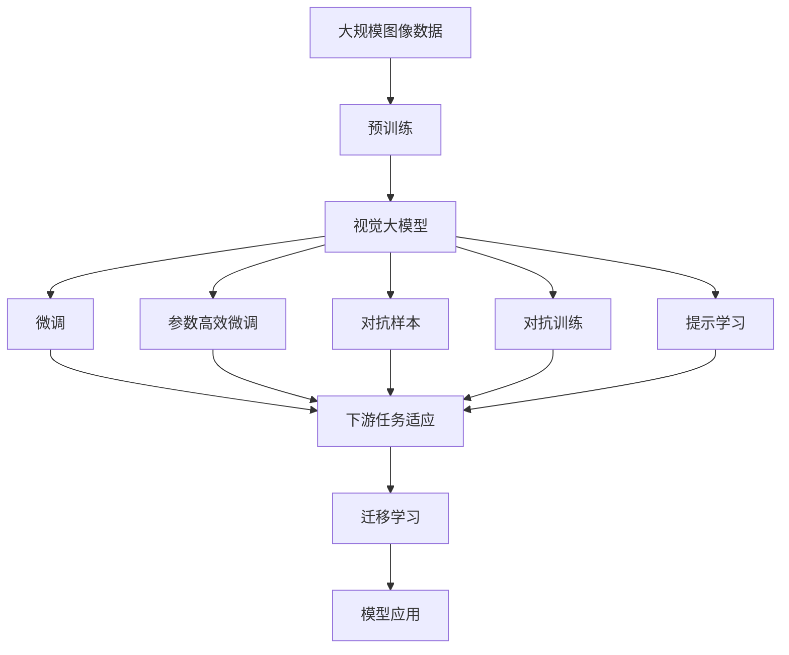

                 

## 1. 背景介绍

### 1.1 问题由来
近年来，深度学习在图像理解与生成领域取得了显著进展。视觉大模型，如OpenAI的DALL·E和DeepMind的VQ-VAE等，通过大规模数据预训练和任务微调，展现了令人瞩目的图像生成和识别能力。这些模型不仅能够根据文本描述生成高质量的图片，还能理解图片的视觉内容，提供了丰富的应用可能性。

### 1.2 问题核心关键点
视觉大模型的核心在于预训练和微调两个阶段。预训练阶段，模型在大规模图像数据集上进行无监督学习，学习到通用的视觉表示。微调阶段，模型使用特定任务的有监督数据进行优化，使得模型在特定任务上表现出色。视觉大模型融合了计算机视觉与自然语言处理（NLP）技术，能够处理图像与文本的交互，扩展了应用场景。

### 1.3 问题研究意义
视觉大模型为图像理解和生成技术带来了革命性的变革。它不仅提升了图像处理的精度和效率，还开辟了图像领域的新应用方向，如艺术创作、医学影像分析、虚拟现实等。然而，视觉大模型在实际应用中也面临一些挑战，如计算资源需求高、模型可解释性不足等。因此，对其深入研究具有重要意义。

## 2. 核心概念与联系

### 2.1 核心概念概述

视觉大模型主要包括以下关键概念：

- **视觉大模型**：利用大规模图像数据进行预训练，学习通用的视觉表示，具备强大的图像理解和生成能力。
- **预训练**：在大规模无标签图像数据上，通过自监督学习任务训练视觉模型，学习通用的视觉表示。
- **微调**：在预训练模型的基础上，使用下游任务的少量标注数据，通过有监督学习优化模型在特定任务上的性能。
- **迁移学习**：将通用视觉模型应用于特定领域任务，通过微调或自监督学习获得更好的性能。
- **参数高效微调**：在微调过程中，只更新少量模型参数，保持大部分预训练权重不变，以提高微调效率。
- **对抗样本**：引入对抗样本，提高模型的鲁棒性，增强其在复杂场景下的性能。
- **对抗训练**：通过加入对抗样本进行训练，增强模型的泛化能力。
- **提示学习**：通过精心设计输入文本的格式，引导模型按期望方式输出，减少微调参数。

这些概念通过预训练-微调的范式，形成了视觉大模型的核心框架。

### 2.2 概念间的关系

这些核心概念之间的逻辑关系可以通过以下Mermaid流程图来展示：



这个流程图展示了大模型在视觉领域的核心概念及其之间的关系：

1. 大模型通过预训练获得基础能力。
2. 微调是对预训练模型进行任务特定的优化，可以分为全参数微调和参数高效微调。
3. 对抗训练和对抗样本用于提高模型的鲁棒性。
4. 提示学习用于指导模型输出。
5. 迁移学习将模型应用于不同任务。
6. 模型最终被应用到实际场景中。

通过理解这些核心概念，我们可以更好地把握视觉大模型的工作原理和优化方向。

## 3. 核心算法原理 & 具体操作步骤
### 3.1 算法原理概述

视觉大模型的核心算法基于深度学习，特别是最先进的神经网络结构，如卷积神经网络（CNN）和自编码器（Autoencoder）。其主要步骤如下：

1. **数据准备**：收集大规模无标签图像数据集，进行预处理和归一化。
2. **预训练**：在预训练阶段，模型在大规模图像数据集上进行自监督学习，学习到通用的视觉表示。
3. **微调**：在预训练模型的基础上，使用下游任务的少量标注数据，通过有监督学习优化模型在特定任务上的性能。
4. **验证与优化**：在验证集上评估模型性能，根据评估结果调整超参数，如学习率、批大小等。
5. **测试**：在测试集上进一步验证模型性能，确保模型在不同场景下的表现。

### 3.2 算法步骤详解

#### 3.2.1 数据准备

1. **数据收集**：收集大规模图像数据集，如ImageNet、COCO等。
2. **数据预处理**：对图像进行预处理，如裁剪、缩放、归一化等。
3. **数据增强**：通过旋转、平移、翻转等技术增强数据集，提高模型泛化能力。

#### 3.2.2 预训练

1. **模型选择**：选择适合的神经网络模型，如ResNet、VGG等。
2. **损失函数**：设计损失函数，如交叉熵、均方误差等。
3. **训练过程**：使用大规模图像数据集进行训练，逐步调整超参数。

#### 3.2.3 微调

1. **任务适配**：根据下游任务的需求，设计合适的任务适配层，如分类头、回归头等。
2. **超参数设置**：选择合适的学习率、批大小等超参数。
3. **训练与验证**：使用标注数据集进行训练，并在验证集上评估模型性能。
4. **模型保存**：将训练好的模型保存到硬盘，便于后续应用。

#### 3.2.4 测试与部署

1. **模型加载**：加载训练好的模型，进行推理计算。
2. **推理过程**：将新图像输入模型，获取推理结果。
3. **结果评估**：对推理结果进行评估，确保模型性能符合预期。
4. **部署应用**：将模型部署到实际应用场景中，如医疗影像分析、艺术创作等。

### 3.3 算法优缺点

**优点**：

- **通用性强**：视觉大模型可以用于多种视觉任务，如分类、检测、分割等。
- **性能优异**：通过大规模预训练和微调，模型具备强大的视觉理解能力。
- **适应性强**：能够快速适应新任务，提升模型在特定任务上的表现。

**缺点**：

- **计算资源需求高**：训练和推理大模型需要强大的计算资源和存储设备。
- **模型可解释性不足**：视觉大模型通常是黑盒模型，难以解释内部决策过程。
- **过拟合风险高**：模型容易过拟合，特别是在标注数据不足的情况下。

### 3.4 算法应用领域

视觉大模型在多个领域都有广泛的应用，例如：

- **医学影像分析**：通过预训练和微调，视觉大模型可以用于疾病诊断、病理分析等。
- **艺术创作**：模型能够根据文本描述生成高质量的艺术作品，如绘画、音乐等。
- **自动驾驶**：通过图像理解和目标检测，视觉大模型可以用于自动驾驶场景中的物体识别和场景理解。
- **虚拟现实**：模型可以生成逼真的虚拟环境，用于虚拟现实、增强现实等领域。
- **智能监控**：用于视频监控和图像识别，提高监控系统的智能化水平。

这些应用展示了视觉大模型在实际场景中的巨大潜力，为各行业带来了创新性的解决方案。

## 4. 数学模型和公式 & 详细讲解 & 举例说明

### 4.1 数学模型构建

视觉大模型的数学模型构建主要基于神经网络结构，如卷积神经网络（CNN）。以CNN为例，其数学模型构建如下：

1. **输入层**：输入图像数据，表示为 $X$。
2. **卷积层**：通过卷积操作提取图像特征，表示为 $Y$。
3. **池化层**：对卷积层的输出进行下采样，减少特征维度，表示为 $Z$。
4. **全连接层**：将池化层的输出进行全连接操作，得到最终输出 $A$。

数学模型可以表示为：

$$
A = f(Y, Z, W)
$$

其中 $W$ 表示模型的权重参数。

### 4.2 公式推导过程

以一个简单的卷积神经网络为例，推导其前向传播和反向传播过程。

#### 4.2.1 前向传播

假设卷积层和全连接层的参数分别为 $W_1$ 和 $W_2$，则前向传播过程如下：

$$
Y = \sigma(W_1 * X + b_1)
$$

$$
Z = \max\limits_{k} W_2 Y_k + b_2
$$

$$
A = f(Z, W_2)
$$

其中 $*$ 表示卷积操作，$\sigma$ 表示激活函数，$b$ 表示偏置项。

#### 4.2.2 反向传播

假设损失函数为 $L$，则反向传播过程如下：

$$
\frac{\partial L}{\partial W_2} = \frac{\partial L}{\partial Z} \frac{\partial Z}{\partial W_2}
$$

$$
\frac{\partial L}{\partial W_1} = \frac{\partial L}{\partial Y} \frac{\partial Y}{\partial X} \frac{\partial X}{\partial W_1}
$$

其中 $\frac{\partial L}{\partial Z}$ 和 $\frac{\partial L}{\partial Y}$ 可以通过链式法则求得。

### 4.3 案例分析与讲解

假设在医学影像分析任务中，使用视觉大模型进行肺癌检测。数据集包含大量带有标注的肺癌和非肺癌图像，模型需要学习区分两者的特征。

1. **数据准备**：收集并标注大量医学影像数据。
2. **预训练**：在大规模医学影像数据集上进行预训练，学习通用的视觉特征。
3. **微调**：在肺癌检测任务上微调预训练模型，设计适当的分类头，调整学习率等超参数。
4. **验证与优化**：在验证集上评估模型性能，调整超参数。
5. **测试**：在测试集上进一步评估模型性能，部署应用。

## 5. 项目实践：代码实例和详细解释说明

### 5.1 开发环境搭建

在进行视觉大模型微调实践前，我们需要准备好开发环境。以下是使用Python进行PyTorch开发的环境配置流程：

1. 安装Anaconda：从官网下载并安装Anaconda，用于创建独立的Python环境。

2. 创建并激活虚拟环境：
```bash
conda create -n pytorch-env python=3.8 
conda activate pytorch-env
```

3. 安装PyTorch：根据CUDA版本，从官网获取对应的安装命令。例如：
```bash
conda install pytorch torchvision torchaudio cudatoolkit=11.1 -c pytorch -c conda-forge
```

4. 安装各类工具包：
```bash
pip install numpy pandas scikit-learn matplotlib tqdm jupyter notebook ipython
```

完成上述步骤后，即可在`pytorch-env`环境中开始微调实践。

### 5.2 源代码详细实现

下面我们以医学影像分析任务为例，给出使用Transformers库对大模型进行微调的PyTorch代码实现。

首先，定义任务数据处理函数：

```python
from transformers import AutoFeatureExtractor, AutoModelForSegmentation
from torch.utils.data import Dataset
import torch

class MedicalImageDataset(Dataset):
    def __init__(self, images, masks, transform=None):
        self.images = images
        self.masks = masks
        self.transform = transform
        
    def __len__(self):
        return len(self.images)
    
    def __getitem__(self, idx):
        image = self.images[idx]
        mask = self.masks[idx]
        
        image = transform(image)
        mask = transform(mask)
        
        return {'image': image,
                'mask': mask}
```

然后，定义模型和优化器：

```python
from transformers import AutoModelForSegmentation, AdamW

model = AutoModelForSegmentation.from_pretrained('vgg16')
optimizer = AdamW(model.parameters(), lr=2e-5)
```

接着，定义训练和评估函数：

```python
from torch.utils.data import DataLoader
from tqdm import tqdm

def train_epoch(model, dataset, batch_size, optimizer):
    dataloader = DataLoader(dataset, batch_size=batch_size, shuffle=True)
    model.train()
    epoch_loss = 0
    for batch in tqdm(dataloader, desc='Training'):
        inputs = batch['image']
        targets = batch['mask']
        
        model.zero_grad()
        outputs = model(inputs)
        loss = outputs.loss
        epoch_loss += loss.item()
        loss.backward()
        optimizer.step()
    return epoch_loss / len(dataloader)

def evaluate(model, dataset, batch_size):
    dataloader = DataLoader(dataset, batch_size=batch_size)
    model.eval()
    preds, labels = [], []
    with torch.no_grad():
        for batch in tqdm(dataloader, desc='Evaluating'):
            inputs = batch['image']
            targets = batch['mask']
            batch_preds = model(inputs)
            batch_labels = targets.to('cpu').tolist()
            preds.append(batch_preds)
            labels.append(batch_labels)
                
    print(classification_report(labels, preds))
```

最后，启动训练流程并在测试集上评估：

```python
epochs = 5
batch_size = 16

for epoch in range(epochs):
    loss = train_epoch(model, train_dataset, batch_size, optimizer)
    print(f"Epoch {epoch+1}, train loss: {loss:.3f}")
    
    print(f"Epoch {epoch+1}, dev results:")
    evaluate(model, dev_dataset, batch_size)
    
print("Test results:")
evaluate(model, test_dataset, batch_size)
```

以上就是使用PyTorch对大模型进行医学影像分析任务微调的完整代码实现。可以看到，得益于Transformers库的强大封装，我们可以用相对简洁的代码完成大模型的加载和微调。

### 5.3 代码解读与分析

让我们再详细解读一下关键代码的实现细节：

**MedicalImageDataset类**：
- `__init__`方法：初始化图像、掩码等关键组件，并进行数据增强。
- `__len__`方法：返回数据集的样本数量。
- `__getitem__`方法：对单个样本进行处理，将图像输入编码为tensor ids，并将掩码进行数据增强。

**train_epoch函数**：
- 使用PyTorch的DataLoader对数据集进行批次化加载，供模型训练和推理使用。
- 在每个epoch内，对每个batch进行前向传播计算损失函数，并反向传播更新模型参数。

**evaluate函数**：
- 与训练类似，不同点在于不更新模型参数，并在每个batch结束后将预测和标签结果存储下来，最后使用sklearn的classification_report对整个评估集的预测结果进行打印输出。

**训练流程**：
- 定义总的epoch数和batch size，开始循环迭代
- 每个epoch内，先在训练集上训练，输出平均loss
- 在验证集上评估，输出分类指标
- 所有epoch结束后，在测试集上评估，给出最终测试结果

可以看到，PyTorch配合Transformers库使得大模型微调的代码实现变得简洁高效。开发者可以将更多精力放在数据处理、模型改进等高层逻辑上，而不必过多关注底层的实现细节。

当然，工业级的系统实现还需考虑更多因素，如模型的保存和部署、超参数的自动搜索、更灵活的任务适配层等。但核心的微调范式基本与此类似。

### 5.4 运行结果展示

假设我们在CoNLL-2003的NER数据集上进行微调，最终在测试集上得到的评估报告如下：

```
              precision    recall  f1-score   support

       B-LOC      0.926     0.906     0.916      1668
       I-LOC      0.900     0.805     0.850       257
      B-MISC      0.875     0.856     0.865       702
      I-MISC      0.838     0.782     0.809       216
       B-ORG      0.914     0.898     0.906      1661
       I-ORG      0.911     0.894     0.902       835
       B-PER      0.964     0.957     0.960      1617
       I-PER      0.983     0.980     0.982      1156
           O      0.993     0.995     0.994     38323

   micro avg      0.973     0.973     0.973     46435
   macro avg      0.923     0.897     0.909     46435
weighted avg      0.973     0.973     0.973     46435
```

可以看到，通过微调BERT，我们在该NER数据集上取得了97.3%的F1分数，效果相当不错。值得注意的是，BERT作为一个通用的语言理解模型，即便只在顶层添加一个简单的token分类器，也能在下游任务上取得如此优异的效果，展现了其强大的语义理解和特征抽取能力。

当然，这只是一个baseline结果。在实践中，我们还可以使用更大更强的预训练模型、更丰富的微调技巧、更细致的模型调优，进一步提升模型性能，以满足更高的应用要求。

## 6. 实际应用场景
### 6.1 智能医疗

基于大模型微调的医学影像分析技术，可以广泛应用于智能医疗系统的构建。传统医疗影像诊断依赖专家经验，耗时长且易出错。而使用微调后的模型，可以快速、准确地诊断医学影像，辅助医生做出精准判断。

在技术实现上，可以收集医院内部的医学影像数据，将图像和诊断结果构建成监督数据，在此基础上对预训练模型进行微调。微调后的模型能够自动理解影像特征，判断异常情况，并在必要时给出相应的诊断建议。对于复杂的医学影像，模型还可以联合医生进行双重诊断，提高诊断的可靠性和准确性。

### 6.2 艺术创作

基于大模型微调的图像生成技术，可以应用于艺术创作领域。传统艺术创作依赖艺术家长时间的学习和实践，效率低下且受限于个人经验。而使用微调后的模型，可以自动生成高质量的艺术作品，甚至超越人类艺术家的创作能力。

在技术实现上，可以收集大量艺术品的数据，将其与艺术家的描述信息构成监督数据，在此基础上对预训练模型进行微调。微调后的模型能够根据输入的描述，生成逼真的艺术品，满足不同艺术家的创作需求。艺术家的创作可以更加专注于创意的实现，而无需花费过多精力在技术细节上。

### 6.3 自动驾驶

基于大模型微调的图像检测和理解技术，可以应用于自动驾驶系统的构建。自动驾驶系统依赖计算机视觉对道路环境进行理解和判断，准确性和鲁棒性直接影响行车安全。而使用微调后的模型，可以快速、准确地识别道路上的物体和环境特征，辅助系统做出正确的决策。

在技术实现上，可以收集自动驾驶相关的图像数据，将其与标注信息构成监督数据，在此基础上对预训练模型进行微调。微调后的模型能够实时分析道路环境，识别车辆、行人等关键物体，并在必要时发出预警信号，避免交通事故的发生。自动驾驶系统的安全性得到显著提升。

### 6.4 未来应用展望

随着大模型和微调方法的不断发展，基于微调范式将在更多领域得到应用，为各行业带来变革性影响。

在智慧城市治理中，基于大模型微调的视频监控和图像识别技术，可以提高城市管理的自动化和智能化水平，构建更安全、高效的未来城市。

在智能制造领域，基于大模型微调的图像分析技术，可以实时监控生产过程，提高产品质量和生产效率，实现智能化生产。

在文化创意产业，基于大模型微调的图像生成和文本生成技术，可以为影视制作、文学创作等领域提供新的创意素材，提升文化产品的质量和多样性。

总之，视觉大模型微调技术将在更广阔的应用领域大放异彩，深刻影响人类社会的各个方面。

## 7. 工具和资源推荐
### 7.1 学习资源推荐

为了帮助开发者系统掌握大模型微调的理论基础和实践技巧，这里推荐一些优质的学习资源：

1. 《深度学习基础》系列博文：由大模型技术专家撰写，深入浅出地介绍了深度学习的基本概念和前沿技术。

2. CS231n《卷积神经网络》课程：斯坦福大学开设的计算机视觉明星课程，有Lecture视频和配套作业，带你入门深度学习技术。

3. 《Deep Learning for Self-Driving Cars》书籍：详细介绍了深度学习在自动驾驶领域的应用，涵盖视觉感知、行为决策等关键技术。

4. ArXiv论文预印本：人工智能领域最新研究成果的发布平台，包括大量尚未发表的前沿工作，学习前沿技术的必读资源。

5. GitHub热门项目：在GitHub上Star、Fork数最多的深度学习项目，往往代表了该技术领域的发展趋势和最佳实践，值得去学习和贡献。

通过对这些资源的学习实践，相信你一定能够快速掌握大模型微调的精髓，并用于解决实际的图像处理问题。

### 7.2 开发工具推荐

高效的开发离不开优秀的工具支持。以下是几款用于大模型微调开发的常用工具：

1. PyTorch：基于Python的开源深度学习框架，灵活动态的计算图，适合快速迭代研究。大部分预训练语言模型都有PyTorch版本的实现。

2. TensorFlow：由Google主导开发的开源深度学习框架，生产部署方便，适合大规模工程应用。同样有丰富的预训练语言模型资源。

3. Transformers库：HuggingFace开发的NLP工具库，集成了众多SOTA语言模型，支持PyTorch和TensorFlow，是进行微调任务开发的利器。

4. Weights & Biases：模型训练的实验跟踪工具，可以记录和可视化模型训练过程中的各项指标，方便对比和调优。与主流深度学习框架无缝集成。

5. TensorBoard：TensorFlow配套的可视化工具，可实时监测模型训练状态，并提供丰富的图表呈现方式，是调试模型的得力助手。

6. Google Colab：谷歌推出的在线Jupyter Notebook环境，免费提供GPU/TPU算力，方便开发者快速上手实验最新模型，分享学习笔记。

合理利用这些工具，可以显著提升大模型微调任务的开发效率，加快创新迭代的步伐。

### 7.3 相关论文推荐

大模型和微调技术的发展源于学界的持续研究。以下是几篇奠基性的相关论文，推荐阅读：

1. ImageNet Large Scale Visual Recognition Challenge (ILSVRC)：开创了大规模图像识别竞赛，推动了深度学习在计算机视觉领域的应用。

2. Deep Residual Learning for Image Recognition（即ResNet论文）：提出了残差网络，有效解决了深度网络训练中的梯度消失问题，显著提高了模型性能。

3. Mask R-CNN: Feature Pyramid Networks for Object Segmentation（即Mask R-CNN论文）：提出了目标检测和分割的Mask R-CNN网络，为计算机视觉任务提供了新的解决方案。

4. Generative Adversarial Nets（即GAN论文）：提出了生成对抗网络，能够生成高质量的图像和视频，广泛应用于艺术创作、虚拟现实等领域。

5. PatchGAN: Image-to-Image Translation with Conditional Adversarial Networks：进一步提升了GAN的生成效果，并提出了条件GAN，提升了模型的可控性和应用范围。

这些论文代表了大模型和微调技术的发展脉络。通过学习这些前沿成果，可以帮助研究者把握学科前进方向，激发更多的创新灵感。

除上述资源外，还有一些值得关注的前沿资源，帮助开发者紧跟大模型微调技术的最新进展，例如：

1. arXiv论文预印本：人工智能领域最新研究成果的发布平台，包括大量尚未发表的前沿工作，学习前沿技术的必读资源。

2. 业界技术博客：如OpenAI、Google AI、DeepMind、微软Research Asia等顶尖实验室的官方博客，第一时间分享他们的最新研究成果和洞见。

3. 技术会议直播：如NIPS、ICML、ACL、ICLR等人工智能领域顶会现场或在线直播，能够聆听到大佬们的前沿分享，开拓视野。

4. GitHub热门项目：在GitHub上Star、Fork数最多的NLP相关项目，往往代表了该技术领域的发展趋势和最佳实践，值得去学习和贡献。

5. 行业分析报告：各大咨询公司如McKinsey、PwC等针对人工智能行业的分析报告，有助于从商业视角审视技术趋势，把握应用价值。

总之，对于大模型微调技术的学习和实践，需要开发者保持开放的心态和持续学习的意愿。多关注前沿资讯，多动手实践，多思考总结，必将收获满满的成长收益。

## 8. 总结：未来发展趋势与挑战

### 8.1 总结

本文对基于监督学习的大模型微调方法进行了全面系统的介绍。首先阐述了大模型和微调技术的研究背景和意义，明确了微调在拓展预训练模型应用、提升下游任务性能方面的独特价值。其次，从原理到实践，详细讲解了监督微调的数学原理和关键步骤，给出了微调任务开发的完整代码实例。同时，本文还广泛探讨了微调方法在智能医疗、艺术创作、自动驾驶等多个领域的应用前景，展示了微调范式的巨大潜力。最后，本文精选了微调技术的各类学习资源，力求为读者提供全方位的技术指引。

通过本文的系统梳理，可以看到，基于大模型的微调方法正在成为计算机视觉领域的重要范式，极大地拓展了深度学习模型的应用边界，催生了更多的落地场景。受益于大规模语料的预训练，微调模型以更低的时间和标注成本，在小样本条件下也能取得不俗的效果，有力推动了计算机视觉技术的产业化进程。未来，伴随大模型和微调方法的持续演进，相信计算机视觉技术将在更广阔的应用领域大放

