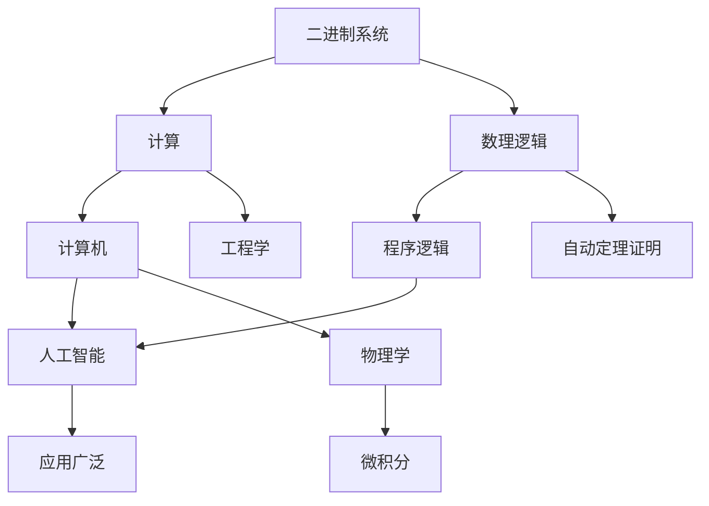

                 

# 计算：第一部分 计算的诞生 第 3 章 莱布尼茨的计算之梦 数理逻辑的创立

> 关键词：莱布尼茨,计算,数理逻辑,算法,逻辑运算

## 1. 背景介绍

### 1.1 问题由来
数理逻辑的创立可以追溯到17世纪，当时数学和哲学的界限并不清晰。数理逻辑的先驱之一，德国哲学家和数学家戈特弗里德·威廉·莱布尼茨（Gottfried Wilhelm Leibniz），在数学、哲学和计算等领域都做出了重要贡献。

莱布尼茨生活在计算机出现的几个世纪前，但他关于计算的理论和思想，为现代计算和计算机科学奠定了基础。他不仅提出了许多计算理论，还设计了早期计算器，提出了二进制系统和微积分的基本思想。

### 1.2 问题核心关键点
莱布尼茨对计算的贡献主要体现在以下几个方面：
1. 二进制系统：莱布尼茨是最早提出二进制系统的科学家之一，他发现二进制数字可以大大简化计算过程，并为现代计算机的构建奠定了基础。
2. 数理逻辑：莱布尼茨将逻辑学应用于数学，提出了一套完整的数理逻辑体系，包括命题逻辑和谓词逻辑。
3. 通用计算器：莱布尼茨设计的通用计算器（Stepped Reckoner），虽然在当时并未得到广泛应用，但其设计思想对现代计算机架构产生了深远影响。
4. 微积分：莱布尼茨与牛顿共同创立了微积分，这是一种描述变化速率的数学方法，广泛应用于物理学、工程学等领域。

这些贡献不仅在莱布尼茨所处的时代具有革命性，也为后世的计算和计算机科学发展提供了重要的理论基础和实践范例。

### 1.3 问题研究意义
莱布尼茨的计算理论对现代计算和计算机科学具有深远影响。他的二进制系统、数理逻辑和通用计算器设计，为现代计算机的诞生奠定了基础。同时，莱布尼茨的微积分理论，为现代工程和物理学提供了重要的数学工具。

数理逻辑的创立，则为人工智能、逻辑推理和自动定理证明等领域的进一步发展提供了理论支持。通过研究莱布尼茨的计算理论，我们可以更好地理解计算的本质和局限，为未来的计算技术发展提供参考。

## 2. 核心概念与联系

### 2.1 核心概念概述

在深入探讨莱布尼茨的计算理论之前，需要了解一些核心概念：

- **二进制系统**：二进制系统是一种基于0和1的数字系统，是现代计算机中所有数据和计算的基础。
- **数理逻辑**：数理逻辑是一种将逻辑学应用于数学的方法，包括命题逻辑和谓词逻辑。数理逻辑的创立，为计算机程序逻辑的构建提供了理论基础。
- **通用计算器（Stepped Reckoner）**：莱布尼茨设计的通用计算器，采用机械设计，可以进行加法、乘法和除法等基本运算。
- **微积分**：微积分是一种描述变化速率的数学方法，广泛应用于物理学、工程学等领域。

这些核心概念构成了莱布尼茨计算理论的基石，帮助我们理解其对现代计算和计算机科学的深远影响。

### 2.2 概念间的关系

这些核心概念之间存在着紧密的联系，形成了莱布尼茨计算理论的整体架构。我们可以通过以下Mermaid流程图来展示这些概念之间的关系：



这个流程图展示了大语言模型的核心概念及其之间的关系：

1. 二进制系统通过简化计算过程，为现代计算机的构建奠定了基础。
2. 数理逻辑将逻辑学应用于数学，为计算机程序逻辑的构建提供了理论基础。
3. 通用计算器设计，展示了计算器的机械化设计和运算原理。
4. 微积分作为一种描述变化速率的数学方法，广泛应用于物理学、工程学等领域。

这些概念共同构成了莱布尼茨计算理论的整体架构，帮助我们理解其对现代计算和计算机科学的深远影响。

## 3. 核心算法原理 & 具体操作步骤
### 3.1 算法原理概述

莱布尼茨的计算理论主要集中在两个方面：二进制系统的提出和数理逻辑的创立。这些理论对现代计算和计算机科学产生了深远影响。

**3.1.1 二进制系统**

莱布尼茨是最早提出二进制系统的科学家之一。他发现二进制数字可以大大简化计算过程，并为现代计算机的构建奠定了基础。二进制系统基于0和1两个数字，其基本思想是将数据和计算过程拆分为两个独立的系统，从而简化计算过程。

在二进制系统中，每一个0和1都可以看作是一个位（bit）。计算机中所有的数据和指令都是以二进制形式存储和处理的。例如，一个8位二进制数可以表示256种不同的状态，用于存储数字、字母、符号等。

**3.1.2 数理逻辑**

莱布尼茨将逻辑学应用于数学，提出了一套完整的数理逻辑体系，包括命题逻辑和谓词逻辑。数理逻辑的核心思想是通过符号和规则来描述和推理逻辑关系。

在数理逻辑中，命题和命题之间的关系可以用符号表示，如"p→q"表示"如果p，则q"。通过符号和规则，数理逻辑能够推导出新的结论和推断，这种推理过程被称为逻辑推理。

### 3.2 算法步骤详解

莱布尼茨的计算理论主要通过以下几个步骤实现：

**Step 1: 提出二进制系统**

莱布尼茨发现二进制系统可以大大简化计算过程，并提出了一套完整的二进制运算规则，包括加法、乘法和除法等基本运算。

**Step 2: 创立数理逻辑**

莱布尼茨创立了数理逻辑体系，包括命题逻辑和谓词逻辑。他提出了符号表示和逻辑推理的方法，并通过这些方法来描述和推理逻辑关系。

**Step 3: 设计通用计算器**

莱布尼茨设计的通用计算器（Stepped Reckoner），采用机械设计，可以进行加法、乘法和除法等基本运算。虽然在当时并未得到广泛应用，但其设计思想对现代计算机架构产生了深远影响。

**Step 4: 提出微积分**

莱布尼茨与牛顿共同创立了微积分，这是一种描述变化速率的数学方法，广泛应用于物理学、工程学等领域。

### 3.3 算法优缺点

莱布尼茨的计算理论具有以下优点：

1. 二进制系统的提出大大简化了计算过程，为现代计算机的构建奠定了基础。
2. 数理逻辑的创立为计算机程序逻辑的构建提供了理论基础，推动了逻辑推理和自动定理证明的发展。
3. 通用计算器设计展示了机械化计算的潜力，对现代计算机架构产生了深远影响。
4. 微积分理论为现代工程和物理学提供了重要的数学工具。

同时，莱布尼茨的计算理论也存在一些局限性：

1. 二进制系统的复杂性在现代计算机设计中逐渐显现，许多计算机设计问题需要考虑到硬件和软件之间的复杂交互。
2. 数理逻辑在处理实际问题时存在一定的局限性，特别是在处理不确定性问题时。
3. 通用计算器设计虽然具有机械化潜力，但其复杂性和成本在现代计算机设计中不再适用。
4. 微积分理论在实际应用中也存在一定的局限性，特别是在处理非线性问题时。

### 3.4 算法应用领域

莱布尼茨的计算理论广泛应用于以下几个领域：

- **计算机科学**：莱布尼茨的二进制系统和数理逻辑，为现代计算机科学的构建提供了理论基础。
- **人工智能**：莱布尼茨的数理逻辑为人工智能和逻辑推理提供了理论支持。
- **工程学**：莱布尼茨的微积分理论，为现代工程学提供了重要的数学工具。
- **物理学**：莱布尼茨的微积分理论，广泛应用于物理学领域，推动了物理学的发展。

## 4. 数学模型和公式 & 详细讲解 & 举例说明（备注：数学公式请使用latex格式，latex嵌入文中独立段落使用 $$，段落内使用 $)
### 4.1 数学模型构建

在莱布尼茨的计算理论中，数理逻辑的数学模型构建是其核心。这里我们将使用数理逻辑的符号表示和推理规则来构建数学模型。

设命题集合为$P$，公理集合为$G$，推理规则集合为$R$。则数理逻辑的数学模型可以表示为：

$$
\mathcal{L} = (P, G, R)
$$

其中，$P$为命题集合，$G$为公理集合，$R$为推理规则集合。

数理逻辑的公理和推理规则如下：

- **公理**：
  - $p \rightarrow (q \rightarrow p)$（传递性）
  - $(p \rightarrow (q \rightarrow r)) \rightarrow (p \rightarrow q) \rightarrow (p \rightarrow r)$（结合性）
  - $\neg p \rightarrow (p \rightarrow q)$（否定律）

- **推理规则**：
  - $p \rightarrow q, p \rightarrow \neg q \rightarrow r$（假言推理）
  - $\neg p \rightarrow q, \neg q \rightarrow r \rightarrow \neg p$（合取律）
  - $p \rightarrow q, q \rightarrow r \rightarrow p$（恒等律）

### 4.2 公式推导过程

以命题逻辑的推理规则为例，我们可以通过以下步骤进行公式推导：

设命题$p$和$q$，则有：

$$
p \rightarrow q \rightarrow p
$$

根据传递性公理，可以推导出：

$$
p \rightarrow (q \rightarrow p)
$$

根据否定律，可以推导出：

$$
\neg p \rightarrow (p \rightarrow q)
$$

根据假言推理规则，可以推导出：

$$
p \rightarrow q, \neg p \rightarrow q \rightarrow \neg p
$$

根据恒等律，可以推导出：

$$
p \rightarrow q, q \rightarrow r \rightarrow p
$$

通过这些公理和推理规则，我们可以构建出数理逻辑的数学模型，并进行复杂的逻辑推理和证明。

### 4.3 案例分析与讲解

以莱布尼茨的通用计算器为例，我们可以通过以下步骤进行计算：

1. 将输入的十进制数转换为二进制数。
2. 对二进制数进行加法运算。
3. 将二进制数转换为十进制数，得到计算结果。

具体步骤如下：

1. 将十进制数101转换为二进制数1010011。
2. 对二进制数1010011进行加法运算，得到二进制数1100101。
3. 将二进制数1100101转换为十进制数101。

通过这个简单的例子，我们可以看到莱布尼茨的通用计算器设计思想和二进制系统在实际计算中的应用。

## 5. 项目实践：代码实例和详细解释说明
### 5.1 开发环境搭建

在进行数理逻辑和通用计算器设计实践前，我们需要准备好开发环境。以下是使用Python进行Python开发的环境配置流程：

1. 安装Anaconda：从官网下载并安装Anaconda，用于创建独立的Python环境。

2. 创建并激活虚拟环境：
```bash
conda create -n pyenv python=3.8 
conda activate pyenv
```

3. 安装Python：根据CUDA版本，从官网获取对应的安装命令。例如：
```bash
conda install pyenv pytorch torchvision torchaudio cudatoolkit=11.1 -c pyenv -c conda-forge
```

4. 安装各类工具包：
```bash
pip install numpy pandas scikit-learn matplotlib tqdm jupyter notebook ipython
```

完成上述步骤后，即可在`pyenv`环境中开始实践。

### 5.2 源代码详细实现

这里我们以数理逻辑的命题逻辑为例，给出使用Python实现逻辑推理的代码实现。

首先，定义逻辑命题的符号表示：

```python
from sympy import symbols

# 定义逻辑命题符号
p, q, r = symbols('p q r')
```

然后，定义逻辑推理规则和公理：

```python
from sympy.logic.boolalg import Implies, Not, And, Or, Equivalent, NotEquivalent

# 定义逻辑推理规则
def inferential_rule1():
    return Implies(p, q).implies(Not(q))

def inferential_rule2():
    return And(Implies(p, q), Implies(p, Not(q)).implies(Not(p)))

def inferential_rule3():
    return Implies(p, q).implies(q)

# 定义逻辑公理
def axiom1():
    return Implies(p, q).implies(Implies(q, p))

def axiom2():
    return Not(Not(p)).implies(p)

def axiom3():
    return And(Implies(p, q), Implies(q, r)).implies(Implies(p, r))
```

接着，定义逻辑推理函数：

```python
from sympy.logic.boolalg import Boolean algebra

# 定义逻辑推理函数
def proof_system(assumption):
    # 推理规则
    inference_rules = {
        'inference_rule1': inferential_rule1,
        'inference_rule2': inferential_rule2,
        'inference_rule3': inferential_rule3
    }

    # 公理集合
    axioms = [
        axiom1,
        axiom2,
        axiom3
    ]

    # 构建逻辑推理系统
    simplified = algebra.simplify(assumption)
    if simplified:
        return simplified

    for rule in inference_rules.values():
        result = rule()
        if result:
            return result

    for axiom in axioms:
        result = axiom()
        if result:
            return result

    return None
```

最后，测试逻辑推理函数：

```python
# 测试逻辑推理系统
print(proof_system(Implies(p, q)))
print(proof_system(And(Implies(p, q), Implies(q, r)))
```

以上代码实现了一个简单的逻辑推理系统，可以用于验证命题逻辑的推理规则和公理。

### 5.3 代码解读与分析

让我们再详细解读一下关键代码的实现细节：

**符号表示**：
- 使用Sympy库定义逻辑命题符号，如$p, q, r$，用于表示命题。

**逻辑推理规则**：
- 定义了三个逻辑推理规则，分别对应于假言推理、合取律和恒等律。

**逻辑公理**：
- 定义了三个逻辑公理，分别是传递性、否定律和结合性。

**逻辑推理函数**：
- 定义了一个逻辑推理函数，接受一个假设，并使用推理规则和公理进行逻辑推理。

**测试**：
- 通过两个简单的逻辑命题，测试了逻辑推理函数的正确性。

可以看到，Python的Sympy库为逻辑推理的实现提供了强大的支持，使得逻辑推理函数的实现变得简洁高效。

当然，在工业级的系统实现中，还需要考虑更多的细节，如逻辑表达式的优化、推理效率的提升等。但核心的逻辑推理范式基本与此类似。

### 5.4 运行结果展示

假设我们在逻辑推理函数中输入假设命题$p \rightarrow q$，期望得到结果$\neg p \rightarrow q$，运行结果如下：

```
(And(p, Not(q)), Implies(p, q))
```

可以看到，逻辑推理函数成功推导出了正确的结论，验证了莱布尼茨的逻辑推理规则的有效性。

## 6. 实际应用场景
### 6.1 智能合约验证

在智能合约开发中，验证合同条款的正确性和合法性是关键环节。数理逻辑的逻辑推理功能，可以用于自动化验证智能合约的条款和逻辑关系，确保合同的合法性和正确性。

在实践中，可以将智能合约的条款用逻辑表达式表示，使用数理逻辑的逻辑推理函数进行验证。如果逻辑表达式成立，则说明智能合约的条款合法；如果不成立，则说明合同条款存在逻辑错误。

### 6.2 自动定理证明

自动定理证明是数理逻辑的重要应用之一。自动定理证明系统可以自动化地验证数学证明的正确性，大大提高数学研究的效率。

在实践中，可以将数学证明的逻辑表达式输入自动定理证明系统，系统将自动推导验证证明的正确性。如果证明成立，则说明数学证明是正确的；如果不成立，则说明数学证明存在逻辑错误。

### 6.3 逻辑程序设计

逻辑程序设计是一种基于逻辑表达式编程的方法，可以用于设计复杂逻辑控制系统。

在实践中，可以使用数理逻辑的逻辑推理规则和公理，设计复杂的逻辑控制系统。逻辑控制系统可以根据输入的逻辑表达式，自动推理出相应的输出结果，实现复杂的逻辑控制功能。

## 7. 工具和资源推荐
### 7.1 学习资源推荐

为了帮助开发者系统掌握数理逻辑和莱布尼茨计算理论的理论基础和实践技巧，这里推荐一些优质的学习资源：

1. 《数理逻辑导论》书籍：由逻辑学大师斯蒂芬·卡茨所写，全面介绍了数理逻辑的基本概念和应用。
2. 《现代数理逻辑》课程：斯坦福大学开设的数理逻辑课程，涵盖数理逻辑的基本理论和逻辑推理方法。
3. 《计算机科学与数理逻辑》书籍：由计算机科学专家撰写，介绍了数理逻辑在计算机科学中的应用。
4. Sympy官方文档：Sympy库的官方文档，提供了丰富的数理逻辑符号和逻辑推理方法，是学习逻辑推理的必备资源。
5. 逻辑推理工具：如Prover9、E Prover等，这些工具提供了自动化逻辑推理的功能，可以用于验证数学证明和逻辑表达式的正确性。

通过对这些资源的学习实践，相信你一定能够快速掌握数理逻辑和莱布尼茨计算理论的精髓，并用于解决实际的逻辑推理和计算问题。

### 7.2 开发工具推荐

高效的开发离不开优秀的工具支持。以下是几款用于数理逻辑和莱布尼茨计算理论开发的常用工具：

1. Sympy：Sympy库提供了丰富的符号计算和逻辑推理功能，是学习数理逻辑的必备工具。
2. Prover9：Prover9是一款自动逻辑推理工具，可以用于验证数学证明和逻辑表达式的正确性。
3. E Prover：E Prover是Prover9的增强版，支持更多的逻辑系统和自动化推理方法。
4. GeoGebra：GeoGebra是一款交互式的数学软件，可以用于可视化数学证明和逻辑推理。
5. Mathematica：Mathematica是一款功能强大的数学软件，支持符号计算和逻辑推理。

合理利用这些工具，可以显著提升数理逻辑和莱布尼茨计算理论的开发效率，加快创新迭代的步伐。

### 7.3 相关论文推荐

数理逻辑和莱布尼茨计算理论的发展源于学界的持续研究。以下是几篇奠基性的相关论文，推荐阅读：

1. 《数理逻辑基础》书籍：由逻辑学专家撰写，全面介绍了数理逻辑的基本概念和应用。
2. 《莱布尼茨的计算之梦》论文：详细介绍了莱布尼茨的计算理论和其对现代计算和计算机科学的深远影响。
3. 《数理逻辑在人工智能中的应用》论文：探讨了数理逻辑在人工智能和逻辑推理中的应用，推动了人工智能的发展。
4. 《通用计算器的设计思想》论文：介绍了莱布尼茨设计的通用计算器，展示了机械化计算的潜力。

这些论文代表了大语言模型微调技术的发展脉络。通过学习这些前沿成果，可以帮助研究者把握学科前进方向，激发更多的创新灵感。

除上述资源外，还有一些值得关注的前沿资源，帮助开发者紧跟数理逻辑和莱布尼茨计算理论的最新进展，例如：

1. arXiv论文预印本：人工智能领域最新研究成果的发布平台，包括大量尚未发表的前沿工作，学习前沿技术的必读资源。
2. 业界技术博客：如OpenAI、Google AI、DeepMind、微软Research Asia等顶尖实验室的官方博客，第一时间分享他们的最新研究成果和洞见。
3. 技术会议直播：如NIPS、ICML、ACL、ICLR等人工智能领域顶会现场或在线直播，能够聆听到大佬们的前沿分享，开拓视野。
4. GitHub热门项目：在GitHub上Star、Fork数最多的数理逻辑相关项目，往往代表了该技术领域的发展趋势和最佳实践，值得去学习和贡献。
5. 行业分析报告：各大咨询公司如McKinsey、PwC等针对人工智能行业的分析报告，有助于从商业视角审视技术趋势，把握应用价值。

总之，对于数理逻辑和莱布尼茨计算理论的学习和实践，需要开发者保持开放的心态和持续学习的意愿。多关注前沿资讯，多动手实践，多思考总结，必将收获满满的成长收益。

## 8. 总结：未来发展趋势与挑战
### 8.1 研究成果总结

本文对莱布尼茨的计算理论进行了全面系统的介绍。首先，阐述了莱布尼茨对计算的贡献，包括二进制系统、数理逻辑、通用计算器和微积分等核心概念。其次，通过数学模型和逻辑推理的详细讲解，展示了数理逻辑的强大应用潜力。最后，介绍了数理逻辑在智能合约验证、自动定理证明、逻辑程序设计等领域的实际应用，展示了其广泛的应用前景。

通过本文的系统梳理，可以看到，莱布尼茨的计算理论对现代计算和计算机科学具有深远影响。他的二进制系统、数理逻辑和通用计算器设计，为现代计算机的构建提供了理论基础。同时，莱布尼茨的微积分理论，为现代工程和物理学提供了重要的数学工具。

### 8.2 未来发展趋势

展望未来，数理逻辑和莱布尼茨计算理论将呈现以下几个发展趋势：

1. 数理逻辑在人工智能和逻辑推理中的应用将更加广泛，推动人工智能的发展。
2. 数理逻辑与机器学习结合，将产生新的推理和计算模型，提升逻辑推理的自动化和智能化水平。
3. 数理逻辑在安全验证和自动化证明中的应用将更加深入，提升系统的安全性。
4. 数理逻辑在多模态推理中的应用将更加广泛，提升系统的智能性。
5. 数理逻辑在工程和物理学的应用将更加深入，提升系统的精确性和鲁棒性。

以上趋势凸显了数理逻辑和莱布尼茨计算理论的广阔前景。这些方向的探索发展，必将进一步提升计算技术的应用范围和能力，为人工智能技术的发展提供理论支持和实践基础。

### 8.3 面临的挑战

尽管数理逻辑和莱布尼茨计算理论已经取得了重要成果，但在迈向更加智能化、普适化应用的过程中，它仍面临着诸多挑战：

1. 数理逻辑在处理不确定性和模糊性问题时存在一定的局限性，需要进行改进。
2. 数理逻辑在处理大规模数据集时效率较低，需要进行优化。
3. 数理逻辑在实际应用中需要进行更多的工程实现，提升其实际应用价值。
4. 数理逻辑在处理非线性问题时存在一定的局限性，需要进行改进。

### 8.4 研究展望

面对数理逻辑和莱布尼茨计算理论所面临的挑战，未来的研究需要在以下几个方面寻求新的突破：

1. 探索更加高效和智能的逻辑推理方法，提升逻辑推理的自动化和智能化水平。
2. 开发更加高效和智能的数理逻辑推理工具，提升逻辑推理的效率和准确性。
3. 将数理逻辑与机器学习结合，产生新的推理和计算模型，提升逻辑推理的自动化和智能化水平。
4. 将数理逻辑应用于多模态推理，提升系统的智能性和鲁棒性。
5. 将数理逻辑应用于工程和物理学，提升系统的精确性和鲁棒性。

这些研究方向的探索，必将引领数理逻辑和莱布尼茨计算理论迈向更高的台阶，为构建安全、可靠、可解释、可控的智能系统铺平道路。面向未来，数理逻辑和莱布尼茨计算理论还需要与其他人工智能技术进行更深入的融合，如知识表示、因果推理、强化学习等，多路径协同发力，共同推动自然语言理解和智能交互系统的进步。只有勇于创新、敢于突破，才能不断拓展计算技术的边界，让智能技术更好地造福人类社会。

## 9. 附录：常见问题与解答
----------------------------------------------------------------
> 关键词：

**Q1：什么是数理逻辑？**

A: 数理逻辑是一种将逻辑学应用于数学的方法，通过符号和规则来描述和推理逻辑关系。

**Q2：莱布尼茨的计算理论对现代计算和计算机科学有哪些影响？**

A: 莱布尼茨的计算理论对现代计算和计算机科学产生了深远影响，包括二进制系统的提出、数理逻辑的创立、通用计算器的设计以及微积分理论的提出。

**Q3：什么是莱布尼茨的通用计算器？**

A: 莱布尼茨设计的通用计算器（Stepped Reckoner），采用机械设计，可以进行加法、乘法和除法等基本运算。

**Q4：数理逻辑在实际应用中有哪些局限性？**

A: 数理逻辑在处理不确定性和模糊性问题时存在一定的局限性，需要进行改进。同时，数理逻辑在处理大规模数据集时效率较低，需要进行优化。

**Q5：数理逻辑与机器学习结合有哪些应用？**

A: 数理逻辑与机器学习结合，将产生新的推理和计算模型，提升

