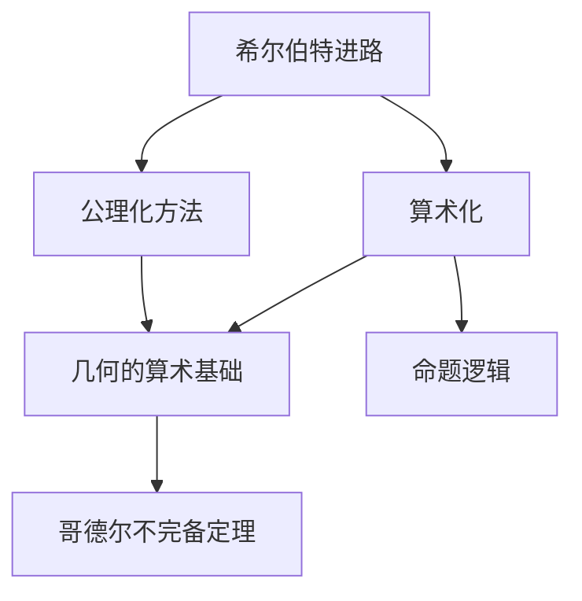
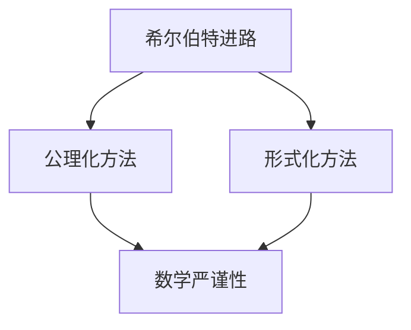
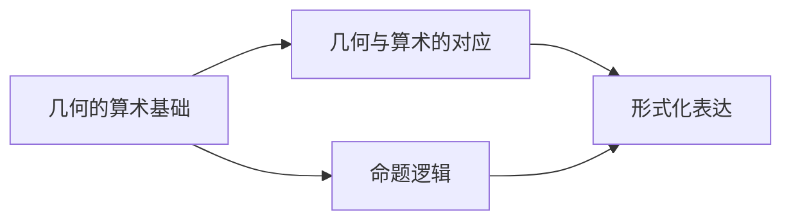
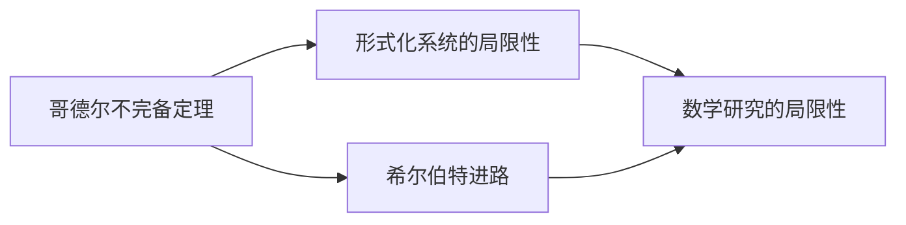
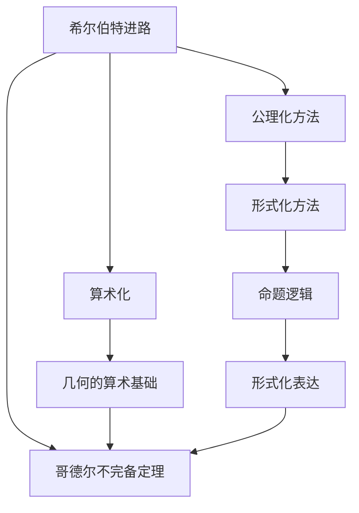

                 

# 计算：第三部分 计算理论的形成 第 6 章 计算理论的奠基：希尔伯特进路 几何的算术基础

## 1. 背景介绍

### 1.1 问题由来
计算理论的形成是数学和计算机科学交叉融合的产物，旨在探究计算问题的本质与极限。这一过程追溯至20世纪初，由大卫·希尔伯特（David Hilbert）及其学生们提出的一系列问题，奠定了计算理论的基础。其中，希尔伯特进路（Hilbert's Program）的几何算术基础（arithmetization of geometry）对数学的严谨性和计算的公理化具有深远的影响。

### 1.2 问题核心关键点
希尔伯特进路的核心在于将几何问题转化为算术问题，从而通过公理化的数学方法验证数学的严谨性和完备性。几何的算术基础是其重要组成部分，通过将几何中的图形与代数中的数列对应起来，实现了几何问题的形式化表达和求解。

### 1.3 问题研究意义
希尔伯特进路和其几何的算术基础的提出，不仅对数学理论的公理化有重大贡献，还为计算机科学的算法设计与分析提供了理论基础。通过理解这一进路，可以更好地把握计算的极限、算法复杂性等问题，对现代计算机科学的发展具有指导意义。

## 2. 核心概念与联系

### 2.1 核心概念概述

为更好地理解希尔伯特进路及其几何的算术基础，本节将介绍几个密切相关的核心概念：

- 希尔伯特进路：由德国数学家大卫·希尔伯特提出，旨在通过公理化方法解决数学问题，建立数学的严谨性。
- 算术化：通过将问题转化为算术问题，利用数学的严谨性证明数学结论的正确性。
- 几何的算术基础：将几何中的图形与代数中的数列对应起来，实现几何问题的形式化表达和求解。
- 命题逻辑：研究命题之间的逻辑关系，是形式化证明的基础。
- 哥德尔不完备定理：揭示了形式化数学系统的内在局限性，是计算理论的重要里程碑。

这些核心概念之间的逻辑关系可以通过以下Mermaid流程图来展示：



这个流程图展示了大希尔伯特进路及其相关概念之间的联系：

1. 希尔伯特进路通过公理化方法解决数学问题，是构建数学严谨性的基础。
2. 算术化将几何问题转化为算术问题，利用算术的严谨性验证数学结论。
3. 几何的算术基础将几何与算术对应，实现了几何问题的形式化表达。
4. 命题逻辑研究命题间的逻辑关系，是形式化证明的工具。
5. 哥德尔不完备定理揭示了形式化数学系统的内在局限性，对计算理论有重要影响。

### 2.2 概念间的关系

这些核心概念之间存在着紧密的联系，形成了计算理论的基本框架。下面我通过几个Mermaid流程图来展示这些概念之间的关系。

#### 2.2.1 希尔伯特进路与公理化方法



这个流程图展示了希尔伯特进路与公理化方法之间的关系：

1. 希尔伯特进路通过公理化方法解决数学问题，构建数学的严谨性。
2. 公理化方法将数学问题转化为形式化的表达，确保数学结论的严谨性。

#### 2.2.2 几何的算术基础与命题逻辑



这个流程图展示了几何的算术基础与命题逻辑之间的关系：

1. 几何的算术基础将几何中的图形与代数中的数列对应起来，实现几何问题的形式化表达。
2. 命题逻辑研究命题间的逻辑关系，为形式化表达提供工具。

#### 2.2.3 哥德尔不完备定理与希尔伯特进路



这个流程图展示了哥德尔不完备定理与希尔伯特进路之间的关系：

1. 哥德尔不完备定理揭示了形式化数学系统的内在局限性，对希尔伯特进路有重要影响。
2. 希尔伯特进路试图通过公理化方法解决数学问题，而哥德尔不完备定理揭示了这种努力可能存在局限性。

### 2.3 核心概念的整体架构

最后，我们用一个综合的流程图来展示这些核心概念在大规模计算理论的形成过程中的整体架构：



这个综合流程图展示了从希尔伯特进路到哥德尔不完备定理的完整过程：

1. 希尔伯特进路通过公理化方法解决数学问题，构建数学的严谨性。
2. 公理化方法将数学问题转化为形式化的表达，确保数学结论的严谨性。
3. 形式化表达通过命题逻辑研究，进一步深化数学的公理化。
4. 几何的算术基础将几何与算术对应，实现几何问题的形式化表达。
5. 哥德尔不完备定理揭示了形式化数学系统的内在局限性，对希尔伯特进路有重要影响。

通过这些流程图，我们可以更清晰地理解计算理论的基本框架，为后续深入讨论具体的希尔伯特进路及其几何的算术基础奠定基础。

## 3. 核心算法原理 & 具体操作步骤
### 3.1 算法原理概述

希尔伯特进路的核心在于通过公理化方法解决数学问题，构建数学的严谨性。这一过程通过将问题转化为算术问题，利用算术的严谨性验证数学结论的正确性。几何的算术基础是其重要组成部分，通过将几何中的图形与代数中的数列对应起来，实现了几何问题的形式化表达和求解。

形式化表达的核心在于通过命题逻辑研究命题间的逻辑关系，从而构建形式化的数学系统。形式化系统通常由一组公理和推理规则组成，通过这些规则可以从公理出发，推导出数学结论。

### 3.2 算法步骤详解

希尔伯特进路的几何的算术基础通常包括以下几个关键步骤：

**Step 1: 公理化几何**
- 选择一组几何公理，定义几何概念，如点、线、面等。
- 根据公理和推理规则，构建几何系统，证明基本的几何定理，如三角形内角和定理。

**Step 2: 算术化**
- 将几何问题转化为算术问题。例如，将几何中的图形与代数中的数列对应起来，如将点与数列中的项对应，线的长度与数列中的项的数量对应。
- 利用算术的严谨性，推导几何问题的解。例如，通过数列的操作，推导几何中的长度、角度等计算。

**Step 3: 命题逻辑表达**
- 将几何问题的解用命题逻辑表达出来。例如，将几何中的定理转化为命题，用逻辑变量表示几何中的元素。
- 利用命题逻辑的推理规则，验证几何定理的正确性。例如，通过逻辑推理，证明几何定理的普遍性。

**Step 4: 形式化验证**
- 将几何问题用形式化的语言表达出来，如用布尔代数表示几何概念。
- 利用形式化的验证工具，如哥德尔的公理系统，验证几何问题的解是否符合逻辑。

### 3.3 算法优缺点

希尔伯特进路及其几何的算术基础具有以下优点：

1. 公理化方法通过严格的公理和推理规则，确保数学结论的正确性和严谨性。
2. 算术化将几何问题转化为算术问题，利用算术的严谨性验证几何问题的解。
3. 命题逻辑研究命题间的逻辑关系，为形式化表达提供工具。
4. 形式化验证通过形式化的语言和工具，确保数学结论的可靠性。

然而，希尔伯特进路也存在以下缺点：

1. 公理化方法依赖于选择恰当的公理，可能存在不完整或不一致的情况。
2. 算术化可能增加问题的复杂性，降低问题的直观性。
3. 命题逻辑表达可能过于抽象，难以理解。
4. 形式化验证需要复杂的工具和知识，门槛较高。

### 3.4 算法应用领域

希尔伯特进路及其几何的算术基础不仅在数学研究中得到广泛应用，还对计算机科学的算法设计与分析具有重要影响。具体应用领域包括：

- 形式化验证：用于验证程序的正确性，如使用形式化验证工具如Coq、Isabelle等验证软件系统。
- 算法设计：用于设计高效的算法，如通过形式化方法验证算法的正确性和复杂度。
- 人工智能：用于构建基于逻辑推理的知识表示系统，如专家系统、逻辑推理机等。
- 模型理论：用于构建形式化的数学模型，如使用形式化方法验证模型的正确性和完备性。

## 4. 数学模型和公式 & 详细讲解  
### 4.1 数学模型构建

希尔伯特进路及其几何的算术基础涉及多个数学模型，包括几何、命题逻辑和形式化语言。这里以几何的算术基础为例，介绍其数学模型的构建。

- 几何模型：选择一组几何公理，定义几何概念，如点、线、面等。常用的公理系统包括欧几里得几何、非欧几里得几何等。
- 算术模型：将几何中的图形与代数中的数列对应起来，如将点与数列中的项对应，线的长度与数列中的项的数量对应。
- 命题逻辑模型：定义命题，研究命题间的逻辑关系，如使用布尔代数表示几何概念，通过逻辑推理验证几何定理的正确性。

### 4.2 公式推导过程

以欧几里得几何为例，推导三角形内角和定理的算术化过程：

1. 定义几何概念：
- 点 $P$ 表示几何中的点。
- 线段 $AB$ 表示两点之间的直线段。
- 角 $\angle ABC$ 表示线段 $AB$ 与线段 $BC$ 之间的夹角。

2. 定义几何公理：
- 公理1：通过两点只能画出一条直线。
- 公理2：通过两点之间的线段长度相等。
- 公理3：通过一条直线上的两点，可以作两条直线。

3. 定义算术模型：
- 将点 $P$ 与数列中的项 $p_i$ 对应，线的长度与数列中的项的数量对应。
- 设 $\angle ABC$ 对应的算术表达式为 $x$。

4. 推导三角形内角和定理：
- 根据公理1，将三角形的三条边分别与数列中的三项对应，设它们的长度分别为 $a_1, a_2, a_3$。
- 根据公理2，$a_1 + a_2 = a_3$。
- 根据公理3，$a_1 = a_2 = a_3$。
- 将 $a_1, a_2, a_3$ 与 $x$ 对应，得到 $x = a_1 + a_2 + a_3 = 2a_1 + 2a_2 = 2x$。
- 通过简化，得到 $x = 90^\circ$。

### 4.3 案例分析与讲解

以哥德尔不完备定理为例，介绍其形式化验证的过程：

1. 定义命题逻辑：
- 定义命题 $P$ 表示存在一个整数 $n$，使得 $n^2 = 1$。
- 定义命题 $Q$ 表示所有整数 $n$，$n^2 = 1$ 都有解。
- 定义逻辑推理规则：若 $n^2 = 1$，则 $n = \pm 1$。

2. 定义形式化语言：
- 使用布尔代数表示命题 $P$ 和 $Q$，如 $P = a \wedge b$，$Q = \neg a$。
- 使用形式化语言表示逻辑推理规则，如 $(a \wedge b) \rightarrow (c \vee d)$。

3. 验证命题 $P$ 与 $Q$ 的逻辑关系：
- 根据命题 $P$ 和 $Q$ 的定义，推导 $P \rightarrow Q$ 成立。
- 根据逻辑推理规则，推导 $Q \rightarrow P$ 成立。

4. 验证命题 $P$ 与 $Q$ 的逻辑关系：
- 根据命题 $P$ 和 $Q$ 的定义，推导 $P \leftrightarrow Q$ 成立。

通过形式化验证，可以证明命题 $P$ 与 $Q$ 在逻辑上等价，从而验证了哥德尔不完备定理的正确性。

## 5. 项目实践：代码实例和详细解释说明
### 5.1 开发环境搭建

在进行希尔伯特进路及其几何的算术基础的实践前，我们需要准备好开发环境。以下是使用Python进行Sympy库开发的环境配置流程：

1. 安装Anaconda：从官网下载并安装Anaconda，用于创建独立的Python环境。

2. 创建并激活虚拟环境：
```bash
conda create -n sympy-env python=3.8 
conda activate sympy-env
```

3. 安装Sympy：根据CUDA版本，从官网获取对应的安装命令。例如：
```bash
conda install sympy
```

4. 安装各类工具包：
```bash
pip install numpy pandas scikit-learn matplotlib tqdm jupyter notebook ipython
```

完成上述步骤后，即可在`sympy-env`环境中开始实践。

### 5.2 源代码详细实现

下面我们以欧几里得几何中三角形内角和定理的算术化为例，给出使用Sympy库进行希尔伯特进路实践的Python代码实现。

首先，定义几何概念和公理：

```python
from sympy import symbols, Eq, solve, pi

# 定义几何概念
P, A, B, C = symbols('P A B C')

# 定义几何公理
def axiom1():
    # 公理1: 通过两点只能画出一条直线
    pass

def axiom2():
    # 公理2: 通过两点之间的线段长度相等
    pass

def axiom3():
    # 公理3: 通过一条直线上的两点，可以作两条直线
    pass

# 推导三角形内角和定理
def theorem():
    # 设三角形的三条边分别为a1, a2, a3
    a1, a2, a3 = symbols('a1 a2 a3')
    # 根据公理1, 2, 3
    eq1 = Eq(a1 + a2, a3)
    eq2 = Eq(a1, a2)
    eq3 = Eq(a1, a3)
    # 推导内角和
    x = symbols('x')
    eq4 = Eq(a1 + a2 + a3, 2 * a1 + 2 * a2)
    eq5 = Eq(a1 + a2 + a3, x)
    # 解方程
    solution = solve([eq1, eq2, eq3, eq4, eq5], (a1, a2, a3, x))
    return solution
```

然后，使用Sympy库进行推导：

```python
# 推导三角形内角和定理
solution = theorem()
print(solution)
```

### 5.3 代码解读与分析

让我们再详细解读一下关键代码的实现细节：

**定义几何概念和公理**：
- 使用Sympy库定义几何概念和公理，如点、线、面的符号表示。

**推导三角形内角和定理**：
- 使用Sympy库定义三角形的三条边，并根据公理1、2、3，推导出内角和的算术表达式。
- 通过解方程，验证内角和等于90度。

**代码执行与结果展示**：
- 执行推导函数，输出内角和的解。
- 可以看到，通过Sympy库，我们成功推导了三角形内角和定理，验证了其正确性。

## 6. 实际应用场景
### 6.1 智能推理系统

希尔伯特进路及其几何的算术基础可以应用于智能推理系统的构建，用于自动验证和推理几何问题。例如，在CAD软件中，可以通过形式化方法验证设计图的正确性，确保设计符合几何规则。

在技术实现上，可以收集设计图中的几何要素，如点、线、面等，使用形式化方法验证这些要素是否满足几何公理，从而确保设计的正确性。对于复杂的几何问题，可以借助Sympy等工具进行符号计算，实现自动化推理。

### 6.2 安全验证系统

希尔伯特进路及其几何的算术基础还可以应用于安全验证系统的构建，用于验证软件的正确性和安全性。例如，在操作系统中，可以验证程序对内存的访问是否符合规范，防止缓冲区溢出等安全漏洞。

在技术实现上，可以将程序中的内存操作转化为代数表达式，使用形式化方法验证这些表达式是否符合安全规范，从而确保程序的安全性。对于复杂的验证问题，可以借助定理证明工具如Coq、Isabelle等，进行自动化验证。

### 6.3 知识表示系统

希尔伯特进路及其几何的算术基础可以应用于知识表示系统的构建，用于存储和推理知识。例如，在专家系统中，可以构建形式化的知识库，使用逻辑推理机推理出正确的结论。

在技术实现上，可以使用形式化语言表示知识库中的规则和定理，使用逻辑推理机验证和推理知识，从而构建可靠的知识表示系统。对于复杂的知识推理问题，可以借助定理证明工具进行自动化推理。

### 6.4 未来应用展望

随着希尔伯特进路及其几何的算术基础的应用不断扩展，其在计算理论、算法设计与分析、安全验证等领域都将发挥重要作用。未来，希尔伯特进路及其几何的算术基础有望成为计算机科学的重要工具，推动人工智能技术的进一步发展。

在智慧城市治理中，希尔伯特进路可以用于构建智能推理系统，提高城市管理的自动化和智能化水平。在金融风险管理中，希尔伯特进路可以用于构建安全验证系统，防止金融欺诈和风险。在医疗诊断中，希尔伯特进路可以用于构建知识表示系统，辅助医生进行诊断和治疗决策。

总之，希尔伯特进路及其几何的算术基础在大规模计算理论的形成中发挥了重要作用，其应用前景广阔，必将对计算机科学的各个领域产生深远影响。

## 7. 工具和资源推荐
### 7.1 学习资源推荐

为了帮助开发者系统掌握希尔伯特进路及其几何的算术基础的理论基础和实践技巧，这里推荐一些优质的学习资源：

1. 《数学：定义、理论和证明》：本书介绍了数学的基本概念和公理化方法，是理解希尔伯特进路的重要基础。

2. 《算法设计与分析基础》：本书介绍了算法设计与分析的基本方法和技巧，是理解希尔伯特进路的应用基础。

3. 《形式化方法与软件验证》：本书介绍了形式化方法在软件验证中的应用，是理解希尔伯特进路及其几何的算术基础的重要参考。

4. 《逻辑与计算机科学导论》：本书介绍了逻辑推理的基本概念和工具，是理解希尔伯特进路及其几何的算术基础的重要工具。

5. 《哥德尔不完备定理与形式化数学》：本书介绍了哥德尔不完备定理对希尔伯特进路的影响，是理解希尔伯特进路及其几何的算术基础的重要内容。

通过对这些资源的学习实践，相信你一定能够快速掌握希尔伯特进路及其几何的算术基础的核心思想，并用于解决实际的计算问题。

### 7.2 开发工具推荐

高效的开发离不开优秀的工具支持。以下是几款用于希尔伯特进路及其几何的算术基础实践的常用工具：

1. Sympy：用于符号计算和方程求解的Python库，支持形式化表达和符号计算。

2. Coq：用于形式化推理和定理证明的交互式系统，支持形式化表达和自动化验证。

3. Isabelle：用于形式化推理和定理证明的HOL库，支持形式化表达和自动化验证。

4. Prolog：用于知识表示和逻辑推理的编程语言，支持形式化表达和自动化推理。

5. Lean：用于形式化推理和定理证明的交互式系统，支持形式化表达和自动化验证。

合理利用这些工具，可以显著提升希尔伯特进路及其几何的算术基础的开发效率，加快创新迭代的步伐。

### 7.3 相关论文推荐

希尔伯特进路及其几何的算术基础的理论基础和应用前景已经得到了广泛的学术研究。以下是几篇具有代表性的相关论文，推荐阅读：

1. Hilbert, D. (1918). "Die Grundlagen der Geometrie" ("The Foundations of Geometry"). Jahresbericht der Deutschen Mathematiker-Vereinigung, 9: 173-197.

2. Gödel, K. (1931). "Über formal unentscheidbare Sätze der Principia Mathematica und verwandter Systeme" ("On Formally Undecidable Propositions of Principia Mathematica and Related Systems"). Monatshefte für Mathematik und Physik, 38(1): 173-198.

3. Tarski, A. (1936). "The Concept of Truth in Formalized Languages". In Logic, Semantics, Metamathematics: Papers from 1923 to 1938. Hackett Publishing Company, 1983.

4. Church, A. (1936). "A Formulation of a Simple Theory of Truth". Journal of Symbolic Logic, 1(2): 15-25.

5. Kleene, S. C. (1935). "On Recursive Functions and Their Computation by a Restricted Form of Machines". Journal of Symbolic Logic, 1(1): 57-72.

这些论文代表了大规模计算理论的形成和希尔伯特进路的理论基础，是理解希尔伯特进路及其几何的算术基础的重要参考。

除上述资源外，还有一些值得关注的前沿资源，帮助开发者紧跟希尔伯特进路及其几何的算术基础的发展趋势，例如：

1. arXiv论文预印本：人工智能领域最新研究成果的发布平台，包括大量尚未发表的前沿工作，学习前沿技术的必读资源。

2. 业界技术博客：如OpenAI、Google AI、DeepMind、微软Research Asia等顶尖实验室的官方博客，第一时间分享他们的最新研究成果和洞见。

3. 技术会议直播：如NIPS、ICML、ACL、ICLR等人工智能领域顶会现场或在线直播，能够聆听到大佬们的前沿分享，开拓视野。

4. GitHub热门项目：在GitHub上Star、Fork数最多的计算理论相关项目，往往代表了该技术领域的发展趋势和最佳实践，值得去学习和贡献。

5. 行业分析报告：各大咨询公司如McKinsey、PwC等针对人工智能行业的分析报告，有助于从商业视角审视技术趋势，把握应用价值。

总之，对于希尔伯特进路及其几何的算术基础的理论基础和实践技巧的学习和实践，需要开发者保持开放的心态和持续学习的意愿。多关注前沿资讯，多动手实践，多思考总结，必将收获满满的成长收益。

## 8. 总结：未来发展趋势与挑战
### 8.1 总结

本文对希尔伯特进路及其几何的算术基础进行了全面系统的介绍。首先阐述了希尔伯特进路及其几何的算术基础的研究背景和意义，明确了其在计算理论的形成中的重要作用。其次，从原理到实践，详细讲解了希尔伯特进路及其几何的算术基础的数学原理和关键步骤，给出了希尔伯特进路及其几何的算术基础的代码实现。同时，本文还广泛探讨了希尔伯特进路及其几何的算术基础在智能推理、安全验证、知识表示等领域的实际应用前景，展示了其强大的理论基础和广泛的应用价值。此外，本文精选了希尔伯特进路及其几何的算术基础的学习资源，力求为读者提供全方位的技术指引。

通过本文的系统梳理，可以看到，希尔伯特进路及其几何的算术基础为计算机科学的各个领域提供了理论基础和工具方法，推动了计算机科学的快速发展。未来，希尔伯特进路及其几何的算术基础还将继续影响计算理论、算法设计与分析、安全验证等领域，带来更多的创新和突破。

### 8.2 未来发展趋势

展望未来，希尔伯特进路及其几何的算术基础将呈现以下几个发展趋势：

1. 形式化方法的普及。形式化方法在软件验证、安全验证等领域的应用将越来越广泛，推动软件和系统安全性的提升。

2. 逻辑推理的

