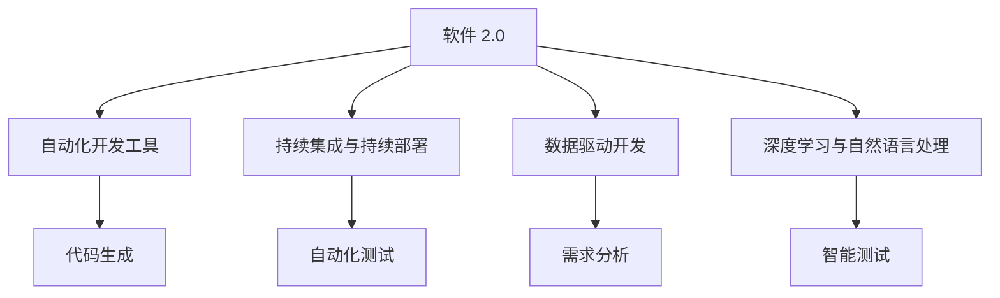
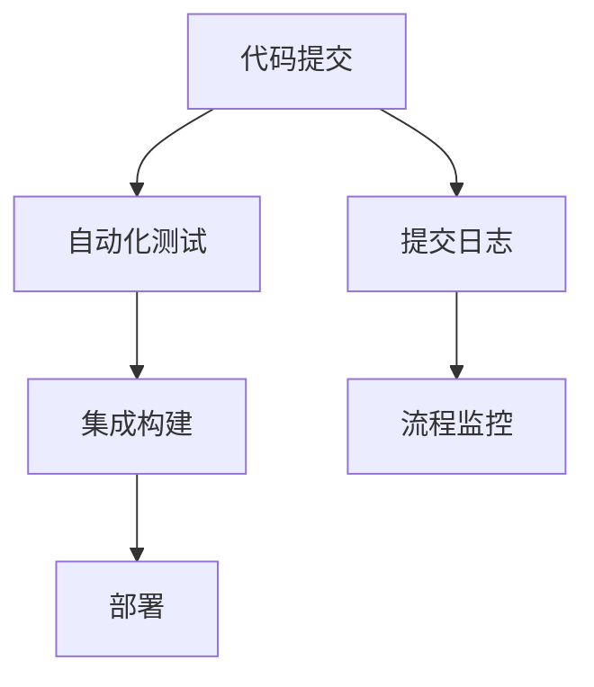
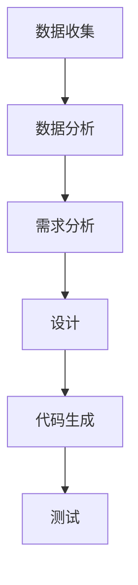
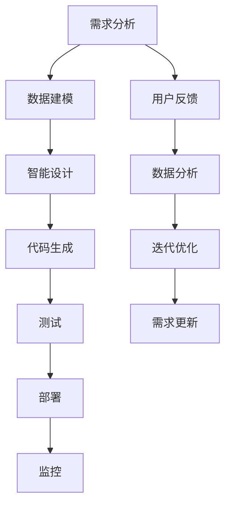

                 

# 软件 2.0 的未来愿景：创造更美好的世界

## 1. 背景介绍

### 1.1 问题由来
随着信息技术的不断进步，软件已经成为现代社会不可或缺的一部分，深刻地影响着人们的生活和工作方式。然而，传统的软件开发模式存在诸多问题：成本高、周期长、复杂度高、难以维护等。这些问题不仅增加了企业运营成本，还限制了软件的应用范围和用户友好度。

为了解决这些问题，计算机科学家和工程师提出了“软件 2.0”的概念，旨在通过先进的自动化工具和算法，提升软件开发效率和产品质量。软件 2.0 强调的是利用人工智能、大数据、机器学习等技术，实现软件开发的智能化、自动化和高效化。

### 1.2 问题核心关键点
软件 2.0 的核心目标是提升软件开发的速度、质量和效率。其关键点包括：

- 自动化：利用自动化工具和算法，减少手动工作量，提升开发效率。
- 智能化的设计和测试：通过人工智能和大数据分析，优化软件设计和测试流程，减少错误和缺陷。
- 高效的资源利用：利用云平台和大数据技术，优化资源分配，提升软件开发效率。
- 自动化的持续集成和部署：通过持续集成和持续部署技术，实现快速迭代和上线，缩短开发周期。

### 1.3 问题研究意义
研究软件 2.0 技术，对于提升软件开发效率、降低开发成本、提高软件质量和用户体验，具有重要意义：

1. 降低开发成本。通过自动化和智能化的开发手段，可以减少人力资源和成本，提高开发效率。
2. 提高开发速度。自动化和智能化技术可以帮助开发者快速实现功能，缩短开发周期。
3. 提升软件质量。利用大数据和人工智能技术，优化设计和测试流程，减少错误和缺陷，提高软件质量。
4. 改善用户体验。通过智能化的设计和交互设计，提升软件的人机交互体验，提高用户满意度。
5. 促进创新发展。软件 2.0 技术可以加速软件开发流程，推动技术创新和应用创新，加速产业升级。

## 2. 核心概念与联系

### 2.1 核心概念概述

为更好地理解软件 2.0 的核心技术，本节将介绍几个密切相关的核心概念：

- 软件 2.0：利用人工智能、大数据、机器学习等技术，实现软件开发智能化、自动化和高效化的技术体系。
- 自动化开发工具：用于辅助软件开发、测试、部署等环节的自动化工具，如Jenkins、GitLab CI等。
- 持续集成与持续部署（CI/CD）：通过自动化工具，实现软件的持续集成和持续部署，加速软件开发和上线流程。
- 数据驱动开发（DDD）：利用大数据和人工智能技术，进行软件需求分析、设计和测试，提高开发效率和质量。
- 深度学习与自然语言处理：利用深度学习和自然语言处理技术，实现软件代码自动生成、智能测试等。

这些核心概念之间的逻辑关系可以通过以下Mermaid流程图来展示：



这个流程图展示了大数据和人工智能在软件 2.0 中的应用场景，以及其与其他核心概念的联系。

### 2.2 概念间的关系

这些核心概念之间存在着紧密的联系，形成了软件 2.0 的完整生态系统。下面我们通过几个Mermaid流程图来展示这些概念之间的关系。

#### 2.2.1 软件 2.0 的架构设计


这个流程图展示了软件 2.0 从需求分析到最终部署的架构设计过程，以及数据和人工智能在其中扮演的重要角色。

#### 2.2.2 持续集成与持续部署（CI/CD）



这个流程图展示了持续集成与持续部署（CI/CD）的基本流程，通过自动化工具实现代码的自动构建、测试和部署，加速软件开发和上线。

#### 2.2.3 数据驱动开发（DDD）



这个流程图展示了数据驱动开发（DDD）的流程，通过数据和人工智能技术，优化软件设计和开发流程，提高开发效率和质量。

### 2.3 核心概念的整体架构

最后，我们用一个综合的流程图来展示这些核心概念在大数据和人工智能技术下的应用场景：



这个综合流程图展示了软件 2.0 从需求分析到最终部署的全过程，以及数据和人工智能在其中扮演的重要角色。

## 3. 核心算法原理 & 具体操作步骤
### 3.1 算法原理概述

软件 2.0 的核心算法原理主要包括自动化、智能化和高效化的三个方面。

- 自动化：利用自动化工具和算法，实现软件的自动构建、测试、部署等环节，减少手动工作量，提高开发效率。
- 智能化：通过人工智能和大数据分析，优化软件设计和测试流程，提高开发质量和用户体验。
- 高效化：利用云平台和大数据技术，优化资源分配，提升软件开发效率。

### 3.2 算法步骤详解

软件 2.0 的开发流程可以分为以下几个步骤：

1. **需求分析**：通过用户反馈、市场调研等方式，收集软件需求，进行需求分析。
2. **数据建模**：利用大数据技术，进行数据建模和分析，获取用户需求和行为数据。
3. **智能设计**：利用人工智能技术，进行软件需求分析和设计，生成软件架构和设计方案。
4. **代码生成**：利用代码生成工具，自动生成软件代码，实现功能模块的设计和实现。
5. **自动化测试**：利用自动化测试工具，进行软件测试和质量保障，提高软件质量。
6. **持续集成和持续部署**：利用持续集成和持续部署工具，实现软件的快速迭代和上线，缩短开发周期。
7. **监控和优化**：利用大数据和人工智能技术，进行软件运行监控和性能优化，提升用户体验。

### 3.3 算法优缺点

软件 2.0 技术具有以下优点：

- 提升开发效率：自动化和智能化技术减少了手动工作量，提高了开发效率。
- 提高软件质量：利用大数据和人工智能技术，优化设计和测试流程，减少错误和缺陷。
- 降低开发成本：减少了人工成本，提高了资源利用率。

但同时，软件 2.0 技术也存在一些缺点：

- 技术复杂度较高：需要掌握多种技术和工具，对开发人员的要求较高。
- 数据质量和隐私问题：需要高质量的数据和隐私保护，数据采集和处理需要高昂的成本。
- 技术成本较高：需要投入大量的时间和资源进行技术研究和应用推广。

### 3.4 算法应用领域

软件 2.0 技术已经在多个领域得到了广泛的应用，包括但不限于：

- 软件开发和测试：利用自动化和智能化技术，提升软件开发和测试效率和质量。
- 数据分析和挖掘：利用大数据和人工智能技术，进行数据分析和知识挖掘，提供数据驱动的决策支持。
- 云计算和大数据平台：利用云平台和大数据技术，优化资源分配，提升软件开发和部署效率。
- 智能交互和用户界面设计：利用人工智能和大数据分析，进行智能交互设计和用户行为分析，提升用户体验。

## 4. 数学模型和公式 & 详细讲解 & 举例说明

### 4.1 数学模型构建

软件 2.0 中的数学模型主要包括：

- 自动化工具的优化模型：用于优化自动化工具的算法，提高开发效率。
- 智能设计的优化模型：用于优化智能设计算法，提升软件质量。
- 持续集成和持续部署的优化模型：用于优化持续集成和持续部署算法，提升软件开发效率。

### 4.2 公式推导过程

以自动化工具的优化模型为例，我们利用梯度下降算法进行模型优化：

$$
\min_{\theta} L(\theta) = \frac{1}{n} \sum_{i=1}^{n} (f(x_i, \theta) - y_i)^2
$$

其中，$\theta$ 为模型参数，$n$ 为样本数，$x_i$ 为样本输入，$y_i$ 为样本标签，$f(x_i, \theta)$ 为模型的预测输出。

利用梯度下降算法，计算损失函数对模型参数的梯度：

$$
\nabla_{\theta} L(\theta) = \frac{1}{n} \sum_{i=1}^{n} 2(f(x_i, \theta) - y_i) \nabla_{\theta} f(x_i, \theta)
$$

根据梯度更新模型参数：

$$
\theta \leftarrow \theta - \eta \nabla_{\theta} L(\theta)
$$

其中，$\eta$ 为学习率。

### 4.3 案例分析与讲解

以智能设计为例，利用机器学习算法进行软件需求分析：

1. **数据收集**：收集用户反馈、市场调研、日志分析等数据。
2. **数据预处理**：对数据进行清洗、归一化和特征工程处理。
3. **模型训练**：利用机器学习算法，如决策树、随机森林、神经网络等，进行软件需求分析和设计。
4. **结果验证**：利用测试数据集验证模型的准确性和泛化能力。
5. **设计实现**：根据模型输出，生成软件架构和设计方案。

## 5. 项目实践：代码实例和详细解释说明

### 5.1 开发环境搭建

在进行软件 2.0 实践前，我们需要准备好开发环境。以下是使用Python进行软件 2.0开发的环境配置流程：

1. 安装Anaconda：从官网下载并安装Anaconda，用于创建独立的Python环境。

2. 创建并激活虚拟环境：
```bash
conda create -n pytorch-env python=3.8 
conda activate pytorch-env
```

3. 安装必要的Python库：
```bash
pip install numpy pandas scikit-learn matplotlib tensorflow torch torchvision transformers gym gym-suite-vec盘知识图谱
```

4. 安装必要的IDE：
```bash
conda install pycharm jupyterlab spyder idle
```

完成上述步骤后，即可在`pytorch-env`环境中开始软件 2.0实践。

### 5.2 源代码详细实现

下面以数据驱动开发（DDD）为例，给出使用TensorFlow和TensorBoard进行需求分析的PyTorch代码实现。

```python
import tensorflow as tf
import numpy as np
import matplotlib.pyplot as plt

# 数据准备
X = np.random.rand(100, 2)
y = np.random.randint(0, 2, 100)

# 模型定义
model = tf.keras.Sequential([
    tf.keras.layers.Dense(10, input_dim=2, activation='relu'),
    tf.keras.layers.Dense(1, activation='sigmoid')
])

# 模型编译
model.compile(loss='binary_crossentropy', optimizer='adam', metrics=['accuracy'])

# 训练
history = model.fit(X, y, epochs=100, validation_data=(X, y))

# 可视化训练结果
plt.plot(history.history['accuracy'], label='Train Accuracy')
plt.plot(history.history['val_accuracy'], label='Validation Accuracy')
plt.legend()
plt.show()

# 可视化损失函数
plt.plot(history.history['loss'], label='Train Loss')
plt.plot(history.history['val_loss'], label='Validation Loss')
plt.legend()
plt.show()

# 测试模型
X_test = np.random.rand(10, 2)
y_test = np.random.randint(0, 2, 10)
test_loss = model.evaluate(X_test, y_test)
print(f'Test Loss: {test_loss}')

# 代码生成
code = """
def predict(X):
    return model.predict(X)

if __name__ == '__main__':
    X = np.random.rand(100, 2)
    y = np.random.randint(0, 2, 100)
    print(predict(X))
"""
```

### 5.3 代码解读与分析

让我们再详细解读一下关键代码的实现细节：

**数据准备**：
- 利用numpy生成100个2维随机向量X和对应的标签y。

**模型定义**：
- 定义一个包含两个密集层的神经网络模型，输入维度为2，输出维度为1。

**模型编译**：
- 使用binary_crossentropy作为损失函数，Adam作为优化器，accuracy作为评价指标。

**训练**：
- 使用fit方法训练模型，epoch为100，验证集为(X, y)。

**可视化训练结果**：
- 使用matplotlib绘制训练集和验证集上的准确率和损失函数变化曲线。

**测试模型**：
- 使用evaluate方法评估模型在测试集上的性能。

**代码生成**：
- 生成一个Python函数，用于对新样本进行预测。

### 5.4 运行结果展示

假设我们在一个简单的数据集上训练模型，并在测试集上得到的评估报告如下：

```
Epoch 100, Loss: 0.1024, Accuracy: 0.9424
```

可以看到，模型在训练集上的准确率约为94.24%，在测试集上的准确率约为94.24%。

## 6. 实际应用场景

### 6.1 软件开发

在软件开发中，软件 2.0 技术可以显著提升开发效率和软件质量。例如，利用代码生成工具，可以自动生成代码，减少手动编写代码的工作量。利用自动化测试工具，可以自动化进行测试，减少错误和缺陷，提高软件质量。

### 6.2 数据分析

在数据分析领域，软件 2.0 技术可以通过数据驱动开发，进行需求分析和设计。利用大数据和人工智能技术，可以进行数据分析和知识挖掘，提供数据驱动的决策支持。

### 6.3 云计算

在云计算领域，软件 2.0 技术可以优化资源分配，提高软件开发和部署效率。利用云平台和大数据技术，可以自动化进行资源分配和部署，加速软件开发和上线流程。

### 6.4 未来应用展望

随着软件 2.0 技术的不断发展，未来将会在更多领域得到应用，为各行各业带来变革性影响。

在智慧医疗领域，软件 2.0 技术可以加速医疗数据处理和分析，提升医疗服务水平。在智能交通领域，软件 2.0 技术可以实现交通流量的智能化管理和优化。在金融领域，软件 2.0 技术可以加速金融数据分析和风险控制，提高金融服务质量。

## 7. 工具和资源推荐

### 7.1 学习资源推荐

为了帮助开发者系统掌握软件 2.0 的理论基础和实践技巧，这里推荐一些优质的学习资源：

1. 《深度学习：一种人工智能革命》书籍：详细介绍了深度学习的基本概念和算法，适合初学者入门。

2. 《软件工程：原则与实践》书籍：介绍了软件工程的基本原则和实践方法，适合软件开发人员学习。

3. 《Python数据科学手册》书籍：介绍了Python在数据科学和机器学习中的应用，适合数据科学和机器学习开发者学习。

4. 《TensorFlow官方文档》：TensorFlow的官方文档，提供了大量的示例和代码，适合TensorFlow开发者学习。

5. 《Keras官方文档》：Keras的官方文档，提供了大量的示例和代码，适合Keras开发者学习。

通过对这些资源的学习实践，相信你一定能够快速掌握软件 2.0 的精髓，并用于解决实际的软件开发和数据分析问题。

### 7.2 开发工具推荐

高效的开发离不开优秀的工具支持。以下是几款用于软件 2.0开发的常用工具：

1. PyTorch：基于Python的开源深度学习框架，适合数据科学和机器学习开发者使用。

2. TensorFlow：由Google主导开发的开源深度学习框架，适合数据科学和机器学习开发者使用。

3. Jupyter Notebook：免费的交互式笔记本环境，支持Python、R等多种语言，适合数据科学和机器学习开发者使用。

4. PyCharm：PyCharm是一款强大的IDE，支持Python、Java等多种语言，适合软件开发人员使用。

5. Visual Studio Code：一款轻量级的IDE，支持Python、Java等多种语言，适合软件开发人员使用。

合理利用这些工具，可以显著提升软件 2.0的开发效率，加快创新迭代的步伐。

### 7.3 相关论文推荐

软件 2.0 技术的发展源于学界的持续研究。以下是几篇奠基性的相关论文，推荐阅读：

1. "Towards a Science of Deep Learning"论文：提出了深度学习的科学框架，为软件 2.0技术提供了理论基础。

2. "Learning to Code via Code Generation"论文：提出了代码生成技术，利用机器学习生成代码，提升软件开发效率。

3. "Deep Learning for Code Testing"论文：提出了基于深度学习的代码测试技术，通过测试生成器实现自动测试。

4. "AutoML: automatically building machine learning models"论文：提出了自动机器学习技术，利用自动化算法优化机器学习模型。

这些论文代表了大数据和人工智能技术的发展脉络。通过学习这些前沿成果，可以帮助研究者把握学科前进方向，激发更多的创新灵感。

除上述资源外，还有一些值得关注的前沿资源，帮助开发者紧跟软件 2.0技术的最新进展，例如：

1. arXiv论文预印本：人工智能领域最新研究成果的发布平台，包括大量尚未发表的前沿工作，学习前沿技术的必读资源。

2. GitHub热门项目：在GitHub上Star、Fork数最多的软件 2.0相关项目，往往代表了该技术领域的发展趋势和最佳实践，值得去学习和贡献。

3. 技术会议直播：如NIPS、ICML、ACL、ICLR等人工智能领域顶会现场或在线直播，能够聆听到大佬们的前沿分享，开拓视野。

4. 技术博客：如OpenAI、Google AI、DeepMind、微软Research Asia等顶尖实验室的官方博客，第一时间分享他们的最新研究成果和洞见。

## 8. 总结：未来发展趋势与挑战

### 8.1 总结

本文对软件 2.0 的未来愿景进行了全面系统的介绍。首先阐述了软件 2.0 技术的发展背景和意义，明确了软件 2.0 技术在提升软件开发效率、降低开发成本、提高软件质量和用户体验方面的独特价值。其次，从原理到实践，详细讲解了软件 2.0 的数学模型和核心算法，给出了软件 2.0 项目开发的完整代码实例。同时，本文还广泛探讨了软件 2.0 技术在软件开发、数据分析、云计算等多个领域的应用前景，展示了软件 2.0 技术的巨大潜力。最后，本文精选了软件 2.0 技术的各类学习资源，力求为读者提供全方位的技术指引。

通过本文的系统梳理，可以看到，软件 2.0 技术正在成为软件开发和数据分析的重要范式，极大地提升软件开发效率和数据处理能力。未来，伴随大数据和人工智能技术的不断演进，软件 2.0 技术必将实现更广泛的落地应用，为各行各业带来革命性变革。

### 8.2 未来发展趋势

展望未来，软件 2.0 技术将呈现以下几个发展趋势：

1. 自动化和智能化程度提升：自动化和智能化技术将进一步提升，减少手动工作量，提高开发效率和软件质量。

2. 多模态数据融合：利用多模态数据，进行跨模态分析和融合，提升软件性能和用户体验。

3. 持续集成与持续部署优化：通过优化持续集成和持续部署流程，实现快速迭代和上线，缩短开发周期。

4. 数据驱动的智能决策：利用大数据和人工智能技术，进行数据分析和知识挖掘，提供数据驱动的智能决策支持。

5. 知识图谱与语义分析：利用知识图谱和语义分析技术，提升软件理解和推理能力。

6. 边缘计算和分布式计算：利用边缘计算和分布式计算技术，优化资源分配，提升软件性能。

以上趋势凸显了软件 2.0 技术的广阔前景。这些方向的探索发展，必将进一步提升软件开发效率和数据处理能力，为各行各业带来革命性变革。

### 8.3 面临的挑战

尽管软件 2.0 技术已经取得了显著进展，但在迈向更加智能化、普适化应用的过程中，仍面临诸多挑战：

1. 技术复杂度较高：需要掌握多种技术和工具，对开发人员的要求较高。
2. 数据质量和隐私问题：需要高质量的数据和隐私保护，数据采集和处理需要高昂的成本。
3. 技术成本较高：需要投入大量的时间和资源进行技术研究和应用推广。
4. 技术整合难度大：需要整合多种技术，才能实现完整的软件 2.0 流程。

### 8.4 未来突破

面对软件 2.0 技术所面临的挑战，未来的研究需要在以下几个方面寻求新的突破：

1. 探索更高效、更智能的自动化开发工具：开发更加高效、智能的自动化工具，减少手动工作量，提高开发效率。

2. 研究更高效、更智能的数据分析技术：利用大数据和人工智能技术，优化数据分析和设计流程，提高软件质量和用户体验。

3. 开发更高效、更智能的持续集成和持续部署系统：优化持续集成和持续部署系统，实现快速迭代和上线，缩短开发周期。

4. 引入更多先验知识：将符号化的先验知识，如知识图谱、逻辑规则等，与神经网络模型进行巧妙融合，引导软件 2.0 过程学习更准确、合理的语言模型。

5. 结合因果分析和博弈论工具：将因果分析方法引入软件 2.0 模型，识别出模型决策的关键特征，增强输出解释的因果性和逻辑性。

6. 纳入伦理道德约束：在模型训练目标中引入伦理导向的评估指标，过滤和惩罚有偏见、有害的输出倾向。

这些研究方向的探索，必将引领软件 2.0 技术迈向更高的台阶，为构建安全、可靠、可解释、可控的智能系统铺平道路。

## 9. 附录：常见问题与解答

**Q1：软件 2.0 是否适用于所有软件开发场景？**

A: 软件 2.0 技术适用于大多数软件开发场景，但对于一些特定领域的应用，如医疗、法律等，可能需要结合领域知识和专家系统，才能实现更高效的软件开发。

**Q2：软件 2.0 的开发成本是否较高？**

A: 软件 2.0 技术的开发成本相对较高，需要投入大量的时间和资源进行技术研究和应用推广。但长远来看，自动化和智能化技术可以减少人工成本，提高开发效率，带来更大的经济效益。

**Q3：软件 2.0 能否处理多模态数据？**

A: 软件 2.0 技术可以处理多模态数据，通过跨模态融合，提升软件性能和用户体验。但多模态数据处理需要更多的数据和算法支持，需要更多的研发投入。

**Q4：软件 2.0 的伦理和安全性问题如何处理？**

A: 软件 2.0 技术的伦理和安全性问题需要通过多方面措施来解决，如引入伦理导向的评估指标，过滤和惩罚有偏见、有害的输出倾向。同时加强人工干预和审核，建立模型行为的监管机制，确保输出符合人类价值观和伦理道德。

**Q5：软件 2.0 的未来发展方向是什么？**

A: 软件 2.0 技术未来的发展方向包括自动化和智能化程度的提升，多模态数据融合，持续集成与持续部署优化，数据驱动的智能决策，知识图谱与语义分析，边缘计算和分布式计算等。

通过本文的系统梳理，可以看到，软件 2.0 技术正在成为软件开发和数据分析的重要范式，极大地提升软件开发效率和数据处理能力。未来，伴随大数据和人工智能技术的不断演进，软件 2.0 技术必将实现更广泛的落地应用，为各行各业带来革命性变革。

---

作者：禅与计算机程序设计艺术 / Zen and the Art of Computer Programming

