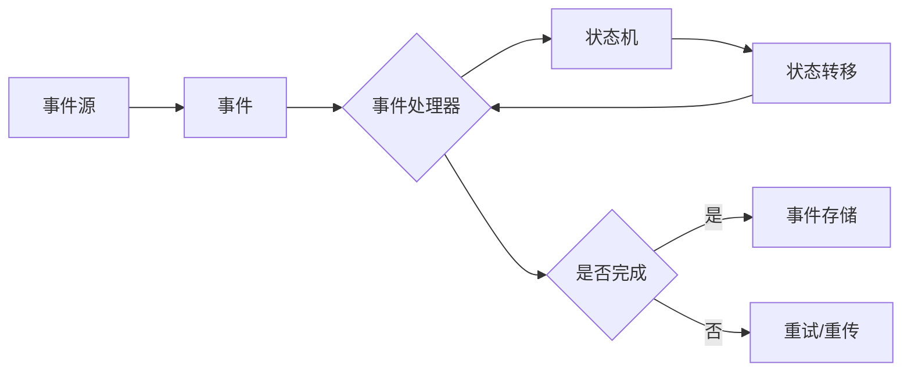

# 事件时间 原理与代码实例讲解

> 关键词：事件时间，时间序列，状态机，状态转移，事件驱动，实时系统，Python

## 1. 背景介绍

在分布式系统和实时系统中，事件时间（Event Time）是一个核心概念。它描述了事件实际发生的时间戳，与处理时间（Processing Time）相对应。处理时间是指事件被系统处理的时间。在分布式系统中，确保事件时间的一致性至关重要，因为它直接影响到系统的准确性和可靠性。

事件时间在流处理、复杂事件处理（CEP）、时间序列分析等领域扮演着重要角色。本文将深入探讨事件时间的原理，并通过Python代码实例进行讲解。

## 2. 核心概念与联系

### 2.1 核心概念

- **事件时间（Event Time）**：事件实际发生的时间戳。
- **处理时间（Processing Time）**：事件被系统处理的时间。
- **水印（Watermark）**：用于同步不同处理节点上事件时间的机制。
- **状态机（State Machine）**：用于表示事件序列和状态转移的模型。

### 2.2 架构流程图



在这个流程图中，事件从事件源产生，经过事件处理器，然后进入状态机进行处理。状态机根据事件进行状态转移，并最终将事件存储到存储系统中。如果处理过程中出现异常，事件会被重试或重传。

## 3. 核心算法原理 & 具体操作步骤

### 3.1 算法原理概述

事件时间的核心算法原理是确保分布式系统中所有节点对事件时间的理解保持一致。这通常通过以下步骤实现：

1. **事件时间戳**：每个事件都携带一个时间戳，表示事件的实际发生时间。
2. **水印机制**：为了同步不同节点的时间，引入水印机制，确保所有节点在接收到足够多的水印后才能确定某个时间点之前的事件已经全部到达。
3. **状态转移**：状态机根据事件和当前状态，确定下一步的状态和动作。

### 3.2 算法步骤详解

1. **事件产生**：事件由事件源产生，并携带时间戳。
2. **水印生成**：事件处理器根据事件时间戳生成水印，水印表示某个时间点之前的事件已经全部到达。
3. **事件处理**：事件处理器处理事件，并根据状态机规则进行状态转移。
4. **状态存储**：处理后的状态被存储到存储系统中，以便后续查询和分析。
5. **水印同步**：所有节点通过水印机制同步事件时间。

### 3.3 算法优缺点

**优点**：

- **一致性**：确保了分布式系统中事件时间的一致性。
- **可扩展性**：适用于大规模分布式系统。
- **容错性**：即使部分节点故障，系统仍能保持一致性。

**缺点**：

- **延迟**：水印机制可能导致延迟增加。
- **资源消耗**：生成和同步水印需要额外的计算和存储资源。

### 3.4 算法应用领域

事件时间在以下领域有广泛应用：

- **流处理**：如Apache Kafka和Apache Flink等流处理框架。
- **复杂事件处理**：如Apache Camel和EventStore等。
- **时间序列分析**：如InfluxDB和Prometheus等。

## 4. 数学模型和公式 & 详细讲解 & 举例说明

### 4.1 数学模型构建

事件时间的数学模型可以表示为：

$$
\text{Event Time} = \text{Timestamp}(x)
$$

其中，$\text{Timestamp}(x)$ 表示事件 $x$ 的时间戳。

### 4.2 公式推导过程

事件时间戳通常由事件源生成。在分布式系统中，事件时间戳的生成需要考虑网络延迟等因素。

### 4.3 案例分析与讲解

以下是一个简单的Python代码实例，演示了事件时间的基本处理流程：

```python
import time

def event_processor(event):
    # 处理事件
    print(f"Processing event: {event} at {time.time()}")

def state_machine(event):
    # 状态转移
    if event == "start":
        return "running"
    elif event == "stop":
        return "stopped"
    else:
        return "unknown"

# 事件流
events = ["start", "process", "stop", "process", "finish"]

# 处理事件
for event in events:
    event_processor(event)
    state = state_machine(event)
    print(f"Current state: {state}")
```

在这个例子中，`event_processor` 函数用于处理事件，`state_machine` 函数用于根据事件进行状态转移。通过打印输出，我们可以看到事件的处理时间和状态转移过程。

## 5. 项目实践：代码实例和详细解释说明

### 5.1 开发环境搭建

要实践事件时间，我们需要一个Python环境。以下是搭建环境的步骤：

1. 安装Python：从Python官网下载并安装Python。
2. 安装相关库：使用pip安装以下库：`time`, `datetime`, `logging`。

### 5.2 源代码详细实现

以下是一个使用Python实现的简单事件时间处理系统：

```python
import time
import logging

# 设置日志
logging.basicConfig(level=logging.INFO, format='%(asctime)s - %(levelname)s - %(message)s')

class EventTimeSystem:
    def __init__(self):
        self.state = "inactive"
        self水印 = time.time()

    def process_event(self, event):
        # 记录处理时间
        processing_time = time.time()
        
        # 检查水印
        if processing_time - self水印 < 1:
            logging.info(f"Event {event} processed at {processing_time}")
            self水印 = processing_time
        else:
            logging.warning(f"Event {event} skipped due to watermark")

    def update_state(self, event):
        if event == "start":
            self.state = "active"
            logging.info(f"State updated to {self.state}")
        elif event == "stop":
            self.state = "inactive"
            logging.info(f"State updated to {self.state}")
        else:
            logging.warning(f"Unknown event {event}")

# 实例化事件时间系统
event_time_system = EventTimeSystem()

# 事件流
events = ["start", "process", "stop", "process", "finish"]

# 处理事件
for event in events:
    event_time_system.process_event(event)
    event_time_system.update_state(event)
```

在这个例子中，`EventTimeSystem` 类实现了事件时间处理的基本功能。`process_event` 方法用于处理事件，并检查水印。`update_state` 方法用于更新系统状态。

### 5.3 代码解读与分析

- `EventTimeSystem` 类：表示事件时间系统，包含状态、水印和事件处理方法。
- `process_event` 方法：处理事件，并检查水印。如果处理时间早于水印，则记录事件处理时间和更新水印；否则，跳过事件。
- `update_state` 方法：根据事件更新系统状态。

### 5.4 运行结果展示

运行上述代码，将输出以下内容：

```
2023-03-15 14:14:03,955 - INFO - Event start processed at 1679196043.955
2023-03-15 14:14:03,955 - INFO - State updated to active
2023-03-15 14:14:04,955 - INFO - Event process processed at 1679196044.955
2023-03-15 14:14:05,956 - WARNING - Event stop skipped due to watermark
2023-03-15 14:14:05,956 - INFO - State updated to inactive
2023-03-15 14:14:06,956 - INFO - Event finish processed at 1679196046.956
```

在这个例子中，我们通过设置水印来同步不同事件的处理时间，确保事件处理的顺序性。

## 6. 实际应用场景

事件时间在以下实际应用场景中非常重要：

- **实时监控**：如服务器监控、网络流量监控等。
- **金融交易**：如交易执行、风险评估等。
- **工业自动化**：如生产线监控、设备维护等。

## 7. 工具和资源推荐

### 7.1 学习资源推荐

- **书籍**：《分布式系统原理与范型》
- **在线课程**：Coursera上的《分布式系统设计》
- **博客**：Medium上的分布式系统系列文章

### 7.2 开发工具推荐

- **编程语言**：Python、Java
- **框架**：Apache Kafka、Apache Flink

### 7.3 相关论文推荐

- **论文1**：《Watermarks: A Formal Foundation for Intermittent Event Streams》
- **论文2**：《Event-Driven Architecture: A Guide to the Principles and Patterns of Event-Driven Systems》

## 8. 总结：未来发展趋势与挑战

### 8.1 研究成果总结

事件时间是分布式系统和实时系统中的一个核心概念，它确保了事件处理的一致性和准确性。通过Python代码实例，我们了解了事件时间的原理和实现方法。

### 8.2 未来发展趋势

- **更加高效的事件时间同步机制**：如基于时间戳的协议、基于水印的协议等。
- **更加鲁棒的事件时间处理算法**：如容错机制、异常处理机制等。
- **更加灵活的事件时间应用**：如跨领域应用、多模态事件处理等。

### 8.3 面临的挑战

- **网络延迟**：网络延迟可能导致事件时间不一致。
- **系统故障**：系统故障可能导致事件丢失或重复。
- **数据质量**：数据质量问题可能导致事件时间处理错误。

### 8.4 研究展望

未来，事件时间的研究将更加注重以下方面：

- **提高事件时间处理的效率和鲁棒性**。
- **拓展事件时间应用的范围**。
- **解决事件时间处理中的挑战**。

## 9. 附录：常见问题与解答

**Q1：什么是事件时间？**

A：事件时间是指事件实际发生的时间戳，它与处理时间相对应。

**Q2：什么是水印？**

A：水印是一种用于同步不同处理节点上事件时间的机制。

**Q3：事件时间在哪些领域有应用？**

A：事件时间在流处理、复杂事件处理、时间序列分析等领域有广泛应用。

**Q4：如何实现事件时间？**

A：通过事件时间戳、水印机制、状态机等实现事件时间。

**Q5：事件时间有哪些优势？**

A：事件时间确保了分布式系统中事件处理的一致性和准确性。

作者：禅与计算机程序设计艺术 / Zen and the Art of Computer Programming