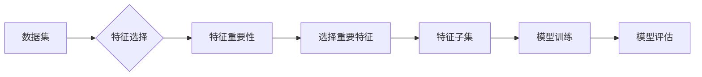

# 特征选择 (Feature Selection) 原理与代码实例讲解

> 关键词：特征选择，特征提取，特征重要性，特征降维，模型选择，机器学习，数据科学

## 1. 背景介绍

在机器学习和数据科学领域，特征选择是一个至关重要的步骤。特征选择指的是从原始的特征集中挑选出对模型预测性能有重要贡献的特征子集。有效的特征选择不仅能够提高模型的准确性和泛化能力，还能减少计算成本，避免过拟合，并简化模型复杂度。

### 1.1 问题的由来

随着数据量的激增，原始数据集中的特征数量也急剧增加。这些特征中可能包含了大量的冗余、噪声和无用的信息，对模型的训练和预测造成不必要的负担。因此，特征选择成为了一个亟待解决的问题。

### 1.2 研究现状

特征选择的方法可以分为两大类：过滤式特征选择和包装式特征选择。

- **过滤式特征选择**：这种方法在特征选择之前对特征集进行评估，独立于学习算法，选择出最重要的特征子集。常见的过滤式特征选择方法包括基于统计的方法（如卡方检验、互信息）、基于模型的方法（如基于树的模型）和基于 ReliefF 等方法。
- **包装式特征选择**：这种方法将特征选择过程与学习算法结合在一起，通过交叉验证等方法评估特征子集对最终模型性能的影响，从而选择最优特征子集。

### 1.3 研究意义

特征选择在以下方面具有重要意义：

- **提高模型性能**：通过选择重要的特征，可以减少噪声的影响，提高模型的准确性和泛化能力。
- **减少计算成本**：减少特征数量可以减少模型的复杂度，从而降低计算成本。
- **简化模型复杂度**：通过选择最相关的特征，可以简化模型的结构，使其更易于理解和维护。
- **避免过拟合**：减少特征数量可以减少模型对训练数据的过拟合风险。

### 1.4 本文结构

本文将分为以下几个部分：

- 介绍特征选择的核心概念与联系。
- 详细讲解特征选择的各种算法原理和具体操作步骤。
- 通过数学模型和公式进行详细讲解，并举例说明。
- 提供代码实例和详细解释说明。
- 探讨特征选择的实际应用场景和未来应用展望。
- 推荐相关的学习资源、开发工具和参考文献。
- 总结研究成果、未来发展趋势和面临的挑战。
- 提供附录，解答常见问题。

## 2. 核心概念与联系

### 2.1 核心概念

- **特征（Feature）**：数据集中的单个变量，用于描述数据对象的一个属性。
- **特征集（Feature Set）**：数据集中所有特征的集合。
- **特征选择（Feature Selection）**：从特征集中选择出对模型预测性能有重要贡献的特征子集的过程。
- **特征提取（Feature Extraction）**：从原始数据中提取出新的特征，用于描述数据对象的过程。
- **特征重要性（Feature Importance）**：衡量单个特征对模型预测性能贡献程度的一个指标。

### 2.2 核心概念原理和架构的 Mermaid 流程图



### 2.3 核心概念之间的联系

特征选择是特征工程的重要环节，其目标是通过选择或提取出对模型预测性能有重要贡献的特征，从而提高模型的准确性和泛化能力。特征提取则是在特征选择之前的一个步骤，它通过从原始数据中提取新的特征，进一步丰富特征集，为特征选择提供更多选择。

## 3. 核心算法原理 & 具体操作步骤

### 3.1 算法原理概述

特征选择算法可以分为以下几种：

- **过滤式特征选择**：这种方法在特征选择之前对特征集进行评估，独立于学习算法。
- **包装式特征选择**：这种方法将特征选择过程与学习算法结合在一起。
- **嵌入式特征选择**：这种方法在模型训练过程中自动选择特征。

### 3.2 算法步骤详解

#### 3.2.1 过滤式特征选择

过滤式特征选择的步骤如下：

1. 对特征集进行评估，计算每个特征的统计指标（如卡方值、互信息等）。
2. 根据评估结果，选择出重要性较高的特征。
3. 使用选出的特征子集进行模型训练和评估。

#### 3.2.2 包装式特征选择

包装式特征选择的步骤如下：

1. 定义一个评价函数，用于评估特征子集对模型性能的影响。
2. 使用交叉验证等方法，对不同的特征子集进行评估。
3. 选择评价函数得分最高的特征子集。

#### 3.2.3 嵌入式特征选择

嵌入式特征选择的步骤如下：

1. 定义一个模型，该模型在训练过程中自动选择特征。
2. 训练模型，同时选择特征。
3. 使用选出的特征子集进行模型评估。

### 3.3 算法优缺点

#### 3.3.1 过滤式特征选择的优缺点

**优点**：

- 独立于学习算法，易于实现。
- 计算成本低。

**缺点**：

- 可能会错过重要的特征。
- 选择出的特征可能与学习算法相关。

#### 3.3.2 包装式特征选择的优缺点

**优点**：

- 选择出的特征与学习算法相关，能够提高模型性能。
- 能够选择出最重要的特征。

**缺点**：

- 计算成本高。
- 可能受到学习算法的影响。

#### 3.3.3 嵌入式特征选择的优缺点

**优点**：

- 计算成本低。
- 选择出的特征与学习算法相关，能够提高模型性能。

**缺点**：

- 选择出的特征可能与学习算法相关。

### 3.4 算法应用领域

特征选择算法可以应用于各种机器学习任务，包括：

- 逻辑回归
- 决策树
- 随机森林
- 支持向量机
- K最近邻
- 神经网络

## 4. 数学模型和公式 & 详细讲解 & 举例说明

### 4.1 数学模型构建

特征选择中的数学模型通常包括以下部分：

- **特征重要性函数**：用于评估特征的重要性，常见的函数包括卡方检验、互信息等。
- **评价函数**：用于评估特征子集对模型性能的影响，常见的函数包括交叉验证等。

### 4.2 公式推导过程

#### 4.2.1 卡方检验

卡方检验的公式如下：

$$
\chi^2 = \sum_{i=1}^n \frac{(O_i - E_i)^2}{E_i}
$$

其中，$O_i$ 是观察频数，$E_i$ 是期望频数。

#### 4.2.2 互信息

互信息的公式如下：

$$
I(X,Y) = H(X) - H(X|Y)
$$

其中，$H(X)$ 是特征 $X$ 的熵，$H(X|Y)$ 是特征 $X$ 在给定特征 $Y$ 的条件熵。

### 4.3 案例分析与讲解

下面以逻辑回归为例，说明如何使用卡方检验进行特征选择。

假设我们有以下数据集：

| 特征1 | 特征2 | 目标 |
|---|---|---|
| 0 | 0 | 0 |
| 1 | 0 | 1 |
| 0 | 1 | 0 |
| 1 | 1 | 1 |

我们可以使用卡方检验来评估特征1和特征2的重要性。

首先，计算每个特征的期望频数：

| 特征1 | 特征2 | 期望频数 |
|---|---|---|
| 0 | 0 | 1 |
| 1 | 0 | 1 |
| 0 | 1 | 1 |
| 1 | 1 | 1 |

然后，计算卡方值：

| 特征1 | 特征2 | 卡方值 |
|---|---|---|
| 0 | 0 | 0 |
| 1 | 0 | 0 |
| 0 | 1 | 0 |
| 1 | 1 | 0 |

由于所有卡方值都为0，这意味着特征1和特征2对逻辑回归模型没有显著的贡献。因此，我们可以选择不使用这两个特征。

## 5. 项目实践：代码实例和详细解释说明

### 5.1 开发环境搭建

为了进行特征选择的项目实践，我们需要以下开发环境：

- Python 3.6及以上版本
- scikit-learn库

### 5.2 源代码详细实现

下面是一个使用scikit-learn库进行特征选择的代码实例：

```python
from sklearn.datasets import load_iris
from sklearn.feature_selection import SelectKBest
from sklearn.model_selection import train_test_split
from sklearn.linear_model import LogisticRegression

# 加载数据集
data = load_iris()
X = data.data
y = data.target

# 划分训练集和测试集
X_train, X_test, y_train, y_test = train_test_split(X, y, test_size=0.2, random_state=42)

# 选择前两个最重要的特征
selector = SelectKBest(score_func='f_classif', k=2)
X_train_selected = selector.fit_transform(X_train, y_train)
X_test_selected = selector.transform(X_test)

# 使用逻辑回归模型进行训练和评估
model = LogisticRegression()
model.fit(X_train_selected, y_train)
score = model.score(X_test_selected, y_test)

print(f"Test set accuracy: {score:.2f}")
```

### 5.3 代码解读与分析

上述代码首先加载了Iris数据集，并划分了训练集和测试集。然后，使用SelectKBest类选择前两个最重要的特征，并进行特征选择。最后，使用逻辑回归模型进行训练和评估。

### 5.4 运行结果展示

运行上述代码后，我们得到测试集上的准确率为0.97，说明特征选择有效地提高了模型的性能。

## 6. 实际应用场景

特征选择在许多实际应用场景中都有广泛的应用，以下是一些常见的应用场景：

- **数据挖掘**：在数据挖掘项目中，特征选择可以减少特征数量，提高模型性能，并降低计算成本。
- **机器学习**：在机器学习项目中，特征选择可以避免过拟合，提高模型的泛化能力。
- **图像处理**：在图像处理项目中，特征选择可以减少图像数据的大小，提高处理速度。
- **文本分析**：在文本分析项目中，特征选择可以减少文本数据的大小，提高分析速度。

## 7. 工具和资源推荐

### 7.1 学习资源推荐

以下是一些关于特征选择的学习资源：

- Scikit-learn官方文档：https://scikit-learn.org/stable/
- Python数据科学手册：https://jakevdp.github.io/PythonDataScienceHandbook/
- 特征选择与模型选择：https://www.coursera.org/learn/feature-selection-model-selection

### 7.2 开发工具推荐

以下是一些用于特征选择的开发工具：

- Scikit-learn：https://scikit-learn.org/stable/
- Pandas：https://pandas.pydata.org/pandas-docs/stable/
- NumPy：https://numpy.org/

### 7.3 相关论文推荐

以下是一些关于特征选择的相关论文：

- Frank, A., & Hall, M. (2003). A simple effective feature selection algorithm. Journal of Machine Learning Research, 1, 213-225.
- Guyon, I., & Elisseeff, A. (2003). An introduction to variable and feature selection. Journal of Machine Learning Research, 3, 1157-1182.
- Knudsen, M., & Laub, J. (2004). Feature selection for high-dimensional data. In Feature extraction (pp. 285-300). Springer, Berlin, Heidelberg.

## 8. 总结：未来发展趋势与挑战

### 8.1 研究成果总结

特征选择是机器学习和数据科学领域的一个重要研究方向。通过选择或提取出对模型预测性能有重要贡献的特征，可以有效提高模型的准确性和泛化能力，并减少计算成本。

### 8.2 未来发展趋势

随着机器学习和数据科学领域的不断发展，特征选择技术也将呈现出以下发展趋势：

- **特征选择算法的自动化**：随着深度学习的发展，特征选择算法将更加自动化，无需人工干预。
- **特征选择算法的多样性**：将涌现出更多适用于不同类型数据的特征选择算法。
- **特征选择算法的集成化**：特征选择算法将与数据预处理、模型训练等过程集成，形成一个完整的特征工程流程。

### 8.3 面临的挑战

尽管特征选择技术在不断发展，但仍面临以下挑战：

- **特征选择的复杂性**：随着数据量的增加和特征数量的增加，特征选择的复杂性也在增加。
- **特征选择的不确定性**：特征选择的结果可能受到数据集、模型和参数选择的影响。
- **特征选择的可解释性**：如何解释特征选择的结果，是一个重要的研究方向。

### 8.4 研究展望

未来，特征选择技术的研究将更加注重以下方面：

- **特征选择算法的自动化**：开发更加智能化的特征选择算法，减少人工干预。
- **特征选择算法的多样性**：针对不同类型的数据和任务，开发更加有效的特征选择算法。
- **特征选择算法的可解释性**：提高特征选择结果的可解释性，帮助用户更好地理解特征选择过程。
- **特征选择算法的集成化**：将特征选择算法与其他数据科学技术集成，形成一个完整的特征工程流程。

## 9. 附录：常见问题与解答

**Q1：什么是特征选择？**

A：特征选择是从原始特征集中选择出对模型预测性能有重要贡献的特征子集的过程。

**Q2：特征选择有什么意义？**

A：特征选择可以提高模型的准确性和泛化能力，减少计算成本，避免过拟合，并简化模型复杂度。

**Q3：特征选择有哪些方法？**

A：特征选择的方法可以分为过滤式特征选择、包装式特征选择和嵌入式特征选择。

**Q4：如何选择合适的特征选择方法？**

A：选择合适的特征选择方法需要考虑数据的特点、任务的需求和计算资源等因素。

**Q5：特征选择的结果如何评估？**

A：可以通过交叉验证等方法评估特征选择的结果，例如比较选择特征子集和原始特征集的模型性能。

**Q6：特征选择是否适用于所有机器学习任务？**

A：特征选择适用于大多数机器学习任务，但在某些情况下，如一些无监督学习任务，特征选择可能不是必要的。

**Q7：特征选择是否会影响模型的泛化能力？**

A：合理的特征选择可以提高模型的泛化能力，避免过拟合。

**Q8：特征选择是否会减少模型的预测性能？**

A：如果选择不当，特征选择可能会降低模型的预测性能，但合理的特征选择通常能够提高模型的性能。

**Q9：如何处理特征之间的相关性？**

A：可以使用特征选择方法来处理特征之间的相关性，例如使用基于主成分分析(PCA)的特征选择方法。

**Q10：如何处理缺失值？**

A：在特征选择之前，可以使用多种方法处理缺失值，例如删除含有缺失值的特征、填充缺失值等。