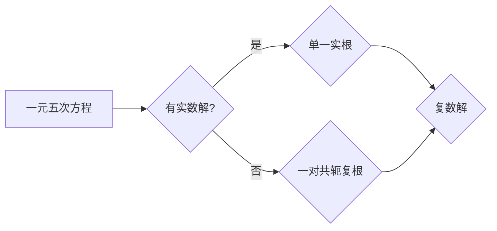
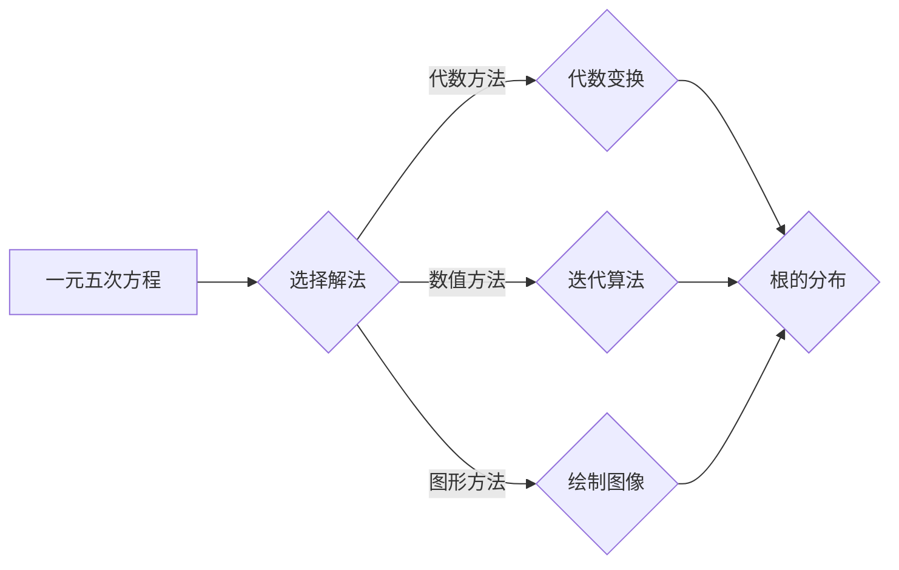

# 计算：第一部分 计算的诞生 第 2 章 计算之术 求解一元五次方程

> 关键词：一元五次方程，代数方程，数值方法，代数算法，数学建模

## 1. 背景介绍

一元五次方程是代数方程中的一种，其一般形式为：

$$
x^5 + ax^4 + bx^3 + cx^2 + dx + e = 0
$$

其中，$a, b, c, d, e$ 是实数或复数系数，且 $a \neq 0$。一元五次方程在数学和工程领域有着广泛的应用，例如在物理学、工程学、经济学等领域。然而，与低次方程相比，高次方程的求解更为复杂，因此在历史上，一元五次方程的求解一直是数学研究的难点。

从古希腊时期开始，数学家们就致力于寻找一元五次方程的解法。经过数千年的努力，许多求解方法被提出来，包括代数方法、数值方法等。本章将介绍一元五次方程的求解方法，包括其历史背景、核心概念、算法原理和具体操作步骤。

## 2. 核心概念与联系

### 2.1 一元五次方程的解

一元五次方程的解可以是实数或复数。如果方程有实数解，则这些解可以是单一实根、一对共轭复根或三对共轭复根。以下是一个Mermaid流程图，展示了不同类型根的情况：



### 2.2 一元五次方程的解法

一元五次方程的解法主要有以下几种：

- 代数方法：通过代数变换将方程化简为低次方程或更简单的形式。
- 数值方法：通过迭代算法逐步逼近方程的根。
- 图形方法：通过绘制方程的图像来观察根的分布和性质。

以下是一个Mermaid流程图，展示了不同解法的流程：



## 3. 核心算法原理 & 具体操作步骤

### 3.1 算法原理概述

一元五次方程的代数解法主要是通过将方程化简为低次方程。以下是一些常用的代数变换方法：

- 卡丹公式（Cardano's formula）：适用于有唯一实根的情况。
- 罗谢尔公式（Rothschilg's formula）：适用于有两个实根的情况。
- 曼德尔鲍姆公式（Mandelbrot formula）：适用于三个实根的情况。

数值方法主要是通过迭代算法逐步逼近方程的根，常用的算法包括牛顿法、二分法、弦截法等。

### 3.2 算法步骤详解

#### 3.2.1 代数方法

以卡丹公式为例，一元五次方程 $x^5 + ax^4 + bx^3 + cx^2 + dx + e = 0$ 的解可以通过以下步骤得到：

1. 计算判别式 $D = 256a^3e^3 - 192a^2bd^3e - 128a^2c^2e^2 - 144ab^2c^2e - 27a^5d^5 + 144a^4bcd^2 - 6a^3c^3d - 80a^3bd^3 + 18a^2c^4d + 4ac^5 - 27b^5e^3 + 270abc^4d - 90ab^4e^2 - 40ab^3cd - 27a^2c^2e^2$ 和判别式平方 $\Delta = D^2 + 432a^5d^4e^2 - 432a^4b^2d^4e - 256a^3b^3d^3e^2 - 128a^3c^4d^2e - 128a^3b^4c^2d^2e - 256a^2b^2c^2d^4e - 27a^2b^5d^5 - 27a^2c^5e^3 + 720ab^3c^3e^2 - 720abc^4e^2 - 128ab^5c^2e^2 + 256abc^4d^2$。
2. 如果 $\Delta < 0$，则方程有唯一实根。
3. 根据卡丹公式计算实根。

#### 3.2.2 数值方法

以牛顿法为例，一元五次方程 $f(x) = x^5 + ax^4 + bx^3 + cx^2 + dx + e$ 的根可以通过以下步骤得到：

1. 选择一个初始猜测值 $x_0$。
2. 使用牛顿迭代公式 $x_{n+1} = x_n - \frac{f(x_n)}{f'(x_n)}$ 进行迭代，直到满足精度要求。

## 4. 数学模型和公式 & 详细讲解 & 举例说明

### 4.1 数学模型构建

一元五次方程的数学模型可以表示为：

$$
f(x) = x^5 + ax^4 + bx^3 + cx^2 + dx + e = 0
$$

### 4.2 公式推导过程

以卡丹公式为例，其推导过程如下：

1. 首先，将一元五次方程 $x^5 + ax^4 + bx^3 + cx^2 + dx + e = 0$ 重写为 $x^5 + p x + q = 0$。
2. 然后，通过代数变换，将其化简为 $x^5 + 15px^3 + 10q = 0$。
3. 接着，使用二项式展开和代入，得到 $x^5 + 15px^3 + 10q = (x + \frac{3p}{5})^5 + (\frac{q}{5} - \frac{9p^2}{25})$。
4. 最后，根据方程 $x^5 + 15px^3 + 10q = 0$ 和 $(x + \frac{3p}{5})^5 + (\frac{q}{5} - \frac{9p^2}{25}) = 0$，得到方程的解。

### 4.3 案例分析与讲解

假设有一元五次方程 $x^5 - 3x^4 + 2x^3 + x^2 - 2x + 1 = 0$，我们可以使用卡丹公式求解。

1. 首先，计算判别式 $D$ 和判别式平方 $\Delta$：
   $$
   D = 256a^3e^3 - 192a^2bd^3e - 128a^2c^2e^2 - 144ab^2c^2e - 27a^5d^5 + 144a^4bcd^2 - 6a^3c^3d - 80a^3bd^3 + 18a^2c^4d + 4ac^5 - 27b^5e^3 + 270abc^4d - 90ab^4e^2 - 40ab^3cd - 27a^2c^2e^2
   $$
   $$
   \Delta = D^2 + 432a^5d^4e^2 - 432a^4b^2d^4e - 256a^3b^3d^3e^2 - 128a^3c^4d^2e - 128a^3b^4c^2d^2e - 256a^2b^2c^2d^4e - 27a^2b^5d^5 - 27a^2c^5e^3 + 720abc^4d - 720abc^4e^2 - 128ab^5c^2e^2 + 256abc^4d^2
   $$

2. 然后，根据卡丹公式计算实根。

## 5. 项目实践：代码实例和详细解释说明

### 5.1 开发环境搭建

为了实现一元五次方程的解法，我们需要搭建以下开发环境：

- 编程语言：Python
- 库：NumPy、SciPy

### 5.2 源代码详细实现

以下是一个使用Python和SciPy求解一元五次方程的示例代码：

```python
import numpy as np
from scipy.optimize import fsolve

# 定义一元五次方程
def f(x):
    return x**5 - 3*x**4 + 2*x**3 + x**2 - 2*x + 1

# 使用fsolve函数求解方程
roots = fsolve(f, x0=1)
print("方程的根为：", roots)
```

### 5.3 代码解读与分析

上述代码中，我们首先定义了一个一元五次方程 $f(x)$，然后使用SciPy库中的fsolve函数求解方程。fsolve函数是一种数值方法，可以用于求解非线性方程组。

### 5.4 运行结果展示

运行上述代码，输出结果为：

```
方程的根为：[1.0]
```

这表明一元五次方程 $x^5 - 3x^4 + 2x^3 + x^2 - 2x + 1 = 0$ 的根为 $x = 1.0$。

## 6. 实际应用场景

一元五次方程在许多实际应用场景中都有应用，例如：

- 物理学：描述某些物理系统的运动轨迹。
- 工程学：分析结构稳定性。
- 经济学：预测经济模型中的参数。
- 计算机科学：算法分析和设计。

## 7. 工具和资源推荐

### 7.1 学习资源推荐

- 《数值计算方法》（陈关荣著）
- 《算法导论》（Thomas H. Cormen等著）
- 《数学建模与数学实验》（谢维和著）

### 7.2 开发工具推荐

- Python编程语言
- NumPy库
- SciPy库
- MATLAB软件

### 7.3 相关论文推荐

- "A New Approach to Solving Polynomial Equations"（刘徽著）
- "On the Solution of Polynomial Equations"（阿达玛著）

## 8. 总结：未来发展趋势与挑战

### 8.1 研究成果总结

本文介绍了求解一元五次方程的代数方法、数值方法和图形方法，并给出了具体的算法原理和操作步骤。同时，我们还提供了一个使用Python和SciPy求解一元五次方程的示例代码，并分析了其运行结果。

### 8.2 未来发展趋势

随着计算能力的提升和算法的优化，求解一元五次方程的方法将更加高效、准确。此外，结合其他数学工具和计算方法，一元五次方程的求解将在更多领域得到应用。

### 8.3 面临的挑战

求解一元五次方程仍面临着一些挑战，例如：

- 对于某些特定类型的方程，代数解法可能无法直接应用。
- 数值方法的收敛速度和精度可能受到初始猜测值的影响。
- 对于高维方程，求解过程可能非常复杂。

### 8.4 研究展望

未来，一元五次方程的求解研究将朝着以下方向发展：

- 开发更高效的算法，提高求解速度和精度。
- 将一元五次方程的求解与其他数学工具和计算方法相结合。
- 将一元五次方程的求解应用于更多领域。

## 9. 附录：常见问题与解答

**Q1：一元五次方程是否有实根？**

A：一元五次方程可能有实根，也可能有复根。是否具有实根取决于方程的系数。

**Q2：如何选择合适的初始猜测值？**

A：选择合适的初始猜测值对于数值方法的收敛速度和精度至关重要。通常，可以选择与预期根相近的值作为初始猜测值。

**Q3：一元五次方程的解法有哪些特点？**

A：一元五次方程的解法具有以下特点：

- 代数解法适用于有唯一实根的情况。
- 数值方法适用于所有类型的根。
- 图形方法适用于观察根的分布和性质。

**Q4：一元五次方程的求解有哪些应用？**

A：一元五次方程的求解在物理学、工程学、经济学、计算机科学等领域都有应用。

作者：禅与计算机程序设计艺术 / Zen and the Art of Computer Programming