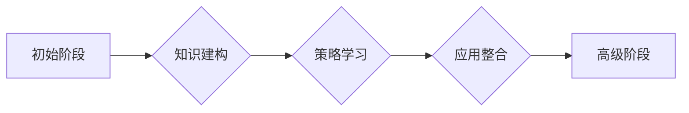

# 认知渐进发展的三阶段模型

> 关键词：认知发展，学习理论，认知模型，三阶段模型，学习策略，认知结构，知识建构

## 1. 背景介绍

人类认知的发展是一个复杂而连续的过程，涉及到知识建构、思维发展、情感态度等多个方面。对于认知发展的研究，心理学家和教育学家提出了多种理论模型，以解释个体在认知领域的成长和变化。本文将介绍一种认知渐进发展的三阶段模型，旨在提供一个结构化框架来理解认知技能的逐步提升。

### 1.1 认知发展的挑战

认知发展是一个多层次、多维度的过程，它不仅包括认知能力的提升，还包括认知策略的调整和认知结构的重组。在教育和学习领域，理解和促进认知发展对于培养批判性思维、解决问题能力和创造性思维至关重要。

### 1.2 研究现状

现有的认知发展理论包括皮亚杰的认知发展阶段理论、维果茨基的社会文化理论、布鲁纳的发现学习理论等。这些理论从不同的角度解释了认知发展的机制和过程。

### 1.3 研究意义

本文提出的三阶段模型旨在整合现有理论，为教育者和研究者提供一个更全面、更实用的认知发展框架，以促进学习策略的优化和教学方法的改进。

### 1.4 本文结构

本文将首先介绍三阶段模型的核心概念与联系，然后详细阐述每个阶段的特点和操作步骤，接着通过数学模型和公式来解释模型的工作原理，并通过项目实践来展示模型的实际应用。最后，我们将探讨模型的实际应用场景、未来应用展望以及面临的挑战。

## 2. 核心概念与联系

### 2.1 Mermaid 流程图

以下是认知渐进发展的三阶段模型的Mermaid流程图：



### 2.2 核心概念

- **初始阶段**：个体开始接触新知识或技能，通过感官经验和初步的尝试来建构初步的认知结构。
- **策略学习阶段**：个体开始学习有效的学习策略，如记忆技巧、问题解决方法等，以提高学习效率。
- **应用整合阶段**：个体将所学知识应用到实际情境中，并通过反思和调整学习策略来进一步提高认知能力。
- **高级阶段**：个体在应用整合阶段的基础上，形成更加复杂和灵活的认知结构，能够进行高级认知活动。

## 3. 核心算法原理 & 具体操作步骤

### 3.1 算法原理概述

三阶段模型基于认知建构理论，认为认知发展是一个逐步推进的过程，每个阶段都有其特定的目标和任务。

### 3.2 算法步骤详解

#### 3.2.1 初始阶段

- **感知与探索**：个体通过感官体验来收集信息。
- **初步建构**：基于感知信息，个体开始建构初步的认知结构。
- **反馈与修正**：个体通过反馈来修正和调整其认知结构。

#### 3.2.2 策略学习阶段

- **策略识别**：个体识别出有效的学习策略。
- **策略应用**：将学习策略应用到实际学习中。
- **策略评估**：评估学习策略的有效性，并根据评估结果进行调整。

#### 3.2.3 应用整合阶段

- **情境分析**：分析实际情境，识别出需要应用的知识和技能。
- **知识应用**：将所学知识应用到实际情境中。
- **反思与调整**：通过反思学习过程，调整学习策略和认知结构。

### 3.3 算法优缺点

#### 3.3.1 优点

- **适应性**：模型可以适应不同个体和不同学习场景。
- **灵活性**：模型可以灵活调整学习策略和认知结构。
- **实用性**：模型可以应用于不同的教育场景和领域。

#### 3.3.2 缺点

- **复杂性**：模型涉及多个阶段和复杂的过程。
- **实施难度**：模型需要教师或教育者的支持和引导。

### 3.4 算法应用领域

三阶段模型可以应用于以下领域：

- **教育**：帮助教师设计和实施有效的教学策略。
- **培训**：优化培训课程和培训方法。
- **个人发展**：帮助个人制定和实施个人发展计划。

## 4. 数学模型和公式 & 详细讲解 & 举例说明

### 4.1 数学模型构建

三阶段模型可以表示为一个数学模型，该模型包括三个主要部分：知识建构模块、策略学习模块和应用整合模块。

### 4.2 公式推导过程

以下是一个简化的数学模型：

$$
M = f(K, S, A)
$$

其中，$M$ 表示认知模型，$K$ 表示知识建构，$S$ 表示策略学习，$A$ 表示应用整合。

### 4.3 案例分析与讲解

假设一个学生正在学习微积分。在初始阶段，学生通过阅读教材和课堂讲解来建构微积分的基本概念。在策略学习阶段，学生学会了如何使用积分和微分的基本公式。在应用整合阶段，学生开始使用微积分来解决实际问题，如计算物体的速度和加速度。

## 5. 项目实践：代码实例和详细解释说明

### 5.1 开发环境搭建

为了演示三阶段模型，我们可以使用Python来构建一个简单的示例。

### 5.2 源代码详细实现

以下是一个简单的Python代码示例，用于模拟三阶段模型：

```python
class KnowledgeConstructModule:
    def __init__(self):
        self.knowledge = {}

    def learn(self, concept):
        self.knowledge[concept] = self.construct_knowledge(concept)

    def construct_knowledge(self, concept):
        # 构建知识的方法
        pass

class StrategyLearningModule:
    def __init__(self):
        self.strategies = {}

    def learn_strategy(self, strategy):
        self.strategies[strategy] = self.apply_strategy(strategy)

    def apply_strategy(self, strategy):
        # 应用策略的方法
        pass

class ApplicationIntegrationModule:
    def __init__(self, knowledge_construct, strategy_learning):
        self.knowledge_construct = knowledge_construct
        self.strategy_learning = strategy_learning

    def apply_knowledge(self, concept):
        return self.knowledge_construct.knowledge.get(concept, None)

    def apply_strategy(self, strategy):
        return self.strategy_learning.strategies.get(strategy, None)
```

### 5.3 代码解读与分析

上述代码定义了三个模块，每个模块都有其特定的功能：

- `KnowledgeConstructModule` 负责知识建构。
- `StrategyLearningModule` 负责策略学习。
- `ApplicationIntegrationModule` 负责知识应用和整合。

### 5.4 运行结果展示

```python
# 创建模块实例
knowledge_construct = KnowledgeConstructModule()
strategy_learning = StrategyLearningModule()
application_integration = ApplicationIntegrationModule(knowledge_construct, strategy_learning)

# 模拟学习过程
knowledge_construct.learn('微积分')
strategy_learning.learn_strategy('积分公式')
application_integration.apply_knowledge('微积分')
application_integration.apply_strategy('积分公式')
```

## 6. 实际应用场景

### 6.1 教育领域

在教育领域，三阶段模型可以帮助教师设计和实施个性化的学习计划。例如，教师可以根据学生的学习进度和困难，调整教学策略和方法，以提高学生的学习效果。

### 6.2 企业培训

在企业培训中，三阶段模型可以帮助培训师设计和实施有效的培训课程。通过分析员工的认知发展阶段，培训师可以提供针对性的培训内容和学习策略。

## 7. 工具和资源推荐

### 7.1 学习资源推荐

- 《认知心理学》
- 《学习与认知发展》
- 《认知建构理论》

### 7.2 开发工具推荐

- Python编程语言
- Jupyter Notebook

### 7.3 相关论文推荐

- Papert, S. (1980). Mindstorms: Children, Computers, and Powerful Ideas.
- Lave, J., & Wenger, E. (1991). Situated Learning: Legitimate Peripheral Participation.
- Bruner, J. S. (1966). Toward a Theory of Instruction.

## 8. 总结：未来发展趋势与挑战

### 8.1 研究成果总结

本文提出的三阶段模型提供了一个理解认知发展过程的框架，有助于教育和培训领域的设计和实践。

### 8.2 未来发展趋势

未来，三阶段模型可能会与其他认知理论和技术相结合，以提供更全面的学习解决方案。

### 8.3 面临的挑战

三阶段模型的实施需要教师或教育者的专业知识和技能，同时也需要技术的支持。

### 8.4 研究展望

未来的研究应该关注如何将三阶段模型与其他理论和技术相结合，以提高其有效性和实用性。

## 9. 附录：常见问题与解答

**Q1：三阶段模型适用于所有学习场景吗？**

A1：三阶段模型提供了一种理解认知发展的通用框架，但并不是所有学习场景都适用。在实际应用中，需要根据具体情况进行调整。

**Q2：如何评估三阶段模型的有效性？**

A2：可以通过评估学生的学习成果和反馈来评估三阶段模型的有效性。

**Q3：三阶段模型与传统的教学模型有什么不同？**

A3：传统的教学模型通常基于教师的主导和知识的传授，而三阶段模型更加关注学生的学习过程和认知发展。

**Q4：如何将三阶段模型应用于在线学习平台？**

A4：在线学习平台可以通过跟踪学生的学习行为和进度，来实施三阶段模型。

作者：禅与计算机程序设计艺术 / Zen and the Art of Computer Programming