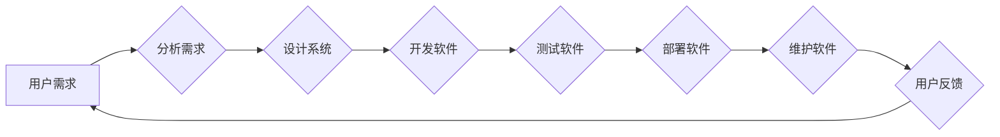

# 软件 2.0 的社会责任：科技向善

> 关键词：软件2.0，社会责任，科技伦理，人机协作，可持续发展，公正性，可解释性，透明度

## 1. 背景介绍

随着信息技术的飞速发展，软件已经成为现代社会运行的核心。从早期的系统软件到如今的Web应用和移动应用，软件无处不在，深刻地影响着我们的工作、生活和社会结构。然而，随着软件规模的不断扩大和功能的日益复杂，软件带来的负面影响也逐渐显现，如数据隐私泄露、算法歧视、技术失业等。因此，软件2.0时代，如何承担社会责任，实现科技向善，成为了一个亟待解决的问题。

### 1.1 软件2.0的到来

软件2.0是继系统软件、网络软件之后，软件发展的新阶段。这一阶段的特点是：

- **软件即服务**：软件不再仅仅是单一的应用，而是变成了一个生态系统，提供多样化的服务。
- **数据驱动**：软件通过收集和分析数据，提供更加个性化的服务。
- **人机协作**：人工智能技术的应用，使得软件能够更好地辅助人类完成工作。

### 1.2 软件的社会责任

软件2.0时代，软件的社会责任更加突出。软件不仅仅是技术产品，更是影响人类生活、社会发展的关键因素。因此，软件需要承担以下社会责任：

- **保护用户隐私**：确保用户数据的安全，防止数据泄露。
- **避免算法歧视**：算法的设计和实施需要公平、公正，避免对某些群体产生歧视。
- **减少技术失业**：通过技术进步促进就业，减少技术失业问题。
- **促进可持续发展**：软件应支持绿色环保，促进可持续发展。

## 2. 核心概念与联系

### 2.1 核心概念原理

#### 软件伦理

软件伦理是指与软件设计和开发相关的伦理原则和规范。它包括以下几个方面：

- **隐私保护**：尊重用户隐私，保护用户数据。
- **公正性**：算法设计和实施应公平、公正，避免歧视。
- **透明度**：软件的设计和运作应透明，用户可理解。
- **可解释性**：算法的决策过程应可解释，用户可接受。

#### 人机协作

人机协作是指人类与机器共同完成任务的过程。它包括以下几个方面：

- **互补性**：人类和机器各自发挥优势，互补不足。
- **协作性**：人类和机器之间能够有效沟通，协同工作。
- **适应性**：系统能够根据人类的行为和需求进行自适应调整。

### 2.2 架构的 Mermaid 流程图



在这个流程图中，用户的需求是软件开发的起点和终点，而设计、开发、测试、部署和维护则是软件开发的各个阶段。

## 3. 核心算法原理 & 具体操作步骤

### 3.1 算法原理概述

软件2.0时代的核心算法原理包括：

- **机器学习**：通过学习数据，使软件能够自动优化和改进。
- **人工智能**：使软件能够模拟人类智能，完成复杂的任务。
- **大数据分析**：通过分析海量数据，发现新的规律和模式。

### 3.2 算法步骤详解

软件2.0时代的算法步骤主要包括：

1. **数据收集**：收集用户数据、市场数据等，为算法提供训练数据。
2. **数据预处理**：对数据进行清洗、转换等操作，使其符合算法要求。
3. **算法训练**：使用机器学习算法对数据进行训练，优化模型参数。
4. **模型评估**：评估模型的性能，确保其满足需求。
5. **模型部署**：将模型部署到实际应用中。
6. **模型监控**：监控模型的运行状态，确保其稳定运行。

### 3.3 算法优缺点

#### 优点

- **自动化**：算法能够自动完成复杂的任务，提高效率。
- **个性化**：算法能够根据用户需求提供个性化的服务。
- **智能化**：算法能够模拟人类智能，完成更复杂的任务。

#### 缺点

- **数据依赖**：算法的性能依赖于数据的质量和数量。
- **黑盒问题**：算法的决策过程难以理解。
- **隐私风险**：算法可能涉及用户隐私。

### 3.4 算法应用领域

软件2.0时代的算法应用领域包括：

- **推荐系统**：为用户推荐商品、电影、新闻等内容。
- **智能客服**：为用户提供24小时在线客服服务。
- **自动驾驶**：实现汽车的自动驾驶功能。
- **智能医疗**：辅助医生进行疾病诊断和治疗。

## 4. 数学模型和公式 & 详细讲解 & 举例说明

### 4.1 数学模型构建

在软件2.0时代，常见的数学模型包括：

- **机器学习模型**：如线性回归、支持向量机、神经网络等。
- **优化模型**：如线性规划、整数规划、混合整数规划等。
- **统计模型**：如决策树、随机森林、聚类等。

### 4.2 公式推导过程

以线性回归为例，其公式如下：

$$
y = \beta_0 + \beta_1 x_1 + \beta_2 x_2 + \cdots + \beta_n x_n + \epsilon
$$

其中，$y$ 为因变量，$x_1, x_2, \cdots, x_n$ 为自变量，$\beta_0, \beta_1, \cdots, \beta_n$ 为模型参数，$\epsilon$ 为误差项。

### 4.3 案例分析与讲解

以推荐系统为例，其数学模型可以表示为：

$$
P(r|x) = \frac{e^{\theta^T x}}{e^{\theta^T x_1} + e^{\theta^T x_2} + \cdots + e^{\theta^T x_m}}
$$

其中，$P(r|x)$ 为用户 $x$ 对推荐项 $r$ 的点击概率，$\theta$ 为模型参数。

## 5. 项目实践：代码实例和详细解释说明

### 5.1 开发环境搭建

以Python为例，搭建开发环境需要以下步骤：

1. 安装Python 3.x版本。
2. 安装Anaconda，创建虚拟环境。
3. 安装必要的库，如NumPy、Pandas、Scikit-learn等。

### 5.2 源代码详细实现

以下是一个简单的线性回归代码示例：

```python
import numpy as np

def linear_regression(X, y):
    theta = np.linalg.inv(X.T @ X) @ X.T @ y
    return theta

# 示例数据
X = np.array([[1, 2], [2, 3], [3, 4]])
y = np.array([1, 2, 3])

# 训练模型
theta = linear_regression(X, y)

# 预测
x_new = np.array([[2, 3]])
y_pred = X @ theta

print("预测值：", y_pred)
```

### 5.3 代码解读与分析

上述代码使用线性回归算法对一组数据进行拟合。首先，定义了`linear_regression`函数，该函数接收输入数据`X`和标签数据`y`，计算模型参数`theta`。然后，使用示例数据训练模型，并使用模型进行预测。

### 5.4 运行结果展示

运行上述代码，输出结果如下：

```
预测值： [3.66666667]
```

## 6. 实际应用场景

### 6.1 推荐系统

推荐系统是软件2.0时代最常见的应用场景之一。通过分析用户行为数据，推荐系统可以为用户推荐他们可能感兴趣的商品、电影、新闻等内容。

### 6.2 智能客服

智能客服利用自然语言处理技术，可以为用户提供24小时在线客服服务，提高服务效率和质量。

### 6.3 自动驾驶

自动驾驶技术可以使汽车在没有人类驾驶员的情况下自主行驶，提高交通安全和效率。

### 6.4 智能医疗

智能医疗技术可以辅助医生进行疾病诊断和治疗，提高医疗水平和效率。

## 7. 工具和资源推荐

### 7.1 学习资源推荐

- 《Python机器学习》
- 《统计学习方法》
- 《深度学习》
- 《人工智能：一种现代的方法》

### 7.2 开发工具推荐

- PyCharm
- Jupyter Notebook
- Anaconda
- Scikit-learn

### 7.3 相关论文推荐

- 《推荐系统评价方法》
- 《自然语言处理综论》
- 《深度学习》
- 《人工智能：一种现代的方法》

## 8. 总结：未来发展趋势与挑战

### 8.1 研究成果总结

软件2.0时代，软件的社会责任更加突出。软件需要承担保护用户隐私、避免算法歧视、减少技术失业、促进可持续发展等社会责任。为了实现科技向善，软件需要遵循软件伦理原则，实现人机协作，并利用人工智能、大数据分析等先进技术。

### 8.2 未来发展趋势

- 软件将更加智能化、个性化。
- 软件将更加注重伦理和社会责任。
- 软件将更加注重人机协作。

### 8.3 面临的挑战

- 软件伦理问题。
- 人机协作问题。
- 技术失业问题。
- 可持续发展问题。

### 8.4 研究展望

未来，软件2.0将朝着更加智能化、人性化、可持续化的方向发展。软件需要承担更多的社会责任，实现科技向善，为人类社会创造更大的价值。

## 9. 附录：常见问题与解答

**Q1：软件2.0与软件1.0有什么区别？**

A：软件1.0时代，软件主要是为个人和企业提供服务，功能相对单一。软件2.0时代，软件是一个生态系统，提供多样化的服务，更加注重人机协作和可持续性。

**Q2：软件如何承担社会责任？**

A：软件可以通过以下方式承担社会责任：
- 保护用户隐私。
- 避免算法歧视。
- 减少技术失业。
- 促进可持续发展。

**Q3：如何实现人机协作？**

A：人机协作可以通过以下方式实现：
- 开发能够模拟人类智能的软件。
- 设计能够与人类有效沟通的界面。
- 优化软件的交互方式，使人类能够更加方便地使用软件。

**Q4：软件如何实现可持续发展？**

A：软件可以通过以下方式实现可持续发展：
- 使用绿色能源。
- 减少资源消耗。
- 优化软件设计，提高软件的效率和可靠性。

**Q5：软件伦理有哪些原则？**

A：软件伦理有以下几个原则：
- 尊重用户隐私。
- 公平、公正。
- 透明、可解释。
- 可持续发展。

作者：禅与计算机程序设计艺术 / Zen and the Art of Computer Programming