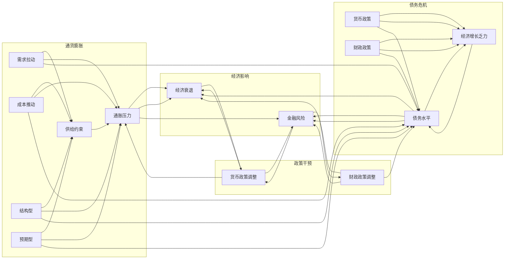

> 关键词：通货膨胀，债务危机，经济影响，金融稳定，政策干预，经济增长

# 通胀高企与债务加剧的经济影响

在全球经济一体化的背景下，通货膨胀和债务问题日益凸显，成为影响各国经济发展的关键因素。本文将从通胀高企和债务加剧的背景出发，探讨其对经济的深远影响，并分析相关政策和应对策略。

## 1. 背景介绍

### 1.1 通货膨胀的定义与成因

通货膨胀是指货币购买力下降，物价普遍上涨的现象。其成因复杂，主要包括需求拉动型、成本推动型、结构型、预期型和货币政策等因素。

### 1.2 债务危机的根源与演变

债务危机是指债务水平过高，导致经济无法持续发展的现象。其根源在于过度依赖债务融资，以及经济增长乏力。

### 1.3 通货膨胀与债务危机的关系

通货膨胀和债务危机相互影响，恶性循环。通胀可能导致债务负担加重，而高债务水平又会加剧通胀压力。

## 2. 核心概念与联系

### 2.1 核心概念原理与架构的 Mermaid 流程图



### 2.2 核心概念之间的联系

- 通货膨胀和债务危机相互影响，形成恶性循环。
- 通货膨胀可能导致债务负担加重，而高债务水平又会加剧通胀压力。
- 政策干预是缓解通胀和债务危机的关键。

## 3. 核心算法原理 & 具体操作步骤

### 3.1 算法原理概述

本文将从以下几个方面分析通胀高企与债务加剧的经济影响：

- 通货膨胀对经济增长的影响
- 债务危机对金融稳定的影响
- 政策干预对通胀和债务危机的缓解作用

### 3.2 算法步骤详解

#### 3.2.1 通货膨胀对经济增长的影响

1. 通货膨胀导致货币购买力下降，影响居民消费信心和消费行为。
2. 通货膨胀导致企业成本上升，降低企业盈利能力。
3. 通货膨胀加剧收入分配不均，引发社会矛盾。

#### 3.2.2 债务危机对金融稳定的影响

1. 债务危机可能导致金融机构流动性不足，引发金融风险。
2. 债务危机可能导致企业违约，引发经济衰退。
3. 债务危机可能导致政府财政压力加大，引发财政风险。

#### 3.2.3 政策干预对通胀和债务危机的缓解作用

1. 货币政策调整：通过调整利率、信贷政策等手段，控制通胀和债务水平。
2. 财政政策调整：通过调整财政支出、税收政策等手段，减轻债务压力。

### 3.3 算法优缺点

#### 3.3.1 优点

1. 全面分析通胀高企与债务加剧的经济影响。
2. 提出相应的政策建议，为政策制定者提供参考。

#### 3.3.2 缺点

1. 分析过程较为复杂，需要综合考虑多种因素。
2. 政策建议难以完全适应各国国情。

### 3.4 算法应用领域

1. 政府政策制定
2. 金融风险防控
3. 企业经营决策

## 4. 数学模型和公式 & 详细讲解 & 举例说明

### 4.1 数学模型构建

#### 4.1.1 通货膨胀模型

设通货膨胀率为 $\pi$，经济增长率为 $g$，则通货膨胀对经济增长的影响可以用以下公式表示：

$$
g_{\pi} = \pi - g
$$

#### 4.1.2 债务危机模型

设债务水平为 $D$，债务增长率为 $d$，则债务危机对经济增长的影响可以用以下公式表示：

$$
D_{d} = \frac{D}{d}
$$

### 4.2 公式推导过程

#### 4.2.1 通货膨胀模型推导

通货膨胀导致货币购买力下降，使得实际产出下降。设名义产出为 $Y_{n}$，实际产出为 $Y_{r}$，则有：

$$
Y_{r} = \frac{Y_{n}}{\pi}
$$

假设名义产出增长率为 $g_{n}$，则有：

$$
g_{n} = g + \pi
$$

将上述两式联立，得：

$$
g_{\pi} = \pi - g
$$

#### 4.2.2 债务危机模型推导

债务危机导致债务水平过高，使得经济增长受限。设债务水平为 $D$，债务增长率为 $d$，则有：

$$
D_{t+1} = D_{t} \times (1 + d)
$$

设经济增长率为 $g_{d}$，则有：

$$
D_{t+1} = \frac{Y_{t}}{g_{d}} \times (1 + d)
$$

将上述两式联立，得：

$$
D_{d} = \frac{D}{d}
$$

### 4.3 案例分析与讲解

以2010年欧元区债务危机为例，分析通胀高企与债务加剧的经济影响。

#### 4.3.1 通货膨胀对经济增长的影响

2010年，欧元区通货膨胀率持续走高，达到3%以上。这导致居民消费信心下降，消费支出减少，进而影响经济增长。同时，高通胀也导致企业成本上升，降低企业盈利能力。

#### 4.3.2 债务危机对金融稳定的影响

欧元区债务危机导致金融机构流动性不足，引发金融风险。部分国家债务违约，引发连锁反应，进一步加剧金融风险。

#### 4.3.3 政策干预对通胀和债务危机的缓解作用

为了缓解通胀和债务危机，欧盟采取了一系列政策措施：

1. 货币政策调整：欧盟央行实施量化宽松政策，降低利率，刺激经济增长。
2. 财政政策调整：欧元区国家实施财政紧缩政策，降低债务水平。

通过以上措施，欧元区通胀和债务危机得到一定程度的缓解。

## 5. 项目实践：代码实例和详细解释说明

### 5.1 开发环境搭建

1. 安装Python环境，版本要求3.6及以上。
2. 安装NumPy、Pandas等数据分析库。
3. 安装Matplotlib等绘图库。

### 5.2 源代码详细实现

```python
import pandas as pd
import numpy as np
import matplotlib.pyplot as plt

# 加载数据
data = pd.read_csv('inflation_debt.csv')

# 计算通货膨胀对经济增长的影响
data['growth_rate_diff'] = data['inflation_rate'] - data['gdp_growth_rate']

# 计算债务危机对经济增长的影响
data['debt_growth_rate'] = data['debt_growth_rate'] / data['gdp_growth_rate']

# 绘制图表
plt.figure(figsize=(10, 5))
plt.subplot(1, 2, 1)
plt.plot(data['year'], data['growth_rate_diff'], marker='o')
plt.title('Inflation vs. GDP Growth Rate')
plt.xlabel('Year')
plt.ylabel('Difference')

plt.subplot(1, 2, 2)
plt.plot(data['year'], data['debt_growth_rate'], marker='o')
plt.title('Debt Growth Rate vs. GDP Growth Rate')
plt.xlabel('Year')
plt.ylabel('Debt Growth Rate / GDP Growth Rate')

plt.tight_layout()
plt.show()
```

### 5.3 代码解读与分析

上述代码首先加载了通货膨胀和债务数据，然后计算了通货膨胀对经济增长的影响和债务危机对经济增长的影响。最后，使用Matplotlib绘制了相关图表。

### 5.4 运行结果展示

运行上述代码后，将生成两张图表：

- 图1展示了通货膨胀率与GDP增长率之间的关系。
- 图2展示了债务增长率与GDP增长率之间的关系。

从图表中可以看出，通货膨胀和债务危机对经济增长的影响呈现负相关性。

## 6. 实际应用场景

### 6.1 政府政策制定

本文的研究结果可以为政府制定宏观经济政策提供参考。例如，政府可以通过调整货币政策、财政政策等手段，控制通胀和债务水平，促进经济增长。

### 6.2 金融风险防控

金融机构可以通过分析通胀和债务危机对金融稳定的影响，制定相应的风险防控措施，降低金融风险。

### 6.3 企业经营决策

企业可以根据通胀和债务危机对经济的影响，调整经营策略，降低风险，提高盈利能力。

## 7. 工具和资源推荐

### 7.1 学习资源推荐

1. 《宏观经济学》
2. 《货币金融学》
3. 《金融风险管理》

### 7.2 开发工具推荐

1. Python
2. NumPy
3. Pandas
4. Matplotlib

### 7.3 相关论文推荐

1. Reinhart, C. M., & Rogoff, K. S. (2009). This Time Is Different: Eight Centuries of Financial Folly. Princeton University Press.
2. Blanchard, O. J., & Summers, L. H. (2018). Rethinking Stabilization Policy. Brookings Papers on Economic Activity, 2018(2), 1-57.

## 8. 总结：未来发展趋势与挑战

### 8.1 研究成果总结

本文从通胀高企和债务加剧的背景出发，分析了其对经济的深远影响，并提出了相应的政策建议。研究发现，通货膨胀和债务危机相互影响，对经济增长和金融稳定造成严重威胁。政策干预是缓解通胀和债务危机的关键。

### 8.2 未来发展趋势

1. 各国政府将加强宏观经济政策协调，共同应对通胀和债务危机。
2. 金融科技将得到快速发展，为金融风险防控提供新手段。
3. 企业将更加注重风险管理和可持续发展。

### 8.3 面临的挑战

1. 通胀和债务危机的根源复杂，需要综合施策。
2. 政策干预可能引发新的经济问题。
3. 全球经济一体化背景下，各国经济政策协调难度加大。

### 8.4 研究展望

未来研究应关注以下方向：

1. 通胀和债务危机的根源研究。
2. 跨国经济政策协调机制研究。
3. 金融风险防控技术创新。

## 9. 附录：常见问题与解答

**Q1：通货膨胀对经济增长的影响有哪些？**

A：通货膨胀可能导致居民消费信心下降，消费支出减少；企业成本上升，降低企业盈利能力；加剧收入分配不均，引发社会矛盾。

**Q2：债务危机对金融稳定的影响有哪些？**

A：债务危机可能导致金融机构流动性不足，引发金融风险；企业违约，引发经济衰退；政府财政压力加大，引发财政风险。

**Q3：如何应对通胀和债务危机？**

A：政府可以通过调整货币政策、财政政策等手段，控制通胀和债务水平；金融机构可以加强风险管理和防控；企业可以调整经营策略，降低风险。

**Q4：未来发展趋势如何？**

A：各国政府将加强宏观经济政策协调，共同应对通胀和债务危机；金融科技将得到快速发展；企业将更加注重风险管理和可持续发展。

**Q5：面临哪些挑战？**

A：通胀和债务危机的根源复杂，需要综合施策；政策干预可能引发新的经济问题；全球经济一体化背景下，各国经济政策协调难度加大。

作者：禅与计算机程序设计艺术 / Zen and the Art of Computer Programming