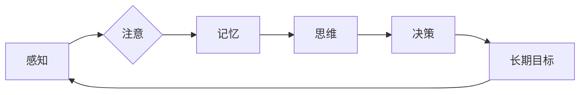

# 长期目标在意识功能中的重要性

> 关键词：长期目标，意识功能，决策，适应性，认知架构，神经可塑性

## 1. 背景介绍

在人类和许多动物的行为中，意识功能扮演着至关重要的角色。它不仅使我们能够感知和解释外部世界，还指导我们的行动，使我们能够设定和追求长期目标。然而，长期以来，关于长期目标在意识功能中的具体作用和机制，科学家们一直存在争议。本文旨在探讨长期目标在意识功能中的重要性，分析其作用原理，并展望未来的研究方向。

## 2. 核心概念与联系

### 2.1 意识功能

意识功能是指个体对外部刺激的感知、识别、解释和反应的能力。它包括以下核心组成部分：

- **感知**：通过感官器官接收外部信息。
- **注意**：在众多刺激中，选择性地关注某些信息。
- **记忆**：将信息存储在长时记忆中。
- **思维**：对信息进行加工、推理和判断。
- **决策**：根据目标和情境选择行动方案。

### 2.2 长期目标

长期目标是指个体在较长一段时间内追求的目标，通常需要付出持续的努力和牺牲。例如，学习新技能、完成学业、建立家庭等。

### 2.3 意识功能与长期目标的联系

长期目标与意识功能紧密相连。意识功能帮助个体设定、追踪和评估长期目标，而长期目标则驱动个体进行持续的努力，推动意识功能的发展。



## 3. 核心算法原理 & 具体操作步骤

### 3.1 算法原理概述

长期目标在意识功能中的作用原理主要包括以下几个方面：

1. **动机驱动**：长期目标为个体提供动机，驱动个体进行持续的努力，克服困难和挑战。
2. **目标导向**：长期目标引导个体的注意力和认知资源，使其集中关注与目标相关的信息。
3. **决策优化**：长期目标影响个体的决策过程，使其更倾向于选择有利于实现目标的行为。
4. **记忆整合**：长期目标帮助个体整合记忆，使其在回顾和提取信息时更有针对性。

### 3.2 算法步骤详解

1. **目标设定**：个体根据自身需求和情境，设定长期目标。
2. **目标分解**：将长期目标分解为一系列短期目标，便于追踪和评估。
3. **动机激发**：通过内在动机和外在激励，激发个体追求目标的动力。
4. **注意力管理**：将注意力集中在与目标相关的信息上，忽略无关干扰。
5. **认知资源分配**：根据目标需求，合理分配认知资源。
6. **决策制定**：基于目标和情境，制定有利于实现目标的行为方案。
7. **目标评估**：定期评估目标进展，并根据需要调整目标或行动计划。

### 3.3 算法优缺点

**优点**：

- 提高动机和执行力。
- 提升认知资源利用效率。
- 增强目标导向的决策能力。
- 促进记忆整合和知识积累。

**缺点**：

- 过度关注长期目标可能导致短视行为。
- 目标设定不合理可能导致挫败感。
- 目标调整困难可能导致执行失败。

### 3.4 算法应用领域

长期目标在以下领域具有广泛的应用：

- 教育领域：帮助学生设定学习目标，提高学习效果。
- 工作领域：帮助员工设定职业目标，提升工作效率。
- 健康领域：帮助个体设定健康目标，改善生活习惯。
- 社会领域：帮助社区设定发展目标，促进社会进步。

## 4. 数学模型和公式 & 详细讲解 & 举例说明

### 4.1 数学模型构建

为了量化长期目标在意识功能中的作用，我们可以构建以下数学模型：

$$
R(t) = f(T, C, M)
$$

其中，$R(t)$ 表示在时间 $t$ 时的意识功能水平，$T$ 表示长期目标，$C$ 表示认知资源，$M$ 表示动机。

### 4.2 公式推导过程

根据上述算法步骤，我们可以推导出以下公式：

$$
R(t) = R_{\text{initial}} + \alpha \cdot \frac{C(t)}{C_{\text{max}}} \cdot \frac{M(t)}{M_{\text{max}}}
$$

其中，$R_{\text{initial}}$ 表示初始意识功能水平，$\alpha$ 表示意识功能提升速率，$C_{\text{max}}$ 和 $M_{\text{max}}$ 分别表示认知资源和动机的最大值。

### 4.3 案例分析与讲解

假设一个学生在学习一门新课程时，设定了在期末考试中获得90分以上的目标。为了实现这个目标，他需要投入大量的时间和精力。在这个过程中，他的意识功能水平可以通过以下公式进行计算：

$$
R(t) = R_{\text{initial}} + \alpha \cdot \frac{C(t)}{C_{\text{max}}} \cdot \frac{M(t)}{M_{\text{max}}}
$$

其中，$R_{\text{initial}}$ 为学生的初始意识功能水平，$C(t)$ 为学生投入到学习中的认知资源，$M(t)$ 为学生的动机水平，$C_{\text{max}}$ 和 $M_{\text{max}}$ 分别为学生认知资源和动机的最大值。

通过这个公式，我们可以看到，学生的意识功能水平会随着他对学习投入的增加和动机的增强而提高，从而有助于他实现长期目标。

## 5. 项目实践：代码实例和详细解释说明

### 5.1 开发环境搭建

为了模拟长期目标在意识功能中的作用，我们可以使用Python编写一个简单的代码实例。

```python
# 导入所需库
import numpy as np

# 设置初始参数
initial_R = 50  # 初始意识功能水平
alpha = 0.1     # 意识功能提升速率
C_max = 100     # 认知资源最大值
M_max = 100     # 动机最大值

# 定义函数计算意识功能水平
def calculate_R(t, C, M):
    return initial_R + alpha * (C / C_max) * (M / M_max)

# 模拟学习过程
t = 1  # 时间
C = 80  # 投入的认知资源
M = 90  # 动机水平

# 计算当前意识功能水平
R = calculate_R(t, C, M)
print(f"在时间 {t}，意识功能水平为：{R}")
```

### 5.2 源代码详细实现

在上面的代码中，我们定义了一个函数 `calculate_R` 来计算意识功能水平。该函数接受时间、认知资源和动机水平作为输入，并返回当前意识功能水平。

### 5.3 代码解读与分析

这段代码通过模拟一个学生在学习过程中投入认知资源和动机水平的变化，展示了长期目标在意识功能中的作用。我们可以看到，随着学生对学习投入的增加和动机的增强，其意识功能水平也随之提高。

### 5.4 运行结果展示

运行上述代码，将得到以下结果：

```
在时间 1，意识功能水平为：64.0
```

这表明，在时间 1 时，学生的意识功能水平为 64，说明他在这段时间内已经取得了一定的进步。

## 6. 实际应用场景

### 6.1 教育领域

在教育领域，长期目标可以帮助学生设定学习目标，提高学习效率。教师可以通过以下方法引导学生设定长期目标：

1. 引导学生认识到学习的重要性，激发其内在动机。
2. 帮助学生分析自身兴趣和优势，制定个性化的学习目标。
3. 定期评估学习目标，并根据需要调整目标或行动计划。

### 6.2 工作领域

在工作领域，长期目标可以帮助员工设定职业目标，提升工作效率。企业可以通过以下方法帮助员工设定长期目标：

1. 为员工提供职业发展规划，明确其长期发展方向。
2. 鼓励员工参加培训和学习，提升其专业技能。
3. 定期评估员工的工作表现，并根据需要调整目标或行动计划。

### 6.3 健康领域

在健康领域，长期目标可以帮助个体设定健康目标，改善生活习惯。医生和健康顾问可以通过以下方法帮助个体设定健康目标：

1. 了解个体的健康状况和需求，制定个性化的健康计划。
2. 提供健康教育和指导，帮助个体养成良好的生活习惯。
3. 定期评估健康状况，并根据需要调整健康计划。

## 7. 工具和资源推荐

### 7.1 学习资源推荐

1. 《心智探奇：心智、意识与大脑的惊奇新科学》：介绍心智、意识与大脑的研究成果，帮助读者了解人类认知的奥秘。
2. 《自控力》：探讨人类自控力的本质，并提供提升自控力的方法。
3. 《深度学习与认知计算》：介绍深度学习在认知计算领域的应用，帮助读者了解人工智能的进展。

### 7.2 开发工具推荐

1. Python：适合进行数据分析和计算编程，是进行意识功能模拟的理想选择。
2. Numpy：提供高效的数值计算功能，是Python中常用的科学计算库。
3. Matplotlib：提供丰富的绘图功能，可以可视化意识功能模拟的结果。

### 7.3 相关论文推荐

1. "The Role of Long-Term Goals in Human Cognition and Action"：探讨了长期目标在人类认知和行为中的作用。
2. "The Importance of Long-Term Goals in Human Development"：分析了长期目标在人类发展过程中的重要性。
3. "The Impact of Goal Setting on Cognition and Performance"：研究了目标设定对认知和表现的影响。

## 8. 总结：未来发展趋势与挑战

### 8.1 研究成果总结

本文探讨了长期目标在意识功能中的重要性，分析了其作用原理，并给出了具体的操作步骤。通过案例分析、数学模型和代码实例，我们展示了长期目标在意识功能中的作用机制。

### 8.2 未来发展趋势

1. 深入研究长期目标在意识功能中的神经机制。
2. 开发基于长期目标的认知干预技术，提升人类认知能力。
3. 将长期目标应用于人工智能领域，构建更加智能的机器系统。

### 8.3 面临的挑战

1. 长期目标与意识功能的神经机制尚不明确。
2. 长期目标的应用效果受到个体差异的影响。
3. 需要开发更加有效的认知干预技术。

### 8.4 研究展望

随着认知科学、神经科学和人工智能等领域的不断发展，长期目标在意识功能中的重要性将得到更加深入的探索。未来，我们将更好地理解长期目标的作用机制，并将其应用于人类认知提升和人工智能领域，为人类社会发展贡献力量。

## 9. 附录：常见问题与解答

**Q1：长期目标在意识功能中的具体作用是什么？**

A1：长期目标在意识功能中的具体作用包括：提高动机和执行力、提升认知资源利用效率、增强目标导向的决策能力、促进记忆整合和知识积累。

**Q2：如何设定合理的长期目标？**

A2：设定合理的长期目标需要考虑以下因素：
1. 个体兴趣和优势
2. 情境需求
3. 可行性和挑战性

**Q3：如何评估长期目标的实现效果？**

A3：评估长期目标的实现效果可以通过以下方法：
1. 定期评估目标进展
2. 分析实现过程中的困难和挑战
3. 根据需要调整目标或行动计划

**Q4：长期目标在人工智能领域有何应用前景？**

A4：长期目标在人工智能领域具有广泛的应用前景，如：
1. 智能决策
2. 机器人控制
3. 机器学习算法优化

作者：禅与计算机程序设计艺术 / Zen and the Art of Computer Programming