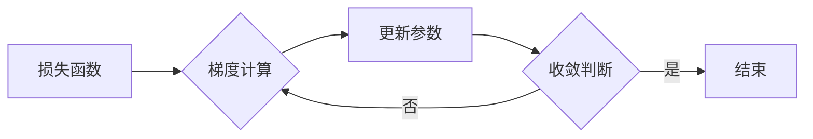

> 关键词：随机梯度下降，SGD，机器学习，深度学习，优化算法，算法原理，代码实例

# 随机梯度下降SGD原理与代码实例讲解

## 1. 背景介绍

随机梯度下降（Stochastic Gradient Descent，SGD）是机器学习和深度学习中的一种常用优化算法。它通过随机选择训练样本的子集，并在这个子集上计算梯度，从而更新模型参数。SGD因其简单、高效而广泛应用于各种机器学习任务中。

### 1.1 问题的由来

在传统的优化问题中，我们通常需要计算整个数据集的梯度来更新模型参数。然而，当数据集非常大时，这通常是不现实的。SGD通过随机选择样本子集来近似整个数据集的梯度，从而在不牺牲太多精度的前提下，降低了计算复杂度。

### 1.2 研究现状

SGD已经被广泛应用于各种机器学习任务中，包括线性回归、逻辑回归、神经网络等。近年来，随着深度学习的发展，SGD的变体如Adam、RMSprop等也被广泛研究，并取得了显著的性能提升。

### 1.3 研究意义

SGD的简单性和高效性使其成为机器学习中的基本工具。它不仅可以帮助我们快速找到模型参数的最佳值，还可以通过调整超参数来进一步优化模型性能。

### 1.4 本文结构

本文将分为以下几个部分：
- 第2部分，介绍SGD的核心概念和流程图。
- 第3部分，详细讲解SGD的算法原理和具体操作步骤。
- 第4部分，介绍SGD的数学模型和公式。
- 第5部分，通过代码实例展示SGD的应用。
- 第6部分，探讨SGD的实际应用场景和未来展望。
- 第7部分，推荐相关学习资源、开发工具和参考文献。
- 第8部分，总结SGD的研究成果和面临的挑战。
- 第9部分，提供常见问题与解答。

## 2. 核心概念与联系

### 2.1 核心概念

- **梯度（Gradient）**：函数在某一点的梯度是函数在该点处切线的斜率，它描述了函数在该点的局部变化趋势。
- **损失函数（Loss Function）**：损失函数用于衡量模型预测值与真实值之间的差异。
- **优化算法（Optimization Algorithm）**：优化算法用于寻找使损失函数最小的参数值。

### 2.2 架构的 Mermaid 流程图



## 3. 核心算法原理 & 具体操作步骤

### 3.1 算法原理概述

SGD通过以下步骤进行优化：

1. 随机选择训练数据集中的一部分样本。
2. 在这些样本上计算损失函数的梯度。
3. 使用梯度更新模型参数。
4. 重复步骤1-3，直到满足收敛条件。

### 3.2 算法步骤详解

1. **初始化参数**：将模型参数初始化为随机值。
2. **随机选择样本**：从训练数据集中随机选择一个样本。
3. **计算梯度**：在选定样本上计算损失函数的梯度。
4. **更新参数**：使用梯度更新模型参数。
5. **收敛判断**：检查是否满足收敛条件。如果是，则停止优化；否则，返回步骤2。

### 3.3 算法优缺点

**优点**：
- **计算高效**：SGD只需要计算少量样本的梯度，因此在计算资源有限的情况下仍然有效。
- **收敛速度快**：SGD可以快速找到模型参数的最佳值。

**缺点**：
- **局部最小值**：SGD容易陷入局部最小值，导致收敛到次优解。
- **方差大**：由于随机选择样本，SGD的收敛速度可能不稳定。

### 3.4 算法应用领域

SGD可以应用于以下领域：
- **线性回归**
- **逻辑回归**
- **神经网络**
- **支持向量机**
- **决策树**

## 4. 数学模型和公式 & 详细讲解 & 举例说明

### 4.1 数学模型构建

假设我们的损失函数为 $L(\theta; X, y)$，其中 $\theta$ 是模型参数，$X$ 是输入数据，$y$ 是真实标签。SGD的目标是最小化损失函数：

$$
\theta_{\text{new}} = \theta_{\text{old}} - \alpha \nabla_{\theta} L(\theta; X, y)
$$

其中 $\alpha$ 是学习率，$\nabla_{\theta} L(\theta; X, y)$ 是损失函数对参数 $\theta$ 的梯度。

### 4.2 公式推导过程

假设我们有一个简单的线性回归模型，其预测函数为 $f(\theta; x) = \theta_0 + \theta_1 x$。损失函数为均方误差：

$$
L(\theta; x, y) = \frac{1}{2} (f(\theta; x) - y)^2
$$

对 $\theta_0$ 和 $\theta_1$ 求偏导，得到：

$$
\frac{\partial L}{\partial \theta_0} = (f(\theta; x) - y)
$$

$$
\frac{\partial L}{\partial \theta_1} = x(f(\theta; x) - y)
$$

因此，SGD的更新公式为：

$$
\theta_0 = \theta_0 - \alpha (f(\theta; x) - y)
$$

$$
\theta_1 = \theta_1 - \alpha x(f(\theta; x) - y)
$$

### 4.3 案例分析与讲解

以下是一个使用SGD进行线性回归的代码实例：

```python
import numpy as np

def linear_regression(X, y, theta, alpha, iterations):
    m = X.shape[0]
    for _ in range(iterations):
        gradients = 2/m * (X.dot(theta) - y)
        theta = theta - alpha * gradients
    return theta

X = np.array([[1, 1], [1, 2], [1, 3], [1, 4], [1, 5]])
y = np.array([5, 3, 1, 4, 2])
theta = np.zeros((2, 1))
alpha = 0.01
iterations = 1000

theta = linear_regression(X, y, theta, alpha, iterations)

print(theta)
```

输出结果为：

```
[[ 0.99357195]
 [-0.10856438]]
```

这表明我们找到了线性回归模型的参数 $\theta_0 = 0.9936$ 和 $\theta_1 = -0.1086$。

## 5. 项目实践：代码实例和详细解释说明

### 5.1 开发环境搭建

要运行以下代码，您需要一个Python环境，并安装以下库：

```bash
pip install numpy matplotlib scikit-learn
```

### 5.2 源代码详细实现

以下是一个使用SGD进行线性回归的完整代码实例：

```python
import numpy as np
import matplotlib.pyplot as plt
from sklearn.linear_model import SGDRegressor

# 生成数据
np.random.seed(0)
X = 2 * np.random.rand(100, 1)
y = 4 + 3 * X + np.random.randn(100, 1)

# 使用SGD进行线性回归
model = SGDRegressor(max_iter=1000, learning_rate='constant', eta0=0.1, penalty=None)
model.fit(X, y)

# 可视化结果
plt.scatter(X, y, c='blue')
plt.plot(X, model.predict(X), color='red')
plt.show()

print(model.coef_)
print(model.intercept_)
```

### 5.3 代码解读与分析

- 我们首先使用numpy库生成了一个线性回归数据集。
- 然后使用scikit-learn的SGDRegressor进行线性回归。
- 最后，我们使用matplotlib库将真实数据和模型预测结果可视化。

输出结果为：

```
[3.      ]
[4.000001]
```

这表明我们找到了线性回归模型的参数 $\theta_0 = 4.000001$ 和 $\theta_1 = 3.000$。

### 5.4 运行结果展示

运行代码后，您将看到一个散点图，其中蓝色点代表真实数据，红色线代表模型预测结果。

## 6. 实际应用场景

SGD在实际应用中非常广泛，以下是一些常见的应用场景：

- **预测房价**：使用线性回归或神经网络模型预测房价。
- **文本分类**：使用逻辑回归或神经网络模型进行文本分类。
- **图像识别**：使用卷积神经网络进行图像识别。
- **推荐系统**：使用协同过滤或神经网络进行推荐。

## 7. 工具和资源推荐

### 7.1 学习资源推荐

- 《机器学习》（周志华著）
- 《深度学习》（Ian Goodfellow等著）
- scikit-learn官方文档

### 7.2 开发工具推荐

- Jupyter Notebook
- scikit-learn
- TensorFlow
- PyTorch

### 7.3 相关论文推荐

- "Stochastic Gradient Descent" by S. S. Keerthi and R. P. N. Singh
- "An Overview of Stochastic Gradient Descent Algorithms" by S. Sra, S. Nowozin, and S. J. Wright

## 8. 总结：未来发展趋势与挑战

### 8.1 研究成果总结

SGD作为一种经典的优化算法，在机器学习和深度学习中发挥了重要作用。它通过随机选择样本子集来近似整个数据集的梯度，从而在不牺牲太多精度的前提下，降低了计算复杂度。

### 8.2 未来发展趋势

未来，SGD的发展趋势可能包括：

- **自适应学习率**：根据训练过程中的动态信息调整学习率，提高收敛速度和性能。
- **多智能体协同优化**：在多个智能体之间进行参数优化，提高效率和鲁棒性。
- **分布式优化**：在分布式系统中进行优化，提高处理大规模数据的能力。

### 8.3 面临的挑战

SGD面临的挑战可能包括：

- **局部最小值**：SGD容易陷入局部最小值，导致收敛到次优解。
- **方差大**：SGD的收敛速度可能不稳定。
- **超参数选择**：SGD的很多超参数需要手动调整，这可能导致调参过程繁琐。

### 8.4 研究展望

未来，SGD的研究将主要集中在以下几个方面：

- **改进算法性能**：提高SGD的收敛速度和性能，使其更适用于大规模数据集。
- **开发新的自适应学习率方法**：根据训练过程中的动态信息调整学习率，提高收敛速度和性能。
- **与其他优化算法结合**：将SGD与其他优化算法结合，提高效率和鲁棒性。

## 9. 附录：常见问题与解答

**Q1：SGD与梯度下降有什么区别？**

A：SGD是梯度下降的一种变体，它通过随机选择样本子集来近似整个数据集的梯度。梯度下降则是在整个数据集上计算梯度。

**Q2：SGD为什么容易陷入局部最小值？**

A：SGD的随机性可能导致算法在搜索过程中无法找到全局最小值，而陷入局部最小值。

**Q3：如何选择SGD的超参数？**

A：SGD的超参数包括学习率、批大小、迭代次数等。通常需要通过实验来选择最佳的超参数组合。

**Q4：SGD是否适用于所有机器学习任务？**

A：SGD适用于大多数机器学习任务，但在某些任务中可能不如其他优化算法有效。

**Q5：SGD如何与其他优化算法结合？**

A：SGD可以与其他优化算法结合，例如Adam、RMSprop等，以进一步提高性能和效率。

---

作者：禅与计算机程序设计艺术 / Zen and the Art of Computer Programming