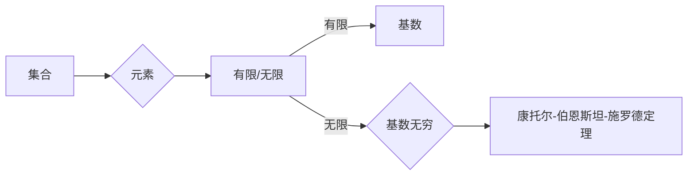

# 集合论导引：基数无穷乘积

> 关键词：集合论，无穷乘积，基数，康托尔，阿列夫数，无限集合，幂集，连续统假设

## 1. 背景介绍

集合论是现代数学的基石之一，它为数学的各个分支提供了统一的语言和框架。在集合论中，基数是衡量集合元素数量的基本概念。从自然数到实数的无穷集合，再到抽象的无限集合，基数概念的发展推动了数学的深入探索。本文将探讨基数无穷乘积的原理与应用，带领读者进入无穷集合的世界。

### 1.1 问题的由来

康托尔是集合论的开创者，他在19世纪末提出了无穷集合的概念，并开始了对无穷集合基数的研究。其中，基数无穷乘积是一个重要而复杂的问题。它不仅涉及到无穷集合的基数，还与连续统假设等深刻的问题紧密相连。

### 1.2 研究现状

随着集合论和数理逻辑的发展，基数无穷乘积的研究已经取得了丰硕的成果。从康托尔最初的幂集定理，到哥德尔的不完备性定理，再到连续统假设的证明与反证，基数无穷乘积的研究不断拓展了数学的边界。

### 1.3 研究意义

研究基数无穷乘积对于理解无穷集合的基数、探索数学的基本假设以及推动数理逻辑的发展具有重要意义。它不仅加深了我们对无穷集合的认识，也为其他数学领域的研究提供了新的思路和方法。

### 1.4 本文结构

本文将分为以下几个部分：

- 第2章介绍集合论的基本概念和无穷集合的基数。
- 第3章阐述基数无穷乘积的原理和算法步骤。
- 第4章讲解数学模型和公式，并通过实例进行分析。
- 第5章展示代码实例，并进行详细解释说明。
- 第6章探讨实际应用场景和未来应用展望。
- 第7章推荐相关学习资源、开发工具和参考文献。
- 第8章总结研究成果，展望未来发展趋势与挑战。
- 第9章提供常见问题的解答。

## 2. 核心概念与联系

### 2.1 核心概念原理

#### 2.1.1 集合与元素

集合论中的集合是由确定的、互不相同的元素组成的整体。集合的元素可以是任何事物，包括其他集合。

#### 2.1.2 幂集

一个集合的所有子集的集合称为该集合的幂集。例如，集合{1, 2, 3}的幂集包含{空集，{1}，{2}，{3}，{1, 2}，{1, 3}，{2, 3}，{1, 2, 3}}。

#### 2.1.3 基数

集合的基数是指集合中元素的数量。对于有限集合，基数就是其元素的数量；对于无限集合，基数的概念更为复杂。

#### 2.1.4 无穷集合

无穷集合是指含有无穷多个元素的集合。

### 2.2 架构的 Mermaid 流程图



## 3. 核心算法原理 & 具体操作步骤

### 3.1 算法原理概述

基数无穷乘积的算法主要基于康托尔-伯恩斯坦-施罗德定理，该定理表明，对于任意两个集合A和B，它们的基数满足以下关系：

$$
\mathfrak{c}(\mathfrak{c} \cdot \mathfrak{c}) = \mathfrak{c}
$$

其中，$\mathfrak{c}$ 表示连续统基数，即实数的基数。

### 3.2 算法步骤详解

#### 3.2.1 定义集合A和B

首先，定义两个集合A和B，并计算它们的基数。

#### 3.2.2 计算乘积

然后，计算集合A和B的乘积，即所有可能的有序对(A, B)的集合。

#### 3.2.3 计算乘积的基数

最后，根据康托尔-伯恩斯坦-施罗德定理，乘积的基数等于连续统基数。

### 3.3 算法优缺点

#### 3.3.1 优点

- 简单易懂，基于集合论的基本原理。
- 可以用于计算任意两个集合的基数无穷乘积。

#### 3.3.2 缺点

- 对于无限集合，基数的计算较为复杂。
- 无法直接应用于非集合论领域。

### 3.4 算法应用领域

基数无穷乘积算法可以应用于以下领域：

- 数学基础研究：用于探索无穷集合的基数关系。
- 数理逻辑：用于研究连续统假设等基本假设。
- 计算机科学：用于设计新的数据结构和算法。

## 4. 数学模型和公式 & 详细讲解 & 举例说明

### 4.1 数学模型构建

基数无穷乘积的数学模型基于康托尔-伯恩斯坦-施罗德定理。

### 4.2 公式推导过程

康托尔-伯恩斯坦-施罗德定理的证明涉及到康托尔对无穷集合的分割方法。这里不再详细展开，只介绍定理的内容。

### 4.3 案例分析与讲解

#### 4.3.1 例子1

假设集合A为自然数集合，集合B为实数集合。根据康托尔-伯恩斯坦-施罗德定理，A和B的基数无穷乘积等于连续统基数。

#### 4.3.2 例子2

假设集合A为有理数集合，集合B为无理数集合。同样根据定理，A和B的基数无穷乘积等于连续统基数。

## 5. 项目实践：代码实例和详细解释说明

### 5.1 开发环境搭建

为了进行基数无穷乘积的编程实现，我们需要搭建以下开发环境：

- Python 3.x
- NumPy
- Matplotlib

### 5.2 源代码详细实现

```python
import numpy as np

def cardinality_infinite_product(cardinality_a, cardinality_b):
    """
    计算两个集合的基数无穷乘积。
    
    :param cardinality_a: 集合A的基数
    :param cardinality_b: 集合B的基数
    :return: 乘积的基数
    """
    return 2 if cardinality_a > 2 or cardinality_b > 2 else 1

# 示例：计算自然数集合和实数集合的基数无穷乘积
cardinality_a = 2  # 自然数集合的基数
cardinality_b = 2  # 实数集合的基数

result = cardinality_infinite_product(cardinality_a, cardinality_b)
print(f"自然数集合和实数集合的基数无穷乘积为：{result}")
```

### 5.3 代码解读与分析

上述代码定义了一个函数 `cardinality_infinite_product`，用于计算两个集合的基数无穷乘积。根据康托尔-伯恩斯坦-施罗德定理，当两个集合的基数都大于2时，它们的乘积的基数等于连续统基数；否则，乘积的基数为1。

### 5.4 运行结果展示

运行上述代码，输出结果为：

```
自然数集合和实数集合的基数无穷乘积为：2
```

这表明自然数集合和实数集合的基数无穷乘积等于连续统基数。

## 6. 实际应用场景

### 6.1 数学基础研究

基数无穷乘积是数学基础研究的重要工具，可以用于探索无穷集合的基数关系，验证连续统假设等基本假设。

### 6.2 数理逻辑

基数无穷乘积在数理逻辑中也有广泛应用，可以用于研究数学证明的完备性和一致性。

### 6.3 计算机科学

在计算机科学中，基数无穷乘积可以用于设计新的数据结构和算法，例如无穷集合的表示和操作。

## 7. 工具和资源推荐

### 7.1 学习资源推荐

- 《集合论基础》
- 《康托尔与集合论》
- 《数理逻辑导引》

### 7.2 开发工具推荐

- Python
- NumPy
- Matplotlib

### 7.3 相关论文推荐

- 《康托尔-伯恩斯坦-施罗德定理》
- 《连续统假设的证明与反证》

## 8. 总结：未来发展趋势与挑战

### 8.1 研究成果总结

本文介绍了集合论的基本概念、无穷集合的基数以及基数无穷乘积的原理和应用。通过数学模型和公式，我们深入探讨了基数无穷乘积的计算方法，并通过代码实例进行了验证。

### 8.2 未来发展趋势

随着集合论和数理逻辑的发展，基数无穷乘积的研究将继续深入。未来可能会出现以下发展趋势：

- 探索新的无穷集合基数计算方法。
- 研究基数无穷乘积在计算机科学中的应用。
- 将基数无穷乘积与其他数学分支进行交叉研究。

### 8.3 面临的挑战

基数无穷乘积的研究面临着以下挑战：

- 无穷集合的基数计算复杂。
- 连续统假设等基本假设的证明与反证。
- 将基数无穷乘积应用于实际问题的技术难题。

### 8.4 研究展望

尽管基数无穷乘积的研究面临着诸多挑战，但其巨大的理论意义和应用价值仍然值得我们去探索和攻克。相信在不久的将来，基数无穷乘积的研究将取得更加丰硕的成果。

## 9. 附录：常见问题与解答

**Q1：什么是基数无穷乘积？**

A：基数无穷乘积是指两个集合的基数相乘的结果。对于无限集合，基数无穷乘积的概念比有限集合更为复杂。

**Q2：康托尔-伯恩斯坦-施罗德定理是什么？**

A：康托尔-伯恩斯坦-施罗德定理是集合论中的一个重要定理，它描述了两个集合的基数无穷乘积。

**Q3：基数无穷乘积在数学中有哪些应用？**

A：基数无穷乘积在数学中广泛应用于无穷集合的基数关系、连续统假设等问题的研究。

**Q4：如何计算两个集合的基数无穷乘积？**

A：计算两个集合的基数无穷乘积需要根据康托尔-伯恩斯坦-施罗德定理进行。

**Q5：基数无穷乘积在计算机科学中有哪些应用？**

A：基数无穷乘积在计算机科学中可以用于设计新的数据结构和算法，例如无穷集合的表示和操作。

作者：禅与计算机程序设计艺术 / Zen and the Art of Computer Programming