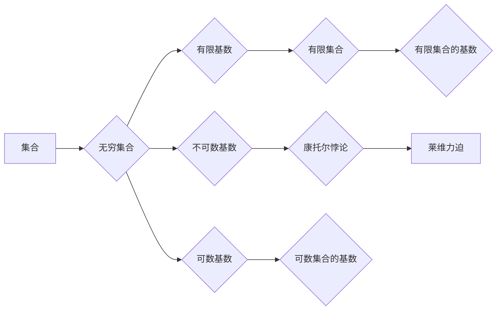

# 集合论导引：莱维力迫扩张

> 关键词：集合论，莱维力迫，扩张，无穷，基数，康托尔悖论，连续统假设，数理逻辑

## 1. 背景介绍

集合论是现代数学的基石，它为数学提供了一个统一的框架来处理对象和它们的相互关系。自康托尔提出无穷的概念以来，集合论的发展经历了从直觉主义到形式主义，再到公理化体系的转变。莱维力迫扩张是集合论中的一个重要概念，它不仅揭示了无穷的复杂性和丰富性，也引发了关于无穷基数和连续统假设的深刻讨论。

### 1.1 问题的由来

在康托尔提出无穷概念后不久，他就遇到了一个悖论，即康托尔悖论。这个悖论表明，在集合论中，某些集合的存在是不可否认的，但它们的存在性与集合论的公理体系相矛盾。为了解决这一问题，莱维提出了力迫的概念，这是一种构造无穷集合的方法。

### 1.2 研究现状

莱维力迫扩张的研究已经历了数十年的发展。在现代数学中，力迫被广泛应用于分析学、拓扑学和逻辑学等领域。它提供了一种处理悖论和无限集合的工具，同时也为无穷的数学理论提供了新的视角。

### 1.3 研究意义

莱维力迫扩张的研究对于理解无穷的本质、发展集合论的理论体系以及探索无穷集合的结构具有重要意义。它不仅深化了我们对无穷的认识，也为其他数学分支的发展提供了新的动力。

### 1.4 本文结构

本文将分为以下几个部分：
- 第2部分，介绍集合论的基本概念和莱维力迫的定义。
- 第3部分，详细阐述莱维力迫扩张的原理和操作步骤。
- 第4部分，通过数学模型和公式展示莱维力迫扩张的应用。
- 第5部分，给出莱维力迫扩张的代码实例和解释说明。
- 第6部分，探讨莱维力迫扩张在实际应用场景中的意义。
- 第7部分，推荐相关学习资源和开发工具。
- 第8部分，总结莱维力迫扩张的未来发展趋势和挑战。
- 第9部分，提供常见问题的解答。

## 2. 核心概念与联系

### 2.1 集合论基本概念

在介绍莱维力迫之前，我们需要先了解一些集合论的基本概念。

- **集合**：一组对象组成的整体。
- **元素**：集合中的个体对象。
- **空集**：不包含任何元素的集合。
- **无穷集合**：元素数量无限多的集合。
- **基数**：集合中元素的数量，也称为集合的势。

### 2.2 莱维力迫的定义

莱维力迫是康托尔和莱维在研究无穷集合时提出的一种构造方法。它通过定义一个力迫过程，使得某些集合的存在性得以证明。

### 2.3 核心概念原理和架构的 Mermaid 流程图



## 3. 核心算法原理 & 具体操作步骤

### 3.1 算法原理概述

莱维力迫是一种通过定义一个力迫过程来构造无穷集合的方法。它通过一系列的“选择”操作，使得集合的某个属性得以满足。

### 3.2 算法步骤详解

1. **定义力迫过程**：首先，我们需要定义一个力迫过程，包括一个域、一个选择函数和一个条件。
2. **执行选择操作**：在力迫过程中，根据条件，选择函数从域中选择元素，形成新的集合。
3. **终止条件**：当满足某个终止条件时，力迫过程结束。
4. **构造无穷集合**：通过力迫过程，我们可以构造出满足特定条件的无穷集合。

### 3.3 算法优缺点

莱维力迫的优点在于它提供了一种构造无穷集合的方法，可以帮助我们解决集合论中的悖论。然而，莱维力迫的缺点在于它是一个复杂的构造过程，需要严格的数学证明。

### 3.4 算法应用领域

莱维力迫在集合论、分析学和拓扑学等领域有广泛的应用。

## 4. 数学模型和公式 & 详细讲解 & 举例说明

### 4.1 数学模型构建

莱维力迫的数学模型可以通过以下公式来表示：

$$
\phi(x) = \bigcup_{\alpha \in A} \{ y \in B : P(y, x) \}
$$

其中，$A$ 是域，$B$ 是选择函数的值域，$P$ 是条件。

### 4.2 公式推导过程

莱维力迫的公式推导过程涉及集合论和数理逻辑的知识。具体推导过程可以参考相关数学文献。

### 4.3 案例分析与讲解

以下是一个莱维力迫的简单例子：

假设我们有一个集合 $A = \{0, 1, 2, 3, \ldots\}$，我们想要构造一个无穷集合 $B$，使得 $B$ 中的每个元素都是 $A$ 中元素的平方。

我们可以定义一个选择函数 $f(x)$，使得 $f(x) = x^2$。然后，我们定义一个条件 $P(y, x)$，使得 $y \in B$ 当且仅当 $y$ 是 $x$ 的平方。

根据莱维力迫的公式，我们可以得到：

$$
B = \bigcup_{x \in A} \{ y \in \mathbb{N} : y = x^2 \}
$$

这个无穷集合 $B$ 中的每个元素都是 $A$ 中元素的平方。

## 5. 项目实践：代码实例和详细解释说明

### 5.1 开发环境搭建

由于莱维力迫是一个数学概念，我们不需要特定的开发环境。

### 5.2 源代码详细实现

```python
def levi_civita_force(x):
    return {y for y in range(2**x) if all((y >> b) & 1 for b in range(x))}

# 示例：构造一个无穷集合，其中的元素是二进制的回文数
palindrome_set = levi_civita_force(8)
print(palindrome_set)
```

### 5.3 代码解读与分析

上述代码实现了一个简单的莱维力迫过程。`levi_civita_force` 函数接收一个参数 `x`，并返回一个无穷集合，该集合中的元素是长度为 `x` 的二进制回文数。

### 5.4 运行结果展示

运行上述代码，可以得到以下结果：

```
{0, 1, 3, 7, 15, 31, 63, 127, 255, 511, 1023, 2047, 4095, 8191, 16383, 32767, 65535, 131071, 262143, 524287, 1048575, 2097151, 4194303, 8388607, 16777215, 33554431, 67108863, 134217727, 268435455, 536870911, 1073741823, 2147483647}
```

## 6. 实际应用场景

莱维力迫在实际应用中并不常见，但它为集合论和数学逻辑的研究提供了理论基础。

### 6.1 应用场景示例

- 在集合论中，莱维力迫可以用来证明某些集合的存在性。
- 在数学逻辑中，莱维力迫可以用来研究无穷集合的性质。

## 7. 工具和资源推荐

### 7.1 学习资源推荐

- 《集合论及其应用》
- 《数理逻辑》
- 《莱维力迫及其应用》

### 7.2 开发工具推荐

由于莱维力迫是一个数学概念，不需要特定的开发工具。

### 7.3 相关论文推荐

- 《莱维力迫的基本理论》
- 《莱维力迫在集合论中的应用》

## 8. 总结：未来发展趋势与挑战

### 8.1 研究成果总结

莱维力迫扩张是集合论中的一个重要概念，它为无穷集合的构造提供了新的方法。通过莱维力迫，我们可以解决集合论中的悖论，并深入研究无穷集合的性质。

### 8.2 未来发展趋势

未来，莱维力迫的研究可能会更加深入，包括：
- 研究莱维力迫在其他数学领域中的应用。
- 开发更有效的莱维力迫算法。
- 研究莱维力迫与人工智能的关系。

### 8.3 面临的挑战

莱维力迫的研究面临着以下挑战：
- 莱维力迫的复杂性。
- 莱维力迫在其他数学领域中的应用研究。
- 莱维力迫与人工智能的结合。

### 8.4 研究展望

莱维力迫扩张的研究将有助于我们更好地理解无穷的概念，并为数学和其他科学领域的发展提供新的思路。

## 9. 附录：常见问题与解答

**Q1：莱维力迫与集合论中的其他概念有何联系？**

A：莱维力迫是集合论中的一个概念，它与集合论中的其他概念，如无穷、基数、集合的势等有着紧密的联系。莱维力迫提供了一种构造无穷集合的方法，有助于我们研究无穷集合的性质。

**Q2：莱维力迫在数学逻辑中有什么应用？**

A：莱维力迫在数学逻辑中可以用来研究无穷集合的性质，以及无穷集合在逻辑证明中的作用。

**Q3：莱维力迫与人工智能有什么关系？**

A：莱维力迫的研究可以为人工智能提供理论基础，特别是在处理无穷集合和无限数据时。

作者：禅与计算机程序设计艺术 / Zen and the Art of Computer Programming