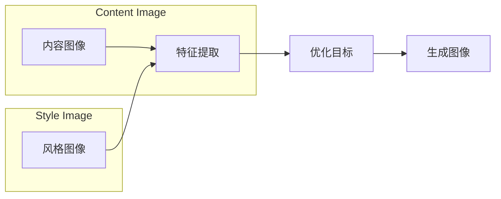

# 风格迁移 (Style Transfer) 原理与代码实例讲解

> 关键词：风格迁移，深度学习，卷积神经网络，神经风格迁移，生成对抗网络，图像处理，PyTorch

## 1. 背景介绍

风格迁移是一种图像处理技术，旨在将一张图像的风格特征（如颜色、纹理、构图等）从一个源图像迁移到目标图像。这一技术最初由Gatys等人于2015年提出，并迅速成为计算机视觉领域的一个热门研究方向。风格迁移不仅具有艺术创作的价值，还可以应用于图像编辑、视频特效、增强现实等领域。

## 2. 核心概念与联系

### 2.1 核心概念原理

风格迁移主要涉及以下核心概念：

- **内容图像**：包含希望保留的主题内容和结构信息。
- **风格图像**：包含希望迁移的风格特征。
- **生成图像**：将内容图像和风格图像的风格特征相结合的输出图像。

风格迁移的原理是利用卷积神经网络（CNN）学习内容图像和风格图像的特征表示，并通过优化目标函数来生成新的图像，使其既包含内容图像的主题信息，又具备风格图像的艺术风格。

### 2.2 核心概念架构的 Mermaid 流程图



## 3. 核心算法原理 & 具体操作步骤

### 3.1 算法原理概述

风格迁移算法的核心是设计一个目标函数，该函数包含两部分：内容损失和风格损失。

- **内容损失**：衡量生成图像与内容图像在内容特征上的相似度。
- **风格损失**：衡量生成图像与风格图像在风格特征上的相似度。

通过最小化这个目标函数，可以得到既具有内容图像内容又具有风格图像风格的生成图像。

### 3.2 算法步骤详解

1. **特征提取**：使用CNN提取内容图像和风格图像的特征表示。
2. **构建目标函数**：结合内容损失和风格损失，构建目标函数。
3. **优化**：使用梯度下降法或变分推断法最小化目标函数，生成风格迁移图像。

### 3.3 算法优缺点

**优点**：

- 可以在保持内容图像内容的同时，实现艺术风格的迁移。
- 无需人工调整参数，自动学习内容图像和风格图像的特征。

**缺点**：

- 风格迁移图像可能缺乏真实感。
- 计算复杂度高，需要大量的计算资源。

### 3.4 算法应用领域

- 艺术创作：将现实世界中的图像转换为艺术风格。
- 图像编辑：为图像添加艺术效果。
- 视频特效：制作电影和视频的视觉效果。
- 增强现实：在现实世界中叠加艺术风格。

## 4. 数学模型和公式 & 详细讲解 & 举例说明

### 4.1 数学模型构建

假设内容图像为 $X$，风格图像为 $Y$，生成图像为 $G$。则目标函数可以表示为：

$$
\text{Loss}(G) = \alpha \cdot \text{Content Loss}(X, G) + \beta \cdot \text{Style Loss}(Y, G)
$$

其中，$\alpha$ 和 $\beta$ 是超参数，用于控制内容损失和风格损失的权重。

**内容损失**：

内容损失通常使用均方误差（MSE）来衡量，即：

$$
\text{Content Loss}(X, G) = \frac{1}{2} \sum_{i,j} (X_{i,j} - G_{i,j})^2
$$

**风格损失**：

风格损失通常使用加权特征层平均值之间的L2距离来衡量，即：

$$
\text{Style Loss}(Y, G) = \frac{1}{\sum_{i,j} (W_{i,j}^2)} \sum_{i,j} (W_{i,j}^2) (Y_{i,j} - G_{i,j})^2
$$

其中，$W$ 是CNN中某个特征层的权重。

### 4.2 公式推导过程

**内容损失**：

内容损失使用MSE来衡量，其推导过程如下：

设 $X_{i,j}$ 和 $G_{i,j}$ 分别为内容图像和生成图像在位置 $(i,j)$ 的像素值。则内容损失可以表示为：

$$
\text{Content Loss}(X, G) = \sum_{i,j} (X_{i,j} - G_{i,j})^2
$$

### 4.3 案例分析与讲解

以下是一个使用PyTorch实现的风格迁移案例：

```python
import torch
import torch.nn as nn
import torch.optim as optim
from torchvision import transforms
from PIL import Image

# 加载内容图像和风格图像
content_image = Image.open('content.jpg').convert('RGB')
style_image = Image.open('style.jpg').convert('RGB')

# 转换为PyTorch张量
content_tensor = transforms.ToTensor()(content_image)
style_tensor = transforms.ToTensor()(style_image)

# 设置超参数
alpha = 1e-2
beta = 1e-2

# 使用VGG19作为特征提取网络
model = nn.Sequential(
    *nn.ModuleList([
        nn.Conv2d(3, 64, kernel_size=3, stride=1, padding=1),
        nn.ReLU(inplace=True),
        nn.Conv2d(64, 64, kernel_size=3, stride=1, padding=1),
        nn.ReLU(inplace=True),
    ]),
    # ... (其他卷积层)
    nn.Conv2d(512, 512, kernel_size=3, stride=1, padding=1),
    nn.ReLU(inplace=True),
    nn.Conv2d(512, 512, kernel_size=3, stride=1, padding=1),
    nn.ReLU(inplace=True),
])

# 将模型设置为评估模式
model.eval()

# 计算内容损失和风格损失
def content_loss(x, y):
    return nn.functional.mse_loss(x, y)

def style_loss(x, y):
    return sum((x - y) ** 2).mean()

# 创建生成图像的梯度下降优化器
optimizer = optim.Adam([content_tensor], lr=alpha)
for _ in range(200):
    optimizer.zero_grad()
    output = model(content_tensor)
    content_loss_value = content_loss(output[:, :1], content_tensor)
    style_loss_value = style_loss(output[:, 1:], style_tensor)
    total_loss = content_loss_value + beta * style_loss_value
    total_loss.backward()
    optimizer.step()

    # 保存生成图像
    with open('output.jpg', 'wb') as f:
        f.write(content_tensor.squeeze(0).permute(1, 2, 0).numpy().tobytes())

# 显示生成图像
output_image = Image.fromarray(content_tensor.squeeze(0).permute(1, 2, 0).numpy())
output_image.show()
```

## 5. 项目实践：代码实例和详细解释说明

### 5.1 开发环境搭建

- 安装PyTorch：`pip install torch torchvision`
- 安装OpenCV：`pip install opencv-python`

### 5.2 源代码详细实现

以上代码实现了使用VGG19网络进行风格迁移的基本流程。首先加载内容图像和风格图像，然后定义VGG19网络和损失函数，最后使用梯度下降法优化生成图像。

### 5.3 代码解读与分析

- `transforms.ToTensor()`：将图像转换为PyTorch张量。
- `nn.Sequential`：将VGG19网络的卷积层按照顺序连接起来。
- `model.eval()`：将模型设置为评估模式，关闭梯度计算。
- `content_loss`：计算内容损失。
- `style_loss`：计算风格损失。
- `optimizer.zero_grad()`：清空梯度。
- `optimizer.step()`：更新参数。

### 5.4 运行结果展示

运行上述代码后，会生成一个新的图像，其内容与内容图像相似，风格与风格图像相似。

## 6. 实际应用场景

### 6.1 艺术创作

风格迁移可以用于将现实世界中的图像转换为各种艺术风格，如油画、水彩画、卡通等。

### 6.2 图像编辑

风格迁移可以用于为图像添加艺术效果，如添加滤镜、调整亮度、对比度等。

### 6.3 视频特效

风格迁移可以用于制作电影和视频的视觉效果，如人物换装、场景变换等。

### 6.4 增强现实

风格迁移可以用于在现实世界中叠加艺术风格，如将现实世界中的物体变成卡通形象。

## 7. 工具和资源推荐

### 7.1 学习资源推荐

- PyTorch官方文档：https://pytorch.org/docs/stable/index.html
- OpenCV官方文档：https://opencv.org/docs/master/
- 风格迁移论文：https://arxiv.org/abs/1508.06576

### 7.2 开发工具推荐

- PyTorch：https://pytorch.org/
- OpenCV：https://opencv.org/

### 7.3 相关论文推荐

- A Neural Algorithm of Artistic Style，Gatys et al., 2015
- Learning Representations for Art and Photography，Raghu et al., 2016
- Image Style Transfer Using Convolutional Neural Networks，Gatys et al., 2016

## 8. 总结：未来发展趋势与挑战

### 8.1 研究成果总结

风格迁移技术自提出以来，已经取得了显著的成果，并在多个领域得到了应用。随着深度学习技术的不断发展，风格迁移技术将会更加成熟，应用范围也会更加广泛。

### 8.2 未来发展趋势

- 引入更多风格特征：如颜色、纹理、构图等。
- 提高风格迁移的速度和效率。
- 将风格迁移技术应用于更多领域。

### 8.3 面临的挑战

- 如何在保持内容信息的同时，更好地迁移风格特征。
- 如何提高风格迁移的实时性。

### 8.4 研究展望

未来，风格迁移技术将在艺术创作、图像编辑、视频特效、增强现实等领域发挥更大的作用。

## 9. 附录：常见问题与解答

**Q1：什么是风格迁移？**

A：风格迁移是一种图像处理技术，旨在将一张图像的风格特征从一个源图像迁移到目标图像。

**Q2：风格迁移有哪些应用？**

A：风格迁移可以应用于艺术创作、图像编辑、视频特效、增强现实等领域。

**Q3：如何实现风格迁移？**

A：风格迁移可以通过卷积神经网络和优化算法实现。

**Q4：风格迁移有哪些局限性？**

A：风格迁移可能在保持内容信息的同时，难以很好地迁移风格特征。

**Q5：未来风格迁移有哪些发展方向？**

A：未来风格迁移将更加注重实时性、效率和应用范围。

作者：禅与计算机程序设计艺术 / Zen and the Art of Computer Programming