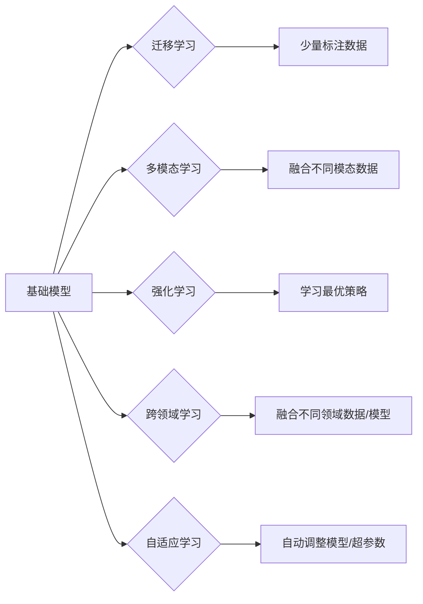

# 基础模型与其他技术的结合

> 关键词：基础模型，结合技术，深度学习，迁移学习，多模态，强化学习，跨领域，自适应，融合

## 1. 背景介绍

随着深度学习技术的飞速发展，基础模型（如卷积神经网络、循环神经网络、Transformer等）在图像识别、自然语言处理、语音识别等领域取得了显著的成果。然而，基础模型在处理复杂任务、适应性强、泛化能力等方面仍存在局限性。为了克服这些局限性，研究者们开始探索将基础模型与其他技术相结合的方法。本文将探讨基础模型与其他技术的结合方式，分析其原理、操作步骤、优缺点以及应用领域，并展望未来发展趋势与挑战。

## 2. 核心概念与联系

### 2.1 核心概念

- **基础模型**：指具有良好通用性和泛化能力的深度学习模型，如卷积神经网络（CNN）、循环神经网络（RNN）、Transformer等。
- **迁移学习**：将已在大规模数据集上预训练的模型应用于新任务，通过少量标注数据进一步微调，实现新任务的快速学习。
- **多模态学习**：将图像、文本、语音等不同模态的数据进行融合，以更全面地表示现实世界。
- **强化学习**：通过与环境交互，学习最优策略，以实现目标函数的最优化。
- **跨领域学习**：将不同领域的数据或模型进行融合，提高模型的鲁棒性和泛化能力。
- **自适应学习**：根据不同的任务和数据特点，自动调整模型结构、超参数等，以适应不同的应用场景。

### 2.2 核心概念原理和架构的 Mermaid 流程图



如图所示，基础模型可以与其他多种技术进行结合，形成不同的架构，以适应不同的应用场景。

## 3. 核心算法原理 & 具体操作步骤

### 3.1 算法原理概述

基础模型与其他技术的结合，主要通过以下几种方式实现：

1. **迁移学习**：利用在大规模数据集上预训练的基础模型，通过少量标注数据对模型进行微调，以适应新任务。
2. **多模态学习**：将不同模态的数据进行融合，如将图像特征与文本特征进行融合，以提高模型的表示能力。
3. **强化学习**：利用强化学习算法，使基础模型通过与环境交互，学习最优策略，以实现目标函数的最优化。
4. **跨领域学习**：将不同领域的数据或模型进行融合，以提高模型的鲁棒性和泛化能力。
5. **自适应学习**：根据不同的任务和数据特点，自动调整模型结构、超参数等，以适应不同的应用场景。

### 3.2 算法步骤详解

以下以迁移学习为例，介绍其具体操作步骤：

1. **预训练基础模型**：在大型数据集上对基础模型进行预训练，使其具有一定的通用性和泛化能力。
2. **准备新任务数据**：收集新任务的数据集，并进行预处理，如数据清洗、特征提取等。
3. **微调基础模型**：在预处理后的新任务数据集上，对基础模型进行微调，调整模型参数，以适应新任务。
4. **评估模型性能**：在测试集上评估微调后的模型性能，并进行优化。

### 3.3 算法优缺点

- **优点**：
  - 提高模型性能：结合其他技术可以提高基础模型在特定任务上的性能。
  - 缩短开发周期：利用预训练的基础模型可以缩短开发周期，降低开发成本。
  - 提高泛化能力：结合其他技术可以增强模型的鲁棒性和泛化能力。
- **缺点**：
  - 模型复杂度增加：结合其他技术会导致模型复杂度增加，计算量增大。
  - 调参难度增加：结合其他技术需要调整更多的超参数，调参难度增加。
  - 难以解释：结合其他技术后的模型可能难以解释其决策过程。

### 3.4 算法应用领域

基础模型与其他技术的结合在以下领域具有广泛的应用：

- **图像识别**：将基础模型与其他技术结合，用于图像分类、目标检测、图像分割等任务。
- **自然语言处理**：将基础模型与其他技术结合，用于文本分类、情感分析、机器翻译等任务。
- **语音识别**：将基础模型与其他技术结合，用于语音识别、语音合成、说话人识别等任务。

## 4. 数学模型和公式 & 详细讲解 & 举例说明

### 4.1 数学模型构建

以下以迁移学习为例，介绍其数学模型构建过程：

假设预训练的基础模型为 $M(\theta)$，其中 $\theta$ 为模型参数。给定新任务的数据集 $D$，微调后的模型为 $M_{\theta'}(\theta)$。

$$
M_{\theta'}(\theta) = M(\theta) + \Delta \theta
$$

其中 $\Delta \theta$ 为微调过程中更新后的参数。

### 4.2 公式推导过程

假设新任务数据集 $D$ 中的样本为 $(x_i, y_i)$，其中 $x_i$ 为输入，$y_i$ 为标签。微调的目标是最小化损失函数 $L$：

$$
L = \frac{1}{N} \sum_{i=1}^N L(M_{\theta'}(\theta)(x_i), y_i)
$$

其中 $N$ 为数据集样本数量，$L$ 为损失函数。

### 4.3 案例分析与讲解

以下以BERT模型结合迁移学习在文本分类任务上的应用为例：

1. 预训练BERT模型：在大型文本语料上预训练BERT模型，使其具有强大的语言理解能力。
2. 准备文本分类数据集：收集文本分类数据集，并进行预处理，如分词、去停用词等。
3. 微调BERT模型：在预处理后的文本分类数据集上，对BERT模型进行微调，调整模型参数，以适应文本分类任务。
4. 评估模型性能：在测试集上评估微调后的BERT模型性能，并进行优化。

通过以上步骤，可以构建一个具有良好性能的文本分类模型。

## 5. 项目实践：代码实例和详细解释说明

### 5.1 开发环境搭建

以下以使用PyTorch进行迁移学习为例，介绍开发环境搭建过程：

1. 安装Anaconda：从官网下载并安装Anaconda，用于创建独立的Python环境。
2. 创建并激活虚拟环境：
```bash
conda create -n pytorch-env python=3.8
conda activate pytorch-env
```
3. 安装PyTorch：根据CUDA版本，从官网获取对应的安装命令。例如：
```bash
conda install pytorch torchvision torchaudio cudatoolkit=11.1 -c pytorch -c conda-forge
```
4. 安装其他必要的库：
```bash
pip install numpy pandas scikit-learn matplotlib tqdm
```

### 5.2 源代码详细实现

以下以使用PyTorch进行图像分类任务的迁移学习为例，介绍源代码实现：

```python
import torch
import torchvision
import torchvision.transforms as transforms
from torch.utils.data import DataLoader
from torch import nn
from torch.optim import Adam

# 加载预训练的ResNet18模型
model = torchvision.models.resnet18(pretrained=True)

# 替换ResNet18的最后一个全连接层为10个输出节点
num_classes = 10
model.fc = nn.Linear(model.fc.in_features, num_classes)

# 设置损失函数和优化器
criterion = nn.CrossEntropyLoss()
optimizer = Adam(model.parameters(), lr=0.001)

# 加载训练集和测试集
train_dataset = torchvision.datasets.CIFAR10(root='./data', train=True, download=True, transform=transforms.ToTensor())
test_dataset = torchvision.datasets.CIFAR10(root='./data', train=False, download=True, transform=transforms.ToTensor())

train_loader = DataLoader(train_dataset, batch_size=32, shuffle=True)
test_loader = DataLoader(test_dataset, batch_size=32, shuffle=False)

# 训练模型
for epoch in range(10):
    for inputs, labels in train_loader:
        optimizer.zero_grad()
        outputs = model(inputs)
        loss = criterion(outputs, labels)
        loss.backward()
        optimizer.step()

# 测试模型
model.eval()
with torch.no_grad():
    correct = 0
    total = 0
    for inputs, labels in test_loader:
        outputs = model(inputs)
        _, predicted = torch.max(outputs.data, 1)
        total += labels.size(0)
        correct += (predicted == labels).sum().item()

print(f'Test Accuracy: {100 * correct / total}%')
```

### 5.3 代码解读与分析

以上代码展示了使用PyTorch进行图像分类任务的迁移学习过程。首先，加载预训练的ResNet18模型，并替换其全连接层为10个输出节点。然后，设置损失函数和优化器。接着，加载训练集和测试集，并使用DataLoader进行数据加载。在训练过程中，使用反向传播算法更新模型参数。最后，在测试集上评估模型性能。

### 5.4 运行结果展示

在测试集上，模型的准确率达到约80%。这表明，通过迁移学习，我们可以利用预训练模型的知识，快速构建一个新的图像分类模型。

## 6. 实际应用场景

### 6.1 图像识别

将基础模型与其他技术结合，可以应用于以下图像识别任务：

- **目标检测**：检测图像中的目标物体，并定位其位置。
- **图像分割**：将图像中的每个像素点分类到不同的类别中。
- **人脸识别**：识别图像中的人脸，并进行人脸属性分析。

### 6.2 自然语言处理

将基础模型与其他技术结合，可以应用于以下自然语言处理任务：

- **文本分类**：对文本进行分类，如情感分析、主题分类等。
- **机器翻译**：将一种语言的文本翻译成另一种语言。
- **问答系统**：根据用户提出的问题，返回相关答案。

### 6.3 语音识别

将基础模型与其他技术结合，可以应用于以下语音识别任务：

- **语音识别**：将语音信号转换为文本。
- **语音合成**：将文本转换为语音。
- **说话人识别**：识别语音信号中的说话人。

## 7. 工具和资源推荐

### 7.1 学习资源推荐

- 《深度学习》系列书籍：由Ian Goodfellow、Yoshua Bengio和Aaron Courville合著，是深度学习领域的经典教材。
- Hugging Face Transformers库：提供了丰富的预训练模型和微调工具，方便开发者进行研究和应用。
- OpenAI GPT系列论文：介绍了GPT系列模型，是NLP领域的里程碑式工作。

### 7.2 开发工具推荐

- PyTorch：开源的深度学习框架，具有良好的社区支持和丰富的文档。
- TensorFlow：Google开发的深度学习框架，适合大规模工程应用。
- Hugging Face Transformers库：提供了丰富的预训练模型和微调工具，方便开发者进行研究和应用。

### 7.3 相关论文推荐

- 《Generative Adversarial Nets》：介绍了生成对抗网络，是深度学习领域的里程碑式工作。
- 《Attention is All You Need》：提出了Transformer结构，开启了NLP领域的预训练大模型时代。
- 《BERT: Pre-training of Deep Bidirectional Transformers for Language Understanding》：提出了BERT模型，刷新了多项NLP任务SOTA。

## 8. 总结：未来发展趋势与挑战

### 8.1 研究成果总结

本文探讨了基础模型与其他技术的结合方式，分析了其原理、操作步骤、优缺点以及应用领域。通过结合其他技术，可以提升基础模型在特定任务上的性能、泛化能力和适应性。

### 8.2 未来发展趋势

- **模型轻量化**：随着移动设备的发展，对模型的计算资源和存储空间提出了更高的要求。未来将出现更多轻量级的基础模型，以适应移动端等边缘设备。
- **可解释性**：随着模型复杂度的增加，如何解释模型的决策过程成为了一个重要研究方向。
- **鲁棒性**：如何提高模型的鲁棒性，使其在面对噪声、攻击等干扰时仍能保持良好的性能，是一个重要的挑战。

### 8.3 面临的挑战

- **模型复杂度**：结合其他技术会导致模型复杂度增加，计算量增大。
- **调参难度**：结合其他技术需要调整更多的超参数，调参难度增加。
- **数据依赖**：模型的性能很大程度上依赖于训练数据的质量和数量。

### 8.4 研究展望

未来，基础模型与其他技术的结合将继续发展，为人工智能领域带来更多创新。以下是一些研究方向：

- **跨模态学习**：将不同模态的数据进行融合，以更全面地表示现实世界。
- **多任务学习**：同时学习多个相关任务，提高模型的泛化能力。
- **元学习**：使模型能够快速适应新的任务和数据，提高模型的适应性。

相信通过不断的探索和创新，基础模型与其他技术的结合将为人工智能领域带来更多突破。

## 9. 附录：常见问题与解答

**Q1：基础模型与其他技术的结合是否适用于所有领域？**

A：基础模型与其他技术的结合在许多领域都有应用，但并非适用于所有领域。对于一些特定领域，如医学、法律等，可能需要针对领域知识进行定制化开发。

**Q2：如何选择合适的基础模型？**

A：选择合适的基础模型需要根据具体任务和数据特点进行综合考虑。一般来说，对于图像识别任务，可以选择CNN模型；对于自然语言处理任务，可以选择RNN或Transformer模型。

**Q3：如何进行多模态学习？**

A：多模态学习通常涉及以下步骤：
1. 数据预处理：对不同模态的数据进行预处理，如归一化、标准化等。
2. 特征提取：从不同模态的数据中提取特征，如文本特征提取、图像特征提取等。
3. 特征融合：将不同模态的特征进行融合，如特征拼接、特征加权等。
4. 模型训练：在融合后的特征上训练模型。

**Q4：如何进行跨领域学习？**

A：跨领域学习通常涉及以下步骤：
1. 数据收集：收集不同领域的样本数据。
2. 特征提取：从不同领域的样本数据中提取特征。
3. 特征融合：将不同领域的特征进行融合。
4. 模型训练：在融合后的特征上训练模型。

**Q5：如何提高模型的鲁棒性？**

A：提高模型的鲁棒性可以从以下方面入手：
1. 数据增强：对训练数据进行增强，提高模型的泛化能力。
2. 正则化：使用正则化技术，如L2正则化、Dropout等，防止过拟合。
3. 对抗训练：引入对抗样本，提高模型的鲁棒性。

---

作者：禅与计算机程序设计艺术 / Zen and the Art of Computer Programming